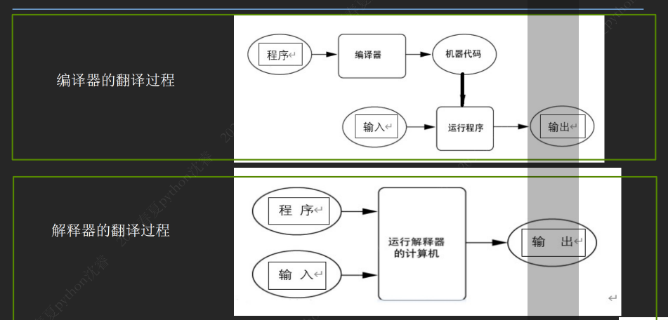

# Python语言概述

## 目录

1. [计算的本质与思维](#1-计算的本质与思维)
2. [数据表示](#2-数据表示)
3. [计算模型与硬件核心](#3-计算模型与硬件核心)
4. [智能时代的计算范式](#4-智能时代的计算范式)
5. [编程语言分类与翻译方式](#5-编程语言分类与翻译方式)
6. [Python语言简介](#6-python语言简介)
7. [Python编程环境配置](#7-python编程环境配置)
8. [Python基础编程](#8-python基础编程)
9. [本章总结](#本章总结)

---

## 1. 计算的本质与思维

### 1.1 什么是计算？

**计算的本质**：根据明确规则或算法，对输入数据进行转换处理并产生输出的过程。

**经典模型（IPO模型）**：
- **I**nput（输入）：接收外部数据
- **P**rocess（处理）：按照规则转换数据
- **O**utput（输出）：产生结果

!!! example IPO模型示例

```
输入(Inputs) → 处理(Process) → 输出(Output)
   数据        算法/规则        结果
```

!!!

### 1.2 计算思维

**定义**：像计算机科学家一样思考，解决复杂问题的能力

**核心要素**：

1. **分解**：将大问题拆解为小问题
2. **模式识别**：寻找规律与趋势
3. **抽象**：聚焦关键，忽略细节
4. **算法**：设计精确的执行序列

---

## 2. 数据表示

### 2.1 二进制：计算机的母语

所有数据（数值、字符、音频、图像、视频）、指令均以**二进制（0和1）**形式存储和处理。

**基础单位**：
- **位（Bit）**：最小单位，0 或 1
- **字节（Byte）**：基本存储单位，1 Byte = 8 Bits

**进阶单位**：
- KB, MB, GB, TB（按1024换算）

$$1\text{ KB} = 1024\text{ Bytes}$$
$$1\text{ MB} = 1024\text{ KB}$$
$$1\text{ GB} = 1024\text{ MB}$$
$$1\text{ TB} = 1024\text{ GB}$$

### 2.2 现实世界的数字化抽象

- **数值数据**：整数（精确）与浮点数（近似）
- **符号数据**：字符编码（ASCII, Unicode）与字符串
- **结构化数据**：列表（顺序）与字典（映射）
- **多媒体数据**：图像（像素矩阵）与声音（采样量化）

!!! warning
- `Unicode`编码可以对世界上所有可以书写的文字进行编码
- `ASCII`编码只能对英文字符进行编码
!!!

---

## 3. 计算模型与硬件核心

### 3.1 存储器的层次结构

**程序与数据的加载流程**：

```
外存 → 内存 → 缓存 → 寄存器
```

| 存储类型 | 特点 |
|---------|------|
| 外存（硬盘、SSD） | 长期存储程序和数据，容量大但速度慢 |
| 内存（RAM） | 临时存储运行中的程序和数据，速度快于外存 |
| CPU寄存器 | 直接参与运算，速度最快但容量极小 |

**程序存储原理（冯·诺依曼体系）**：
- 程序与数据共同存储于内存，按需加载到CPU执行

**缓存机制**：
- 通过多级缓存（L1/L2/L3）减少CPU与内存的速度差异
- **局部性原理**：
  - 时间局部性（重复访问）
  - 空间局部性（邻近访问）

### 3.2 指令执行流程

1. **取指令**：从内存中读取当前指令
2. **解码指令**：分析操作码和操作数
3. **执行指令**：完成运算或数据传输
4. **更新程序计数器（PC）**：指向下一条指令地址

**标志寄存器（Flag Register）**：
- 存储逻辑/算术运算的结果状态（如零标志位ZF、进位标志位CF）

**跳转指令（JMP）**：
- 无条件跳转：直接修改程序计数器（PC）到目标地址
- 条件跳转：根据标志寄存器状态决定是否跳转

---

## 4. 智能时代的计算范式

### 4.1 从"命令式"到"智能计算"

| 传统计算 | 智能计算 |
|---------|---------|
| 人类定义规则，机器严格执行 | 机器从海量数据中学习规律，自适应决策 |

**智能计算领域**：
- 机器学习
- 深度学习
- 自然语言处理
- 计算机视觉

### 4.2 驱动智能的"三驾马车"

1. **数据**：训练模型的"燃料"
2. **算法**：解决问题的"方法"
3. **算力**：高效处理的"引擎"

---

## 5. 编程语言分类与翻译方式

### 5.1 编程语言分类

| 类型 | 特点 | 示例 |
|-----|------|------|
| 机器语言 | 二进制指令，直接由CPU执行 | 00101010 11001101 |
| 汇编语言 | 用助记符表示机器指令，需汇编器翻译 | MOV AX, 5 |
| 高级语言 | 接近自然语言，需编译器/解释器翻译 | Python、Java、C |

**按范式分类**：

| 范式 | 核心思想 | 示例语言 |
|-----|---------|---------|
| 面向过程 | 以步骤为中心，强调函数调用和流程控制 | C、Pascal |
| 面向对象 | 以对象为中心，强调封装、继承和多态 | Java、Python、C++ |
| 函数式 | 以数学函数为核心，避免状态和可变数据 | Haskell、Lisp、Scala |
| 脚本语言 | 动态解释执行，适合快速开发和小任务 | Python、JavaScript |

### 5.2 高级语言翻译方式

**编译方式**：
- 将源程序一次性转换为目标代码（如机器码），生成可独立运行的程序
- 执行流程：**语法检查 → 转换目标代码 → 连接（链接）外部功能**
- 优点：可脱离开发环境直接运行（如C/C++编译后的.exe文件）

**解释方式**：
- 通过解释器逐行读取并执行代码，不生成独立的目标程序
- 依赖解释器环境（如Python、JavaScript、Basic）
- 执行流程：**解释器逐行读取代码 → 实时执行 → 输出结果**

!!! warning 编译 vs 解释

编译型语言运行**速度快**，但修改代码后需要**重新编译**；解释型语言**修改方便**，但**运行速度相对较慢**。

!!!



!!! note "编程语言的核心要素"
**数据+流程控制**

- 数据
  - 定义：数据是程序处理的信息。它可以是输入数据、输出数据或在程序执行过程中产生的中间数据
  - 作用：数据是程序操作的对象，程序通过处理数据来实现特定的功能
- 流程控制
  - 定义：流程控制指的是程序中决定执行顺序的逻辑结构
  - 作用：流程控制决定了程序如何操作数据，以及在什么条件下执行特定的代码块
!!! 

---

## 6. Python语言简介

### 6.1 Python在AI领域的优势与地位

- **易学易用**：语法简洁，适合初学者和专业人士
- **易于扩展和维护**：代码可读性强，社区支持强大
- **强大的库和框架**：NumPy, Pandas, Scikit-learn, TensorFlow, PyTorch等
- **跨平台兼容**：Windows, Linux, Mac OS等

!!! example Python AI生态系统

```python
# 数据处理
import numpy as np
import pandas as pd

# 机器学习
from sklearn import tree

# 深度学习
import torch
import tensorflow as tf
```

!!!

---

## 7. Python编程环境配置

### 7.1 环境配置概述

- **Python解释器**：负责执行程序
- **VS Code**：负责编辑和组织代码
- **AI扩展**：负责提供智能辅助

### 7.2 安装Python解释器

要让计算机执行Python程序，首先需要安装Python解释器。

- **官网**：www.python.org
- **下载安装注意点**：
  1. 根据操作系统选择版本
  2. 选择稳定版本（stable）
  3. 安装时一般可用缺省安装（install now）
  4. **一定将Add path打上勾**

**验证安装是否成功**：
```bash
python --version
# 或
python3 --version
```

### 7.3 IDLE介绍

**IDLE**（Integrated Development and Learning Environment）是随Python官方发行版一同提供的集成开发环境。

- 安装Python时会自动安装，无需额外配置
- 提供代码编辑、交互式运行窗口以及基础调试功能
- 适合初学者进行学习和简单程序开发

### 7.4 安装VS Code

微软推出的开源跨平台的代码编辑器，基于插件的可扩展开发平台。

- **下载安装**：访问 VS Code 官方网站：https://code.visualstudio.com/Download
- **本地化与基础配置**：启动VS Code，点击窗口左侧活动栏中的"扩展"图标，安装中文、Python的扩展包

### 7.5 安装AI助手

常见的AI扩展：
- 微软的Copilot
- 阿里的Lingma
- 百度的Comate
- 智谱的CodeGeex

!!! tips AI助手的作用

AI助手可以作为"可交互的参考工具"，帮助初学者理解代码逻辑、进行代码补全以及排查错误。

!!!

---

## 8. Python基础编程

### 8.1 IPO模型实践

**简单的交互程序**：

```python
# 输入
name = input("请输入名字：")

# 处理
greeting = f"{name}，你好！欢迎学习Python！"

# 输出
print(greeting)
```

### 8.2 input()函数：实现输入

**函数工作机制**：
1. 显示提示（可选）：括号内字符串，如 "请输入名字："
2. 暂停等待：程序挂起，光标闪烁，等待用户回车
3. 捕获数据：获取回车前所有字符
4. 返回结果：**一律返回字符串类型（str）**

!!! attention 关键点

无论用户输入数字还是文字，**input()返回值永远是字符串**。如果需要数值类型，需要进行类型转换。

!!!

**类型转换示例**：
```python
# 转换为整数
age = int(input("请输入年龄："))

# 转换为浮点数
price = float(input("请输入价格："))
```

### 8.3 变量：数据的标签

**Python变量是标签，不是盒子**：

- **≠ 盒子**：不同于C语言的"存储容器"
- **是标签**：Python变量是贴在数据对象上的**引用（Reference）**

**赋值操作**：
```python
name = input("请输入名字：")
```
意味着将name标签贴在输入的数据对象上。

**命名规则**：
- 字母/数字/下划线；不能数字开头
- 区分大小写
- 禁用关键字

**PEP 8社区规范**：
| 类型 | 命名规范 | 示例 |
|-----|---------|------|
| 变量 | 蛇形命名法（小写+下划线） | total_score, user_age |
| 常量 | 全大写字母 | MAX_CONNECTIONS |
| 私有变量 | 单下划线开头 | _internal_var |

!!! tips AI协作建议

命名应**见名知意**。避免使用x, temp等无意义名称。当面对复杂业务逻辑，不确定如何命名才能既规范又达意时，可利用AI助手获取符合工程惯例的建议。

!!!

### 8.4 print()函数：实现输出

**函数工作机制**：
- 参数灵活：可输出字符串、数字、变量、表达式
- 默认格式：多参数间自动加空格，行末自动加换行符（\n）
- 自定义格式：通过sep（分隔符）和end（结束符）调整

```python
print("Hello", "World", sep=',', end='!')
# 输出: Hello,World!
```

**进阶推荐：f-string（Python 3.6+）**：
- 语法：字符串前加f，内部用{}嵌入变量或表达式
- 优势：简洁、优雅、官方首选

```python
name = "李华"
print(f"{name}你好，欢迎学习Python!")
# 输出: 李华你好，欢迎学习Python!
```

### 8.5 温度转换器实例

**背景描述**：
- **摄氏度**：以1标准大气压下水的结冰点为0度，沸点为100度（100等分）
- **华氏度**：以1标准大气压下水的结冰点为32度，沸点为212度（180等分）

**任务描述**：编写程序实现华氏、摄氏温度的转换

**IPO模型分析**：
- 输入：华氏温度值 f
- 处理：温度转化算法 $c = (f - 32) \times 5 / 9$
- 输出：摄氏温度值 c

**代码实现**：
```python
# 温度转换器
f = input("请输入华氏温度：")
f = float(f)  # 将字符串转换为浮点数
c = (f - 32) * 5 / 9
print(f"对应的摄氏温度为：{c:.2f}度")
```

!!! example 运行示例

```
请输入华氏温度：60
对应的摄氏温度为：15.56度
```

!!!

!!! warning 常见错误

如果直接进行计算而忘记类型转换，会出现TypeError错误：

```python
# 错误示例
f = input("请输入华氏温度：")  # f是字符串"60"
c = (f - 32) * 5 / 9  # TypeError: unsupported operand type(s) for -: 'str' and 'int'

# 正确做法
f = float(input("请输入华氏温度："))  # 先转换为浮点数
c = (f - 32) * 5 / 9
```

!!!

### 8.6 课堂练习

**练习1：文字贺卡**
```python
# 提示用户输入收卡人的名字
name = input("请输入收卡人姓名：")

# 提示用户输入祝福语
message = input("请输入祝福语：")

# 输出贺卡
print(f"""
╔══════════════════════════════╗
║     🎀 贺卡 🎀                ║
║                              ║
║  亲爱的 {name}：               ║
║                              ║
║  {message}                   ║
║                              ║
║  祝您幸福快乐！                 ║
║                              ║
╚══════════════════════════════╝
""")
```

**练习2：文具店购物计算**
```python
# 提示用户输入铅笔的单价
price = float(input("请输入铅笔的单价（单位：元）："))

# 提示用户输入购买数量
quantity = int(input("请输入购买数量："))

# 计算总价
total = price * quantity

# 输出结果
print(f"您本次消费总额为：{total} 元")
```

---

## 本章总结

本章主要介绍了以下内容：

1. **计算的本质与计算思维**：IPO模型、分解、模式识别、抽象、算法
2. **数据表示**：二进制、存储单位、数字化抽象
3. **硬件体系与存储层次**：冯·诺依曼体系、缓存机制、局部性原理
4. **编程语言分类与翻译方式**：编译vs解释、各类编程范式
5. **Python语言核心要素**
6. **编程规范与实践**：

!!! note 关键知识点

- **缩进**：Python唯一标明代码层次关系的手段，通常为4个空格
- **注释**：单行注释用#，多行注释用三个单引号'''或三个双引号"""
- **常用函数**：
  - input()：接收输入（永远返回字符串类型）
  - print()：实现输出（推荐使用f-string格式化）

!!!

---

## 参考资料

- Python官方网站：https://www.python.org
- VS Code下载：https://code.visualstudio.com/Download
- PEP 8 Python代码风格指南：https://pep8.org/
