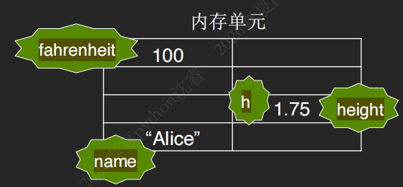
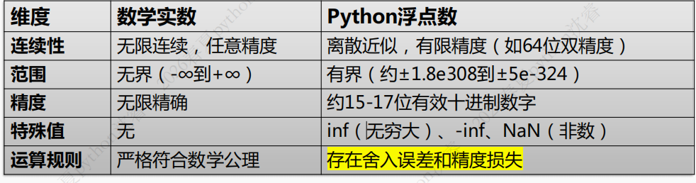
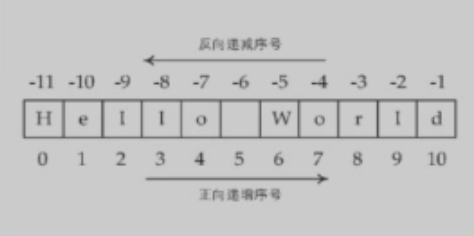

# 第二章 Python 基本数据类型及表达式

## 本章学习目标

### 知识目标
- 掌握 Python 中数据、对象、变量三者的关系。理解变量是"引用/标签"而非"存储空间"
- 认识并区分 Python 常见的数字类型 (int, float, complex, bool)
- 掌握标识符的命名规则及关键字（保留字）
- 理解算术运算符的种类、优先级和混合运算规则

### 能力目标
- 能够使用 id() 函数验证对象在内存中的位置，理解变量引用的机制
- 熟练应用各种运算符解决问题，如：地板除 (//) 和取模 (%) 运算符号解决时长转换
- 掌握并应用 f-string 进行高效、精准的字符串格式化输出
- 实现程序的基本输入 (input) 和输出 (print) 功能

---

## 1. 基本概念

### 1.1 数据、对象、变量

| 概念 | 说明 |
|------|------|
| **数据** | 数字、文字、图形图像和声音等，如：100华氏度，1.75米，"Alice" |
| **对象** | Python 用对象表示数据，如：100、1.75、"Alice" |
| **变量** | 对象的引用，变量本身是没有类型，只有对象才有类型 |

```python
# 示例：变量的本质是引用/标签
fahrenheit = 100    # fahrenheit 是标签，指向对象 100
height = 1.75       # height 是标签，指向对象 1.75
name = "Alice"      # name 是标签，指向对象 "Alice"
```




### 1.2 对象三要素

| 要素 | 说明 | 函数 |
|------|------|------|
| identity | 对象的内存地址 | id() |
| type | 对象类型 | type() |
| value | 对象的值 | 直接查看 |

> 文件存储在外存

### 1.3 主要数据类型

#### 不可变类型（一旦创建，内容不能被修改）


- **整数 int**：如 100, -8, 0
- **浮点数 float**：如 3.14, -9.01
- **复数 complex**：如 2+3j, 8j
- **布尔值 bool**：True / False
- **字符串 str**：如 "Hello"
- **元组 tuple**：如 (1, 2, 3)

#### 可变类型（内容可以在原地修改，无需创建新对象）

> 对象的id不变

- **列表 list**：如 `[1, 2, 3]`
- **集合 set**：如 `{1, 2, 3}`
- **字典 dict**：如 `{"name": "Alice"}`

!!! warning
对不可变对象的任何"修改"操作，实际上是创建一个新对象。
!!!

### 1.4 字面量（Literals）

字面量是直接在代码中**明确表示固定值的语法形式**，字面量的类型由其书写格式决定，Python 会自动识别其数据类型。

---

## 2. 数字类型

### 2.1 整型（int）

Python 的整数类型在逻辑行为上与数学整数高度一致，支持任意大小和精确运算。

| 进制 | 前缀 | 数码 | 示例 |
|------|------|------|------|
| 十进制 | 无 | 0-9 | 123, -8, 0 |
| 二进制 | 0b 或 0B | 0, 1 | 0b101 |
| 八进制 | 0o 或 0O | 0-7 | 0o17 |
| 十六进制 | 0x 或 0X | 0-9, a-f | 0x1FF |

```python
# 进制转换函数
bin(5)        # '0b101'
oct(11)       # '0o13'
hex(29)       # '0x1d'

# 字符串转整数（指定进制）
int('101', 2)    # 5
int('13', 8)     # 11
int('1d', 16)    # 29
```

!!! warning
- 进制转换函数的数据类型是**str**
- 转换以后得数据类型是 **int**
!!!

### 2.2 浮点数（float）

在计算机科学中，Python 的浮点数与数学中的实数在概念上有显著差异：

| 维度 | 数学实数 | Python 浮点数 |
|------|----------|--------------|
| 连续性 | 无限连续，任意精度 | 离散近似，有限精度（如64位双精度） |
| 范围 | 无界 | 有界（约 ±1.8e308 到 ±5e-324） |
| 精度 | 无限精确 | 约 15-17 位有效十进制数字 |

**字面量形式**：
- 小数形式：1.23, 3.14, -9.01
- 科学记数法：1.23e9, 1.2e-5

> **注意**：e 的前后都不能空，e 的后面要整数

```python
float(10)      # 10.0
float("3.14")  # 3.14
```

#### 浮点数误差



- `float()`:将某些类型数据转换成浮点数

在 Python 中，浮点型是基于 IEEE 754 标准 的双精度进行表示。

!!! warning
- 与整数不同，**浮点数存在范围限制，超出会产生溢出错误**
- 不是所有的实数在计算机里都可以精确表达，会存在误差
!!!

```python
# 浮点误差示例
0.1 + 0.2  # 结果是 0.30000000000000004，不是 0.3
```

### 2.3 复数（complex）

复数由实部（real）和虚部（imaginary）两部分组成，虚部用 j 表示。

```python
# 字面量
2 + 3j
8j

# 创建复数
complex(1, 2)  # (1+2j)

# 访问实部和虚部
(1+2j).real   # 1.0 (float)
(1+2j).imag   # 2.0 (float)
```

!!! tip
`complex.real` 和 `complex.imag`返回的类型都是 **float**
!!!

### 2.4 布尔类型（bool）

布尔类型只有两个值：**True** 和 **False**（请注意大小写）

!!! tip
Python3 中，bool 是 int 的子类，**True 等价于 1、False 等价于 0**
!!!

```python
True + 1   # 2
False + 1  # 1
```

---

## 3. 算术表达式

### 3.1 算术运算符

| 运算符 | 示例 | 结果 | 描述 | 优先级 |
|--------|------|------|------|--------|
| ** | 2 ** 3 | 8 | 幂运算，求幂次方 | 1 |
| +、- | -5 | -5 | 正、负号（一元运算符） | 2 |
| * | 7 * 6 | 42 | 乘法 | 3 |
| / | 9 / 2 | 4.5 | 除法 | 3 |
| // | 9 // 2 | 4 | 地板除，取不大于商的最大整数 | 3 |
| % | 10 % 3 | 1 | 取模，求余数 | 3 |
| + | 5 + 2 | 7 | 加法 | 4 |
| - | 10 - 4 | 6 | 减法 | 4 |

> **自动类型转换**：不同类型数据混合运算时，遵循 bool → int → float → complex 的方向自动转换
> 这样做可以保证结果不受精度损失

### 3.2 常用内置函数

| 函数名 | 作用 | 示例 |
|--------|------|------|
| abs(x) | 返回 x 的绝对值 | abs(-5) → 5 |
| divmod(x, y) | 返回 (商, 余数) | divmod(10, 3) → (3, 1) |
| pow(base, exp, mod=None) | 幂运算 | pow(2, 3) → 8; pow(2, 3, 3) → 2 |
| round(number, ndigits=None) | 四舍五入 | round(3.141, 2) → 3.14 |
| max(x1, x2, ...) | 返回最大值 | max(2, 1, 5, 6, 9) → 9 |
| min(x1, x2, ...) | 返回最小值 | min(2, 1, 5, 6, 9) → 1 |

### 3.3 数学模块（math）

```python
import math

# 常用函数
math.sqrt(16)      # 平方根 → 4.0
math.sin(0)        # 正弦
math.cos(0)        # 余弦
math.pi            # 圆周率 π
math.e             # 自然常数 e
math.radians(45)   # 角度转弧度
```

### 3.4 实践项目：时长转换

**任务**：将若干秒转换成小时、分钟、秒


total_seconds = 3850

hours = total_seconds // 3600
remaining_seconds = total_seconds % 3600
minutes = remaining_seconds // 60
seconds = remaining_seconds % 60

print(f"{total_seconds}秒 = {hours}小时{minutes}分{seconds}秒")
# 输出：3850秒 = 1小时4分10秒


### 3.5 实践项目：斜抛运动计算


import math

G = 9.8
v0 = 10
angle_degrees = 45

theta_radians = math.radians(angle_degrees)

# 最大高度
H_max = (v0 * math.sin(theta_radians)) ** 2 / (2 * G)

# 水平射程
R = (v0 ** 2) * math.sin(2 * theta_radians) / G

print(f"最大高度: {H_max:.2f} 米")
print(f"水平射程: {R:.2f} 米")


---

## 4. 字符串

### 4.1 字符串简介

字符串是用引号括起来的一个或多个字符。

**引号包裹方式**：
- 单引号：`'Hello, World!'`
- 双引号：`"It's Python!"`
- 三引号：`"""多行字符串"""`

**字符串特性**：
- **不可变性**：**无法原地修改**对象内容
- **灵活操作**：支持分割、替换、格式化等
- **Unicode 支持**：便于处理**多语言文本**

```python
message = "你好 👋! Hello. こんにちは."
```

### 4.2 创建字符串

```python
# 字面量创建
s1 = 'Hello World'
s2 = "It's Python"

# 三引号（多行字符串）
s3 = """This is the first line.
This is the second line.
This is the third line."""

# str() 函数转换
str(100)        # '100'
str(1.234)     # '1.234'
str([1, 2, 3]) # '[1, 2, 3]'
```

### 4.3 字符串常用操作

#### 获取 

- 功能：从标准输入读取用户输入的一个**字符串**
- 返回值：输入的内容会赋值到一个变量

```python
a = input() 
type(a) # <class 'str'>
```

!!! tip "同行输入多个值"

**功能要求**

- 设置输入提示语，提示用户输入姓名和年龄
- 在一行输入中获得多个值

```python
>>> name, age = input("请输入姓名和年龄：").split()
请输入姓名和年龄：张三 18
>>> name, age
('Alice', '18')
>>> age = int(age)
>>> age 
18
>>> type(age)
<class 'int'>
```
!!!

#### 输出

- 功能：将信息输出
- 语法格式：`print(value1, value2, ..., sep=" ", end="\n")`
  - 该函数可以接受多个输出参数，输出时默认用**空格分隔**，并自动换行，如果想改变分隔符和结束符可以重新设置`sepc`和`end`两个参数数据

```python
a = "apple"
b = "banana"
c = "cherry"
print(a, b, c, spec=',', end='\n')
```

#### 编码字符转换

- `ord()`:将单个字符转换成对应的Unicode整数编码
- `chr()`:将Unicode证书编码转换成单个字符

**用途**
- 加密解密时的字符转换
- 输出一些特殊的符号

#### 拼接与重复

```python
# 拼接
city = "Beijing"
message = "From " + city  # "From Beijing"

# 重复
separator = "=" * 20  # "===================="
```

#### 索引与切片

- 索引
  - 字符串索引访问可以**访问**单个元素但是**不能修改**，索引不能越界
  - 正向从`0`开始递增
  - 反向从`-1`开始递减



```python
text = 'Hello World'

# 索引
text[0]    # 'H'，第一个元素
text[-1]   # 'd'，最后一个元素

# 切片 [start:stop]
text[2:6]   # 'llo '
text[6:]    # 'World'
text[:5]    # 'Hello'
text[:]     # 'Hello World' (副本)

# 切片 [start:stop:step]
text[::2]    # 'HloWrd'
text[::-1]   # 'dlroW olleH' (反转)
```

!!! warning 
`text[0] = 'a'`这种操作时绝对不允许的，因为字符串对象是**不可变对象**，不能通过索引的方式修改
!!!

**切片**

- **重要特征：左闭右开，安全截断**
- 切片的索引是没有限制的。eg.:对应`text='Hello'`, 我们去访问`text[1:100]`是**允许的**

|形式|含义|示例|结果|
|-|-|-|-|
|`[start:stop]`|从`start`开始，一直到`stop`索引之前结束|`text[2:6]`|`llo`|
|`[start:]`|从`start`开始，一直到字符串末尾结束|`text[6:]`|`World`|
|`[:stop]`|从字符串开头开始，一直到`stop`索引之前结束|`text[:6]`|`Hello`|
|`[:]`|复制整个字符串|`text[:]`|`Hello World`|
|`[start:stop:step]`|从`start`开始，一直到`stop`索引之前结束，步长为`step`|`text[::-1]`|`dlroW olleH`(起反转作用)|

#### 判断子串

```python
article = "Python is an excellent language for data science."

if "data science" in article:
    print("文章与数据科学相关。")
```

### 4.4 常用字符串方法

| 方法 | 功能 | 示例 |
|------|------|------|
| split() | 分割字符串 | "a,b".split(",") → ["a", "b"] |
| join() | 合并字符串 | ",".join(["a", "b"]) → "a,b" |
| strip() | 去除两端空白 | " text ".strip() → "text" |
| upper() / lower() | 大小写转换 | "Hello".lower() → "hello" |
| startswith() / endswith() | 判断开头/结尾 | "Python".startswith("Py") |
| find() / index() | 查找位置 | "Hello".find("ll") → 2 |
| replace() | 替换子串 | "Hello".replace("l", "L") → "HeLLo" |
| count() | 统计次数 | "hello".count("l") → 2 |
| isdigit() / isalpha() | 判断数字/字母 | "123".isdigit() → True |

#### 拆分字符串

- 用 **一个字符或子串**将一个字符串分隔成若干字符串并以**列表形式返回**

```python
name  = 'John Johnson'
a = name.split()
print(a)
# 输出：['John', 'Johnson']
```

#### 查找子串

- `find()`方法
  - 在字符串中查找子串，返回**首次出现的位置索引**，如果找不到返回-1

```python
s = 'This is a test.'

s.find('is')        # 2 (首次出现位置)
s.find('is', 3)     # 5 (指定起始位置)
s.find('is', 3, 6)  # -1 (指定范围，未找到)
s.find('ok')        # -1 (未找到)
```

!!! note
`find()`和`index()`的区别是

- `find()`找不到对应子串时返回-1
- `index()`找不到对应子串时抛出异常
!!!

#### 统计子串出现的次数

```python
s = 'This is a test.'
print(s.count('is')) # 2
```

#### 修改大小写

- `title()`:将字符串中**每个单词**的首字母变成大写字母
- `upper()`:将字符串中**所有字母**变成大写字母
- `lower()`:将字符串中**所有字母**变成小写字母

```python
name = "john johnson"

name.title()   # "John Johnson" (每个单词首字母大写)
name.upper()   # "JOHN JOHNSON" (全部大写)
name.lower()   # "john johnson" (全部小写)
```

!!! warning
使用这些方法之后，原来的字符串对象本身不会发生变化,如果我们想修改字符串，必须要给字符串本身重新赋值

```python
>>> s = 'hello'
>>> s = s.upper()
>>> print(s)
HELLO
```
!!!

#### 删除空格

- `strip()`:去掉字符串左右两边的空格
- `rstrip()`:去掉字符串右边的空格
- `lstrip()`:去掉字符串左右两边的空格

```python
s = "  Python  "

s.strip()   # "Python" (删除两端空格)
s.lstrip()  # "Python " (删除左端空格)
s.rstrip()  # "  Python" (删除右端空格)
```

#### 替换字符串

- `replace()`:替换字符串中的子串
- `translate()`:替换字符串中的单字符

```python
s = 'This is a test.'
s.replace('is', 'eez')  # "Theez eez a test."

# translate() - 字符映射替换
table = str.maketrans('abc', 'zyx') # table的作用是字符串替换表
s = "abcdefgabc"
s.translate(table)  # "zyxdefgzyx"
```

#### 判断字符串是否满足某个条件

这一类方法都以`is`打头，可以判断字符串是否具有特定的性质，如果具备那么就返回True，否则返回False

|方法|检查内容|注意事项|
|`s.isdigit()`|是否**只包含数字字符**(0-9)|常用，不能包含负号和小数点|
|`s.isalpha()`|是否**只包含字母**|中文字符在Python3中也会返回True|
|`s.isalnum()`|是否**只包含字母或数字**|相当于`isalpha()`或`isdigit()`|
|`s.islower()`|是否**全部为小写**|字符串中**至少有一个区分大小写的英文字母**|
|`s.upper()`|是否**全部大写**|字符串中**至少有一个区分大小写的英文字母**|
|`s.isspace()`|是否只包含**空白字符**|包括空格,\n,\t,\r等|

!!! warning
`'123.islower()'`的结果是`False`
!!!

#### 拆分与聚合

- 拆分字符串：字符串的`split()`方法
  - 用一个字符或子串将**一个字符串**分隔成**若干字符串**并以**列表**形式返回
  - 参数
    - `sep`字符串(分隔符)，`maxsplit`整型(次数)
  - 返回值：列表类型

```python
# split() - 拆分
name = 'John Johnson'
name.split()           # ['John', 'Johnson']
date = '3/11/2018'
date.split('/')        # ['3', '11', '2018']

a, b = name.split() 
# a: John
# b: Johnson

# join() - 聚合
words = ['hello', 'good', 'boy']
' '.join(words)       # "hello good boy"
':'.join(words)       # "hello:good:boy"
```

!!! warning
- 列表类型不能直接转化为`int`
- 可以使用`map`函数将列表中的元素转化为`int`

```python
a, b = int(input().split()) # error
a, b = map(int, input().split()) # ok
```
!!!

!!! tip
- 如果我们给拆分函数的参数加上一个显式的空格分隔符，那么如果出现多个空格，会在**其间隔中产生空串**
```python
>>> a=input().split(' ')
12  34(两个空格)
>>> a
['12', '', '34']
```
!!!

### 4.5 特殊字符串

#### 转义字符

| 转义字符 | 功能 |
|----------|------|
| \n | 换行符 |
| \t | 制表符 |
| \r | 回车符 |
| \\ | 反斜杠 |
| \' | 单引号 |
| \" | 双引号 |

#### 原始字符串

以 r 或 R 开头，不需要进行转义处理

- r字符串(原始字符串)：以字母r开头，不需要进行转义处理，所有字符都将被视为**字面量**
- f字符串(格式字符串)：以字母f开头，它允许在字符串中嵌入用`{}`包围的简单变量、表达式、函数调用等，方便实现字符串格式化

```python
path = r"C:\Users\Name"  # "C:\\Users\\Name"
```

> 这里之所以会输出//是因为计算机要对/进行转义防止被识别为转义字符

#### 格式化字符串（f-string）

以 f 或 F 开头，允许嵌入变量、表达式

```python
name = "Alice"
age = 18
f"我叫{name}，今年{age}岁"  # "我叫Alice，今年18岁"
```

---

## 5. 输入输出

### 5.1 input() 函数

**功能**：从标准输入读取用户输入的字符串

**语法**：`变量 = input(prompt=None)`

```python
# 基本用法
name = input("请输入姓名: ")

# 同行输入多个值
name, age = input("请输入姓名和年龄: ").split()
age = int(age)  # 转换为整数
```

### 5.2 print() 函数

**功能**：将信息输出到标准输出（控制台）

**语法**：`print(value1, value2, ..., sep=' ', end='\n')`

```python
# 基本输出
print("Hello World")

# 自定义分隔符
print("a", "b", "c", sep="-")  # "a-b-c"

# 自定义结束符
print("第一行", end=" ")
print("第二行")  # "第一行 第二行"
```

#### 输出格式控制

```python
# 需要输出的数据
name = "Alice"
age = 25
height = 180.5

# 方法一：使用%
print("我的名字是 %s，年龄是 %d 岁，身高是 %.1f cm。" % (name, age, height))

# 方法二：使用format()方法
print("我的名字是 {:s}，年龄是 {:d} 岁，身高是 {:.1f} cm。".format(name, age, height))

# 方法三：使用f-string
print(f"我的名字是 {name}，年龄是 {age} 岁，身高是 {height:.1f} cm。")

```

### 5.3 f-string 格式控制

| 格式说明符 | 作用 | 示例 |
|------------|------|------|
| :.nf | 保留 n 位小数 | f"{3.14159:.2f}" → "3.14" |
| :, | 千位分隔符 | f"{1234:,}" → "1,234" |
| :.n% | 百分比显示 | f"{0.75:.0%}" → "75%" |
| :c<w | 左对齐 | f"{'hi':*<10}" → "hi********" |
| :c>w | 右对齐 | f"{'hi':>10}" → "        hi" |
| :c^w | 居中对齐 | f"{'hi':*^10}" → "****hi****" |
| :b | 二进制 | f"{10:b}" → "1010" |
| :x | 十六进制 | f"{255:x}" → "ff" |
| (Python 3.8+) | 调试打印 | f"{age=}" → "age=30" |

### 5.4 改造时长转换

```python
total_seconds = int(input("请输入总秒数: "))

hours = total_seconds // 3600
remaining_seconds = total_seconds % 3600
minutes = remaining_seconds // 60
seconds = remaining_seconds % 60

# 使用 f-string 格式化输出
print(f"{total_seconds}秒相当于: {hours}小时{minutes}分{seconds}秒")
```

**输出示例**：
```
请输入总秒数: 3850
3850秒相当于: 1小时4分10秒
```

---

## 6. 编码字符转换

```python
# 字符转 Unicode 码
ord('A')   # 65
ord('中')  # 20013

# Unicode 码转字符
chr(65)    # 'A'
chr(20013) # '中'
```

**用途**：
- 加解密时的字符转换
- 输出特殊符号
