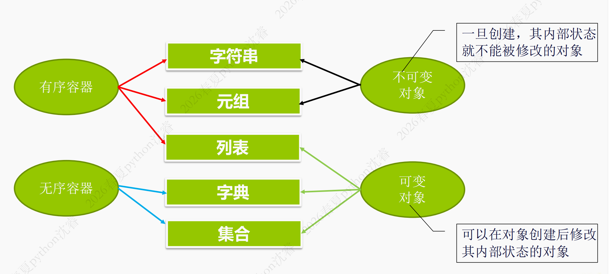
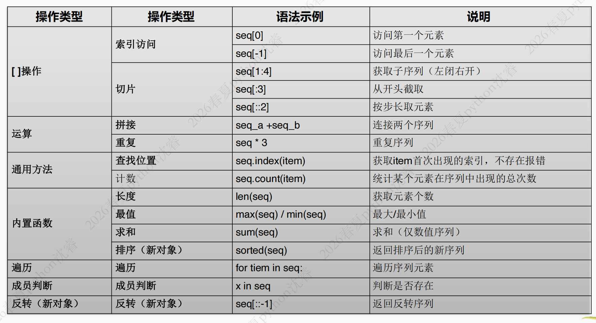
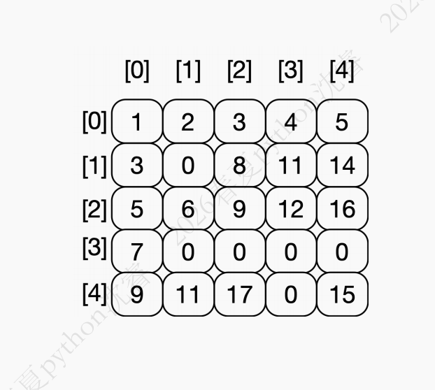
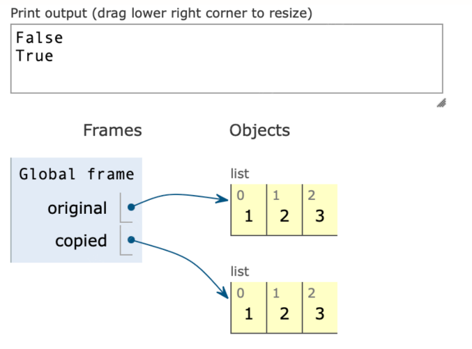
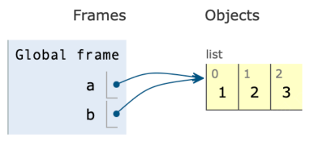
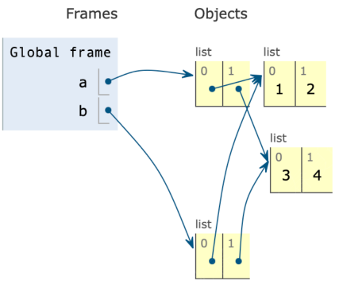
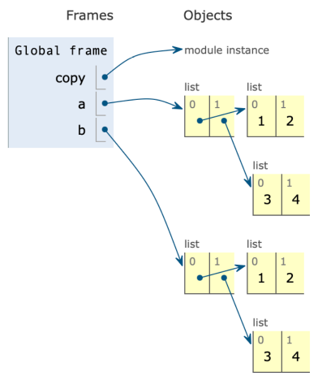

## 1. 数据容器

### 1.1 数据容器的概念

为了满足程序中复杂的数据表示，Python 支持复合数据类型 (compound data type)，可以将一批数据作为一个整体进行数据操作，这也是数据容器的概念。

常用的内置容器类型：

- 序列（列表(list)
    - 字符串(string)
    - 元组(tuple)）
    - 字典
- 集合

### 1.2 容器分类



!!! note
- **是否有序**：决定我们能否用`[0]`这种索引下标去访问元素，能就是有序，不能就是无序
- **是否可变**:不可变对象想修改只能重新赋值；可变对象可以直接对原有对象进行修改
!!!

## 2. 序列

### 2.1 序列概述

这种容器中可包含多个数据(元素)，容器中的数据(元素)有**先后次序**，每个元素通过**下标(索引)**来访问。序列的下标从 0 开始，后面下标依次为 1, 2, 3, .....

> 序列是其中一大类数据容器的统称，不是具体的数据类型

|类型|字面量|可变性|
|-|-|-|
|字符串|`hello`|不可变对象|
|列表|`['h','e','l','l','o']`|可变对象|
|元组|`('h','e','l','l','o')`|不可变对象|

### 2.2 通用的序列操作



#### 索引访问 []

- 正向索引：以`0`为起点，表示元素想杜宇序列其实位置开始的偏移量，范围是(`[0,n-1]`)
- 反向索引：以`-1`为起点，从序列末尾向前定位
- 索引不能越界

| 操作 | 语法示例 | 说明 |
|------|----------|------|
| 正向索引 | `seq[0]` | 访问第一个元素 |
| 负向索引 | `seq[-1]` | 访问最后一个元素 |

#### 切片访问 [:]

切片是截取一个区间，返回一个新序列，不破坏原始数据。

- **正向索引**：以0为起点，表示元素相对于序列起始位置的偏移量，范围为 `[0, n-1]`
- **负向索引**：以-1为起点，从序列末尾向前定位
- **左闭右开**：返回 `[start, end)` 区间

**示例：**
```python
prompt = 'hello'
prompt[0]     # 结果: 'h'
prompt[-1]    # 结果: 'o'
prompt[1:4]   # 结果: 'ell'
prompt[1:10]  # 结果: 'ello'
```

#### 切片练习

假设 `a = [2, 3, 5, 7, 11, 13]`

| 切片表达式 | 结果 | 说明 |
|------------|------|------|
| `a[1:-3]` | `[3, 5]` | 切片使用负的下标访问 |
| `a[2:]` | `[5, 7, 11, 13]` | 省略第二个下标 |
| `a[:3]` | `[2, 3, 5]` | 省略第一个下标，第二个下标为正数 |
| `a[:-3]` | `[2, 3, 5]` | 省略第一个下标，第二个下标为负数 |
| `a[:-3:-1]` | `[13, 11]` | 第三个参数是负数时逆序 |
| `a[4::-1]` | `[11, 7, 5, 3]` | 切片第三参数为负数时逆序 |

!!! tip
- 步长是正数顺序访问
- 步长为负数逆序访问
- 步长不能为0
!!!

#### 序列的运算符

| 运算符 | 说明 | 示例 |
|--------|------|------|
| `+` | 连接两个序列 | `[1,2,3] + [4,5,6]` → `[1,2,3,4,5,6]` |
| `*` | 重复序列 | `[1,2,3] * 3` → `[1,2,3,1,2,3,1,2,3]` |

> 重复序列重复的是元素，比如`[[1,2,3]]`的结果是`[[1,2,3],[1,2,3],[1,2,3]]`

!!! warning
必须是同类序列之间进行操作
!!!

#### 序列的通用方法

- `index()`
- `count()`

> `my_tuple.index("green", 2):从索引2开始寻找`green`,返回`3`。找不到会报错 **ValueError**

```python
# index() - 获取元素首次出现的索引，不存在报错
my_list = ["apple", "banana", "cherry", "apple", "date"]
my_list.index("banana")  # 1

my_tuple = ("red", "green", "blue", "green", "yellow")
my_tuple.index("green", 2)  # 3，从索引2开始查找

# count() - 统计元素出现次数
my_tuple.count("green")  # 2
my_tuple.count("purple") # 0
```

!!! warning
`find()`方法是字符串特有的方法
!!!

#### 序列的内置函数

**内置函数**：len(), max(), min(), sum(), sorted()

```python
# len() - 返回元素个数
len([2,3,5,7])      # 4
len('hello world')  # 11

# min()/max() - 返回最小/最大值
max([21, 3, 55, -7, 11])  # 55
min('浙江大学')             # '大'

# sum() - 求和（仅数值序列）
sum([2,3,5,7])  # 17

# sorted() - 返回排序后的新列表（不修改原序列）
sorted([21,3,55,-7,11])  # [-7, 3, 11, 21, 55]
sorted('world')           # ['d', 'l', 'o', 'r', 'w']
```

#### 遍历序列

序列是典型的可迭代对象，使用 `for` 循环可以遍历访问每个元素。

```python
# 方法1：直接遍历
for item in sequence:
    print(item)

# 方法2：使用 enumerate()（同时获取索引和值）
for index, item in enumerate(sequence):
    print(f"{index}: {item}")

# 方法3：使用 range() 和 len()
for i in range(len(sequence)):
    print(f"{i}: {sequence[i]}")
```

## 3. 列表

### 3.1 列表的概念

列表是 Python 中最核心的数据容器之一，具有三个关键特性：

1. **有序性**：元素按顺序存储
2. **可变性**：内容可以随时修改
3. **通用性**：支持存储不同类型的数据


### 3.2 创建列表

底层实现：列表采用动态数组结构，内部维护连续的内存空间，用于**存储元素对象地址**（指针），**而不是对象本身**。

**创建方式**

```python
# 1. 直接使用字面量
a = []                  # 空列表
a = [2, 3, 5, 7, 11, 13]
a = [0] * 5             # 快速生成 [0, 0, 0, 0, 0]

# 2. 使用 list() 转换
a = list('hello')               # ['h', 'e', 'l', 'l', 'o']
a = list(range(1, 10, 2))        # [1, 3, 5, 7, 9]
```

### 3.3 多维列表

列表的元素可以是任何类型，包括列表本身。当元素是列表时，可以构成多维列表（矩阵）。

```python
matrix = [
    [1, 2, 3, 4, 5],
    [3, 0, 8, 11, 14],
    [5, 6, 9, 12, 16],
    [7, 0, 0, 0, 0],
    [9, 11, 17, 0, 15]
]
```

使用 matrix[0][0] 访问第一行第一列的元素



### 3.4 修改列表元素

#### 单个元素修改
```python
a = [1, 3, 5, 7, 11]
a[0] = 2
print(a)  # [2, 3, 5, 7, 11]
```

#### 切片修改

切片修改可以实现替换、插入和删除：

- 替换
  - step 1:删除`[start,end)`中的所有元素
  - step 2:将等号右侧的可迭代对象(如列表、元组、字符串等)里面的元素，逐一插入到**刚刚腾出来的空隙中**
- 插入
  - 所有切片的赋值原理都是先删除一个范围内的元素，然后在这个元素范围内进行追加
  - `numbers[1:1]= [100, 200]`是**在`numbers[1]`的位置进行插入而不是`numbers[1]`后面**

```python
numbers = [10, 20, 30, 40, 50]

# 替换
numbers[1:4] = [25, 35]
print(numbers)  # [10, 25, 35, 50]

# 插入
numbers[1:1] = [100, 200]
print(numbers)  # [10, 100, 200, 25, 35, 50]

# 删除
numbers[3:5] = []
print(numbers)  # [10, 100, 200, 50]
```

!!! warning
索引不要越界
!!!

### 3.5 列表的方法

#### 增（添加）

| 方法 | 语法 | 功能 |
|------|------|------|
| `append()` | `ls.append(x)` | 在列表**末尾**添加**一个元素** |
| `extend()` | `ls.extend(iterable)` | 将可迭代对象的所有元素逐一添加至末尾 |
| `insert()` | `ls.insert(i, x)` | 在指定索引 i 处插入元素 |

!!! note
**extend(iterable)**:

- 要求传入的参数必须是一个可迭代的对象
- python会遍历该对象，将其内部的元素 **逐一解包**，并按照顺序追加到原列表的末尾。
  - 列表是可变对象
- 它的效果等同于针对列表切片的尾部赋值`ls(len(ls):)=iterable`
!!!

```python
# append() - 追加
a = [6, 3, 5, 7, 1]
a.append(13)
print(a)  # [6, 3, 5, 7, 1, 13]

# extend() - 扩展
lst = [1, 2]
lst.extend([3, 4])
print(lst)  # [1, 2, 3, 4]
lst.extend("ab")
print(lst)  # [1, 2, 3, 4, 'a', 'b']
```

!!! tip
`insert()` 灵活但时间复杂度高，使用频率不如 `append()`
!!!

!!! warning
```python
a = [1,2,3,4]
a.append([5,6])
len(a) # 5
print(a) # [1,2,3,4,[5,6]]
```
!!!

#### 删（移除）

| 方法 | 语法 | 功能 |
|------|------|------|
| `pop()` | `ls.pop([i])` | 移除并返回指定位置的元素（默认末尾） |
| `remove()` | `ls.remove(x)` | 移除列表中第一个值为 x 的元素 |
| `clear()` | `ls.clear()` | 清空列表中的所有元素 |

```python
# pop() - 弹出
a = [2, 3, 5, 7, 11]
print(a.pop())   # 11
print(a.pop(2))   # 5
print(a)          # [2, 3, 7]

# remove() - 删除第一个匹配元素
a = [2, 3, 5, 7, 5, 11]
a.remove(5)
print(a)  # [2, 3, 7, 5, 11]

# clear() - 清除
a.clear()
print(a)  # []
```

!!! warning
在使用remove方法的时候，如果**要删除的数据不在列表中**，则会**发生错误**
!!!

!!! example
```python
a = [1,2,3,3,5]
for i in a:
    if i == 3:
        a.remove(i)

print(a) # [1,2,3,5]
```

- 结果没有删除全部的`3`是因为删掉第一个3之后第二个3会被跳过

```python
a = [1,2,3,3,5]
for i in a[:]:
    if i==3:
        a.remove(i);
print(a) # 1,2,5
```

- 这里我们遍历的对象是`a`的一个副本，而我们每次对`a`本身操作，这避免了对a进行`remove`列表中的元素会出现移动的问题
!!!


#### 改/排（变形）

| 方法 | 语法 | 功能 |
|------|------|------|
| `sort()` | `ls.sort()` | 对列表元素进行原地排序 |
| `reverse()` | `ls.reverse()` | 反转列表中元素的顺序 |

> `reverse`方法没有返回值

```python
# reverse() - 反转
a = [21, 3, 5, 7, 1]
a.reverse()
print(a)  # [1, 7, 5, 3, 21]

# sort() - 排序（无返回值）
a = [8, 2, 10, 5, 3, 11]
a.sort()
print(a)  # [2, 3, 5, 8, 10, 11]
a.sort(reverse=True)
print(a)  # [11, 10, 8, 5, 3, 2]
```

!!! tip
- `sorted()` 是内置函数，返回新列表，不会修改原列表；
- `list.sort()` 是列表方法，原地排序
!!!

#### 复制

| 方法 | 语法 | 功能 |
|------|------|------|
| `copy()` | `new_ls = ls.copy()` | 生成列表的一个浅拷贝 |

```python
original = [1, 2, 3]
copied = original.copy()
print(original is copied)  # False 说明不是同一个对象
print(original == copied) # True 值相等
```



!!! note "直接赋值、浅拷贝、深拷贝的差异"
```python
# 直接赋值
a = [1,2,3]
b = a # b和a指向同一个列表
b.append(4) # 修改b会影响a
print(a) # [1,2,3,4]
```


```python
a = [[1,2],[3,4]]
b=a[:] # 浅拷贝(只是对第一层进行浅拷贝)
b[0].append(5) # 修改嵌套列表会影响a
print(a) # [[1,2,5],[3,4]]
```



```python
import copy
a = [[1,2],[3,4]]
b = copy.deepcopy(a)
b[0].append(5) # 不影响a
print(a) # [[1,2],[3,4]]
```


!!!

#### 查（检索）

| 方法 | 语法 | 功能 |
|------|------|------|
| `index()` | `ls.index(x)` | 返回第一个值为 x 的元素的索引 |
| `count()` | `ls.count(x)` | 统计某个元素在列表中出现的次数 |

### 3.6 直接赋值、浅拷贝、深拷贝的差异

```python
import copy

# 直接赋值 - 指向同一对象
a = [[1, 2], [3, 4]]
b = a
b.append(4)
print(a)  # [1, 2, 3, 4]  # a 也会被修改

# 浅拷贝 - 只拷贝第一层
a = [[1, 2], [3, 4]]
b = a[:]  # 或 b = a.copy()
b[0].append(5)
print(a)  # [[1, 2, 5], [3, 4]]  # 嵌套列表受影响

# 深拷贝 - 完全独立
a = [[1, 2], [3, 4]]
b = copy.deepcopy(a)
b[0].append(5)
print(a)  # [[1, 2], [3, 4]]  # 完全不受影响
```

### 3.7 列表推导式

列表推导式是将某种操作应用到序列，从一个或多个列表快速简洁地创建新列表的方法，又称列表解析。

它还可以将循环和条件判断结合，从而避免语法冗长的代码，同时提高程序性能

#### 基本推导式

```python
[expression for item in iterable]
```

> 这里的`expression`可以是多种形式，基本表达式、函数、条件表达式等等

```python
nl = [2 * number for number in [1, 2, 3, 4, 5]]
# 结果: [2, 4, 6, 8, 10]

slen = [len(s) for s in ['apple', 'banana', 'peach', 'watermelon']]
# 结果: [5, 6, 5, 10]

cl = [number if number % 2 else -number for number in range(1, 8)]
# 结果: [1, -2, 3, -4, 5, -6, 7]
```

#### 条件过滤

添加条件过滤，将原有迭代对象中符合条件的元素找出来形成新列表

```python
[expression for item in iterable if condition]
```

```python
nl = [number for number in range(1, 8) if number % 2 == 1]
# 结果: [1, 3, 5, 7]
```

!!! warning
新列表的元素个数一定≤原有列表元素的个数
!!!

#### 嵌套循环

```python
[exp for outer in outer_iterable for inner in inner_iterable]

pl = [(x, y) for x in range(2) for y in range(2)]
# 结果: [(0, 0), (0, 1), (1, 0), (1, 1)]

flat_pl = [item for row in pl for item in row]
# 结果: [0, 0, 0, 1, 1, 0, 1, 1]
```

#### 推导式练习

```python
# 生成数列求和：计算 1+1/2+...+1/20 之和
result = sum([1/i for i in range(1, 21)])
# 结果: 3.597739657143682

# 多条件文本处理
# 要求：从word中筛选出同时满足长度大于等于5且以`s`结尾单词，并转为全大写
words = ['apples', 'Students', 'cats', 'people']
result = [word.upper() for word in words if len(word) >= 5 and word[-1] == 's']
# 结果: ['APPLES', 'STUDENTS']
```

### 3.8 列表的实际应用

- **`append() + pop()`**：天然栈（LIFO，后进先出），适合撤销、括号匹配、路径回退、DFS
- **`append() + pop(0)`**：可以实现队列（FIFO，先进先出），但效率较低，可使用 `collections.deque`

## 4. 元组

### 4.1 元组的概念

元组是**不可修改的任意类型的数据序列**，其字面量用**圆括号** `()` 表示。

```python
# 创建方式
weekend = ("周六", "周日")          # 1. 直接用圆括号
point = (100, 200)

rgb = 255, 128, 0                   # 2. 不用括号（逗号分隔）

single = (42,)                      # 3. 单元素元组（必须加逗号）
# 若写成 (42)，则是整数42

chars = tuple("hello")              # 4. tuple() 转换
# ('h', 'e', 'l', 'l', 'o')

nums = tuple([1, 2, 3])            # (1, 2, 3)
```

### 4.2 元组的特点

元组只有序列的通用方法：`index()` 和 `count()`

1. **不可变性（核心特性）**：不支持添加、删除或修改元素，能**有效防止数据被意外修改**，**起到数据保护作用**
2. **结构简单**：不需要支持动态扩展等机制，运行开销更低
3. **内存占用少**：创建时按需分配，不需要预留额外空间，适合大规模数据
4. **可哈希**：可以作为字典的"键"，也可作为集合的元素

!!! note
在选择数据结构时，更重要的是根据数据是否需要修改来选择合适的数据结构
!!!
  
## 5. 练习题

### 5.1 打分程序

设计一个打分程序，计算去掉一个最高分、一个最低分后一名选手的最后平均得分。

**思路：**
1. 输入若干分数
2. 如何获得最高分和最低分
3. 如何去掉这两个分数
4. 如何计算平均分

```python
score = list(map{float, input().split()})

slen = len(score)
smin = min(score)
smax = max(score)

average = sum(score) / (slen-2)
print(average)
```

### 5.2 排序

在一行中输入若干个整数，至少输入一个整数，整数之间用空格分割，要求将数据按从小到大排序输出。

**示例：**
- 输入：`5 -76 8 345 67 2`
- 输出：`[-76, 5, 8, 67, 2, 345]`

```python
nums = input()
numl = [int(n) for n in nums.split()]
num.sort()
print(numl)
```

### 5.3 统计单词

在一个英文句子中，统计单词数量（包括重复单词），并找出所有以元音字母（a, e, i, o, u）开头的单词并输出。

**思路：**
1. 如何分词
2. 识别元音字母开头
3. 大小写处理

```python
s = input()
tokens = s.split()
count = len(tokens)

vowels = []
for t in tokens:
    if t and t[0].lower() in 'aeiou':
        vowels.append(t)
```

### 5.4 凯撒密码加密

编写一个明文密文转换程序，加密方法为凯撒密码（A→C、B→D…Y→A、Z→B）。

**示例：**
- 输入：`CHINA`
- 输出：`EJKPC`

```python
table = [chr(i) for i in range(65, 91)]
new_table = table[2:] + table[:2] 
s = input()
news = [new_table[table.index(i)] for i in s]
print(''.join(news))
```

### 5.5 输出图形

提示用户输入图形的行数，然后输出相应图形。

**思路：**
1. 输入行数
2. 循环输出每一行
3. 每一行可以看着两部分空格和字母

### 5.6 书号验证

设计一个查询书号是否正确的程序，以13位书号为例：

**验证方法：**
1. 前12位数依次乘以1和3，然后求它们的和
2. 求和除以10的余数
3. 用10减去这个余数，得到校验码
4. 如果余数为0，则校验码为0

**示例：** 书号 `9787308189774` 的验证过程
```
9  7  8  7  3  0  8  1  8  9  7  7  4
1  3  1  3  1  3  1  3  1  3  1  3
-----------------------------------------
9 21  8 21  3  0  8  3  8 27  7 21 = 136
136 % 10 = 6
10 - 6 = 4  ✓
```

