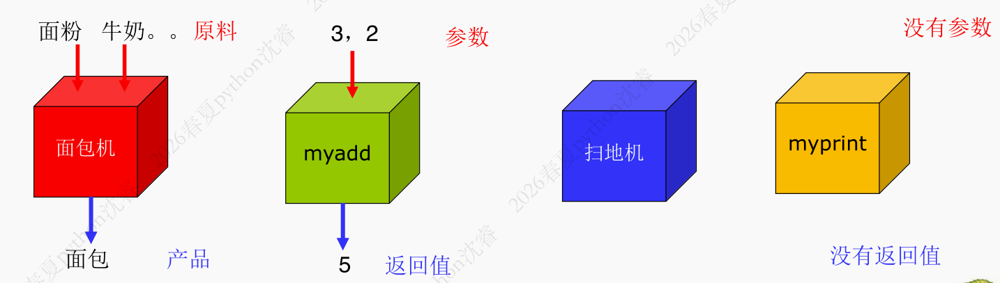
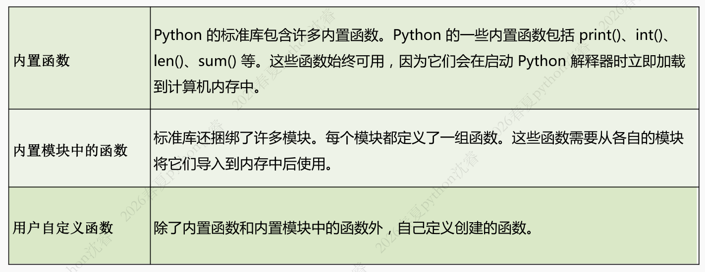
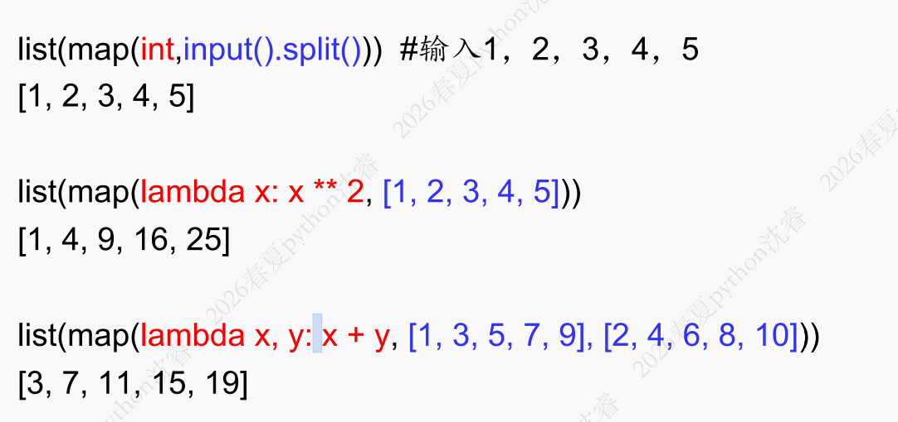
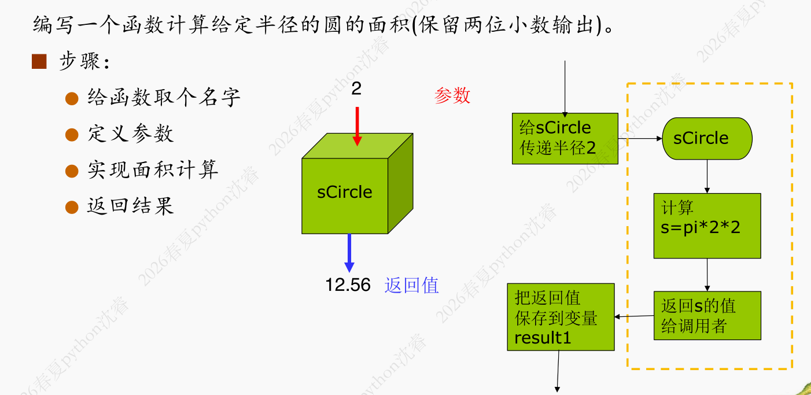
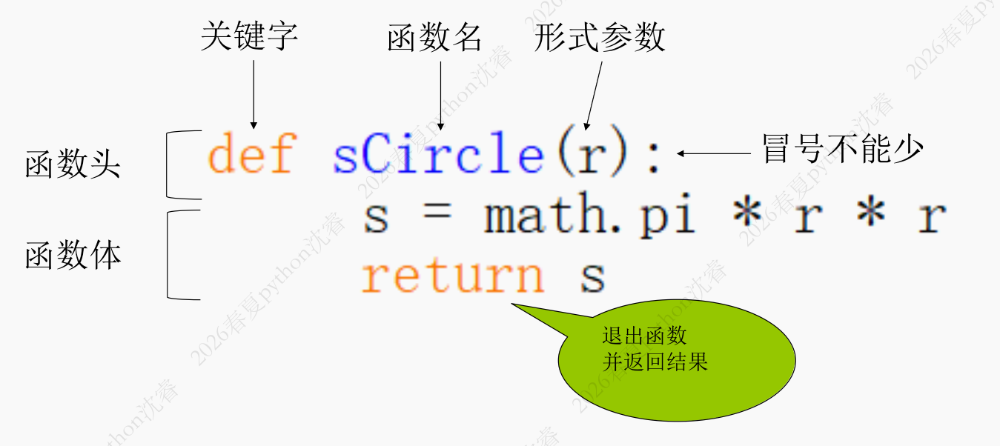
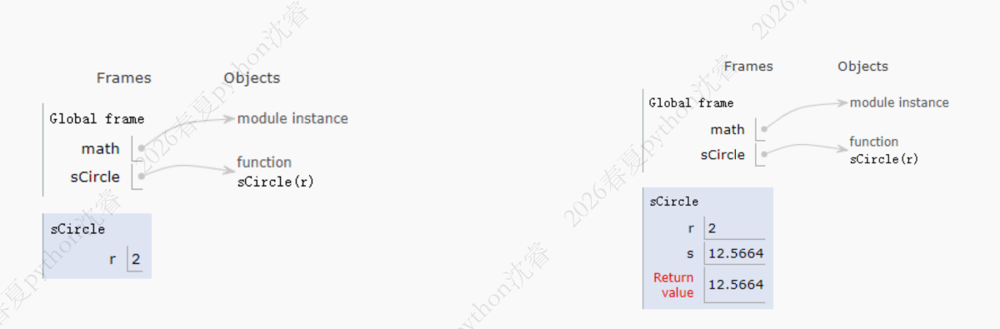
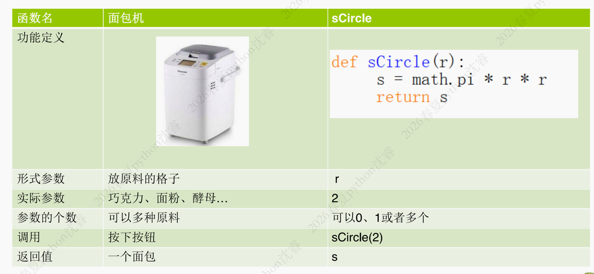
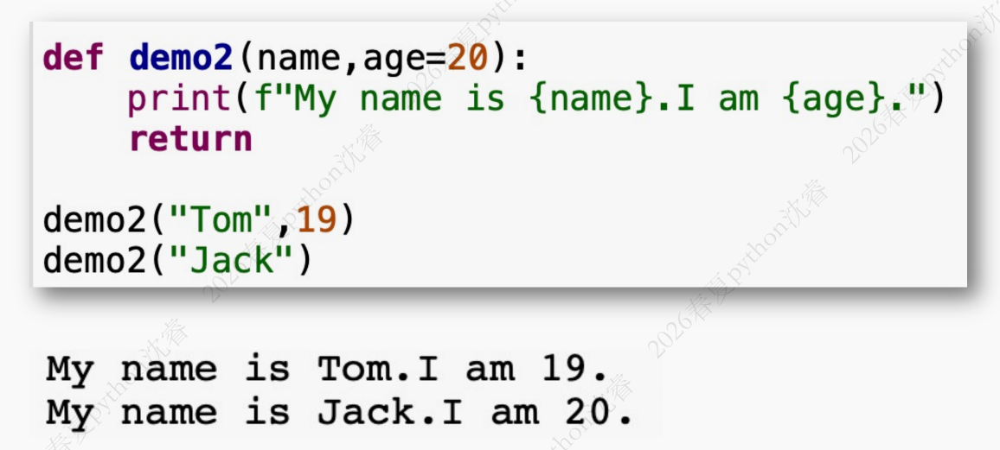

## 5.1 函数定义

- 什么是函数：将重复代码封装为可复用的功能模块
- 函数是具有名称的代码块，用于封装一组相关指令以实现特定功能
- 在程序的不同位置通过该名称多次调用
- 函数可以接收输入参数，执行内部逻辑，并返回结果



**函数种类**



**函数式一等公民**

这是`Python`设计中的一个核心概念

函数与其他基本数据类型(整数、字符串、列表等) **同等的地位和操作自由度**

- 赋值给变量
- 作为参数传递
- 作为返回值
- 存储在数据结构中

## 5.2 内置函数

### 5.2.1 `enumerate()`

**`enumerate(iterable, start = 0)`**

- 用于在循环遍历可迭代对象(如列表、字符串、元组等)时，**同时获取元素的索引和值**

```python
for i, fuit in enumerate(["苹果", "香蕉"], start = 1):
    print(f"第{i}个水果:{fruit}")

# 第一个水果：苹果
# 第二个水果：香蕉

{i: char for i, char in enumerate("Python")}
# {0: 'P', 1: 'y', 2: 't', 3: 'h', 4: 'o', 5: 'n'}
```

> `start = 1`表示索引从`1`开始

- 掌握`enumerate()`能显著提升代码的简洁性和可读性，是`Pythonic`编程的重要性

### 5.2.2 `sorted()`

**`sorted(iterable,key,reverse)`**

- `iterable`:可迭代对象，如字符串、列表、元组、字典和集合等
- `key`:主要是用来进行比较的元素，只有一个参数，具体的函数的参数就是取自于可迭代对象中，指定可迭代对象中的一个元素来进行排序
  - `key = lambda x:...`:对于每一个元素`x`，先**计算一个用于排序的值**，然后**按照这个值排序**
- `reverse`:排序规则
  - `reverse = True`:降序
  - `reverse = False`:升序(默认)
- **返回值**：返回新列表，**原可迭代对象不会被修改**

!!! example 
- 若：`students = [(‘Mike’,89, 15), (‘ Linda’,80, 14), (‘Sean’, 85, 14)]`，三个分量分别为:姓名、成绩、年龄，按照成绩的倒序排序

```python
sorted(students, key = lambda s:s[1], reverse=True)
```

- 若`a = {1:4, 4:2, 3:8, 0:9}`，按照字典的`key`倒序排序

```python
sorted(a.items(), key = lambda x: x[0], reverse = True)

# [(4, 2), (3, 8), (1, 4), (0, 9)]
```

> `a.items()`会得到类似这样的内容`dict_items([(1, 4), (4, 2), (3, 8), (0, 9)])`，每一个元素都是一个二元组
!!!

### 5.2.3 `zip()`

- 用于将可迭代的对象作为参数，将对象中**对应的元素打包成一个个元组**，然后返回由这些元组组成的迭代器

!!1 example
若`a=[1,2,3] b=[4,5,6] c=[4,5,6,7,8]`

```python
list(zip(a, b)) # [(1,4),(2,5),(3,6)]
list(zip(a, c)) # [(1,4),(2,5),(3,6)] 元素个数与最短的列表一致
```
!!!

**用途**

- 转置矩阵(行列互换)

```python
matrix = [
    [1,2,3],
    [4,5,6],
    [7,8,9]
]
transposed = list(zip(*matrix))
```

!!! note
```python
zip([1, 2, 3], [4, 5, 6], [7, 8, 9])
```

可以想象成有三根指针，分别指向三个列表的开头

```
[1, 2, 3]
 ↑

[4, 5, 6]
 ↑

[7, 8, 9]
 ↑
```

第一轮，`zip()`从每个列表当前指针处取一个元素`1,4,7`得到`(1,4,7)`，然后三个指针都往后移一个

```
[1, 2, 3]
    ↑

[4, 5, 6]
    ↑

[7, 8, 9]
    ↑
```

第二轮取`2,5,8`得到`(2,5,8)`，同理最终得到的结果是

```
[(1, 4, 7), (2, 5, 8), (3, 6, 9)]
```

实际上的逻辑是：

```python
def my_zip(a, b, c):
    result = []
    
    for i in range(len(a)):
        result.append((a[i], b[i], c[i]))
    
    return result
```
!!!

- 重新构建字典

```python
d={'blue':500, 'red':100, 'white':300}
d1=dict(zip(d.values(), d.keys()))
# {500: 'blue', 100: 'red', 300: 'white’}
```

### 5.2.4 `eval()`和`exec()`

**1. `eval()`**

- 功能：计算并返回表达式的值
- 输入：字符串形式的表达式
- 返回值：表达式的结算结果

```python
result = eval("3 + 4 * 2") # result = 11
x = 5
result = eval("x * 2") # 返回10
a = eval("[1,2,3]") # a的类型是list
```

**2. `exec()`**

- 功能：执行`Python`代码
- 输入：字符串形式的代码块(可以是多行)
- 返回值：总是返回`None`

!!! python
exec("x = 10 + 20")
!!!

!!! warning
存在安全风险，需要谨慎使用
!!!

### 5.2.5 `isinstance()`

**`instance(object, classinfo)`**

- 用于检查对象类型，能够判断一个对象**是否属于某个类或其子类的实例**。它在类型验证、多态处理、多态处理和代码健壮性中扮演重要角色

```python
d = eval(input())
s = 0
for i in d:
    if isinstance(i, (int, float)):
        s = s + i
    elif isinstance(i, list):
        s = s + sum(i)
print(s)
```

### 5.2.6 `all()和any()`

- `all()`和`any()`用于检查 **可迭代对象中的元素**是否满足特定的条件
- `all()`当可迭代对象中**所有元素都为真**（或可迭代对象为空）时返回`True`，否则返回`False`。(可以看做是 **多个参数的与操作**)
- `any()`当可迭代对象中任一元素为真时返回`True`，如果可迭代对象为空则返回`False`。(可以看做 **多个参数的或操作**)

!!! example
```python
n=47
all([n%k for k in range(2, n)]) # True
```
!!!

### 5.2.7 高阶函数：map()

- 用于对可迭代对象中的每个元素应用一个指定的函数，并返回一个 **迭代器**(`map()`对象)



## 5.3 自定义函数



### 5.3.1 函数的定义



- 语法形式如下

```
def<函数名>(<参数>):
    <函数体>
    return <返回值>
```

- 注意事项
  - 一对圆括号是函数的重要部分，即使该函数不需要接收任何参数，也必须保留一对空的圆括号
  - 括号后面的冒号必不可少
  - 函数体相对于`def`关键字必须进行缩进
  - 如果没有返回值，`return`语句可以缺省，默认返回`None`
  - **Python允许嵌套定义函数**

### 5.3.2 函数的调用

- 函数通过函数名调用

```python
result1 = sCircle(2)
```





## 5.4 参数传递与返回值

### 5.4.1 参数传递

- 形参：`parameter`
- 实参：`argument`

**传递机制**：传递的是 **对象的引用**

- 若对象是 **可变对象**(如 *列表、字典*)，在函数内修改对象内容会影响原始对象
- 若对象是**不可变类型**(如*整数、字符串、元组*)，无法直接修改对象内容，但是重新赋值会创建新对象


### 5.4.2 参数类型

- **位置参数**：函数调用时，实参默认按**照位置顺序进行传递**，并且要求个数和形参完全匹配

!!! example
```python
def demo1(name, age):
    print(f"My name is {name}. I am {age}.")
    return 

demo1("Jack", 20)
demo1(20, "Jack")
```

```bash
My name is Jack.I am 20.
My name is 20.I am Jack.
```
!!!

- **关键字参数**:为了避免位置参数带来的混乱，调用参数时可以**指定对应参数的名字**，它甚至可以采用与函数定义不同的顺序调用

!!! example
```python
demo1(age = 19, name = "Tom")
```

```bash
My name is Tom. I am 19.
```
!!!

- **默认值参数**：当调用方没有提供对应的参数值时，可以指定默认参数值。而如果提供了参数值，在调用时会代替默认值

!!! example

!!!

- **不定长参数**：当函数参数数目不确定时，星号将一组可变数量的位置参数变成**参数值的容器**

!!! example
**一个星号**：作为**元组**接受数据

```python
def demo3(a, *args):
    print(a)
    print(type(args))
    print(sum(args))

demo3(1, 2, 3, 4) 
# 1
# <class 'tuple'>
# 9
```

**两个星号**：会接受一个 **字典类型**

``` python
def demo4(a, **kwargs):
    print(a)
    print(kwargs)
    return

demo4(1, x=2, y=3, z=4)
# 1
# {'x':2, 'y'=3, z='4'}
```
!!!

### 5.4.3 返回值

函数的返回值可以看做是 **函数执行的结果**，通过`return`语句实现返回给调用者

- 用于结束函数调用的执行，并将结果(`return`后面的表达式值)返回给调用方。
- **可以返回一个值，也可以返回多个值**

!!! warning
这里表面上看是返回多个值，实际上就是反悔了一个元组

```python
def get_info():
    name = "Mike"
    age = 18
    score = 90
    return name, age, score
```

python会将上述返回表达式打包成`return("Mike", 18, 90)`
!!!

- 一旦执行了`return`语句，那么之后的语句就不会执行
- 如果`return`后没有任何表达式，或者不出现`return`，则返回特殊值`None`

## 5.5 命名空间与作用域

## 5.6 模块化编程

## 5.7 递归