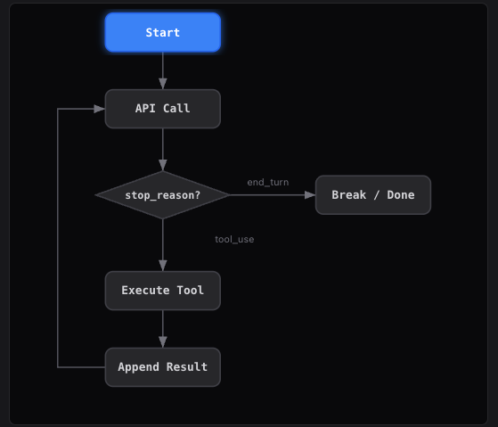
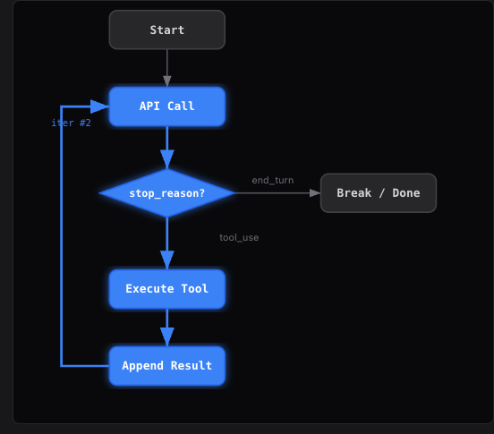

> 最小的`agent`内核起始就是`while loop + one tool`

### Agent While Loop的架构图

- `while`循环的条件：`while(stop_reason === "tool_use")`



1. `user input`:当用户发送消息时，循环开始
2. `Call the model`:给`LLM`发送消息，模型能看到一切并决定接下来去做什么
3. `stop_reason:tool_use`:模型想要使用工具(`tool-use`)，整个循环继续进行
4. `Execute & Append`:执行工具，并将结果追加到`message[]`这个列表中，并将其反馈给模型
5. `Loop again`:相同的编码路径，第二次迭代，模型会决定编辑文件
6. `stop_reason:end_turn`:模型执行完毕，循环退出，这就是整个`agent`的工作框架



- `one loop & bash is all you need`:一个工具+一个循环=一个agent
**Harness层：循环是模型与真实世界的第一道连接**


### 问题

语言模型能推理代码，但是无法对真实世界(文件系统)进行操作——不能读文件、跑测试、看报错

没有循环，每一次工具调用都要我们手动把结果粘回去，这时我们自己就扮演了一个循环的角色

### 解决方案

```
+--------+      +-------+      +---------+
|  User  | ---> |  LLM  | ---> |  Tool   |
| prompt |      |       |      | execute |
+--------+      +---+---+      +----+----+
                    ^                |
                    |   tool_result  |
                    +----------------+
                    (loop until stop_reason != "tool_use")
```

一个退出条件控制整个流程，循环持续运行，直到**模型不再调用工具**

### 工作原理

#### 1. 用户`prompt`作为第一条消息

```python
messages.append(
    {
        "role": "user",
        "content": query
    }
)
```

#### 2. 将消息和工作定义一起发给LLM

```python
response = client.messages.create(
    model=MODEL,
    system=SYSTEM,
    messages=messages,
    tools=TOOLS,
    max_tokens=8000 
)
```

#### 3. 追加助手响应

检查`stop_reason`——如果模型没有调用工具，结束

```python
messages.append(
    {
        "roles":"assistant",
        "contant":response.content
    }
)
if response.stop_reason != "tool_use":
    return 
```

#### 4. 执行每个工具调用，收集结果，作为`user`消息追加，回到第二步

```python
results = []
for block in respnse.content:
    if block.type == "tool_use":
        output = run_bash(block.input("command"))
        results.append({
            "type": "tool_result",
            "tool_use_id": block.id,
            "content": output
        })
response.append({
    "role": user,
    "content": results
})
```

我们将上述内容彻底组装成一个函数：

```python
def agent_loop(query):
    messages = [{"role": "user", "content": query}]
    while True:
        response = client.messages.create(
            model=MODEL, system=SYSTEM, messages=messages,
            tools=TOOLS, max_tokens=8000,
        )
        messages.append({"role": "assistant", "content": response.content})

        if response.stop_reason != "tool_use":
            return

        results = []
        for block in response.content:
            if block.type == "tool_use":
                output = run_bash(block.input["command"])
                results.append({
                    "type": "tool_result",
                    "tool_use_id": block.id,
                    "content": output,
                })
        messages.append({"role": "user", "content": results})
```

这不到30行的代码，就是整个`agent`，——循环本身是始终保持不变的

