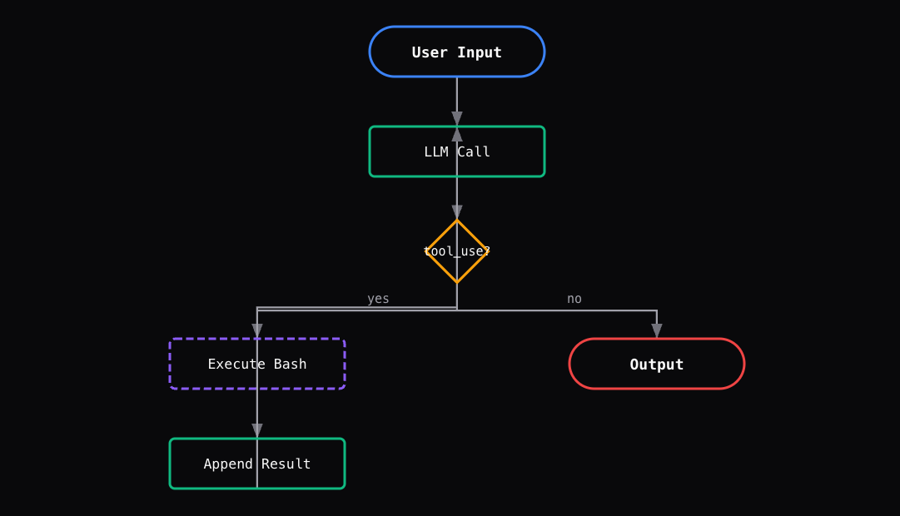

> 最小的`agent`内核起始就是`while loop + one tool`

### Agent While Loop的架构图

- `while`循环的条件：`while(stop_reason === "tool_use")`


1. `user input`:当用户发送消息时，循环开始
2. `Call the model`:给`LLM`发送消息，模型能看到一切并决定接下来去做什么
3. `stop_reason:tool_use`:模型想要使用工具(`tool-use`)，整个循环继续进行
4. `Execute & Append`:执行工具，并将结果追加到`message[]`这个列表中，并将其反馈给模型
5. `Loop again`:相同的编码路径，第二次迭代，模型会决定编辑文件
6. `stop_reason:end_turn`:模型执行完毕，循环退出，这就是整个`agent`的工作框架


- `one loop & bash is all you need`:一个工具+一个循环=一个agent
**Harness层：循环是模型与真实世界的第一道连接**


### 问题

语言模型能推理代码，但是无法对真实世界(文件系统)进行操作——不能读文件、跑测试、看报错

没有循环，每一次工具调用都要我们手动把结果粘回去，这时我们自己就扮演了一个循环的角色

### 解决方案

```
+--------+      +-------+      +---------+
|  User  | ---> |  LLM  | ---> |  Tool   |
| prompt |      |       |      | execute |
+--------+      +---+---+      +----+----+
                    ^                |
                    |   tool_result  |
                    +----------------+
                    (loop until stop_reason != "tool_use")
```

一个退出条件控制整个流程，循环持续运行，直到**模型不再调用工具**

### 工作原理

#### 1. 用户`prompt`作为第一条消息

```python
messages.append(
    {
        "role": "user",
        "content": query
    }
)
```

#### 2. 将消息和工作定义一起发给LLM

```python
response = client.messages.create(
    model=MODEL,
    system=SYSTEM,
    messages=messages,
    tools=TOOLS,
    max_tokens=8000 
)
```

#### 3. 追加助手响应

检查`stop_reason`——如果模型没有调用工具，结束

```python
messages.append(
    {
        "roles":"assistant",
        "contant":response.content
    }
)
if response.stop_reason != "tool_use":
    return 
```

#### 4. 执行每个工具调用，收集结果，作为`user`消息追加，回到第二步

```python
results = []
for block in respnse.content:
    if block.type == "tool_use":
        output = run_bash(block.input("command"))
        results.append({
            "type": "tool_result",
            "tool_use_id": block.id,
            "content": output
        })
response.append({
    "role": user,
    "content": results
})
```

我们将上述内容彻底组装成一个函数：

```python
def agent_loop(query):
    messages = [{"role": "user", "content": query}]
    while True:
        response = client.messages.create(
            model=MODEL, system=SYSTEM, messages=messages,
            tools=TOOLS, max_tokens=8000,
        )
        messages.append({"role": "assistant", "content": response.content})

        if response.stop_reason != "tool_use":
            return

        results = []
        for block in response.content:
            if block.type == "tool_use":
                output = run_bash(block.input["command"])
                results.append({
                    "type": "tool_result",
                    "tool_use_id": block.id,
                    "content": output,
                })
        messages.append({"role": "user", "content": results})
```

这不到30行的代码，就是整个`agent`，——循环本身是始终保持不变的

### 变更内容

|组件|之前|之后|
|`Agent Loop`|无|`while True`+ `stop_reason`|
|`Tools`|无|`bash`(单一工具)|
|`Messages`|无|累积式消息列表|
|`Control flow`|无|`stop_reason != "tool_use"`|


```bash
s01 >> Create a file called hello.py that prints "Hello, World!"
$ echo 'print("Hello, World!")' > /Users/yangsmac/Desktop/learn-claude-code/hello.py
(no output)
$ cat /Users/yangsmac/Desktop/learn-claude-code/hello.py && python /Users/yangsmac/Desktop/learn-claude-code/hello.py
print("Hello, World!")
Hello, World!
Done! Created `hello.py` that prints "Hello, World!" — verified and working.
```

``` bash
s01 >> List all Python files in this directory
$ find /Users/yangsmac/Desktop/learn-claude-code -maxdepth 1 -name "*.py" -type f
/Users/yangsmac/Desktop/learn-claude-code/hello.py
There's one Python file in this directory:

- **hello.py**

``` 

```bash
s01 >> What is the current git branch?
$ cd /Users/yangsmac/Desktop/learn-claude-code && git branch --show-current
main
The current git branch is **main**.
```

```bash
s01 >> Create a directory called test_output and write 3 files in it
$ mkdir -p /Users/yangsmac/Desktop/learn-claude-code/test_output && echo "This is file 1." > /Users/yangsmac/Desktop/learn-claude-code/test_output/file1.txt && echo "This is file 2." > /Users/yangsmac/Desktop/learn-claude-code/test_output/file2.txt && echo "This is file 3." > /Users/yangsmac/Desktop/learn-claude-code/test_output/file3.txt && ls -la /Users/yangsmac/Desktop/learn-claude-code/test_output/
total 24
drwxr-xr-x@  5 yangsmac  staff  160 May 17 19:00 .
drwxr-xr-x@ 19 yangsmac  staff  608 May 17 19:00 ..
-rw-r--r--@  1 yangsmac  staff   16 May 17 19:00 file1.txt
-rw-r--r--@  1 yangsmac  staf
Done! Created `test_output/` with 3 files:

- **file1.txt**
- **file2.txt**
- **file3.txt**
```

### 执行流程



### 设计决策

#### 为什么紧靠bash就够了

`Bash`能读写文件、运行任意程序、在进程间传递数据、管理文件系统。任何额外的工具(`read_file`,`write_file`等)都只是`bash`已有能力的子集。

增加工具并不会解锁能力，只会增加模型需要理解的接口。模型只需要学习一个工具的`schema`，实现代码不超过100行。这就是最小可行`agent`:一个工具，一个循环

#### 用递归进程创建子代理机制

当`agent`执行`python v0.py`的`subtask`时，它会**创建一个全新的进程，拥有全新的LLM上下文**

这个子进程实际上就是一个子代理：有自己的**系统提示词、对话历史和任务焦点**。

子进程完成后，父进程**通过`stdout`获得结果**

这就是不依赖任何框架的子代理委派——纯粹的`Unix`进程语义

每个子进程天然隔离关注点，因为它根本看不到父进程的上下文

#### 没有规划框架——由模型自行决策

没有规划器，没有任务队列，没有状态机。

系统提示词告诉模型如何处理问题，模型根据对话历史决定执行下一步执行什么`bash`命令

这是有意为之的：在这个层级，添加规划属于 **过早抽象**。模型的思维链本身就是计划，`agent`循环只是**不断询问模型下一步做什么**，直到模型不再请求工具为止

