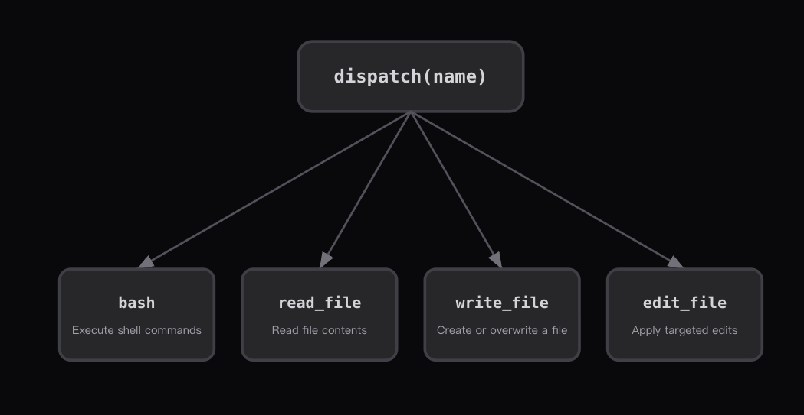

### Tool Dispatch Map



- `The dispatch Map`:一个`tool names`和`handler functions`之间的字典映射
- `bash`:
  - `incoming`:`{ name: "bash", input: { cmd: "ls -la" } }`
  - 执行`shell`命令
- `read_file`:
  - `incoming`:`{ name: "read_file", input: { path: "src/auth.ts" } }`
  - 读文件内容
- `write_file`:
  - `incoming`:`{ name: "write_file", input: { path: "config.json" } }`
  - 创建或者覆盖一个文件
- `edit_file`：
  - `incoming`:`{ name: "edit_file", input: { path: "index.ts" } }`
  - 执行目标编辑

> 添加一个工具=在`dispatch map`中添加一个`entry`
> `while loop`保持相同，只需要增长`dispatch map`的大小
> 每一个工具都返回一个`tool_result`并将其写回到`messages[]`
> 流程一致，处理方式各异。校验输入信息，执行对应操作，返回最终结果。

**Harness层：工具分发——扩展模型能触达的边界**

### 问题

- 只有`bash`时，所有操作都走`shell`
- `cat`阶段不可操作
- `sed`遇到特殊字符就崩

每一次`bash`调用都是**不受约束的安全面**

专用工具(`read_file`,`write_file`)可以在**工具层面**做**路径沙箱**

### 解决方案

```
+--------+      +-------+      +------------------+
|  User  | ---> |  LLM  | ---> | Tool Dispatch    |
| prompt |      |       |      | {                |
+--------+      +---+---+      |   bash: run_bash |
                    ^           |   read: run_read |
                    |           |   write: run_wr  |
                    +-----------+   edit: run_edit |
                    tool_result | }                |
                                +------------------+
```

`dispatch map`是一个字典：`{tool_name: handler_function}`

一次查找即可替代所有if/elif条件分支语句。

