# 编译原理 Chapter 1：概述

## 目录

1. [课程简介](#1-课程简介)
2. [编程语言及设计](#2-编程语言及设计)
3. [编译器及其形式](#3-编译器及其形式)
4. [编译器的阶段](#4-编译器的阶段)
5. [案例：Tiger编译器](#5-案例tiger编译器)

---

## 1. 课程简介

### 1.1 课程信息

| 项目 | 内容 |
|------|------|
| 授课教师 | 课程助教 吴晨 |
| 时间地点 | 每周二 6、7、8节，教四 306 |
| 实验信息 | https://compiler.pages.zjusct.io/sp26/ |
| 课程网站 | 学在浙大, https://rainoftime.github.io/ |

**教材**：《Modern Compiler Implementation in C》 - Andrew W. Appel

### 1.2 参考书籍

- **[虎书]** Andrew W. Appel. Modern Compiler Implementation in Java/C/ML
  - 《现代编译原理—C语言描述》- 人民邮电出版社
- **[龙书]** Alfred V. Aho, Monica S. Lam, et al. Compilers: Principles, Techniques, and Tools (2nd Ed.)
  - 《编译原理》- 机械工业出版社
- **Keith Cooper & Linda Torczon**: Engineering a Compiler
  - 《编译器工程》- 机械工业出版社

### 1.3 评分方法

```
课程成绩 (100分)
├── 平时成绩 (70%)
│   ├── 课后作业 (10%)
│   ├── 随堂测验 (10%)
│   └── 期末考试 (50%)
└── 实验成绩 (30%)
```

> **注意**：期末考试 < 40/100 分，则最终成绩 < 60/100 分

### 1.4 实验安排

本次实验的目标是编写一个**完整的编译器**：
- **源语言**：SysY（C语言的一个子集扩展而成）
- **目标语言**：RISC-V 32 汇编

| 实验 | 实验内容 | 占比 | 截止日期 |
|------|----------|------|----------|
| lab0 | 环境配置与测试 | 10% | 2026-3-15 |
| lab1 | 词法与语法分析 | 30% | 2026-4-19 |
| lab2 | 语义分析 | 30% | 2026-5-10 |
| lab3 | 中间代码生成 | 15% | 2026-5-31 |
| lab4 | 目标代码生成 | 15% | 2026-6-21 |

### 1.5 Bonus 任务

- **截止日期**：2026年6月24日
- **可选内容**：
  - Bonus 0：贡献优质测试用例
  - Bonus 1：Lexer & Parser, DIY!
  - Bonus 2：支持更多语言特性
  - Bonus 3：编译优化

---

## 2. 编程语言及设计

### 2.1 编程语言的概念

> **定义**：A programming language is a notation for describing computations to people AND to machines.
> （编程语言是一种用于描述计算过程的符号系统，供人类和机器使用。）

### 2.2 编程范式 (Paradigms)

| 范式 | 代表语言 |
|------|----------|
| 过程式 (Procedural) | C, Fortran, Pascal |
| 函数式 (Functional) | Lisp/Scheme, Haskell |
| 逻辑式 (Logic) | Prolog, Datalog |
| 面向对象 (Object-Oriented) | Smalltalk, Java, Eiffel |

### 2.3 编程语言的发展历程

- **语言自身不断演进**：
  - C: C90, C99, C11
  - C++: 1998, ..., 2011, 2014, 2017...

- **新语言不断诞生**：
  - 通用编程语言：Go (2009), Rust (2010), Swift (2014)
  - 领域特定语言：Latex, SVG, DOT, Markdown

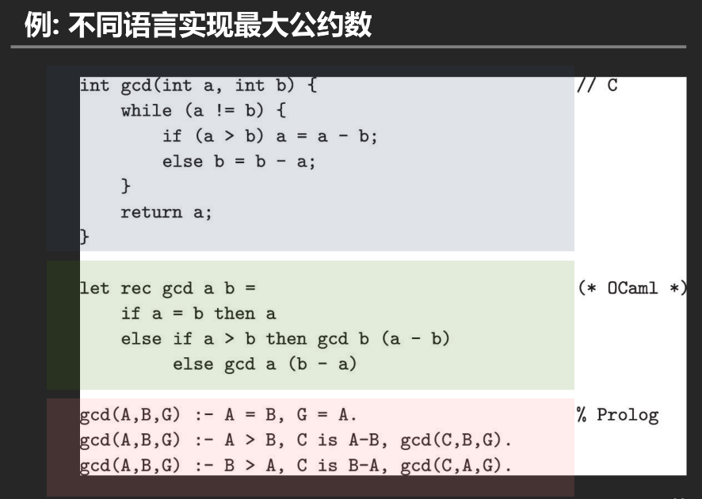

### 2.4 与编程语言相关的图灵奖

自1966年图灵奖颁发以来，共有75名获奖者，其中**编程语言、编译相关的科研人员有21位，占比28%**。

!!! example 部分相关图灵奖获得者

| 年份 | 科学家 | 贡献 |
|------|--------|------|
| 1966 | Alan J. Perlis | 高级程序设计技巧，编译器构造 |
| 1972 | Edsger Dijkstra | 程序设计语言的科学与艺术 |
| 1977 | John Backus | 高级编程系统，程序设计语言规范的形式化定义 |
| 1980 | C. Antony R. Hoare | 程序设计语言的定义与设计 |
| 1983 | Ken Thompson, Dennis M. Ritchie | UNIX操作系统和C语言 |
| 2003 | Alan Kay | 面向对象编程 |
| 2006 | Frances E. Allen | 优化编译器 |
| 2020 | Jeffrey David Ullman, Alfred Vaino Aho | 推进编程语言实现的基础算法和理论 |
!!!

---

## 3. 编译器及其形式

### 3.1 编译器的定义

> **编译器**是一个程序，读入**源程序**并将其翻译成**语义等价的目标程序**。

```
        编译器          输入
                        ↓
源程序 ─────────────> 目标程序
(.c, .cpp)              ↓
                       输出
```

### 3.2 狭义 vs 广义

| 视角 | 源程序 | 目标程序 |
|------|--------|----------|
| 狭义 | 高级语言 | 机器语言 |
| 广义 | 高级语言 | 中间语言或另一种高级语言 |

**示例**：
- C++ → 机器语言
- C++ → C
- Pascal → C

!!! example "C语言编译器"
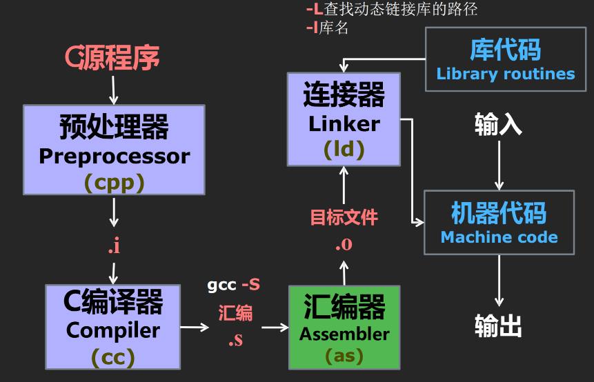
!!!

### 3.3 编译器的其他形式

#### 交叉编译器 (Cross compiler)
- 在一个平台上生成另一个平台上的代码
- 示例：`pc → arm-linux-gcc → ARM`

#### 增量编译器 (Incremental compiler)
- 只编译源程序中被修改的部分

#### 即时编译器 (Just-in-time compiler, JIT)
- 在运行时对IR中每个被调用的方法进行编译
- 示例：Java VM 中的 JIT 编译器

#### 预先编译器 (Ahead-of-time compiler, AOT)
- 在程序执行前将IR翻译成本地码
- 示例：Android ART 中的 AOT 编译

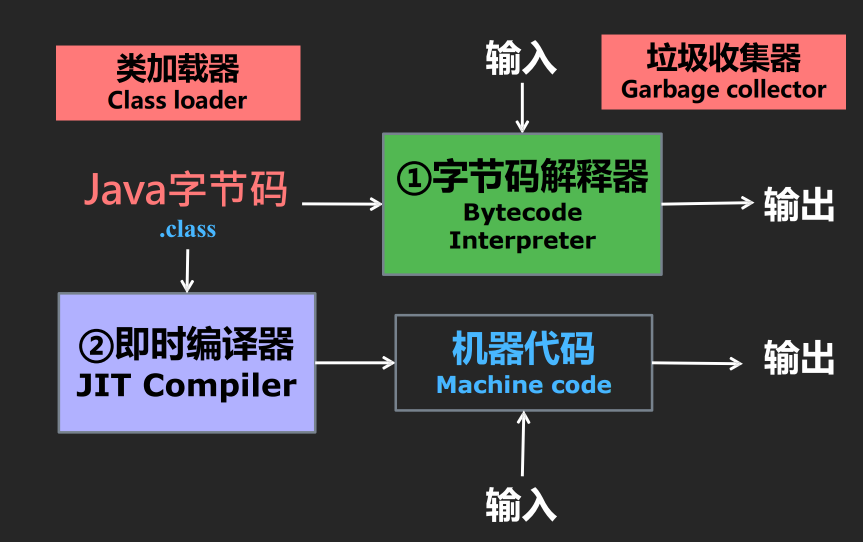

### 3.4 编译器的作用

#### 计算场景
- 传统场景：通用计算、科学计算
- 新兴场景：AI、隐私计算

#### 开发效率 (Productivity)
- 屏蔽硬件架构信息
- 支持高层编程抽象

#### 运行性能 (Performance)
- 硬件无关编译优化
- 硬件相关编译优化

#### 安全可靠 (Safety & Security)
- 类型安全
- 功能正确
- 信息流安全

!!! example 编译优化示例

```c
// 原始代码
int a = 10;
int b = 20;
int c = a + b;
int result = c * 2;

// 常量折叠优化后
int result = 60;

// 内联优化示例
// 原始
int add(int x, int y) { return x + y; }
int main() { int r = add(1, 2); }

// 内联后
int main() { int r = 1 + 2; }
```

!!!

#### 常见编译优化技术

- 跑得快

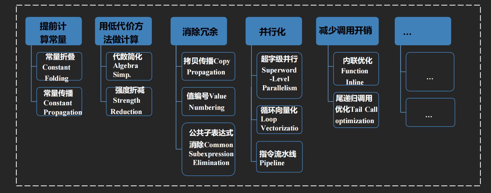


!!! example "clang编译器的优化级别"
| 优化等级   | 说明                         |
| ---------- | ---------------------------- |
| `-O0`      | 默认优化等级，不开启编译优化 |
| `-O`/`-O1` | 优化效果介于-O0和-O2之间     |
| `-O2`      | 开启大多数中级优化           |
| `-Os`      | 在-O2基础上降低生成代码体量  |
| `-O3`      | 在-O2基础上开启更多高级优化  |
| `-Ofast`   | 在-O3基础上开启更多激进优化  |
!!!

- 信得过
    - 如何有效保障软件质量是亟待解决的问题

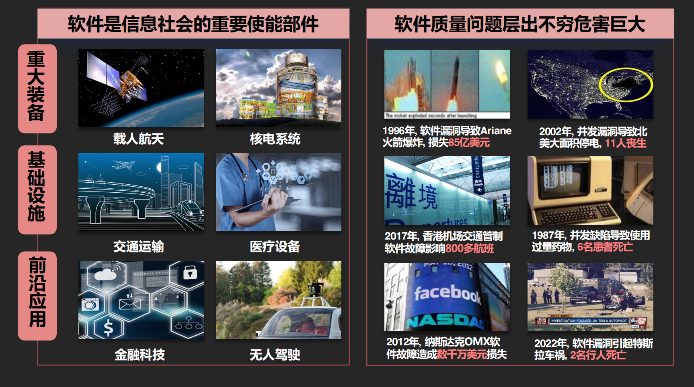

!!! example "LLVM用于代码安全"
- Clang编译器自带语法、语义(轻量级)检查
- LLVM编译器提供除“编译“(clang)之外的工具链

| 工具                      | 作用                 |
| ------------------------- | -------------------- |
| Clang Static Analyzer     | 静态代码差错         |
| llcov                     | 动态监控覆盖率       |
| AddressSanitizer (ASan)   | 动态监控内存安全问题 |
| DataFlowSanitizer (DFSan) | 动态污点分析         |
| libFuzzer                 | 模糊测试             |
| LLDB                      | 调试器               |
!!!

### 3.5 编译器与安全

!!! example 安全漏洞案例

| 年份 | 事件 | 后果 |
|------|------|------|
| 1996 | Ariane火箭软件漏洞 | 损失85亿美元 |
| 2002 | 并发漏洞导致北美大停电 | 11人丧生 |
| 2017 | 香港机场交通管制系统故障 | 影响800多航班 |
| 2022 | 软件漏洞引起特斯拉车祸 | 2名行人死亡 |

!!!


### 3.6 编译器的学科交叉性质

编译器是**多学科交叉的产物**：

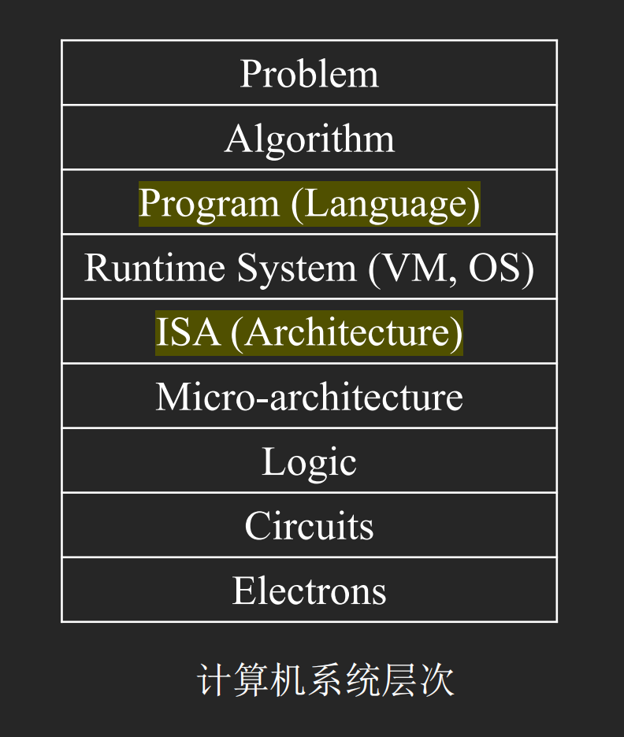

```
┌─────────────────────────────────┐
│        理论计算机科学           │
│    有限自动机, 形式文法        │
└─────────────────────────────────┘
              │
┌─────────────────────────────────┐
│        编程语言理论             │
│    类型系统，不动点迭代         │
└─────────────────────────────────┘
              │
┌─────────────────────────────────┐
│      算法与数据结构             │
│      树/图的遍历，动态规划      │
└─────────────────────────────────┘
              │
┌─────────────────────────────────┐
│        系统和体系结构           │
│  内存管理, 指令集, 并行         │
└─────────────────────────────────┘
```

> "编写编译器的原理和技术具有普遍的意义，以至于在每个计算机科学家的研究生涯中，该书中的原理和技术都会反复用到。"
> —— Alfred V. Aho (2020年图灵奖)

---

## 4. 编译器的阶段

### 4.1 编译过程概览

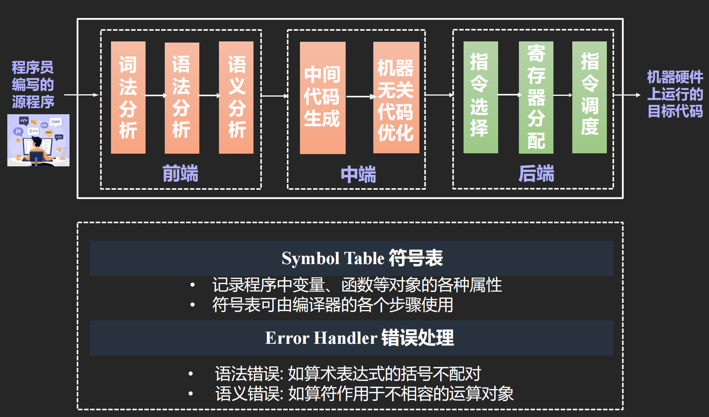

### 4.2 词法分析 (Lexical Analysis)

**功能**：将程序字符流分解为**记号 (Token)** 序列

!!! example 词法分析示例

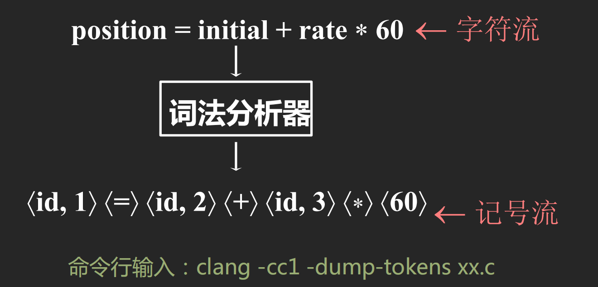

!!!

**常用工具**：Lex, Flex

### 4.3 语法分析 (Syntax Analysis)

**功能**：将记号序列解析为**语法结构**（抽象语法树 AST）

!!! example 语法分析示例

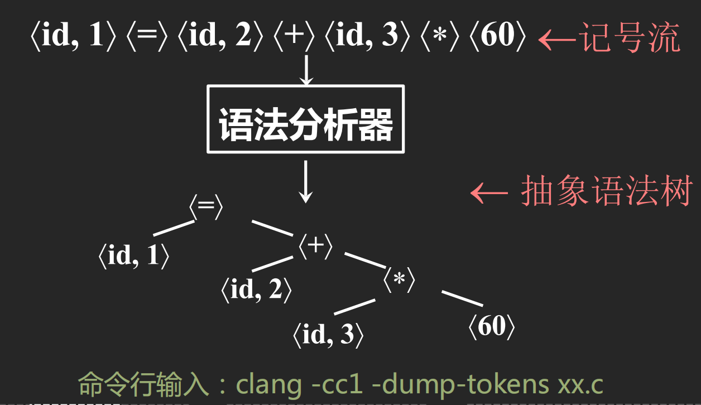
!!!

**常用工具**：Yacc, Bison

### 4.4 语义分析 (Semantic Analysis)

**功能**：收集标识符的类型等属性信息，进行**类型检查**、**作用域分析**等

!!! example 语义分析示例

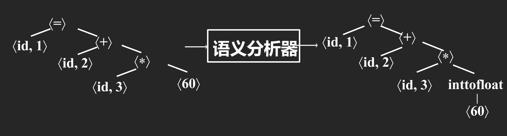

!!!

### 4.5 中间代码生成

**功能**：生成**中间代码/表示 (IR)**，是源语言与目标语言之间的桥梁

!!! example 中间代码生成示例

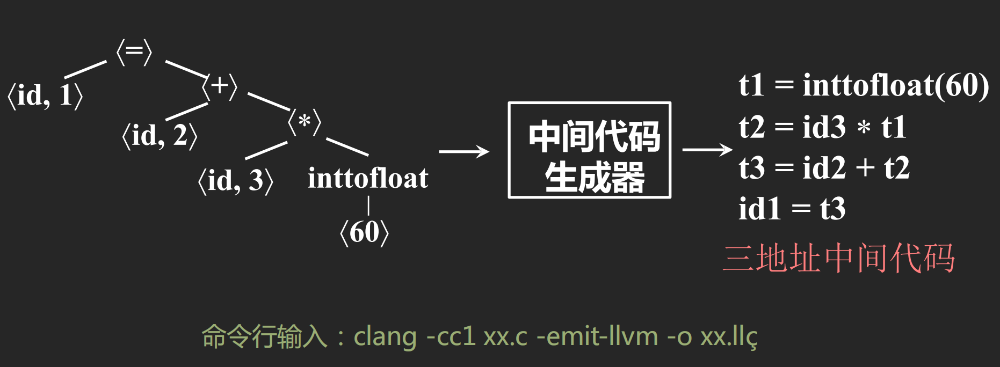

!!!

### 4.6 优化 (Optimization)

**功能**：对中间代码进行分析与变换，提高代码效率

!!! example 优化示例

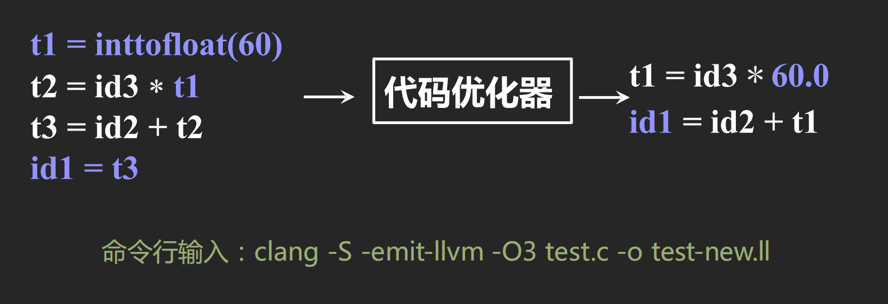

!!!

### 4.7 目标代码生成

**功能**：把中间表示形式翻译到目标语言，完成**指令选择**、**寄存器分配**、**指令调度**

!!! example 目标代码生成示例

**输入**（优化后的中间代码）：
```
t1 = id3 * 60.0
id1 = id2 + t1
```

**输出**（RISC-V 汇编）：
```asm
LDF R2, id3
MULF R2, R2, #60.0
LDF R1, id2
ADDF R1, R1, R2
STF id1, R1
```

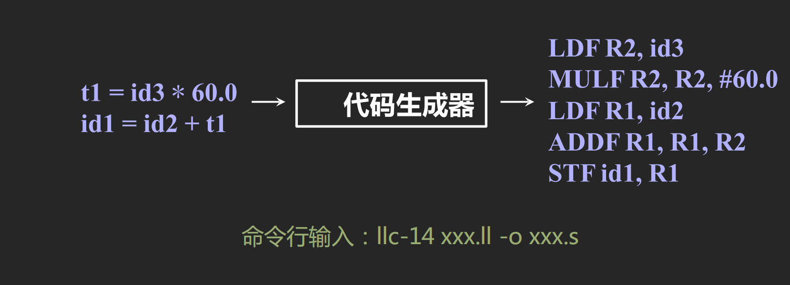

!!!

### 4.8 符号表 (Symbol Table)

- 记录程序中变量、函数等对象的各种属性
- 符号表可由编译器的各个步骤使用

### 4.9 错误处理 (Error Handler)

| 错误类型 | 示例 |
|----------|------|
| 词法错误 | 非法字符 |
| 语法错误 | 括号不配对 |
| 语义错误 | 运算符作用于不相容的运算对象 |

---

## 5. 案例：Tiger编译器

Tiger 编译器是《虎书》中使用的示例编译器，其编译流程如下：

### 5.1 Tiger 编译器流程

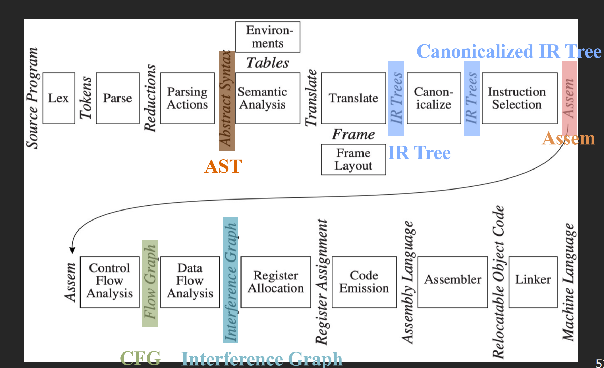

### 5.2 各阶段说明

| 阶段 | 说明 |
|------|------|
| **AST** | 抽象语法树：语法分析 + "Parsing Actions" 生成 |
| **IR Tree** | 树型中间表示：语义分析后按规则生成 |
| **Canonicalized IR Tree** | 对 IR Tree 做变换所得，方便生成汇编 |
| **Assem** | 指令选择器生成，一种特殊的汇编表示 |
| **CFG** | 控制流图，方便进行数据流分析 |
| **Interference Graph** | 从活跃变量分析结果构造，用于寄存器分配 |

---

## 总结

> **计算机科学的核心使命**："To help people turn creative ideas into working systems"（帮助人们将创意转化为可运行的系统）

编译器作为连接**人类创意**与**机器执行**的桥梁，是计算机科学中至关重要的组成部分。

```
        创意 (Source)
           │
           ▼
      ┌────────┐
      │ 编译器  │
      └────────┘
           │
           ▼
      可运行系统 (Target)
```


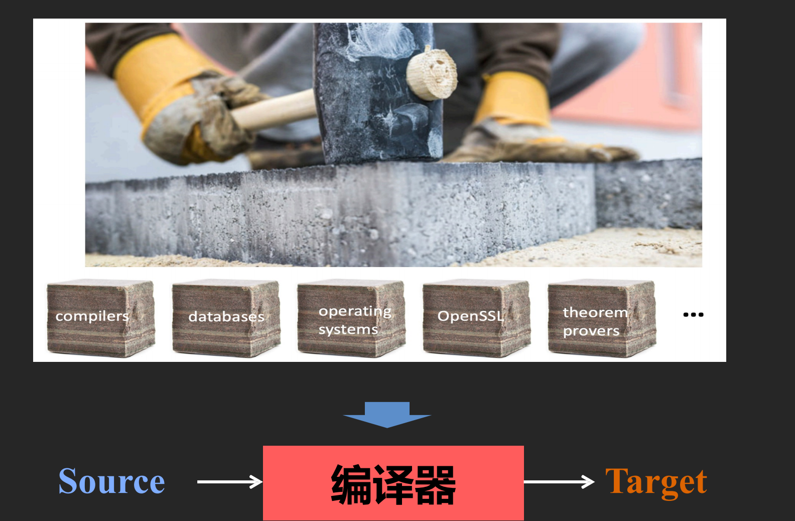

---

## 参考资料

- 浙江大学编译原理课程：https://rainoftime.github.io/
- 虎书：Modern Compiler Implementation in C
- 龙书：Compilers: Principles, Techniques, and Tools
- Stanford CS143: http://web.stanford.edu/class/cs143/
- MIT 课程主页
- UC Berkeley CS164
