## 10.1 Liveness Analysis

### 10.1.1 Why, How, What

#### 1. Why

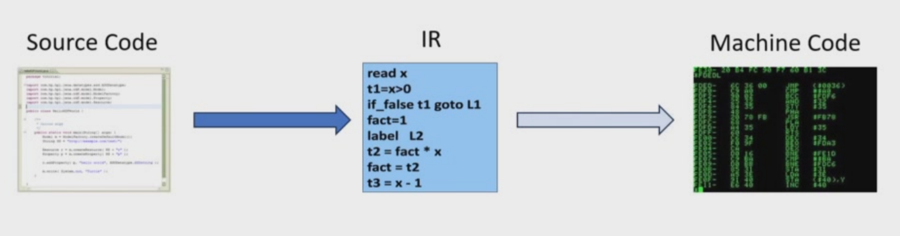

**问题**

- 中间表示`IR`：可以使用无限多个临时变量
- **真实机器中只有有限数量的寄存器可以使用**

如果临时变量`a`和`b`从来不会再同一时间被使用，那么它们**可以放进同一个寄存器**

> 因此，很多临时变量可以被安排到少量寄存器中

- 如果所有临时变量不能全部放进寄存器，多出来的临时变量可以放到内存

!!! question
编译器需要判断哪些临时变量会在同一时间被 **使用**
!!!

- **活跃性分析**：判断每个变量的活跃性
  - 如果**一个变量保存的值将来可能还会被用到**，那么这个变量就是活跃的

!!! example
```c
a = b + 1;
return a;
```

这里`a`会持续被用到，那么`a`变量就是活跃的
!!!

- 不同时活跃的两个变量就可以共用寄存器
  - `a`用`r1`，`a`用完之后，`r1`空出来,`b`用用`r1`

```
a:  [活跃------]
b:               [活跃------]
```

- 如果两个变量在某段程序中可能同时属于活跃，那么不能放在同一个寄存器里，否则后放进去的变量会覆盖前一个变量的值

```
a:  [活跃---------]
b:       [活跃---------]
```

#### 2. How

!!! question
- 如何进行活跃变量分析
- 变量`x`在语句`n`之后还会被使用吗？
!!!

上面的两个问题我们可以进一步拆拆解成下面的问题：

- 语句`n`之后，哪些语句可能会被执行 →**构建控制流图CFG**(`control flow graph`)
- `x`是否在这些后续语句中被使用？ → 分析语句本身

- 后向分析：**从未来分析到过去**

!!! example
```
a ← 0
L1: b ← a + 1
    c ← c + b
    a ← b * 2
    if a < N goto L1
    return c
```
!!!

**构建控制流图CFG**

- 节点：一条语句
- 边：控制流。如果语句`m`执行之后可能接着执行语句`n`，那么就画一条边`m -> n`

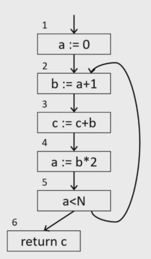

**变量b的活跃性**：从第 2 行之后，到第 4 行之前/执行时

> `b`不需要跨越第五行回到循环开头，因为第二行每次循环都会重新定义`b`

**变量a的活跃性**：`a`有两个主要活跃阶段

- 第一段：第一行定义到第二行使用
- 第二段：第四行重新定义`a`，第五行做条件判断
- 第`4`行之前旧的`a`不需要为了第`5`行保留，因为第`5`行用的是第四行新计算出的`a`

**变量c的活跃性**

变量`c`可能是

- 一个函数参数
- 一个局部变量
  - 如果是局部变量，但是之前没有初始化，那么它可能是**未定义变量**

!!! warning "为什么要重点讨论c"
- c 在第 3 行被读取和更新；
- 更新后的 c 可能继续参与下一轮循环；
- 最终还要在第 6 行 return

所以`c`的活跃范围比`a`,`b`更长，可能贯穿整个循环
!!!

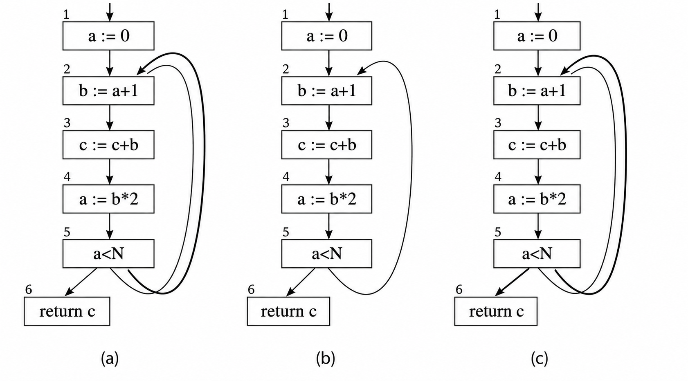

因为变量`a`和变量`b`从来不会在同一事件处于活跃状态，所以**它们可以存放在同一个寄存器中**

```
语句编号:  1    2    3    4    5    6
a 活跃:   [----]        [----]
b 活跃:        [---------]
```

#### 3. 控制流图术语
- 变量的活跃性会沿着控制流图的边 *流动*
- 活跃变量分析是一个`dataflow problem`(数据流问题)的例子
- 控制流图术语：一个控制流图节点有
  - `out-edges`:从当前节点指向后继节点的边
  - `in-edges`:从前驱节点指向当前节点的边
  - `pred[n]`:节点`n`的所有前驱节点
  - `succ[n]`:节点`n`的所有后继节点

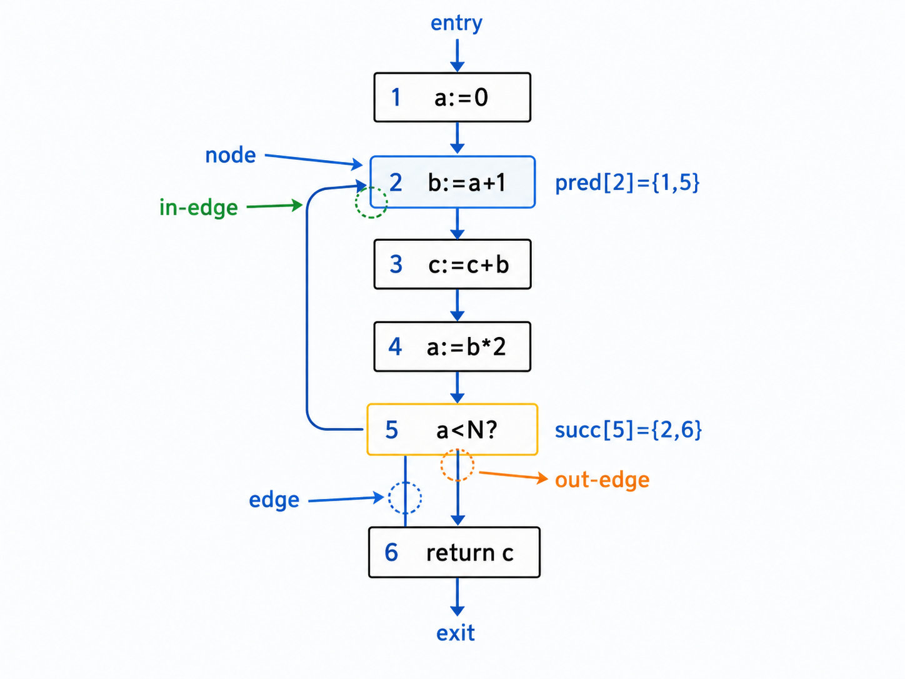

#### 4. 使用与定义

- 对一个变量或临时变量的赋值，会`define`这个变量
- 一个变量出现在复制语句的**右侧**，或者出现在**其他表达式**中，就表示这个变量被`use`
- 一个变量的`def`：指的是所有定义这个变量的**图节点集合**
- 一个变量或图节点的`use`也是类似的

!!! example
```
1: a := 0
2: b := a + 1
3: c := c + b
4: a := b * 2
5: a < N
6: return c
```

- `def`
  - `def(3) = {c}`
  - `def(4) = {a}`
  - `def(a) = {1, 4}`
- `use`
  - `use(3) = {b, c}`
  - `use(a) = {2, 5}`
!!!

#### 5. Liveness

- 定义：如果从某条控制流的边出发，存在一条**有向路径可以到达该变量的一次使用**，并且**这条路径中间没有经过该变量的重新定义**，那么这个变量在这条边上是活跃的
  - 变量之后会被用到
  - 变量之后不会被重新定义

!!! example "为什么要强调does not go through any def"

如果中间重新定义了变量，旧值就没有用处了

```
1: a := 1
2: a := 2
3: b := a + 1
```

第 1 行产生的 a 在第 1 行之后其实不是 live 的

!!!


- `live-in`:如果一个变量在进入某个节点的任意一条边上是活跃的，那么它在这个节点处就是`live-in`
  - 简单说就是进入节点`n`之前，这个变量的值还需要保留，那么它就在`n`的入口处`live-in`

!!! example
```
2: b: = a + 1
```

在执行第2行之前，必须知道`a`的值，所以`a`是语句`2`的`live-in`
!!!

- `live-out`:如果一个变量在离开某个额节点的任意一条出边上是活跃的，那么它在这个节点处就是`live-out`
  - 简单来说就是节点`n`在执行完之后，这个变量的值后面还会被用到，那么它就在`n`的出口处`live-out`
  
!!! example
```
1: a := 0
2: b := a + 1
```

第1行执行完之后，第2行要用到`a`，所以`a ∈ out[1]`,也就是 a 在节点 1 出口处`live-out`
!!!

- `Notion`
    - `in[n]`：节点 n 的 live-in 集合，也就是在进入节点 n 前活跃的变量集合。
    - `out[n]`：节点 n 的 live-out 集合，也就是在离开节点 n 后活跃的变量集合。
### 10.1.2 DataFlow Equation for liveness

#### Calculation of Liveness

活跃性信息`in[n]`和`out[n]`可以根据`use`和`def`计算出来

- `Rule 1`:如果存在某个节点`m`，它是节点`n`的后继节点，并且变量`a`在进入`m`之前是活跃的，那么变量`a`在离开`n`之后也是活跃的
  - `If a ∈ in[m] for ∃ m ∈ succ[n], then a ∈ out[n]`

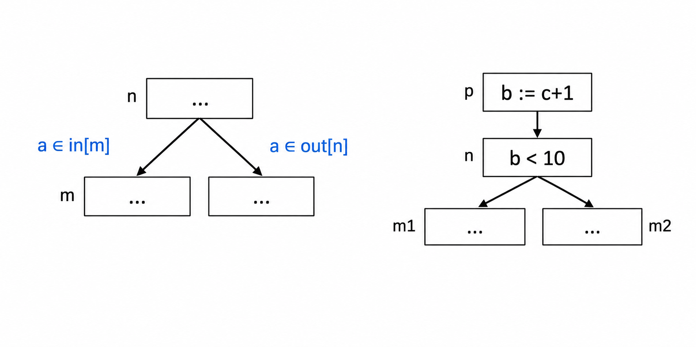

- `Rule 2`:如果变量`a`在节点`n`中被使用，那么`a`在进入节点`n`之前就是活跃的 
  - 也就是说，如果语句`n`使用变量`a`，那么在进入`n`的时候，`a`就必须是`live`的

!!! example
```
n: b < 10
```

这条语句使用了`b`，所以`b ∈ use[n]`，因此`b ∈ in[n]`
!!!

- `Rule 3`:如果变量`a`在离开节点`n`之后仍然活跃，并且节点`n`没有重新定义`a`，那么`a`在进入节点`n`之前也活跃

!!! example
```
p: b := c + 1
        ↓
n:    b < 10
      /   \
    m1     m2
```

- 已知：
  - `in[m1] = {d}`
  - `in[m2] = {e}`

**`out[n]`**:根据规则一有

```
out[n] = in[m1] ∪ in[m2]
       = {d} ∪ {e}
       = {d, e}
```

**`int[n]`**：根据规则二与规则三有

```
in[n] = {b} ∪ ({d, e} - ∅)
      = {b} ∪ {d, e}
      = {b, d, e}
```

**`out[p]`**:根据规则一有

```
out[p] = in[n] = {b, d, e}
```

**`in[p]`**:根据规则二和规则三有

```
in[p] = {c} ∪ ({b, d, e} - {b})
      = {c} ∪ {d, e}
      = {c, d, e}
```
!!!

#### Dataflow Liveness Analysis 

$$
in[n] = use[n] ∪ (out[n] - def[n])
$$

$$
out[n] = ⋃_{s ∈ succ[n]} in[s]
$$

### 10.1.3 Solving the Equations

#### 1. Calculation of Liveness

**公式**

$$
in[n] = use[n] ∪ (out[n] - def[n])
$$

$$
out[n] = ⋃ in[s], s ∈ succ[n]
$$

通过迭代求解这些方程的算法如下

```go
for each n
    in[n] ← {};
    out[n] ← {};

repeat
    for each n
        in_1[n] ← in[n];
        out_1[n] ← out[n];

        in[n] ← use[n] ∪ (out[n] - def[n]);
        out[n] ← ⋃ in[s], s ∈ succ[n];
until in_1[n] = in[n] and out_1[n] = out[n] for all n
```

#### 2. Solving Dataflow Equations

- 从一个 **粗略的近似答案**(`rough approximation to the answer`)
- 反复重新计算`in[n]`和`out[n]`
  - 每一轮迭代都会向`in[n]`和`out[n]`中加入变量
  - 也就是说，活跃变量集合会单调递增(`increases monotonically`)

!!! example
```
1: a := 0
2: b := a + 1
3: c := c + b
4: a := b * 2
5: if a < N goto 2
6: return c
```

- `Step 1`:给出控制流图
  - 因为要判断变量在 **未来是否还会被用到**，所以活跃变量分析是 **逆向数据流分析**

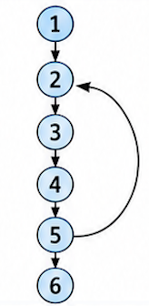

- `Step 2`:写出每个节点的`use`和`def`

| 节点 | 语句         | use[n]   | def[n] |
| ---- | ------------ | -------- | ------ |
| 1    | `a := 0`     | ∅        | `{a}`  |
| 2    | `b := a + 1` | `{a}`    | `{b}`  |
| 3    | `c := c + b` | `{b, c}` | `{c}`  |
| 4    | `a := b * 2` | `{b}`    | `{a}`  |
| 5    | `a < N`      | `{a}`    | ∅      |
| 6    | `return c`   | `{c}`    | ∅      |


- `Step 3`:使用两个核心公式

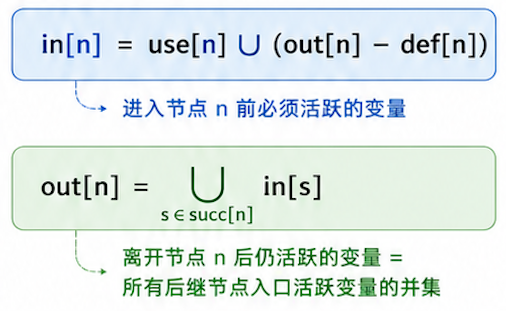

- `Step 4`:我们要多次迭代扫描直至产生一个稳定的`in-out`表
  - 顺序扫描往往收敛较慢
  - 同样的方程，按照逆序扫描通常收敛更快
  - 这是因为活跃变量分析是 **后向分析**

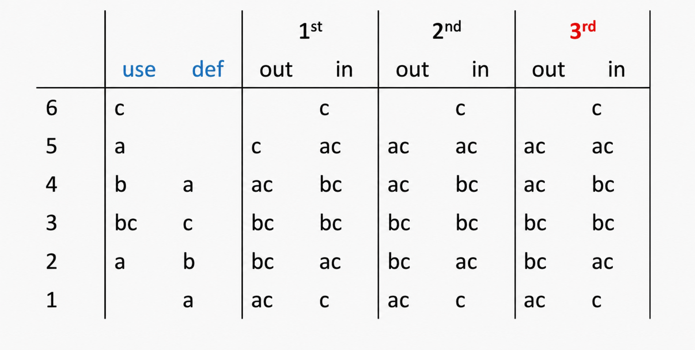

- `Step 5`:得到最终稳定的结果

| 节点 | in[n]    | out[n]   |
| ---- | -------- | -------- |
| 1    | `{c}`    | `{a, c}` |
| 2    | `{a, c}` | `{b, c}` |
| 3    | `{b, c}` | `{b, c}` |
| 4    | `{b, c}` | `{a, c}` |
| 5    | `{a, c}` | `{a, c}` |
| 6    | `{c}`    | ∅        |

!!!

- 当用迭代法求解数据流方程时，计算顺序应该遵循 **数据流动**的方向
- 活跃性沿着控制流箭头的反方向传播，并且是从`out`传播到`in`，因此计算也应该按照这个方向进行

## 10.2 More Discussions

### 10.2.1 Variants of the Calculations

- **Basic Blocks**:在控制流图中，如果某些节点只有一个前驱和一个后继，那么这些节点本身并不是很有分析价值
  - 可以把这些节点和它们的前驱、后继合并起来
  - 从而得到一个节点更少的图，其中**每个节点代表一个基本块**

!!! example
```
1: a := 0
2: b := a + 1
3: c := c + b
4: a := b * 2
5: if a < N goto L1
6: return c
```

这样图里面有`6`个节点，但是如果中间有一串语句是顺序执行的、没有分支、没有跳转入口，例如：`2 -> 3 -> 4`,并且每个节点都只有一个前驱和一个后继，那么它们可以合并成一个更大的节点，也就是`basic block`
!!!

- **One variable at a time**:当需要某个变量的信息时，可以一次只针对这个变量计算数据流信息
  - 这也是很实用的，因为很多临时变量的活跃区间都非常短

!!! example
```
in[4] = {b, c}
out[4] = {a, c}
```

表示一次性追踪所有变量，但是有时候我们只关心某一个变量，比如只想知道`a`在哪里活跃。那就可以只计算`a`的活跃性，而不同时计算`b`,`c`
!!!

### 10.2.2 Representations of Sets

!!! question
在实现中，如何表示`in[n]`和`out[n]`？
!!!

**Operations**

- 集合并集
- 集合差集

> 也就是我们两个核心公式中用到的操作


#### 1. Bit Arrays(适合稠密集合)

- 假设：程序中有`N`个变量，每个机器字有`K`个bit

那么

- 每个集合需要`N`个`bit`
- 每个集合求并集时，只需要对对应位置的`bit`做`OR`运算
- 一次集合并集操作大约需要`N/K`次机器字操作

!!! example
假设程序里有`5`个变量：`a,b,c,d,e`

给每个变量一个编号：

```
a -> 第 0 位
b -> 第 1 位
c -> 第 2 位
d -> 第 3 位
e -> 第 4 位
```

如果集合是`{a,c,e}`，那么用`bit array`表示就是`10101`

假设：

```
S1 = {a, c}  = 10100
S2 = {b, c}  = 01100
```

那么：`S1 ∪ S2 = 11100 = {a, b, c}`（也就是计算时只需要做按位OR）
!!!

!!! question
为什么说位数组适合`dense set`
!!!

不管集合里面有多少元素，位数组长度固定都是`N`，做并集只需要扫描这些`bit`

#### 2. Sorted Lists(适合稀疏集合)

- 按照某种全序`key`排序，比如变量名
- 并集操作可以通过**合并两个有序列表**来完成

!!! question "为什么适合稀疏集合"
如果某个节点的活跃变量很少，但是如果使用`bit array`还是要占据一块固定大小的内存，但实际上只存这几个变量就够了

所以当集合**平均元素个数小于`N/K`**时，`sorted-list`表示通常**更快**
!!!

> 这里`N/K`代表的是一次操作需要处理的机器字的个数

**当集合是稀疏的，也就是平均元素个数少于`N/K`时，有序列表表示更快**

### 10.2.3 Time Complexity

!!! question
迭代式数据流分析有多快？
!!!

假设一个程序规模为`N`：最多有`N`个控制流图节点，最多有`N`个变量

每次集合合并操作需要`O(N)`时间

- **For Loop**:每个节点只做常数次集合操作
  - 一共有`O(N)`个节点，所以一轮完整扫描的时间是$O(N^2)$

!!! note "为什么一轮扫描是 O(N²)"
每个`in[n]`、`out[n]`都是变量集合，我们涉及到的集合操作包括

```
out[n] - def[n]
use[n] ∪ (...)
```

最多要看`N`个变量，所以一次集合操作是$O(N)$

每个节点只做常数次集合操作，比如并集、差集，所以每个节点是：$O(N)$

整个一轮扫描是：$O(N) \times O(N) = O(N^2)$
!!!

- **Repeat Loop**:所有`in`和`out`集合的大小总和最多是$2N^2$，这也是`repeat`循环最多可能迭代的次数
  - `in`和`out`集合是单调增长的，不可能无限增长

!!! note "为什么repeat loop 最多迭代 2N² 次？"
如果有`N`个节点，那么一共有`2N`个集合，**每个集合最多包含N个变量**

所以所有集合加起来最多有：`2N × N = 2N²`
!!!

- **最坏运行时间**：$O(N^4)$
- 在实际中
  - 运行时间通常在$O(N)$到$O(N^2)$之间
  - 如果计算顺序安排的好，会更快

### 10.2.4 Least Fixed Points

这里的`fixed point`指的是：反复迭代计算`in[n]`和`out[n]`，结果不再变化、也就是**本轮算出来的 in/out = 上一轮的 in/out**

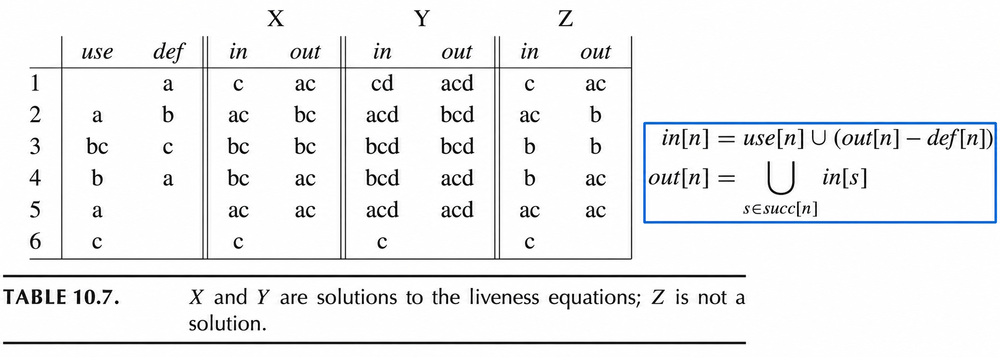

假设还有另一个程序变量`d`，它在这段代码中根本没有被使用。那么理论上，如果我们把`d`也到处加入`in/out`集合，有时方程仍然可能成立

!!! example
比如`X`中某个集合是`{a,c}`，Y里面可能变成`{a,c,d}`。如果`d`没有被定义，也没有被消除，它可能会一直 **被错误地认为活跃**，而共识本身不一定能把它排除掉
!!!

数据流方程的任何解都是`conservative approximation`，保守近似

- 如果在某次执行中,变量`a`在节点`n`之后确实还需要被使用，那么在这些方程的任何解中，我们都可以保证`a ∈ out[n]`
- 但是翻过来不一定成立，`a ∈ out[n]`并不意味着`a`的值将来真的一定会被使用

- 在活跃变量分析中，如果我们认为某个变量是活跃的，那么我们就会*确保它的值保存在某个寄存器中*
- 活跃变量分析中的 **保守近似**指的是：我们可能会错误地认为某个变量是活跃的，但是绝不会错误地认为一个仍然需要的变量已经死亡
  - 可以把`dead`误判成`live`
  - 不能把`live`误判成`dead`
- 保守近似的后果是：编译后的代码可能会使用比实际需要更多的寄存器；但是*它一定能计算出正确答案*

!!! example


对于这个例子中，考虑活跃变量集合`Z`，它们没有满足数据流方程

根据`Z`的结果，变量`b`和`c`从来不会同时活跃

因此我们可能会把它们分配到同一个寄存器

这样生成出来的程序会计算出错误结果
!!!

- 用于编译器优化的数据流方程应该这样设计：它的任何一个接都能向优化器提供保守的信息(`conservative information`)
  - 不精确的信息可能导致程序不是最优的(`suboptimal`)，但是**不能导致程序错误**
  - 比如活跃变量分析中，如果某个变量其实已经死了，但我们误以为它还活着，最多只是浪费寄存器；但如果某个变量其实还活着，我们却误以为它死了，就可能覆盖它的值，导致程序计算错误
  - 所以数据流分析的原则是：**可以不够精确，但是必须安全**
- **定理**：一个数据流方程可能有多个解
  - 前面的表格中，`X`和`Y`都满足活跃变量方程，所以它们都是`fixed point`。但是`Y`可能包含更多变量，比如把一个没有用到的变量`d`也加入了很多`in/out`集合
  - 如果`X`是方程的一个解，并且方程的所有其他解都包含`X`，那么我们称`X`是方程的最小姐，也就是`least fixed point`
  - 方程**存在一个最小不动点**，并且**迭代算法总是能够计算出这个最小不动点**(重要结论)

!!! note "如何证明这个重要的结论"
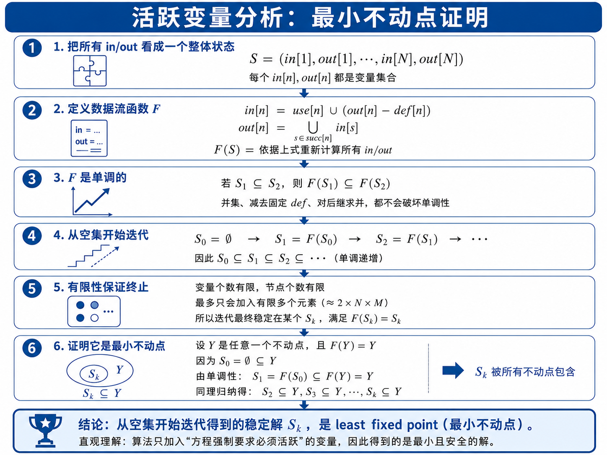
!!!

### 10.2.5 Static and Dynamic Liveness

```
1: a := b * b
2: c := a + b
3: if c ≥ b
4:     return a
5: else
       return c1: a := b * b
2: c := a + b
3: if c ≥ b
4:     return a
5: else
       return c
```

- `Node 1`: a = b * b >= 0
- `Node 2`: c = a + b >= b
- `Node 3`: always be true
- `Node 5`:Never be reached

活跃边来个方程并不知道条件分支实际会走哪一边

如果方程 *更聪明*，能够理解条件一定成立，那么就可以允许`a`和`c`分配到同一个寄存器

- 没有任何编译器能够完全理解每个程序中的所有控制流到底会怎样执行
  - 这是一个基本数学定理，可以从停机问题推出
- **定理**：不存在这样一个程序`H`，它能接受任意程序`P`和输入`X`，并且自己不会陷入死循环；如果`P(X)`会停机，它就会返回`true`；如果`P(X)`会无限循环，它就会返回`false`
- **推论**：不存在这样一个程序`H'(P,L)`，它能对任意程序`P`和程序中的任意标签`L`，判断`L`在某次执行中是否会被到达
  - 证明思路：如果`H'`存在，那么`H`也会存在

### 10.2.6 Conservative Approximation

这个定理并不是说我们永远无法判断某个给定标签是否会被到达，而是说不存在一个**通用算法**能够正确判断这个问题

我们可以用一些特殊情况算法来改进 **活跃变量分析**；但是没有任何编译器能够真正完全判断一个变量的值是否真的需要，也就是这个变量是否真正活跃

因此我们必须要使用 **保守近似**的思想(假设任何条件分支的两条路径都可能执行)

!!! example
`if condition goto L1 else L2`，普通活跃变量分析通常会认为 *L1和L2都可能执行*；所以它会把两个分支上的活跃变量都考虑进去：`out[n] = in[L1] ∪ in[L2]`,这就是保守近似
!!!

因此，我们有一个动态条件以及它的静态近似

- **Dynamic Liveness**:如果程序的某次**真实执行**(`some executions`)从节点`n`出发，到达了变量`a`的一次使用，并且中间没有经过对`a`的重新定义，那么变量`a`在节点`n`处是动态活跃的
- **Static Liveness**:如果在控制流图中，存在一条从节点`n`到变量`a`的某次使用的路径(`some path of control-flow edges`)，并且这条路径中间没有经过对`a`的重新定义，那么变量`a`在节点`n`处是静态活跃的

> 如果变量`a`是动态活跃的，那么它也一定是静态活跃的

!!! example
```
1: a := b * b
2: c := a + b
3: if c >= b goto 4 else goto 5
4: return a
5: return c
```

从数学上看

```
a = b * b >= 0
c = a + b >= b
```

所以`c≥b`一定为真，真是执行只会向`Node 4`执行，`Node 5`上的`c`在节点`3`后面动态上可能并不活跃

但是静态控制流图看到节点`3`有两条边

```
3 -> 4
3 -> 5
```

它无法证明第`5`条边不可达，于是保守地认为两边都可能走，所以静态分析可能认为` **a和c都可能活跃**

这就是静态活跃性比动态活跃性更守保守
!!!

## 10.3 Interference Graph

- 活跃变量分析最重要的应用之一是 **寄存器分配**
- 我们有一组临时变量`a,b,c`以及一组真实寄存器`r1,r2,...,rk`
- 如果某种条件导致`a`和`b`不能被分配到同一个寄存器，那么这种关系就叫做`interference`,也就是冲突/干涉
- 冲突有两种类型
  - 活跃区间重叠(`overlapping live ranges`)
  - 如果变量`a`必须由，藕条不能访问寄存器`r1`的指令产生，那么`a`和`r1`之间也存在冲突

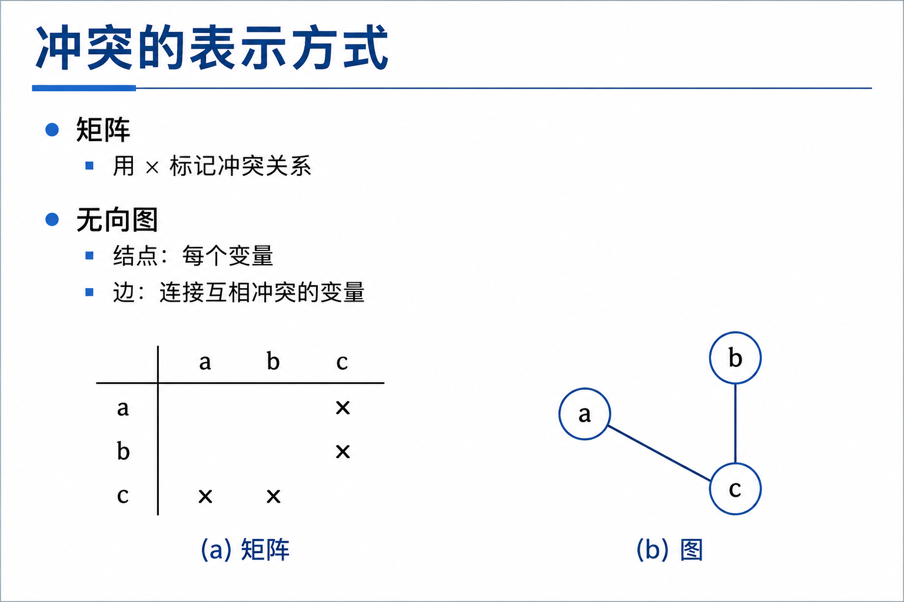

### MOVE指令的特殊处理

不要在一条`MOVE`指令的源操作数和目标操作数之间认为制造冲突

!!! example
```
t := s        copy
...
x := ... s ...    use of s
...
y := ... t ...    use of t
```

这里`t`是由`s`copy得到的，虽然之后`s`和`t`都会被使用，但是由于`t`最初只是`s`的副本，它们可以放在同一个寄存器中

```
t := s        copy
t := ...      non-move
x := ... s ... use of s
...
y := ... t ... use of t
```

这里`t`被重新赋值了一次，而且这个赋值不是简单的`copy`，此时`t`的值已经不等于`s`了。如果这时候`s`仍然`live`，那么`s`和新的`t`就必须同时保存不同的值，因此它们**不能再共用寄存器**，所以这时候建立冲突边`t - s`
!!!


因此，对于每一次新的变量定义，添加冲突边的方法如下

1. 对于任何非`move`指令`n`：如果这条指令定义了变量`a`，并且`out[n] = {b1, ..., bj}`,那么添加冲突边`(a,b1),(a,b2),...,(a,bj)`,也就说`a`要和`out[n]`中所有活跃变量冲突
2. 对于`MOVE`指令`n`：如果这条指令`a:=6`并且`out[n] = {b1, ..., bk}`,那么所有不等于`s`的`bi`，添加冲突边`(a,bi)`,也就是说 **a和`out[n]`中除了`s`以外的变量都冲突**

!!! question
如果一个刚刚被定义的临时变量，在定义之后立刻就不活跃了，会怎样？

- 一个变量被定义了，但是之后从来没有被使用，那么通常没有必要把它放进寄存器
- 但是，如果这条定义该变量的指令仍然会执行，例如它还有其他副作用，那么它仍然会写入某个寄存器
  - 这个被写入的寄存器是最好不要保存任何其他活跃变量
  - 因此即使某个变量的活跃区间长度为0，它仍然会和那些在同一位置活跃的变量发生冲突
!!!

