!!! note 
**为什么需要寄存器分配**

- 速度：寄存器快于内存，寄存器比缓存快大约2-7倍
- 真实机器上的寄存器数量是有限的

**什么是寄存器分配**

- 寄存器分配器的任务，就是把很多临时变量分配到`K`个机器寄存器中
- requirements：使用不超过`K`个寄存器生成正确的代码
  - 正确性
  - 寄存器数量限制
  - 效率

**如何实现寄存器分配**

- **Graph Coloring**:有效但是效率比较差
- **Linear Scan**:更高效，有效性比较相似

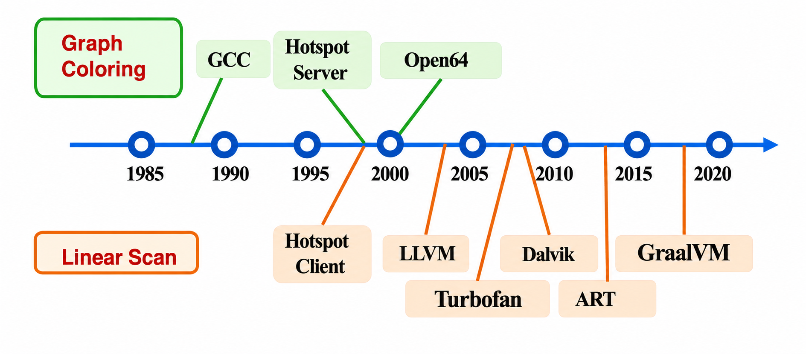

- 通过图着色进行寄存器分配
  - 构造一个冲突图
  - 对冲突图进行着色
- 任意一对被冲突边连接的节点，都不能被 分配相同的颜色
  - 颜色对应真实寄存器
!!!

## 11.1 Coloring By Simplification

- 寄存器分配是一个`NP-complete`问题
  - 图着色也是`NP-complete`问题
- 有一种线性时间的近似算法，在实践中效果很好
  - 它的主要阶段包括：`Build,Simplify,Spill and Select`

### 11.1.1 Build

- 构造冲突图
  - 每个节点表示一个临时变量
  - 一条边`(t1,t2)`表示临时变量`t1`和`t2`不能被分配到同一个寄存器
  - 需要对程序中的所有位置进行分析
- 产生冲突边最常见的原因是：**`t1`和`t2`在同一时间都是活跃的**

### 11.1.2 Simplify

使用一个简单的启发式方法对图进行着色

- 假设图`G`中有一个节点`m`，其邻居数量少于`K`(`K`：机器寄存器的数量)
- 通过移除`m`，得到图`G'=G-{m}`

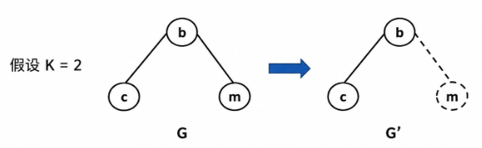

- 这自然引出了一个 **基于栈**的或者**递归式**的图着色算法
  - 反复移除度数小于`K`的节点，并把这些节点压入栈中
  - 每进行一次这样的简化，都会降低其他节点的度数，从而带来更多可以继续简化的机会

> 也就是说，删掉一个节点后，它的邻居少了一个连接边，邻居的度数也会降低。原来不能删的节点，可能因此变成可以删

- 如果一个节点的度数小于`K`，那么它一定可以用`K`种颜色完成着色
- 递归地从图中删除可以`K`着色的节点，并把它们压入栈中，知道图中只剩下重要度数的节点，也就是 **度数≥K**的节点

### 11.1.3 Spill

- 在简化过程中，可能会出现某一时刻，图`G`中只剩下 **重要度数**的节点，也就是所有节点的度数都满足(`degree ≥ K`)
- **溢出**：我们可以选择图中的某个节点，并决定把它**表示在内存中**，而**不是放在寄存器中**
- **乐观着色**
  - 对`spill`效果的一种乐观近似是：被选择溢出的节点，不再和图中剩下的其他节点发生冲突
  - 因此可以把这个节点从图中删除并压入栈中，然后继续`Simplify`简化过程

**基本方法**

- 选择一个节点作为 **溢出的候选节点**
- 把它从图中移除并放入栈中

!!! example
选择节点`b`，然后继续简化，依次删除`d,a,c`

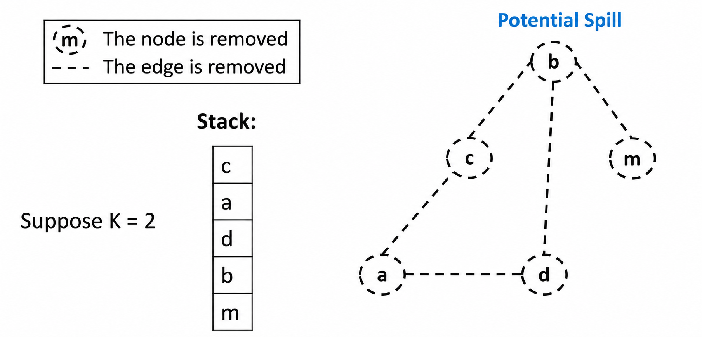

> `m`是安全可以简化的安全节点，可以最先被删除并压栈
!!!

### 11.1.4 Select

给图中的节点分配颜色

- 从空图开始，我们不断从栈顶取出节点，把它重新加入图中，从而逐步恢复原来的图
- 当我们把一个节点加入图中时，必须给它找到一种可用的颜色
- 当一个之前通过`Spill`启发式压入栈的潜在节点`n`被弹出时，**不能保证它一定可以被着色**
- 如果`n`的邻居使用的颜色数目少于`K`，那么我们就可以给`n`着色，`n`就不会变成真正的`spill`
- 这种技术叫做 **乐观着色**

!!! example
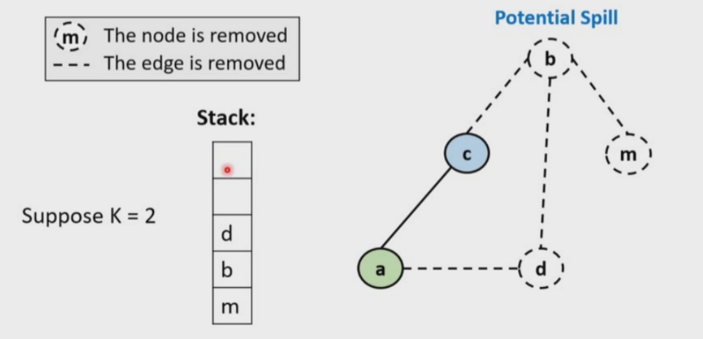

根据目前栈的情况，我们`Select`的操作顺序是

1. 弹出 c，给 c 染色
2. 弹出 a，把 a 加回图中，给 a 染色
3. 弹出 d，把 d 加回图中，给 d 染色
4. 弹出 b，把 b 加回图中，尝试给 b 染色
5. 弹出 m，把 m 加回图中，给 m 染色

这个`b`是我们的`potential Spill`，这个节点在入栈时并不满足`degree < k`，所有它将来放回来时，不保证一定有颜色可选

比如此时我们`b`的邻居颜色集合可能是`{绿色, 蓝色}`,但是两种颜色都被占了，`b`就找不到颜色。此时`b`才变成真正的`spill`，需要放到内存中

但是如果`b`的邻居虽然很多，但是最终只用了少于`K`种颜色，例如`邻居颜色集合 = {绿色}`，那么`b`仍然可以用蓝色。此时`b`虽然之前是`potential spill`，但是最后不需要真正`spill`，这就是乐观着色

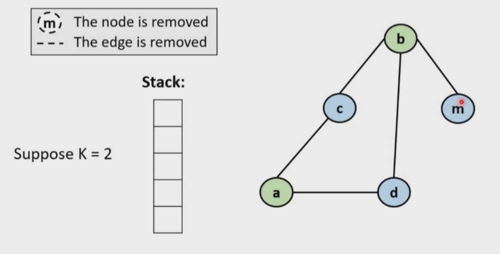
!!!

- 如果节点`n`的所有邻居已经使用了`K`中不同的颜色
    - 那么就发生了真正的溢出
    - 我们不给这个节点分配任何颜色，而是继续执行`Select`阶段，以找出其他**真正需要溢出的节点**

!!! example
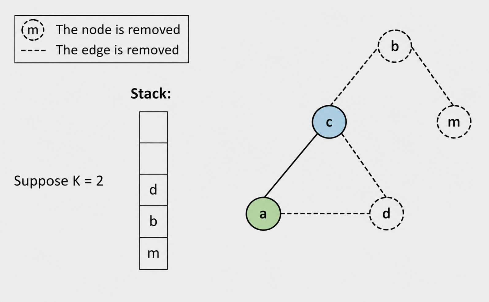

这里`d`成为了`actual spill`，因为`K=2`，现在`d`的邻居已经把两种颜色都占满了，也就是它最终不能放进寄存器，只能放到内存中
!!!

### 11.1.5 Start Over

如果`Select`阶段无法为某些节点找到颜色，那么程序必须被重写

- 在每次使用这些变量之前，先从内存中把它们取出来
- 在每次定义这些变量之后，再把它们存回内存

因此，一个被溢出的临时变量会变成若干个新的临时变量，这些新临时变量的**活跃区间很短**。它们仍然会和图中的其他临时变量发生冲突

所以，需要在重写后的程序上重新执行寄存器分配算法。这个过程会不断迭代，知道`Simplify`阶段成功完成，并且不再产生`spill`


!!! example
假设有一个临时变量`t`，它被决定`spill`

原始代码可能是

```
t := a + b
x := t * 2
y := t + 1
```

如果`t`不能放寄存器，就要把它放到内存槽里，比如`mem[t]`，重写之后大概变成

```
t1 := a + b
mem[t] := t1

t2 := mem[t]
x := t2 * 2

t3 := mem[t]
y := t3 + 1
```
!!!

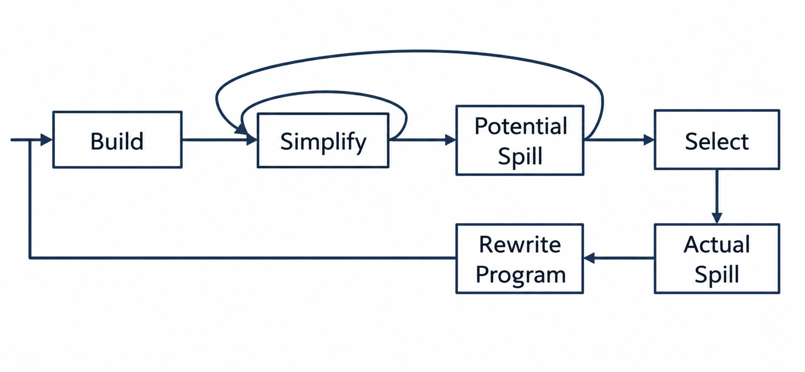

!!! example
整个流程示例

- `K=4`
- `simplify`这个阶段可以从`f,h,c,f`这几个节点开始
  - 因为他们的邻居数目少于`K`


我们每次删除只需要找到当前邻居数目少于`K`的节点就可以作为候选节点

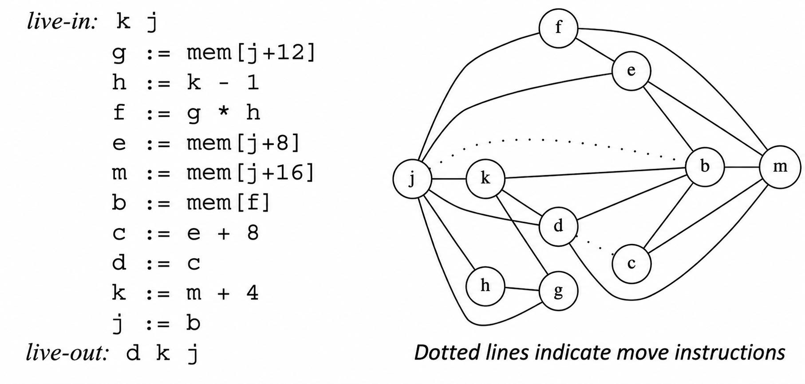

最初状态下，`g,h,c,f`这几个节点的度数都小于`4`，所以它们都可以作为最早被删除的候选节点

> 删除一个节点后，它相关的边也会被删除。这样其他节点的度数可能会下降，于是又会产生新的可删除节点

依据上述原则我们可以得到一个可能的入栈序列：`g → h → k → d → j → e → f → b → c → m`

> 这个顺序不是唯一的，只要每一步删除的节点当时满足`degree < 4`就是合法的

接下来进入`Select`阶段，这个阶段恰好和`Simplify`相反

- 从栈顶弹出节点
- 重新放回图中
- 给它分配一个可用的寄存器

也就是按照反向顺序处理：`m → c → b → f → e → j → d → k → h → g`。每次给一个节点分配寄存器时，只要它不能和已经着色的邻居使用同一个寄存器即可

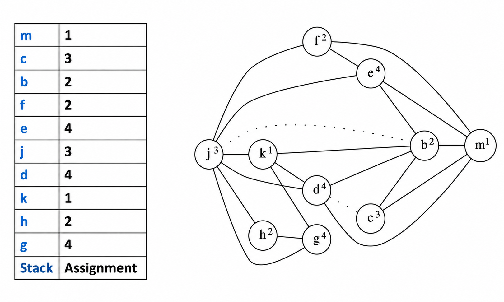
!!!

## 11.2 Coalescing

### 11.2.1 What

- 如果一条`MOVE`指令的源节点和目标节点之间，在冲突图中没有变：那么这条`MOVE`指令可以被消除
- 源节点和目标节点被 **合并**(`coalescing`)成一个新的节点。这个新节点的边，是原来两个节点的边的并集

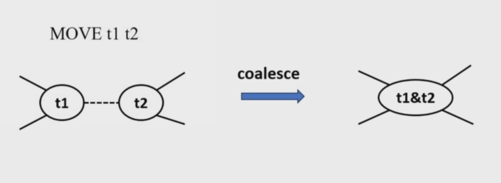

### 11.2.2 Why

- 合并可能会提高图的可着色型

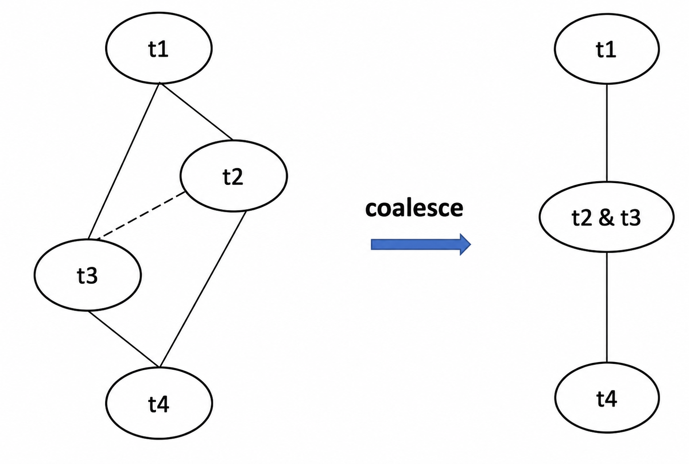

合并之后，`t1`和`t4`都只剩下一个邻居

### 11.2.3 Conservative Coalescing

- **问题**
  - 被引入的新节点比被删除的旧节点受到更多，因为它包含了两个节点边的并集
  - 一个在合并前可以用`k`种颜色着色的图，在鲁莽合并之后(`reckless coalescing`)可能不再能用`k`种颜色着色
- **Idea**:`conservative coalescing`(保守合并)
  - 只在安全的时候进行合并
  - **safe**:合并之后不会让图变得不可着色

> 也就是说，合并之前能用`K`个寄存器分配，合并之后仍然能够用`K`个寄存器分配

*如何判断一次合并是否安全*

- `Briggs`
- `George`

#### 1. Briggs

- 如果把节点`a`和节点`b`合并后得到新节点`ab`，并且`ab`的 **significant degree**要少于`K`个，那么`a`和`b`要合并
- 这种合并可以保证：不会把一个原本可以用`K`中颜色着色的图，变成不能用`K`种颜色着色的图
- 用寄存器分配语言就是：如果原来能用`K`个寄存器分配，那么按照`Briggs`准则合并之后，也**不会因为这次合并导致寄存器分配失败**
  - `Simplify`阶段就会把所有 **不重要度数**的节点都删除掉(`degree < K`的节点)
  - 合并后的节点最终只会和那些原本是重要度数的邻居相邻
  - 如果合并节点`ab`的重要度数邻居少于`K`个，那么`Simplify`阶段仍然可以把`ab`删除掉

!!! example
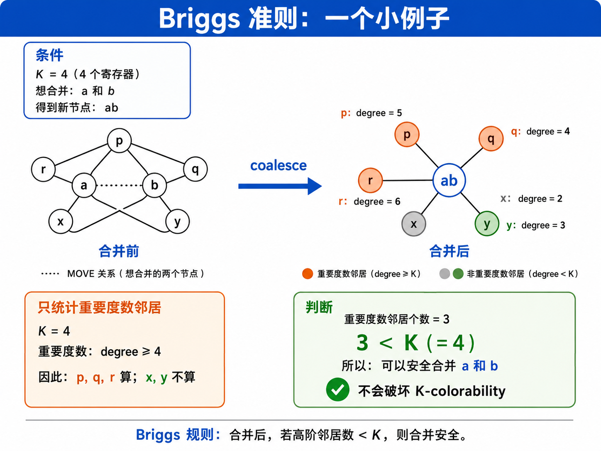
!!!

#### 2. George

 如果对于`a`的每一个邻居`t`，都满足下面*两个条件之一*，那么节点`a`和`b`可以合并

1. `t`本来就和`b`冲突
2. 或者`t`是低度数节点，也就是

```
degree(t) < K
```

这种合并是安全的

- 如果`t`本来就和`b`冲突，那么合并`a`和`b`之后，`(a,t)`和`(b.t)`会变成`(ab. t)`，这不会增加新节点`ab`的度数
- 如果`t`是低度数节点，那么它会在`Simplify`阶段被删除，所以也不会真正增加合并后节点的着色压力

!!! note "Summary"
- Briggs看的是 *合并后ab有多少个高度数邻居*
- `George`看的是`a`的每个邻居`t`是否安全
!!!

### 11.2.4 Coloring with Coalescing

`coalesce,simplify,spill`这些过程应该交替进行，直到图为空

#### 1. Build

- 构造冲突图(`interference graph`)
- 把每个节点分类为`move-related`或`non-move-related`
  - 如果一个节点是某条`MOVE`指令的源操作数或目标操作数，那么它就是`move-related`

> `move-related`节点可能有机会通过`coalscing`合并，从而删除`MOVE`指令

#### 2. Simplify

依次删除一个非`move-related`且低度数节点，也就是`degree < K`的节点

#### 3. Coalesce

- 在简化后的图上执行保守合并
- 如果合并后的新节点不再与`MOVE`相关联，那么它可以在下一轮`Simplify`中被删除
- `Simplify`和`Coalesce`会反复执行直到图中只剩下高度数节点或者`move-related`节点

#### 4. Freeze

- 如果某些`MOVE`相关节点不能安全`coalesce`，但是它们又阻碍`simplify`，那么编译器可能选择一个低度数的`move-related`节点并将其参与的`move`指令`freeze`
  - `freeze`:放弃某些`MOVE`的合并机会，把相关节点当成普通节点处理
  - 这会使该节点，也可能包括与这些被冻结的`move`相关的其他节点被看做是`non-move-related`节点

## 11.3 Precolored