- **Automatic Memory Management**:内存回收(`Reclamation`)时自动完成的
- **Garbage**：已经被分配，但是不再被使用的存储空间

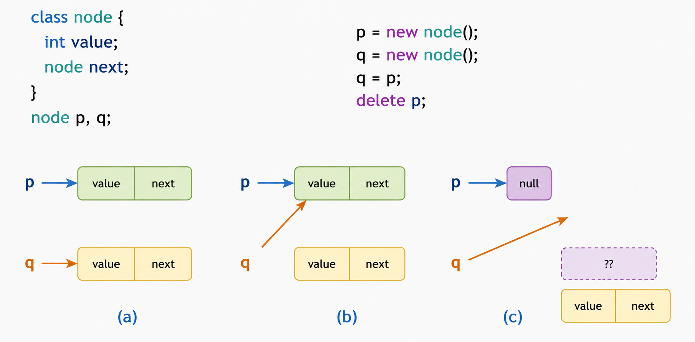

## 1. Garbage Collection

### 1.1 What

- **Garbage Collection**:在不显式调用`free`的情况下，自动回收那些已经分配但是不再使用的存储空间的过程
- 垃圾回收**不是由编译器完成的**，而是由 **运行时系统**(`runtime system`)完成的。
  - 运行时系统可以理解为：和编译后程序*一起链接、一起运行的一组支持程序*

### 1.2 How

- 理想情况下，任何不是 **动态活跃**的记录都是垃圾
  - 也就是说，如果一个对象在程序未来的计算中不会再使用，那么它就是垃圾
- 但是，判断一个对象是否一定是垃圾是 **不可判定的**，因此需要一种 **conservative approximation**
- **基本思想**：使用可达性信息作为近似判断
  - 如果一个堆上分配的记录，不能通过程序变量出发的一系列指针链访问到，那么它就是垃圾
  - **Conservative**:**不可达就是垃圾**

!!! warning
实际上垃圾仍然可能是可达的
!!!

- 一个对象`x`是可达的，当且仅当
  - 某个寄存器包含指向`x`的指针
  - 或者另一个已经可达的对象`y`中包含指向`x`的指针


### 1.3 Basic Data Structure:Directed Graph

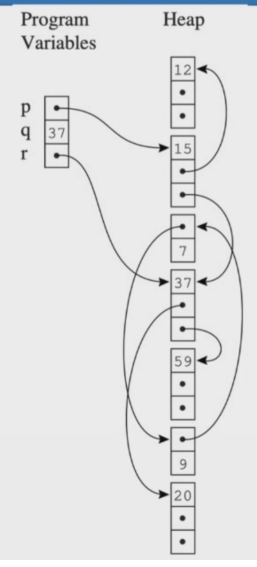

- 程序变量和堆上分配的记录共同构成一张有向图
  - `nodes`:分配的变量
  - `edge`:表示指针指向关系
- 程序变量是这张图的 **根节点**，这些根节点包括
  - 寄存器中的变量
  - 栈上的局部变量和形参
  - 全局变量
- 如果存在一条从某个根节点`r`出发，沿着有向边到达节点`n`的路径，那么节点`n`的路径，那么节点`n`是可达的
  - 这里`r`是某个根节点

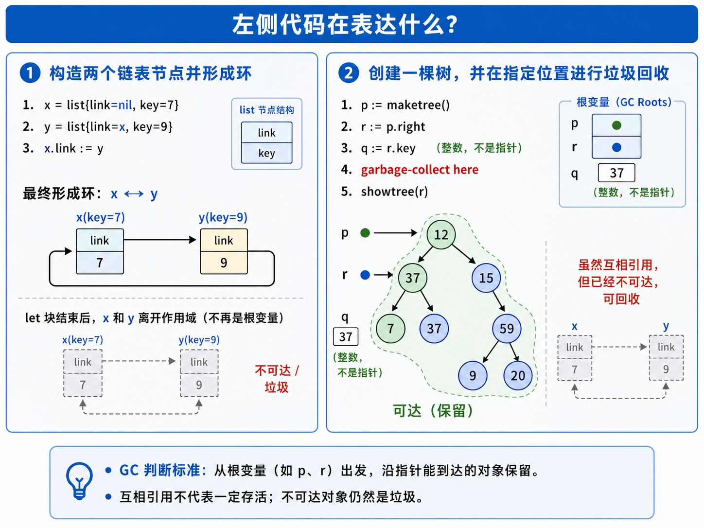

## 2. Mark-and-Sweep Collection

### 2.1 **Mark**

- 从根节点开始搜索图，也就是从程序变量开始搜索
- 标记所有被访问到的节点

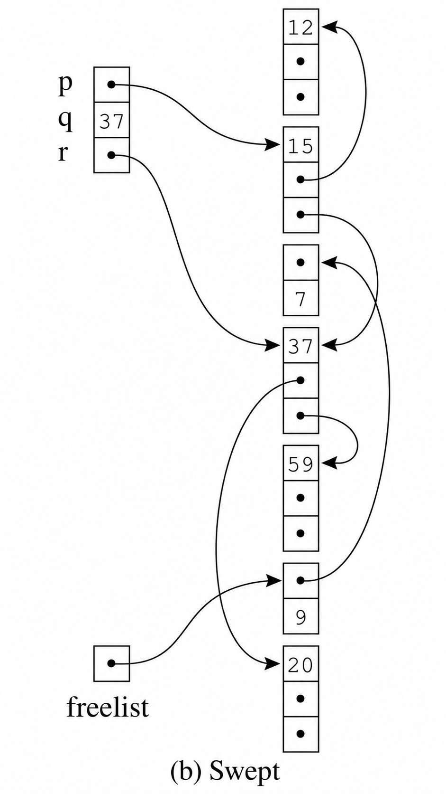

- 使用图搜索算法：像`DFS`，**深度优先搜索**这样的图搜索算法，可以标记所有可达节点

```go
function DFS(x)
if x is a pointer into the heap
    if record x is not marked   
        mark record x
        for each field fi of record x
            DFS(x, fi)
```

!!! example
假设有

```
p -> A -> B
q -> C
D
```

其中`p`和`q`是程序变量，也就是`roots

- 我们可以从`p`和`q`开始标记
- 最终只有`D`无法被标记
- 因此`D`是不可达对象，可以被回收
!!!

- **任何没有被标记的记录，一定是垃圾，应该被回收**

> 问题是怎么回收？

### 2.2 **Sweep**

- 通过一次线性扫描，遍历整个堆
- 把所有没有被标记的节点连接成一个链表，叫做`freelist`
- 把已经标记的节点取消标记，为下一次垃圾回收做准备


### 2.3 Algorithm

```go
// mark phase
for each root v:
    DFS(v)

// sweep phase
p ← first address in heap
while p < last address in heap
    if record p is marked
        unmark p
    else let f1 be the first field in p
        p.f1 ← freelist
        freelist ← p
    p ← p + (size of record p)
```

- 垃圾回收结束后，编译后的程序继续执行
- 之后如果想在堆上分配新纪录，就从`freelist`中取一个空闲记录
- 当`freelist`为空时，就再次执行垃圾回收

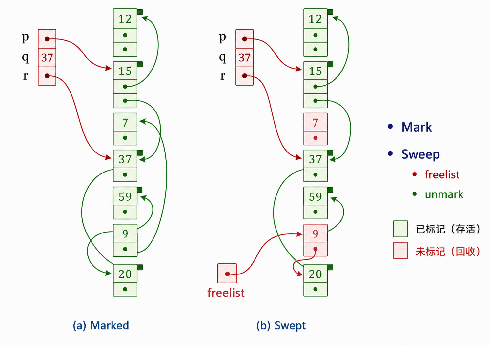

### 2.4 Cost of Mark-and-Sweep Collection

- `H`:`head-size`
- `R`:`reachable data`(表示从`root`出发能访问到的活对象总量)

- GC的时间
  - `Mark`:`DFS`所花时间与`R`成正比
  - `Sweep`:时间与`H`正比
  - 总时间：$c_1R + c_2H$
- `GC`会向`freelist`中补充`H-R`个`word`空间
- 摊还成本(`Amortized cost`):$(c_1R + c_2H)/(H - R)$
  - 如果`H`和`R`非常接近，成本会非常高

### 2.5 Using explicit stack

!!! note "DFS的问题"
`DFS`算法是递归的

- `H`表示堆大小
- 极端情况下，`H`个堆对象可能形成一个长度为`H`的链表
- 此时`DFS`的函数调用栈，也就是`activition records`的栈，可能会比整个堆还大
!!!

针对上面的问题，我们可以使用一个`explicit stack`，而不是递归

> 这样只需要`H`个`word`，而不是`H`个函数调用记录

```go
function DFS(x)
    if x is a pointer and record x is not marked
        mark record x
        t ← 1
        stack[t] ← x // push the start of DFS on stack
        while t > 0
            x ← stack[t]
            t ← t - 1 // pop an item from the stack
            for each field fi of record x
                if x.fi is a pointeer and record x.fi is not marked
                    mark record x.fi
                    t ← t + 1
                    stack[t] ← x.fi
```

- `t`:栈顶元素的索引
- `stack`:a worklist
- **好处**：使用`H`个`words`若不是`H`个`activation record`

这段代码实现的和递归`DFS`做的是同一件事情：从`root`出发，沿着指针访问所有可达对象，并标记它们

区别是

- 递归`DFS`：靠函数调用栈保存接下来要访问什么
- 显示栈`DFS`:自己用`stack`数组保存 **接下来要访问什么**

### 2.6  Pointer Reversal

- **Problem**:`DFS`需要一个栈，而且这个栈的深度可能和整个堆的大小一样大

> 我们能不能用显式栈来实现`DFS`

- **Basic Idea**:把`DFS`栈存到有向图本身里面
  - 不额外申请一个`stack[]`数组，而是临时利用对象里的指针字段来保存`DFS`返回路径

原来我们实现显式栈的方式是：

```go
mark x.fi
t ← t + 1; stack[t] ← x.fi
```

但是`x.fi`已经被压入栈，之后算法不会再需要从原位置重新读取`x.fi`重新读取`x.fi`的旧内容，那么可以临时把这个字段改掉，用来保存栈信息

> 一旦我们决定沿着`x.fi`指向的对象继续`DFS`，原来的`x.fi`指针值已经被**记录**了，暂时可以改写这个字段

- `x.fi`可以用来存储栈中的一个元素，可以被临时借来保存`DFS`的返回路径
- 当栈被弹出时，再 **恢复**`x.fi`原来的值

- **Solution**:复用图中的组成部分来辅助回溯
- 当搜索过程中遇到一个新的记录`x`时
  - 标记记录`x`
  - 再执行`DFS(x.fi)`之前，把`x.fi`改成指向`x`的`DFS`父记录，这个过程叫做 **指针反转**
  - 当搜索无法继续深入时，就沿着这些返回链接返回，并在返回过程中恢复原来的指针

!!! example
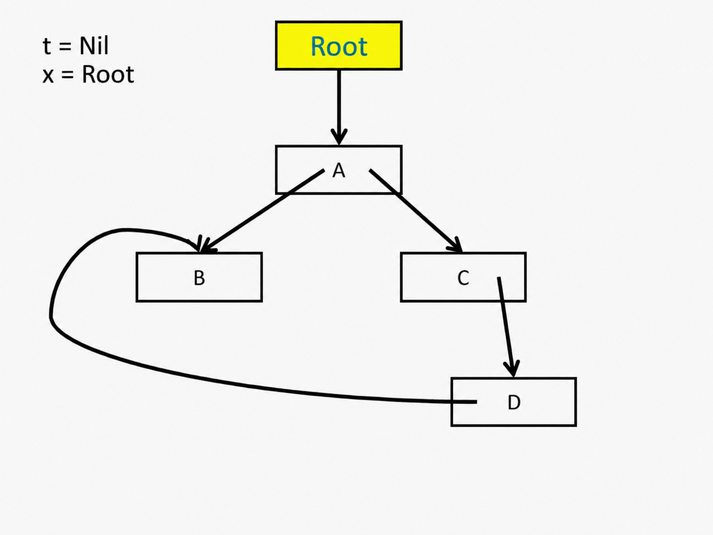
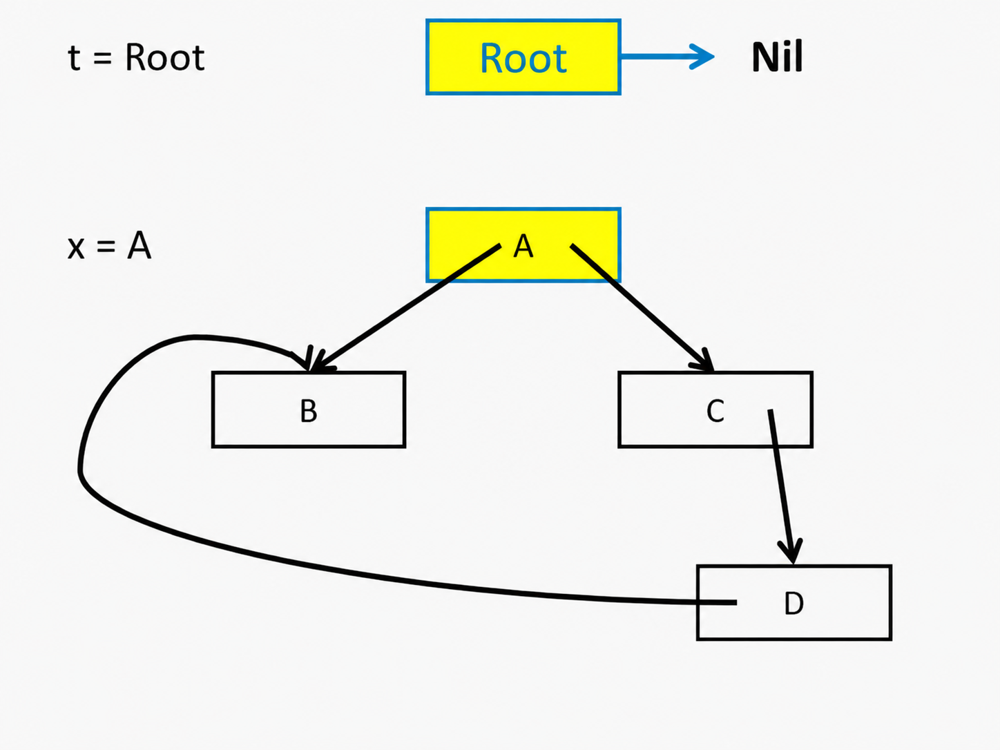
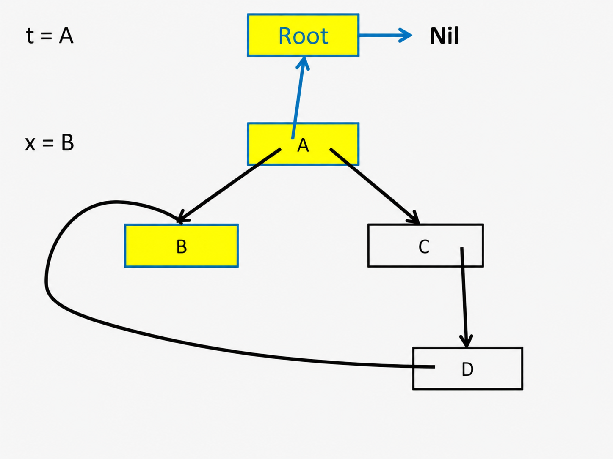
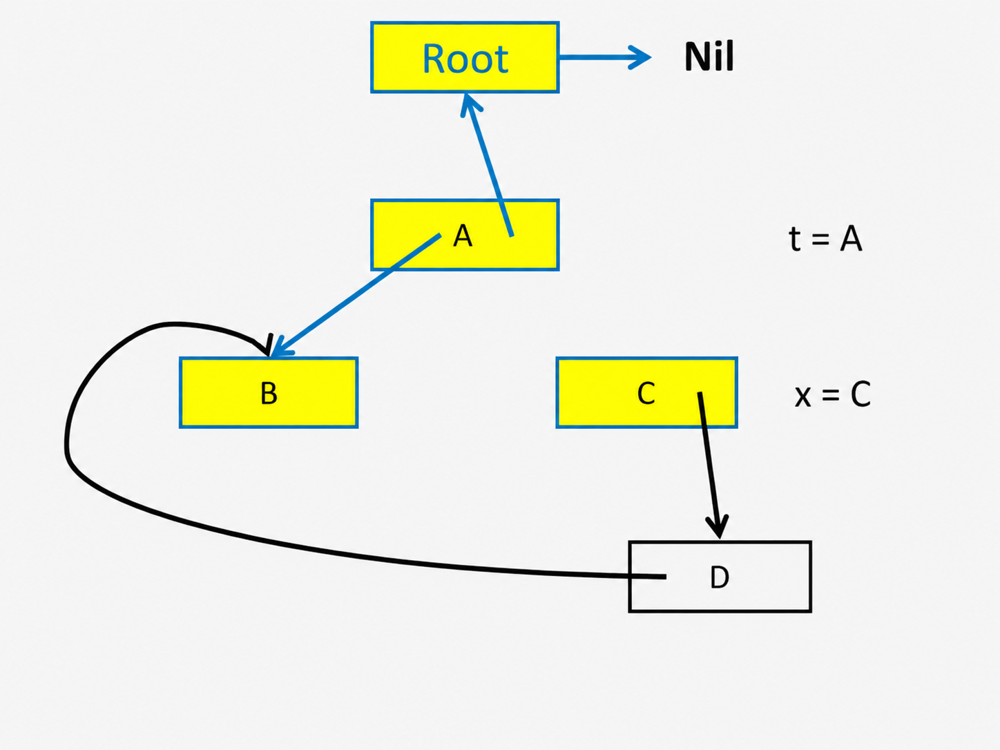
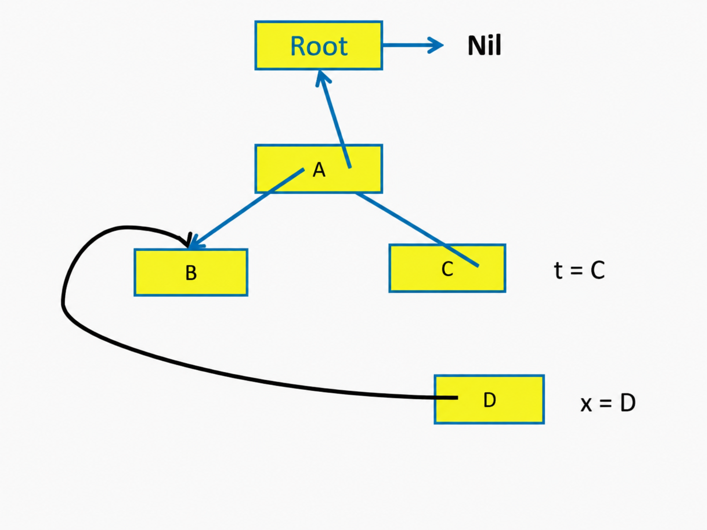
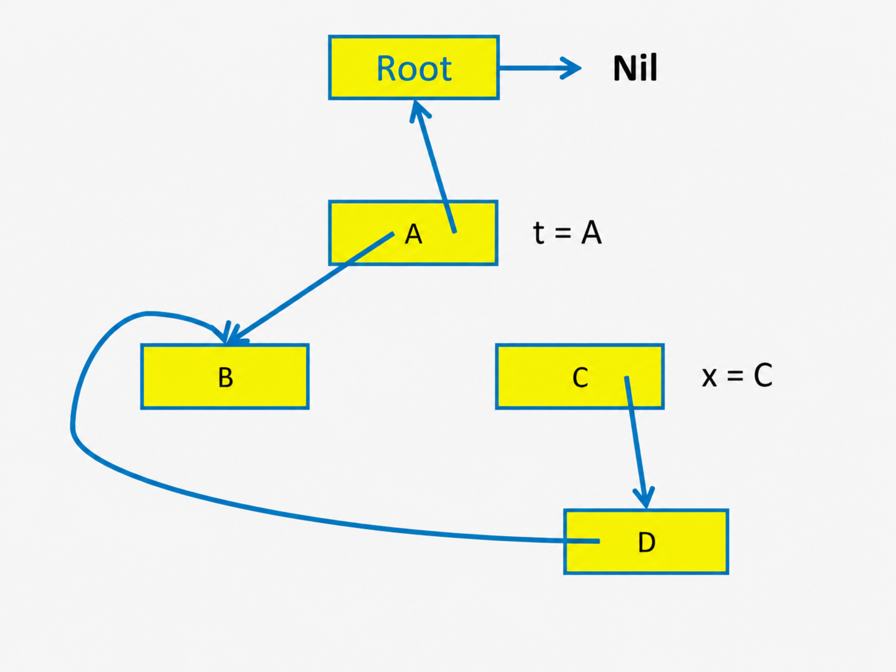
!!!


```go
function DFS(x)
  if x is a pinter and record x is not marked
    t ← nil
    mark x
    done[x] ← 0
    while true
        i ← done[x]
        if i < # of fields in record x
            y ← x.fi
            if y is a pinter and record y is not marked
                x.fi ← t
                t ← x
                x ← y
                mark x
                done[x] ← 0
            else
                done[x] ← i + 1
        else
            y ← x
            x ← t
            if x = nil then returns
            i ← done[x]
            t ← x.fi
            x.fi ← y
            done[x] ← i + 1
```

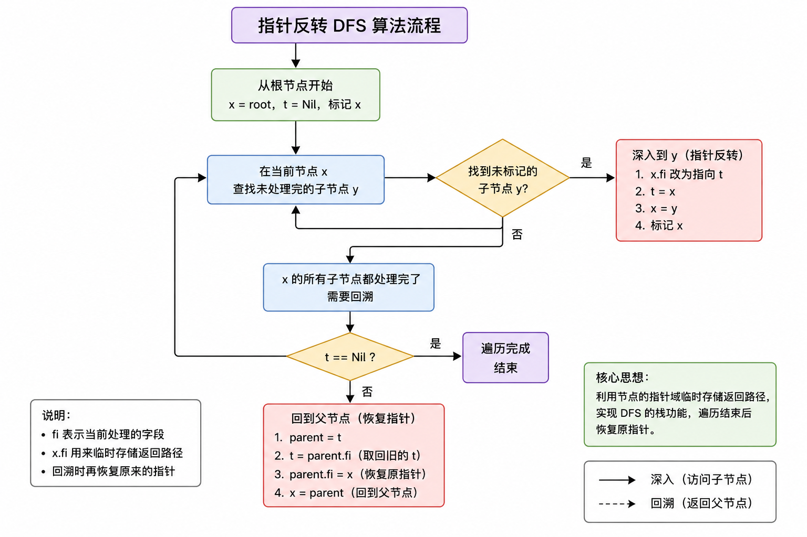

- `done[x]`:记录对象`x`中已经处理过多少个字段

!!! example
一个对象有3个字段

```
field0, field1, field2
```

如果`done[x] = 1`，说明第`0`个字段已经处理完，下一步要处理第一个字段
!!!

- `t`:栈顶(`t`指向`DFS`回溯时的上一个节点)

#### 1. 初始化

从根节点开始

```
x = root
t = nil
mark x
done[x] = 0
```

含义

- `x`:当前正在访问的节点
- `t`:临时保存回溯路径，可以理解为栈顶
- `done[x]`:记录节点`x`的字段处理到哪里了

#### 2. 向下搜索

在当前节点`x`中，寻找还没有处理过的指针字段`x.fi`

如果 *`x.fi`指向一个未标记节点`y`*，说明可以继续深入

此时做指针反转

```
x.fi = t
t = x
x = y
mark x
done[x] = 0
```

直观理解：`x<-y`，现在临时把`x.fi`改掉，用它保存旧的回溯路径`t`，然后进入子节点`y`，这样就不用额外栈保存 *从哪里回来*


#### 3. 字段已处理则继续下一个字段

如果当前字段不是指针，或者指向的节点已经被标记过，就不深入，只是记录`done[x] = done[x] + 1`

表示当前字段处理完了，下次检查下一个字段

#### 4， 无法继续深入时回溯

如果节点`x`的所有字段都处理完了，就需要**返回父节点**

回溯时

```
y = x
x = t
```

如果`x == nil`，说明已经回到最外层，`DFS`结束

否则，恢复之前被反转的指针

```
i = done[x]
t = x.fi
x.fi = y
done[x] = i + 1
```

含义是

- `y`是刚刚处理完的子节点
- `x`是父节点
- `x.fi = y`把原来的指针恢复回来
- `t = x.fi`取回旧的回溯路径
- `done[x] + 1`表示父节点的这个字段已经处理完了


!!! example
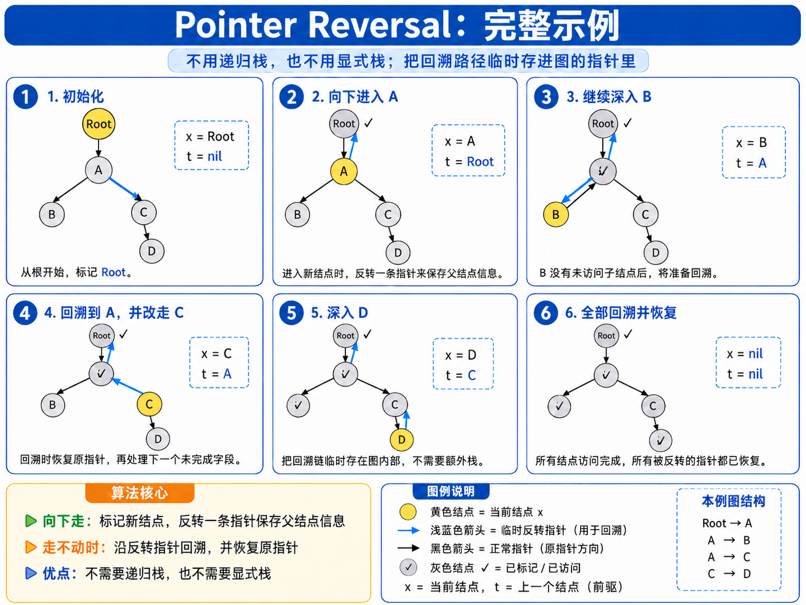

> 图片内容中有一点问题，文字部分准确
!!!

!!! note "标记-清除法总结"
- **优点**
  - `GC`过程中，对象/记录不会被移动
  - 能够处理循环引用
- **缺点**
  - 正常程序执行必须暂停
  - 会导致堆内存碎片化
    - 可能造成更多缓存未命中,并让内存分配过程更复杂
!!!


### 2.7 About Fragmentation

#### 1. External fragmentation

程序想分配一个大小为`n`的记录，但是堆中有很多空闲记录都小于`n`，没有一块空闲空间正好够大

!!! example
- 下面这两个堆拥有相同数量的空闲内存，但是第一个堆存在外部碎片，而第二个堆没有
- 因此有些内存分配请求可以被第二个堆满足，但是不能被第一个堆满足


!!!

#### 2. Internal fragmentation

程序使用了一块过大的记录，并没有把它拆分，所以未被使用的内存留在这个记录内部，而不是作为外部的空闲空间存在

!!! example
- 内存管理器有时会分配比请求更多的内存
  - eg.为了满足内存对齐需求
- 这会导致少量浪费的内存分散在堆中，这被称为内部碎片
!!!

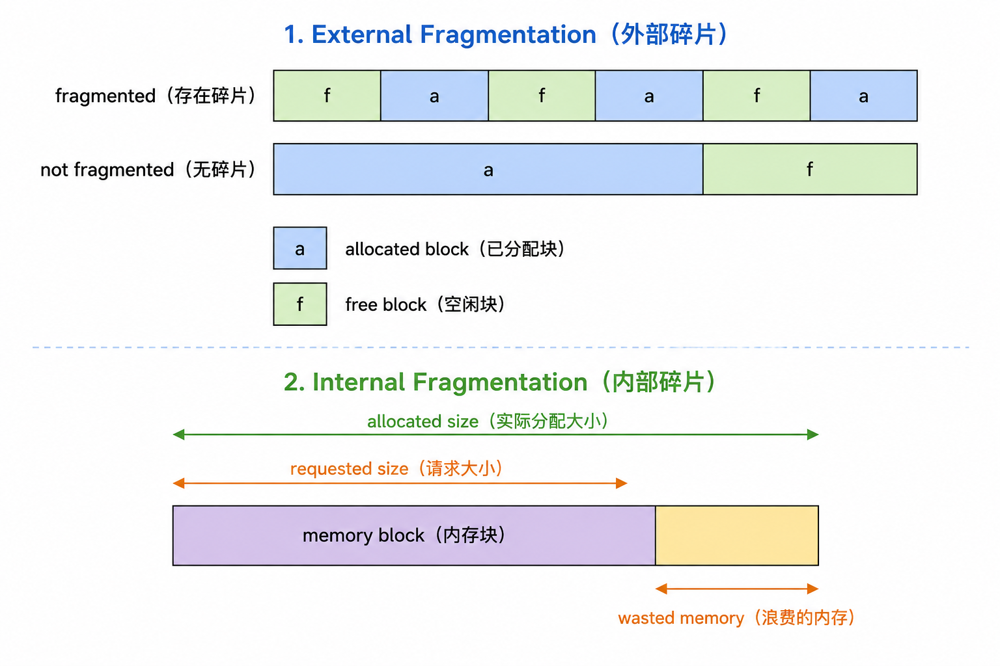

## 3. Reference Counting

- **基本思想**：不要等到内存耗尽才进行垃圾回收，而是在某个记录**不再被任何指针指向**时，就尝试回收它。也就是说，当它不可达时，就可以回收
- **具体做法**
  - 记录**有多少个指针指向每个记录**，这个数量就是该记录的 **引用记录**
  - 把引用计数存储在每个记录中
  - 每当有一个新的引用指向这个记录时，就把它的引用计数+1
  - 当引用记录变为`0`时，说明这个记录已经不可达，是垃圾对象，因此 **可以被回收**

!!! example
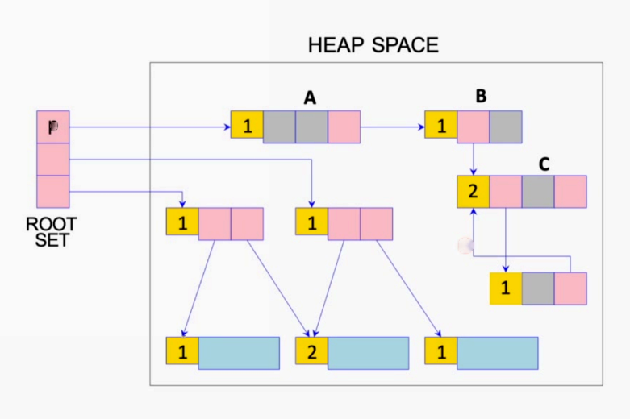
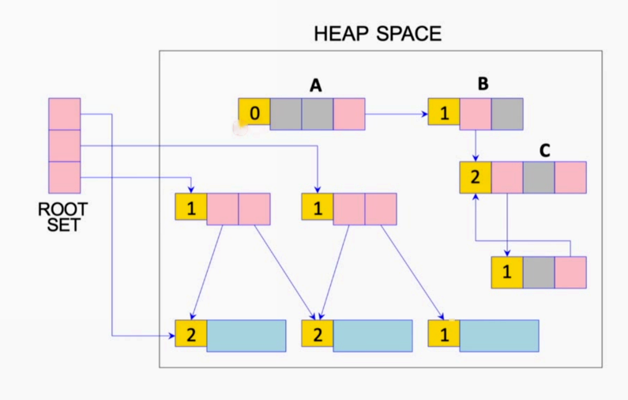
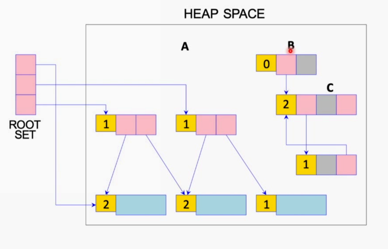
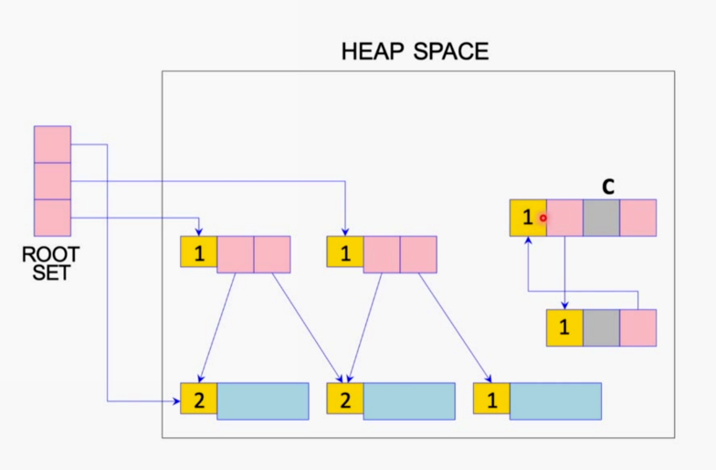
!!!

### 3.1 How to keep track

- 编译器会在每次**赋值操作**时，额外生成(`emit`)一些指令，用来修改引用计数
- 每当把`p`存入`x.fi`，也就是执行`s.fi = p`时
  - `p`指向对象的引用计数加1
  - `x.fi`原来指向的对象的引用计数减1
- 如果某个记录`z`的引用计数变为`0`
  - `z`被放入空闲链表`freelist`
  - `z`指向的其他记录，它们的引用计数也要减1

!!! example
假设原来

```
x.fi -> z
p -> A
```

现在执行`x.fi = p`,意思是让`x.fi`改为指向`p`指向的对象

所以引用关系发生变化

```
原来：x.fi -> z
现在：x.fi -> A
```

那么

- A 多了一个引用，所以 A.count + 1
- z 少了一个引用，所以 z.count - 1

如果`z.count`减到0，说明没有任何对象或变量指向`z`，它就可以被回收

但是`z`回收之后，`z`原来指向的其他对象也会失去一个来自`z`的引用，所以那些对象的引用计数也要减`1`
!!!

- 当记录`z`被放入`freelist`时，不要立刻递减`z.fi`所指向记录的引用计数。更好的做法是：**等到`z`从`freelist`中被取出时，再进行这种递归递减**。原因有两个
  - 这样可以把 *递归递减*的工作拆成更短的小片段，让程序运行得更平滑
  - 这对于**交互式程序**(`interactive`)或实时程序很重要
  - 递归递减只需要在内存分配器`allocator`中完成

!!! example
假设现在有一条引用链`z->p->q`

如果`z`的引用计数变为`0`，说明`z`可以被回收

但是`z`被回收后，`p`会少掉一个来自`z`的引用，所以`p.count-1`

如果`p.count`也变为`0`，那么`p`也可以被回收。接着`q`又会少掉一个来自`p`的引用`q.count-1`

这就形成了连锁反应

```
释放 z
  -> 递减 p.count
      -> 如果 p.count = 0，释放 p
          -> 递减 q.count
```

**这个过程就是递归递减**
!!!

!!! question "为什么不立刻递归递减"
**因为它可能一次触发很多工作**

`z -> p -> q -> r -> s -> ...`

- 如果`z`被释放后一路递归下去，可能会导致程序突然暂停较长时间
- 这对交互式程序或实时程序不友好，因为它们希望*每次停顿都尽量短*
- 因此说要在`z`刚进入`freelist`时马上处理所有递归递减，而是等到`z`之后从`freelist`被取出、准备复用时，**再处理它原来指向的对象**
!!!

### 3.2 Problem

- 引用计数看起来简单而且很有吸引力
- 但是有两个主要问题
  - 循环引用**产生的垃圾无法被回收**
  - 增加引用计数的**开销非常大**

#### 1. Problem 1: Reference Cycle

- 引用环是指一组对象互相循环引用

!!! example
如图中存储`7`的记录和存储`9`的记录

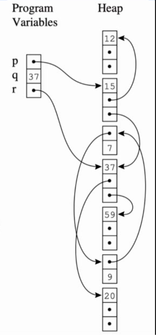
!!!

- 引用计数追踪的是 *有多少个引用指向该对象*，而不是 **有多少个从根节点可达的引用指向该对象**
- 这是使用引用计数的语言或系统中的主要问题

#### 2. Problem 2: Cost

- 增加引用计数的成本确实非常高：**每次指针赋值都不能只做赋值，还要维护引用计数**
- 原本只需要一条机器指令：`x.fi = p`，但是现在需要执行一整串操作

```
z ← x.fi
c ← z.count
c ← c - 1
z.count ← c
if c = 0 call putOnFreelist
x.fi ← p
c ← p.count
c ← c + 1
p.count ← c
```

- 减少`x.fi`原来指向对象的引用计数
- 增加`p`指向对象的引用计数
- 数据流分析可以消除一部分引用计数的增加和减少操作，但是仍然会留下很多操作

!!! note "引用计数分析"
- **优点**
  - 实现简单
  - 可以立即回收
    - 减少**对象变成垃圾**和**它被真正回收**之间的时间(计数为`0`时立刻回收)
    - `Mark-and-Sweep`通常要到某个`GC`时刻，才集中扫描和回收垃圾
  - 增量式回收
    - 内存单元管理(`cell management`)可以和程序执行交替执行，不会出现明显的 **暂停程序然后几种回收**的效果
- **缺点**
  - 无法回收所有不可达对象
  - 如果触发了一次大规模回收，可能会很慢
  - 会明显拖慢赋值操作(涉及到维护)
!!!

## 4. Copying Collection

- **基本思想**：把内存分成两部分，通过复制来进行垃圾回收
  - `from-space`:程序正在使用的那一半空间
  - `to-space`:平时不用，直到垃圾回收时才使用的那一半空间
- 复制式垃圾回收
  - 当`from-space`用完时，从程序变量和`from-space`构成的对象图出发遍历，把所有可达对象复制到`to-space`
  - 复制完成后，让根节点指向`to-space`中的新副本；整个旧的`from-space`就都变成不可达了，然后交换`from-space`和`to-space`的角色
- **Compact**
  - `to-space`中的副本是紧凑的`to-space`
  - 它们占据连续的内存空间，**不会产生碎片**

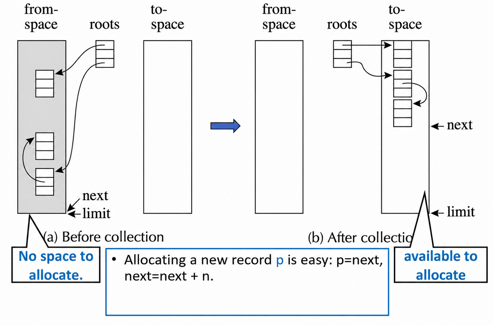

### 4.1 Pointer Forwarding

#### 1. Why

- 为了实现复制式垃圾回收
  - 我们需要像`Mark-and-Sweep`一样，遍历所有可达记录
  - 当我们发现一个可达记录时，就把它复制到`to-space`中

> 我们必须保留原来的`points-to-relations`
>
> - 更新所有指向该记录的指针，旧的`frame-space`之后会整体废弃

#### 2. Insight

假设`B.fi -> A`。也就是`B`的第`i`个字段指向对象`A`，那么在运行时遍历对象图时，我们如何把`B.fi`更新成指向`A`的新副本？

当我们复制记录`A`时，会在`A`的旧副本中，也就是`from-space`里的那个`A`中，存储一个指向新副本的`forwarding pointer`

之后如果我们再次访问到一个带有`forwarding pointer`的记录就能知道

- 这个对象已经被复制过
- 它的新位置在哪里

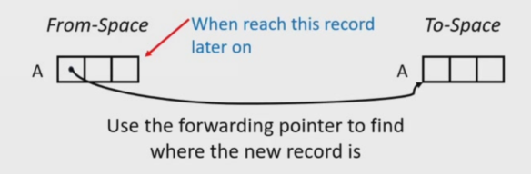

#### 3. Copying Collection with Pointer Forwarding

- 指针`next`初始化为指向`to-space`的哪里
- **Forwarding**:给定一个指针`p`，如果它指向`from-space`中的旧对象，就让它改为指向`to-space`中的新对象

```go
function Forward(p)
  if p points to from-space
    then if p.f1 points to to-space
      then return p.f1
    else for each field fi of p
      next.fi ← p.fi
      p.f1 ← next
      next ← next + size of record p
      return p.f1
  else return p
```

- `p.f1`是一个`forwarding pointer`，用来表示这个对象的新副本在哪里
- 也就是说，如果旧对象`p`的第一个字段`f1`已经指向`to-space`，说明它已经复制过了，不需要再复制，直接返回`p.f1`即可
- 还没有被复制过：把旧对象所有字段复制到`to-space`中`next`指向的位置
  - 然后`p.f1 ← next`在旧对象`p`的第一个字段里写入`forwarding pointer`，**记录新副本的位置**
  - 最后`next ← next + size of record p`把`next`往后移动，为**下一个复制对象**腾出位置
- 如果`p`不是指针，或者它本身就不指向`from-space`，那旧不用处理，直接返回`p`

!!! example
假设复制式 GC 前，`from-space` 中有对象 `A`，并且有两个地方指向它：

```text
root -> A
B.fi -> A
```

GC 发现 `A` 是可达对象，于是把 `A` 复制到 `to-space`，得到新对象 `A'`：

```text
from-space: A
to-space:   A'
```

为了之后还能找到 `A` 的新位置，GC 会在旧对象 `A` 中留下一个 **forwarding pointer**：

```text
A.f1 -> A'
```

之后如果再次遇到某个指针仍然指向旧对象 `A`，例如：

```text
B.fi -> A
```

GC 调用：

```text
Forward(B.fi)
```

发现旧对象 `A` 的 `f1` 已经指向 `to-space`，说明 `A` 已经复制过了，所以直接返回 `A'`。

于是把 `B.fi` 更新为：

```text
B.fi -> A'
```

最终所有原来指向旧对象 `A` 的指针，都会被更新成指向新对象 `A'`：

```text
root -> A'
B.fi -> A'
```

**核心作用**

- `forwarding pointer` 记录“旧对象的新地址”
- 避免同一个对象被重复复制
- 保证所有指针都能更新到 `to-space` 中的新副本

!!!

### 4.2 Cheney's Algorithm

- **Cheney's algorithm**: 一种使用 **BFS**遍历可达数据的垃圾回收算法

> 如何维护BFS的工作列表

- 引入一个指针`scan`，并用`scan`和`next`把`to-space`划分成三个连续区域
  - `Copied`:已经复制的区域，记录已经被复制到`to-space`，但是**还没有检查这个记录内部的指针**
  - `Copied and scanned`:已经复制并扫描的区域，记录已经被复制，并且其中所有指针字段都已经处理完
  - `Empty`:空闲区域，还没有使用的`to-space`

```

start          scan              next
 |-------------|------------------|-------------|
 Copied and    Worklist for BFS    Empty
 Scanned

start ~ scan
已经复制并扫描完的对象

scan ~ next
已经复制，但还没扫描字段的对象
也就是 BFS 的 worklist

next 之后
空闲空间，用来放新复制过来的对象
```

- `scan`:指向下一个需要扫描的对象
  - 扫描的意思是：检查这个对象内部的所有指针字段，如果字段指向`from-space`中的对象，就把那个对象复制到`to-space`，并更新指针
- `next`:指向`to-space`中下一个可用位置
  - 每当发现一个新的可达对象，就把它复制到`next`指向的位置，然后`next = next + object_size`
  - 所以`next`前面的对象都是已经复制进来的对象

**算法的核心流程**

```
1. 先把 roots 指向的对象复制到 to-space。
2. scan 指向 to-space 开头。
3. next 指向已经复制对象的末尾。
4. 当 scan < next 时：
   - 扫描 scan 指向的对象；
   - 如果发现它指向 from-space 中的未复制对象，就复制到 next；
   - 更新指针到新地址；
   - scan 向后移动。
5. 当 scan == next 时，说明没有待扫描对象，GC 结束。
```

#### 1. 广度优先的复制式垃圾回收

- 作用：把所有从`root`可达的对象，从`from-space`复制到`to-space`，并且更新所有指针，让它们指向新副本

```
scan ← next ← beginning of to-space

for each root r
  r ← Forward(r)
while scan < next
  for each field fi of record at scan
    scan.fi ← Forward(scam.fi)
  scan ← scan + size of record at scan 
```

1. `scan`和`next`一开始都指向`to-space`的开头
  - 这里有两个重要指针
     1. `next`:下一个新对象应该复制到哪里
     2. `scan`:下一个需要扫描字段的对象在哪里
2. 先处理所有`root`：对每一个`root`指针，都执行`Forward(r)`
  - `Forward(r)`的作用是
    - 如果`r`指向`from-space`中的对象
      - 如果对象还没复制，就复制到`to-space`并返回新副本的地址
    - 如果`r`不需要复制，就直接返回`r`
    - 然后执行`r ← Forward(r)`，就是把`root`更新成指向`to-space`中的新副本
3. 主循环：只要还有未扫描对象`while scan < next`，也就是只要`scan`还没有追上`next`，就说明还有对象已经被复制过，但是它们内部的指针字段还没有处理
4. 扫描当前对象的每个字段：检查`scan`当前指向的对象里面的每个字段`fi`。如果某个字段指向`from-space`中的旧对象，就调用`Forward(scan.fi)`
5. 扫描完当前对象后，移动`scan`：`scan ← scan + size of record at scan`，也就是当前对象的所有字段都处理完了，所以`scan`移动到下一个对象

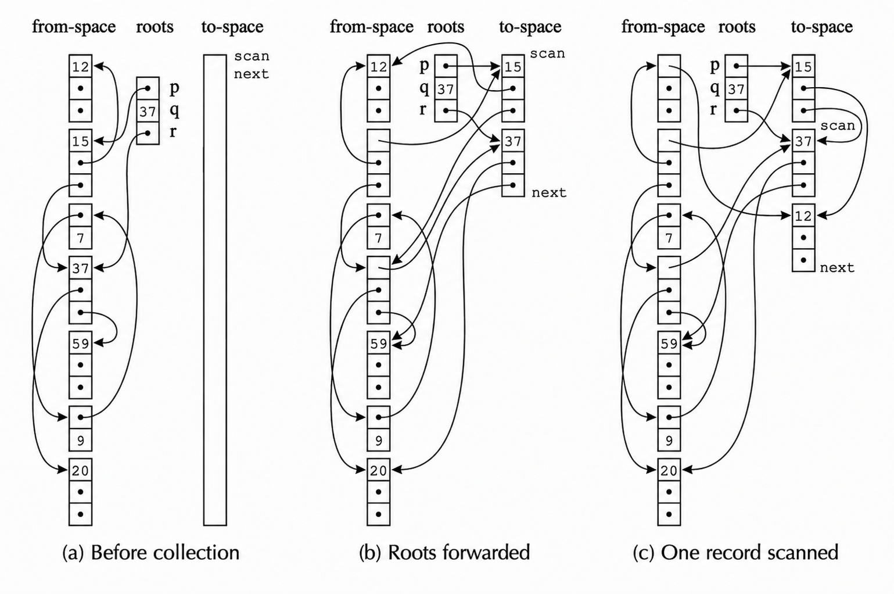

#### 2. Limitation of Cheney's Algorithm: Locality of References

> 引用局限性

- 在具有 **虚拟内存**(`Virtual of Reference`)或 **缓存**(`Cache`)的计算机系统中，良好的引用局部性非常重要
  - 当然程序访问地址`a`后，内存系统通常会预测：**接下来很快会访问附近`a`附近的地址**
- 使用 **BFS**复制对象的指针数据结构，其引用局部性较差
  - 如果地址`a`处的对象指向地址`b`处的对象
  - 那么很可能 **a和b在内存中相距很远**

!!! question "为什么"
```
A
├── B
├── C
└── D

B
├── E
├── F

C
├── G
├── H
```

**Cheney(BFS)复制后的内存布局**

按照层次复制：

```text
A → B → C → D → E
```

内存中：

```text
| A | B | C | D | E |
```

但是指针关系是：

```text
B → D
C → E
```

即：

```text
| A | B | C | D | E |
      ↑     ↑
      B --> D
```

B 和 D 中间隔着 C。

---

**程序实际访问方式**

程序通常这样访问：

```text
A → B → D
```

访问 B 后立刻访问 D。

但内存布局却是：

```text
B → C → D
```

D 不在 B 附近。

因此：

```text
Cache Miss 增加
局部性较差
```

**如果采用 DFS 复制**

复制顺序：

```text
A → B → D → C → E
```

内存布局：

```text
| A | B | D | C | E |
```

此时：

```text
B → D
```

变成：

```text
| A | B | D | C | E |
      ↑ ↑
```

父子节点挨在一起。

因此：

```text
Cache Hit 更多
局部性更好
```
!!!

- 使用 **深度优先搜索**复制对象，能够获得更好的局部性
  - 但是`DFS`复制需要使用`Pointer Reversal`(指针反转)技术
  - 实现复杂，而且运行较慢

#### 3. A Hybrid Algorithm

> `Cheney`(BFS)局部性不好，那能不能既保留`BFS`的简单性，又获得`DFS`的局部性？于是提出了一个`Hyvrid`(混合)算法

- 部分`DFS`和部分`BFS`能够提供较好的局部性
- **基本思想**
  - 使用`BFS`的复制方式
  - 但是每当复制一个对象时，尽量把它的某个子节点也复制到它附近

```go
function Chase(p) // 追踪过程：对对象p及其特定子对象进行连续复制
  repeat
    q = next
    next = next + size of record at q
    r = nil // 初始化局部游标变量r
    for each field fi of record p
      q.fi = p.fi // 值拷贝：将源字段的值直接复制给新分配对象q的对应字段
      if q.fi points to from-space and q.fi.f1 does not point to to-space
      then r = q.fi // 候选标记：将r指向这个尚未复制的子对象
    p.f1 = q
    p = r
  until p = nil
```

- **状态标记`p.f1`**：这里的核心技巧是利用对象的第一个字段`f1`。在编译底层，当一个对象被搬到`to-space`时，原对象(在`from-space`中)的内存结构已无用，我们可以将其首地址覆盖为新地址(即`Forwarding Pointer`,转发指针)。这里的`p.f1`就是用来判断状态`S`
  - $S(p) = \text{unmoved if p.f1 \notin to-space}$
  - $S(P) = \text{moved if p.f1 \in to-space}$
- **贪心聚焦追踪`Greedy Clustering Tracking`**：在`Chase`的`for`循环中，一旦发现一个还没有被复制的子节点，就立刻将其地址记录在`r`中，并在当前对象复制完成后，通过`p <- r`直接进入下一个循环

这保证了只要存在 **引用链**，这条链上的对象就会被 **连续分配在`next`所指向的相邻物理内存中**

!!! example
**假设初始内存状态**：

在`from-space`中有三个对象`A,B,C`，引用关系为

- `A`的字段包含指向`B`和`C`的指针
- `B`的字段包含指向`D`的指针

```
A→B→C
A→C
```

我们现在开始`Chase(A)`

1. 第一轮循环(`p=A`)
  - `q<-next`:在`to-space`分配空间`A'`给`A`
  - 遍历`A`的字段：遇到指向`B`的指针，发现`B`在源空间且未被复制。将临时指针`r`指向`B`
  - 遍历继续：遇到指向`C`的指针，同样符合条件，将 **临时指针`r`覆盖指向`C`**
  - 更新转发指针：令`A.fi = A'`
  - 更新游标：令`p=r`(即`p = C`),进入下一轮
2. 第二轮循环(`p=C`)
  - `q<-next`:在`to-space`紧挨着`A'`分配空间`C'`给`C`。此时内存物理连续：`A'|C'`
  - 遍历`C`的字段：假设`C`没有指向外部的指针(叶子节点)
  - 游标`r`保持`nil`
  - 更新转发指针：令`C.fi = C'`
  - 更新游标：令`p = r`(`p = nil`)
3. 循环指针
!!!

!!! note "复制式垃圾回收总结"
- **优点**
  - 简单性(`Simplicity`):不需要显式的调用栈或指针反转技术
  - 运行时间与可达对象的数量(`#rechable_objects`)成正比
  - 空闲内存空间保持连续排列
  - 自动的内存压缩机制**彻底消除了内存碎片**
- **缺点**
  - 一半的内存空间被浪费了
  - 空间局部性较差——至少对于经典的`Cheney`算法而言
  - 需要精确的类型消息来区分内存中的值究竟是指针还是普通数据
    - `GC`可能把一个普通整数当成内存地址进行了更新(也就是篡改了数据)导致程序立刻崩溃
!!!

## 5. Interface to the Compiler

尽管垃圾回收器是`runtime`的一部分，但是带有垃圾回收的语言的编译器通过一下方式与垃圾回收期进行交互

- 生成`allocate records`的代码
- 描述每个垃圾回收周期中根节点`roots`的位置
- 描述堆上数据记录的内存布局
- 生成实现读屏障或写屏障的指令——用于某些版本的增量式回收(`incremental collection`)

### 5.1 Fast Allocation

- 内存分配堆程序来说至关重要
  - 经验测量表明：每七条指令中就有一条是存储指令 `store`
  - 平均每条指令最多对应 1/7 个字 word 的内存分配
- 在堆区创建数据记录的开销是相当大的
- 应该使用`copying collection`，因为它足够快
  - 分配空间是一块连续的空闲区域
  - 下一个空闲位置的指针是`next`，并且该区域的结束边界是`limit`

#### 1. 快速分配的步骤

**The Baseline**

首先，分配一个大小为`N`的记录(`Record`)的标准流程。整个过程包含了6步分配开销和2步的计算操作：

**分配步骤**

1. 调用分配函数
2. 测试边界`next + N < limit`，如果超限，则调用`GC`
3. 将`next`指针赋值给返回值`result`
4. 清零新分配的`N`个内存空间(`Clear M[next], M[next+1],...M[next+N-1]`)
5. `next <- next + N`，推进`next`指针完成分配
6. 从分配函数返回

**程序的实际后续操作**

- 将`result`移动到某个计算上有用的位置，例如特定的寄存器
- 将有用的实际值存入该记录对象(`record`)中

> 这两步是原本要做的逻辑，不是分配的额外开销(`allocation overhead`)

- **内联展开**：步骤1和步骤6应该通过对分配函数进行 **内联展开**(`Inline Expansion`)来消除
- **寄存器合并**：步骤3可以通过与步骤`A`结合来消除

> 未优化前，数据流是 next 指针 $\rightarrow$ 临时变量 result (步骤3) $\rightarrow$ 最终的目标寄存器 (步骤A)，这样会产生多余的`MOV`指令

- **消除冗余初始化**(`Dead Store Elimination`)：步骤4可以合并到步骤B中从而被消除
- 步骤2(越界检查)和步骤5(指针推进)这两步是保证内存安全和维持分配状态的绝对底线，不可消除
  - 如果编译器在一个基本块（Basic Block）中检测到连续分配了多个对象（例如连续 new 了三个大小为 $N$ 的对象），它可以将检查合并为一次 $next + 3N < limit$，并将指针一次性推进 $next + 3N$，从而将这仅存的一点点开销在多次分配中进一步摊销

!!! example
编译一行常见代码`Node p = new Node(1, 2);`(假设对象占用16字节)

**优化前**

1. 调用：程序跳转执行`allocate()`库函数
2. 检查：判断`next + 16 < limit`(空间不足则`GC`)
3. 腾挪：将可用地址`next`存入库函数临时变量`result`
4. 清零：将result指向的16个字节内存全部填零
5. 推进：移动指针`next <- next + 16`
6. 返回：退出函数，将地址返回给外层变量`p`

**执行3个优化步骤**

- 函数内联
  - 将调用和返回两步去除掉，编译器把分配逻辑直接 **复制粘贴**到调用处，彻底消灭了函数压栈、跳转和返回的开销
- 寄存器合并
  - 去掉3，既然内外代码已经合并，直接让目标变量`p`指向当前的`next`地址即可，去除掉临时变量这个所谓的中间变量
- 死代码消除：去除4

**优化后**

1. **越界检查**：`if(next + 16 > limit) trigger_GC()`
2. **有效写入**：`p = next`，然后直接把对象头、1、2写入物理内存
3. **指针推进**：`next <- next + 16`
!!!

### 5.2 Describing Data Layout

- 垃圾回收期必须能够操作程序所声明的**任何类型的记录/对象**
- 它必须能确定**每个记录中字段的数量**，以及**每个字段是否是一个指针**

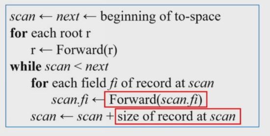

> 这里红框标出了算法中必须依赖外部信息的两个关键点

- `Forward(scan.fi)`:`GC`正在遍历当前对象的所有字段。但问题是，如果`fi`只是一个普通的整数`int`,`GC`绝对不能调用`Forward`去搬运它，否则就是**把数据当成了内存地址去篡改**，程序会立刻崩溃。`GC`必须确切知道`fi`是不是指针
- `size of record at scan`:当前对象扫描完毕，`scan`指针需要向前推进，去扫描队列里的下一个对象。但是问题是，**当前对象占用多少个字节是无法确定的**

**GC算法本身是纯粹的逻辑，必须依赖额外的元数据才能读懂物理内存**

!!! question
如何获取这些信息
!!!

- 对于静态类型语言，例如`Tiger`或`Pascal`，或者对于面向对象语言(例如`Java`)
  - 让每个对象的第一个字(`word`)指向一个特殊的类型描述符或类描述符记录
- `Type-descriptor or class-descriptor`(类型或类描述符)
  - **对象的总大小**
  - 每个指针字段的**位置**
- 类型或类描述符必须由编译器根据**静态类型信息**生成

!!! question "In which phase"
类型信息的手机发生在 **语义分析**(`Semantic Analysis`)/**类型检查**阶段

描述符数据的实际打包，以及在分配代码中强行插入 **指向描述符的指针**的机器码发生在`Code Generation`阶段
!!!

- 对于静态类型语言：每个记录需要承受**一个字的额外开销**用于存储**指向类型描述符的指针**
- 对于面向对象语言：没有因为垃圾回收造成的额外对象开销
  - 因为它们本来就需要这个描述符指针来实现 **动态的方法查找**(`vptr`)

!!! note
像 Java、C++ 这样的多态面向对象语言，为了实现“虚函数（Virtual Function）”和“动态绑定（Dynamic Dispatch）”，在底层本来就必须给每个对象头部偷偷塞入一个 vptr（虚表指针）。这个 vptr 指向该类的 vtable（虚函数表）
!!!

### 5.3 Pointer Map

- 为了实现垃圾回收器，编译器必须回收器指明
  - 每一个**包含指针**的临时变量和局部变量
  - 它究竟是存放在 **寄存器**中还是存放在`activation record`(**栈帧**)中
- `Tiger`编译器的解决方案：**构建一个指针映射表**
  - 所有的映射表都是由编译器生成的
  - 在编译期间，编译器知道哪个临时变量是指针

- 活跃临时变量的集合在每一条指令处都可能发生改变
- 在程序中的每一个执行点，**指针映射表都是不同的**
  - 只在 **能够触发新的垃圾回收**的代码点上来描述指针映射表，会简单的多

!!! question
新的垃圾回收会在哪里触发？

- `alloc`分配函数的调用处
- 任何`function-call`：任何函数调用，都可能正在调用一个最终会去调用`alloc`的函数
!!!

指针映射表最好以返回地址作为`key`，因为返回地址正是垃圾回收器在下一个活动记录中会**看到的东西**

- 为了找到所有的根节点，回收器从栈顶开始向下扫描
  - 每一个返回地址，都作为键值去索引描述**下一个栈帧的指针映射表条目**
  - 在每一个栈帧中，回收器从该帧内的指针开始进行标记，如果是复制式回收，就进行`forwarding`
- 被调用者保存寄存器需要特殊处理
  - 假设函数`f`调用了`g`，`g`又调用了`h`
  - 对于`g`的指针映射表，必须描述在调用`h`的那个时刻，它的**哪些`callee-save`寄存器中包含了指针**，以及**哪些是从`f`继承下来的**

!!! example
```java
// 函数 f：程序的起点
void f() {
    Object* p1 = alloc(16); // 1. f 分配了一个对象 p1
    int temp = 100 + 200;   // 2. f 做了一次极其普通的整数加法
    g(p1);                  // 3. f 将 p1 作为参数传给 g
}

// 函数 g：被 f 调用
void g(Object* p2) {
    int x = 42;             // 4. g 定义了一个普通整数
    Object* p3 = alloc(32); // 5. g 尝试分配新对象 p3
}
```

- 当程序执行到第`5`步`alloc(32)`时，堆内存恰好耗尽，垃圾回收器此刻被紧急唤醒
- 此时寄存器和栈里都是二进制数字，`GC`需要精准找到出现存活的指针`p1`和`p2`

1. 寻找安全点
  - 纯粹的算数运算绝对不会触发 **内存分配失败**，所以`2`指令绝对不可能唤醒`GC`
  - 编译器为了节省元数据的空间，拒绝在加法指令处**生成任何映射信息**
  - 编译器只可能在`1,3,5`拍下快照，生成`Pointer Map`，这些就是能触发新`GC`的地方(`safe points`)
2. `Return Address`作为`key`，查找栈指针
  1. 扫描当前函数`g`的状态
     - 假设这条`call alloc`的汇编指令的下一条指令地址是`0x400500`(也就是 **`alloc`结束之后的返回地址**)
     - `GC`用这个地址在`Pointer Map`里查询
       - 查表结果：`{ Key: 0x400500, Values: [RDI 寄存器是指针, 栈偏移 -8 处不是指针] }`
       - GC 的行动： GC 瞬间明白，**当前栈偏移 -8 处存的那个 42 只是个整数**，直接忽略；而 RDI 寄存器里**存的值正是 p2**，它是一个**对象引用**！GC 立即将 p2 所指的对象标记为**存活**（Roots 之一）。
  2. 继续扫描父函数`f`的状态：`GC`处理完`g`的栈帧之后，继续查看谁调用了`g`，我们发现是`f`,`f`调用`g`时，必须把 **返回地址**压入栈中。假设这个返回地址是`0x4001A8`。`GC`再次拿着这个地址去`Pointer Map`里查表
    - **查看结果**：`{ Key: 0x4001A8, Values: [栈偏移 -16 处是指针] }`
    - **GC的行动**： GC 根据图纸指示，在 f 的栈帧的 -16 偏移位置，精准地捞出了当时分配好的 p1 指针。把它也加入 Roots
!!!

### 5.4 Derived Pointers

- 有时候，编译后的程序中会存在一个指针，它只想堆记录(对象)的中间，或者指向该记录的前面或后面

!!! example
高级语言中的`a[i-2000]`在内部可以直接被计算为内存访问`M[a-2000+i]`

```
t1 <- a - 2000
t2 <- t1 + i
t3 <- M[t2]
```

- 我们称`t1`是从`a`派生而来的
- 垃圾回收器会被`t1`搞糊涂(`confused`)
!!!

- 如果 `a[i-2000]` 出现在循环内部，编译器可能会选择将计算 `t1 <- a - 2000` 提升（`hoist`）到循环外部，以避免在每次迭代中**重复计算**
- 如果循环中还包含一个 `alloc` 分配操作，并且在 `t1` 处于活跃状态时发生了垃圾回收：此时 `t1` 并没有指向一个对象的起始位置，或者（更糟糕的是）它指向了一个**毫无关联的其他对象**


!!! question "如何解决派生指针的问题"
- 指针映射表必须识别出每一个 **派生指针**，并指明它的基指针是谁
- 当回收器将`a`重新定位到新地址`a'`时，它必须同步将`t1`的值调整为`t1 + a' - a`
- 只要`t1`是活跃的，`a`就必须保持活跃状态
!!!

```go
let
  var a := int array[100] of 0  // 声明并初始化一个包含 100 个整数的数组 a
in
  for i := 1930 to 1990         // 循环变量 i 从 1930 迭代到 1990
    do f(a[i-2000])             // 调用函数 f，传入数组 a 的偏移元素
end
```

```asm
r1 <- 100                  // 将数组长度 100 存入寄存器 r1
r2 <- 0                    // 将初始值 0 存入寄存器 r2
call alloc                 // 调用分配函数，在堆上分配数组内存
a <- r1                    // 将分配后得到的数组基地址赋给变量 a
t1 <- a - 2000             // 【关键操作】：计算一个临时派生指针 t1
i <- 1930                  // 初始化循环变量 i
L1 : r1 <- M[t1 + i]       // 循环起始标签 L1：从内存 M 的 (t1 + i) 地址处读取数据到 r1
call f                     // 调用函数 f
L2 : i <- i + 1            // 从 f 返回后的标签 L2：循环变量 i 自增
if i <= 1990 goto L1       // 循环条件判断，满足则跳转回 L1
```

- 在赋值给`t1`之后，临时变量(基指针)`a`看起来已经是死变量了(后续代码似乎不再直接使用它)
- 但是与返回地址`L2`关联的指针映射表将无法充分地解释`t1`是什么
- 因此，一个派生指针会 **隐式地使其基指针保持live状态**

!!! note "一道作业题"
**题目**

在下图所示的堆（heap）上运行附录 A 中的算法。

要求展示：

1. 当包含 `59` 的节点第一次被标记（marked）时，堆的状态；
2. 各节点的 `done` 标志；
3. 变量 `t`、`x` 和 `y` 的值。

---

**给定程序**

```tig
let
  type list = {link: list, key: int}
  type tree = {key: int, left: tree, right: tree}

  function maketree() = ...
  function showtree(t: tree) = ...

in
  let
    var x := list{link=nil, key=7}
    var y := list{link=x, key=9}
  in
    x.link := y
  end;

  let
    var p := maketree()
    var r := p.right
    var q := r.key
  in
    // garbage-collect here
    showtree(r)
  end
end
```

**Pointer Reversal Algorithm**


```tig
Function DFS(x):
  If x is a pointer and record x is not marked:
    t <- nil
    mark x
    done[x] <- 0

    While True:
      i <- done[x]

      If i < # of fields in record x:
        y <- x.f[i]

        If y is a pointer and record y is not marked:
          x.f[i] <- t
          t <- x
          x <- y
          mark x
          done[x] <- 0

        Else:
          done[x] <- i + 1

      Else:
        y <- x
        x <- t

        If x = nil:
          Return

        i <- done[x]
        t <- x.f[i]
        x.f[i] <- y
        done[x] <- i + 1
```

**解题过程**

```
At the garbage collection point, the pointer roots are p and r.
q is an integer, so it is not a root.

Start DFS from p, where p points to the node with key 15.

Initially:
x = 15, t = nil
mark 15, done[15] = 0

Scan 15.key:
not a pointer, so done[15] = 1.

Scan 15.left:
15.left points to unmarked node 12.
Reverse pointer:
15.left = nil, t = 15, x = 12.
mark 12, done[12] = 0.

Node 12 has no pointer children.
After scanning all fields:
done[12] = 3.
Return to 15 and restore:
15.left = 12, t = nil, done[15] = 2.

Scan 15.right:
15.right points to unmarked node 37.
Reverse pointer:
15.right = nil, t = 15, x = 37.
mark 37, done[37] = 0.

Scan 37.key:
not a pointer, so done[37] = 1.

Scan 37.left:
37.left points to unmarked node 59.
Reverse pointer:
37.left = 15, t = 37, x = 59.
mark 59, done[59] = 0.

Therefore, at the moment when 59 is first marked:

x = 59
y = 59
t = 37

done[15] = 2
done[12] = 3
done[37] = 1
done[59] = 0

The heap has been temporarily changed as follows:
15.left = 12
15.right = nil
37.left = 15
37.right = 20
59.left = nil
59.right = nil
12.left = nil
12.right = nil
20.left = nil
20.right = nil

Marked nodes are:
15, 12, 37, 59.
```
!!!