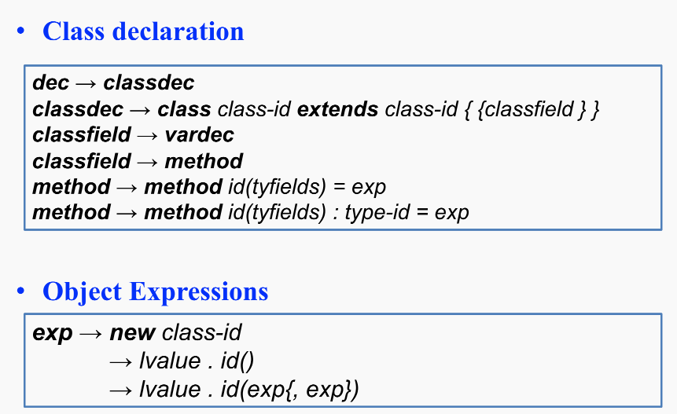
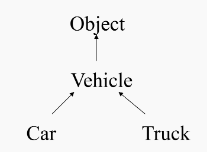
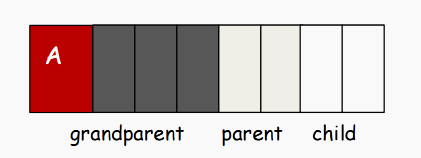
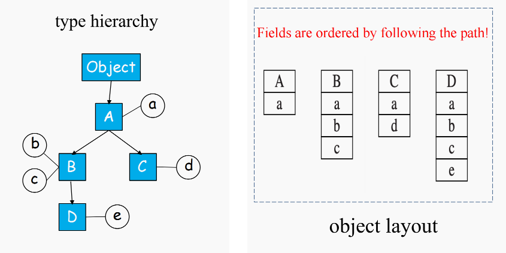

- `Classed-based, object-oriented(OO) language`
  - 所有(或大多数)值都是对象
  - 对象是类的实例
  - 对象封装了状态(字段)和行为(方法)
- 面向对象语言的一些重要特征
    - `Inheritance`
    - `Encapsulation`
    - `Polymorphism`

## 14.1 Classes

### 14.1.1 Object-Tiger



- `class B extends A {...}`
  - 声明了一个继承自类`A`和新类`B`
  - 必须处于声明了`A`的`let`表达式的**作用域**`scope`内
  - `A`的所有字段(`fields`)和方法(`methods`)都隐式地属于`B`
  - `A`的某些方法在`B`中被重写(`overriden`)(即在`B`中有新的声明)。参数和返回结果的类型必须完全一致
  - 但是 **字段不能被重写**
- 存在一个预定义的类标识符`Object`，它没有任何字段或方法
- 类`B`中的每个方法都有一个类型为`B`的 **隐式参数**(`implicit formal parameter`)叫做`self`
  - `self`:不是一个保留字(`reserved word`)。它只是一个在每个方法中都自动绑定的标识符
- 用于创建对象和调用方法的新表达式语法
  - `new B`
  - `b.x`
  - `b.f(x,y)`:值`b`作为`f`的隐式`self`参数

```
exp -> new class_id # 告诉解析器，如果遇到new关键字跟着一个类名，就把它们归约为一个exp语法抽象树节点
    -> lvalue.id() # 处理无参数方法调用。注意这里必须是`lvalue`开头(必须能解析为一个左值)
    -> lvalue.id(exp(,exp)) # 处理带有一个或多个参数的方法调用
```

!!! example "An Object-Oriented Program"

**类的声明与继承关系**

```tiger
let start := 10  // 在最外层作用域声明一个变量 start，初始值为 10

  // 基类 Vehicle (交通工具) 继承自极简的 Object
  class Vehicle extends Object { 
    var position := start          // 字段：位置，初始化为外层变量 start 的值 (10)
    method move(int x) = (position := position + x) // 方法：移动，将当前位置加上 x
  }

  // 子类 Truck (卡车) 继承自 Vehicle
  class Truck extends Vehicle {
    // 【重写 Overriding】重写了父类的 move 方法，加上了限速逻辑
    method move(int x) = 
      if x <= 55 
      then position := position + x 
      // 隐式 else: 如果 x > 55，卡车什么也不做 (忽略移动请求)
  }

  // 子类 Car (小汽车) 继承自 Vehicle
  class Car extends Vehicle {
    var passengers := 0            // 新增特有字段：乘客数量
    
    // 新增特有方法：等待另一个交通工具 v 靠近
    method await(v: Vehicle) = 
      if(v.position < position)    // 如果对方的位置落后于我的位置
      then v.move(position - v.position) // 叫对方移动到和我一样的位置
      else self.move(10)           // 否则，我自己往前移动 10
  }
```

**对象的实例化**

```tiger
  // 实例化阶段
  var t := new Truck       // 创建一个 Truck 对象
  var c := new Car         // 创建一个 Car 对象
  var v : Vehicle := c     // 【多态/向上转型】声明一个 Vehicle 类型的指针 v，但让它指向 Car 对象 c
```

**核心执行流**

```tiger
in
  c.passengers := 2;       // 修改 Car 对象 c 的特有字段
  c.move(60);              // Car 没有重写 move，沿用 Vehicle 的 move。c 的 position 变为 10 + 60 = 70
  
  // 【关键考点：动态绑定 Dynamic Dispatch】
  v.move(70);              // v 表面上是 Vehicle 类型，但实际指向 Car 对象。
                           // 运行时查 Car 的虚函数表，调用的是 Vehicle 的 move。
                           // 此时 c (也就是 v) 的 position 变为 70 + 70 = 140。
  
  c.await(t)               // 将 Truck 对象 t 作为参数传入 c 的 await 方法中
end
```
!!!

### 14.1.2 Generate Code to Fetch Fields

- `v.position`
  - `v`属于`Vehicle`类
  - 为了对其求值，编译器必须生成代码，从`v`指向的对象(记录)中获取`position`字段

!!! question 
"如何实现"
!!!

- **简单的想法**
  - 从变量`v`的环境条目(符号表)中获取`Vehicle`的类描述符
  - 从这个描述符中获取`position`的偏移量
- 但是在运行时
  - `v`可能包含一个指向`Car`或`Truck`的指针

!!! question
这时`position`字段在哪里
!!!

### 14.1.3 Class Declaration & the self Parameter

#### 1. Inheritance Rules

- 父类的**所有字段和方法**都会自动属于子类
- 方法可以被重写(`overidden`)；字段不可以被重写
- 重写方法必须保持**相同的方法签名**
  - 子类重写要与父类保持相同的 *方法名 + 参数类型 + 返回类型*

#### 2. The self Parameter

- `self`是每个方法的隐式参数
- 在运行时，`self`会自动绑定到接收者对象(就是`.`前面的那个对象)
  - `c.move(50)`中`c = self`

!!! warning
`self`不是关键字
!!!

### 14.1.4 Class Hierarchy

- 类层次结构是程序中继承关系所形成的图



- 单继承`Single inheritance`,继承图是一棵树
- 多继承`Multiple inheritance`,继承图是一个`DAG`(有向**无环**图)
  - 一个类可以同时继承多个父类
  - 这里强调无环就说明不能出现互相继承的情况

## 14.2 Single inheritance of Data Fields

### 14.2.1 Field Inheritance

> 当一个类继承另一个类时，父类中的字段在子类对象中如何存放

**前缀策略**(`The prefixing strategy`)

- 当类`B`继承类`A`时，先放`A`的字段，然后再追加`B`的新字段

!!! example
```
class A {
    var a
}

class B extends A {
    var b
    var c
}
```

那么对象布局不是随便排的

```
B object:
+---+
| a |   ← 继承自 A
+---+
| b |   ← B 自己新增
+---+
| c |   ← B 自己新增
+---+
```
!!!

- 一个字段在所有继承它的类中，偏移量都是相同的

!!! example
如果`a`在`A`中的偏移量是`0`，那么在所有继承`A`的类中，`a`的偏移量也必须是`0`

```
A: [a]
B: [a, b, c]
C: [a, d]
D: [a, b, c, e]
```

在 A、B、C、D 中，字段 a 都在第一个位置，即偏移量 0
!!!

- 访问字段`a`时，总是在相同的偏移量处访问——不管对象运行时的真实类型是什么



> 越靠近继承链顶端的类，它的字段越靠前

!!! example "Field Inheritance"
```cpp
class A extends Object
{
    var a := 0
}

class B extends A
{
    var b := 0
    var c := 0
}

class C extends A
{
    var d := 0
}

class D extends B
{
    var e := 0
}
```


!!!

### 14.2.2 Method Inheritance

方法调用有两个子问题

|步骤|描述|
|---|---|
|代码生成|把每个方法体编译成机器代码，并放在一个已知标签处|
|分发(`dispatch`)|在调用点`object.f()`决定应该跳转到哪个标签|

**有两种方法**

- **静态方法**：在编译时，根据**变量的声明类型**确定调用哪个方法
- **动态方法**：在运行时，根据**对象的实际类型**(`actual type`)确定调用哪个方法

!!! example
```cpp
class A {
    method f() {
        print("A")
    }
}

class B extends A {
    method f() {
        print("B")
    }
}

var x: A := new B
x.f()
```

- `x`的声明类型是`A`
- `x`的实际类型是`B`

- 如果`f`是 **静态方法**，根据声明类型`A`调用
- 如果`f`是 **动态方法**，根据实际类型`B`调用
!!!

## 14.3 Multiple Inheritance

## 14.4 Testing Class Membership

## 14.5 Private Fields and Methods