- 循环在计算机程序中无处不在(`pervasive`)
- 一个典型程序的大部分执行时间都花在循环中
- 所以我们需要一些技术来改进循环

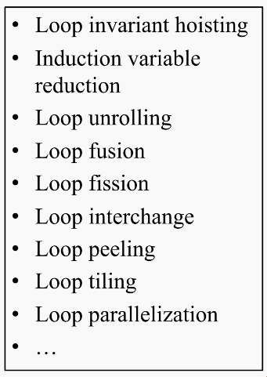

!!! example "Loop Invariant Hosting"
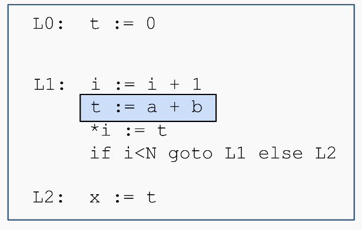

- `t - a + b`是一个`loop invariant`

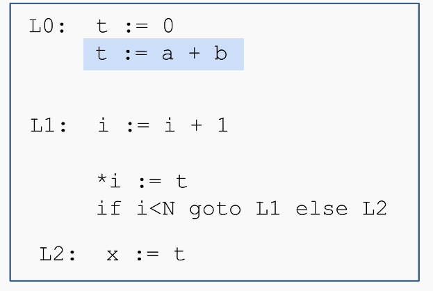

- 我们可以将`t = a + b`移到循环外实现优化

!!!

## 18.1 Loops and Dominators

### 18.1.1 what is a loop?

- 在控制流图中，一个循环是一个节点集合`S`，其中包含一个头节点`h`，并且满足一下条件
  1. 循环中任意节点都能回到头节点`h`(也就是说从S中的任意节点出发，都存在一条路径可以到达头节点`h`)
  2. 从`h`出发，可以到达`S`中的任意节点
  3. 不存在从`S`外部节点直接进入`S`内部非`h`节点的边

- 这个定义不同于字典中的普通定义
- 它是专门为编译器优化目的而设计的

- **loop entry**是指它有来自循环外部的前驱节点
- **loop exit**是指它有志向循环外部的后继节点

1. `h->S`：从头节点`h`可以到达循环集合`S`x中的所有节点
2. `S->h`循环集合`S`中的任意节点都可以回到头节点`h`
3. `no other node->S`:循环只能从头节点`h`进入

!!! warning
- 只有一个入口，但是可以有很多出口
!!!

!!! example
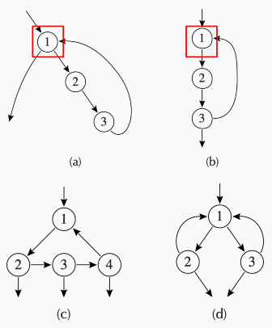

- `a`:单入口循环：有回边，且可以从循环中退出
- `b`:单入口循环：节点3是出口节点
- `c`:一个循环:唯一入口1，多个出口
- `d`:分支型循环：唯一入口1，内部有分支

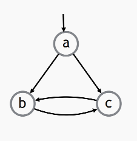

这是一个典型的不是循环的情况

- `a`不能作为循环头节点，因为从`b`到`a`或者从`c`到`a`，没有路径
- `b`不能作为循环头节点，因为存在一条来自外部节点`a`的边
- `c`不能作为循环头节点，因为存在一条来自外部节点`a`的边
!!!

!!! warning
由上面的内容就可以看出“

**有环不一定就有循环**
!!!

### 18.1.2 Why Defining Loops this way

- 循环头节点给了我们一个操作循环的`handle`
  - 这里的`handle`可以理解为 *编译器识别、控制、优化这个循环时的入口*
  - 它是放置循环优化代码的好位置(例如，把循环不变代码提升到循环外)

!!! example
```c
while (i < n) {
    x = a + b;
    sum += x * i;
    i++;
}
```

如果 a + b 在循环中每次结果都一样，那么它是 loop invariant code 循环不变代码。可以优化为

```c
x = a + b;

while (i < n) {
    sum += x * i;
    i++;
}
```
!!!

- 结构化控制流只会产生可归约图
  - 许多循环优化都依赖于控制流图是 **可归约图**

**可归约图**

- 图中的所有环都能按照我们的定义形成循环
- 大多数高级语言都会产生可归约图
- `Java`只产生可归约图，也就是不存在`goto`形式的跳转

**不可归约图**(`inreducible graph`)

- 包含一些按照我们的定义不能算作`loop`的`cycle`
- 可以由非结构化控制流产生，比如`goto`语句

### 18.1.2 Finding Loops

#### 1. Dominance

**Dominator**(支配节点)

> 它描述的是：在控制流图中，某个节点是不是 **通往另一个节点的必经之路**

- 如果从开始节点到节点`n`的每一条有向路径都必须经过节点`d`，那么称节点`d`支配节点`n`，记作`d dom n`

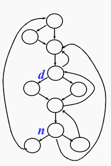

- 一些`dominator`的`property`:`
  - 每个节点都支配它自己
  - 节点`n`可以有多个支配节点

**Finding Dominators**

- 令$D[n]$表示支配节点`n`的所有节点集合

> 每个节点都支配自己，所以`n`一定在`D[n]`中

$$
D[s_0]=\{s_0\},\qquad D[n]=\{n\}\cup\left(\bigcap_{p\in pred[n]}D[p]\right),\quad n\ne s_0
$$

- 入口节点`s0`的支配集合只有它自己
- 对于其他节点，它的支配集合是它自己和所有前驱节点的支配节点的交集的并集

1. 初始时，假设每个节点`n`的支配集合`D[n]`是**所有节点**(但是入口节点除外，入口节点只被它自己支配)
2. 根据前驱节点反复更新`D[n]`，直到达到不动点

!!! example
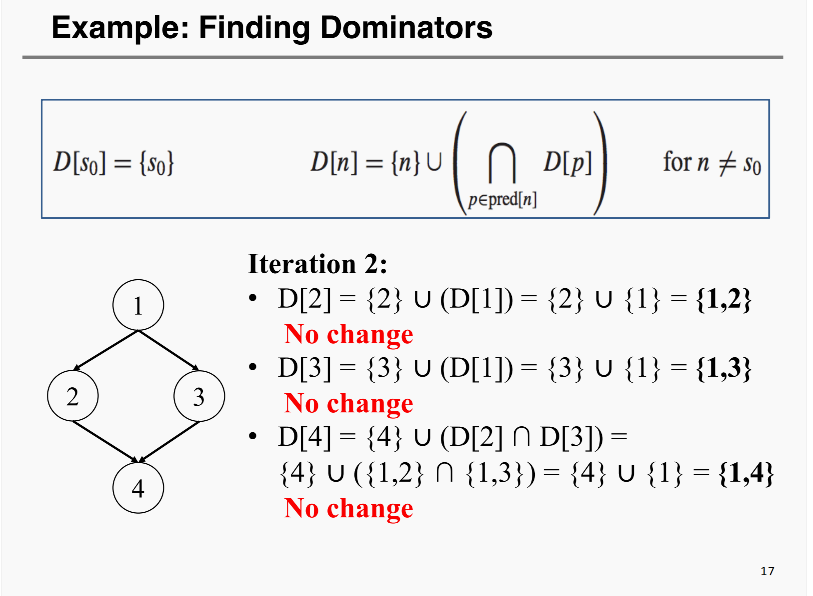
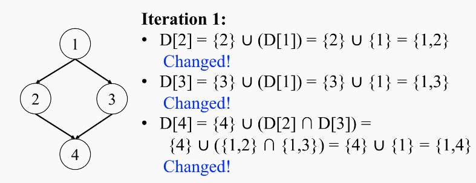
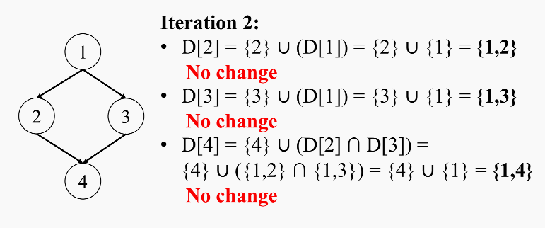
!!!

**Immediate Dominators**(直接支配节点)

- 除入口节点`s0`以外，每个节点`n`都恰好有一个直接支配节点，记作`idom(n)`，并且满足一下条件
  - `idom(n)`不是节点本身
  - `idom(n)`支配`n`
  - `idom(n)`不支配`n`的任何其他支配节点

> 从入口节点到达`n`的任何路径(不含`n`)中，`idom`是路径中最后一个可支配的节点

直接支配节点本质上就是 **离`n`最近的严格支配节点**

- 定理：假设`d`和`e`都支配`n`，那么一定有`d`支配`e`或者`e`支配`d`
  - 它们不会是完全无关的两个分支

**Dominator Tree**(支配终点树)

- 我们不必为每个节点保存完整的支配节点集合，而是可以构造 一棵支配节点树
- 支配树定义：对于每个节点`n`，都有一条`idom(n)`指向`n`的边

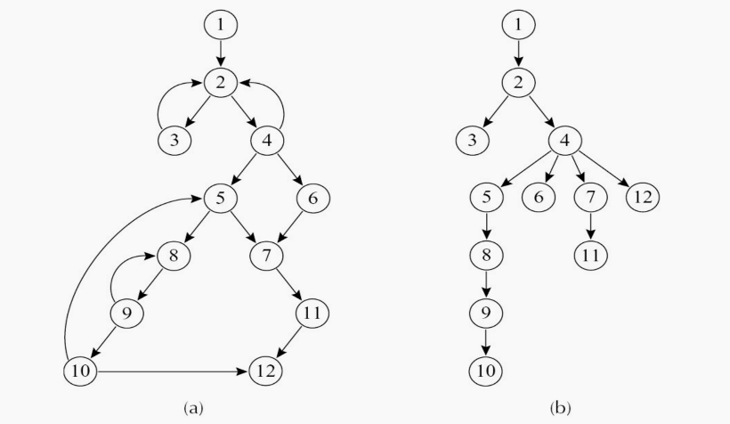

!!! example
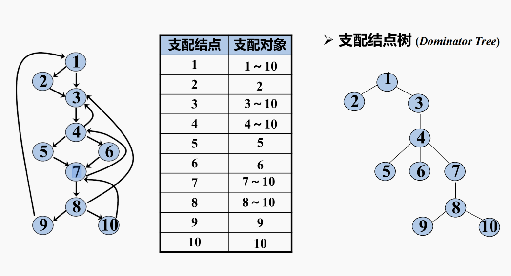
!!!

#### 2. Loop

**Natural Loops**

- **Back Edge**(回边)：如果有一条从`n`到`h`的边，并且`h`支配`n`，那么这条`n→h`就是回边


- 对于一条回边`n→h`，它对应的自然循环是所有满足以下条件的节点`x`的集合
    1. `h`支配`x`
    2. 存在一条从`x`到`n`的路径，并且这条路径不经过`h`


!!! example
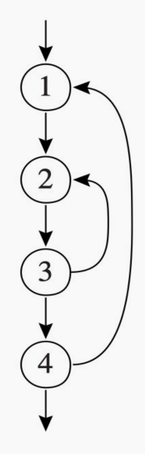

- 边`3→2`是否是回边？
  - 这里`n = 3,h=2`，需要看`2 dom 3?`
  - 从入口到`3`的路径必须经过`1→2→3`
  - 因此`3→2`是回边，形成的自然循环是`{2,3,2}`
- 边`4→1`是否是回边？
  - 这里`n=4,h=1`，需要看`1 dom 4?`
  - 从入口到`4`必须经过`1 → 2 → 3 → 4`
  - 所以`4→1`是回边，形成的自然循环是`1 → 2 → 3 → 4 → 1`
!!!

**Identifying Loops from Back Edges**

在下面的图中，`{a,b,c}`是一个`natural loop`吗？

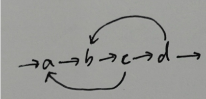

```
构造回边 x → h 的自然循环：

1. Loop ← {h}
   先把回边的目标 h，也就是循环头，加入 Loop。

2. WorkList ← {x}
   把回边的起点 x 加入工作表。

3. 当 WorkList 非空时：
   - 取出一个节点 p
   - 如果 p 不在 Loop 中：
       - 将 p 加入 Loop
       - 将 p 的所有前驱节点加入 WorkList
         但不包括回边 x → h
```

- `{a,b,c}`不是一个自然循环
  - 对于回边`c→a`这里`x=c,h=a`，这里构造`Loop={a},WorkList={c}`
  - 从`c`反向找到前驱`b`,这里根据算法中的`3`，我们将`c`和其前驱`b`分别加入`Loop`
  - 接着看`b`的前驱，分别是`a`和`d`，所以这时 **d也必须加入到Loop中**
- `{b,c,d}`：头节点`{h=b}`,对应回边`d→b`
- `{a,b,c,d}`:头节点`{h=a}`,对应回边`c→a`

**自然循环满足一下性质**

- 有唯一的入口节点，称为 **首节点**(`header`)。首节点支配循环中的所有节点
- 循环中至少有一条**返回首节点的路径**

!!! example
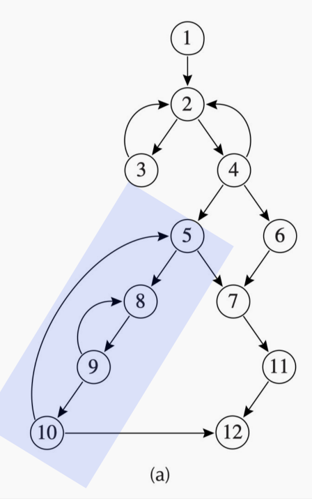

- 回边`10->5`的自然循环包括节点`{5,8,9,10}`
- `loop 8,9`被嵌套在了大的自然循环中

> 一个节点`h`也可以成为超过一个循环的头节点,比如图中的`2`节点
!!!

#### 3. Nested Loop

- 如果循环`A`和循环`B`有不同的头节点，并且`B`中的所有节点都属于`A`，也就是 $B \subseteq A$，那么我们称`B`嵌套在`A`中
  - 此时，`B`是一个**内层循环**
- **最内循环**(`Innermost Loop`)：不包含其他循环的循环
- **定理**：除非两个自然循环的首节点相同，否则，它们或者 **互不相交**，或者一个**完全包含(嵌入)在另一个里面**

**Loop-Nest Tree**

- 我们可以为程序中的循环构造一棵循环嵌套树
    1. 计算控制流图`G`中的支配节点
    2. 构造支配树
    3. 找出所有自然循环，从而找到所有循环头节点
    4. 对于每个循环头`h`，把所有以`h`为头的自然循环合并成一个循环，记作`loop[h]`
    5. 构造由循环头节点组成的树，也隐含表示循环本身，如果`h2`在`loop[h1]`中，那么在树中`h1`位于`h2`的上方

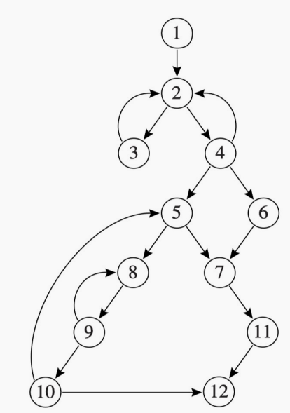

- **节点和边**
  - 每个节点表示**一个循环或者一组循环**
  - 父子关系表示循环嵌套

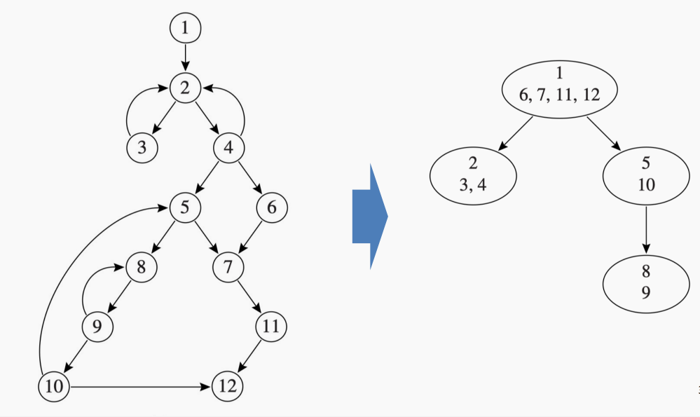

- **Loop Nest Header**
  - 每个循环头都显示在每个椭圆的上半部分
  - 在这个例子中，循环头节点是`1,2,5,8`
- 循环嵌套树的叶子节点就是 **innermost loop**
- 我们可以说，整个过程体是一个伪循环，它位于循环嵌套树的**根节点**处

### 18.1.3 Loop Preheader

- 许多循环优化会在循环执行之前立即插入一些语句
- **pre-header**:一个插入在循环`header`之前的基本块
  - 它恰好只有一个后继节点，也就是循环的`header`
  - 所有通向循环`header`的路径都必须经过`pre-header`

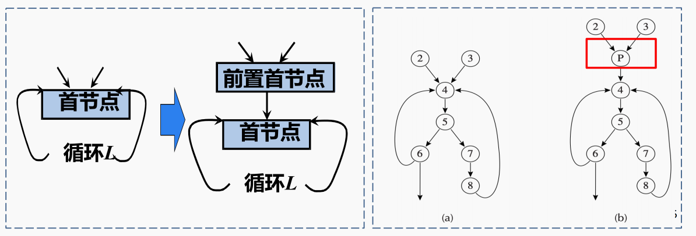

## 18.2 Loop Invariant Hoisting

### 18.2.1 Loop Invariant

#### 1. Loop Invariant Code Motion

- **Idea**：循环中计算的一些表达式**永远不会改变**，它们是循环不变量
  - 将它们移动到循环外部，把结果存储在临时变量中，然后在每次迭代中**直接使用这个临时变量**
- **Step1: 分析**：找出循环中的不变计算。所谓不变，是指每次执行该计算时，都会得到相同的结果
- **Stpe 2:Transformation**:把这些不变计算移动到循环外

#### 2. Identifying Loop Invariants

> 如何识别循环不变量

对于赋值语句`x:=v1 op v2`，如果它的每个操作数`v1`和`v2`都满足下面条件之一，那么这条赋值语句对该循环来说就是不变的：

1. 操作数是常量
2. 所有能够到达该赋值语句的定义都在循环外部
    - `reaching definition`:某个变量当前使用的值，是由前面哪个赋值语句定义出来的
    - 如果每次循环中使用的变量都是循环外定义的，且不会在循环中改变
3. 只有一个定义能够到达该赋值语句，并且这个定义本身是循环不变的
    - 就是说循环变量是可以传播的

!!! example
```c
while (...) {
    t = a + b;
    x = t * 2;
}
```

假设`a`和`b`在循环中不变，那么`t = a + b`在循环里面也是不变的，那么接下来的`x = t * 2`说明`x`也是循环不变的
!!!

> 我们可以使用迭代算法来计算，原因是：**循环不变量之间可能存在依赖关系**

!!! example
```tiger
L0: t := 0
    a := x

L1: i := i + 1
    b := 7
    t := a + b
    *i := t
    if i < N goto L1 else L2

L2: x := t
```

- `b,t`是循环不变量
- `i`不是循环不变量
!!!

### 18.2.2 Loop Invariant Hoisting

#### 1. Hoisting

**Valid/Safe Hoisting**

- `c = a + b`是一个循环不变量，并且我们可以**安全地执行**循环不变量外提

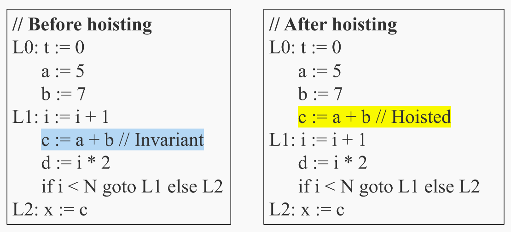

**Invalid/Unsafe Hoisting**

!!! question
只要`t`是循环不变量，我们就总是可以移动它吗？
!!!

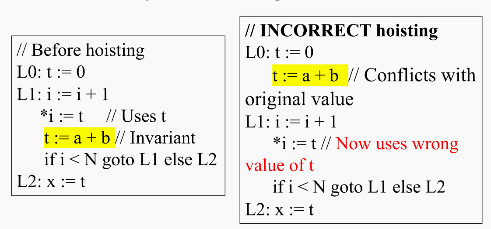

- 这里就出现了一个问题
  - `t`确实是循环不变量
  - 但是我们第一轮进入循环的时候，正常情况下应该是`*i`使用`t`的初始值`0`
  - 但是如果我们进行`hoist`操作，那么`t`的初始值就变成了`a + b`
  - 这就是一个不正确的`hoist`

因此，代码是循环不变的，并不意味着 **我们就可以移动它**

#### 2. Criteria for Safe Hoisting

对于循环不变赋值语句`t ← a ⊕ b`，安全外提需要以下条件

- **Dominance condition**:对于所有在循环出口处仍然活跃的出口节点`t`，定义语句`d`必须支配这些循环出口
- **Uniqueness Condition**:循环中只有一个对`t`的定义
- **Pre-header condition**:`t`不能在循环`pre-header`的出口处活跃。也就是说`t`在循环之前不能是活跃的

##### Cond 1: 定义语句d必须支配所有t在出口处活跃的循环出口

如果这个定义语句没有支配某个会使用`t`的循环出口，那么代码外提可能会导致该出口处使用到不同的`t`值

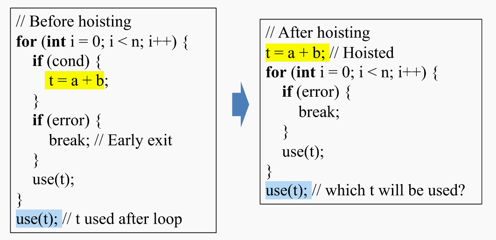

> 如果错误地提升了这个赋值，无论如何`t`都会被赋值为`a + b`，改变了程序行为

##### Cond 2: 循环中只能有一个对t的定义

如果循环中有多个对`t`的定义，而只是把其中一个定义外提，就可能造成不一致

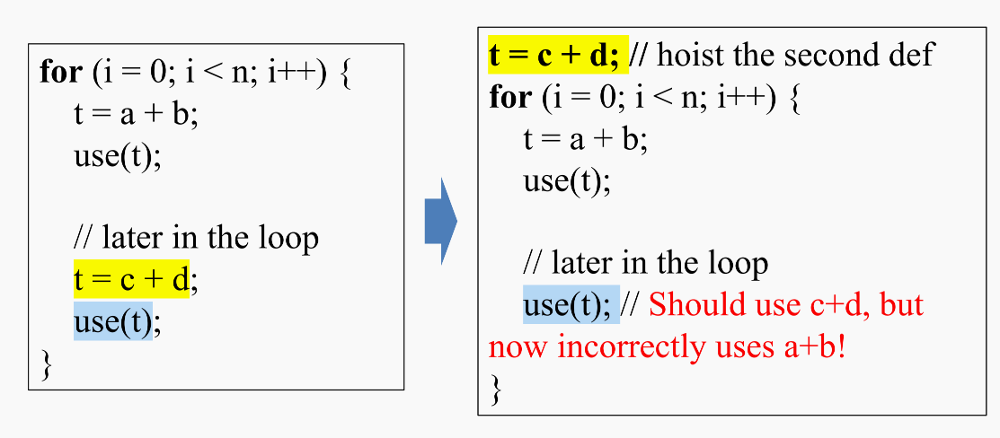

##### Cond 3: t不能在循环`pre-header`的出口处活跃

如果`t`在循环入口处是活跃的，那么外提会覆盖它之前的值

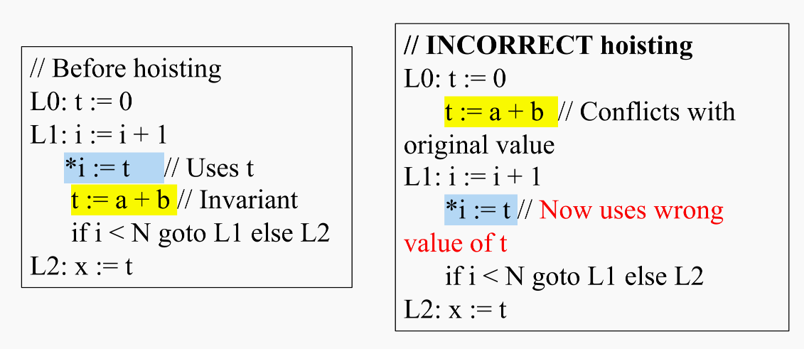

!!! example "Can we hoist d: t ← a ⊕ b?"
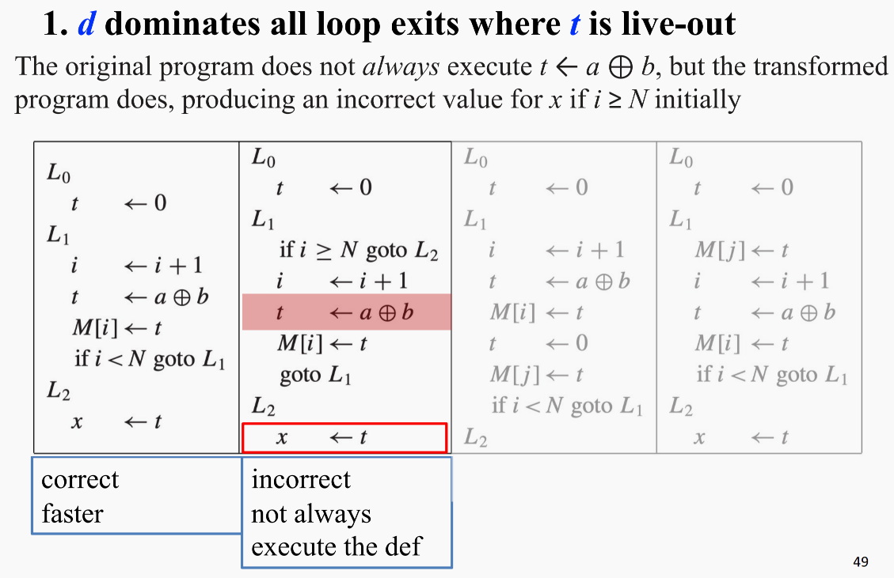
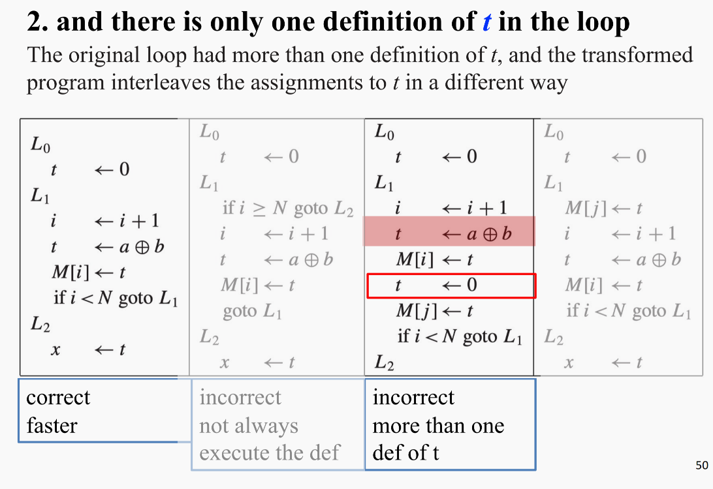
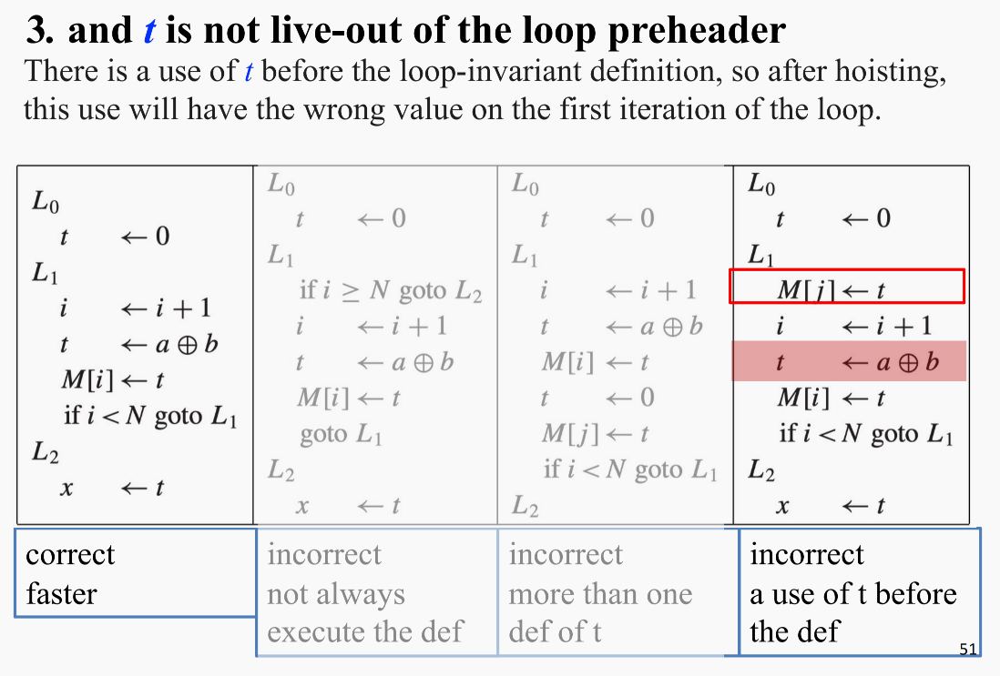
!!!