# 编译原理 Chapter 2：词法分析

## 目录

1. [词法分析概述](#1-词法分析概述)
2. [正则表达式](#2-正则表达式)
3. [有穷自动机](#3-有穷自动机)
4. [词法分析器自动生成](#4-词法分析器自动生成)
5. [Lex工具](#5-lex工具)

---

## 1. 词法分析概述

### 1.1 什么是词法分析

**词法分析 (Lexical Analysis)** 是编译器的第一个阶段，也称为**扫描 (Scanning)**。编译器首先接收的是以字符串形式存在的源程序，词法分析器将这个字符流分割成有意义的子串（称为**词素**），并将这些词素分类为**词法记号（Token）**。

!!! example 词法分析示例

**输入**（字符流形式的源程序）：
```
if (i == j)
    z = 0;
else
    z = 1;
```

经过词法分析后，转换为：

```
\tif (i == j)\n\t\tz = 0;\n\telse\n\t\tz = 1;
```

**其他辅助任务**：词法分析器还会过滤注释、空格、etc等。

!!!

### 1.2 基本概念


- **Token**:词法记号/单词，语言的语法单位
  - 如同英语中的名词、动词、形容词
  - 如同编程语言中的关键字、标识符、操作符、字符串等
- **Lexeme**:词素
  - Token的具体实例
  - 源程序中符合某个模式的序列
- **Pattern**:描述Token所属Lexeme的规则和定义


### 1.3 Token 与 Lexeme 的关系

- **Token** 是词法记号的抽象类型（如 IF、ID、NUMBER）
- **Lexeme** 是 Token 的具体实例（如 `if`、`sum`、`123`）

!!! example Token 和 Lexeme 示例

对于源代码：
```c
if (i == j) print("equal");
else num = 1;
```

| Token 类型 | Lexeme 实例 | Token的非形式化定义 |
|------------|-------------|-------------------|
| IF | if | 字符 i, f |
| ELSE | else | 字符 e, l, s, e |
| RELOP | <, <=, =, ... | < 或 <= 或 = 或 <> 或 > 或 >= |
| ID | sum, count, D5 | 由字母开头的字母数字串 |
| NUMBER | 3.1, 10, 2.8E12 | 任何数值常数（整数、浮点数、科学计数法）|

!!!

### 1.4 词法分析器的构造

词法分析器的构造遵循**声明式规范 + 实现**的模式：

```
Program = Specification + Implementation
             "What"           "How"
```

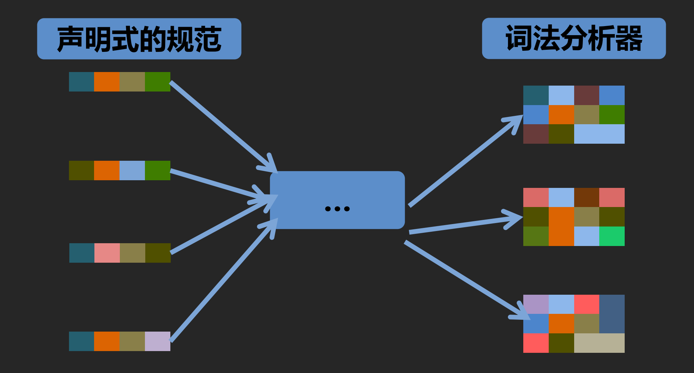

- **Specification（规范）**：用正则表达式形式化地描述词法规则
- **Implementation（实现）**：根据规范自动生成词法分析器

这种设计使得我们可以：
1. 先"声明"我们要识别什么样的 Token（What）
2. 自动生成能够识别这些 Token 的程序（How）

---

## 2. 正则表达式

### 2.1 字母表和串

#### 字母表 (Alphabet)

- **定义**：字母表是符号的**有限集合**
- 示例：英文字母集合 {a, b, ..., z, A, B, ..., Z}、数字集合 {0, 1, ..., 9}

#### 串 (String/Word)

- **定义**：串是字母表中符号的**有穷序列**
- **长度**：串 s 的长度记作 |s|，表示 s 中符号的个数
- **空串**：长度为 0 的串，记作 ε（epsilon）

> **注意区分**：
> - ε：空串（长度为0的串）
> - {ε}：只包含空串的集合（集合长度为1）
> - ∅：空集（不包含任何元素）

### 2.2 串上的运算

#### 连接 (Concatenation)

- 将 y 附加到 x 后形成的串记作 xy
- 示例：如果 x = dog，y = house，那么 xy = doghouse
- 对于任何串 s 都有：εs = sε = s（ε 是连接的单位元）

#### 幂运算

- 串 s 的 n 次幂：将 n 个 s 连接起来
- s⁰ = ε
- s¹ = s，s² = ss，s³ = sss，...
- 示例：如果 s = ba，那么 s¹ = ba，s² = baba，s³ = bababa

### 2.3 形式语言

- **语言**：字母表 Σ 上的一个串集
- **句子**：属于语言的串
- **运算优先级**：幂 > 连接 > 并
- **语言的运算**

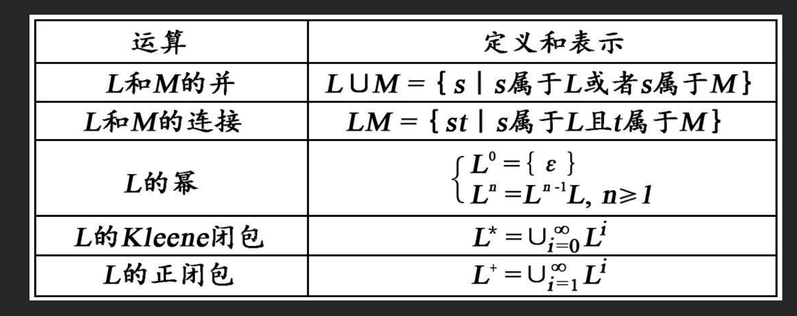

!!! example 语言运算练习

给定语言 L = {a, b}，M = {cc, dd}：

| 运算 | 定义 | 结果 |
|------|------|------|
| 并 | L ∪ M = {s \| s ∈ L 或 s ∈ M} | {a, b, cc, dd} |
| 连接 | LM = {st \| s ∈ L 且 t ∈ M} | {acc, add, bcc, bdd} |
| 幂 | L⁰ = {ε}，L¹ = L，L² = LL | {ε, a, b, aa, ab, ba, bb} |
| 闭包 | L* = L⁰ ∪ L¹ ∪ L² ∪ ... | {ε, a, b, aa, ab, ba, bb, aaa, ...} |
| 正闭包 | L⁺ = L¹ ∪ L² ∪ ... | {a, b, aa, ab, ba, bb, aaa, ...} |

!!!

### 2.4 正则表达式 (Regular Expression, RE)

**正则表达式**是一种用于描述正则语言的记号体系。正则表达式 r 定义正则语言，记为 L(r)。

#### 正则表达式的递归定义

1. **ε 是正则表达式**，L(ε) = {ε}
2. **如果 a ∈ Σ，则 a 是正则表达式**，L(a) = {a}
3. **假设 r 和 s 都是正则表达式**，分别表示语言 L(r) 和 L(s)：
   - **选择 r | s**：L(r | s) = L(r) ∪ L(s)
   - **连接 rs**：L(rs) = L(r)L(s)
   - **闭包 r***：L(r*) = (L(r))*（Kleene 闭包）
   - **括号 (r)**：L((r)) = L(r)

#### 优先级

**闭包 * > 连接 > 选择 |**

示例：`((a)(b)*)|(c)` 可以简写为 `ab*|c`

!!! example 正则表达式示例

令 Σ = {a, b}：

| 正则表达式 | 描述的语言 |
|------------|------------|
| a \| b | {a, b} |
| (a\|b)(a\|b) | {aa, ab, ba, bb} |
| a* | {ε, a, aa, aaa, ...}（任意长度的 a）|
| (a\|b)* | {ε, a, b, aa, ab, ba, bb, aaa, ...}（任意长度的 ab 串）|

!!!

### 2.5 正则表达式的代数定律

| 定律 | 描述 |
|------|------|
| r \| s = s \| r | \| 是可交换的 |
| r \| (s \| t) = (r \| s) \| t | \| 是可结合的 |
| r(st) = (rs)t | 连接是可结合的 |
| r(s \| t) = rs \| rt | 连接对 \| 是可分配的 |
| (s \| t)r = sr \| tr | 连接对 \| 是可分配的 |
| εr = rε = r | ε 是连接的单位元 |
| r* = (r \| ε)* | 闭包中一定包含 ε |
| r** = r* | 闭包具有幂等性 |


!!! example 
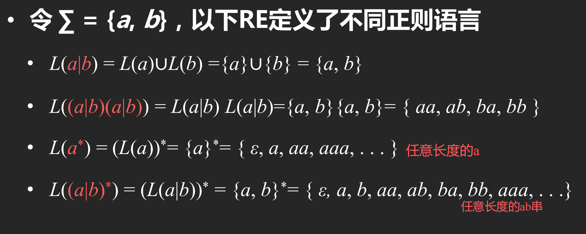
!!!

### 2.6 正则定义

对于比较复杂的语言，为了构造简洁的正则式，可以先构造简单的正则式，再将这些正则式组合起来,形成一个与改语言匹配的正则序列。

**正则定义的形式**：

```
d₁ → r₁
d₂ → r₂
...
dₙ → rₙ
```

1. 各个 dᵢ 的**名字都不同**
2. 每个 rᵢ 是 Σ ∪ {d₁, d₂, ..., dᵢ₋₁} 上的正则表达式

#### 1. 整数的正则定义

$$
digit \rightarrow 0|1|2|...|9
$$

$$
number \rightarrow digit \empty digit^{*}
$$

> 可以简记为`[0,9]`

另一种写法

$$
digit \rightarrow 0|1|2|...|9
$$

$$ 
number \rightarrow digit^{+}
$$

#### 2. C语言标识符的正则定义

- C语言的标识符是字母、数字和下划线组成的串：

```
digit    → 0 | 1 | 2 | ... | 9
letter_  → A | B | ... | Z | a | b | ... | z | _
id       → letter_ (letter_ | digit)*
```

- 可以简化为

```
digit    → [0-9]
letter_  → [A-Za-z_]
id       → letter_ (letter_ | digit)*
```

### 2.6 词法分析中正则规则的归约(Specification)

**词法分析**：字符流到`Token-lexeme`对

**步骤**

1. Select a set of token
   - `Number`, `Keyword`, `Identifier`

2. Write `R.E.` for the lexemes of each token
   - Number → [0-9]+
   - Keyword → 'if'|'else'|...
   - Identifier → [A-Za-z_][A-Za-z0-9_]*
   - LeftPar → '('

### 2.7 词法分析中正则规则的"二义性"

在用正则表达式定义词法规则时，可能会遇到二义性问题。

!!! example 二义性示例

考虑输入 `if8`，它是：
- 单个标识符 `if8`？
- 还是两个 Token：`if` 和 `8`？

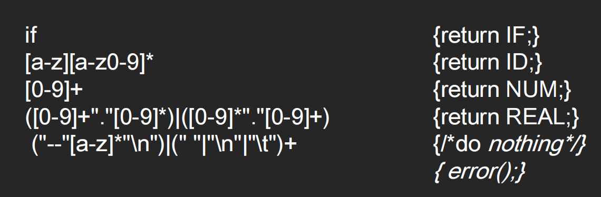

> 这个例子精确说明了不同的正则表达式会解析出完全不同的Token 

!!! 

**解决方法**：词法分析器使用两条规则来解决二义性：

1. **最长匹配 (Longest Match)**：选择能匹配的最长前缀作为下一个 Token
   - 例如：词法分析器把 `<=` 当作一个词法单元识别，而不是 `<` 和 `=`

2. **规则优先 (Rule Priority)**：当最长前缀可匹配多个模式时，选择列在最前面的模式
   - 这意味着书写正则规则顺序是有意义的

**根据以上原则**：
- `if8` → 匹配为标识符 ID（最长匹配）
- `if` → 匹配为关键字 IF（规则优先：假设关键字规则在标识符规则之前）


### 2.8 拓展：Tarjan's Path Expression Problem（选读）

这是 1981 年 JACM 论文提出的统一解决路径问题的方法。

#### 核心思想

许多问题可以看作图中的路径问题，采用**两步法**：
1. 计算一个正则表达式 ρ，捕获图中所有感兴趣的路径(`paths of interet`)
2. 在代数结构中重新解释 ρ，提取所需信息

#### 应用场景

- 可达性判断（Reachability）
- 最短路径（Shortest Path）
- 数据流分析（Dataflow Analysis）

#### 路径问题示例

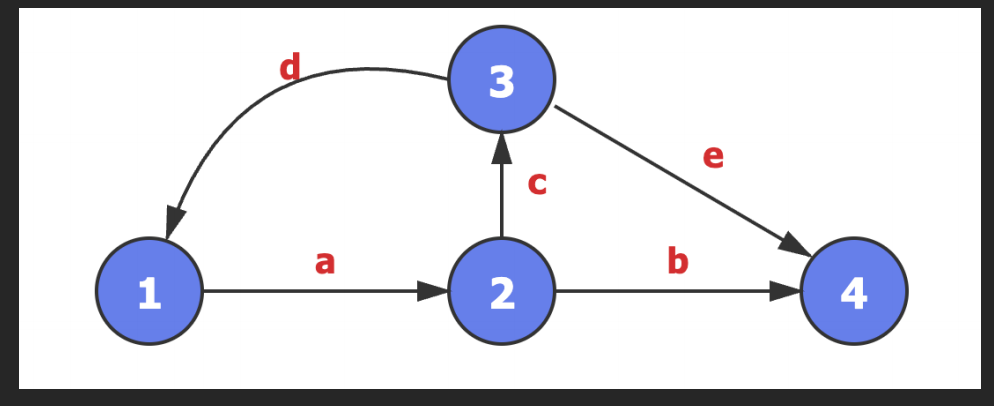

考虑一个图，寻找从顶点 1 到顶点 4 的路径性质：
- 顶点 4 是否从顶点 1 可达？
- 从顶点 1 到顶点 4 的最短路径？

**Step 1:计算正则表达式**

路径分析：

- 路径 1：1 → 2 → 3 → 4（边：a, c, e）
- 路径 2：1 → 2 → 4（边：a, b）
- 但路径 1 可以循环经过顶点 1, 2, 3 多次！

正则表达式：

$$
ρ = (a·c·d)* · (a·b + a·c·e)
$$

这个正则表达式捕获了从顶点 1 到顶点 4 的所有可能路径！

**Step 2：从代数结构重新理解ρ**

同一个正则表达式可以**在不同的代数结构中求值**，从而**解决不同的问题**！

*a Kleene algebra: $(A, ⊕, ⊗, ⊛, \bar{1} , \bar{0} )$*

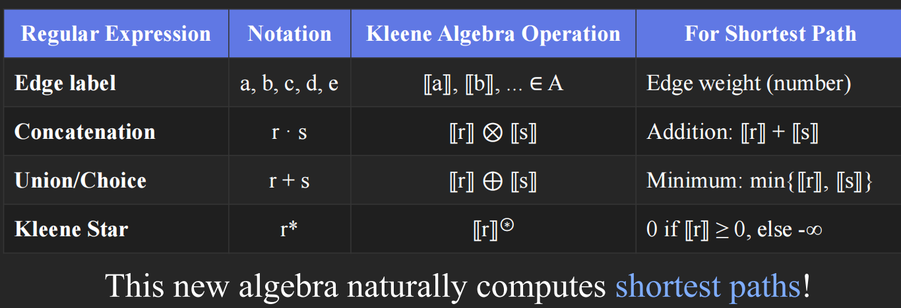

**Reinterpretation Example**

* Let's assign weights to edges
    $$[[a]] = 2, [[b]] = 5, [[c]] = 3, [[d]] = 1, [[e]] = 4$$
* Evaluate **$\rho = (a \cdot c \cdot d)^* \cdot (a \cdot b + a \cdot c \cdot e)$** in the algebra
    and we will obtain the <span style="color: #ea1818;">shortest path length = 7</span>!
* How? Recall from our mapping table:
    * Concatenation ($\cdot$) $\rightarrow$ Addition ($+$)
    * Union ($+$) $\rightarrow$ Minimum ($\min$)
    * Kleene Star ($*$) $\rightarrow$ $0$ if non-negative

**相同的ρ，不同的代数表达式会得到不同词法解析**

| 问题领域 | 集合 A | ⊕ (并) | ⊗ (连接) | $\bra{1}$ (空) |
|----------|--------|--------|----------|--------|
| 最短路径 | ℝ ∪ {±∞} | min | + | 0 |
| 最长路径 | ℝ ∪ {±∞} | max | + | 0 |
| 可达性 | {true, false} | ∨ (OR) | ∧ (AND) | true |
| 计数 | ℕ ∪ {∞} | + | × | 1 |
| 数据流 | ℘(Facts) ∪ | ∪ | f ∘ g | id |
| 可靠性 | [0,1] | max | × | 1 |

---

## 3. 有穷自动机

### 3.1 有穷自动机的定义

**有穷自动机 (Finite Automata, FA)** 是识别正则语言的一种数学模型。

**形式化定义**：$M = (S, Σ, move, s₀, F)$

| 组件 | 描述 |
|------|------|
| S | 有穷状态集（states） |
| Σ | 输入符号集合/字母表（alphabet） |
| move(s,a) | 转换函数（transition function） |
| s₀ | 开始状态（start state），s₀ ∈ S |
| F | 接受状态集（final/accepting states），F ⊆ S |

### 3.2 有穷自动机的表示方法

#### 转换图 (Transition Graph)

- **状态**：用圆圈表示
- **开始状态**：带箭头的圆圈
- **接受状态**：带双圆圈的节点
- **状态转换**：如果对于输入 a，存在从状态 p 到状态 q 的转换，就在 p、q 之间画一条有向边，并标记上 a

 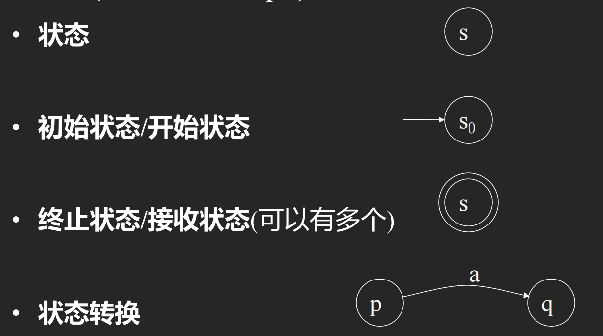

#### 转换表 (Transition Table)

 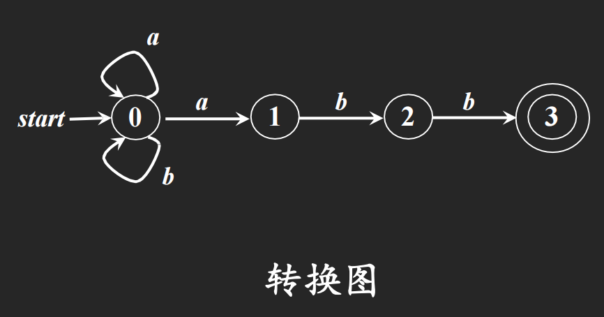

转换表是一个二维表，行表示状态，列表示输入符号：

| 状态 | a | b |
|------|---|---|
| 0 | {0, 1} | {0} |
| 1 | ∅ | {2} |
| 2 | ∅ | {3} |
| 3 | ∅ | ∅ |

!!!warning
如果转换函数没有给出对应于某个状态-输入对的信息，就把 ∅ 放入相应的表项中
!!!

### 3.3 有穷自动机的接收

#### 有穷自动机接收的串

- 给定输入串 x，如果存在一个对应于串 x 的从初始状态到某个终止状态的转换序列，则称串 x 被该 FA **接收**

!!! example 

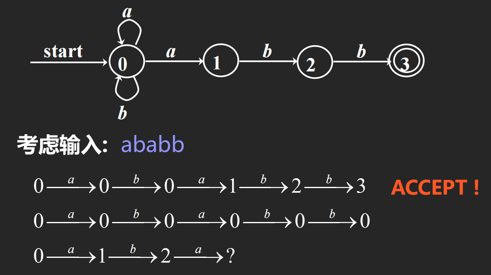
!!!

#### 有穷自动机接收(定义的语言)

- 由一个有穷自动机 M 接收的**所有串构成的集合**，称为该 FA 接收（或定义）的语言，记作 **L(M)**

!!! example
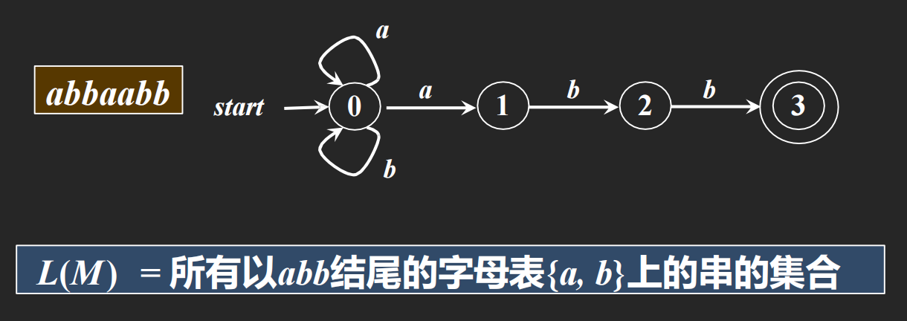
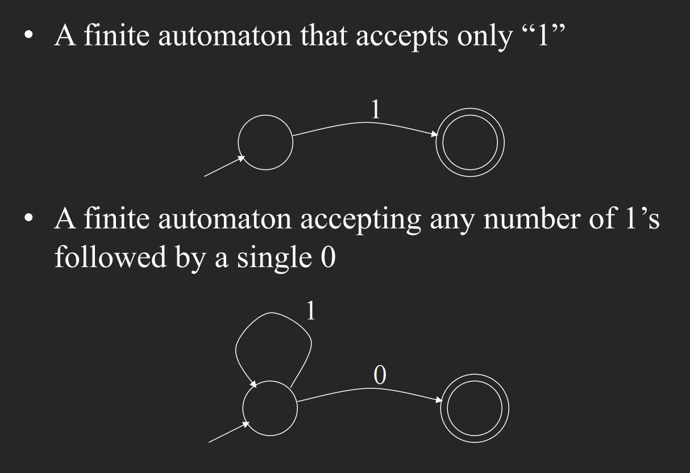
!!!

### 3.4 有穷自动机的分类

#### 状态转换：Epsilon Moves

$\epsilon -moves$:一种特殊的状态转换方式

- 自动机可以不读入任何输入，而从状态A转移到状态B

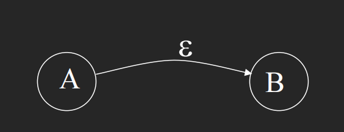

!!! example
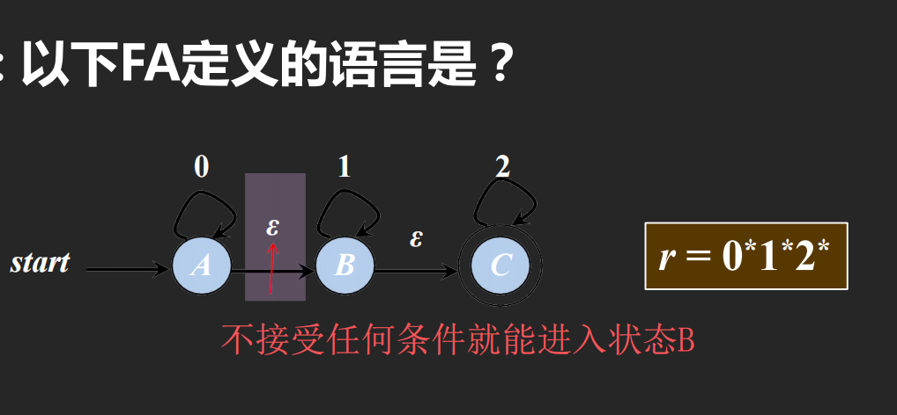
!!!

*根据状态转换方式的不同，有穷自动机分为两类*：

#### 非确定有穷自动机 (NFA)

- **转换函数**：
  - $move:S \times (\Sigma \cup \{ \epsilon \}) \rightarrow P(S)$
  - move(s, a) → P(S)（从状态 s 出发，读入 a 后可能到达多个状态）
  - move(s, a)表示从状态s触发，沿着标记为a的变所能到达的状态集合
- **可能存在 ε-moves**：不读入任何输入就能转移到其他状态

#### 确定性有穷自动机 (DFA)

- **转换函数**：
  - $move:S \times \Sigma \rightarrow S$
  - move(s, a) → S（从状态 s 出发，读入 a 后到达**唯一确定**的状态）
  - $\sigma(s, a)$表示从状态s出发，沿着标记为a的边锁能到达的状态
- **没有 ε-moves**

### 3.5 NFA 与 DFA 的对比

| 特征 | NFA | DFA |
|------|-----|-----|
| 转换函数 | move: S × (Σ ∪ {ε}) → P(S) | move: S × Σ → S |
| 后继状态 | 可能多个 | 唯一 |
| ε-moves | 可能存在 | 不存在 |
| 识别效率 | 低（需要回溯）| 高（线性时间）|
| 等价性 | 对任何 NFA，存在定义同一语言的 DFA | 对任何 DFA，存在定义同一语言的 NFA |

!!! example NFA 与 DFA 的等价性

同一个正则表达式 (a|b)*abb 可以用 NFA 和 DFA 两种形式表示：

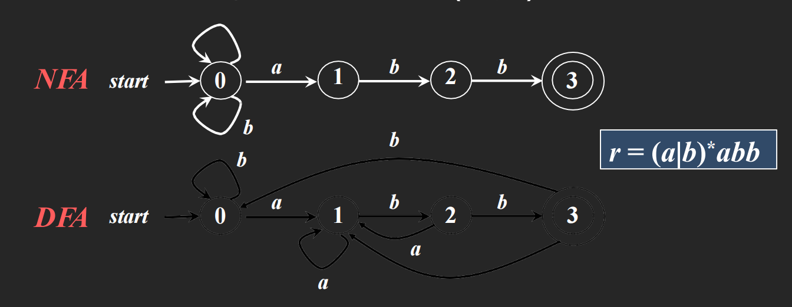

!!!

### 3.6 ε-moves（ε 转换）

ε-moves 是一种特殊的状态转换方式：自动机可以不读入任何输入，而从状态 A 转移到状态 B。

!!! example ε-moves 示例

识别语言 r = 0*1*2* 的 NFA：

```
    ε           ε
→(0)---ε--→(1)---ε--→(2)
  |            |            |
  0            1            2
```

- 开始时，无需任何输入就能进入状态 0
- 通过 ε 转换，可以不接受任何条件就进入状态 1 或状态 2
- 这使得该 NFA 可以匹配 "0"、"1"、"2"、"01"、"12"、"012" 等串

!!!

> 我们需要解决的问题：词法分析，也就是如何构造FA，来识别用RE刻画的Token

### 3.7 构造有穷自动机识别字符串

#### 构造NFA识别字符串

- 给定输入字符串x,如果存在一个对应于串x的从初始状态到某个终止状态的转换序列，则称串x被该FA接收

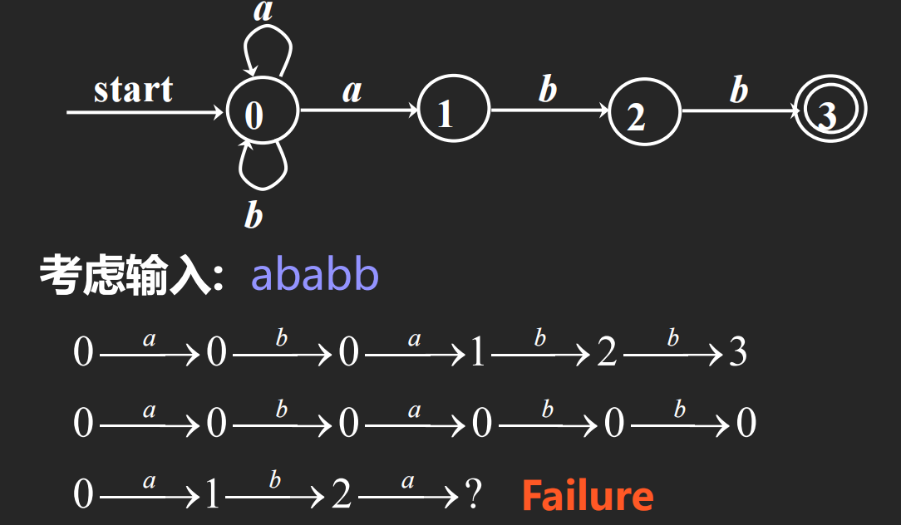

**NFA需要对多种路径进行试探+失败回退**，相当于一种 **BFS**，效率很低


#### 构造DFA识别字符串

- 输入：
  - 以文件结束符`eof`结尾的字符串x
  - DFA D:开始状态 $s_0$,接收状态集F，转换函数`move`
- 输出
  - 如果D接收x，则回答`yes`,，否则回答`no`

```c
/**
 * nextChar()返回x的下一个符号
 * 函数move(s, c)表示从状态s出发，沿着标记为c的边所能到达的状态
**/
s = s0;
c = nextChar();
while(c != eof){
    s = move(s, c);
    c = nextChar();
}

if(s in F) return "yes";
return "no";
```

!!! example "识别语言(a|b)*abb"的DFA"
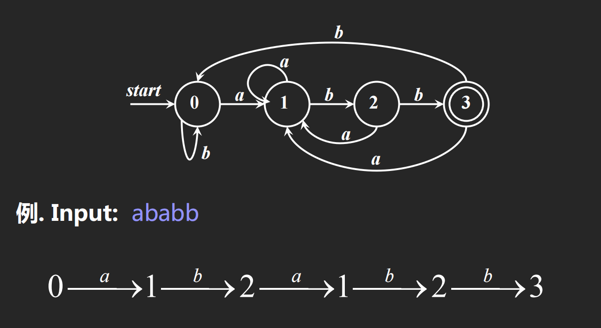
!!!

---

## 4. 词法分析器自动生成

### 4.1 自动生成流程:RE→DFA


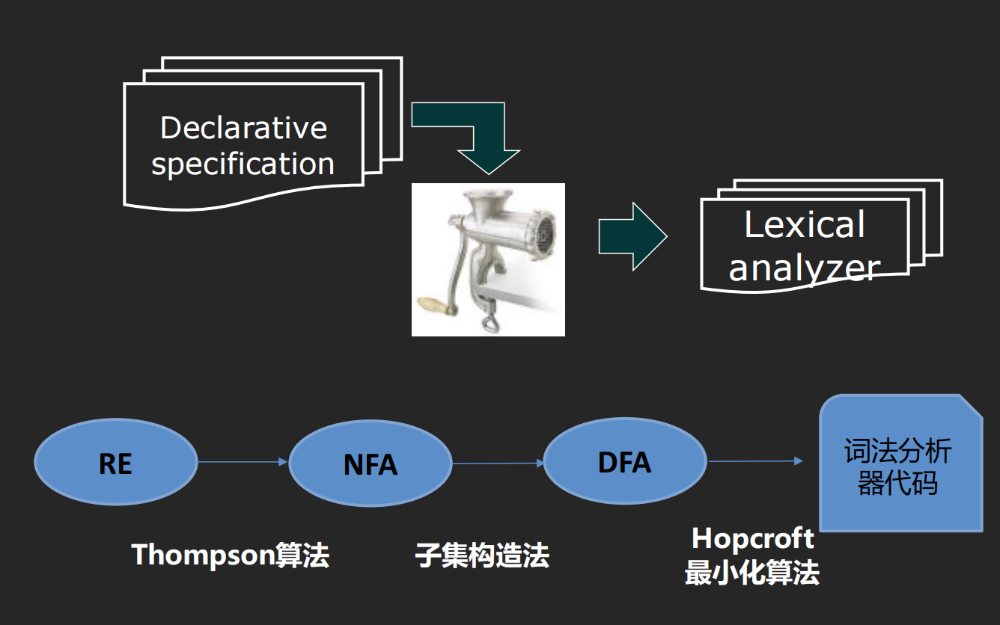

**关键算法**：
- Thompson 算法：正则表达式 → NFA
- 子集构造法：NFA → DFA
- Hopcroft最小化算法：DFA 最小化

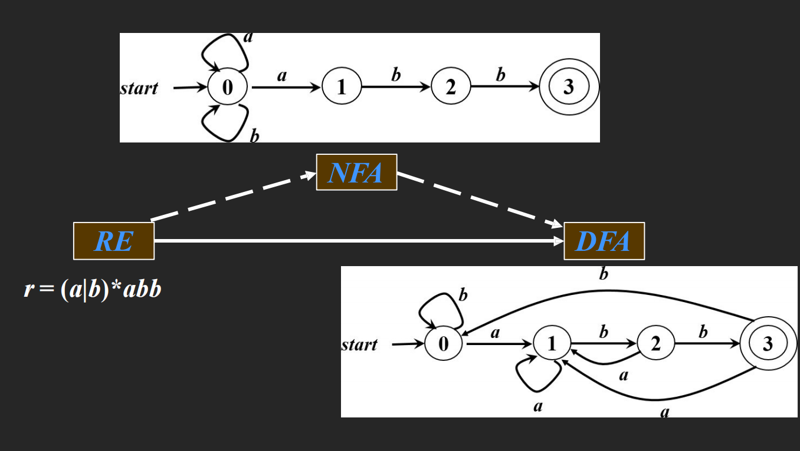

### 4.2 正则表达式 → NFA（Thompson 算法）

**输入**：正则表达式 r
**输出**：定义 L(r) 的 **NFA**，记为 N(r)

**Thompson算法思想**：基于对 RE 的结构做归纳
- 对基本的 RE 直接构造：ε, a
- 对复合的 RE 递归构造：s|t, st, s*

**重要特点**：
- N(r) 仅有**一个接受状态**
- N(r) 的接受状态**没有出边**

#### 基本构造规则：处理 ε和a

**原则**：直接构造
- 识别 ε 的 和字母表中一个符号 a 的NFA


1. **识别 ε 的 NFA**：
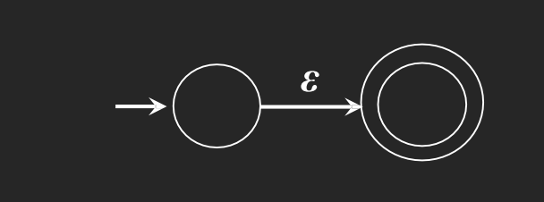

1. **识别符号 a 的 NFA**：
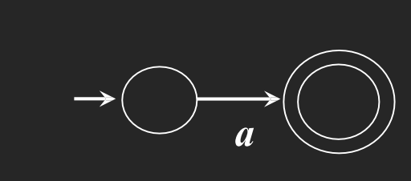

#### 复合构造规则

**原则**：递归构造

1. **选择 s | t（并联）**：
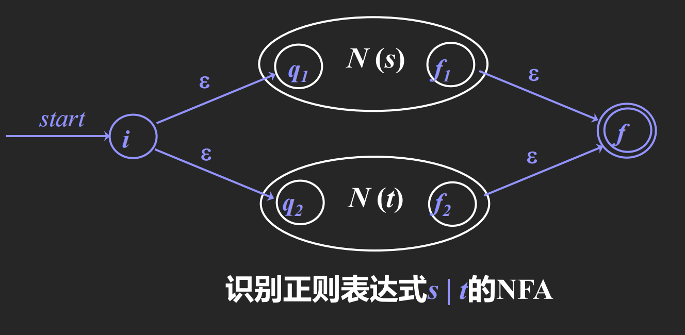

2. **连接 st（串联）**：将 N(s) 的接受状态和 N(t) 的开始状态合并
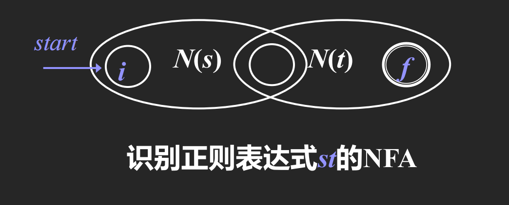

3. **闭包 s***：添加从开始状态到接受状态的 ε 边，以及从接受状态回传到 N(s) 的 ε 边

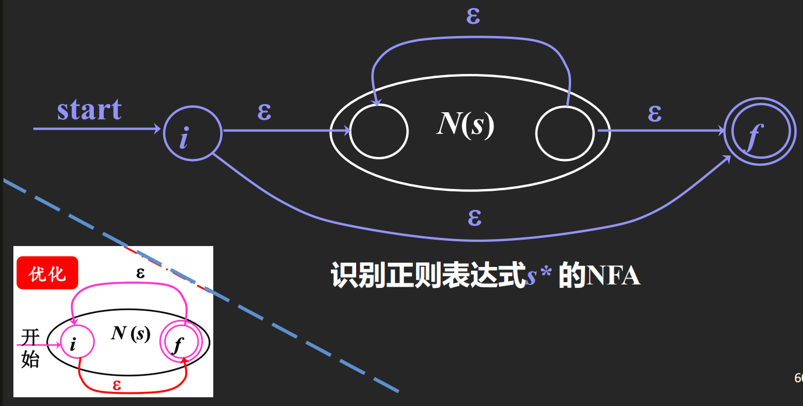

!!! example 正则表达式 r = a(b|c)* 到 NFA

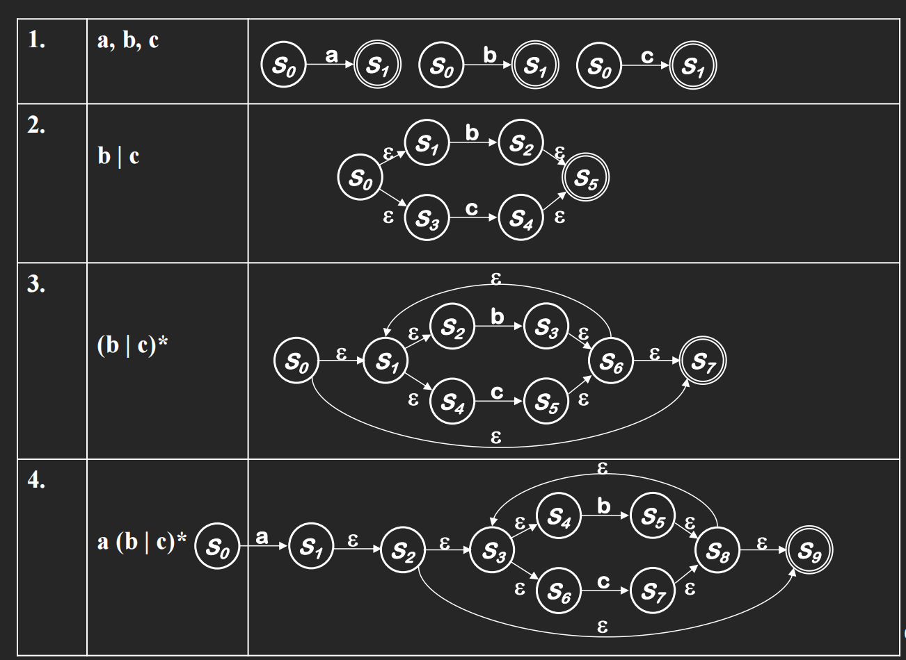
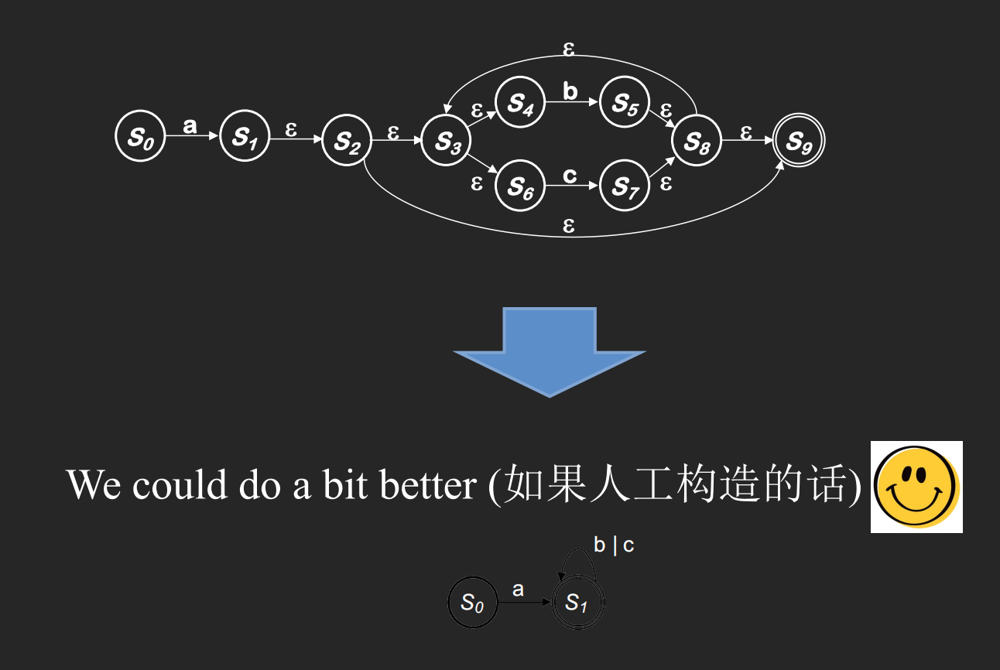
!!!

### 4.3 NFA → DFA（子集构造法）

**为什么需要转换**：NFA 在识别字符串时需要尝试所有可能的路径，效率较低；DFA 识别效率高（线性时间），但构造复杂。

#### 核心概念

**子集构造法subset construction**的原则：
- DFA 的每个状态对应 NFA 状态集合的一个子集。
- 读了输入$a_i$之后NFA能到达的所有状态:$s_1, s_2, ..., s_k$, 则DFA到达一个状态，对应于NFA的状态集合：$\{s_1, s_2, ..., s_k\}$

#### 关键操作：NFA状态集上的一些操作

| 操作 | 定义 |
|------|------|
| ε-closure(s) | NFA状态s的ε-closure，从 NFA 状态 s 出发，只通过 ε 转换能到达的所有状态 |
| ε-closure(T) | T 中所有状态的 ε-closure 的并集 |
| move(T, a) | 从 T 中某个状态出发，通过符号 a 能到达的所有状态 |

#### 自己构造发的过程

1. NFA的初始状态的$\epsilon-closure$对应于DFA的初始状态
2. 针对每个DFA状态(对应NFA状态子集)，求输入每个$a_i$后能达到的NFA状态的$\epsilon-closure$并集

$$
S=\epsilon-closure(move(A,a_i))
$$

> NFA从状态集A触发，读入$a_i$后能到达的状态集合

该集合

- 要么对应于DFA中一个已有的状态
- 要么是一个要新加的DFA状态

#### 伪代码描述

##### ε-closure 算法

```c
将 T 的所有状态压入 stack 中；
将 ε-closure(T) 初始化为 T；

while (stack 非空) {
    弹出栈顶元素 t；
    for (每个满足：从 t 出发有 ε 转换到达状态 u) {
        if (u 不在 ε-closure(T) 中) {
            将 u 加入 ε-closure(T)；
            将 u 压入 stack；
        }
    }
}
```

##### 子集构造法过程

```c
输入：NFA N
输出：接收同样语言的 DFA D

1. ε-closure(s₀) 是 Dstates 中的唯一状态，且未标记；
2. while (Dstates 中有未标记状态 T) {
       标记 T；
       for (每个输入符号 a) {
           U = ε-closure(move(T, a))；
           if (U 不在 Dstates 中)
               将 U 加入 Dstates，且未标记；
           Dtran[T, a] = U；
       }
   }
3. D 的接受状态是那些包含 NFA 接受状态的集合
```

!!! example NFA → DFA 变换示例

将 NFA r = (a|b)*abb 转换为 DFA：

*已知的NFA*

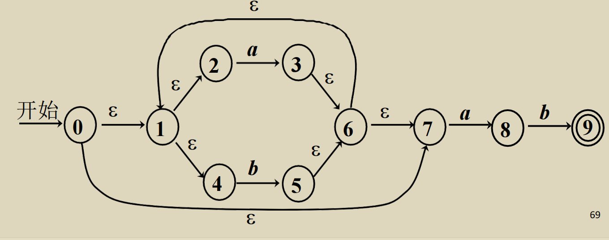

**Step 1**:计算ε-closure(0)

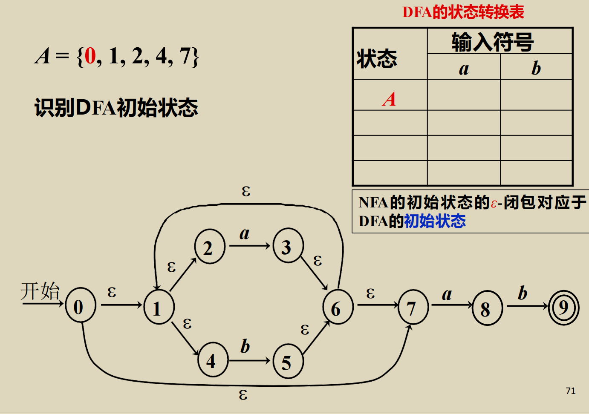

**Step 2**:计算ε-closure(move(A,a))

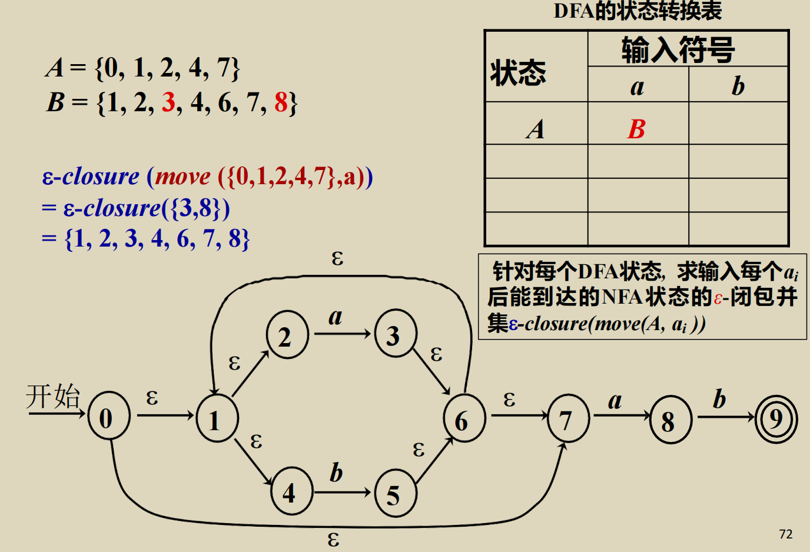

*更新状态转换表*

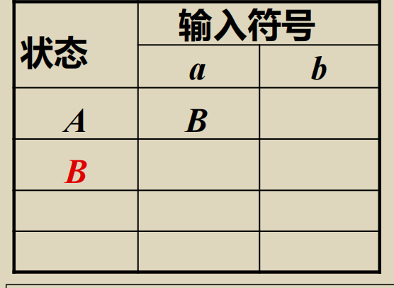

**Step 3**:计算ε-closure(move(A,b))

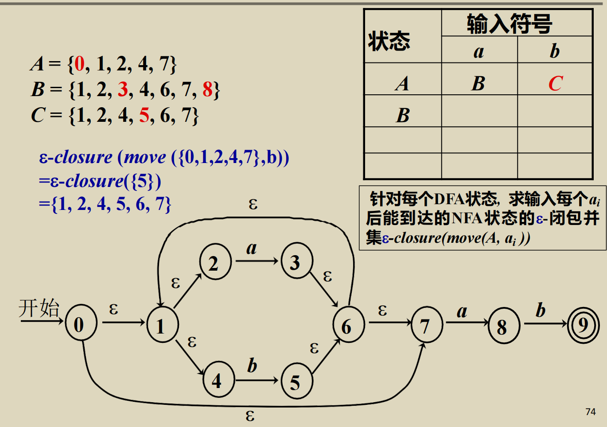

*更新状态转换表*

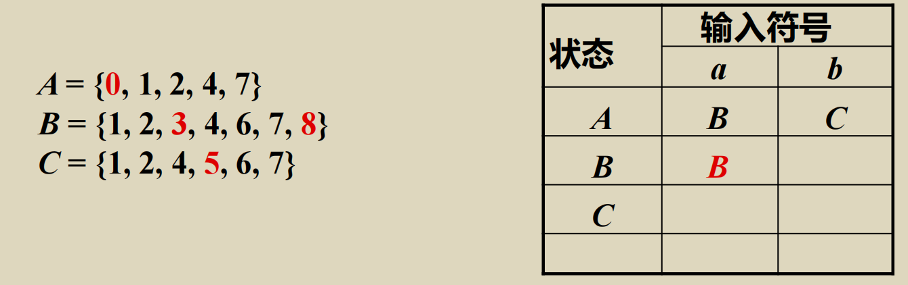

**Step 4**：依次向下计算...直到到达了**不动点**

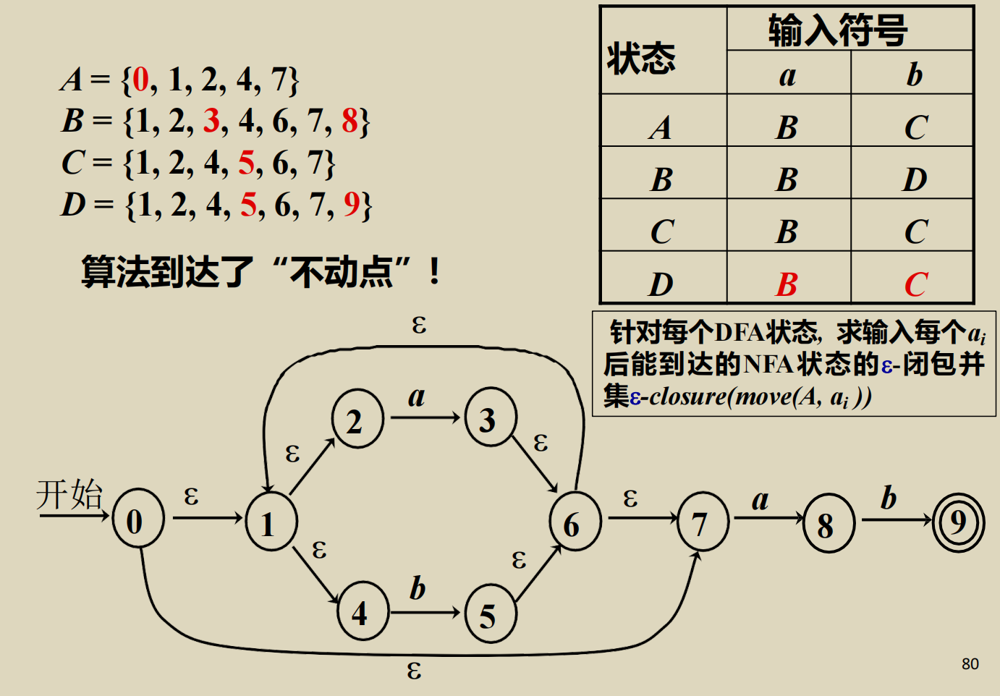

**Step 5**:根据DFA转换表，生成DFA转换图

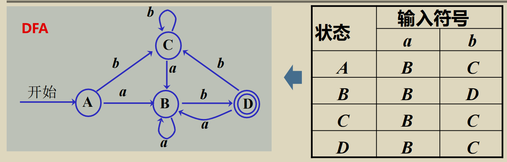
!!!

### 4.4 DFA 最小化（Hopcroft 算法）

- 一个正则语言可以对应于多个识别此语言的DFA
**目的**：通过DFA的最小化，可以获得**状态数最少**的 DFA（**唯一**，不计同构）

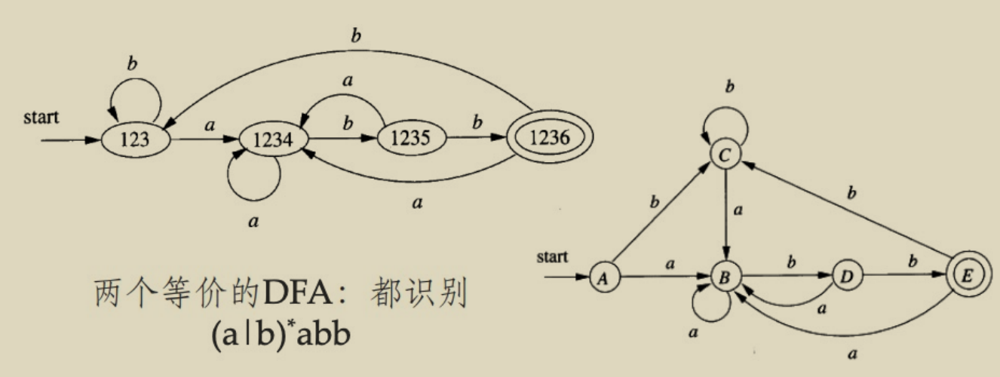

#### 可区分状态

如果存在串 x，使得从状态 s、t 出发，一个到达**接受状态**，一个到达**非接受状态**，则 x **区分**了 s 和 t。

!!! example
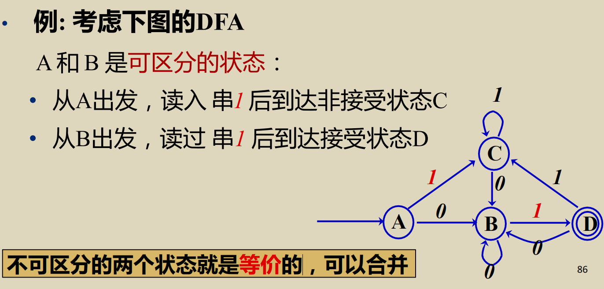
!!!

简单来说，如果我们可以**至少找到一个字符串(输入序列)**，使得从这两个状态分别触出发，**到达的状态是不同的**，则这两个状态是**可区分**的。

**不可区分**的两个状态是**等价**的，可以合并。

!!! example
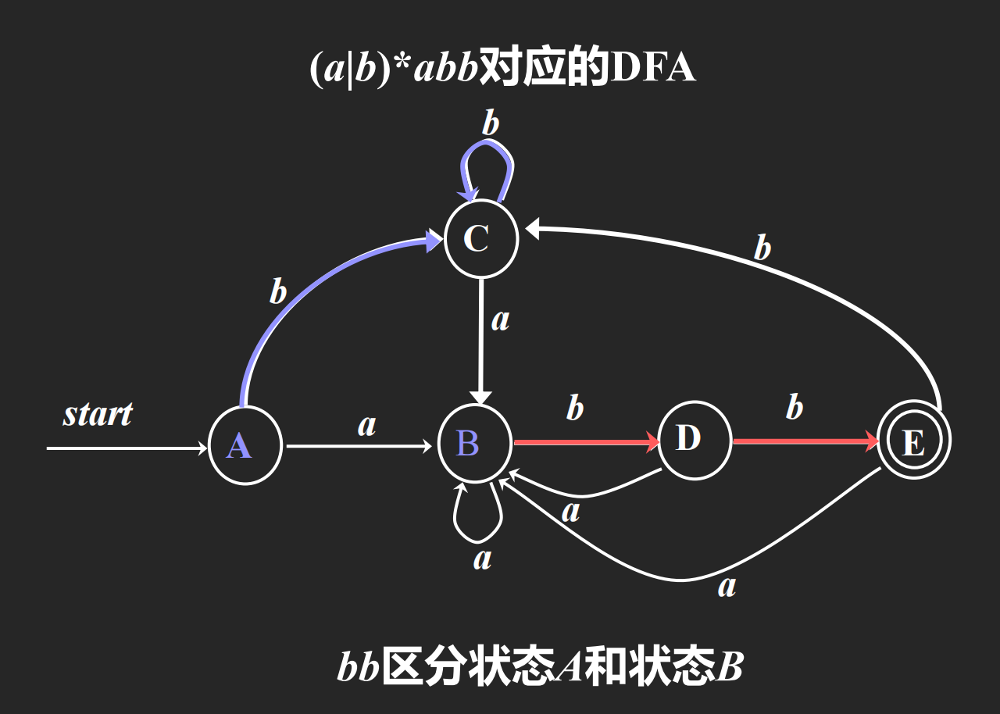
!!!

#### DFA状态等价的条件

1. **一致性条件**：s、t 同为终态或非终态
2. **蔓延性条件**：对所有输入符号，s、t 必须转换到等价的状态集中（具有传递性）

#### 最小化算法

**DFA简化算法(Hopcroft算法)**

- **划分部分**：根据以上条件迭代式划分等价类
- **构造部分**：从划分得到的等价类中选取代表，并重建DFA

**划分部分**：

1. 初始划分：P = {S - F, F}（**非接受状态组和接受状态组**）
2. 利用 **可区分**的概念，反复分裂划分中的组G
   - 集合G的每个状态读入同一个字符后，都落入相同的某个集合，那么就不用细分得到的小组
```c
for (P 中的每个集合 G) {
       细分 G，使得 G 中的 s、t 仍在同一组 iff
       对任意输入 a，s和t 都到达 P 中的同一组；
       P_new = 将 G 替换为细分得到的小组；
   }
```
3. 直到 P == P_new（不可再分裂），令$P_{final} = P$，算法完成；否则$P==_{new}$，转步骤2

!!! example
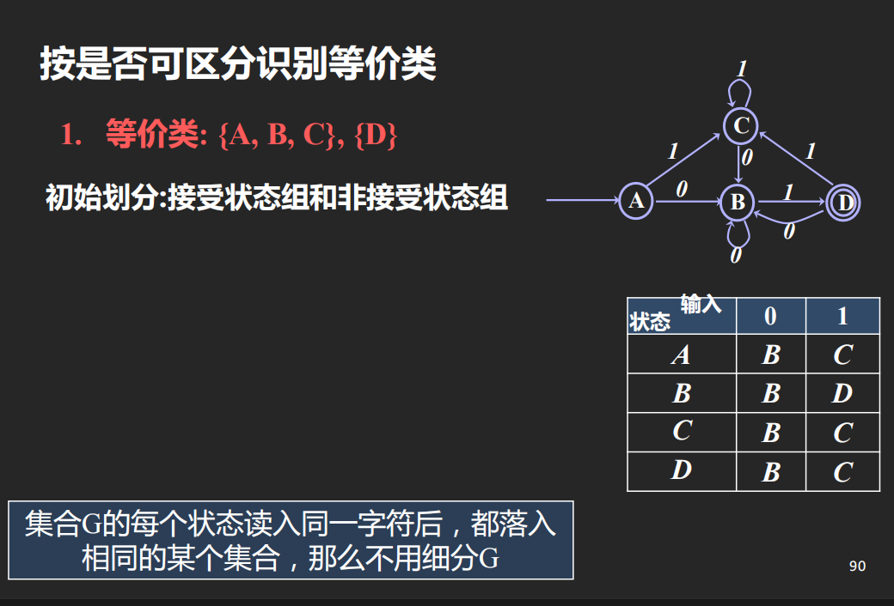
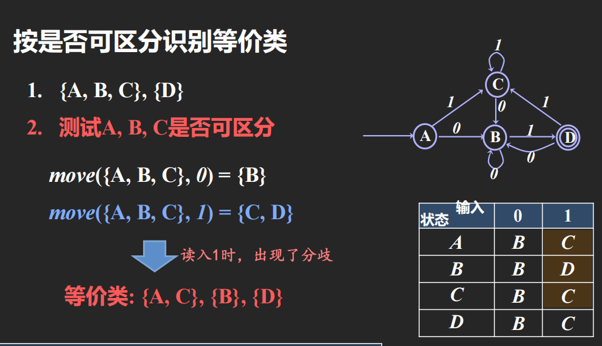
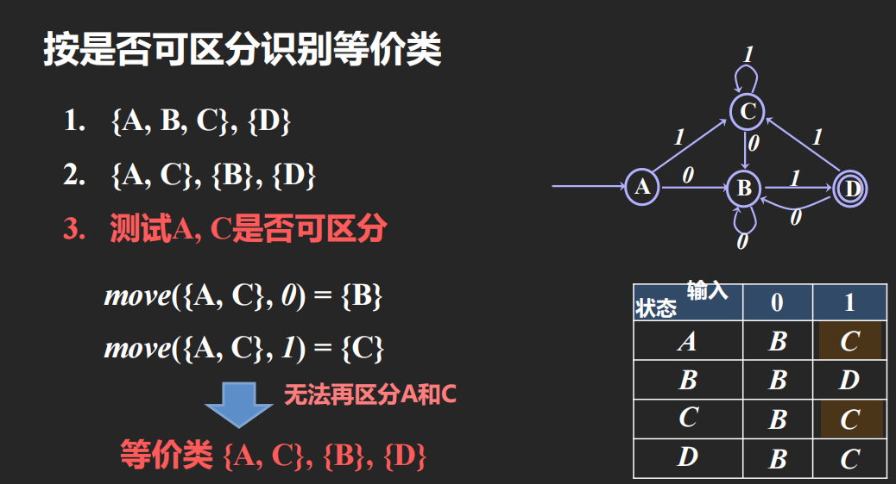
!!!


**构造部分**：

1. 在 P_final 的**每个组中选择一个代表作**为最小化 DFA 的状态
   - 开始状态：包含**原开始状态**的组的代表
   - 接受状态：包含**原接受状态**的组的代表
2. **转换关系构造**：如果 s 在 a 上的转换到达 t，且 t 所在组的代表为 r，则最小化 DFA 中有从 s 到 r 的 a 转换


!!! example DFA 最小化示例
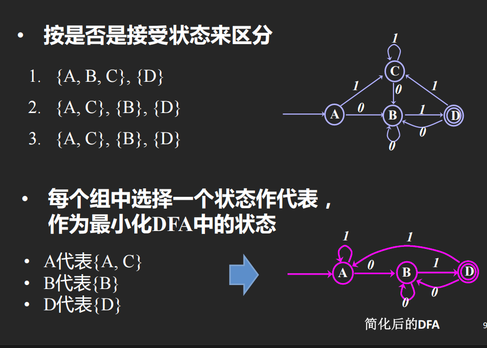
!!!
---

## 5. Lex 工具

### 5.1 Lex 概述

**Lex/Flex** 是词法分析器生成工具，通常与 Yacc/Bison 一起使用生成编译器前端。

**生成流程**：

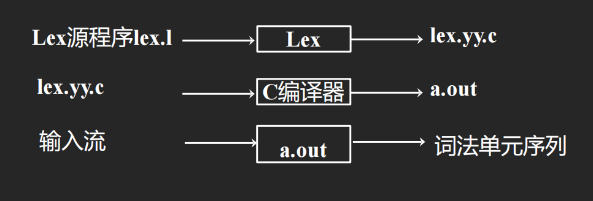

### 5.2 DFA 的实现方式

FA 本质上是一个有向图，但在实际实现中有多种编码策略：

| 实现方式 | 描述 | 示例工具 |
|----------|------|----------|
| 邻接矩阵 | 二维数组表示状态转换 | sml-lex |
| 邻接表 | 数组 + 链表 | - |
| 哈希表 | 哈希函数映射 | - |
| 跳转表 | switch 语句 | flex |

**权衡**：时间效率和空间效率的平衡

### 5.3 Lex 程序结构

Lex 程序由三部分组成：

- 声明部分
  - 常量：表示常数的标识符
  - 正则定义
- 转换规则
  - 模式{动作}
  - 模式是正则表达式
  - 动作表示识别到相应模式时应该采取的处理方式
  - 处理方式通常用C语言代码表示
- 辅助函数
  - 各个动作中使用的函数

```lex
/* 声明部分 */
%{
    /* C 代码，会被直接拷贝到输出 */
    /* 常量定义、头文件包含等 */
%}

/* 正则定义 */
delim    [ \t\n]
ws       {delim}+
letter   [A-Za-z]
digit    [0-9]
id       {letter}({letter}|{digit})*
number   {digit}+(\.{digit}+)?(E[+\-]?{digit}+)?

%%
/* 翻译规则 */
模式1    { 动作1 }
模式2    { 动作2 }
...

%%
/* 辅助函数 */
int install_id() { ... }
int install_num() { ... }
```

#### 声明部分

- **%{ ... %}**：C 代码块，会被直接拷贝到生成的 lex.yy.c 文件中
- **正则定义**：为正则表达式命名，便于后续使用

!!! example Lex 文件声明部分

```lex
%{
    /* 常量定义，这些值通常在 Yacc 源程序中定义 */
    #define IF 256
    #define ELSE 257
    #define ID 258
    #define NUMBER 259
    #define RELOP 260
%}

/* 正则定义 */
delim    [ \t\n]           /* 分隔符：空格、Tab、换行 */
ws       {delim}+          /* 空白符：一个或多个分隔符 */
letter   [A-Za-z]          /* 字母 */
digit    [0-9]            /* 数字 */
id       {letter}({letter}|{digit})*  /* 标识符 */
number   {digit}+(\.{digit}+)?(E[+\-]?{digit}+)?  /* 数字常量 */
```

!!!

#### 翻译规则部分

- **模式**：正则表达式
- **动作**：识别到相应模式时应执行的 C 代码
- **返回值**：将 **Token 类型**返回给语法分析器

!!! example Lex 文件翻译规则部分

```lex
{ws}           { /* 忽略空白符，不返回任何 Token */ } //没有返回表示继续识别其他的词法单元

while          { return WHILE; }
do             { return DO; }

{id}           {
                    yylval = install_id();//把识别到的标识符加入标识符表
                    return ID;
                }

{number}       {
                    yylval = install_num();//识别到数字常量，加入常量表
                    return NUMBER;
                }

"<"            { yylval = LT;  return RELOP; }
"<="           { yylval = LE;  return RELOP; }
"="            { yylval = EQ;  return RELOP; }
"<>"           { yylval = NE;  return RELOP; }
">"            { yylval = GT;  return RELOP; }
">="           { yylval = GE;  return RELOP; }
```

!!!

#### 辅助函数部分

在动作中调用的辅助函数定义，如 install_id()、install_num() 等。

### 5.4 Lex 中的冲突解决

**冲突类型**：
1. 多个输入前缀与某个模式相匹配
2. 一个前缀与多个模式相匹配

**Lex 解决冲突的方法**：

1. **最长匹配 (Longest Match)**
   - 多个前缀可能匹配时，选择最长的前缀
   - 例如：`<=` 被当作一个词法单元，而不是 `<` 和 `=`

2. **规则优先 (Rule Priority)**
   - 最长前缀与多个模式匹配时，选择列在前面的模式
   - 例如：如果保留字规则在标识符规则之前，`if` 将被识别为关键字 IF

---

## 总结

### 词法分析的核心任务

将字符流转换为 Token 流，识别出有意义的词素（Lexeme）并分类为相应的 Token。

### 核心技术转换

| 阶段 | 输入 | 输出 | 关键算法 |
|------|------|------|----------|
| Token 定义 | 自然语言描述 | Token 类型列表 | - |
| 正则表达式 | Token 模式 | RE | - |
| NFA | RE | 状态转换图 | Thompson 算法 |
| DFA | NFA | 确定的状态转换 | 子集构造法 |
| 最小 DFA | DFA | 最简 DFA | Hopcroft 算法 |
| 词法分析器 | DFA + 代码 | 可执行的程序 | Lex/Flex |

### ε-closure 计算算法


将 T 的所有状态压入 stack 中；
将 ε-closure(T) 初始化为 T；

```c
while (stack 非空) {
    弹出栈顶元素 t；
    for (每个满足：从 t 出发有 ε 转换到达状态 u) {
        if (u 不在 ε-closure(T) 中) {
            将 u 加入 ε-closure(T)；
            将 u 压入 stack；
        }
    }
}
```

### 子集构造法核心思想

**整个算法实际是一个搜索过程**：Dstates中的一个**状态未加标记**表示**还没有搜索过它的各个后继**


- DFA 的每个状态是 NFA 状态集合的一个子集
- 读了输入 a 后 NFA 能到达的所有状态的 ε-闭包，对应于 DFA 的一个新状态
 
**输入**：NFA(F)

**输出**：接收同样语言的DFA(D)

```c
ε-closure(s0)是Dstates中的唯一状态，且它未加标记
while(在Dstates中有一个未标记状态T){
    给T加上标记;
    for(每个输入符号a){
        U = ε-closure(move(T, a));
        if(U不在Dstates中){
            将U加入Dstates，且不加标记;
        }
        Dtran(T,a) = U;
    }
}
```
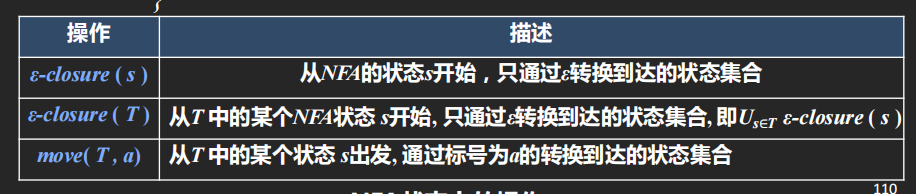
---

## 参考资料

- 浙江大学编译原理课程：https://rainoftime.github.io/
- 虎书：Modern Compiler Implementation in C
- 龙书：Compilers: Principles, Techniques, and Tools
- Stanford CS143: http://web.stanford.edu/class/cs143/
- Tarjan's Path Expression Problem (JACM, 1981)
