# 编译原理 Chapter 3：语法分析-CFG及其解析

## 目录

1. [语法分析概述](#1-语法分析概述)
2. [上下文无关文法](#2-上下文无关文法)
3. [设计编程语言的文法](#3-设计编程语言的文法)
4. [自顶向下分析](#4-自顶向下分析)
5. [自底向上分析](#5-自底向上分析)

---

## 1. 语法分析概述

### 1.1 什么是语法分析

语法分析（Parsing）是编译过程的核心阶段之一，负责根据语言的文法规则分析输入的 Token 序列是否能构成一个合法的程序。

!!! example 语法分析器的作用

从词法分析器获得 Token 序列，确认其是否可以由语言的文法生成：
- 对于语法错误的程序，**报告错误信息**
- 对于语法正确的程序，生成**语法分析树**（通常产生的是抽象语法树 AST）


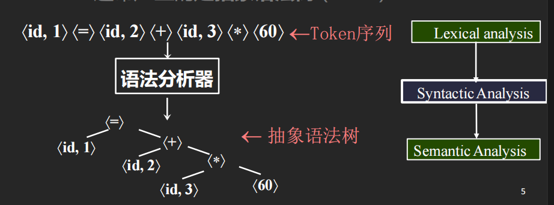
!!!

### 1.2 回顾：语法分析器的作用

语法分析器接收来自词法分析器的 Token 序列，输出抽象语法树（AST）。


!!! example 简单计算器程序

合法：`1 + (2 – 3)`
非法：`1 + 2 – 3 +`（运算符多余）
非法：`1 2 + – 3`（数字相邻）
非法：`1 + 2 – a`（包含标识符）

!!!

### 1.3 如何判定输入合法性 & 生成语法树

1. **首先规定合法的基本单元** 
   - 词法分析
   - Token：如由 0-9 组成的数字(num)和符号 +、-、(、)

2. **其次要理解算术表达式的构成**
   - 大表达式可拆为子表达式
   - 直至看到的都是基本单元：

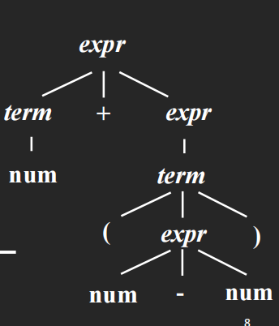

!!! note 提示

语法分析器的构造采用 "声明式规范 + 实现" 的模式：
- **Specification**：使用上下文无关文法（CFG）声明语法
- **Implementation**：语法分析器自动生成器或手写分析器
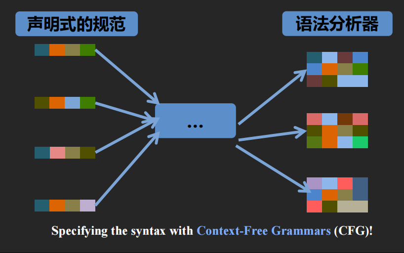
!!!

### 1.4 语法分析器的实现方式

| 方式 | 描述 | 示例 |
|------|------|------|
| **手写`writing manually`（递归下降）** | 手工编写语法分析器 | Clang、GCC (3.4+) |
| **使用语法分析器`parser generator`生成器** | 根据文法自动生成分析器 | Yacc、Bison、ANTLR、OCaml |

---

## 2. 上下文无关文法

### 2.1 CFG 简介

**上下文无关文法**（Context-Free Grammar，简称 CFG）由 John Backus 提出（1977 年图灵奖），是描述编程语言语法的理论基础。

!!! note 约翰·巴科斯（John Backus）

- 提出了多种高级编程语言
- Speedcoding → FORTRAN → ALGOL 58 → ALGOL 60
- 提出了编译技术的理论基础：巴科斯范式（Backus–Naur Form）
- 对计算机科学影响巨大，曾服务于阿波罗登月计划

!!!

### 2.2 上下文无关文法的形式化定义

上下文无关文法 G 是一个四元组：**G = (T, N, P, S)**

- **T**:终结符集合(`Terminals`)
- **N**:非终结符集合(`Non-terminals`)
- **P**：产生式集合(Productions) $A \rightarrow a, A \in N, \alpha \in (T \cup N)^*$
- **S**:开始符号

!!! example 上下文无关文法示例

```
expr → expr op expr
expr → (expr)
expr → - expr
expr → id
op → + | - | * | /
```

- 非终结符集合：N = {expr, op}
- 终结符集合：T = {+, -, *, /, (, ), id}
- 开始符号：expr

!!!

### 2.3 终结符 (Terminals)

终结符是**组成串的基本符号`token`**，一旦生成就不会再改变。

- 例：T = {num, +, -, (, )}
- 终结符应该是语言的 Token

### 2.4 非终结符 (Non-terminals)

非终结符是表示**串的集合**的语法变量，在程序语言中通常对应于某个程序构造。

- 例：N = {expr, term, stmt}
- $T ∩ N = ∅$（终结符和非终结符不相交）
- $T ∪ N$：文法符号集

### 2.5 产生式 (Productions)

产生式描述**如何将终结符和非终结符组合成串**。

```
A → α
```

- 左部 A 是一个**非终结符号**
- 右部 α 是一个**符号串**（可以是空串）

> 右部的这个表达式可以是终结符，也可以是非终结符，也可以是符号串

!!! example 产生式示例

```
E → E + E
E → E * E
E → ( E )
E → id
```

可以简写为：
```
E → E + E | E * E | ( E ) | id
```

其中 `E + E`、`E * E`、`( E )`、`id` 称为 E 的候选式 (Candidate)。

!!!

### 2.6 开始符号 (Start symbol)

开始符号是**唯一指定**的非终结符，它对应的串的集合就是**该文法的语言**。

!!! example 开始符号示例

考虑文法：
```
S → S; S
S → id := E
S → print ( L )
E → id
E → num
E → E + E
L → E
L → L , E
```

- T = {id, print, num, +, (, ), ,}
- N = {S, E, L}
- 开始符号：S

该文法产生的句子：
- `id := num`
- `id := num + num`
- `print ( num )`
- `id := id + (id := num + num, id)`

!!!

### 2.7 EOF 标记

为了表示完整程序后必须结束，通常引入 EOF 标记 `$`,`end of file`。

```
S' → S$
```

!!! example 带 EOF 的文法

```
E → E + T | T
T → T * F | F
F → id
F → num
F → (E)
```

增加开始符号`S'`并添加产生式`S' → E$`

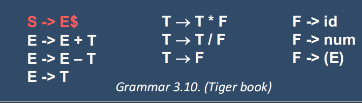

!!!

---

## 3. 推导和归约

### 3.1 直接推导与直接规约

给定文法 G = (T, N, P, S)：

- **直接推导**：如果 $A → γ ∈ P，且 α, β ∈ (T ∪ N)^*$，则 `αAβ ⇒ αγβ`
  - 把产生式看成重写规则，把符号串中的**非终结符**用其**产生式右部的串**来代替

- **直接规约**：如果 `αAβ ⇒ αγβ`，则 `αγβ` 直接规约到 `αAβ`

> 二者是一个互逆的过程

### 3.2 多步推导

- **正数步推导**：$α₀ ⇒⁺ αₙ$ 表示经过正数步推导
- **若干步推导**：$α₀ ⇒* αₙ$ 表示经过若干（可以是 0）步推导

### 3.3 最左推导 (Left-most Derivation)

每步代换**最左边的非终结符**。

!!! example 最左推导

文法：
```
① E → E + E
② E → E * E
③ E → ( E )
④ E → id
```

输入：`id + ( id + id )`

推导过程：
```
E ⇒ E + E
  ⇒ id + E
  ⇒ id + ( E )
  ⇒ id + ( E + E )
  ⇒ id + ( id + E )
  ⇒ id + ( id + id )
```

- 如果 `S ⇒* α`，则称 α 是当前文法的**最左句型** (left-sentential form)
- 在**自顶向下**的分析中，**总是采用最左推导的方式**

!!!

### 3.4 最右推导 (Right-most Derivation)

每步代换最右边的非终结符。

!!! example 最右推导

输入：`id + ( id + id )`

推导过程：
```
E ⇒ E + E
  ⇒ E + ( E )
  ⇒ E + ( E + E )
  ⇒ E + ( E + id )
  ⇒ E + ( id + id )
  ⇒ id + ( id + id )
```


!!!

- 在**自底向上**的分析中，总是采用最左归约的方式

!!! note 
**最右推导和最左归约实际上是一个等价的过程**
!!!

### 3.5 句型、句子和语言

| 概念 | 定义 |
|------|------|
| **句型** (Sentential form) | 如果 $S ⇒* α，α ∈ (T ∪ N)*$，则称 α 是 G 的一个句型 |
| **句子** (Sentence) | 如果 $S ⇒* w，w ∈ T*$，则称 w 是 G 的一个句子（不含非终结符） |
| **语言** L(G) 文法G推导出的所有句子构成的集合 $L(G) = {w | S ⇒* w, w ∈ T*}$ |

!!! example 句型和句子

考虑文法：`E → E + E | E * E | (E) | -E | id`

推导序列：`E ⇒ -E ⇒ -(E) ⇒ -(E+E) ⇒ -(id+E) ⇒ -(id+id)`

1. `-(id + id)` 是文法的**句子**
2. `-(id + E)` 是文法的**句型**

!!!

### 3.6 思考：上下文无关的含义

"上下文无关" 意味着：
$$
a A b ⇒ a γ b
$$

- $A → γ$ 是文法中的一个产生式
- 在文法推导的每一步，符号串 $γ$ 仅依据 A 的产生式推导，**无需依赖 A 的上下文 a 和 b**

!!! question "给定文法，如何判断输入串是否属于文法规定的语言"
- 句子的**推导**(派生) → 从生成语言的角度
  - 从开始符号能够推导出该串
- 句子的**归约** → 从识别语言的角度
  - 从串能归约出开始符号

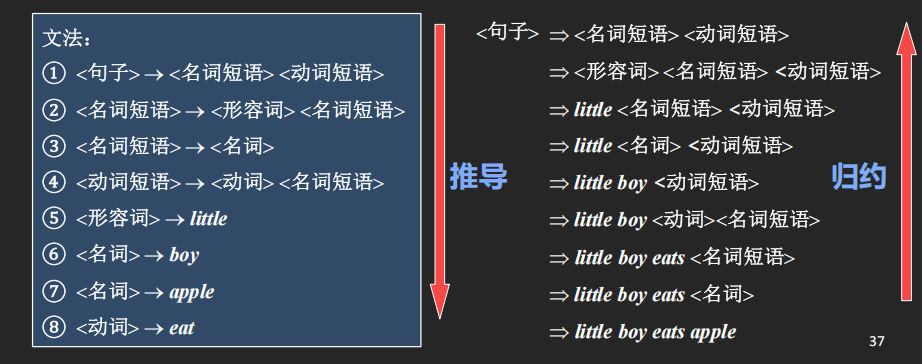
!!!

---

## 4. 分析树 (Parse Tree)

### 4.1 分析树的性质

分析树是推导的图形化表示，具有以下性质：

- **根节点**：文法的开始符号
- **叶子节点**：终结符
- **内部节点**：非终结符
- **父子关系**：每个父节点及其子节点构成一条**产生式**

!!! example 分析树构造

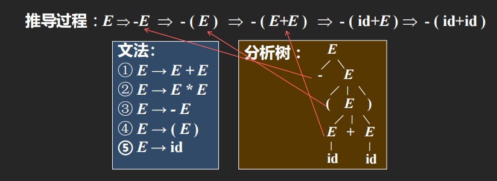
!!!

### 4.2 练习：Parse Tree 构造

!!! example Parse Tree 构造练习

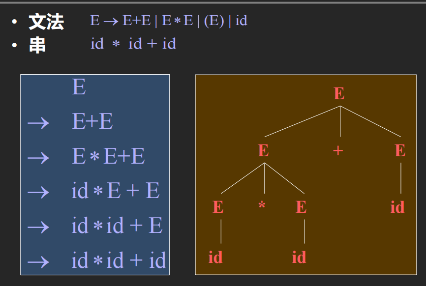

文法：
```
expr → term | term + expr | term - expr
term → num | (expr)
```

输入：`1 + (2 – 3)`

构造 Parse Tree：
```
       expr
       /  \
     term   +   expr
      |         / | \
     num       ( expr )
      1           |   
              term - expr
                |      |
                2     term
                       |
                       3
```

!!!

---

## 5. 语法分析的复杂度

### 5.1 语法分析作为搜索问题

对于一个终结符号串 x：
- **从生成语言的角度**：从 S 推导出 x（推导）
- **从识别语言的角度**：从 x 归约到 S（归约）

### 5.2 时间复杂度

| 文法类型 | 时间复杂度 |
|----------|------------|
| 任意 CFG | O(n³) — 如 CYK 算法 |
| LL(1) 文法 | O(n) — 预测分析 |
| LR(1) 文法 | O(n) — 移位-归约分析 |


!!! note 提示

为了实现高效搜索，需要对编程语言的文法进行限制，控制搜索空间。

!!!

### 5.3 语法分析算法分类

| 分类 | 方向 | 代表算法 |
|------|------|----------|
| **自顶向下** (Top-down) | 从 S 出发推导出 x | LL(k) |
| **自底向上** (Bottom-up) | 从 x 归约到 S | LR(k) |

- 自顶向下：Parse Tree 从根部开始构造
- 自底向上：Parse Tree 从叶子开始构造

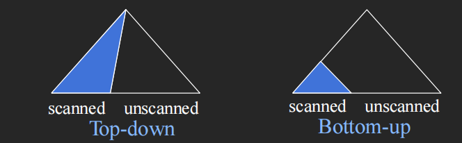

---

## 6. 设计编程语言的文法

### 6.1 对比 RE 和 CFG

| 层次 | 规约方式 | 表达能力 |
|------|----------|---------|
| 词法分析 | 正则表达式 (RE) | 正则语言 |
| 语法分析 | 上下文无关文法 (CFG) | 上下文无关语言 |

**正则语言 ⊂ 上下文无关语言**

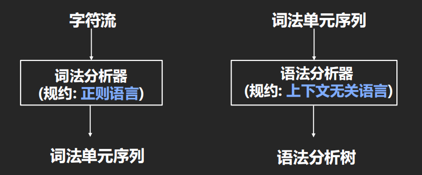

!!! warning 注意

正则语言表达能力有限，难以刻画编程语言的语法。例如：
- **配对括号串**：无法用正则表达式描述 `(ⁿ)ⁿ，n≥1`
- 原因：有穷自动机无法记录访问同一状态的次数

!!!

### 6.2 正则语言 vs 上下文无关语言

!!! note "正则文法"
$$
G=(T,N,P,S)
$$

- $T$:终结符集合
- $N$:非终结集合
- $P$:产生式集合
  - **右线性文法**：$\alpha → \beta$形如$A → aB$或`A → a`，其中 $A,B ∈ N$
  - **左线性文法**：$\alpha → \beta$形如`A → Ba`或`A → a`，其中 $A,B ∈ N$
- $S$:开始符号

正则语言就是右线性文法/左线性文法产生**所有句子的集合**
!!!

- **正则文法**（右线性）：`A → aB` 或 `A → a`
- **上下文无关文法**：`A → α`（左部是非终结符，右部是符号串）

!!! note 形式文法的分类 (Chomsky)

| 类型 | 名称 | 产生式形式 |
|------|------|------------|
| 0 型 | 短语结构文法 | α → β，|α| ≥ 1 |
| 1 型 | 上下文有关文法 | \|α\| ≤ \|β\| |
| 2 型 | 上下文无关文法 | A → β，A ∈ N 的|
| 3 型 | 正则文法 | A → aB 或 A → a |

!!!

### 6.3 文法的改造/限制

为了高效语法分析，可能需要对文法做以下处理：

| 处理方式 | 目的 | 适用场景 |
|----------|------|----------|
| **消除二义性** | **消除同一句子的多棵分析树** | 所有分析器 |
| **消除左递归** | 避免自顶向下分析无限循环 | LL 分析 |
| **提左公因子** | 避免回溯 | LL 分析 |

> 二义性：如果文法的某些句子存在不止一棵分析书，则该文法是二义的，或者说：若一个文法中存在某个句子，它有**两个不同的最左或最右推导**，则这个文法是二义性的 

### 6.4 二义性文法 (Ambiguous Grammar)

如果文法的某些句子存在不止一棵分析树，则该文法是**二义性**的。

!!! example 二义性文法示例

文法：`E → E + E | E * E | (E) | -E | id`

输入：`id * id + id`

存在两个不同的最左推导：
```
E ⇒ E * E         E ⇒ E + E
⇒ id * E         ⇒ E * E + E
⇒ id * E + E     ⇒ id * E + E
⇒ id * id + E    ⇒ id * id + E
⇒ id * id + id   ⇒ id * id + id
```

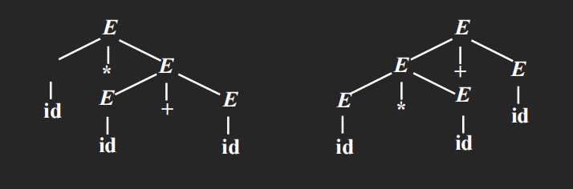

!!!

### 6.5 二义性的影响

编程语言的文法应该是**无二义性**的，否则会导致一个程序有多种"正确"的解释。

!!! example 二义性导致错误

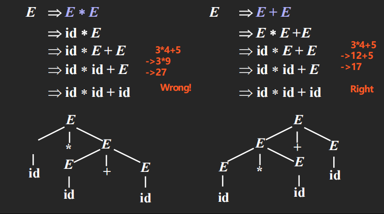
!!!

### 6.6 消除二义性

二义性的根源：多种"正确"推导处于文法同一层，没有区分优先级和结合性。

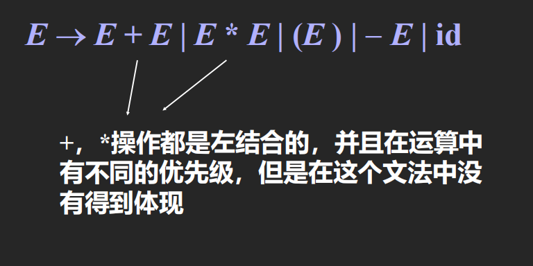

**消除二义性的方法：分层**

1. **规定符号的优先级**：
  - 根据算符不同的优先级，引入新的非终结符
  - 越接近开始符号S的文法符号优先级越低
2. **规定符号的结合性**：
   -  递归非终结符在终结符左边，运算就左结合
   -  如$A \rightarrow A \beta$,A在终结符(如+，*)左侧出现()

!!! example 消除二义性

二义性文法：
```
E → E + E | E * E | (E) | id
```

无二义性文法（引入优先级和结合性）：
```
E → E + T | T
T → T * F | F
F → (E) | id
```

- `*` 比 `+` 优先级高（F → T → E）
- `+` 和 `*` 都是左结合（递归在左边）

!!!

### 6.7 悬空 else 问题

!!! example 悬空 else 文法

```
E → if E then E
   | if E then E else E
   | OTHER
```

输入：`if E then if E then E else E`

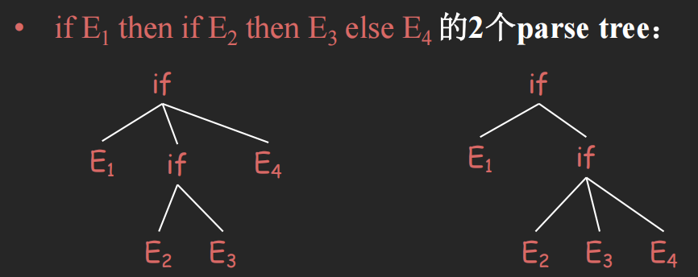

**消除方法**：区分 matched 和 unmatched then

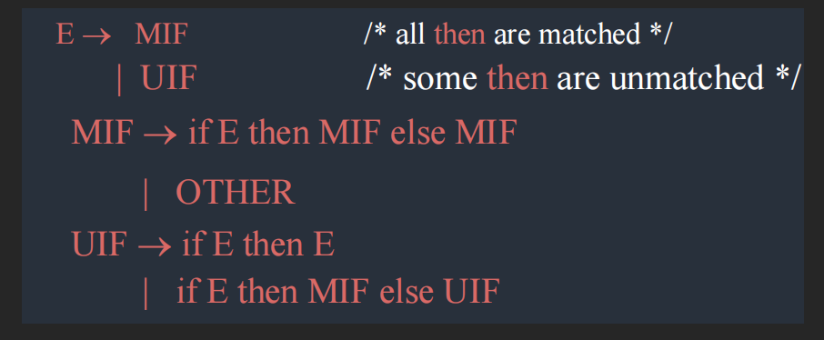

!!!

### 6.8 优先级和结合性声明

大多数语法分析器生成器（如 Yacc、Bison）允许直接指定优先级和结合性，无需手动重写文法。

!!! note 提示

- 使用更自然的（可能有二义性的）文法
- 配合优先级、结合性声明来消歧

!!!

---

## 4. 自顶向下分析

### 4.1 递归下降分析概述

#### 4.1.1 自顶向下语法分析

自顶向下语法分析从文法开始符号 S 推导出串 w，分析树的构造方法：从根部开始。

- 从上往下、从左往右
- 每一步推导中，都需要做两个选择：
  1. **替换**当前句型中的**哪个非终结符**？
  2. 用该**非终结符的哪个产生式**进行替换？

!!! tip 提示

**自顶向下分析总是选择每个句型的最左非终结符进行替换！**

!!!

!!! example

**文法**

```
S → E+S | E
E → num(S)
```

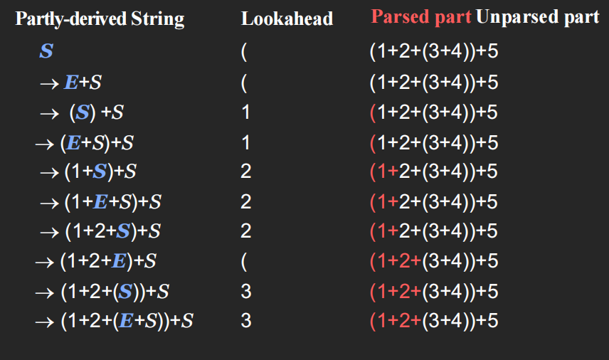

!!!

#### 4.1.2 递归下降分析

**递归下降分析**（Recursive-Descent Parsing）是自顶向下分析的通用形式：

- 由一组**过程/函数**组成，每个过程对应一个**非终结符**
- 从开始符号 S 对应的过程开始，（递归）调用其它过程
- 如果 S 对应的过程**恰好扫描了整个输入串**，则完成分析

- 利用非终结符A的规则$A\rightarrow X_1...X_k$，定义识别A的过程
  - **如果$X_i$是非终结符**：调用相应非终结符对应的过程
  - **如果$X_i$是终结符**：**匹配**输入串种对应的终结符

```c
void A() {
    选择一个A产生式，A→X1 X2 ... Xk
    for (i = 1 to k)
        if (Xi 是非终结符) 
            调用过程 Xi();
        else if (Xi 等于当前的输入符号a) 读入   
            下一个输入符号;
        else /* 发生了一个错误 */
}
```

!!! tip
如果选择了不合适的产生式，可能需要回溯
!!!

> 后续会给出相应的代码实现例子

#### 4.1.3 回溯问题

递归下降分析的主要问题是**回溯**：

> **复杂的回溯会造成极高的代价**

- 非终结符有可能有多个产生式，由于信息缺失，**无法准确预测选择哪一个**
- 考虑到往往需要对多个非终结符进行推导展开，**因此尝试的路径可能呈指数级爆炸**(理论上可能要尝试一棵树的所有分支)
- 其分析过程类似于 NFA(本质上也是一棵树$$)

!!! example 需要回溯的文法

考虑文法：`S → cAd`，`A → ab | a`

输入串：`w = cad`

构造分析树时需要回溯：
1. 首先尝试 A → ab，发现不匹配
2. 然后回溯尝试 A → a，成功匹配

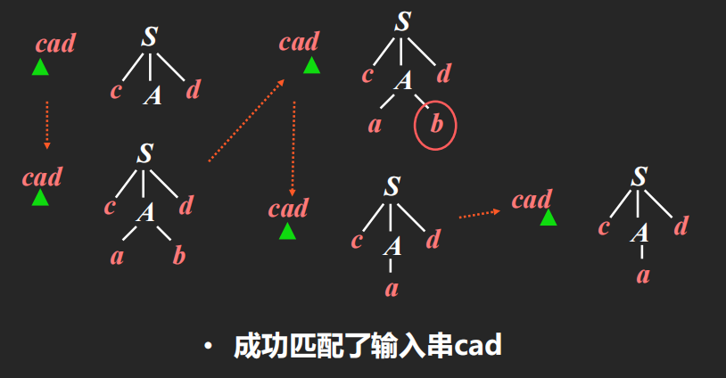

!!!

### 4.2 LL(1) 和预测分析法

#### 4.2.1 预测分析法的定义

**预测分析法**（Predictive Parsing）此方法接受 LL(k) 文法！

- **L**: "left-to-right" **从左到右扫描**
- **L**: "leftmost derivation" **最左推导**
- **k**: **向前看 k 个 Token 来确定产生式**（通常 k=1）

每次为最左边的非终结符号选择产生式时，向前看 1 个输入符号，预测要使用的产生式。

!!! note "一个形象的例子"

我们怎么用一个形象的例子去解释这个`LL(k)`语法呢

- 输入串：在餐厅点餐的句子
- 文法：餐厅的点餐规则
- 语法分析器：服务员
- `k`:服务员需要听你说几个词才能确定你点的是什么

**最简单的情况：LL(1)文法**

假设餐厅只有两种套餐

- 套餐A：可乐+汉堡
- 套餐B：橙汁+薯条

文法：

```
套餐 → 可乐 汉堡 | 橙汁 薯条
饮料 → 可乐 | 橙汁
主食 → 汉堡 | 薯条
```

- 当你开口说第一个词：「可乐」，服务员立刻能判断你点的是**套餐A**
- 当你开口说第二个词：「汉堡」，服务员知道你点的是**套餐A**
- 只需要听1个词就能确定选择，这就是LL(1)

**LL(2)文法**：

餐厅现在的套餐更新为

- 套餐A：「可乐+汉堡」
- 套餐B：「可乐+薯条」
- 套餐C：「橙汁+鸡块」

```
套餐 → 可乐 汉堡 | 可乐 薯条 | 橙汁 鸡块
饮料 → 可乐 | 橙汁
主食 → 汉堡 | 薯条 | 鸡块
```

- 当我们开口说「可乐」
    - 服务员只听这一个词，**无法确定**你是要套餐A，还是套餐B
    - 必须再听你说第二个词
        - 如果我们说「汉堡」，**确定**你点的是**套餐A**
        - 如果我们说「薯条」，**确定**你点的是**套餐B**

这种存在必须 **看第二个输入符号**才能确定选择的文法，就是LL(2)
!!!

#### 4.2.2 First 集和 Follow 集

##### 1.1 First 集

**First 集**：可从 α 推导得到的串的**首个终结符**的集合

$$
First(α) = \{a | α ⇒^* a..., a ∈ T\}
$$

- **Base case**: If X is a terminal: First(X) = {X}
- **Inductive case**:

```c
if X → Y1Y2...Yn{
    First(X) ∪= First(Y1) //也就是说First(Y1)是First(X)的子集
    if Y1 ∈ Nullable{
        First(X) ∪= First(Y2)
    }
    if Y1,Y2 ∈ Nullable{
        First(X) ∪= First(Y3)
    }
}
```

> 上述规则看起来似乎是关于非终结符的，但是First是关于文法符号串α(如产生式右部)的，规则如inductive case

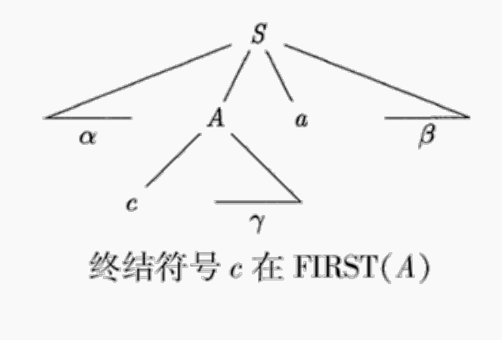

**Follow 集**：从 S 出发，可能在推导过程中**跟在 A 右边的终结符号集**

$$
Follow(A) = \{a | S ⇒^* ...Aa...，a∈T\}
$$

- **Base case**: 初始化为空
  - Follow(A) = {}
- **Inductive case**:

```c
if B → s1 A s2 for any s1 and s2{
    1. Follow(A) ∪= First(s2)
    2. if s2 is Nullable, Follow(A) ∪= Follow(B)
}
```

> 关于第2种情况，假设$S ⇒^* ...Bb..., b \in Follow(B)$
> - 用s1As2替换B后：$S ⇒^* ...s_1As_2...$
> - 由于s2是Nullable，因此b也属于Follow(A)


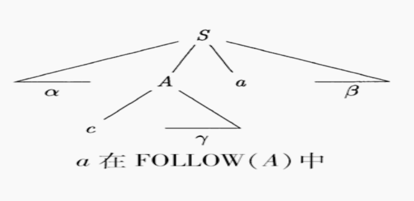

Follow集的归纳定义是一般情况，对于一些特殊的产生式，可能可以运用简单的推论，比如

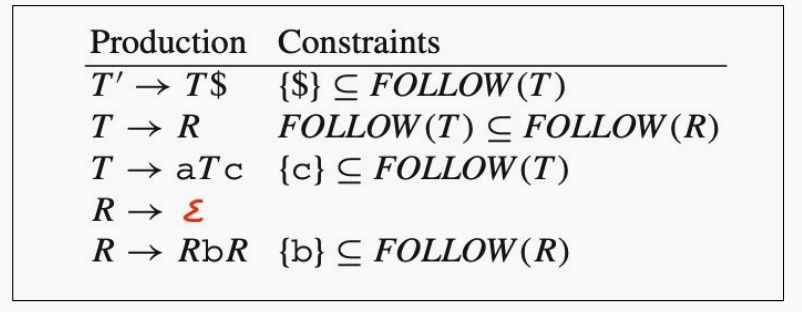

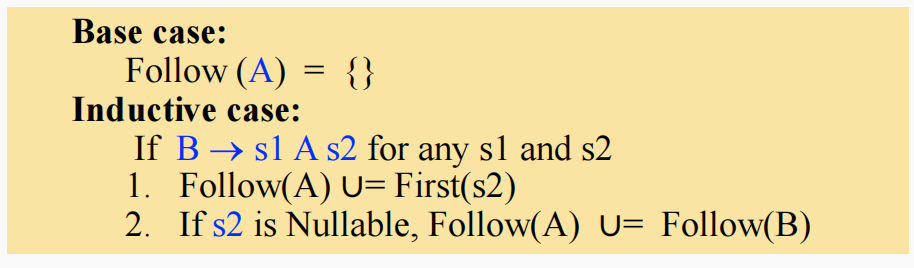

#### 4.2.3 Nullable 集（可空集）

如果 X 可以推导**空串**，则 X 是 Nullable 的。

- **Base case**: X → ε，则 X ∈ Nullable
- **Inductive case**: X → Y₁Y₂...Yₙ，如果所有 Yᵢ ∈ Nullable，则 X ∈ Nullable

> $X \rightarrow ^* ε$，则 X ∈ Nullable

**通过迭代的方法计算Nullable集**

```c
Nullable <- {}
while(Nullable still changes){
    for (each production X → α)
    {
        switch(α)
        case ε:
            Nullable ∪ {X};
            break;
        case Y1 ... Yn:
            if (Y1 ∈ Nullable && ... && Yn ∈ Nullable){
                Nullable ∪ {X};
            }
            break;
    }
}
```


!!! example 计算 Nullable, First, Follow 集

文法：
```
Z → d
Y → c | ε
X → Y | a
Z → XYZ
```

**为了知道每个产生式的第一个可能会出现的终结符**，我们需要计算First, Nullable, Follow 集

计算过程：

**Nullable集**

1. 初始化为false(或者说Nullable集合为空)

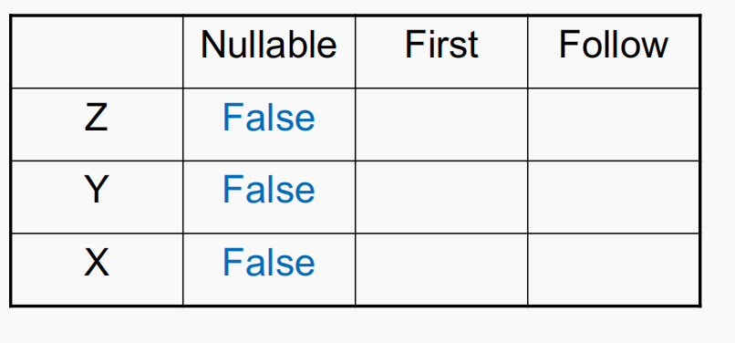

2. 由于$Y → ε$，所以$Nullable \cup = {Y}$

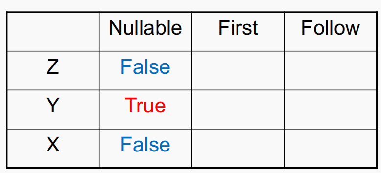

3. 由于$X → Y$，所以$Nullable \cup = {X}$(Inductive case)

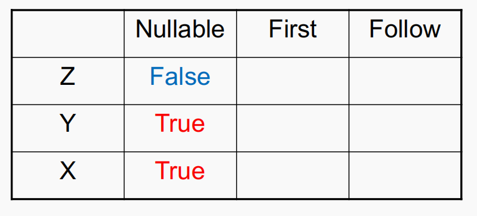

4. 由$Z → XYZ$确认，这里我们要停止迭代

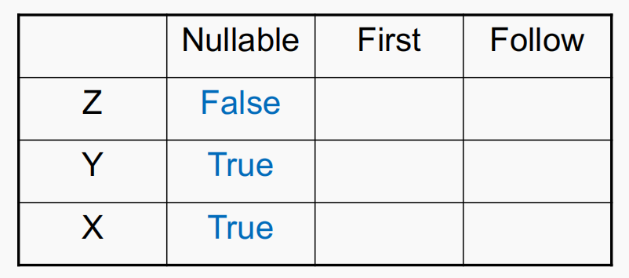

**First集**

1. 初始化First集

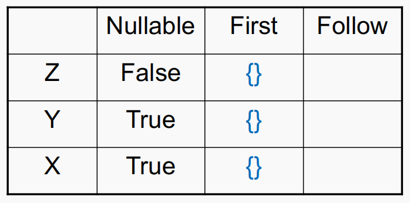

2. 找到所有Base case

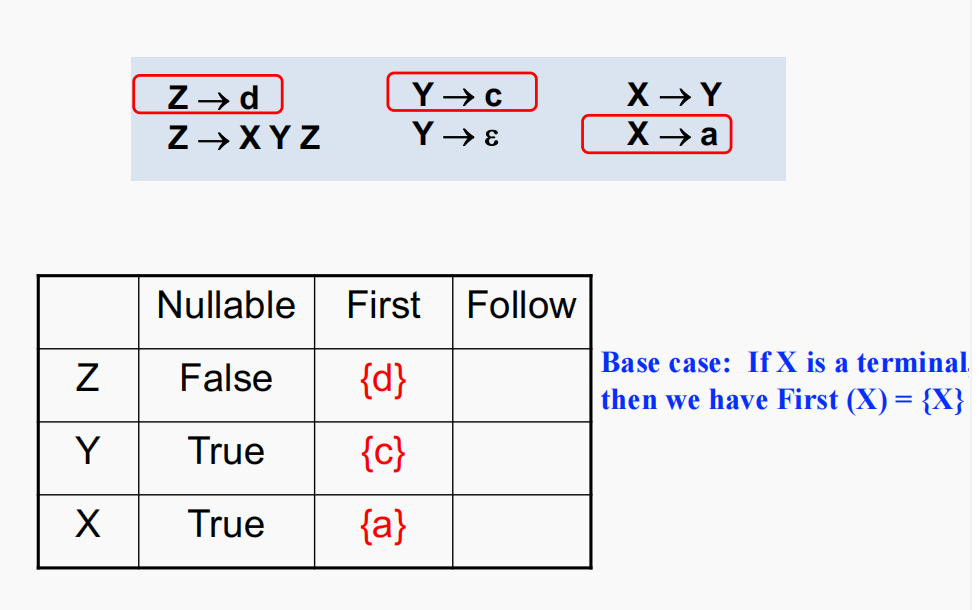

3. 考虑Inductive case,也就是所有产生式右侧出现非终结符的情况

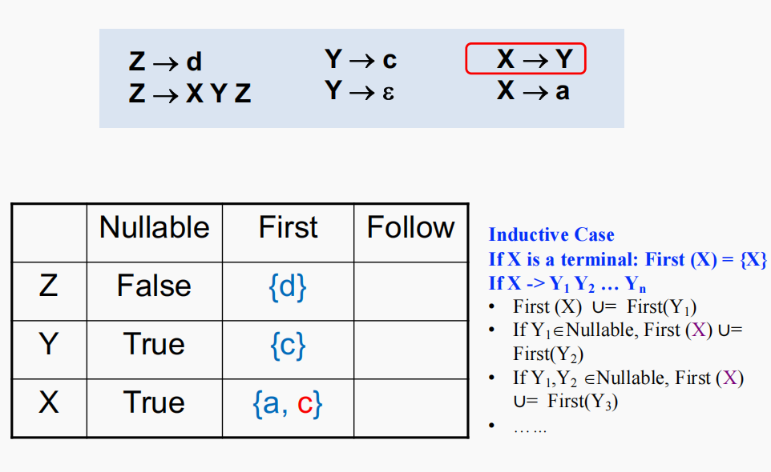
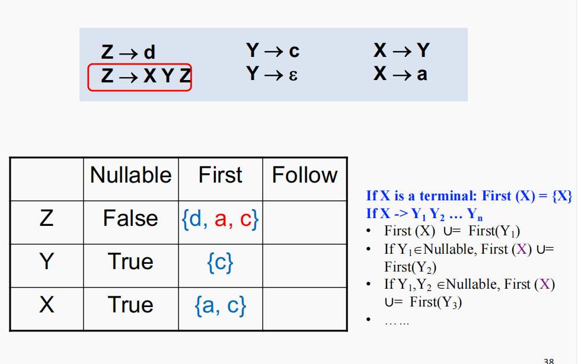

4. 继续迭代直到不会产生任何变化


**Follow集**

1. 初始化Follow集为空

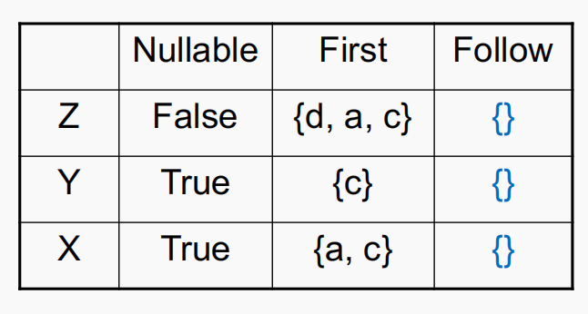

2. Indective Case的两种情况

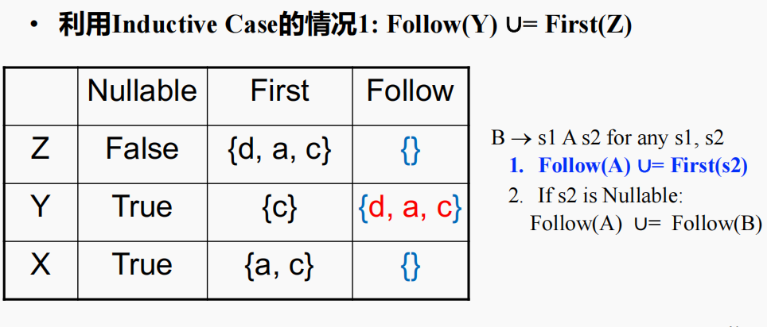
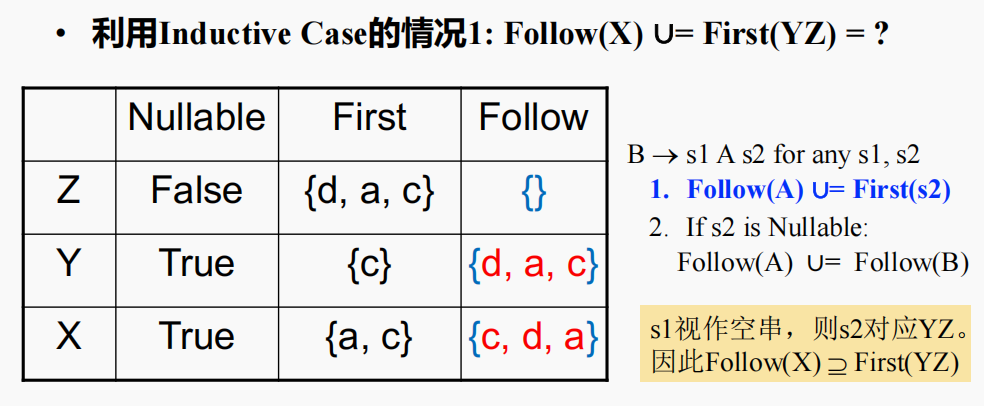

!!!

#### 4.2.4 LL(1) 文法的定义

预测分析器(自顶向下)在展开非终结符A时，只看 **当前一个输入符号**就必须**唯一确定选哪条产生式**

文法 G 的任何两个产生式 A → α | β 都满足下列条件：

1. **First(α) ∩ First(β) = ∅**
   - α 和 β 推导不出以同一个单词为首的串

    **意义**：假设下一个输入是b，且$First(\alpha)$和$First(\beta)$不相交

    - 若$b\in First(\alpha)$,则选择$A \rightarrow \alpha$
    - 若$b\in First(\beta)$,则选择$A \rightarrow \beta$

2. **若 $β ⇒^* ε$，则 $α ⇒^* ε$，且 First(α) ∩ Follow(A) = ∅**
   - α 和 β 不能同时推出 ε
   - First(α) 不应在 Follow(A) 中

    **意义**：假设下一个输入是b，且$\beta ⇒* ε$

    - 如果$b\in First(\alpha)$,则选择$A \rightarrow \alpha$
    - 如果$b\in Follow(A)$,则选择$A \rightarrow \beta$，因为最终达到了$\epsilon$且后面跟着b

    **场景推演**
    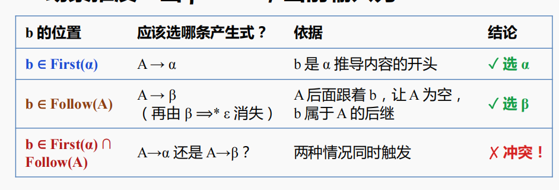

!!! note "Follow(A)的直觉"
- **Follow(A)=**在所有句型中，紧跟在A后面出现的 **终结符**的集合
- 当选择$A \rightarrow \beta \text{ and } \beta \Rightarrow ^* \epsilon$时，A相当于不产生任何内容，接下来读到的就是Follow(A)中的符号
- 条件2.1保证：能触发$A \rightarrow \alpha$和$A \rightarrow \beta$(消失)的符号集合没有交集
!!!

以上条件可以保证产生式选择的唯一性。

#### 4.2.5 预测分析表的构造

##### 预测分析表的结构

预测分析表是一个二维表：
- **行A**：对应一个**非终结符**
- **列a**：对应某个**终结符或输入结束符 $**
- **项(A,a)**:针对非终结符为A，当下一个输入Token为a时，可选的产生式

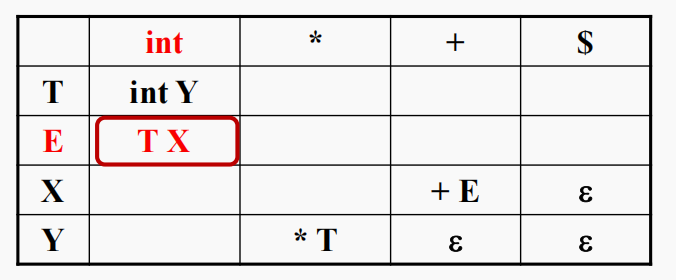

!!! example "`[E,int]`"
当现在的非终结符是E并且下一个输入是`int`时，我们使用产生式`E → TX`
!!!

##### 构造规则

对于文法G的每个产生式$X → γ$

- 若 $t ∈ First(γ)$，则将产生式 $X → γ$ 填入表项 `M[X, t]`(M行t列)
- 若 $γ$ 是 Nullable 且 $t ∈ Follow(X)$，则将产生式 X → γ 填入表项 `M[X, t]`

!!! example 预测分析表构造

文法：
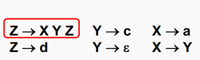

Nullable,First,Follow Set

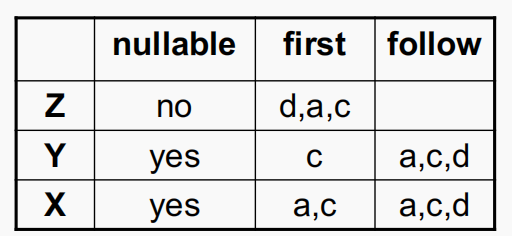

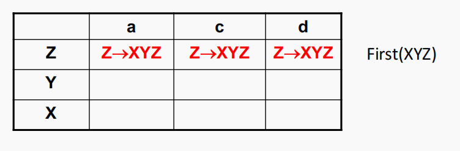
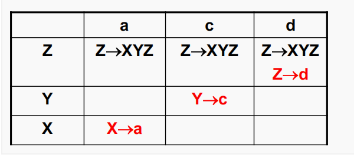
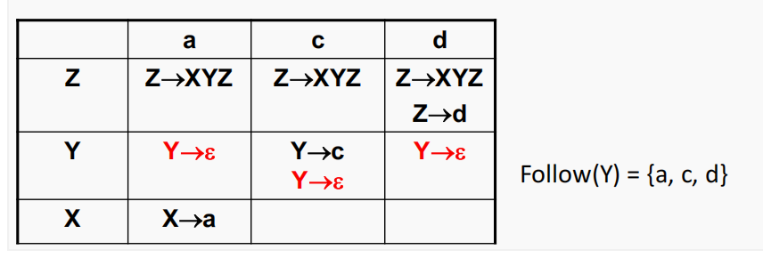
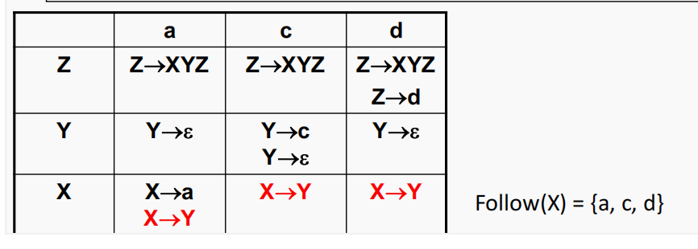

**上表中，存在某一个表格中有两个语法规则**，这就可以说明上面的文法**不是LL(1)文法**
!!!

**LL(1)文法的另一种定义**：如果按这种方式构造的预测分析表(`predivitive parsing table`)中**不存在冲突项**，那么该文法就被称为LL(1)文法

#### 4.2.5 LL(1) 预测分析的实现

**非递归实现**：使用显式的栈，而不是递归调用完成分析。

```python
# 伪代码
stack.push($); stack.push(S);
a = input.read();  # lookahead

while True:
    X = stack.peek();
    if X == a and a == $: return SUCCESS;
    elif X == a and a != $:
        stack.pop(X); a = input.read();
    elif X != a and X ∈ N and M[X, a] not empty:
        stack.pop(X);
        stack.push(M[X,a]);  # 逆序压栈
    else: ERROR!
```

**栈的作用**：Stack：用于追踪推导过程中待处理事项

- 若栈顶是非终结符X，利用预测分析表，选择产生式$X → \alpha$
- 若栈顶是终结符a:栈顶记号a和输入中的Token匹配的话，pop掉并读入下一个lookahead符号

**递归实现**：递归下降分析，每个非终结符对应一个函数。


### 4.3 文法改造

**LL(1)文法有一些明显的性质**

- LL(1)文法是无二义的
- LL(1)文法是无左公因子的
- LL(1)文法无左递归的

> 除了利用LL(1)文法的定义外，有时也可以利用这些性质判定某些文法不是LL(1)的

#### 4.3.1 提左公因子

**左公因子**（Left Factoring）：同一非终结符的多个候选式**存在共同前缀**，可能导致回溯。

很明显这违背了`First`原则

**提左公因子**的方法：
```
原始：P → αβ | αγ
改造：P → αQ
       Q → β | γ
```

其中 Q 是新增加的非终结符。

通过改写产生式来 **推迟决定**，等读入了足够多的输入，获得足够信息后再做选择

#### 4.3.2 消除左递归

**左递归**（Left Recursive）：

- 如果一个文法中有非终结符号 A 使得 $A ⇒⁺ Aα$，那么这个文法就是左递归的。
- $S \rightarrow Sa|b$(直接/立即左递归)

!!! question "递归下降分析可能进入无限循环"
- 如考虑`baaaa`
- 最左推导:$S \Rightarrow Sa \Rightarrow Saa \Rightarrow Saaa ...$

**解决思路**：限制文法或者进行文法变换
!!!

##### 消除直接左递归：


原始：$A → Aα | β$（其中 $α ≠ ε，β$ 不以 A 开头）

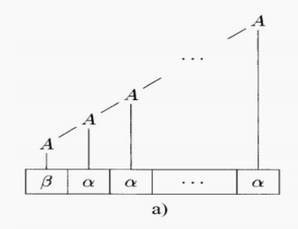

改造：(**把左递归转成右递归**)

$A → βA'$
    
$A' → αA' | ε$

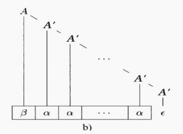

- 观察：由A生成的串以某个$\beta$开头，然后跟上零个或者多个$\alpha$

### 4.4 错误恢复

#### 4.4.1 为什么错误恢复很重要

**编译器的错误处理**：
- **词法错误**，如标识符、关键字或算符的**拼写错误**
- **语法错误**，如算术表达式的**括号不配对**
- **语义错误**，如算符作用于不相容的运算对象
- …

**错误处理的基本目标**：
1. 清楚而准确地报告错误的出现，并尽量少伪错误
2. 迅速地从错误中恢复过来，以便诊断后面的错误
3. 不应该使正确程序的处理速度降低太多

!!! example Good Compiler UX vs Bad Compiler UX

**Bad Compiler UX（差的用户体验）**：
```
$ cc foo.c
recompile →
error: expected ')' on line 4
discover next error
1 error. Fix and recompile.
→ repeat…
```

> 只能给出一个错误

**Good Compiler UX（好的用户体验）**：
```
$ cc foo.c
User sees all
error: expected ')' on line 4
errors at once
error: expected ';' on line 6
→ faster edit-
error: undeclared 'z' on line 9
compile cycle.
3 errors
```

> 编译器在一次运行中就发现了所有错误。它没有在第一个错误后停止——而是恢复并继续解析。

!!!

#### 4.4.2 预测分析中的错误来源

回顾：预测分析器使用表 `M[A, t]`，由非终结符 A 和lookahead符号 t 索引。

- **当 parser 查找 M[A, t] 并发现空条目时，检测到错误。**

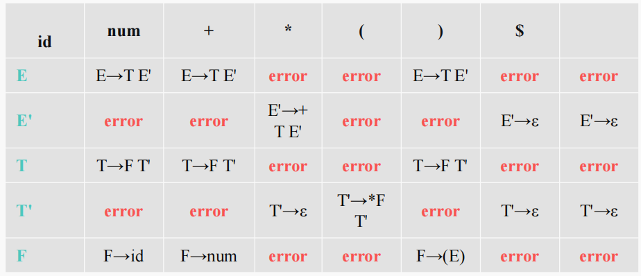

#### 4.4.3 错误恢复策略概述

| 策略 | 描述 | 优点 | 缺点 |
|------|------|------|------|
| **1. 抛出并退出 (Raise & Quit)** | 遇到第一个错误就抛出异常并停止，完全不恢复 | 简单易实现 | 每次编译只出现一个错误；用户体验差 |
| **2. 插入 Token (Insert Tokens)** | 假装期望的 Token 存在，继续正常解析 | 简单 | 可能导致无限循环 |
| **3. 删除 Token (Delete Tokens)** | 跳过输入直到找到 FOLLOW 集中的 token | 一定终止（到达 EOF） | 可能跳过有效代码 |

#### 4.4.4 策略一：抛出并退出 (Raise & Quit)

当 parser 遇到空的表项时，立即停止：

**不稳健且用户体验差！**

```c
void T() {
    switch (tok) {
        case ID:
        case NUM:
        case LPAREN: F(); Tprime(); break;
        default: error!
    }
}
```

- 每次编译只报告一个错误——用户必须反复修复并重新编译
- 不稳健：单个拼写错误会使所有后续分析停止

#### 4.4.5 策略二：插入 Token (Insert Tokens)

**插入**：当 parser 期望 token t 但看到其他东西时，假装 t 存在。打印错误消息，但不消耗任何输入。

```c
void T() {
    switch (tok) {
        case ID:
        case NUM:
        case LPAREN: F(); Tprime(); break;
        default:
            print("expected id, num, or left-paren");
            // don't consume input — just return (pretend we saw a valid T)
    }
}
```

!!! warning 危险：无限循环！

如果 parser "插入"一个 token 并返回，但调用者循环回去并尝试用相同的前看 token 解析相同的非终结符，则 parser 将：

1. 看到相同的意外 token
2. 再次"插入"
3. 再次返回给调用者
4. 永远循环——没有输入被消耗！

**错误检测 → 打印消息并返回 → 调用者重试 T() → 无限循环**
原因：tok ∉ FIRST(T)，没有消耗任何 token，相同的前看 token！

!!!

#### 4.4.6 策略三：删除 Token (Delete Tokens)

**删除（Panic Mode）**：

当检测到错误时，跳过输入 token，直到找到属于当前非终结符 FOLLOW 集的 token。然后返回，让调用者继续。

```c
int Tprime_follow[] = {PLUS, RPAREN, EOF};

void skipto(int follow[]) {
    while (!member(tok, follow) && tok != EOF) {
        tok = nextToken();  // discard unexpected tokens
    }
}

void Tprime() {
    switch (tok) {
        case PLUS: break;
        case TIMES:
            eat(TIMES); F(); Tprime(); break;
        case RPAREN: break;
        case EOF: break;
        default:
            print("expected +, *, right-paren, or end-of-file");
            skipto(Tprime_follow);
    }
}
```

##### 为什么 skipto 使用 Follow 集？

- **错误在 A 中**：parser 在 A 内部失去跟踪
- **FOLLOW(A) 提供安全的同步点**
- FOLLOW(A) 中的 token 可以合法地出现在 A 之后
- 到达 FOLLOW(A) 意味着：停止 A 并继续上层

##### 删除策略 vs 插入策略

| 方面 | 插入 Token | 删除 Token |
|------|-------------|------------|
| **机制** | 假装期望的 token 存在 | 跳过到 FOLLOW 集 |
| **消耗输入** | 无 | ≥ 1 个 token |
| **终止** | 不保证 | 保证（到达 EOF） |
| **级联错误** | 更少（保留结构） | 更多（跳过代码≈丢失上下文） |
| **风险** | 无限循环 | 过度跳过 |

!!! note 提示

**工程上可能会组合使用不同策略**

!!!

#### 4.4.7 小结

**递归下降 parser for LL(k) grammars**：
- 计算 nullable、first 和 follow 集合
- 根据这些集合构造解析表
- 检查重复条目，这表示失败
- 从解析表创建 C 程序

**如果 parser 构造失败**：
- 重写文法（提左公因子、消除左递归等）并重试
- 尝试使用其他方法构建 parser

---

## 5. 自底向上分析

!!! note "回顾Top-down parsing"
- LL(1):`left-to-right scan` + `leftmost derivation`
  - 从左向右读程序，最左推导，采用一个前看符号
- 自顶向下分析的优点
  - 直观、符合文法结构
  - 手动构造 or 自动生成
- `LL(1)`分析的局限性
  - 能分析的文法类型受限
!!!

**LR(k) parsing**

- `L`:`left-to-right scanning`自左向右扫描
- `R`:`rightmost derivation in reverse`最右推导的逆
- `k`:向前看的

### 5.1 移进-规约概述(Shift-Reduce)

#### 5.1.1 自底向上分析思想

自底向上分析从串 w 归约为文法开始符号 S。

- **规约**：与某产生式**右部**相匹配的特定子串被替换为**该产生式头部的非终结符**
- 考虑文法 `E → E + (E) | int` 和串 `int + (int) + (int)`
- 两个核心问题：
  - 何时归约(归约哪些符号串)
  - 归约到哪个**非终结符号**

#### 5.1.2 LR分析的一般模式：移进-规约模式

Idea：将字符串分成两部分：`a | b`

- `Right substring`：已处理的符号串（包含终结符和非终结符）
- `Left substring`：尚未检查的输入符号串
- 用 `|` 标记**划分点**

!!! example 移进-规约过程

输入：`int + (int) + (int)`

文法：`E → E + (E) | int`

```
步骤    栈         输入                 动作
1       $          int + (int) + (int)$   移进
2       $int       + (int) + (int)$       规约 E → int
3       $E         + (int) + (int)$       移进
4       $E+        (int) + (int)$         移进
5       $E+(       int) + (int)$          移进
6       $E+(int    ) + (int)$             规约 E → int
7       $E+(E      ) + (int)$             移进
8       $E+(E)     + (int)$               规约 E → E + (E)
...     ...        ...                    ...
最终     $E         $                      接受
```

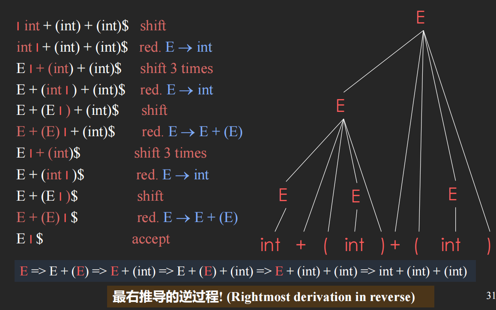
!!!

- 完整版`LR`分析：最右推导的逆过程
  - **限制了归约方式**(类似LL中的最左推导)
- **最右句型**：最右推导过程中出现的句型
  - 每一步都是最右句型

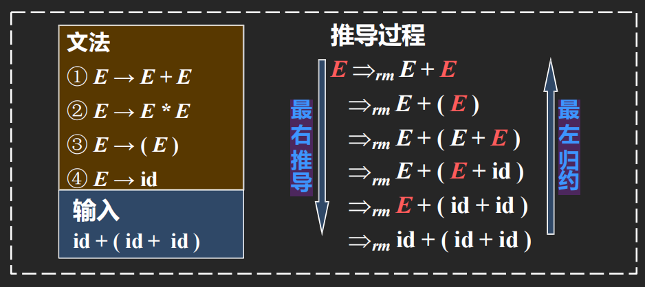

LR 系列分析使用相同的表驱动分析程序：
- **动作表** (Action)：决定是移进、规约、接受还是报错
- **转移表** (Goto)：规约后转移到新的状态

#### 5.1.3 LR分析的视线：基于栈的移进-归约

**LR分析器的两个核心组件**

- **符号栈(Symbol Stack)**:保存已经分析过的左部子串`α`(包含终结符和非终结符)，同时还配套有**状态栈**
- **输入流(Input Stream)**:保存还未处理的剩余剩入`β`(仅包含终结符)

**LR分析器的整体结构**

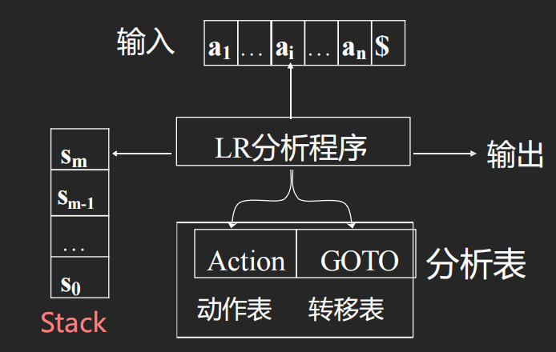

> - LR系列分析器共享 **相同的表驱动分析程序**，不同文法只需要更换对应的分析表(如SLR,LR(1)分析表)
> - 状态栈与符号栈同步变化，用于记录分析过程中的状态

**LR分析器的四种动作**

- **移进(Shift)**:将下一个输入终结符压入栈顶
- **归约(Reduce)**:当符号栈顶的内容匹配某条产生式的右部
  - 从栈顶弹出匹配的右部符号
  - 将该产生式的左部符号压入栈中
- **报错(Error)**:当输入和栈顶状态**无法匹配任何合法动作**时，**触发语法错误**
- **接受(Accept)**:当输入结束符`$`被移进，且占中剩余内容可与归约到文法的 **开始符号**时，分析成功完成

!!! question "核心问题"
When to shift and when to reduce?
!!!

### 5.2 LR(0) 分析

#### 5.2.1 语法分析思路

- **自底向上分析**：不断地凑出产生式`RHS`
- 假设下一次将会用到的产生式为$X \rightarrow \alpha \beta$,使用它进行归约签，**栈顶**可能包含三种情况
  1. 还没有开始匹配这个产生式
  2. 已经匹配了$\alpha$
  3. 已经匹配了$\alpha\beta$

 


!!! question "如何知道栈顶的内容可以归约了"
- 维护一个**状态**，记录当前识别的进度
!!!

**项**(`item`)：一个**产生式**加上在**其中某处的一个点**

- 产生式 A → XYZ 有 4 个项：
  - `A → •XYZ`
  - `A → X•YZ`
  - `A → XY•Z`
  - `A → XYZ•`

- `A → α•β`：已扫描/归约到了 α，并期望在接下来的输入中经过扫描/归约得到 β，然后把 αβ 归约到 A
- `A → αβ•`：已扫描/归约得到了 αβ，可以把 αβ 归约为 A

> **LR(0) Item 类似有穷自动机的状态！**

**状态跳转**

- 一个项读入一个符号后，可变为另一个项
- 如`A → •XYZ`读入`X`变为`A → X•YZ`,类似状态间的跳转

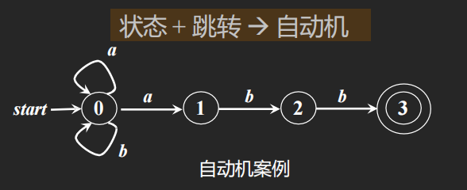

**项状态的数量是有限的**

- 文法产生式是有限的
- 每个产生式右部的长度也是有限的

> 相应的有穷自动机，被称为`LR(0)`自动机

#### 5.2.2 LR(0)语法分析思路

- 自底向上分析：不断地凑出产生式的RHS
- **关键问题**：如何知道栈顶的内容可以归约了
  - 维护一个 **状态**，记录当前识别的进度

!!! example "S→bBB"
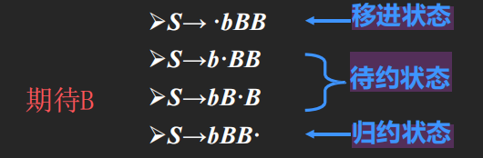
!!!

> LR分析器基于这样一些状态来构造自助机进行RHS识别

#### 5.2.3 LR(0)分析NFA

- 起始&终结状态
  - 文法G中增加 **新开始符号S'**并加入产生式`S' → S$`
  - 按`S' → S$`进行归约：将输入符号串归约成为开始符号(加入S'方便表示起始和终结状态)

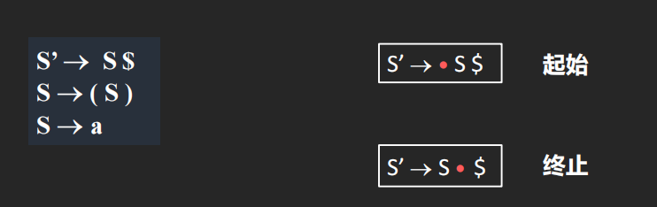

!!! tip
此处的NFA不是指直接用来识别LR(0)语言的自动机(NFA只能识别正则语言)，然而LR(0)语言的自动机(NFA只能识别正则语言，然而LR(0)可以是上下文无关语言)。该NFA是用来"**记录当前识别进度**"的(帮助判断栈顶内容是否可以归约)
!!!

- 状态迁移关系
  - `LR(0) item`之间会有转换关系，如

  1. $X → •\alpha \beta$接收α后变成$X → α•\beta$
  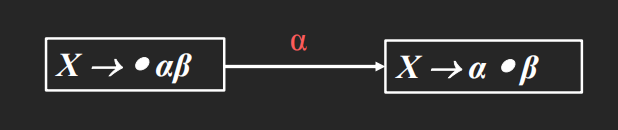
  2. 如果存在产生式$X \rightarrow \alpha Y \beta$以及$Y \rightarrow \gamma$那么$X → αY•\beta$可以转换成$Y → •\gamma$
   

> 简单解释一下2：如果我们想进一步移进，必须要先展开`Y`，看看`Y`具体能推导出什么

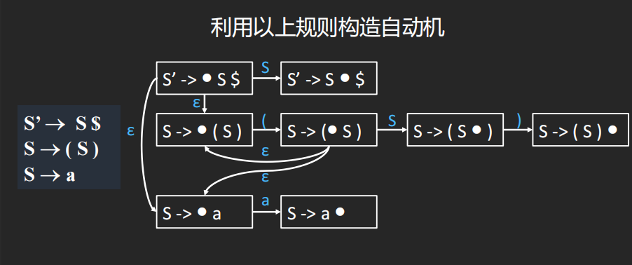

#### 5.2.4 LR(0)分析DFA

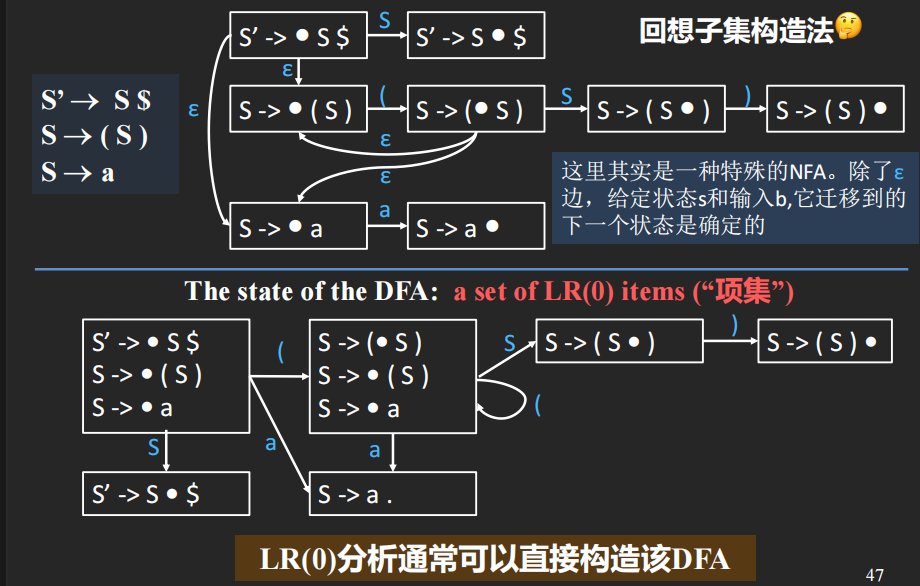

!!! question "如何跳过NFA直接构造以下DFA"
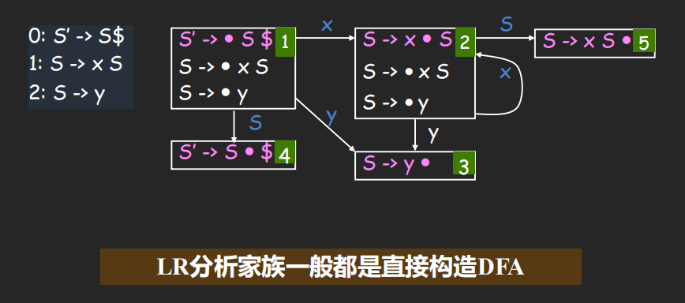
!!!


**项集闭包** (Closure)：

- I是一个项集
- X是一个**文法符号**
- `Goto(I,X)`定义为I中所有形如$A \rightarrow \alpha • X\beta$的项所对应的项$A → αX•β$的集合的闭包

```python
Closure(I):
    repeat
        for any item A → α Xβ in I
            for any production X → γ
                I ← I ∪ {X → •γ}
    until I does not change
    return I
```

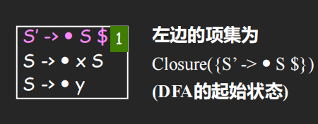

> 类似NFA转化为DFA过程中的$\epsilon-Closure$

**状态转换函数** (Goto)：
```python
Goto(I, X):
    J = {}
    for any item A → α Xβ in I
        J ← J ∪ {A → αX•β}
    return Closure(J)
```

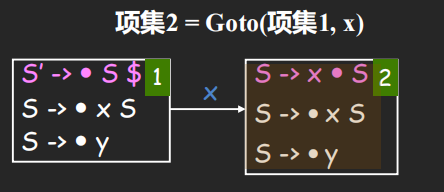

**收敛条件**

- `T`:状态集合
- `E`:`shift` or `goto`边的集合

```python
Initialize T to {Closure({S'→•S$})}
Initialize E to empty
repeat
    for each statr I in T:
        for each item A → α•Xβ in I:
            let J be Goto(I, X)
            T ← T ∪ {J}
            E ← E ∪ {I →(X) J}
    until E and T did not change
```

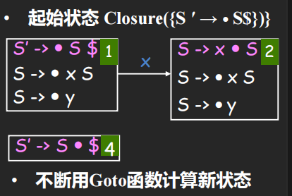

**步骤总结**

1. 计算新状态
2. 存储状态
3. 存储边(转换函数)

!!! example 
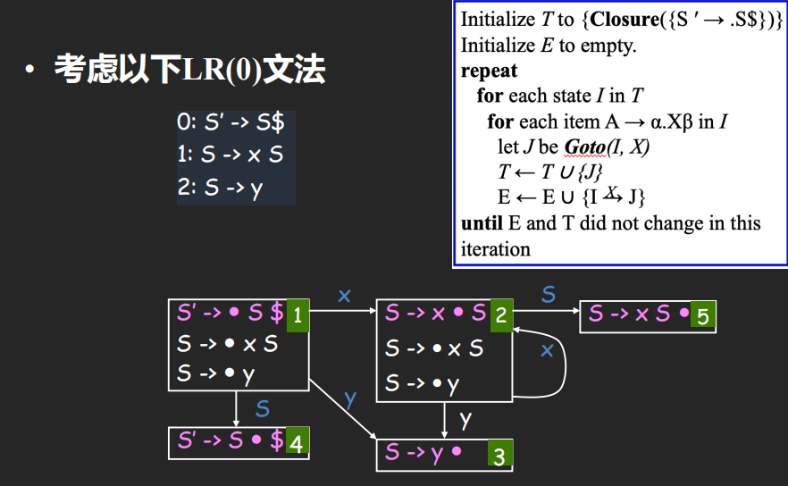
!!!

#### 5.2.5 LR(0) 分析表构造

假设我们已经构造了LR(0)自动机，我们必须要创建`Action`和`GOTO`来指导一下四个动作

1. **移进 (Shift)**：若从状态 i 读入终结符 a 可以转移到状态 j，则 `Action[i, a] = sj`
2. **规约 (Reduce)**：若状态 i 包含项 A → α•，则 `Action[$i, *] = rk`（k 是产生式编号）
3. **接受**：若状态 i 包含项 S' → S•$，则 `Action[i, $] = accept`
4. **Goto**：若从状态 i 读入非终结符 A 可以转移到状态 j，则`Goto[i, A] = j`
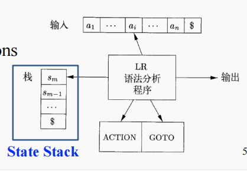

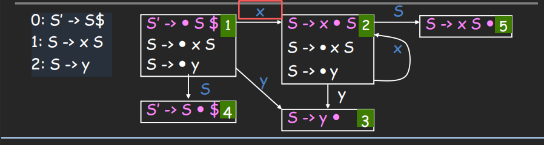
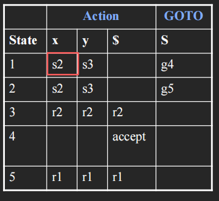

**总结这个有限自动机**

- **Action表的参数**：状态`i`，**终结符号**`A`
  - 告诉分析器：在每个状态下(给定前瞻符号时)该做什么——要么**移进并进入新状态** 要么有某条产生式归约
  - `s_n`表示**移进**到状态`n`
  - `r_n`表示**归约**到初始文法的标号`n`
- **GOTO表的参数**：状态`i`,**非终结符**`A`
  - 告诉分析器：当执行一次归约后(归约产生式左侧的非终结符为A)，应该转移到哪个状态

!!! example 
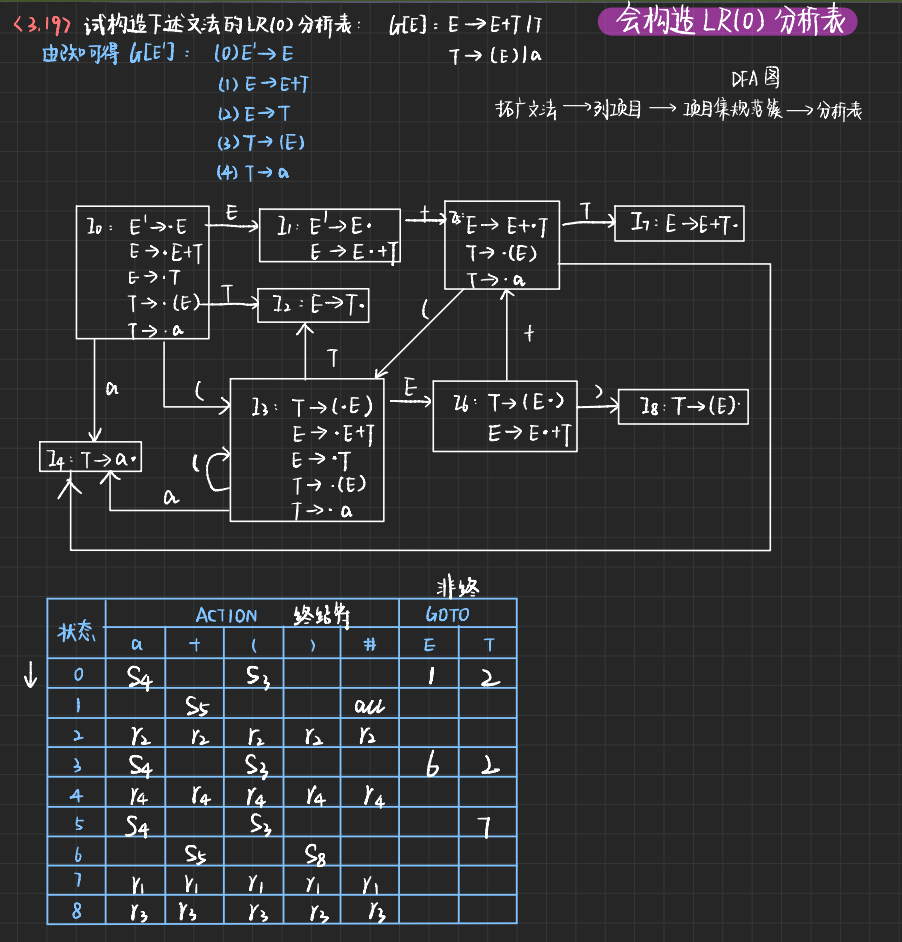
!!!

#### 5.2.4 LR(0) 分析算法

```python
# 输入：LR(0) 分析表，输入串 w
s = 初始状态  # 栈顶状态
a = w$ 的第一个符号

while True:
    if Action[s, a] = "shift s'":
        将 s' 压入栈
        a = 下一个输入符号
    elif Action[s, a] = "reduce A→β":
        弹出 |β| 个状态
        s' = 栈顶状态
        将 Goto[s', A] 压入栈
    elif Action[s, a] = "Accept":
        break
    else:
        error()
```

#### 5.2.5 LR(0) 的局限性

LR(0) 的问题：**没有 Lookahead**，不能查看下一个输入符号。

这会导致**移进-规约冲突**和**规约-规约冲突**。

!!! example LR(0) 冲突

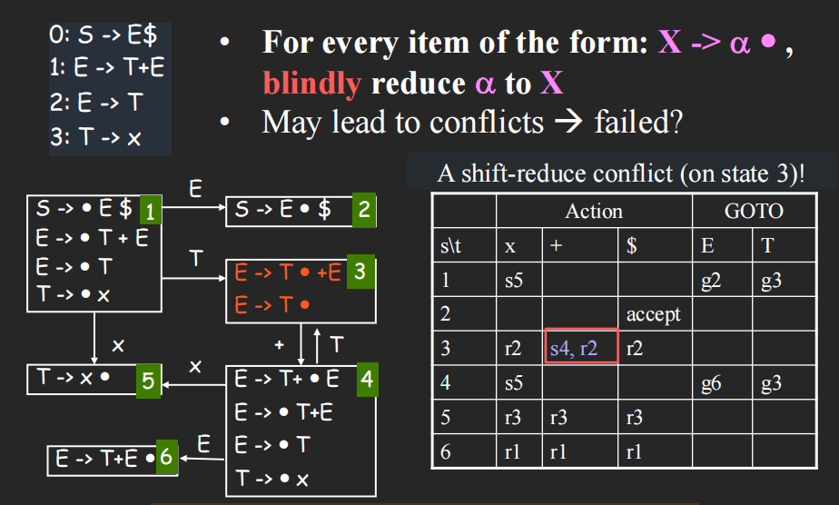

状态 3 包含项 `E → T•` 和 `E → T + •E`，存在移进-规约冲突：
- 如果下一个输入是 `+`，应该移进
- 如果下一个输入是 `$`，应该规约

!!!

### 5.3 SLR(1) 分析

#### 5.3.1 SLR(1) 思路

**直观想法**：利用更多信息来指导规约操作。

回顾："LR 分析应该是最右推导的逆过程"
- 每步归约都应该满足 t ∈ Follow(A)
- t 是 Next Token (Lookahead)

#### 5.3.2 SLR(1) 与 LR(0) 的区别

主要区别：**构造分析表时的规约动作**

SLR(1) 只在 FOLLOW 集指导下填入规约动作：

```python
# LR(0) 规约动作
R ← {}
for each state I
    for each item A → α. in I
        R ← R ∪ {(I, A → α)}

# SLR(1) 规约动作
R ← {}
for each state I
    for each item A → α. in I
        for each token X in Follow(A)
            R ← R ∪ {(I, X, A → α)}
```

!!! example SLR(1) 解决冲突

对于文法 `E → T + E | T`，Follow(E) = {$}

状态 3 包含项 `E → T•`：
- LR(0)：所有输入都规约
- SLR(1)：只在输入为 $ 时规约（因为 $ ∈ Follow(E)）

!!!

#### 5.3.3 SLR(1) 的局限性

SLR(1) 使用 FOLLOW 集作为"合理但可能不够精确的近似"。

如果 Follow(R) = Follow(L)，仍可能存在移进-规约冲突。

---

## 总结

本章主要介绍了：

1. **语法分析概述**
   - 语法分析器的作用和实现方式
   - 自顶向下 (LL) vs 自底向上 (LR) 分析

2. **上下文无关文法 (CFG)**
   - CFG 的形式化定义：G = (T, N, P, S)
   - 终结符、非终结符、产生式、开始符号
   - 推导和归约：最左推导、最右推导

3. **分析树 (Parse Tree)**
   - 推导的图形化表示
   - 根节点为开始符号，叶子节点为终结符

4. **设计编程语言的文法**
   - RE vs CFG 的表达能力对比
   - 二义性文法的消除方法
   - 优先级和结合性的处理

5. **自顶向下分析**
   - 递归下降分析：回溯问题
   - LL(1) 预测分析法：First/Follow 集、预测分析表
   - 文法改造：提左公因子、消除左递归
   - 错误恢复策略

6. **自底向上分析**
   - 移进-规约 (Shift-Reduce) 概述
   - LR(0) 分析：项 (Item)、自动机构造、分析表构造
   - SLR(1) 分析：利用 Follow 集解决冲突

---

## 参考资料

- 《编译原理》（龙书）- Alfred V. Aho, Monica S. Lam, Ravi Sethi, Jeffrey D. Ullman
- 《编译原理与实践》（虎书）- Andrew W. Appel
- 浙江大学编译原理课程课件
- rainoftime.github.io
