## 1. Semantic Actions（语义动作）

- **解析器**：识别一个句子是否属于某个文法定义的语言（通俗一点：输入是否符合规则）
- **编译器**：必须对这个句子做更有用的事情
  - 构造抽象语法树(`abstract syntax tree`)：把程序组织成树形结构，表示运算层次和语法结构
  - 执行语义分析(`semantic analysis`)：检查类型是否匹配、变量是否声明、函数参数是否正确等
  - 生成中间表示(`Intermediate Representation`)：为后续优化和目标代码生成做准备
- **解析器的语义动作**：对已经解析出的短语做一些有用的事情
- 语义动作存在于
  - 递归下降分析器(`Recursive Descent`)
  - Yacc生成的分析器(`Yacc-Generated Parsers`)


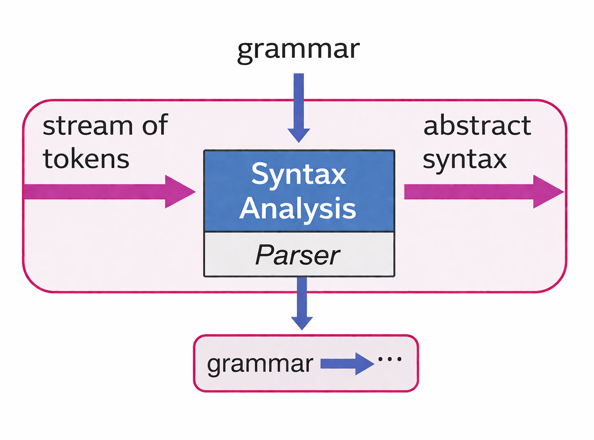

### 1.1 Recursive Descent

给定文法：

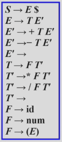

对应代码:

```c
enum token {EOF, ID, NUM, PLUS, MINUS, ...};
int F_follow[] = { PLUS, TIMES, RPAREN, EOF, -1 } //F的Follow集
void F(void) {
    switch(tok) {
        case ID: {
            advance(); // 表示接受当前token，并读入下一个token
            break;
        }
        case NUM: { 
            advance(); 
            break; 
        }

        case LPAREN: { 
            eat(LPAREN);//消耗左括号
            E(); //递归调用E()，去分析括号里面的表达式
            eatOrSkipTo(RPAREN, F_follow);
            // 如果当前符号是)就吃掉它
            //如果不是，就跳过一些图书，直到遇到)或者遇到一个属于F_follow的同步符号
            break; 
        }

        case EOF:
            default: printf("expected ID, NUM, or left-paren");
            skipto(F_follow);
    }
}
```

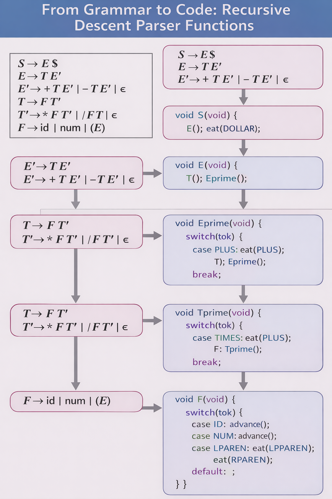

#### Semantic Actions in Recursive Descent

在递归下降分析器里，**非终结符F不仅负责识别语法，还负责返回语义值**

也就是这里的`F()`不再是单纯判断`F->id | num | {E}`是否匹配，还要把这个因子的值算出来并返回

```c
// 表示token类型
enum token {EOF, ID, NUM, PLUS, MINUS, ...};
// 表示token可能携带的属性值(token的数据类型)
union tokenval {string id; int num; ...};

enum token tok;

union tokenval tokval;

// assume a lookup table mapping identifiers to integers
// 符号查找表，比如当token是变量名x，那就可以通过lookup("x")查找变量x当前对应的值
int lookup(string id) { ... }
// F的Follow集，用于错误恢复
// 在合法输入中，F后面可能跟着这些符号
int F_follow[] = { PLUS, TIMES, RPAREN, EOF, -1 };
// 注意这里返回类型是int, 说明F()这个语法函数会返回非终结符F的语义值
int F(void) { 
    switch (tok) {

        case ID: { int i = lookup(tokval.id); advance();
                return i; }

        case NUM: { int i = tokval.num; advance();
                    return i; }

        case LPAREN: { eat(LPAREN); int i = E();
                    eatOrSkipTo(RPAREN, F_follow);
                    return i; }

        case EOF:
        default: printf("expected ID, NUM, or left-paren");
                skipto(F_follow); return 0;
}}
```

在递归下降分析器中，**语义动作**(`semantic actions`)可以是

- 由分析函数返回的值(`values`)
- 这些函数产生的副作用(`side effects`)
- 或者两者都有

副作用的例子：语法上只是一个赋值语句，语义动作可能是`table["x"] = 5;`，这个动作就是副作用，因为表改变了符号标

$$
S \rightarrow id:=num
$$

- 对于每个终结符和非终结符，我们都会关联一种 **语义值的类型**(type of semantic values),用于表示**从该符号推导出的短语**
  - `NUM` 的语义值类型可能是 `int`
  - `ID` 的语义值类型可能是 `string`
  - `E` 的语义值类型可能也是 `int`（表示表达式的计算值）
  - 某些语句非终结符的语义值类型可能是 AST 节点指针
- 这个类型来自编译器所使用的所有语言
  - C写编译器，类型可能是`int`,`char*`
  - Java写编译器类型可能是`int`,`String`, `ASTNode`

当我们把左递归文法改写成适合递归下降额形式之后，语义动作应该怎么写，们才能仍然保持原来的左结合计算效果？

先看最直观的原始写法

$$
T \rightarrow T * F
$$

如果这是左递归文法，那么它的语义动作很自然可以写成

```c
int a = T();
eat(TIMES);
int b = F();
return a*b;
```

但是问题是 **递归下降分析器不能直接处理左递归**

多以要把文法写成

$$
T \rightarrow FT'
$$
$$
T'\rightarrow *FT'|/FT'| \epsilon
$$

这样文法适合递归下降了，但是带来了一个新问题：在T'里面我们只能看到$*FT'|/FT'$,也就是说：**这里只剩下右边的操作数和后续部分，看不到左边已经计算出来的值**

解决方案：**把左操作数作为参数传给T'**

```c
int T(void) {
    return Tprime(F());
}
```

这里的含义是

1. 先调用`F()`，算出第一个因子的值
2. 把这个值作为 **当前累计结果**传给`Tprime`

所以这里的`a`就是：**到目前为止已经算好的左边部分的值**


```c
int Tprime(int a) {
    switch(tok) {
        case TIMES: 
            eat(TIMES);
            return Tprime(a*F());

        case PLUS:
        case RPAREN:
        case EOF: return a;
    }
}
```

- 实现逻辑
  - 如果当前token是`*`
    - 先匹配`*`
    - 再调用`F()`算出右边因子的值
    - 再把`a*F()`的结果作为新的累计值
    - 继续递归调用`Tprime(...)`
    - 这相当于不断做$((a * F_1)*F_2)*F_3$
  - 如果当前`token`是
    - `PLUS`
    - `RPAREN`
    - `EOF`
    - 说明乘除部分已经结束，不再属于`T'`了，于是直接`return a;`,也就是把累计结果返回出去
    - '

!!! example  
假设输入是：
```
2 * 3 * 4
```
那么执行过程大致是：

1. T() 先调用 F()，得到 2
2. 调用 Tprime(2)

第一次进入 Tprime(2)：

- 看到 *
- 吃掉 *
- F() 读出 3
- 递归调用 Tprime(2*3)，即 Tprime(6)

第二次进入 Tprime(6)：

- 又看到 *
- 吃掉 *
- F() 读出 4
- 递归调用 Tprime(6*4)，即 Tprime(24)

第三次进入 Tprime(24)：

- 后面没有 * 了
- 返回 24

所以最后 T() 返回 24。

这正是左结合乘法的结果。
!!!

### 1.2 Semantic Actions in Yacc-Generated Parsers

#### 1. {...}

`{...}`：写在产生式后面的语义动作代码

- 当分析器用这条产生式进行归约的时候就执行这里面的代码
- `exp: exp PLUS exp { $$ = $1 + $3; }`:当把`exp PLUS exp`归约成一个新的`exp`时，新的`exp`的值等于左边`exp`的值加右边`exp`的值

#### 2. $i

`$i`:表示当前这条产生式右部第i个符号的语义值

```yacc
exp: exp PLUS exp { $$ = $1 + $3 }
```

右部有3个符号：

1. `exp`
2. `PLUS`
3. `exp`

所以：

- `$1` 是左边 `exp` 的值
- `$2` 是 `PLUS` 的值（通常不用）
- `$3` 是右边 `exp` 的值


#### 3. $$

`$$`表示：当前归约后，左部非终结符的语义值

`yacc`语句与上面相同，这里的`$$`就是归约后新产生的那个`exp`的值

#### 4. %union

因为不同`token`/非终结符可能携带不同类型的语义值，所以`Yacc`用`%union`来统一声明**这些可能的数据类型**

```yacc
%union { int num; string id; }
```
意思是语义值可能是

- 一个整数`num`
- 一个字符串`id`

#### 5. <variant>

这是类型标注

```yacc
%token <num> INT
%token <id> ID
%type <num> exp
```

意思是

- `INT token`的语义值类型是`num`
- `ID token`的语义值是`id`
- 非终结符`exp`的语义值类型也是`num`

也就是说，表达式最后会计算成一个整数

这些`$1`,`$2`,`$$`到底是怎么在运行时实现的？

**Yacc维护了一条语义值栈，和状态栈同步变化**

- 可以把它理解成两条并行的栈
  - **状态栈**：给LR分析器判断`shift/reduce`用
  - **语义值栈**：给语义动作取值和存值用

$$
A \rightarrow Y_1Y_2...Y_k
$$

当LR分析器做`reduce`时

1. 它会从符号栈里面弹出这`k`个符号
2. 同时从语义值栈里弹出对应的`k`个语义值
3. 这`k`个值就分别对应`$1,$2,...,$k`
4. 执行语义动作代码算出`$$`
5. 再把左部A压回符号栈、同时把`$$`的值压回语义值栈

!!! example
假设输入是

```
3+4
```

某一步要按照下面的语法归约

```yacc
exp: exp PLUS exp { $$ = $1 + $3; }
```

这时语义值栈顶可能对应的是：

- `$1 = 3`
- `$2 = +`
- `$3 = 4`

执行动作

```c
$$ = $1 + $3 = 3 + 4 = 7
```

然后

- 弹出`exp PLUS exp`
- 压入新的`exp`
- 同时把7压回语义值栈

所以归约后，这个新的`exp`的语义值就是7
!!!

**Yacc 在 LR 分析过程中维护一条与状态栈并行的语义值栈；当发生归约时，右部符号的语义值作为 `$1...$k` 提供给语义动作，而语义动作计算出的结果作为 `$$` 压回栈中。**

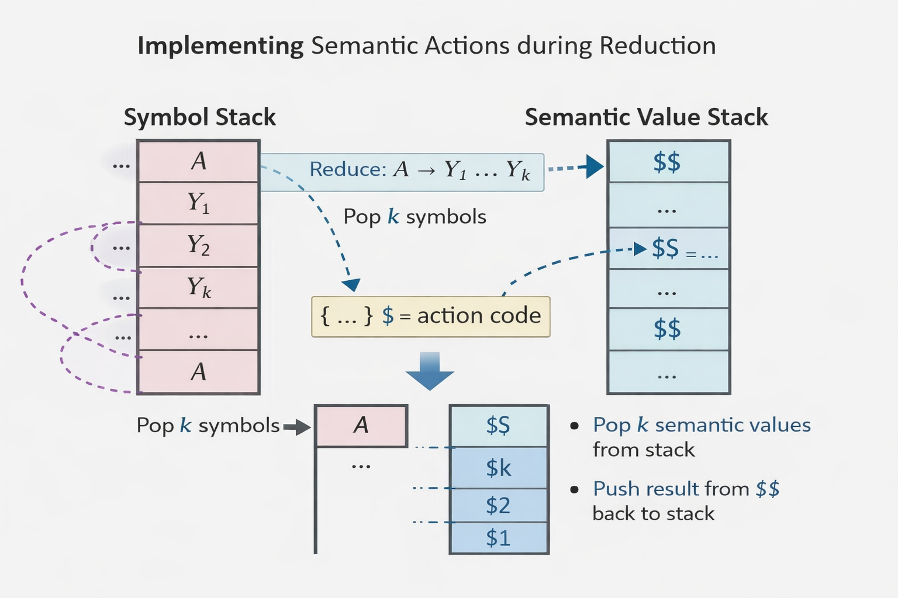
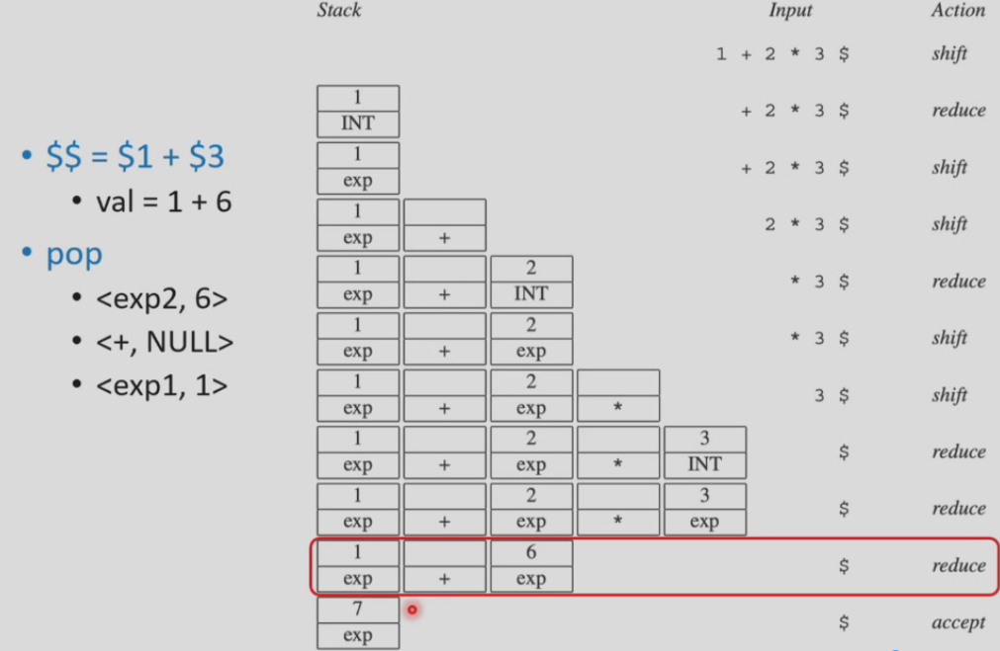

!!! note
- 每个终结符和非终结符都可以关联它自己的 **语义值类型**(`type of semantic value`)

$$
A \rightallow BCD
$$

- 语义动作必须 **返回一个值**，这个值的类型必须与非终结符A关联的类型一致
- 这个值可以由已经匹配到的终结符和非终结符B,C,D所关联的值(values)构造出来
- LR分析器确实会执行归约(`reduction`)以及与之关联的语义动作(`semantic actions`)，并且它们的执行顺序是 **确定的、可预测的**(`deterministic and predictable order`):即对语法树进行一种 **自底向上、从左到右**的遍历
- 虚拟的语法树遍历顺序是 **后续遍历(postorder)**
!!!


## 2. Abstract Parse Trees

- 完全可以把整个编译器都写进Yacc解析器的 **语义动作代码**里
  - 但是这样做很能理解或维护
  - 并且必须严格按照**程序被解析的顺序**来分析程序

```c
void foo() {bar{};}
void bar() {}
```

> 这段程序实际上是合法的，但是如果一遍解析一边做完整的予以处理，那么在解析`foo`里的`bar()`调用时，`bar`的完整信息可能还没见到

这说明，有些语义分析并不适合和语法完全绑定在一起同步完成，所以 **最好把语法分析和语义分析分层**

- 为了提高 **模块化modularity**，更好的做法是把 **语法问题**(syntax, 解析)和**语义问题(semantics,类型检查、翻译成机器代码)分开**
- 一种解决方案：解析器先生成一棵 **语法树**，供后续阶段遍历处理


### 2.1 为什么需要抽象语法

- 从技术上讲，一棵 **语法分析树**(parse tree)对输入中的每个token都有且仅有一个叶子结点，并且对分析过程中**每次按照文法规则归约**都有一个内部节点
- 这样的语法树称为 **具体语法树**(concrete parse tree), 它表示源语言的具体语法结构
- 但是，具体语法树直接使用起来 **并不方便**(inconvenient)
    - 输入里的每一个token都保留
    - 每次归约都对应树上的一个节点

所以它过于详细，几乎完整记录了 **语法分析过程**

**问题1：有很多冗余信息**

```
(2 + 3) * 4
```

在具体语法树里，你会看到：

- 左括号`(`
- 右括号`)`
- 中间很多`E`,`T`,`F`节点
- 文法展开带来的层层嵌套

可是在后续语义分析、优化、代码生成时，很多这些东西根本不重要

比如括号的作用只是改变优先级，一旦树的结构已经表达出优先级，括号本身就不需要了

**问题2：太依赖文法**

例如为了适配`LL(1)`或`LR`，把表达式文法改写成

- 消除左递归
- 提取左公因子
- 引入`E`,`T`

虽然语言本身没变， 但是`parse tree`的形状会明显变化

这会导致后续语义处理很不稳定：**文法一改，后面的树处理逻辑也得跟着改**

因此我们需要**抽象语法树AST**

AST的特点就是

- 去掉不重要的符号，如`(`,`)`
- 去掉纯粹为文法服务的中间层，如某些`E/T/F/E'/T'`
- 只保留真正有意义的程序结构

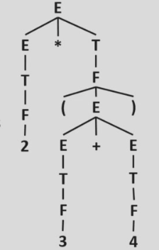

### 2.2 什么是抽象语法

- 抽象语法在解析器和编译器后续阶段之间提供了一个清晰的接口
- 抽象语法不是用来做语法分析的
  - 真正用于识别输入串的，仍然是 **具体语法**(concrete syntax)，也就是写在文法里面的那些LL/LR分析的规则
- 解析器使用 **具体语法**(concrete syntax)来构造一个用于抽象语法的语法树——抽象语法树(abstract syntax tree)

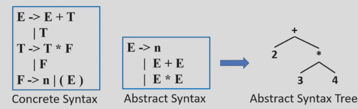

- 抽象语法树传达的是源程序的 **短语结构**(phrase structure)，其中所有语法分析层面的问题都已经解决，但是还没有加入语义解释(semantic interpretation)

### 2.3 抽象语法树

- 为了在后续阶段使用抽象语法树，编译器需要把抽象语法树表示并操作为 **数据结构**，应该怎么做
- 对每个非终结符定义一个`typedef`，对每个产生式定义一个`union`变体

```c
typedef struct A_exp_ *A_exp;

struct A_exp_ {
    enum { A_numExp, A_plusExp, A_timesExp } kind;
    union {
        int num;
        struct { 
            A_exp left;
            A_exp right;
        } plus;
        struct {
            A_exp left;
            A_exp right;
        }times;
    } u;
};

A_exp A_NumExp(int num); // 创建一个数字节点
A_exp A_PlusExp(A_exp left, A_exp right); // 创建一个加法节点
A_exp A_TimesExp(A_exp left, A_exp right); // 创建一个乘法节点
```

> parser在归约时，不是手动画树，而是调用这些函数来生成AST节点

**抽象语法**

```
E → n
    | E+E
    | E*E
```

!!! example 
- 使用这些数据结构来构造表达式`2+3*4`的抽象语法树

我们知道，根据具体语法，应该先创建`TimesExp`

``` c
e1 = A_NumExp(2);
e2 = A_NumExp(3);
e3 = A_NumExp(4);
e4 = A_TimesExp(e2,e3);
e5 = A_PlusExp(e1, e4);
```

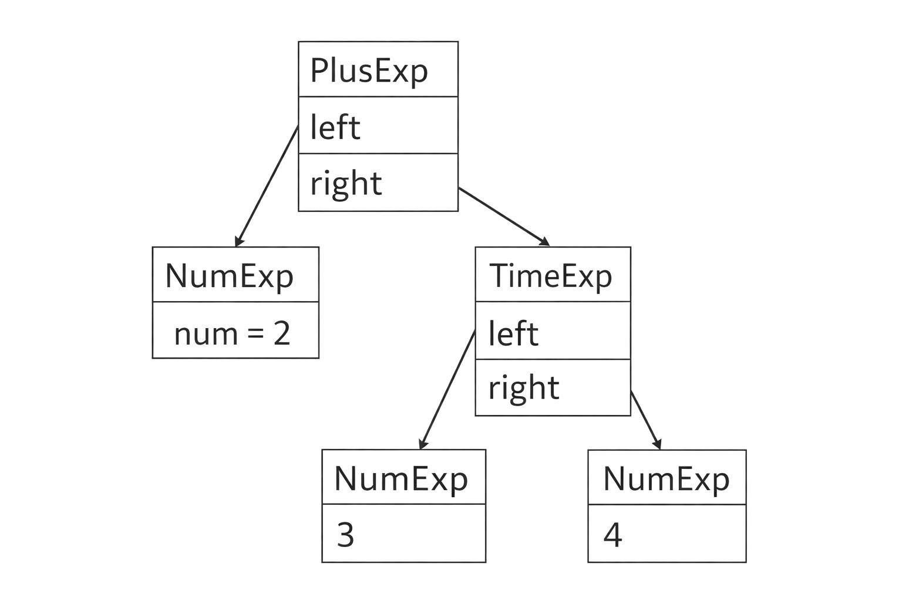
!!!

#### 自动构建抽象语法树

`Yacc`生成的(或递归下降的)解析器，在分析 **具体语法concerete syntax**时，会构造 **抽象语法树**。

当语法分析器**识别出某条产生式**并进行归约时，就**顺便**在语义动作里创建对应的`AST`节点

```yacc
%left PLUS
%left TIMES
```

- 这是在给运算符声明 **优先级和结合性**

含义是：

- `PLUS` 是左结合
- `TIMES` 是左结合
- 而且因为 TIMES 写在后面，所以它的优先级 **高于 PLUS**

```yacc
%%

exp : NUM             { $$ = A_NumExp($1); }
    | exp PLUS exp    { $$ = A_PlusExp($1, $3); }
    | exp TIMES exp   { $$ = A_TimesExp($1, $3); }
```

```yacc
exp : NUM { $$ = A_NumExp($1); }
```
- 如果一个表达式只是一个 **数字NUM**，那么就创建一个数字`NUM`(数字节点),这一步相当于 **把词法单元NUM包装成一个AST叶子结点**
- 当parse识别`exp PLUS exp`，并归约成一个新的`exp`时就创建一个**加法AST节点**,`A_PlusExp($1, $3)`
  - `$1` 是左子表达式对应的 AST
  - `$3` 是右子表达式对应的 AST
  - `$$` 是新构造出来的加法结点
  - 本质上是在做：**把左右两棵子树挂到一个PlusExp节点下面**
- `exp : exp TIMES exp { $$ = A_TimesExp($1, $3); }`同理归约为一个 **乘法AST节点**

#### Positions

> 编译器在发现错误时，怎么准确告诉用户 **错在源代码的哪里**

- 在 **单编译器**(one-pass compiler)中，**词法分析、语法分析和语义分析**都是同时完成的
  - 如果出现了一个必须报告给用户的**类型错误**(`type error`)，那么词法分析器的 **当前位置**可以作为该错误在源程序中位置的一个**合理近似**
  - 所以单编译器里，报错位置比较容易处理
- 在单编译器中，词法分析器会维护一个全局变量 **当前位置**(`current position`)
- 对于一个 **使用抽象语法树数据结构**的编译器
  - 流程通常变成
  1. `lexer`先把源程序读完
  2. `parser`构造AST
  3. 后面再做语义分析、类型检查  
  - 它**不必在一遍中完成所有的语法分析和语义分析**
  - 当我们在 **后续语义分析阶段**发现错误时，`lexer`早就已经到达文件末尾了，这时就无法再通过`lexer`的当前扫描位置来报错了

!!! question
如果这时出现类型错误，我们该如何知道错误位置？

**把源代码位置信息保存到AST节点里**
!!!

- 抽象语法树中每个节点在源文件中的位置都必须被记住
- **核心思想**：抽象语法树的数据结构中必须加入 **pos字段**
  - 它表示：**这些抽象语法结构是从原始源文件中哪些字符位置推导出来的**

!!! example 
- 一个变量结点可以记录变量名出现的位置
- 一个加法表达式节点可以记录整个`a+b`这段表达式的位置
- 一个函数调用节点可以记录函数起始调用起始位置

这样后面做类型检查时，如果发现

```c
x + true
```

类型不匹配，就能直接从对应AST节点的`pos`里拿到源代码位置，直到*第几行第几列有类型错误*
!!!

如何设置这些`pos`字段

1. 词法分析器必须把每个`token`的 **起始位置和结束位置**传递给语法分析器
2. 理想情况下，语法分析器应当在维护 **语义值栈semantic valuestack**的同时，也维护一条 **位置栈**(position stack)，这样每个符号的位置就都可以**提供给语义动作使用**

也就是说，分析器在`shift/reduce`时，除了处理：

- 符号
- 语义值

还同时处理

- 位置信息

这样每个`$1`,`$2`,`$3`不仅有值，还有**对应的位置**

## 3. Error Recovery

### 3.1 Yacc: Syntax vs Semantics

!!! yacc
%{ // declarations of yylex and yyerror
%}
%token ID ASSIGN PLUS MINUS AND EQUAL
%start stm
%left OR
%left AND
%left PLUS
%%

stm : ID ASSIGN ae
    | ID ASSIGN be

be  : be OR be
    | be AND be
    | ae EQUAL ae
    | ID

ae  : ae PLUS ae
    | ID
!!!

这里有的语言中有两类表达式

- 算数表达式`ae`
  - `x+y`
  - `a+b`
- 布尔表达式`be`
  - `a&b`
  - `x = y`

于是文法试图把它们从语法层面上严格分开

- `ae`只能生成算数表达式
- `be`只能生成布尔表达式
- 赋值语句可以是`ae`也可以是`be`

看起来很合理，因为右边那几个语义约束也确实成立

但是问题出现在：**这些约束并不适合直接用这个文法来表达**

在这个文法中：

```yacc
be:ID
ae:ID
```

也就是说，同一个ID既可以被归约成`be`，也可以被归约成`ae`

这里就会出现`reduce/reduce conflict`

这就说明：**ID到底是算数运算还是布尔变量**这个问题，本质上不是 **纯语法问题，而是语义问题**

那么我们的方案是：**不要在语法里强行把ae和be分成两套**，而是先用一个统一的表达式非终结符`E`：

```
E→id
E→E&E
E→E=E
E→E+E
```

这样`parser`只负责回答 **这个输入在句法上能不能组成一个表达式**，至于：

- `+`两边是不是算数类型
- `&`两边是不是布尔类型
- `=`两边能不能比较
- `id`到底是什么类型

这些问题等到`semantic phase`再检查

!!! example
```
a + 5 & b
```

这条语句在 **语法上是正确的**(`syntactically correct`)

因为按照统一文法，它确实能被解析成一个表达式

但是它**在语义上是错误的**，因为

- `a+5`可能是算数值
- `b`可能是布尔值
- `&`可能要求两边都是布尔值

这种错误要让 **类型检查**去做，而不是让`parse`去做
!!!


### 3.2 Error Recovery

- 动机：开发者希望程序中的**所有错误**都能够被报告出来，而不只是第一个错误
- 错误恢复技术包括两种
  - **局部错误恢复**(`Local error recovery`)
  - **全局错误修复**(`Global error repair`)

#### Local Error Recovery

- **局部错误恢复**机制通过在 **检测到错误的位置**调整 **分析栈**(parse stack)和 **输入**(input)，以便让语法分析能够**继续**(`resume`)

> 局部是什么意思：不是把整个程序都修复好，而是只在 **出错的附近**做处理

**局部处理的几个操作**

- 调整一下当前分析栈
- 丢弃一部分错误输入
- 找到一个安全的位置继续

- `Yacc`用来做局部错误恢复的额关键工具是特殊符号`error`
  - 这不是普通的终结符，而是 **Yacc内置的恢复符号**
  - `parser`会将其当做一个特殊的片段处理

```
exp→ID
exp→exp+exp
exp→(exps)
exps→exp
exps→exps;exp
```

- 一个表达式可以是标识符，可以是加法表达式，也可是括号里的表达式序列
- 表达式序列可以用分号隔开

为了支持错误恢复，加入了两条规则：

```
exp→(error)
exps→error;exp
```

- `exp→(error)`:如果括号里的表达式坏掉了，就跳过其中出错的部分，直到遇到右括号`)`，然后把整个`(...)`当成一个 **已恢复**的表达式

> 这里右括号`)`就起到了 **重新同步**的作用

- `exps→error;exp`：如果表达式序列中某一段出错了，就跳过这段坏的输入，直到遇到分号`;`，然后从后面的`exp`重新开始

> 这里的`;`就是重新同步的位置

这些叫做 **synchronizing tokens**，这些符号能帮助`parser`找回节奏，从错误状态重新对齐

!!! question "为什么常常选这类符号做同步符号"
因为它们通常表示一个结构边界，比如

- `)`结束一个括号表达式
- `;`结束一个语句或一个表达式项
- `}`结束一个代码块

所以一旦跳到这些符号，分析器比较容易恢复
!!!

!!! example
```
(a + + b) ; c
```

在解析 (a + + b) 时，+ + 明显是错的。
如果没有恢复机制，parser 可能在这里直接停止。

但是如果有`exp→(error)`

那么`parser`可以

1. 发现括号里有语法出错
2. 跳过坏掉的部分
3. 一直跳到`)`
4. 把这一整段`(...)`当成 **恢复后的exp**
5. 然后继续分析后面的`;c`
6. 这样就还能发现后面的语句
!!!

!!! example
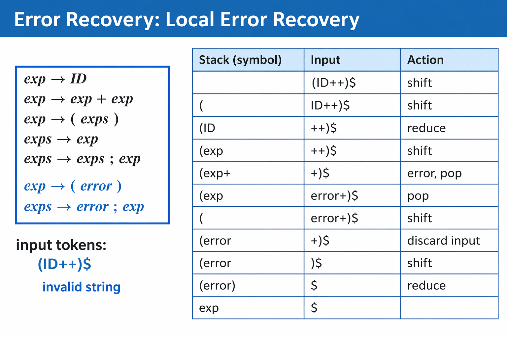
!!!

**总结一下**，当LR语法分析器到达一个错误状态的时候，它会采取如下动作：

1. **弹栈**(如果有必要)，直到到达某个状态，在该状态下，对`error token`的动作是`shift`
2. **移进error token**
3. **丢弃输入符号**(如果有必要)，直到达到某个状态：在该状态下，针对当前`lookahead token`，存在一个 **非错误动作**
4. 恢复正常语法分析

| 阶段            | 栈                | 剩余输入 | 说明                                   |
| --------------- | ----------------- | -------- | -------------------------------------- |
| 出错前          | `(exp+`           | `+) $`   | `+` 后面又来了一个 `+`，出错           |
| 1. pop 栈       | `(`               | `+) $`   | 回退到能接收 `error` 的位置            |
| 2. shift error  | `(error`          | `+) $`   | 把坏掉的片段视为 `error`               |
| 3. discard 输入 | `(error`          | `) $`    | 丢弃多余的 `+`，直到遇到同步符号 `)`   |
| 4. 恢复正常     | `(error)` → `exp` | `$`      | 按 `exp -> (error)` 归约，继续正常分析 |

!!! warning
在局部错误恢复的过程中，从栈中弹出状态`popping states from the stack`可能会导致看起来 **不可能发生的语义动作**，尤其是当这些动作包含副作用时（语义动修改外部状态）

```c
statements: statements exp SEMICOLON
          | statements error SEMICOLON
          | /*empty*/
exp: increment exp decrement
    | ID
increment: LPAREN {nest=nest+1;}
decrement: RPAREN {nest=nest-1;
```
!!!

#### Global Error Repair

有些错误，局部错误恢复不好处理，而更需要 **全局错误修复**的思路

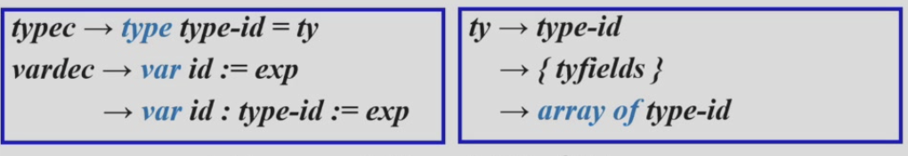

输入：`let type a := intArray [10] of 0 in ...`

问题就出现在`type a := ...` ,局部错误可以发现这个错误，但是不知道怎么修正这个错误

- 我们需要一些技术，能够找到 **根本原因**
  - 真正的问题可能是`type`本来应该写成`var`，即使**这个根本原因并不位于`parser`第一次报告错误的位置**


**全局错误恢复**：会寻找一组 **最小的插入和删除操作**(`the smallest set of insertions and deletions`)，使源字符串变成一个**语法正确(`syntactically correct`)的字符串**

!!! warning
即使这些插入和删除的位置，并不是`LL`或`LR`分析最先报告错误的位置
!!!

**Burke-Fisher error repair**

它的思路不是无限搜索，而是做一个受限但是实用的搜索

- 核心做法
  - 在`parser`报错点附近，**向前会看K个token**
  - 然后再这个局部范围内，尝试各种 **单token级别的修改**
    - 插入
    - 删除
    - 替换

!!! example
如果报错点在当前位置，那么它会考虑

- 是不是前面少了一个`)`
- 是不是多写了一个`;`
- 是不是`type`写成了`var`
- 是不是这里某个`token`应该换掉
!!!

这是一种有限搜索，不是全局穷举，所以它是`limited but useful`的(**不完美但是实际很有帮助**)

!!! question
如何选择最好的修复方案
!!!


- 选择的标准：**选择能让`parser`在原始报错点之后走的最远的修复方案**
- 如果某个修复方案能让`parser`比原来报错的位置再向前成功分析 **4个token**，通常就可以认为这个修复是足够好的了

!!! warning
解析引擎必须能够回退 **k个token**(`back up K tokens`)并重新分析(`reparse`)
!!!

`Burke-fisher`为了实现回退`K`个token再尝试修复，会把parser的历史分成三层来管理

- `old stack`：更早以前已经稳定分析完的部分，这些内容基本不再改动，可以理解为 **安全区**
- `current stack`:最近这段输入对应的当前分析状态，如果后面出错，修复通常在这部分附近进行
- `k-token queue`:最近读入的`K个token`的滑动窗口，这部分`token`还没有被彻底归档到`old stack`，所以系统还能回退到这里重新尝试修复

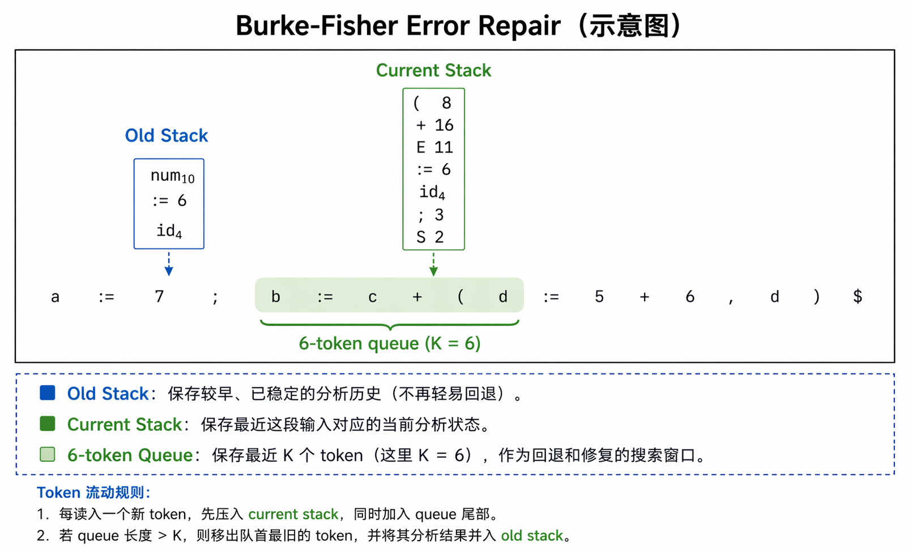

- 每当一个新的`token`被移进`shift`时
  - 它会被压入`current stack`
  - 同时放入队列的 **尾部**(tail of the queue)
  - 队列的头部`head of the queue`元素会被移除，并被移进`old stack`
- 每当一个符号被移进`old stack`或`current stack`时，也会同时执行相应的 **归约动作**(`appropriate reduce actions`)
- 假设在 **当前token**处检测到了这样一个错误
  - 对于队列中的任意位置上，任意一种可能的`insertion`、`delete`或`substitution`一个`token`的方案，`Burke-Fisher`错误修复都会先在 **队列的一份副本**上做这个修改，然后尝试**从`old stack`重新分析(`reparse from the stack`)**
  - 一般来说，如果在当前`token`之后还能继续成功分析3或4个token，就认为这是一次成功的修复


!!! warning
这里是从`old stack`开始重新分析，因为这一部分代表的是更早的、更稳定的历史，也是`Burke-Fisher`回退后重新尝试的起点
!!!

