**上下文无关文法CFG的局限性**

- 考虑下面这个文法
  - 程序由 **声明+语句**组成
  - 声明里面可以写
    - `string x`
    - `int z`
  - 语句内部可以赋值
    - `id = exp`
  - 表达式里面可以写
    - `exp + exp`
    - `id`
    - `num`

```
S→Decl Stmt
Decl→Type id ;∣Decl ; Decl
Type→string∣int
Stmt→Stmt ; Stmt∣id=Exp∣…
Exp→Exp+Exp∣id∣num∣…
```

从纯语法角度来看下面这个程序

```cpp
string x;
int z;

x = "hello world";
z = x + 1;
```

> `parser`很可能会接受这个程序的结构，其很类似于一个合法程序

`parser`只能判断上形式上能不能写成`exp + exp`，但是不能判断这**两个表达式的类型能不能真的相加**

这就是CFG的局限：

- 它只能处理 **syntax**(句法/结构)
- 不能处理很多需要**上下文信息、类型信息、运行环境信息**的问题

!!! note
许多事情无法仅仅通过语法分析来决定：

- 变量声明的类型是否与赋给它的值的类型匹配
- 数组访问是否越界
- 一个变量应该存储在哪里(`heap`, `stack`,...)
!!!

> 语义分析阶段做了什么

前面我们提到，`CFG`和`parser`只能判断程序的**语法结构**是否合法,例如判断下面的语句是否符合赋值语句的**形式**

```c
x = y + 1;
```

但是它不能判断

- `x`有没有声明
- `y`有没有声明
- `y + 1`的类型对不对
- `x`的类型能不能接收右边的结果

这些就是语义分析阶段要做的事情：

- 通过AST确定程序的一些 **静态属性**(`static analysis phase`)
  - 变量名的作用域和可见性
    - 每个变量在使用前都已经被声明
  - 变量、函数和表达式类型
    - 每个表达式都有一个合适的类型
    - 函数调用符合函数定义
- 将AST翻译成一种更简单的表示形式，这种表示适合生成机器代码，也就是 **中间表示**(`Intermediate Representation`)


## 5.1 Symbol Tables

- 语义分析阶段的特点是 **符号表**(`symbol tables`)，也叫 **环境**(`environment`)，它们把标识符映射到对应的 **类型和位置**
- **Binding绑定**：**给一个符号赋予含义**，记作$\mapsto$

!!! example 
```c
int a;
string g;
```

那么就有

$$
a \mapsto int
$$
$$
g \mapsto string
$$

意思是

- 名字`a`代表一个int类型变量
- 名字`g`代表一个string类型

所以`binding`解决的问题是：**这个名字到底是什么意思**
!!!

例如：

| Name/Symbol         | Meaning/Attribute           |
| ------------------- | --------------------------- |
| type identifier     | type，例如 int、string      |
| variable identifier | type、value、access info 等 |
| function identifier | 参数类型和返回值类型等      |

- **Environment**(环境)：一组绑定
  - eg. $\sigma_0 = \{g \mapsto string, a \mapsto int\}$
  - 可以理解成：当前语义分析器 **认识哪些名字，以及它们分别代表什么**
- **Symbol table**(符号表)：环境的具体实现
  - `Environment`是一个抽象概念；`Symbol table`是它在程序中的具体实现

> 语义分析阶段会按照一定顺序**遍历抽象语法树**(AST)，同时维护符号表

!!! tip
符号表就是语义分析器回答的是 **这个名字是什么意思**的数据结构
!!!

### 5.1.1 Motivating Example of Symbol Tables

- 假设在第一行引入之前，当前环境是$\sigma_0$

代码：

```go
function f(a: int, b: int, c: int)=
  (
    print_int(a+c);
    let var j:=a + b
        var a:= "hello"
    in print(a);
    print_int(j)
    end;
    print_int(b)
  )
```

- `function f(a: int, b: int, c: int)=`:$\sigma_1 = \sigma_0 + {a \mapsto int, b \mapsto int, c \mapsto int}$
- `let var j:=a + b`:$\sigma_2 = \sigma_1 + \{j \mapsto int\}$
- `var a:= "hello"`:$\sigma_3 = \sigma_2 + \{a \mapsto string\}$

- 标识符声明：`ID`会在符号表中被绑定到某种含义
- 标识符使用：在符号表中查找ID
  - 在第3行，标识符`a`和`b`可以在$\sigma_1$中查到

!!! question
在第3行中，编译器如何知道标识符`j`的类型?

`let var j := a + b`这里右侧表达式是`a + b`

编译器先在当前环境$\sigma_1$中查找$a \mapsto int$和$b \mapsto int$

所以$a + b$的类型是`int`，因此变量$j$的类型可以被推断为$j \mapsto int$

于是环境扩展为$\sigma_2 = \sigma_1 + \{j + \mapsto int\}$
!!!

!!! question
第4行：`var a := "hello"`,$\sigma_2$中包含$a \mapsto int$，现在在`let`的局部作用域中又声明了一个新的变量：`var a := "hello"`,那么a在$\sigma_3$中的绑定是什么？

因为`hello`是字符串，所以新的绑定是$a \mapsto string$

于是环境变成$\sigma_3 = \sigma_2 + \{a \mapsto string\}$

这表示在当前更内层的作用域中，新的`a`会 **override**外层的`a`

所以在$\sigma_3$中查找`a`，得到的是：$a \mapsto string$

而不是原来的：$a \mapsto int$
!!!

!!! warning
$$
X + Y \neq Y + X
$$

这里的`+`不是普通数学加法，而是 **环境扩展/表合并**

例如：$\sigma_2 + \{a \mapsto string\}$

表示：在$\sigma_2$的基础上加上一个新的`a`绑定；如果旧环境里已经有`a`，那么**新的绑定会覆盖旧的绑定**

所以：$\{a \mapsto int\} + \{a \mapsto string\}$

结果查`a`得到：$a \mapsto string$

但是如果反过来查找会导致出现不一样的`a`类型
!!!

- 每个局部变量都有一个它可见的 **作用域**(`scope`)
- 对于`let D in E end`，在D中声明的每个标识符，它的作用域从声明处开始，到`end`结束
- 当语义分析器到达每个作用域的结尾时，属于该作用域的局部标识符绑定会被丢弃
  - 例如，在第6行，$\sigma_3$被丢弃，$\sigma_1$被恢复


**局部变量只在自己的作用域内可见；离开作用域后，它的绑定要从符号表中移除**

### 5.1.2 The Interface of Symbol Tables

- `insert`:向表中插入一个绑定
- `lookup`:查找一个名字，并获得绑定到该名字上的信息
- `beginScope`:进入一个新的作用域
- `endScope`:退出一个作用域，并将符号表恢复到进入该作用域之前的状态

### 5.1.3 Multiple Symbol Tables

在某些语言中，可能同时存在多个活跃环境

- 程序中的每个模块、类或记录都有属于自己的符号表$\sigma$

**Java允许forward reference**

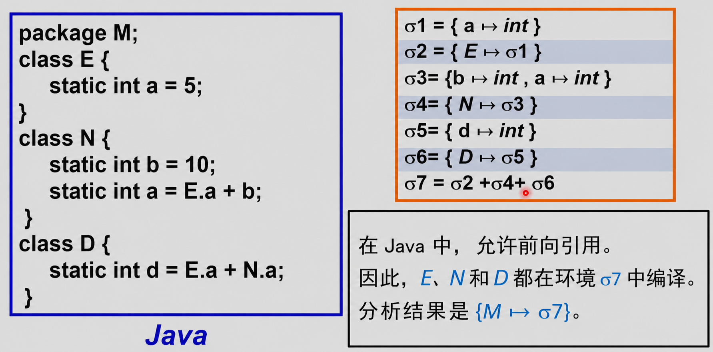

在同一个包/类集合中，类之间可以互相引用，即使某个类的文本位置在后面

**所以`E,N,D`可以一起放在同一个完整环境$\sigma_7$中编译**

也就是说编译`D`的时候可以知道`N`,即使`N`在文本上可能出现在前面或者后面

**ML也有多个structure，每个structure也有自己的环境，但是它的编译顺序更顺序化**

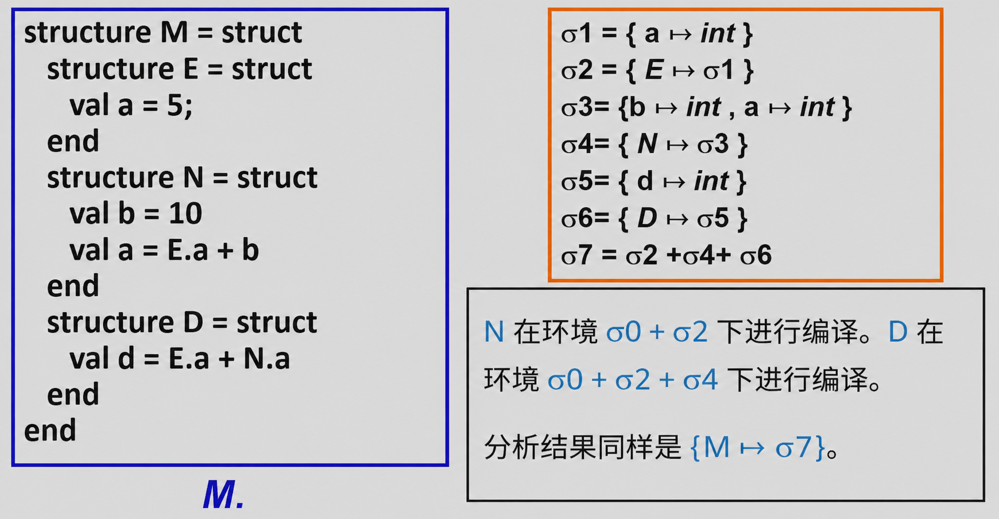

举个例子，比如下面这条语句

```sml
structure N = struct
    val b = 10
    val a = E.a + b
end
```

此时N能看到的是$\sigma_0 + \sigma_2$，也就是说，它可以看到

- 外部原始环境$\sigma_0$
- 之前已经定义好的`E`

ML不是一开始就把所有`structure`都放进完整环境，而是按照**变量声明的顺序**进行编译

所以N中可以使用：$E.a$，但是不能使用还没有定义的`D`,这就是ML和Java的最大区别

> 每个`class/structure`都有自己的符号表

有些语言中，一个程序里不只有一张符号表，而是会有**多张符号表同时存在**

原因是

- 每个模块有自己的命名空间
- 每个类有自己的成员表
- 每个结构体/record也有自己的字段表

所以符号表并不是简单的一张全局表，而可能是：

$$
\text{模块名}\mapsto\text{该木块自己的环境}
$$
$$
\text{类名}\mapsto\text{该类自己的环境}
$$

!!! note
- Java是 **先知道所有类名，再编译类体**
- ML是 **按照顺序逐个扩展环境**
!!!

### 5.1.4 Implementing Symbol Tables

#### Imperative Style(命令式风格)

- 修改$\sigma_1$，直到它变成$\sigma_2$
- 当$\sigma_2$存在时，我们不能再在$\sigma_1$中查找东西
- 当我们用完$\sigma_2$后，可以撤销修改，使$\sigma_1$再次恢复回来

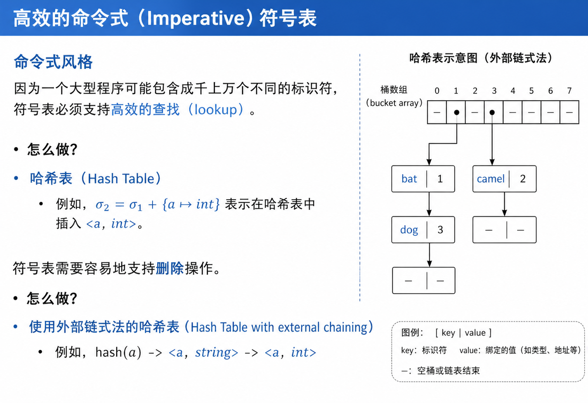

**命令式符号表如何高效实现**

命令式风格是直接修改同一张符号表。例如$\sigma_2 = \sigma_1 + {a \mapsto int}$

在命令式实现里，这不是创建一张全新的表，而是把`<a, int>`直接插入当前

!!! question "为什么要用哈希表"
因为大型程序里可能会有非常多标识符，比如

- 变量名
- 函数名
- 类型名
- 类名
- 字段名
!!!

**符号表要支持删除操作**

```c
{
  int a;
}
```

- 进入`{}`时，要插入：$a \mapsto int$
- 离开`{}`时，这个局部变量`a`就不再可见，所以必须删除这个绑定

因此符号表不仅要支持快速查找，还要支持方便删除最近加入的绑定

**哈希表使用外部链式法则**

哈希表可能会出现冲突，也就是不同名字`hash`到同一个桶。

**外部链式法**(external chaining):每个`hash`桶后面挂一条链表，所有hash到这个位置的绑定都放在这条链上

!!! example
```
hash(a) -> <a, string> -> <a, int>
```

这表示同一个名字`a`可能在不同作用域里有多个绑定

最前面的绑定通常是 **最新、最内层**的绑定

```
<a, string> -> <a, int>
```

表示当前查找`a`时，先找到$a \mapsto string$,这会覆盖外层的$a \mapsto int$

这正好支持了 **内层变量遮蔽外层变量**
!!!

**哈希表结构——一个桶数组**

符号表用哈希表实现，每个位置可能挂一条链表，用来解决哈希冲突

```c
struct bucket {
  string key;
  void *binding;
  struct bucket *next;
};
```

定义一个桶节点

- `key`:标识符名字，比如`"a"`,`"x"`
- `binding`:这个名字绑定的语义信息，比如类型、变量位置、函数信息
- `next`:指向同一个哈希桶中的下一个节点，用于外部链式法则

```c
#define SIZE 109
struct bucket *table[SIZE];
```

定义一个大小为109的哈希表数组，每个数组位置是一个桶链表的头指针

```c
unsigned int hash(char *s0) {
  unsigned int h = 0;
  char* s;
  for(s = s0; *s; s++) {
    h = h * 65599 + *s;
  }
  return h;
}
```

这是哈希函数，它把字符串标识符转换成一个整数哈希值。后面通常会用`hash(key)%SIZE`得到它应该放入哪个桶

```c
struct bucket *Bucket(string key, void *binding, struct bucket *next) {
    struct bucket *b = checked_malloc(sizeof(*b));
    b->key = key;
    b->binding = binding;
    b->next = next;
    return b;
}
```

这是创建桶节点的函数。它创建一个新节点，保存`key`、`binding`，并让`next`指向原来的链表头

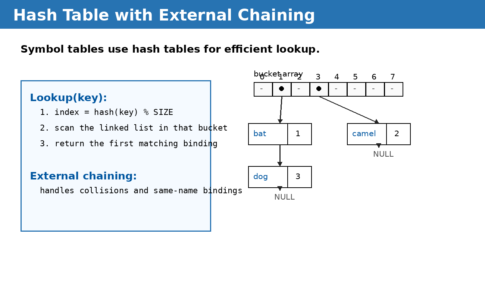

**insert操作**

```c
void insert(string key, void *binding) {
  int index = hash(key) % SIZE;
  table[index] = Bucket(key, binding, table[index]);
}
```

!!! example
如果原来已经有$a \mapsto int$,现在进入内层作用域，又插入$a \mapsto string$

那么链表会变成$hash(a) \rightarrow <a, string> \rightarrow <a, int>$

也就是说新的绑定放在旧的绑定前面

这样查找`a`时，先找到的是：$a \mapsto string$

它会遮蔽外层的$a \mapsto int$
!!!

- 先通过找到桶的位置
- 创建一个新的桶节点
- 把新节点插入到当前桶链表的最前面

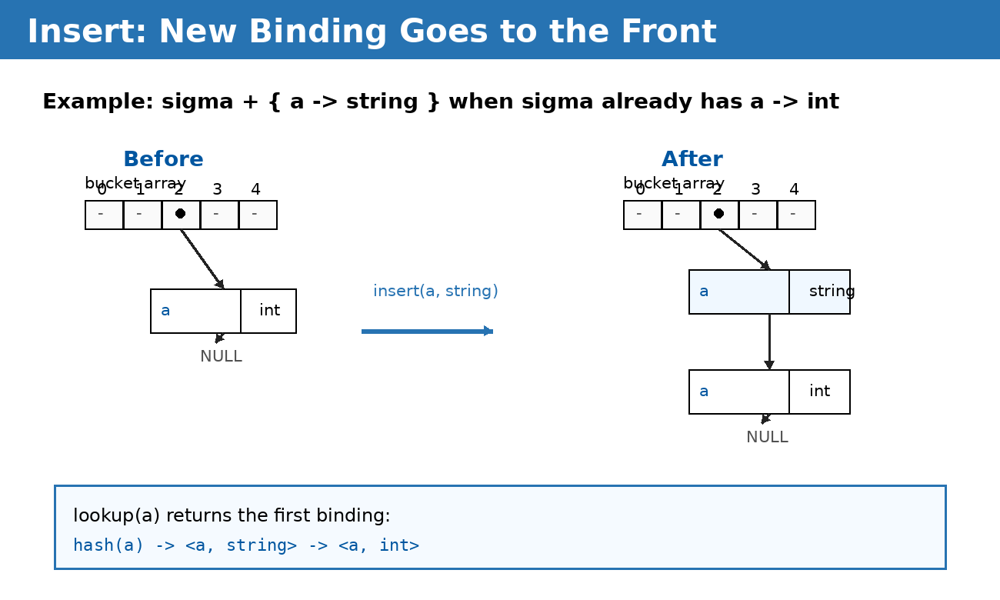

**lookup操作**

```c
void *lookup(string key) {
  int index = hash(key) % SIZE;
  struct bucket* b;
  for(b = table[index];b;b = b->next) {
    if(strcmp(b -> key, key) == 0){
      return b->binding; // 返回这个名字绑定的语义
    }
  }
}
```

- 这个函数在符号表中查找标识符`key`对应的表项
- 通过哈希函数为`key`计算数组下标`index`
- 遍历`table[index]`这一桶中的bucket链表，寻找匹配项

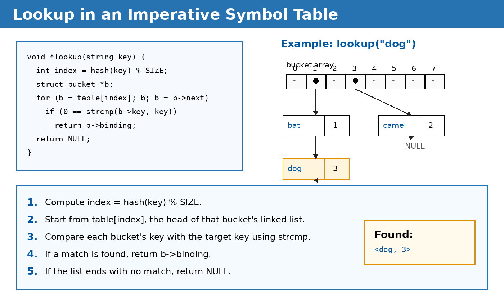

**pop操作**

```c
void pop(string key) {
  int index = hash(key) % SIZE;
  table[index] = table[index]->next;
}
```

- 找到`key`对应的哈希桶
- 删除链表最前面的节点
- 让桶指针指向下一个节点

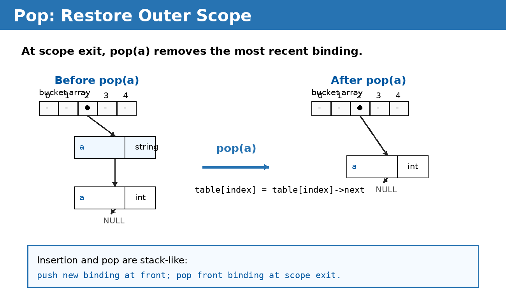

#### Functional Style(函数式风格)

- 在常见$\sigma_2$和$\sigma_3$的同时，保持$\sigma_1$处于原始、未被破坏的状态
- 退出作用域的时候只是把当前环境指针从$\sigma_3$切回$\sigma_1$，不需要`undo`

**函数式符号表在不修改旧环境的前提下，高效创建新环境**

前面命令式符号表的做法是：$\sigma_2 = \sigma_1 + \{a \mapsto int\}$。直接修改原来的哈希表，把**新的绑定插进去**。这样效率很高，但是问题是：$\sigma_1$被破坏了。之后如果还想使用旧的环境就必须靠 **undo stack**操作进行恢复

函数式风格的目标正好相反：

> 创建新环境$\sigma'$，但是旧环境$\sigma$仍然保持不变

原来的表是

$$
m1={bat↦1, camel↦2, dog↦3}
$$

现在要创建：$m2=m1+{mouse↦4}$，也就是说，$m_2$比$m_1$多一个绑定：$mouse \mapsto 4$，但是要求是$m_1$仍然可用不能被修改

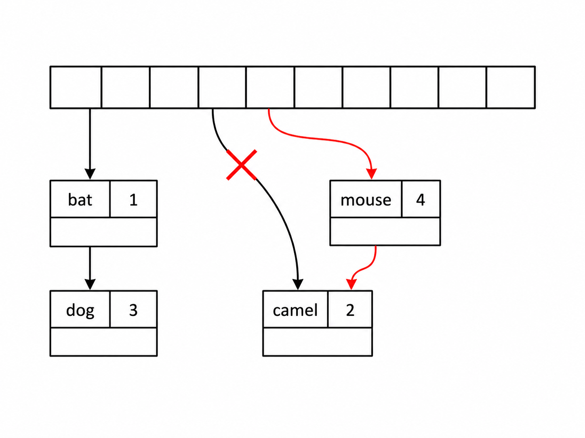

一种看似可行的方法是：**复制整个哈希数组，然后新表`m2`使用新数组，旧表`m1`使用旧数组**

同时为了省一点空间，旧的`bucket`链表可以共享

- 两个表有不同的哈希数组
- 旧的bucket可以共享
- 新增的`mouse`只出现在`m2`里

这样可以确保

- `m1`不变
- `m2`多了`mouse`

但是问题是：**复制整个哈希数组不高效**

因为哈希表的数组通常很大，每插入一个新绑定旧复制整个数组，代价太高

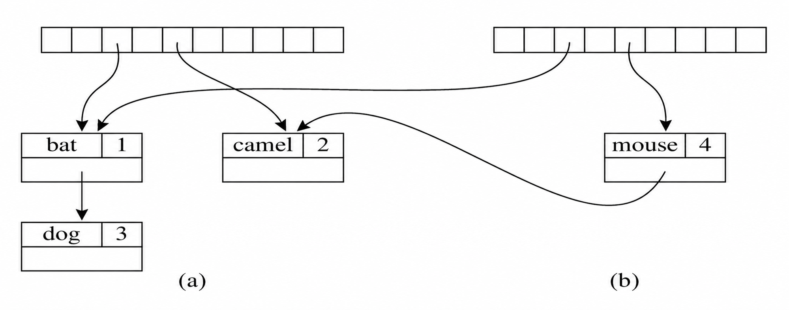

> 复制数组、共享旧桶，虽然逻辑正确，但效率不好。

为了既保证不改变旧表，还能够高效进行函数式操作，我们可以使用 **二叉搜索树**(`binary search trees`)

- 每个节点包含一个绑定
- 使用字符串比较来排序

$$
m_2 = m_1 + \{mouse \mapsto 4\}
$$

!!! note
前面提到的函数式风格要求

- $m_1$仍然要能使用
- $m_2$是在$m_1$基础上新增了`mouse -> 4`
- 但是不能直接原地修改$m_1$
!!!

- 原来的树是$m_1$
- 其中有
  - `dog -> 3`
  - `bat -> 1`
  - `camel -> 2`
- 要插入新的绑定
  - `mouse -> 4`

> 每个节点都存一个名字和它对应的绑定值

**Insert**:采用**路径复制**(`path copying`)的方法

- 只复制从根到插入为止这条路径上的节点，其他不受影响的子树直接共享

!!! example "插入节点mouse"
- 插入`mouse`时，需要经过根节点`dog`
- 所以复制一个新的`dog`节点
- 新的`dog`左子树仍然指向旧的`bat`子树
- 新的`dog`右子树指向新插入的`mouse`

于是：

- 旧的$m_1$仍然指向旧的`dog`
- 新的$m_2$指向新的`dog`
- `bat`和`camel`这些旧节点可以共享

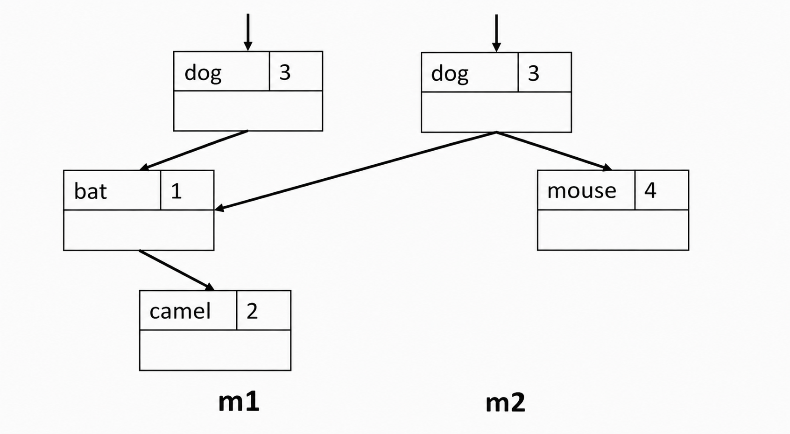

这就实现了 **m1不变**同时 **m2**
!!!

**Lookup**:对于一棵有$n$个节点的平衡树，查找复杂度是 $O(log n)$

!!! note
- `Imperative Style`
  - 进入一个作用域后，通过 **副作用**把绑定加入表中
  - 退出一个作用域时，使用辅助信息来移除之前加入的绑定。旧表可以被重新构造出来
- `Functional Style`
  - 进入一个作用域后，通过在旧环境的基础上添加绑定来创建一个新环境
  - 旧表保持完整，不被破坏
  - 退出一个作用域时，直接取回旧表
!!!

## 5.2 Symbols in the Tiger Compiler

### 5.2.1 Issues with Table Implementations

```c
void *lookup(string key) {
  int index = hash(key) % SIZE;
  struct bucket *b;
  for(b = table[index]; b; b = b -> next){
    if(0 == strcmp(b -> key, key)){
      return binding;
    }
  }
  return null;
}
```

**Problem**:在执行查找时，我们需要进行代价较高的 **字符串比较**(`string comparisons`)

**Solution**:把每个字符串转换成一个 **symbol**(符号对象)

- 每个`symbol object`都关联一个整数值
- 同一个字符串的所有出现都会映射到同一个`symbol`，不同的字符串会映射到不同的`symbol`

!!! warning
- 同一个字符必须映射到同一个symbol
- 不同字符串必须映射到不同`symbol`
!!!

**Important Properties of Symbol**

- 提取一个整数形式的`hash-key`非常快；可以直接使用`Symbol`**指针本身**作为整数`hahs-key`(用于哈希表)

> 这解释了为什么编译器里常常不直接用字符串作为符号表key，而是先把字符串转换为Symbol

- 比较两个`symbol`是否 **相等**很快
- 比较两个`symbol`的 **大于关系**也非常快
  - 这里的 **大于是某种任意规定的顺序**(用于二叉搜索树)

> 因为直接编号就可以

### 5.2.2 Symbols in the Tiger Compiler

- `void*`:在编译器中，我们希望针对不同用途有不同类型的绑定
  - 类型名需要绑定到类型信息
  - 变量和函数名需要绑定到值相关信息

```c
// Symbol接口
typedef struct S_symbol *S_symbol;
S_symbol S_symbol(string); // 把字符串转化为唯一的S_symbol
string S_name(S_symbol); // 将symbol转化为它对应的字符串名字

// Symbol Table接口
typedef struct TAB_table_ *S_table;
S_table S_empty(void); // 创建一个空的符号表
void S_enter(S_table, S_symbol sym, void *value); // 把一个绑定加入符号表 sym ↦ value
void *S_look(S_table, S_symbol sym); // 查找某个symbol对应的绑定信息
void S_beginScope(S_table); // 进入一个新的作用域
void S_endScope(S_table); // 退出当前作用域
```

!!! note
这里最重要的是`void* value`(一个通用指针)

因为不同名字绑定的信息可能不同

- 类型名绑定到类型结构
- 变量名绑定到变量类型、访问位置等
- 函数名绑定到参数类型和返回类型
!!!

#### Symbol接口实现

**创建一个新的symbol对象**

```c
static S_symbol mksymbol(string name, S_symbol next) {
  S_symbol s = checked_malloc(sizeod(*s));
  s -> name = name;
  s -> next = next;
  return s;
}
```

- `name`:保存原始字符串
- `next`:指向同一个哈希桶里的下一个`symbol`

> symbol本身也是要能够哈希表+链表来管理的

**根据字符串返回唯一对应的symbol**

```c
S_symbol S_symbol(string name) {
  int index = hash(name) % SIZE;
  S_symbol syms = hashtable[index];
  S_symbol sym;

  for(sym = syms; sym; sym = sym -> next) {
    if(0 == strcmp(sym -> name, name)){
      return sym;
    }
  }

  sym = mksymbol(name, syms);
  hashtable[index] = sym;
  return sym;
}
```

给定一个字符串`name`，返回唯一对应的`S_symbol`

**从symbol取回原来的字符串名字**

```c
string S_name(S_symbol sym) {
    return sym->name;
}
```

**Symbol的实现本质**：字符串驻留，相同字符串只创建一个唯一的symbol，以后比较名字时只需要比较`symbol`指针即可

#### Symbol Table接口实现

- Tiger编译器的C实现使用`destructive-update environments`
  - 也就是破坏式更新环境(命令式环境)
  - 意思是：进入作用域时直接修改当前符号表，退出作用域再恢复 
- 命令式表使用哈希表实现
- `TAB`:一个通用哈希表模块

**创建一个新的符号表**

```c
S_table S_empty(void) {
  return TAB_empty();
}
```

本质上是调用表模块`TAB_empty()`

**插入一个绑定**

```c
void S_enter(S_table t, S_symbol sym, void *value) {
  TAB_enter(t, sym, value);
}
```

!!! example
```c
S_enter(t, S_Symbol("x"), int_type);
```

意思是：

$$
x \mapsto int
$$
!!!

**查找一个symbol的绑定信息**

```c
void * S_look(S_table t, S_symbol sym) {
  return TAB_look(t, sym);
}
```

**对于destructive-update environments:**

- `S_beginScope`:记录当前符号表状态
- `S_endScope`:把符号表恢复到最近一次尚未结束的`beginScope`之前的状态


```c
static struct S_symbol_marksym = {"<mark>", 0};
```

> 这里定义了一个特殊的`symbol`：`<mark>`。它**不是用户程序中的变量名**，而是一个 **作用域标记**

```c
void S_beginScope(S_table t) {
  S_enter(t, &marksym, NULL);
}
```

进入一个新作用域时，往符号表里插入一个 **特殊标记**

$$
<mark> \mapsto NULL
$$

它的作用是：**记住这个作用域从哪里开始**，之后在这个作用域里插入的变量，都会位于这个`mark`之后

```c
void S_endScope(S_table t) {
  S_symbol s;
  do{
    s = TAB_pop(t);
  }while(s != &marksym);
}
```

退出作用域时不断执行：`TAB_pop(t)`,也就是不断弹出最近插入的绑定，直到弹到`<mark>`为止。

这表示：**把当前作用域内声明的所有局部变量全部删除**，然后**把`<mark>`也删除。**

这样符号表就恢复到了进入该作用域之前的状态

!!! example 
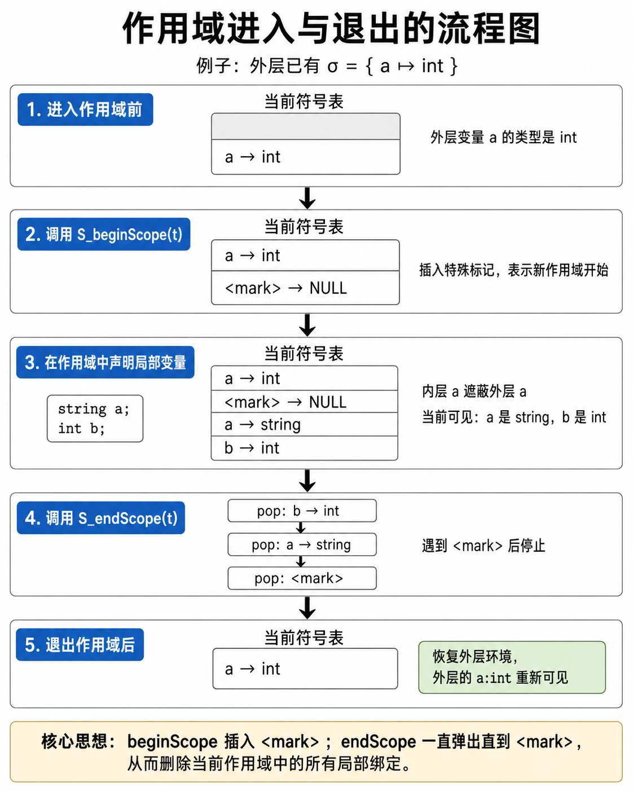
!!!

!!! question "如何精确弹出那些绑定"
在`beginScope`之后，我们如何准确地弹出那些绑定
!!!

#### **Auxiliary stack**

- 显示`symbol`被压入符号栈的顺序
- 当这个栈中的每个`symbol`被弹出时，它所在哈希桶中的头部绑定也会被移除
- `beginScope`:向栈中压入一个特殊标记
- `endScope`:不断从栈中弹出`symbol`，直到找到最上面的那个标记

- 可以把辅助栈集成到`Binder`结构中，方法是使用一个全局变量`top`，表示**表中最近一次被绑定的symbol**
- `Pushing`:把当前的`top`复制到`Binder`的`prevtop`字段中

```c
struct TAB_table_ {
  binder table[TABLESIZE];
  void *top;
}
```

一张符号表中有

- `table[TABLESIZE]`:哈希表数组
- `top`：记录最近一次插入的symbol

```c
t -> table[index] = Binder(key, value, t->table[index], t->top);
```

意思是：向哈希桶中插入一个新的绑定，同时把旧的`top`传给新的`Binder`

**函数创建一个新的绑定节点Binder**

```c
static binder Binder(void *key, void *value, binder next, void *prevtop) {
    binder b = checked_malloc(sizeof(*b));
    b->key = key;
    b->value = value;
    b->next = next;
    b->prevtop = prevtop;
    return b;
}
```

- `key`:symbol
- `value`:绑定的语义信息
- `next`:指向同一个哈希桶里的下一个绑定
- `prevtop`:记录插入当前绑定之前的`top`

!!! example
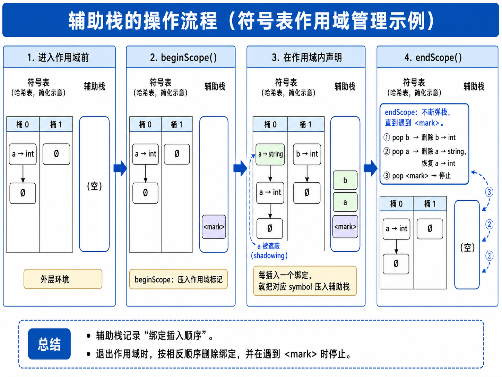
!!!

## 5.3 Type Checking

!!! question
- 什么是合法的类型表达式？
  - 例如`int`, `string`, `nil`, `array of int`...
- 如何定义两个类型是等价的？
- 类型检查规则是什么
!!!

### 5.3.1 Types in Tiger Programming Language

- 原始类型：`int`, `string`
> 它们是语言内置的基本类型
- 构造类型：由其他类型构造出来的 **record**和 **array**
  - 其他类型可以是原始类型、`record`和`array`

!!! example
```tiger
type point = {x:int, y:int}
type intArray = array of int
```

这里

- `point`是一个`record`类型
- `intArray`是一个`array`类型

它们都是由其他类型构造出来的
!!!

- 一个类型标识符的绑定是什么

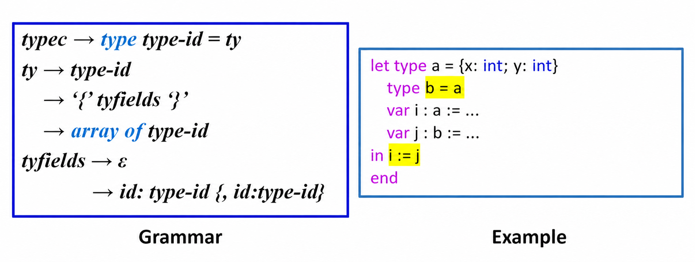

- 类型标识符的绑定是什么

> 左侧文法同上

```c
typedef struct Ty_ty_ *Ty_ty; // 指向类型结构体的指针
struct Ty_ty_ {
  enum{
    Ty_record, Ty_nil, Ty_int, Ty_string,Ty_array, Ty_name, Ty_void
  } kind;
  // union用来保存不同类型需要的具体信息
  union {
    Ty_fieldList record;
    Ty_ty array;
    struct {
      S_symbol sym;
      Ty_ty ty;
    } name;
  } u;
};
```

| kind        | 含义              |
| ----------- | ----------------- |
| `Ty_record` | record 类型       |
| `Ty_nil`    | nil 类型          |
| `Ty_int`    | int 类型          |
| `Ty_string` | string 类型       |
| `Ty_array`  | array 类型        |
| `Ty_name`   | 类型名 / 类型别名 |
| `Ty_void`   | 无返回值类型      |

`nil`和`void`也被作为类型表示出来

```
nil  -> Ty_nil
void -> Ty_void
```

- `nil`通常用于`record`的空值
  - `var r : recordType := nil`
- `void`通常表示没有返回值，比如某些语句表达式或过程调用 

```c
Ty_Name(sym, NULL)
```

> 先知道有一个类型名`sym`，但是它具体指向什么类型暂时还没填，等后面执行完，再把`NULL`填成真正的类型

用于处理`mutually recursive types`，相互递归类型

!!! example
```tiger
type a = {next: b}
type b = {prev: a}
```

这里`a`和`b`互相引用，但是问题是

- 分析`a`时，需要知道`b`
- 分析`b`时，需要知道`a`
!!!
所以编译器不能等完全知道真实类型后再加入符号表，而是先放一个**占位符**

**总结**：类型名在符号表中绑定到`Ty_ty`,而`Ty_ty`是Tiger编译器内部表示各种类型的统一数据结构

### 5.3.2 Type Equivalence

- `Name equivalence(NE)`:当且仅当`T1`和`T2`是由 **完全相同的类型声明**定义出来的**相同类型名**时，`T1`和`T2`等价

!!! example
```tiger
type A = {x:int, y:int}
type B = {x:int, y:int}
```

虽然A和B结构完全一样，但是它们来自两个不同的类型声明，所以在名字等价下：`A≠B`

也就是说：**结构一样，不代表类型一样**

如果是

```tiger
type A = {x:int, y:int}
type B = A
```

那么B是基于A定义的别名或引用，这时通常会认为它们指向同一个类型声明
!!!

- `Structural equivalence(SE)`:当且仅当`T1`和`T2`**是由完全相同的构造器**按 **相同的顺序**组成时，`T1`和`T2`等价

!!! example
```tiger
type A = {x:int, y:int}
type B = {x:int, y:int}
```

在结构等价下，它们都是由相同字段组成的`record`类型，所以：`A=B`
!!!

**Tiger使用name等价**

#### Type Equivalence in Tiger

- 每一个Tiger语言中的`record type expression`都会创建一个新的、不同的`record`类型

**Tiger非法表达式**

```tiger
let type a = {x: int, y: int}
    type b = {x: int, y: int}
    var i : a := ...
    var j : b := ...
in i = j
end
```

在`Tiger`中，a和b虽然是结构完全一样的变量，但是它们是由两个不同的`record type expression`创建出来的，所以`a≠b`

**Tiger合法表达式**

```tiger
let type a = {x: int, y: int}
    type b = a
    var i : a := ...
    var j : b := ...
in i = j
end
```

这里`b`不是重新创建一个新的`record`结构，而是直接引用已有的类型`a`，所以`a = b`

#### Namespaces in Tiger

- Tiger有两个彼此独立的命名空间
  - `Types`:类型
  - `Functions and variables`:函数和变量

类型名和变量/函数名分属两个命名空间，所以`type a`和`var a`可以共存；但是变量名和函数名**在同一命名空间**，所以`var a`会遮蔽`function a`

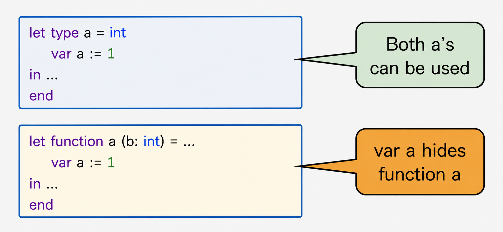