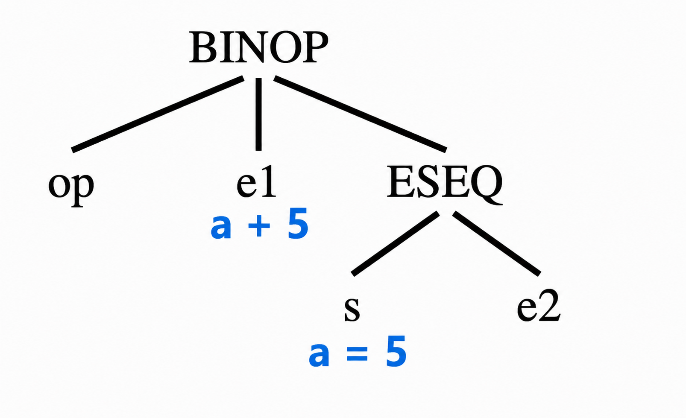
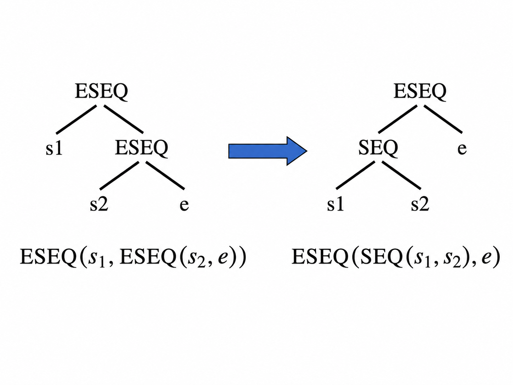
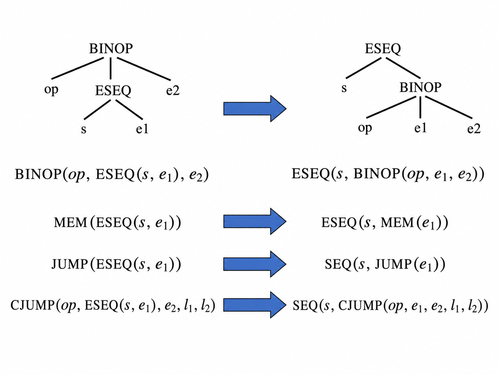
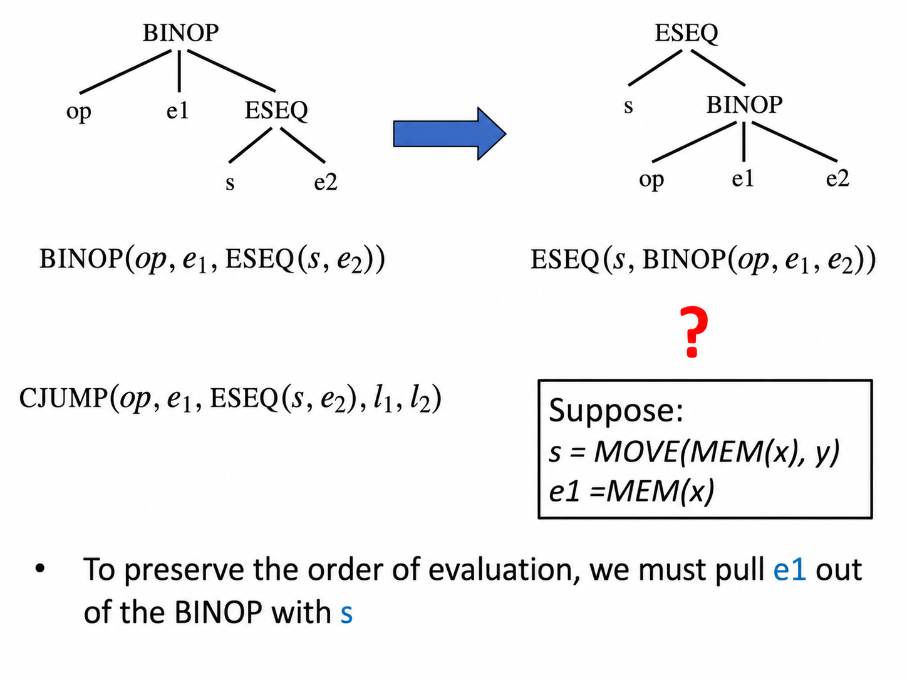
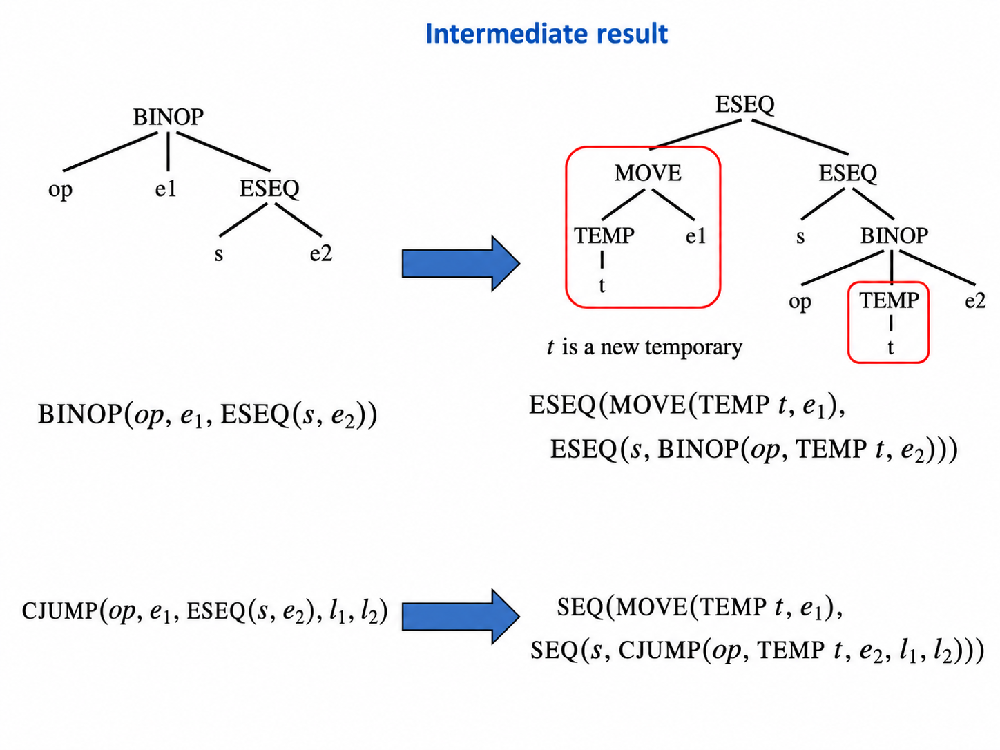
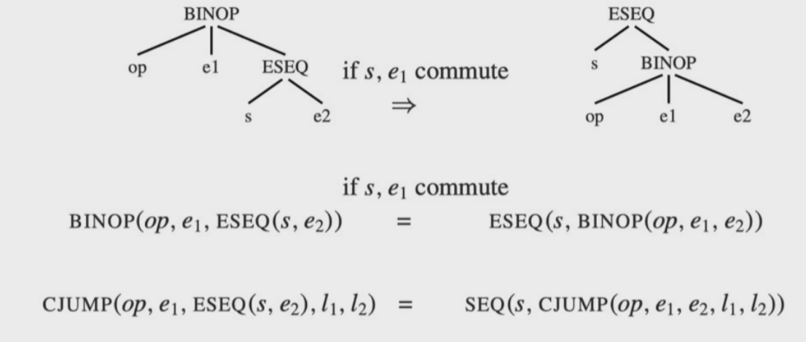
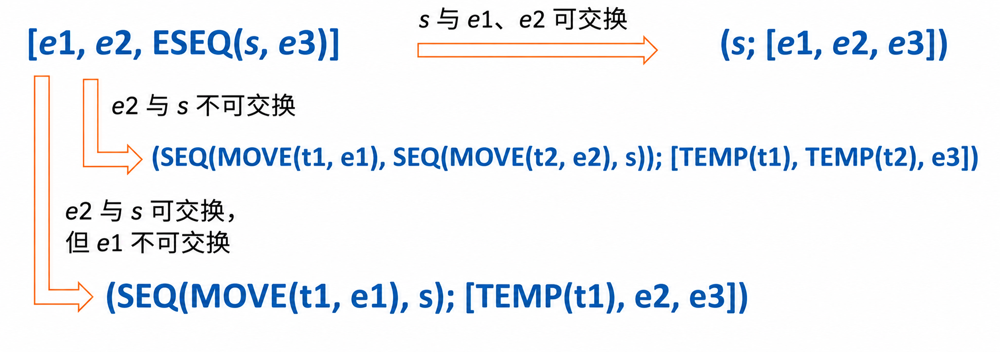
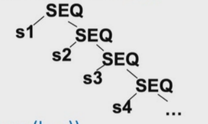

**Motivation**

- `IR`必须被翻译成汇编代码或者机器代码
- `Tree`语言中的操作符是经过仔细选择的，目的是尽量匹配大多数机器的能力
- 然而
  - `Tree`语言中某些方面并不能和机器语言完全对应
  - `Tree`语言中的某些方面会干扰编译器优化分析

**Mismatches: IR Trees vs Machine code**

1. `CJUMP`的问题

- `Tree IR`中的`CJUMP`是可以**跳到两个标签之一**
  - 如果`e`为真，跳转到`t`
  - 如果`e`为假，跳到`f`

```
CJUMP(e,t,f)
```

- 但是实际上机器中的条件跳转通常不是这样饿的，真实机器更常见的是

```asm
evaluate e
JNZ t
if-false code
t:...
```

> 也就是说真是机器的条件跳转通常**只有一个显式跳转目标**

- 如果条件成立，跳转到某个`label`
- 如果条件不成立，直接顺序执行下一条指令

这叫 **fall through**，也就是*自然落到下一条指令*


2. `ESEQ`出现在表达式内部很麻烦

表达式里面出现`ESEQ`节点是很不方便的

`ESEQ(s,e)`的意思是：

**先执行语句`s`，再计算表达式`e`，并返回`e`的值**

问题在于`s`是语句，可能有副作用


!!! example


- 如果先算`a+5`，再执行`ESEQ(a=5, e2)`，结果是一种情况
- 但如果先执行右边 `ESEQ(a = 5, e2)`，再算左边 `a + 5`，左边的 a 已经被改成 5，结果就可能不同。
!!!

- 理想情况下，编译器希望表达式的子表达式可以**按照任意顺序计算**，或者至少顺序非常明确
- 但是`ESEQ`把 *语句副作用*嵌套到表达式里面，就会破坏这种简单性


3. `CALL`出现在表达式内部也会有类似的问题

!!! example
```
BINOP(PLUS, CALL(f), CALL(g))
```

如果先调用`f`再调用`g`，结果和反过来调用可能不同，尤其当两个函数都有副作用时
!!!

编译器通常希望把`CALL`提出来，放到单独语句中，**先保存结果到临时变量，再继续计算**

4. 嵌套`CALL`的参数传递问题

如果一个`CALL`出现在另一个`CALL`的参数表达式中，那么编译器试图**把参数放进固定额的数寄存器**时，会产生问题

!!! example
```
CALL(f, [e1, CALL(g, [e2, ...])])
```

问题是现代机器通常使用**固定的参数寄存器**进行参数传递。

假设`e1`的结果先放到了`r1`，然后为了计算第二个参数，需要调用`g`。但是调用`g`时，它也可能要用`r1`传自己的参数或保存返回值，于是会覆盖原来`e1`放在`r1`中的值

因此嵌套调用需要被改写成更线性的形式

```
t1 := e1
t2 := CALL(g, [e2, ...])
CALL(f, [t1,t2])
```
!!!


!!! note "总结"
`Tree IR` 规范化前的四个主要问题：

- `CJUMP` 有两个跳转目标，但真实机器通常只有一个显式条件跳转目标，另一个方向靠 `fall through`。
- `ESEQ` 嵌在表达式里不方便，因为它包含有副作用的语句。
- `CALL` 嵌在表达式里也会造成求值顺序和副作用问题。
- `CALL` 嵌套在另一个 `CALL` 的参数中，会影响固定参数寄存器的使用。
!!!

**解决方案**

- 如何消除这些不匹配的情况？
- 我们可以把`Tree`分成三个阶段进行转换

1. 一棵树可以被重新写成一组`canonical tree`，也就是**规范化树**

    - 这些规范化树中**没有`SEQ`或`ESEQ`节点**
    - 这一步主要消除 **没有
    
!!! example
原来的`BINOP(PLUS, ESEQ(s, e1), e2)`规范化之后应该变成类似

```
s;
BINOP(PLUS, e1, e2)
```

也就是把副作用提前拿出来
!!!

2. 这组`canonical trees`会被分组成一组`basic blocks`，也就是基本块

   - 基本块内部不包含**跳转或标签**
   - 一个基本块的结构：一段顺序执行的代码，中间不能有`label`，也不能有`jump`，只有最后可以跳转

!!! example
```
LABEL L1
  stm1
  stm2
  stm3
  JUMP L2
```

这就是一个基本块
!!!

3. 基本块会被重新排列成一组`traces`

    - 在这些`traces`中，每个`CJUMP`后面会紧跟着它的`false label`
    - 这一步主要消除与`CJUMP`有关的不匹配，把`basic blocks`重新排列成`traces`
    - `trace`可以理解成：**按照可能执行的路径把基本块串起来**

## 8.1 Canonical  Trees

**第一阶段**：一棵`Tree`会被重写成一个`canonical trees`的列表

- `Canonical Trees`被定义为具有以下性质 
  - 没有`SEQ`或`ESEQ`节点
  - 每个`CALL`节点的父节点只能是`Exp(...)`或`MOVE(TEMP t, ...)`
    - `Exp(...)`：只需要调用函数，不关心返回值
    - `MOVE(TEMP t, ...)`：如果函数调用有返回值，函数调用结果必须先**保存到临时变量**
- `Property 1`:每棵`canonical tree`最多只包含一个`statement`节点，也就是根节点,其他节点全部都是非`ESEQ`的`expression`节点
- `Property 2`:`CALL`节点的子节点不能是子节点
- `Property 1 and Property 2`
  - `CALL`节点的父节点必须是`canonical tree`的根节点
  - 一棵`canonical tree`中最多只能有一个`CALL`节点，因为`Exp(...)`或`MOVE(TEMP t, ...)`最多只能包含一个`CALL`

为了执行第一阶段转换，我们需要：

1. 消除`ESEQ`

!!! example
```
BINOP(PLUS, ESEQ(s,e1), e2)
```

变成

```
s;
BINOP(PLUS, e1, e2)
```
!!!

2. 把`CALL`移动到顶层

!!! example
```
BINOP(PLUS, CALL(f), CONST 1)
```

规范化后变成

```
MOVE(TEMP t, CALL(f))
BINOP(PLUS, TEMP t, CONST 1)
```
!!!

3. 消除`SEQ`

!!! example
```
SEQ(s1, SEQ(s2, s3))
```

变成

```
s1
s2
s3
```
!!!

### 8.1.1 Transformations on ESEQ

如何消除`ESEQ`节点？

```
ESEQ(s,e)
```

- 消除`ESEQ`的基本思路是：**不断把`ESEQ`往树的上层提升，直到它能变成`SEQ`**



> 含义保持不变：先执行`s1`，再执行`s2`，最后计算`e`

#### 1. 当`ESEQ`出现在左操作数时

```
BINOP(op, ESEQ(s, e1), e2)
    =>
ESEQ(s, BINOP(op, e1, e2))
```


```
MEM(ESEQ(s, e1))
    =>
ESEQ(s, MEM(e1))
```

- 先执行`s`再把`e1`当地址进行内存读取

```
JUMP(ESEQ(s, e1))
    =>
SEQ(s, JUMP(e1))
```

- 先执行`s`,再把`e1`当地址进行内存读取

```
CJUMP(op, ESEQ(s, e1), e2, l1, l2)
    =>
SEQ(s, CJUMP(op, e1, e2, l1, l2))
```

- 如果条件跳转的左操作数里有`ESEQ`，那就先执行`s`，再用`e1`和`e2`做比较



#### 2. 当`ESEQ`出现在右操作时，不能总是直接提



这种情况是比较麻烦的

```
BINOP(op, e1, ESEQ(s, e2))
```

直觉上我们想变成

```
ESEQ(s, BINOP(op, e1, e2))
```

**但是这是不一定正确的**

原来的计算顺序通常应该是

```
先计算 e1
再执行 s
再计算 e2
最后做 BINOP
```

如果你直接改成

```
先执行 s
再计算 e1
再计算 e2
```

那`s`就被提前到了`e1`前面，可能改变程序结果


!!! example
```
s = MOVE(MEM(x), y)
e1 = MEM(x)
```

- `e1`会读取`x`指向的内存
- `s`会修改`x`指向的内存

这种操作就会导致执行的结果完全不同了，所以这类情况不能随便交换顺序
!!!

- 我们的解决方案是：**把`e1`保存到临时变量**

我们将`BINOP(op, e1, ESEQ(s, e2))`改成

```
ESEQ(
  MOVE(TEMP t, e1),
  ESEQ(
    s,
    BINOP(op, TEMP t, e2)
  )
)
```

这样就保留了原来的求值顺序：`e1->s->e2`

对于条件跳转也类似:`CJUMP(op, e1, ESEQ(s, e2), l1, l2)`不能直接变成`SEQ(s, CJUMP(op, e1, e2, l1, l2))`，而是要变成

```
SEQ(
  MOVE(TEMP t, e1),
  SEQ(
    s,
    CJUMP(op, TEMP t, e2, l1, l2)
  )
)
```

#### 3. 什么时候可以直接提s



这里之所以可以直接写成：

```
BINOP(op, e1, ESEQ(s, e2))
    =>
ESEQ(s, BINOP(op, e1, e2))
```

这里的关键条件是：`s`和`e1`是`commute`的

> `commute`也就是`s 和 e1 commute`和`先计算 e1 再执行 s`结果没有区别

如果`s`改动的临时变量和内存位置不会被`e1`引用，并且`s`和`e1`不会同时进行外部`I/O`，那么它们可以认为是`commute`



!!! question
怎么知道一个语句`s`是否能和一个表达式`e`交换顺序
!!!

我们在编译时并不总是能确定这一点，例如

```
s = MOVE(MEM(x), y)
e = MEM(z)
```

问题是`x`是否等于`z`(地址)，编译器可能是运行时才确定的地址

- 因此我们**保守地近似判断** (`conservatively approximate`) 语句是否可以交换：`commute(s,e)=True`
- 如果`s`和`e`确定可以交换：`commute(s,e)=False`

否则就认为不能交换

`commute`函数会非常朴素地估计一个语句能否和一个表达式交换

- 一个常量可以和任何语句交换
- 一个空语句可以和任何表达式交换
  - `EXP(CONST X)`
- 其他情况下不能交换

```cpp
// 判断一个语句是不是空操作
static bool isNop(T_stm x) {
    return x->kind == T_EXP && x -> u.EXP->kind == T_CONST;
}
// 判断语句x和表达式y交换顺序
static bool commute(T_stmt x, T_exp y) {
    return isNop(x) || y->kind == T_NAME || y->kind == T_CONST;
}
```

```
x是statement，也就是可能有副作用的语句s
y是expression，也就是要被求值的表达式e
```

判断语句`x`能不能和表达式`y`交换顺序，返回`true`的情况只有三种

- `x`是空语句
- `T_NAME`通常表示一个标签地址，例如`NAME L1`
  - 它只是一个符号地址，没有副作用，也不会受到普通语句影响，所以可以交换
- `y`是`T_CONST`(常量)，常量表达式不会被任何语句改变，所以可以和任何语句交换

!!! example
```
MOVE(TEMP x, CONST 10)
CONST 5
```

不管先执行哪个，`CONST 5`都是5
!!!


**核心规则总结**

| 原形式                                        | 安全转换                                                  |
| --------------------------------------------- | --------------------------------------------------------- |
| `ESEQ(s1, ESEQ(s2, e))`                       | `ESEQ(SEQ(s1, s2), e)`                                    |
| `BINOP(op, ESEQ(s, e1), e2)`                  | `ESEQ(s, BINOP(op, e1, e2))`                              |
| `MEM(ESEQ(s, e1))`                            | `ESEQ(s, MEM(e1))`                                        |
| `JUMP(ESEQ(s, e1))`                           | `SEQ(s, JUMP(e1))`                                        |
| `CJUMP(op, ESEQ(s, e1), e2, l1, l2)`          | `SEQ(s, CJUMP(op, e1, e2, l1, l2))`                       |
| `BINOP(op, e1, ESEQ(s, e2))` 且 `s,e1` 可交换 | `ESEQ(s, BINOP(op, e1, e2))`                              |
| `BINOP(op, e1, ESEQ(s, e2))` 且不可交换       | `ESEQ(MOVE(TEMP t,e1), ESEQ(s, BINOP(op,TEMP t,e2)))`     |
| `CJUMP(op, e1, ESEQ(s,e2),l1,l2)` 且不可交换  | `SEQ(MOVE(TEMP t,e1), SEQ(s, CJUMP(op,TEMP t,e2,l1,l2)))` |

### 8.1.2 General Rewriting Rules

- 对于每一种`Tree statement`或`expression`，都可以制定类似的规则，把其中的`ESEQ`从`statement`或`expression`里面提取出来
- 给定一个`Tiger`程序，也就是一个`T_stm`，我们可以递归地执行这种转换，把所有`ESEQ`越提越高，直到它们可以变成`SEQ`节点

实际上，**任何Tree节点，只要它的子表达式里面有ESEQ，都可以类似处理**

所有编译器会递归地做

```
先处理子表达式
把子表达式中的ESEQ提出来
再重建当前节点
```

一直重复，直到整棵树里面不再有嵌套的ESEQ

- 一般来说，对于每一种`Tree statement/expression`，我们都可以识别出它的子表达式

例如

```
[e1. e2, ESEQ(s, e3)]
```

- `Rewrite`的作用是：从这些子表达式中提取出`statement`，并更新这个`statement/expression`的子表达式
  - 情况一：s可以和前面的`e1,e2`交换
  - 情况二：`e2`不可以和`s`交换
  - 情况三：`e2`可以和`s`交换，但是`e1`不可以



**算法**

- `step 1`:为每一种`Tree statement`或`expression`制作一个子表达式(`subexpression-extraction`)提取方法
  - 从子表达式中提取出其中的`statement`，并把每个子表达式转换成`ESEQ-clean version`，也就是没有`ESEQ`的干净版本

!!! example
一个`Tree`节点通常有若干子表达式

例如`BINOP(op, e1, e2)`，它的子表达式是`[e1,e2,e3]`；`CALL(f,[e1,e2,e3])`的子表达式是`[e1,e2,e3]`

如果其中某个子表达式是`ESEQ(s,e)`，那么说明这个表达式里面藏着一个`statement s`

那么这时我们要做的事情就是

- 把`s`抽出来，把原来的`ESEQ(s,e)`替换成干净的`e`

比如:`[e1,e2,ESEQ(s,e3)]`，经过提取后变成

- 提取出的`statement:s`
- 清理后的表达式列表`[e1,e2,e3]`
- 如果`s`不能和前面的`e1/e2`交换，就还要先**把前面的表达式保存到临时变量**中
!!!

- `step 2`:用干净子表达式**重新构造原节点**

!!! example
```
BINOP(op,e1,ESEQ(s,e2))
```

清理后重新构造为：

```
BINOP(op, e1, e2)
```

然后再和抽出来的`s`组合


```
ESEQ(s, BINOP(op, e1, e2))
```

如果原来是`statement`，比如

```
MOVE(dst, src)
```

那么清理子表达式后，也要重新构造一个新的

```
MOVE(clean_dst, clean_src)
```

然后用`SEQ`和提取出来的`statement`连接
!!!

!!! question
为什么有时候用`SEQ`，有时候用`ESEQ`
!!!

因为要看最终结果是`statement`还是`expression`

- 如果最终节点是`statement`，就用`SEQ(s, new_statement)`
  - 先执行提取出的`s`
  - 再执行新的`statement`

!!! example
```
JUMP(ESEQ(s,e))
```

会变成

```
SEQ(s, JUMP(e))
```
!!!

- 如果最终节点是`expression`，就用`ESEQ(s, new_expression)`
  - 先执行提取出的`s`
  - 再计算出新的`expression`，并返回它的值

!!! example
```
BINOP(op, ESEQ(s, e1), e2)
```

会变成

```
ESEQ(s, BINOP(op, e1, e2))
```
!!!

**核心流程**

```
处理一个 Tree 节点 node：

1. 找出 node 的所有子表达式。
2. 对每个子表达式递归消除 ESEQ。
3. 如果子表达式中提取出了 statement，就把这些 statement 收集起来。
4. 用清理后的子表达式重新构造 node。
5. 如果 node 是 statement：
       用 SEQ(statement, new_node) 连接。
   如果 node 是 expression：
       用 ESEQ(statement, new_node) 连接。
```

### 8.1.3 Move CALLs to Top Level

- `Tree`语言允许`CALL`节点作为子表达式使用

也就是说，`Tree IR`里可以出现这种形式：`BINOP(PLUS,CALL(...),CALL(...))`

- 调用一个函数，得到一个返回值
- 再调用一个函数，得到另一个返回值
- 最后把两个返回值相加 

然而，每个函数都会把自己的返回值放到**同一个专门的返回值寄存器**中：

```
TEMP(RV)
```

> 这里`RV`可以理解成`return value register`，也就是返回值寄存器

!!! example
```
BINOP(PLUS, CALL(...), CALL(...))
```

第二个`CALL`会在`PLUS`执行之前覆盖`RV`寄存器
!!!

**idea**:立即把*每个返回值赋给一个新的临时寄存器*

**转换规则**：

```
CALL(f,args)
```

变成

```
ESEQ(
  MOVE(TEMP t, CALL(f, args)),
  TEMP t
)
```

### 8.1.4 A Linear List of Statements

- 当整个函数体`s0`按照重写规则处理之后，结果是一棵新的树`s0'`，其中所有的`SEQ`节点都靠近树的顶部

!!! example
```
SEQ(SEQ(SEQ(..., sx),sy),sz)
```

也就是很多`SEQ`嵌套在一起
!!!

- 我们反复应用下面的规则：

```
SEQ(SEQ(a, b), c) = SEQ(a, SEQ(b, c))
```

意思是：把左嵌套的`SEQ`改成右嵌套的`SEQ`

- `s0'`会被线性化成下面这种形式的语句：

```
SEQ(s1, SEQ(s2, ..., SEQ(sn-1, sn)...))
```



这样我们就可以把它看成一个简单的语句列表：`s1,s2...sn`，并且每个`si`都不包含`SEQ`或`ESEQ`节点

## 8.2 Taming Conditional Branches

