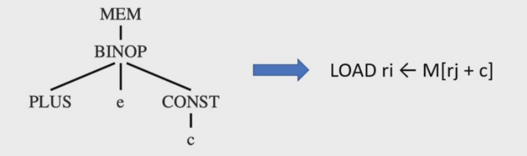
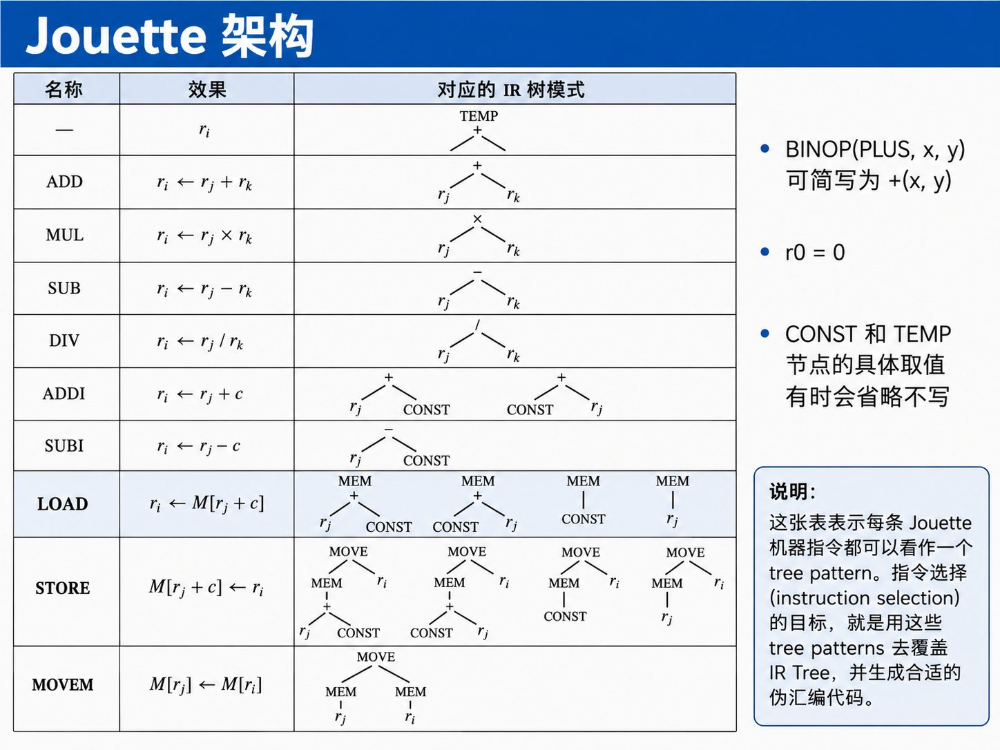
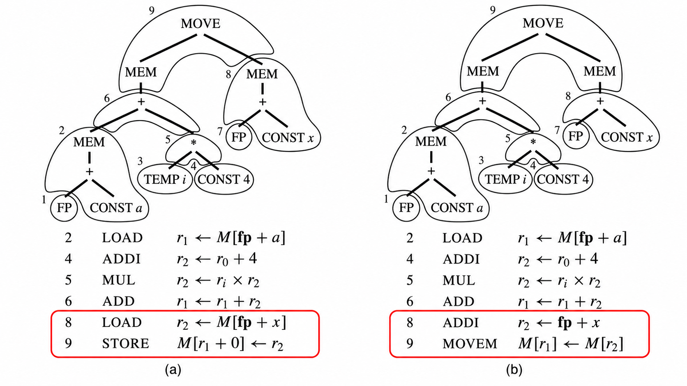
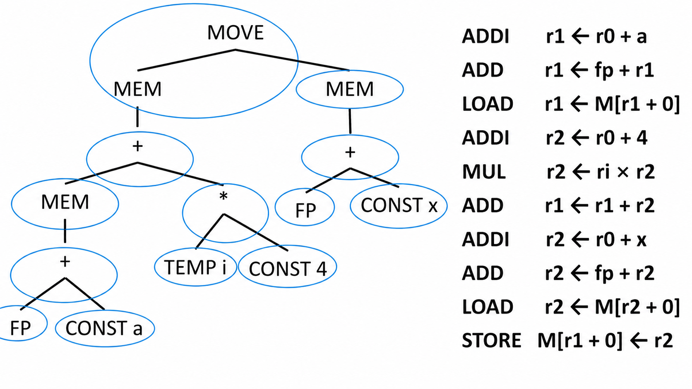

`Chapter 9`的核心任务是把`CHapter 8`得到的`canonical IR Trees`翻译成`abstract assembly code`，也就是为`IR Tree`重的表达式和语句选择合适的机器指令。此时生成的汇编仍然使用抽象寄存器或者临时变量，因此叫`pseudo-assembly`或`abstract assembly`。真正把这些临时变量映射到真实寄存器，是后续`Register Allocation`的任务

 ## 9.1 Instruction Selection

 ### 9.1.1 Why and What

 - 中间表示语言，也就是Tree IR，每个树节点只表示一个操作
   - `fetch,store,addition,subtraction,conditional jump, ...`
   - `Tree IR`的设计比较原子化，也就是说，每个节点只负责一个简单操作
- 但是，真实机器的一条指令通常可以同时完成多个基本操作

!!! example

!!!

- 指令选择阶段的任务是 **给指定的中间表示树找到合适的机器指令来实现它**

### 9.1.2 Implementation

使用`pattern matching techniques`来选择机器指令，使这些机器指令能够匹配程序`IR`的某些片段

- 如果`IR`是树形的，那么自然适合在树上做匹配
  - 输入是`tree pattern`，也就是树形模式
  - 例如：动态规划的匹配方法

> 线性结构的适合使用某种字符串匹配方法，这里我们暂时不会讨论 

### 9.1.3 Tree Patterns

- 每一条机器指令都可以表示成`IR Tree`的一个片段，这个片段称为`tree pattern`
- `Instruction`：**用最少数量的`tree pattern`来填满这棵树**
  - `Tiling`:用互不重叠的`tree pattern`覆盖整棵`IR Tree`

!!! example
**细粒度覆盖**

```
TEMP fp
CONST 8
BINOP(PLUS, TEMP fp, CONST 8)
MEM(...)
```

可能生成

```asm
r1 <- fp
r2 <- 8
r3 <- r1 + r2
r4 <- M[r3]
```

这是很低效的

**用大pattern覆盖**

直接用一个pattern：`MEM(BINOP(PLUS, TEMP fp, CONST 8))`

生成

```asm
LOAD r4 <- M[fp*8]
```
!!!

- 为了说明指令选择，我们使用教材中虚构的`Jouette architecture`



一些关于`Jouette Architecture`的说明

- 寄存器`r0`总是存储0
- 一些指令和不止一种`tree pattern`相关

### 9.1.4 Tree Pattern Example

- 使用`tree-based IR`做指令选择的基本思想是：**tilling the IR tree**，也就是用指令模板去覆盖`IR Tree`
- 这些`tiles`是合法机器指令对应的一组`tree patterns`

!!! example
下面这棵树就是`a[i]:= x`的`IR Tree`

![a[i]:=x的IR Tree](image-213.png)
!!!

这条指令的`IR Tree`可以用两种方式`tiled`



- `Tiles 1,3,7`不会和机器指令产生关联，因为它们只是寄存器
- 我们总是可以用很小的`tiles`来覆盖树，每个`tile`只覆盖一个节点
- 对于`a[i]:=x`,这种`tiling`如下

