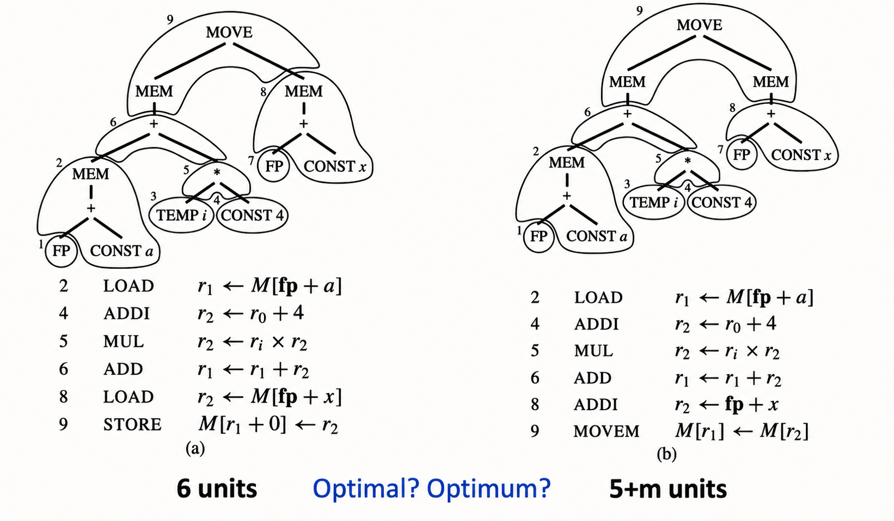
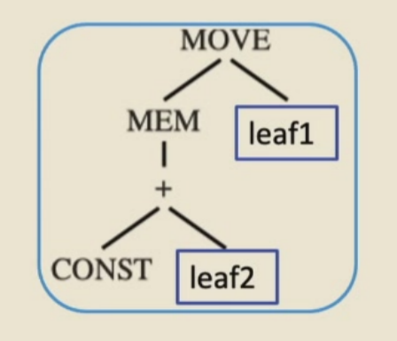
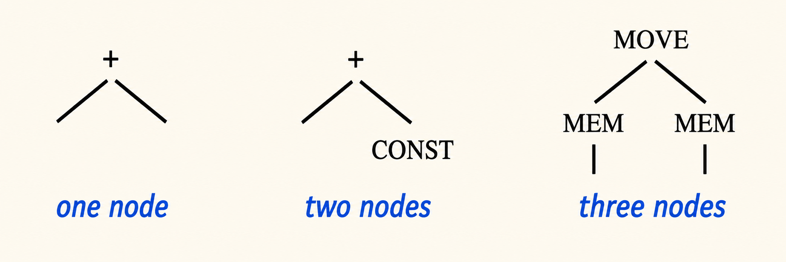
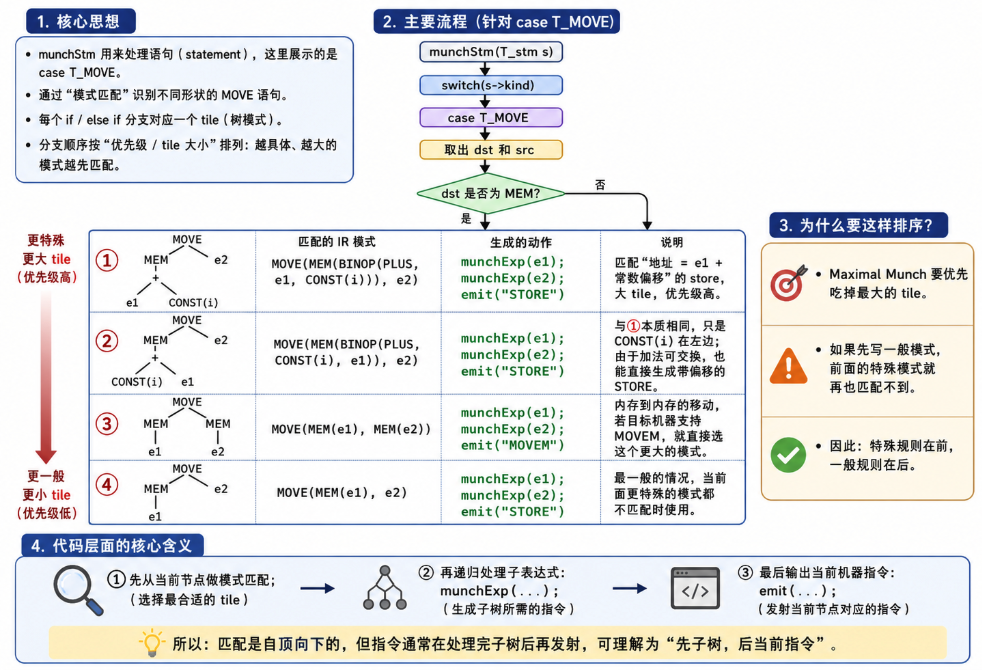
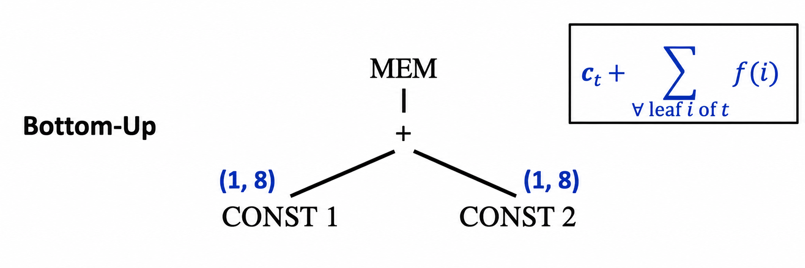
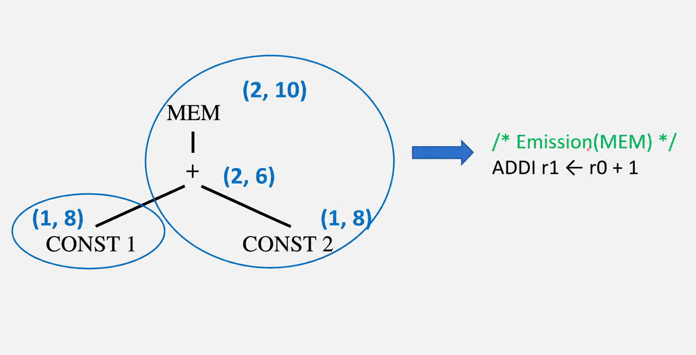

`Chapter 9`的核心任务是把`CHapter 8`得到的`canonical IR Trees`翻译成`abstract assembly code`，也就是为`IR Tree`重的表达式和语句选择合适的机器指令。此时生成的汇编仍然使用抽象寄存器或者临时变量，因此叫`pseudo-assembly`或`abstract assembly`。真正把这些临时变量映射到真实寄存器，是后续`Register Allocation`的任务

 ## 9.1 Instruction Selection

 ### 9.1.1 Why and What

 - 中间表示语言，也就是Tree IR，每个树节点只表示一个操作
   - `fetch,store,addition,subtraction,conditional jump, ...`
   - `Tree IR`的设计比较原子化，也就是说，每个节点只负责一个简单操作
- 但是，真实机器的一条指令通常可以同时完成多个基本操作

!!! example

!!!

- 指令选择阶段的任务是 **给指定的中间表示树找到合适的机器指令来实现它**

### 9.1.2 Implementation

使用`pattern matching techniques`来选择机器指令，使这些机器指令能够匹配程序`IR`的某些片段

- 如果`IR`是树形的，那么自然适合在树上做匹配
  - 输入是`tree pattern`，也就是树形模式
  - 例如：动态规划的匹配方法

> 线性结构的适合使用某种字符串匹配方法，这里我们暂时不会讨论 

### 9.1.3 Tree Patterns

- 每一条机器指令都可以表示成`IR Tree`的一个片段，这个片段称为`tree pattern`
- `Instruction`：**用最少数量的`tree pattern`来填满这棵树**
  - `Tiling`:用互不重叠的`tree pattern`覆盖整棵`IR Tree`

!!! example
**细粒度覆盖**

```
TEMP fp
CONST 8
BINOP(PLUS, TEMP fp, CONST 8)
MEM(...)
```

可能生成

```asm
r1 <- fp
r2 <- 8
r3 <- r1 + r2
r4 <- M[r3]
```

这是很低效的

**用大pattern覆盖**

直接用一个pattern：`MEM(BINOP(PLUS, TEMP fp, CONST 8))`

生成

```asm
LOAD r4 <- M[fp*8]
```
!!!

- 为了说明指令选择，我们使用教材中虚构的`Jouette architecture`


一些关于`Jouette Architecture`的说明

- 寄存器`r0`总是存储0
- 一些指令和不止一种`tree pattern`相关

### 9.1.4 Tree Pattern Example

- 使用`tree-based IR`做指令选择的基本思想是：**tilling the IR tree**，也就是用指令模板去覆盖`IR Tree`
- 这些`tiles`是合法机器指令对应的一组`tree patterns`

!!! example
下面这棵树就是`a[i]:= x`的`IR Tree`

![a[i]:=x的IR Tree](image-213.png)
!!!

这条指令的`IR Tree`可以用两种方式`tiled`


- `Tiles 1,3,7`不会和机器指令产生关联，因为它们只是寄存器
- 我们总是可以用很小的`tiles`来覆盖树，每个`tile`只覆盖一个节点
- 对于`a[i]:=x`,这种`tiling`如下


### 9.1.5 Optimal and Optimum Tilings

- 一棵`IR Tree`可以有多种`tiling`方式
- `Best tiling`：成本最低的指令序列
  - 对于**单发射固定延迟**（`single issue fixed-latency`）的机器来说，通常意味着使用最少数量的指令
- `Optimum tiling`:所有`tile`的总代价达到全局最低的`tiling`，也就是全局意义上的 **最好**
- `Optimal tiling`:不存在两个相邻的`tiling`可以被合并成一个更低成本`tile`的`tiling`，也就是局部意义上的 **最好**


如果某个`tree pattern`可以被拆成几个`tile`，而且拆开之后总代价更低，那么就应该把这个`pattern`从`tile catalog`中删除

> 全局最优肯定不会有局部能改进的地方；但是局部不能改进，不代表全局一定最优

!!! example "Optimal and Optimum Tilings"
- 假设每条指令的代价都是`1`，除了`MOVEN`，它的代价是`m`个单位


!!!

## 9.2 Algorithms for Instruction Selection

### 9.2.1 Maximal Munch

> 最大匹配算法

**Maximal Munch**:用于得到`optimal tiling`的算法

- 假设：*更大的tile=更好的tile*
- 主要思想：**贪心思想**
  - 采用自顶向下策略
  - 对当前节点，用能够匹配的最大`tile`覆盖它

!!! example


- 蓝色框表示当前能匹配的较大`tile`，它覆盖了从`MOVE`开始的一部分树
- 剩下`leaf1`,`leaf2`作为子树继续处理
!!!

**整体过程**

1. 从树的根节点开始，找到能匹配的最大`tile`
2. 用这个`tile`覆盖根节点，以及根节点附近的若干其他节点，剩下几个子树
3. 对每个剩余子树重复同样的算法

**最大tile**：指包含最多节点的`tile`



- 指令会以`reverse order`(逆序)生成
- 如果根节点处有两个大小相同的`tile`都能匹配，那么任选一个即可


!!! example
- 采用自顶向下策略
- 用最大的`tile`覆盖当前节点
- 对剩下的子树重复这个过程

`a[i] = x`这个表达式的树可以简化写成：

```
MOVE
├── MEM( MEM(fp+a) + i*4 )
└── MEM(fp+x)
```

- 左边地址：`address(a[i]) = MEM(fp+a) + i*4`
- 右边值：`value(x) = MEM(fp+x)`
- 最终赋值：`M[address(a[i])] = value(x)`
!!!

#### Implementation

- 两个递归函数
  - `munchStm`:用于处理`statements`
  - `munchExp`:用于处理`expressions`
- `munchExp`的每个分支都会匹配一个`tile`
- 这些分支按照`tile`的优先级排列，也就是 **最大的tile**放在最前面

下面是`muchStm`处理`MOVE`语句的一部分伪代码

```cpp
zstatic void munchStm(T_stm s) {
    switch(s->kind) {
        case T_MOVE: {
            T_exp dst = s->u.MOVE.dst;
            T_exp src = s->u.MOVE.src;

            if (dst->kind == T_MEM) {
                ...
            }
        }
    }
}
```

`...`内部会包含各种`if-else`语句是在匹配不同的`tree pattern`

**匹配MOVE(MEM(BINOP(PLUS, e1, CONST(i))), e2)**

```c
/* MOVE(MEM(BINOP(PLUS, e1, CONST(i))), e2) */
munchExp(e1);
munchExp(e2);
emit("STORE");
```

这匹配的`IR`的形状是

```
MOVE
├── MEM
│   └── BINOP(PLUS)
│       ├── e1
│       └── CONST(i)
└── e2
```

- munchExp(e1) 生成地址基址 r1
- munchExp(e2) 生成要存储的值 r2
- emit("STORE") 输出 store 指令



### 9.2.2 Dynamical Programming

`Maximal munch`总是能找到一个`optimal tilling`，但是不一定能找到`optimum tilling`

> 主要是因为它是自顶向下工作的

**Dynamic Programming**:可以基于每个子问题的最优解，找到整体的最优解

- 它是 **自底向上**工作的
- 给树中的每个节点分配一个`cost`(代价)
- 节点`x`的代价，记作`f(x)`，表示：*覆盖以`x`为根的子树的最佳tiling的代价*
  - $f(x) = min_{\forall\text{tile t covering x}}(c_t + \Sigma_{\forall\text{leaf i of t}}f(i))$
  - 对于节点x，尝试所有能覆盖它的`tile`，计算每种选择的总代价，然后**取最小值**
  - 每种选择的总代价由两部分组成：**当前tile的代价+剩余子树的最优代价**

#### 1. Detail

给定一棵节点为`n`的`IR Tree`:

- 首先，递归地求出节点`n`的所有孩子节点，孙子节点等的代价
- 然后，把每一种`tree pattern`，也就是每一种`tile`类型，尝试和节点`n`进行匹配
- 每个`tile`由零个或者多个叶子节点，这些`leaf`位置可以继续接上子树
- 对于每一个能够在节点`n`处匹配成功的`tile t`，如果它的代价是$c_t$，那么这个`tile`的总代价是$c_t + \text{这个tile各个leaf子树的最优代价之和}$

> 因为动态规划是自底向上做的，所以`leaf`对应子树的最优代价`f(i)`已经提前算好了

!!! example
- `(a,b)`:
  - `a`表示最小代价
  - `b`表示对应的`pattern`编号

> `(1,8)`:覆盖这个节点的最小代价是`1`,采用的是第`8`号`pattern`



考虑`CONST`节点：

- 唯一能匹配`CONST`的`tile`是`ADDI`指令，代价是`1`
- 第`8`号`pattern`没有`leaves`

| Pattern(Tile) | Cost | Leaves Cost | Total |
| ------------- | ---: | ----------: | ----: |
| `(8) CONST`   |    1 |           0 |     1 |

所以我们在每个`CONST`节点旁边标注`(1, 8)`

考虑`+`节点：有好几个`tree pattern`都可以匹配这个`+`节点

| Pattern(Tile)      | Cost | Leaves Cost | Total |
| ------------------ | ---: | ----------: | ----: |
| `(2) +(e1, e2)`    |    1 |           2 |     3 |
| `(6) +(CONST, e1)` |    1 |           1 |     2 |
| `(7) +(e1, CONST)` |    1 |           1 |     2 |

在动态规划算法中我们总是要选择小的`pattern`，所以`+`可以标记为`(2,6)`或`(2, 7)`
!!!

#### 2. Instruction Emission（指令发射）

- 一旦根节点的`cost`被找到，也就是整棵树的`cost`被找到，`instruction emission`阶段就开始了
- 对于接地啊`n`(`Emission(node n)`):
  - 对于在节点`n`处选中的`tile`的每一个`leaf li`，执行`Emission(li)`
  - 然后发射在节点`n`处匹配到的指令，类似于`reverse order`思想：先处理子树，再发射当前节点对应的指令




#### 3. Fast Matching

`Maximal Munch`和动态规划算法都会检查所有能够匹配某个节点的`tiles`

- 优化思想：**根据当前节点的label，也就是节点类型，快速缩小匹配范围**
- 一个`tile`能够匹配，当且仅当：**这个`tile`中每个非叶子节点的标签都和`IR Tree`中对应节点的操作符相同**
  - 例如操作符包括：`MEM, CONST, BINOP 等`

!!! example
`IR Tree`中每个节点都有自己的类型，例如

```
MEM
BINOP
CONST
TEMP
MOVE
CALL
```

这些节点类型就可以看作是`label`

比如这棵树：

```
     MEM
      |
    BINOP
  /   |  \
op   TEMP CONST
```

- 根节点的`label`是`MEM`
- 中间节点的`label`是`BINOP(PLUS)`
- 叶子结点可能是`TEMP,CONST`
!!!

- 为了在树的节点`n`处匹配`tile`,可以使用节点`n`的标签写一个`case`语句

```cpp
match(n) {
    switch(label(n)) {
        case MEM: ...
        case BINOP: ...
        case CONST: ...
    }
}
```

!!! example
一个`tile`是机器指令对应的`tree pattern

```
MEM
 |
+
/ \
e CONST
```

它要匹配某棵`IR Tree`的某个位置，就要求 *tile的非叶子节点结构和`IR Tree`对应位置一致*

如果当前`IR Tree`是：

```
MEM
 |
+
/ \
TEMP CONST
```

那么它就可以匹配上面的`LOAD` tile，因为`
- tile`根节点是`MEM`，树根也是`MEM`
!!!

- 目标：保证`IR Tree`中的每个节点都不需要重复查看两次
### 9.2.3 Tree Grammer

## 9.3 CISC Machines

## 9.4 Instruction Selection for the Tiger Compiler