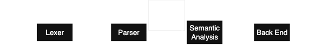

!!! note "lab1框架"
```plaintext
src
├── ast
│   ├── tree.cpp    // AST 节点的实现
│   └── tree.hpp
├── common.hpp
├── lexer
│   └── lexer.l     // 词法分析器
├── main.cpp
└── parser
    └── parser.y    // 语法分析器
```
!!!

编译器工作的第一步：将源代码转换为**抽象语法树**(AST)，以便后续处理

- 首先通过词法分析将输入字符串切分为一个个token
- 然后通过**语法分析**，根据`SysY`语言的文法规则，将这些token组织成一个抽象语法树

**模板代码是如何跑起来的**


1. **构建(Build)阶段**：首先，项目根目录的`Makefile`会调用Flex将我们编写的词法规则文件`lexer.l`编译成一个`layer.yy.cc`(C++源文件)以及接口头文件。随后`g++`将这些由工具自动生成的代码，连通`main.cpp`与AST节点实现代码，一起编译并链接成最终的可执行程序`compiler`
2. **运行(Runtime)阶段**：当执行`./compiler input.sy`时，`main`函数会**打开用户输入的源代码文件**，将其文件指针赋给全局接口变量`yyin`(词法分析器预设的输入源)，然后调用Bison提供的核心接口`yyparse()`,正式把接力棒传递给语法分析器
   - `parse`模块：进入`yyparse()`后，Parse尝试按照我们写的层级语法公式进行解析。它**不会自己从头读取源文件**，而是每次碰到缺少后续单词的情况，就会调用`Flex`暴露的接口`yylex()`，向`Lexer`索要下一个token
   - `lexer`模块：每当`yylex()`被Parser调用，Lexer就会从**由Main传入**的`yyin`**缓冲区**中**读取字符流**，利用**自身生成的自动状态机**判断出它**属于哪个token类型**(例如关键字、变量名、数字常量等)。它将该单词蕴含的可能字面量数值赋值给**全局通信通道**`yylval`交给Parser，并向其`return`该**Token的种类ID**
   - **语法树构造**：Parser拿到Token后在内部进行移进/规约(Shift/Reduce)。当一组Tokens组成的**语法规则匹配成功**时，它会执行我们在`parser.y`文件中手写的C++代码片段(Actions)，在堆上**动态实例化**`AST::Node`派生子节点，把它们**挂载到语法树上**

!!! tips "`lexer.yy.cc`与`parser.tab.cc`这对母体"
- `yylex()`诞生于`lexer.yy.cc`:`yylex()`是**词法分析**的核心驱动函数。执行`flex()`命令时，它会把`lexer.l`里面的正则规则
- `yyparse()`诞生于`parser.tab.cc`:同理，`yyparse`的核心移进规约算法是在执行`bison`命令后被自动生硬编码写进`parsera.tab.cc`。在Parser解析代码的环节中，`parser.tab.cc`跨文件在不断地调用跑在`lexer.yy.cc`里的取词机器`yylex()`
!!!

在这一阶段我们只关注语法结构的正确性，但是不处理语义问题(如数组越界、类型不匹配等)。我们需要构建出正确的抽象语法树，为后续的编译阶段做好准备

## 词法分析

- 目的：将源代码（若干个字符）解析成一个个token
- token是词法分析的最小单元，表示一个程序有意义的最小分割，下表是常见的token类型和样例

|类型|样例|
|标识符|`x`,`sum`,`i`|
|关键字|`if`,`while`,`return`|
|分隔符|`{`,`}`,`(`,`)`,`;`|
|运算符|`+`,`<`,`=`|
|字面量|`true`,`"hello world"`|
|注释|`//this is a comment`|

!!! example 
```cpp
x = a + b * 2;
```

上面的代码会被解析为

`[(identifier, x),(operator, =),(identifier, a),(operator, +),(identifier, b),(operator, *),(literal, 2),(operator, ;))]`
!!!

词法分析并不复杂，只需要简单的**遍历源代码中的字符**，根据字符的值分别判断即可

!!! tips
C++框架中我们使用`Flex`进行词法分析。词法分析器的定义在`lexer/lexer.l`中，我们需要根据`SysY`语言的词法规则，定义更多的token类型，具体可参考附录中的Flex与词法分析部分
!!!

## 语法分析

由词法分析得到的一个个token在语法分析阶段你进行进一步的解析。具体来说，需要：

1. 对于一串合法的`tokens`，生成语法树
2. 对于一串不合法的`token`，检测到可能的错误并报告给用户

- 词法分析由 **正则文法**为基础
- 语法分析由 **上下文无关文法**为基础

!!! note "抽象语法树"
抽象语法树(Abstract Syntax Tree)是parse Tree的一个保留核心细节的化简版本，被输入进语义分析部分



parse tree严格遵循Grammer，它的目的是 **证明一段代码合乎语法**。因此，它保留了每一个字符的细节，有许多冗余信息。而AST只保留变量名、操作符、函数调用等核心逻辑，以便后续进行语义分析
!!!

!!! example "抽象语法树的if-else语句的案例"
```c
if(a < b) {
    c = 2;
    return c;
}else {
    c = 3;
}
```

对应的抽象语法树为：


!!!

**模板代码中的语法分析与抽象语法树**

在`ast/tree.hpp`中定义了AST的节点类型，其中`AST::Node`是所有节点的基类，它的定义如下

```cpp
class Node;
using NodePtr = std::shared_ptr<Node>;
class Node {
public:
    int lineno;

    virtual std::vector<NodePtr> get_children() {
        return std::vector<NodePtr>();
        void print_tree(std::string prefix = "", std::string info_prefix = "");
        virtual std::string to_string() = 0;

        Node(): lineo(yylineo) {}
        virtual ~Node() = default; 
    }
}
```

## 具体实现


### 一、实现思路

#### 1.1 实验目标

构建一个**词法分析器**和**语法分析器**，将 SysY 语言源代码转换为**抽象语法树（AST）**。

#### 1.2 工具选择

使用 **Flex** 和 **Bison** 作为词法和语法分析工具，C++ 作为实现语言，利用智能指针和 RTTI 管理 AST 节点。

#### 1.3 实现步骤

##### 第一步：扩展词法分析器

修改 `src/lexer/lexer.l`，添加 SysY 语言所需的所有 token：

| 类型       | Token                               |
| ---------- | ----------------------------------- |
| 算术运算符 | `MUL`, `DIV`, `MOD`                 |
| 关系运算符 | `LT`, `GT`, `LE`, `GE`, `EQ`, `NEQ` |
| 逻辑运算符 | `AND`, `OR`, `NOT`                  |
| 关键字     | `IF`, `ELSE`, `WHILE`, `VOID`       |
| 分隔符     | `LSQB`, `RSQB`                      |

**关键实现**：添加八进制和十六进制数的正则匹配规则：
```c
octal 0[0-7]+
hex 0[xX][0-9a-fA-F]+
```

##### 第二步：扩展 AST 节点

修改 `src/ast/tree.hpp`，添加所需节点类：

| 节点类        | 作用                                            |
| ------------- | ----------------------------------------------- |
| `IfStmt`      | if 语句                                         |
| `WhileStmt`   | while 语句                                      |
| `FuncParam`   | 函数参数（含数组参数）                          |
| `FuncParams`  | 参数列表                                        |
| 扩展 `LVal`   | 支持多维数组索引（`index`, `index2`, `index3`） |
| 扩展 `VarDef` | 支持多维数组声明和初始化（`dims`, `init`）      |

##### 第三步：扩展语法规则

修改 `src/parser/parser.y`，实现完整的 SysY 文法：

```
CompUnit → Decl | FuncDef
FuncDef → ("int"|"void") IDENT "(" [FuncParams] ")" Block
Stmt → LVal "=" Exp ";"
      | [Exp] ";"
      | "if" "(" Cond ")" Stmt ["else" Stmt]
      | "while" "(" Cond ")" Stmt
      | "return" [Exp] ";"
Exp → AddExp
Cond → LOrExp
LOrExp → LAndExp {"||" LAndExp}
LAndExp → EqExp {"&&" EqExp}
EqExp → RelExp {("=="|"!=") RelExp}
RelExp → AddExp {("<"|">"|"<="|">=") AddExp}
AddExp → MulExp {("+"|"-") MulExp}
MulExp → UnaryExp {("*"|"/"|"%") UnaryExp}
UnaryExp → PrimaryExp | IDENT "(" [FuncRParams] ")" | UnaryOp UnaryExp
```

---

### 二、难点与亮点

#### 2.1 难点一：shift/reduce 冲突

**问题描述**：
当 bison 遇到 `int IDENT` 时，无法确定是变量声明 `int a;` 还是函数定义 `int main()`。由于 bison 默认选择 shift，导致 `int main(){...}` 被错误解析为变量声明。

**解决思路**：
不使用 `FuncType` 非终结符，直接将 `"int"` 和 `"void"` 字面量写在 `FuncDef` 规则中。这样当 bison 看到 `int IDENT (` 时，可以直接 shift 识别为函数定义。

```yacc
/* 错误方案：会导致冲突 */
FuncType : "int" | "void";
FuncDef : FuncType IDENT "(" ")" Block;

/* 正确方案：无冲突 */
FuncDef : "int" IDENT "(" ")" Block
        | "void" IDENT "(" ")" Block
        | "int" IDENT "(" FuncParams ")" Block
        | "void" IDENT "(" FuncParams ")" Block;
```

#### 2.2 难点二：多维数组支持

**问题描述**：
SysY 支持最多三维数组，需要同时支持声明、初始化和访问三种场景。

**解决思路**：
- 在 `VarDef` 类中添加 `dims` 向量存储维度信息
- 在 `LVal` 类中添加三个索引成员（`index`, `index2`, `index3`）
- 在 `FuncParam` 类中添加 `is_array` 标志和维度信息

```cpp
class LVal {
    std::string ident;
    NodePtr index;   // 第一维
    NodePtr index2;  // 第二维
    NodePtr index3;  // 第三维
};
```

#### 2.3 亮点：空语句的正确处理

**问题描述**：
空语句 `;` 需要返回空指针，但直接加入 Block 会导致后续处理出错。

**解决思路**：
在 `BlockItems` 规则中添加条件判断，忽略空语句：

```yacc
BlockItems : BlockItem
           | BlockItems BlockItem { if ($2) static_cast<Block*>($1)->add_stmt(NodePtr($2)); $$ = $1; }
           ;
```

---

### 三、心得体会

#### 3.1 理论与实践的结合

本次实验让我深刻理解了**词法分析**和**语法分析**的理论知识在实际中的应用。通过 Flex 和 Bison 工具，我亲眼看到了正则表达式如何转化为有限状态机，上下文无关文法如何驱动自底向上的语法分析。

#### 3.2 调试技巧

- **善用 bison 的错误信息**：bison 会明确指出冲突的位置和类型
- **使用 `%expect` 指令**：可以明确标记预期的冲突数量
- **测试用例驱动**：通过失败的测试用例快速定位问题

#### 3.3 避坑指南

1. **Token 优先级**：在 lexer 中，具体模式要放在通用模式前面（如八进制/十六进制要在普通数字之前）
2. **冲突解决**：优先使用 bison 的默认 shift 策略，必要时重构文法
3. **智能指针转换**：bison 的 union 不支持智能指针，需要用 `shared_cast` 转换

#### 3.4 对实验的建议

1. 实验指导可以增加一些常见冲突的案例分析
2. 提供更详细的 bison 调试方法介绍
3. 建议在提交前使用完整的测试用例集进行验证

---

### 四、测试结果

| 测试阶段 | 通过数    | 说明                                  |
| -------- | --------- | ------------------------------------- |
| 初始状态 | 26/43     | BinaryOp 枚举缺少 And/Or              |
| 修复枚举 | 10/43     | shift/reduce 冲突导致函数定义解析失败 |
| 解决冲突 | 38/43     | 多维数组访问/初始化不支持             |
| **最终** | **43/43** | **全部通过**                          |