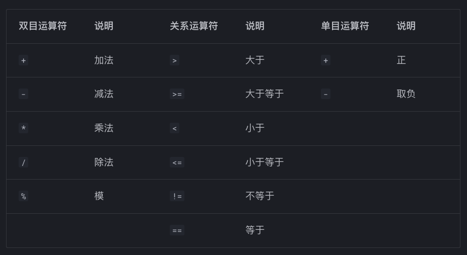

除了语法树，编译器另一个核心数据结构就是中间代码(`Intermediate Representation`)。

中间代码是编译器从源语言到目标语言之间采用的一种过渡性质的代码形式，往往介于语法树和汇编代码，其表示独立于机器、易于分析和翻译成汇百年代码

!!! question
为什么编译器不能把输入程序编程语法树，然后直接翻译成目标代码，而需要额外引入中间代码生成呢？
!!!

答案其实是可以的，但是引入中间代码有两个好处

一方面，中间代码将编译器自然地分为前端和后端两个部分。当我们需要改变编译器的源语言或目标语言时，如果采用了中间代码，我们只需要替换原编译器的前端或后端，而不需要重写整个编译器

另一方面，中间代码既不像语法树那样抽象，也不像汇编代码那样底层，因此在某些分析和优化任务会更加方便

接下来我们将使用 **Zero IR**

## 中间代码定义

我们可以先看一个阶乘代码的例子，直观感受一下实验要求实现的中间代码长什么样子

```
FUNCTION factorial:
    PARAM n                     // parameter n
    t1 = n
    t2 = #1
    IF t1 == t2 GOTO Label1     // if n == 1
    GOTO Label2
LABEL Label1:                   // return 1
    A0 = #1
    GOTO factorial.ret
LABEL Label2:
    t5 = n
    t7 = t5 - #1                // n - 1
    ARG t7
    t6 = CALL factorial         // factorial(n - 1)
    A0 = t5 * t6                // n * factorial(n - 1)
    GOTO factorial.ret
LABEL factorial.ret:
    RETURN A0

FUNCTION main:
    n = CALL read
    t10 = n
    ARG t10
    result = CALL factorial
    t12 = result
    ARG t12
    CALL write
    A0 = #0
LABEL main.ret:
    RETURN A0
```

具体的中间代码定义如下：

- 数据流指令
  - `x = #k`:将常量`k`加载到`x`中
  - `x=y`:将`y`的值存放到`x`中
  - `x = y binop z`:将`y`和`z`的双目运算结果存放到`x`中
  - `x = y binop #k`:将`y`和常量`k`的双目运算结果保存在`x`中
  - `x = unop y`:将`y`的单目运算结果存放到
  - `x = *y`:将`y`指向的位置的值存放到`x`中(类似于指针的解引用)
  - `x = *(y + #k)`	将 `y` 加上 k 字节偏移量后指向的位置的值存放到 x 中
  - `*x = y`将 `y` 的值存放到 `x` 指向的位置中
  - `*(x + #k) = y`	将 `y` 的值存放到 `x` 加上 `k` 字节偏移量后指向的位置中
- 控制流指令
  - `LABEL 1`:定义标签1
  - `GOTO l`:无条件跳转到`L`处
  - `IF X relop y GOTO L`:如果`x`和`y`的运算结果满足`op`的关系，则跳转到`L`处
- 函数相关指令
  - `FUNCTION f`:定义函数`f`
  - `x = CALL f`:调用函数`f`，并将返回值存放到`x`中
  - `CALL f`:调用函数`f`，但是不保存返回值
  - `PARAM x`:函数参数声明
  - `ARG x`:将`x`作为函数传递给函数
  - `RETURN x`：退出当前函数并返回 `x` 的值
  - `RETURN`:退出当前函数并返回`void`的值
  - `DEC x #k`:声明 `k` 个字节的空间，并将首地址存放到 `x` 中
- 全局变量相关指令
  - `GLOBAL X: #k`:声明`k`个字节的全局变量`x`，并全部初始化为`0`
  - `GLOBAL x: #k = #v1, #v2, ...`：声明`k`个字节的全局变量`x`，并初始化为常量`v1, v2, ...`，其中等号后的值的个数应该为`k//4`

我们支持的双目运算(`binop`)、关系运算(`relop`)和单目运算(`unop`)如下图所示



1. **语法规则：**
    - *大小写敏感*，关键字必须全大写（如 GOTO 和 goto 是不同的）。
    - *变量命名*：x、y、z 等表示**临时变量**（标识符）；#k 表示**整型常量**（如 #40）。
2. **函数内变量声明**：
    - 临时变量：**直接赋值定义后使用**即可。非数组局部变量可直接用一个临时变量表示。
    - *栈上空间分配 DEC*：`DEC` 用于在一个函数的栈上声明**一段连续的内存空间**，以**字节**为单位。特别适用于数组等需要连续内存空间的变量。例如，若需声明一个长度为 `10` 的 `int` 类型数组 `a`，可以写成 **DEC a #40**，即为 a 分配 40 字节内存，并将该空间的首地址存入 a 中。
    - 变量作用域：一个函数即为一个作用域，不同函数之间的变量相互独立。
3. **函数规范**：
    - 函数返回：每个函数**必须包含 RETURN 语句**，即使函数返回值为空，也需要写成 RETURN，不能省略。
    - 参数声明：使用 PARAM 语句在函数开头声明形参。
    - 函数调用：使用 ARG **传递所有实参**，并用 CALL 调**用函数并接受返回值**；CALL 调用后会将所有 ARG 清空。
4. **全局变量**：
   - *在函数定义前声明*：需要在所有函数相关的中间代码前完成对全局变量的声明与定义。
   - *自动赋零*：未给定初值的全局变量会**自动赋值为全 0 数组**。
5. **内置 I/O 函数**：
    - `read()`：从控制台读取整数并返回。例如 `x = CALL read`。
    - `write(x)`：将整数 `x` 输出到控制台。例如 `ARG x CALL write`。
6. 注释：
    - 单行注释：//。
    - 多行注释：/* ... */。


## 语法制导的代码生成

讨论完了中间代码的定义，下一步我们就要把经过语义检查和推断的语法树转化成中间代码。从语法树生成中间代码并没有想象中的那么困难，和打印语法树一样，我们要做的就是遍历语法树的节点，然后根据节点的类型生成对应的中间代码。其核心和语义分析类似，我们要实现一个`translate_X`函数，`X`可以对应**表达式，语句**等等

### 表达式代码生成

让我们从最简单的敞亮表达式开始，比如`1`，我们可以生成如下的中间代码：

```asm
t1 = #1
```

这看起来很简单，但是有一个问题：**这个临时变量`t1`是从哪里来的呢？**表达式本身不会给出这个信息。

这启发我们：**设计`translate_exp`函数的时候要传入一个参数用于指定表达式的结果的存放位置**

例如对于`1`这个表达式，我们可以传入一个临时变量`t1`，然后生成上面的中间代码，所以`translate_exp`可以这样定义：

```cpp
translate_exp(exp, symbol_table, place)
```

其中，`exp`是表达式节点，`symbol_table`是符号表，`place`是**表达式结果的存放位置**

- 为什么需要符号表？因为对于`x`的变量表达式，我们要查阅符号表来**获取该变量在中间表示下的名字**。我们的中间表示并**没有作用域**的概念，因此对于那些在语法树中重名的变量，如一个`Block`里定义的变量和外层变量重名的时候需要我们自行处理

对于形如`exp1 + exp2`这样的二元运算表达式我们：

- 生成新的临时变量
- 递归调用二元运算两个子节点的`translate_exp`函数
- 最后生成代码将它们加起来

```cpp
code1 = translate_exp(exp1, symbol_table, t1)
code2 = translate_exp(exp2, symbol_table, t2)
place = t1 + t2
```

同理，这个存储结果的位置`t3`也是由`translate_exp`函数的参数传入的，而`t1`和`t2`则是内部生成的

最后是函数调用表达式，我们只需要递归调用实参`translate_exp`函数，然后生成代码将它们作为参数传递给函数，最后将函数的返回值存放到`place`中即可

表达式的翻译规则如下


!!! note "优化：合并指令"
我们在学习第九章时接触到了一种名为`Maximal Munch`的策略。这是一种贪心策略，通过使用尽可能少的`tile`覆盖树形IR上尽可能很多的节点，类似的策略同样适用于将`AST`转换为`IR`、例如，对于表达式`Exp1 + INT`，可以按照以下规则生成代码：

```go
 t1 = new_temp()
 code = translate_exp(Exp1, symbol_table, t1)
 value = get_value(Exp2)
return code + [place = t1 + #value] 
```

这里有一些部分可以合并，我们可以尝试进行优化

- `Exp1 + INT,INT+Exp2`，可以合并为`place = Exp1 + #k`或者`Exp2 + #k`
- `Exp1 - INT`可以合并为`place = Exp1 - #k`
- `ID[Exp + INT]`，`ID[INT]`以及推广到多维数组`ID[Exp1 + INT]`，`Exp2 + INT]`等，可以合并为一个`*(x + #k) = y`或者`x = *(y + #k)`

当某个表达式的所有子表达式均为常量时，可以直接计算结果并生成相应的常量节点。这是一种静态常量表达式求值的优化。例如：**`a = (1 + 2) * 3`可以直接生成`a = #9`**。具体实现时，若在`AST`中发现某个表达式节点，其所有子节点均为常量，则可以计算其值并替换为常量节点
!!!

### 语句代码生成

表达式生成的核心是`translate_exp`函数，而其中的参数`place`是表达式的结果的存放位置。那这个参数由谁来生成传递呢？那就是语句的生成函数`translate_stmt(stmt, symbol_table)`

最简单的就是表达式语句，只需要翻译里面的表达式即可

赋值语句的生成也很简单，分别*生成左右两边的表达式*，然后将右边的结果存放到左边的位置即可

条件语句的生成则要复杂些，我们所定义的`LABEL`指令有了用武之地。直觉上来说，对于下面这种`If`语句：

```c
if(exp) {
    stmt1;
}else{
    stmt2;
}
```

应该生成如下的这种中间代码：

```asm
    translate_cond(exp)
LABEL L1:
    translate_stmt(stmt1)
    GOTO L3
LABEL L2:
    translate_stmt(stmt2)
LABEL L3:
```

我们总结语句翻译的规则如下：


### 条件判断语句代码生成

在翻译语句的时候我们专门为条件判断语句定义了一个函数`translate_cond`，这是因为条件判断语句的翻译和普通语句有所不同，我们多传入了两个参数`true_label`和`false_label`，分别表示条件为真时和条件为假时的跳转位置

从表面上看这可能和二元表达式没有什么区别，只需要递归调用两边的表达式的`translate_exp`函数，然后生成代码将它们进行比较，最后根据结果跳转到对应的位置即可，对于一般的条件判断例如大于等于或者小于等于确实如此

!!! question
既然这样为什么要增加该函数复杂性呢？
!!!

**是为了支持短路**，也就是说在翻译`Exp1 && Exp2`时，如果第一个表达式为假，那么第二个表达式就不需要计算了，直接跳转到`false_label`即可。而对`Exp1||Exp2`也是类似的。这时我们就需要通过 **控制流跳转**。在这种情况下，我们需要额外生成一个标签以供跳转，以`Exp1 && Exp2`为例，我们可以生成如下的中间代码：

```asm
// 如果Exp1为假直接跳转到false_label不进行Exp2的计算
translate_cond(Exp1, L1, false_label)
LABEL L1:
    translate_exp(Exp2, true_label, false_label)
```

而条件如果不是关系关系运算，例如简单的`if(x)`，只需要当成`if(x != 0)`处理

我们总结条件判断翻译的规则如下


### 函数代码生成

相比于表达式和语句的生成，函数的代码生成更加结构化且相对简单

在函数定义中，建议紧跟在`FUNCTION`关键字后声明参数。可以使用`PARAM`指令来一次定义所有函数参数

在调用函数时，需要使用`ARG`语句将所有实参传入，然后使用`CALL`语句调用该函数。我们可以将`ARG`语句和`CALL`语句连续放在一起

对于函数体内的语句，我们按照前文中的规则循环生成即可

### 全局变量和数组代码生成

上述代码生成中我们忽略了全局变量和数组相关的表达式求值和定义翻译。这两种类型的变量实质上都是 **地址/指针**，它们的使用和赋值是相似的

#### 定义

- 对于全局变量，我们需要使用`GLOBAL`指令，用于声明全局变量的大小和初始化。我们可以假设全局变量的初始化一定是一个`INT_CONST`。例如，全局变量`inta[4] = {1,2,3,4};int c;`的中间代码可以翻译如下：

    ```
    GLOBAL A: #16 = #1, #2, #3, #4
    GLOBAL c: #4
    ```

    我们可以发现，对于全局变量`c`，我们在实际使用时可以作为一个全局数组`int c[1];`来处理

- 对于局部变量中的数组，我们需要使用`DEC`指令来声明数组的大小，其初始化过程可以视作对于数组元素的赋值。

!!! example
局部数组：`int a[4] = {1, 2, 3, 4};`的中间代码可以翻译如下

```asm
// 声明大小 4*4 bytes
DEC a #16
T0 = #1
// a[1] = 1
*(a + #0) = T0
T1 = #2
// a[2] = 2
*(a + #4) = T1
T2 = #3
// a[3] = 3
*(a + #8) = T2
T3 = #4
// a[4] = 4
*(a + #12) = T3
```
!!!

#### 使用与赋值

对于全局变量，我们首先需要使用`x = &label`来获取全局变量的地址。在获得地址后，全局数组和局部变量中的数组使用是一样的，我们根据下表计算对应的偏移量，使用`*(x + #k) = y`和`x = *(y + #k)`来完成对应元素的赋值和获取

!!! example
同样是 `place = a[1]`，

如果 a 是全局数组，我们可以这样翻译：

```asm
t1 = &a
place = *(t1 + #4)
```

而对于局部数组，因为`a`已经是数组的起始地址，则可以省去`t2 = &a`这一步骤，直接使用：

```asm
place = *(a + #4)
```
!!!

**基本规则**

1. 定义时怎么生成 IR？
   全局变量/数组：GLOBAL
   局部数组：DEC
   局部普通变量：一般不用生成 IR，直接当变量名用

2. 使用时怎么生成 IR？
   普通局部变量：place = x
   全局变量：先 t = &x，再 place = *t
   局部数组：place = *(a + #offset)
   全局数组：先 t = &a，再 place = *(t + #offset)

3. 赋值时怎么生成 IR？
   普通局部变量：x = value
   全局变量：t = &x; *t = value
   局部数组：*(a + #offset) = value
   全局数组：t = &a; *(t + #offset) = value