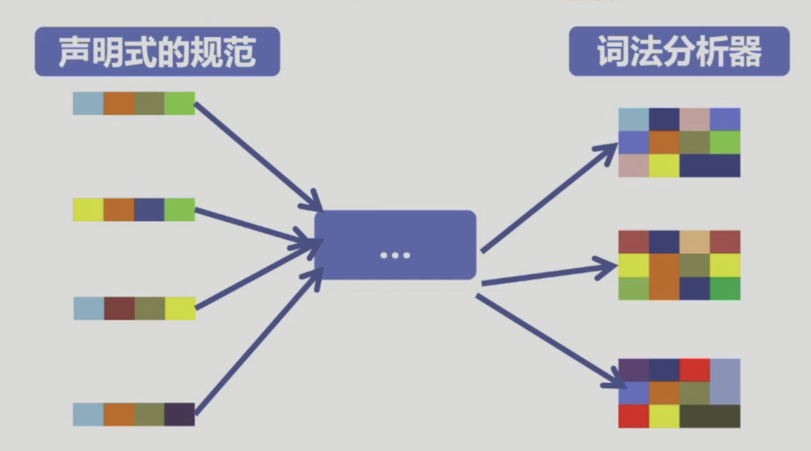

# Chapter 2:词法分析

## 2.1 词法分析概述

### 1. 什么是词法分析

- 词法分析：将输入字符串识别为有意义的子串
- **Token**：词法记号、单词
- **Lexeme**：词素

### 2. 词法分析器的构造

**Program = Specification(What) + Implementation(How)**

## 2.2 正则表达式

### 1. 字母表和串

- 字母表(`alphabet`)：符号的有限集合
  - 字母
  - 数字
  - 标点符号
- 串(`string. word`):字母表中**符号的有穷序列**
  - 串s的长度

### 2. 串上的运算

- 连接(concatenation)
- 幂运算

### 3. 正则表达式

