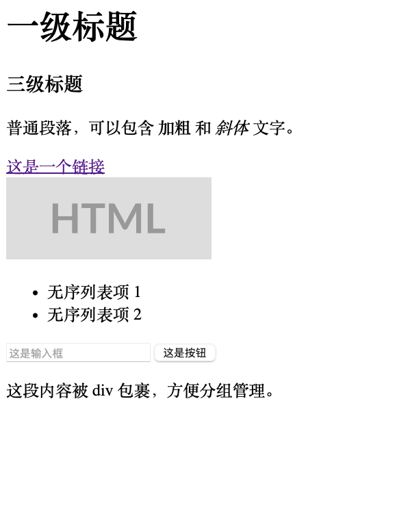
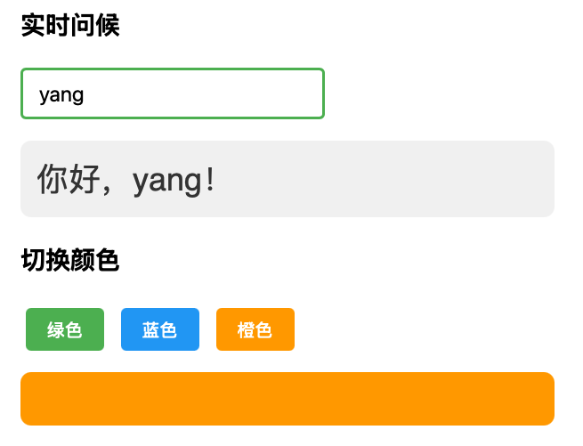
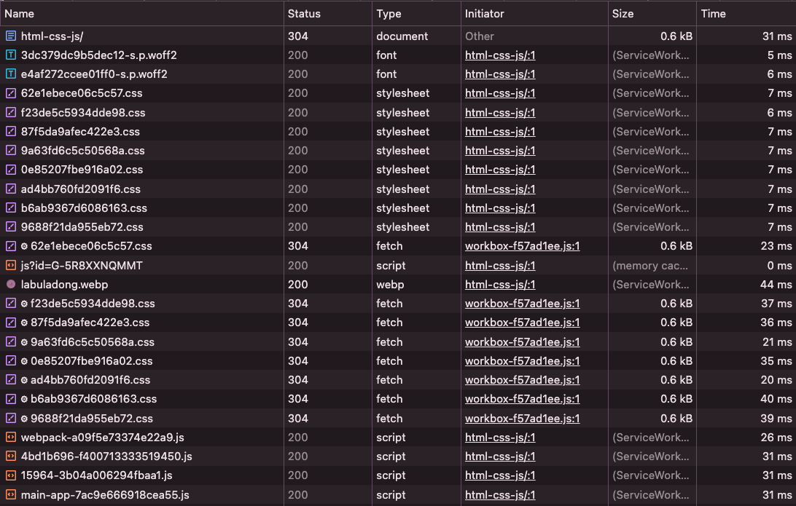

> 不管前端框架怎么变、工具链怎么更新，浏览器只认识三样东西：`HTML`,`CSS`,`JavaScript`。`React`、`Vue`、`next.js`最终都要编译成这三者才能在浏览器里跑起来

## 1. HTML：页面的骨架

`HTML(HyperText Markup Language)`的作用是 **定义页面的结构和内容**。可以理解成页面的骨架：这里放标题、那里放按钮，下面是一段文字

`HTML`由各种标签组成，标签用尖括号包裹，大多数标签成对出现(开始标签+结束标签)，少数标签(如`<br>`换行、``图片、`<input>`输入框)不需要结束标签，因为它们不包裹内容：

```html
<h1>这是标签</h1>
<p>这是一段文字</p>
<button>点击我</button>
```

`<h1>`是开始标签，`</h1>`是结束标签，中间夹的是内容。浏览器看到`<h1>`就知道这是一个一级标题，会把文字渲染得又大又粗

标签可以嵌套，形成层级关系：

```html
<div>
    <h2>用户信息</h2>
    <p>姓名：张三</p>
    <p>职业：工程师</p>
</div>
```

- `<div>`是一个通用的容器标签，本身没有视觉效果，纯粹用来把相关的内容分组。我们可以将其视为一个透明的盒子，把几个元素装在一起方便统一管理

一个完整的`HTML`文档有固定的骨架结构

- `<!DOCTYPE html>`:声明这是一个`HTML5`文档(固定写法)
- `<html>`是最外层容器
- `<head>`里面放页面元信息(标题、样式引用等，不直接显示)
- `<body>`里面放页面里面可见的内容

下面这个例子展示了最常见的`HTML`标签

!!! example
```html
<!DOCTYPE html>
<html>
<body>
    <!-- 标题标签:h1最大，h6最小 -->
     <h1>一级标题</h1>
     <h3>三级标题</h3>

     <!-- 段落和文本格式 -->
      <p>普通段落，可以包含<strong>加粗</strong>和<em>斜体</em>文字。</p>

      <!-- 链接和图片 -->
       <a href="https://developer.mozilla.org/zh-CN/docs/Web/HTML">这是一个链接</a>
       <br>
       

       <!-- 列表 -->
        <ul>
            <li>无序列表项 1</li>
            <li>无序列表项 2</li>
        </ul>

        <!-- 表单元素 -->
        <input type="text" placeholder="这是输入框">
        <button>这是按钮</button>

        <!-- div 容器 -->
        <div>
            <p>这段内容被 div 包裹，方便分组管理。</p>
        </div>
</body>
</html>
```


!!!

### 1.1 标签的属性

标签上可以加属性来提供额外信息。比如`<a href="...">`里面的`href`指定链接地址，``里面的`src`指定图片路径

有两个属性特别重要，后面会频繁用到

- `id`给元素起一个唯一的名字，方便`JavaScript`精确定位它
  - 一个页面里同一个`id`只能出现一次
- `class`给元素分类，方便`CSS`批量设置样式。
  - 多个元素可以有相同的`class`

```html
<div id="user-profile">...</div>

<p class="highlight">这段文字需要高亮</p>
<p class="highlight">这段文字也需要高亮</p>
```

- `id`像身份证，全局唯一
- `class`像职业标签，多个人可以是同一个职业

### 1.2 DOM树

浏览器解析`HTML`后，会在内部构建一棵树结构，叫做`DOM`树(`Document Object Model`，文档对象模型)。每个标签对应树上的一个元素节点，标签里面的文字会成为文本节点，嵌套关系就是父子关系

!!! example
```html
<html>
    <head></head>
    <body>
        <h1>一级标题</h1>
        <div>
            <p>姓名：张三</p>
            <p>职业：工程师</p>
        </div>
        <button>点击</button>
    </body>
</html>
```

浏览器解析后生成的`DOM`树：

```
html
├── head
└── body
    ├── h1 ("一级标题")
    ├── div
    │   ├── p ("姓名：张三")
    │   └── p ("职业：工程师")
    └── button ("点击")
```

标签的嵌套关系变成了树的父子关系，`<div>`包裹着两个`<p>`。所以`div`是父节点，两个`p`是它的子节点
!!!

## 2. CSS：页面的皮肤

`CSS(Cascading Style Sheets)`负责页面的 **视觉呈现**，包括

- 颜色
- 字体
- 大小
- 间距
- 布局

所有视觉上的效果都由`CSS`实现

`CSS`的基本语法是 **选择器+样式声明**

```css
选择器{
    属性: 值;
    属性: 值;
}
```

- 选择器决定：修改谁的样式
- 花括号里的声明决定 **改成什么样子**

`CSS`有三种最常用的选择器

```css
/* 标签选择器：所有<p>标签 */
p {
    color: gray;
}
/* class选择器：所有class="highlight"的元素 */
.highlight{
    background-color: yellow;
}

/* id 选择器：id="title"的那个元素 */
#title {
    font-size: 32px;
}
```

- 标签选择器管理全局默认样式
- `class`选择器管理可以复用的样式类
- `id`选择器管理特定的唯一元素

实际开发中使用最多的是`class`选择器

除了在`style`标签里面用选择器批量设置样式，还可以直接在`HTML`标签上写`style`属性，叫做行内样式(`inline style`)

```html
<p style="color: red; font-size: 20px;">这段文字是红色的</p>
```

行内样式只对当前这一个元素生效，优先级比选择器更高，一般不推荐大量使用，因为样式散落在各个标签里不好维护

但是后面会看到，`JavaScript`动态修改元素样式的时候，本质上就是在设置行内样式

来看一个实际效果，下面的例子里面，给`HTML`结构加上CSS样式。我们可以试着把`<style>`标签里面的内容删掉一些，或者直接`<p>`标签加上`style`属性，观察`HTML`变化

```html
<!DOCTYPE html>
<html>
    <head>
        <style>
            body{
                font-family: san-serif;
                max-width: 420px;
                margin: 0 auto; /*左右外边距自动分配剩余空间，实现水平居中*/
                padding: 20px; /*内边距，是元素内容和元素边框之间的距离*/
                background: #fafafa;
            }

            h2 {
                color: #333;
                border-bottom: 2px solid #4CAF50; /*solid是边框样式，实线*/
                padding-bottom: 8px;
            }

            /*class选择器：所有class="card"的元素*/
            .card {
                background: white;
                border: 1px solid #e0e0e0;
                border-radius: 8px
                padding: 16px;
                margin: 12px 0; /*这里用auto就太挤了*/
            }

            /*.card内部的.name元素(后代选择器)*/
            .card .name {
                font-size: 18px;
                font-weight: bold;
                color: #333
            }

            .card .role {
                color: #88;
                font-size: 14px;
                margin-top: 4px;
            }

            button {
                background: #4CAF50;
                color: white;
                border: none;
                padding: 10px 20px;/*前面是上下，后面是左右*/
            }

            /*伪类选择器：鼠标悬停时的样子*/
            button:hover {
                background: #45a049
            }
        </style>
    </head>
    <body>
        <h2>团队成员</h2>
        <div class="card">
            <p class="name">张三</p>
            <p class="role">前端工程师</p>
        </div>

        <div class="card">
            <p class="name">张三</p>
            <p class="role">后端工程师</p>
        </div>

        <button>添加成员</button>
    </body>
</html>
```

可以用的`CSS`属性非常多，所有页面样式相关的功能都归`CSS`管，比如颜色、字体、间距、动画、布局自动适配不同尺寸的屏幕等等

不过现在我们只需要理解`CSS`在`HTML`中发挥作用，没有必要去背这些细节了，`AL`工具对CSS的掌握程度很高，需要的时候可以给`AI`描述想要的效果即可，它可以生成相应的`CSS`代码

## 3. 浏览器开发者工具

在学习`JavaScript`之前，浏览器开发者工具是一个很重要的工具。这是前端调试开发最核心的调试工具，几个常用面板：

- `Elements`(元素)：查看和实时编辑页面的`HTML`和`CSS`。可以直接修改标签内容、调整样式，效果理解反映在页面上(刷新后恢复)
- `Console`(控制台)：执行`JavaScript`代码，查看报错信息。前端最常用的面板
- `Network`(网络)：查看所有网络请求，包括加载了哪些文件、请求了哪些API、每个请求花了多长时间

!!! example
```js
// 查看当前页面标题
document.title

//把页面所有段落文字变成红色
//等于给所有<p>标签加上style="color: red;"属性
document.querySelectorAll('p').forEach(el => el.style.color = 'red')

// 把文本的标题改掉
document.querySelector('h1').textContent = '被我用 JS 改了！'
```

刷新页面即可以让浏览器重新渲染HTML，即可撤销这些修改

我们在`Console`里面手动执行的代码和写在`<script>`标签里面的代码效果完全一样，区别只是一个手动执行，一个页面加载时自动执行
!!!

## 4. JavaScript：页面的灵魂

`HTML`搭好了骨架，`CSS`画好了皮肤，但是页面是一个静态的、死的，点击按钮没有反映。想让页面变成一个可交互的、动态的网页，就需要使用JavaScript

**JavaScript**负责页面的 **行为和交互逻辑**：点击按钮之后会发生什么、如何从后端获取数据、怎么动态更新页面内容

JavaScript的基础语法(变量、函数、条件判断等)可以参考[JavaScript基础入门](https://labuladong.online/zh/programming-language/js/setup/)。我们在这里要重点看`JS`在浏览器里面特有的能力：**操作DOM和响应用户事件**

JS代码写在`HTML`的`<script>`标签里，浏览器遇到它就知道要执行代码了。前面说过，浏览器把`HTML`解析成一棵`DOM`树，JavaScript在浏览器内部做的事情，本质上就是在这棵树上进行 **增删查改**：

- 通过`document.getElementById`找到某个元素，修改它的文本、样式、属性
- 通过监听`click`、`input`等事件，响应用户的操作

来看一个实际的例子

!!! example
```python
<!DOCTYPE html>
<html>
    <head>
        <style>
            body {
                font-family: sans-serif;
                max-width: 400px;
                margin: 0 auto;
                padding: 20px;
            }

            .greeting {
                font-size: 24px;
                color: #333;
                margin: 16px 0;
                padding: 12px;
                background: #f0f0f0;
                border-radius: 8px;
                min-height: 30px;
            }

            input {
                font-size: 16px;
                padding: 8px 12px;
                border: 2px solid #ddd;
                border-radius: 4px;
                width: 200px;
            }

            input:focus {
                border-color: #4CAF50;
                outline: none;
            }

            button {
                font-size: 14px;
                padding: 8px 16px;
                margin: 4px;
                cursor: pointer;
                color: white;
                border: none;
                border-radius: 4px;
            }

            .green { background: #4CAF50; }
            .blue { background: #2196F3; }
            .orange { background: #FF9800; }

            .btn-group { margin-top: 12px; }

            .color-box {
                width: 100%;
                height: 40px;
                border-radius: 8px;
                margin-top: 12px;
                /* 颜色变化时有 0.3 秒的过渡动画 */
                transition: background-color 0.3s;
                background: #e0e0e0;
            }
        </style>
    </head>
    <body>
        <h3>实时问题</h3>
        <input type="text" id="name-input" placeholder="请输入您的名字">
        <div class="greeting" id="greeting">你好，请输入名字</div>

        <h3>切换颜色</h3>
        <div class="btn-group">
            <button class="green" onclick="changeColor('#4CAF50')">绿色</button>
            <button class="blue" onclick="changeColor('#2196F3')">蓝色</button>
            <button class="orange" onclick="changeColor('#FF9800')">橙色</button>
        </div>

        <div class="color-box" id="color-box"></div>
        <script>
            // 监听输入事件:每次输入内容变化时自动更新问候语
            let nameInput = document.getElementById('name-input');
            let greeting = document.getElementById('greeting');

            nameInput.addEventListener('input', function () {
                let name = nameInput.value;
                if (name) {
                    greeting.textContent = '你好, ' + name + '!';
                } else {
                    greeting.textContent = '你好，请输入名字';
                }
            })

            // 点击按钮切换颜色
            function changeColor(color) {
                let box = document.getElementById('color-box');
                box.style.backgroundColor = color;
            }
        </script>
    </body>
</html>
```


!!!

后端代码从第一行开始往下执行，做完一件事情之后接着做下一件，但是前端不大一样，页面加载完之后，就一直等用户操作，用户做了什么，代码才响应什么

这就引出了前端编程最核心的问题：**回调函数**(`callback`)

我们不是在页面完成加载的时候立即执行这段代码，而是把这段代码 **注册**到某个事件上，等事件发生时，浏览器会自动调用它

比如按钮上的`onclick="changeColor"#4CAF50`就是一个回调，意思是 **当用户点击这个按钮**时，**执行changeColor函数**。我们不需要写代码去检测用户有没有点击，浏览器会监督事件

`nameInput.addEventListener('input', function(){...})`是一样的思路。`addEventListener`的意思是给输入框注册一个回调：每当输入内容发生变化，就执行后面这个函数，通过`greeting.textContent = ...`把问候语实时更新到页面上

回调函数内部做的事情，就是前面说的`DOM`操作。比如

- `changeColor`函数通过`box.style.backgrounndColor=color`给元素设置行内样式
- 输入框的回调通过`greeting.textContent=...`修改元素的文本内容，这样就能在页面上实时看到效果

## 5. 三件套的配合工作

!!! example "计数器"
```html
<!DOCTYPE html>
<html>
    <head>
        <style>
            .container {
                text-align: center;
                margin-top: 40px;
                font-family: sans-serif;
            }
            .counter {
                font-size: 50px;
                color: #333;
                margin: 20px 0;
            }
            button {
                font-size: 20px;
                padding: 10px 20px;
                margin: 5px;
                cursor: pointer;
                background-color: #4caf50;
                color: white;
                border: none;
                border-radius: 4px 12px; /*左上右下：4px 右上左下：12px*/
            }
            button:hover {
                background-color: #45a049;
            }
        </style>
    </head>
    <body>
        <div class="container">
            <h1>简单计数器</h1>
            <div class="counter" id="count">0</div>
            <button onclick="increment()">增加</button>
            <button onclick="decrement()">减少</button>
            <button onclick="reset()">重置</button>
        </div>

        <script>
            let count = 0;

            function increment() {
                count++;
                updateDisplay();
            }

            function decrement() {
                if(count == 0) {
                    return;
                }
                count--;
                updateDisplay();
            }

            function reset() {
                count = 0;
                updateDisplay();
            }

            function updateDisplay(){
                document.getElementById('count').textContent = count;
            }
        </script>
    </body>
</html>
```
!!!

### 5.1 文件分离

之前我们为了方便，我们把`CSS`和`JavaScript`都写进了`HTML`文件里，但是实际项目中它们通常是独立文件。`HTML`通过`<link>`引入`CSS`，通过`script src`引入`JavaScript`

!!! example
`app.js`

```js
let count = 0;

function increment() {
    count++;
    updateDisplay();
}

function decrement() {
    count--;
    updateDisplay();
}

function reset() {
    count = 0;
    updateDisplay();
}

function updateDisplay() {
    document.getElementById('count').textContent = count;
}
```

`index.html`

```html
<!DOCTYPE html>
<html>
<head>
    <!-- 引入外部 CSS 文件 -->
    <link rel="stylesheet" href="styles.css">
</head>
<body>
    <div class="container">
        <h1>简单计数器</h1>
        <div class="counter" id="count">0</div>
        <button onclick="increment()">增加</button>
        <button onclick="decrement()">减少</button>
        <button onclick="reset()">重置</button>
    </div>
    <!-- 引入外部 JavaScript 文件 -->
    <script src="app.js"></script>
</body>
</html>
```

`style.css`

```css
.container {
    text-align: center;
    margin-top: 40px;
    font-family: sans-serif;
}

.counter {
    font-size: 48px;
    color: #333;
    margin: 20px 0;
}

button {
    font-size: 16px;
    padding: 10px 20px;
    margin: 5px;
    cursor: pointer;
    background-color: #4CAF50;
    color: white;
    border: none;
    border-radius: 4px;
}

button:hover {
    background-color: #45a049;
}
```
!!!

### 5.2 浏览器的加载流程

浏览器从上到下按顺序解析`html`，遇到`CSS`和`JS`的引用时发起 **下载请求**，多个文件可以并行下载，但是它们对页面渲染的影响不同：

- `css`会阻塞渲染，浏览器要等`css`加载完之后才开始画页面
- 同步JS会 **阻塞HTML解析**，遇到`<script>`标签暂停解析等脚本下载并执行完之后才继续

如果你打开浏览器的开发者工具（F12），切到 Network（网络）面板，刷新页面，会看到请求列表：第一个通常是 HTML 文件，紧接着是若干 .css 和 .js 文件



如果一个网络加载比较慢，我们会看到一个典型的过程：

- 首先是一段白屏：浏览器在等待CSS下载完成才开始秀安然
- 然后是页面结构和样式一起出现，但是点击按钮可能没有反应(`JS`还在加载，交互逻辑还没有就绪)
- 最后等待JS加载完毕，页面才可以正常使用

这也是为什么`<link>`标签通常放在`<head>`里(**让`CSS`尽早开始下载**)，而`<script>`标签通常放在`<body>`末尾或者加上`defer`属性以 **避免阻塞HTML解析**

> 现代项目更推荐使用`<script defer src="app.js">`放在`<head>`里，浏览器会并行下载脚本，等`html`解析完毕后再执行

