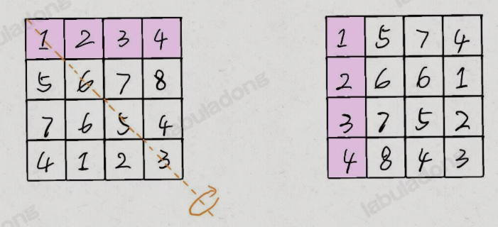
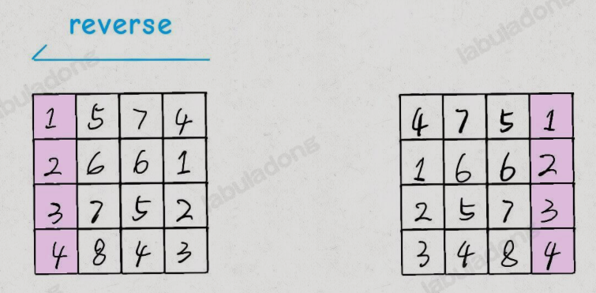
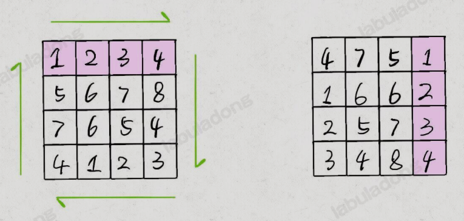

## 1. 顺/逆时针旋转矩阵

对于二维数组进行旋转是常见的笔试题，力扣第48题[旋转图像](https://leetcode.cn/problems/rotate-image/description/)就是一个很常见的题目

```
给定一个 n × n 的二维矩阵 matrix 表示一个图像。请你将图像顺时针旋转 90 度。

你必须在 原地 旋转图像，这意味着你需要直接修改输入的二维矩阵。请不要 使用另一个矩阵来旋转图像。

示例 1：


输入：matrix = [[1,2,3],[4,5,6],[7,8,9]]
输出：[[7,4,1],[8,5,2],[9,6,3]]
示例 2：


输入：matrix = [[5,1,9,11],[2,4,8,10],[13,3,6,7],[15,14,12,16]]
输出：[[15,13,2,5],[14,3,4,1],[12,6,8,9],[16,7,10,11]]
提示：

n == matrix.length == matrix[i].length
1 <= n <= 20
-1000 <= matrix[i][j] <= 1000
```

题目本身是很好理解的，就是把一个二维矩阵顺时针旋转90度，难点在于要 **原地修改**

但是实际上，这道题目不能走寻常路。在讲解比较巧妙的做法之前，我们先看一个谷歌考过的算法题：给定一个包含若干单词和空格的字符串`s`，写出一个算法，原地反转所有单词的顺序

```python
s = "hello world"
```

我们的算法要原地反转这个字符串中的单词顺序

```python
s = "world hello"
```

最常见的方法是把`s`按照空格`split`成若干个单词，然后`reverse`这些单词的顺序，最后把这些单词`join`成句子。但是这些方式使用了额外的空间，并不是 **原地反转单词**

正确的做法是，先将整个字符串`s`反转：

```python
s = "dlrow olleh"
```

然后再将每个单词分别反转：

```python
s = "world hello"
```

**基本思路**


这样就实现了原地反转所有单词顺序的目的。力扣第151题[颠倒字符串中的单词](https://leetcode.cn/problems/reverse-words-in-a-string/description/)就是类似的问题

这个技巧可以再包装一下去解决力扣第61题[旋转链表](https://leetcode.cn/problems/rotate-list/description/):给一个单链表，旋转链表，将链表每个节点向右移动`k`个位置

这道题目不需要一个一个移动节点，这就是我们之前用到的找到链表倒数第k个节点并把前后两部分链表反转过来就可以

```python
def rotateRight(self, head: Optional[ListNode], k: int) -> Optional[ListNode]:
    if head is None:
        return None
    slow = head
    fast = head
    p = head
    n = 0
    while p != None:
        p = p.next
        n += 1

    k = k % n
    for _ in range(k):
        fast = fast.next

    while fast.next is not None:
        fast = fast.next
        slow = slow.next

    fast.next = head
    head = slow.next
    slow.next = None
    
    return head
```

> 有时候我们的常规思维对于计算机来说不一定是最好的；计算机认为最好的方法，对我们来说并不直观

回到之前说的顺时针旋转二维矩阵的问题，常规的思路就是去寻找原始坐标和旋转后坐标的映射关系。但是我们是否可以让思维跳跃出来，尝试把矩阵进行翻转、镜像对称等操作，可能会出现新的突破口

1. 我们可以先将$n \times n$矩阵`matrix`按照左上到右下的对角线进行镜像对称



2. 反转矩阵



3. 可以发现最终的结果就是`matrix`顺时针旋转90度的结果



```python
class Solution:
    def rotate(self, matrix):
        # 将二维矩阵原地顺时针旋转 90 度
        n = len(matrix)
        # 先沿对角线镜像对称二维矩阵
        for i in range(n):
            for j in range(i, n):
                # swap(matrix[i][j], matrix[j][i]);
                matrix[i][j], matrix[j][i] = matrix[j][i], matrix[i][j]
        # 然后反转二维矩阵的每一行
        for row in matrix:
            self.reverse(row)
    
    # 反转一维数组
    def reverse(self, arr):
        i, j = 0, len(arr) - 1
        while j > i:
            # swap(arr[i], arr[j]);
            arr[i], arr[j] = arr[j], arr[i]
            i += 1
            j -= 1
```

> 可以思考一下逆时针旋转怎么办。其实尝试一下可以发现，先反转再转置就是答案了

## 2. 矩阵的螺旋遍历

接下来要研究一下[螺旋遍历](https://leetcode.cn/problems/spiral-matrix/description/)

```
给你一个 m 行 n 列的矩阵 matrix ，请按照 顺时针螺旋顺序 ，返回矩阵中的所有元素。

 

示例 1：


输入：matrix = [[1,2,3],[4,5,6],[7,8,9]]
输出：[1,2,3,6,9,8,7,4,5]
示例 2：


输入：matrix = [[1,2,3,4],[5,6,7,8],[9,10,11,12]]
输出：[1,2,3,4,8,12,11,10,9,5,6,7]
 

提示：

m == matrix.length
n == matrix[i].length
1 <= m, n <= 10
-100 <= matrix[i][j] <= 100
```

解题的核心思路就是按照右、下、左、上的顺序遍历数组，并使用四个变量固定未遍历元素的边界


随着螺旋遍历，相应的边界会收缩，直到螺旋遍历完整个数组


按照这个思路，可以实现下面的代码：

```python
class Solution:
    def spiralorder(self, matrix):
        m, n = len(matrix), len(matrix[0])
        upper_bound, lower_bound = 0, m - 1
        left_bound, right_bound = 0, n - 1
        res = []
        # res.size() == m*n 则遍历完整个数组
        while len(res) < m*n:
            if upper_bound <= lower_bound:
                # 在顶部从左向右遍历
                for j in range(left_bound, right_bound + 1):
                    res.append(matrix[upper_bound][j])

                # 上边界下移
                upper_bound += 1
            
            if left_bound <= right_bound:
                # 在右侧从上向下遍历
                for i in range(upper_bound, lower_bound + 1):
                    res.append(matrix[i][right_bound])
                # 右边界左移
                right_bound -= 1
            
            if upper_bound <= lower_bound:
                # 在底部从右向左遍历
                for j in range(right_bound, left_bound - 1, -1):
                    res.append(matrix[lower_bound][j])
                # 下边界上移
                lower_bound -= 1

            if left_bound <= right_bound:
                # 在左侧从下向上遍历
                for i in range(lower_bound, upper_bound - 1, -1):
                    res.append(matrix[i][left_bound])
                # 左边界右移
                left_bound += 1
        return res
```

力扣第59题[螺旋矩阵II](https://leetcode.cn/problems/spiral-matrix-ii/description/)是一个类似的题目，按照螺旋的顺序生成矩阵

```python
class Solution:
    def generateMatrix(self, n: int) -> List[List[int]]:
        upper_bound, lower_bound = 0, n - 1
        left_bound, right_bound = 0, n - 1
        num = 1
        # 先初始化n*n矩阵
        res = [[0] * n for _ in range(n)]

        while num <= n * n:
            # 顶部从左向右，固定upper_bound行
            if upper_bound <= lower_bound:
                for i in range(left_bound, right_bound + 1):
                    res[upper_bound][i] = num
                    num += 1
                upper_bound += 1
            
            # 右侧从上到下，固定right_bound列
            if left_bound <= right_bound:
                for j in range(upper_bound, lower_bound + 1):
                    res[j][right_bound] = num
                    num += 1
                right_bound -= 1

            # 底层从右到左，固定lower_bound行
            if upper_bound <= lower_bound:
                for i in range(right_bound, left_bound - 1, -1):
                    res[lower_bound][i] = num
                    num += 1
                lower_bound -= 1

            # 左侧从下到上，固定left_bound列
            if left_bound <= right_bound:
                for j in range(lower_bound, upper_bound - 1, -1):
                    res[j][left_bound] = num
                    num += 1
                left_bound += 1
            
        return res
```

