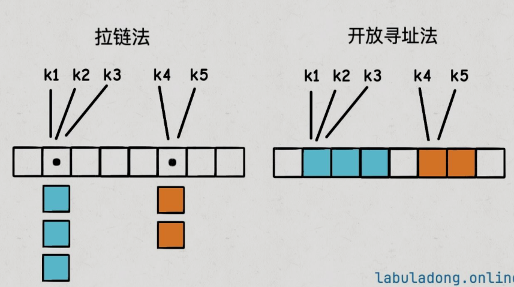
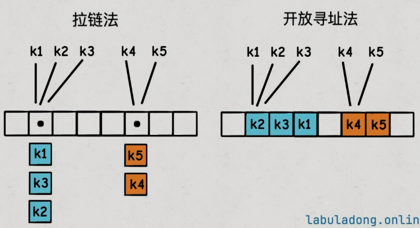

哈希表核我们常说的`Map`(键值映射)是不是同一个东西？

实际上它们本质上是不同的。我们可以用Java来说明

`Map`是Java接口，仅仅说明了若干个方法。并没有给出方法的具体实现

```java
interface Map<K, V> {
    V get(K key);
    void put(K key, V value);
    V remove(K key);
    // ...
}
```

`Map`接口本身只定义了键值映射的一系列操作，**`HashMap`这种数据结构根据自身特点实现了这些操作**。还有其他数据结构也实现了这个接口，比如`TreeMap`、`LinkedHashMap`等等

`HashMap`的`get.put,remove`方法的复杂度都是$O(1)$的，但是绝对不能说`Map`接口的复杂度都是$O(1)$。因为如果换成其他的实现类，比如底层用二叉树结构实现的`TreeMap`，这些方法的复杂度就变成$O(logN)$了

## 1. 哈希表的基本原理

哈希表可以理解为一个 **能力更强的数组**

数组可以通过索引在$O(1)$的时间复杂度找到对应的元素，索引是一个**非负数**

哈希表是类似的，可以通过`key`在$O(1)$事件复杂度内找到它对应的`value`。`key`的类型可以是 **数字、字符串**等多种类型

实际上哈希表的底层就是 **一个数组**(我们不妨称之为`table`)。它先把这个`key`通过一个哈希函数(我们不妨称之为`hash`)转化成数组里面的索引，然后**增删查改**和数组基本相同：

```python
class MyHashMap:
    def __init__(self):
        self.table = [None]*1000
    
    # 增/改,复杂度O(1)
    def put(self, key, value):
        index = self.hash(key)
        self.table[index] = value

    # 查，O(1)
    def get(self, key):
        index = self.hash(key)
        return self.table[index]

    # 删，O(1)
    def remove(self. key):
        index = self.hash(key)
        self.table[index] = None

    # 哈希函数，把key转化成table中的合法索引
    # 时间复杂度必须是O(1),才能保证上述方法的复杂度都是O(1)
    def hash(self, key):
        # ...
        pass
```

## 2. 关键的概念和原理

### 2.1 `key`是唯一的，`value`可以重复

### 2.2 哈希函数

哈希函数的作用是把任意长度的输入`key`转化成固定长度的输出`index`

**这个函数的性能是非常关键的**，如果它的复杂度达到$O(N)$，那么哈希表的增删查改都会退化到$O(N)$

这个函数还要保证一点是，输入相同的`key`，输出也必须要相同，这样才能保证哈希表的正确性

**如何把key转化成整数**

我们可以结合Java说一个简单的办法

任意Java对象都会有一个`int hashCode()`方法，在实现自定义的类时如果不重写这个方法，那么它的默认返回值可以认为是**该对象的内存地址**。一个对象的内存地址显然是全局唯一的一个整数

**如何保证索引合法**

`hashCode`方法返回的是`int`类型，首先一个问题是：这个`int`值可能是负数，而数组的索引是非负整数

如果用下面这种写法：

```c
int h = key.hashCode();
if(h < 0) h = -h;
```

但是这样有一个问题，`int` 类型可以表示的最小值是 $-2^31$，而最大值是 $2^31 - 1$。所以如果 $h = -2^31$，那么 $-h = 2^31$ 就会超出 int 类型的最大值，这叫做整型溢出，编译器会报错，甚至产生不可预知的结果。

这是由计算机补码编码造成的，那我们恰好可以利用这个性质去实现这个方法：

```c
int h = key.hashCode();
// 位运算，把最高位的符号位去掉
// 另外，位运算的运行速度也会比一般的算术运算快
// 所以你看标准库的源码，能用位运算的地方它都会优先使用位运算
h = h & 0x7fffffff;
// 这个 0x7fffffff 的二进制表示是 0111 1111 ... 1111
// 即除了最高位（符号位）是 0，其他位都是 1
// 把 0x7fffffff 和其他 int 进行 & 运算之后，最高位（符号位）就会被清零，即保证了 h 是非负数
```

我们还要考虑到`hashCoe()`往往非常大(内存值一般是16进制组成的超大数)，我们需要把它映射成`table`数组的合法索引

```c
int hash(K key) {
    int h = key.hashCode();
    // 保证非负数
    h = h & 0x7fffffff;
    // 映射到table数组的合法索引
    return h % table.length;
}
```

> 但是这样的性能比较低，可以使用位运算去优化

### 2.3 哈希冲突

上面给出了`hash`函数的实现，那么如果两个不同的`key`通过哈希函数得到了相同的索引，怎么办呢？这种情况叫做 **哈希冲突**

!!! note "哈希冲突是否可以避免"
哈希冲突不可能避免，只能在算法层面妥善处理出现哈希冲突的情况

哈希冲突是一定会出现的，因为`hash`函数相当于把一个无穷大的空间映射到了一个有限的索引空间，所以必然会有不同的`key`映射到同一个索引上
!!!

出现哈希冲突的情况怎么解决？两种常见的解决方法，一种是 **拉链法extending vertically**，另一种是 **线性探查法extending horizontally**(也经常被叫做开放寻址法)



- 拉链法：哈希表的底层数组不直接存储`value`类型，而是存储一个链表，当有多个不同的`key`映射到同一个索引上，这些`key->value`就存储在这个链表中
- **线性探查法**：一个`key`发现算出来的`index`已经被别的`key`占了，那么它就去`index + 1`的位置看看，如果还是被占了，就继续往后占，直到找到一个空位为止

!!! example
`key`的插入顺序是`k2,k4,k5,k3,k1`


!!!

### 2.4 扩容和负载因子

拉链法和线性探查法虽然能解决哈希冲突的问题，但是它们会导致性能下降

为什么会出现频繁出现的哈希冲突？有两个原因：

1. 哈希函数设计的不好，导致`key`的哈希值分布不均匀，很多`key`映射到了同一个索引上
2. 哈希表里面已经装了太多的`key-value`对，这种情况下即使哈希函数再完美，越发避免哈希冲突

第一个问题其实无需考虑，因为编程语言的开发者已经设计好了

第二个问题是可以控制的，即 **避免哈希表装的太满**，这就引出了 **负载因子**的概念

!!! note "负载因子"
负载因子是一个 **哈希表装满的程度的度量**。一般来说，负载因子越大，说明哈希表里面存储的`key-value`对越多，哈希冲突的概率就越大，哈希表的操作性能就越差

- 计算公式：$\frac{size}{table.length}$
  - `size`是哈希表里面的`key-value`对的数量
  - `table.length`:哈希表底层数组的容量

用拉链法实现的哈希表，负载因子可以无限大，因为链表可以无限延伸；用线性探查法实现的哈希表，负载因子不会超过 1

以`Java`的`HashMap`为例，晕粗我们创建哈希表时自定义负载因子，不设置的话默认是`0.75`，这个值是经验值，一般保持默认即可

**当哈希表内元素达到负载因子时，哈希表会扩容**。和之前讲解动态数组是类似的，就是把哈希表底层`table`数组的容量扩大，把数据搬移到新的大数组中。`size`不变，`table.length`增加，负载因子就减小了
!!!

### 2.5 为什么不能依赖哈希表的遍历顺序

这是一个编程的常识：**即哈希表中的遍历顺序是无序的，不能依赖哈希表的遍历顺序来编写程雪**

哈希表的遍历本质上就是那个底层`table`数组：

```java
// 遍历所有key的伪码逻辑

// 哈希表底层的table数组
KVNode[] table = new KVNode[1000];

// 获取哈希表中的所有键
// 我们不能依赖这个keys列表的顺序
List<KeyType> keys = new ArrayList<>();

for(int i = 0; i < table.length; i++){
    KVNode node = table[i];
    if(node != null) {
        keys.add(node.key);
    }
}
```

首先，由于`hash`函数要把你的`key`进行映射，所以`key`在底层`table`数组中的分布是随机的，不像数组/链表结构那样有一个明确的元素顺序

其次，刚才提到的哈希表达到负载因子时会怎样？那就是 **会扩容**，也就是`table.length`会变化，且会搬移元素

那么这个搬移数据的过程，是否需要用`hash`函数重新计算`key`的哈希值，然后放到新的`table`数组中？

然而这个`hash`函数，它计算出的索引值依赖`table.length`。也就是说，哈希表自动扩缩容之后，**同一个`key`存储在`table`的索引可能会发生变化**，所以遍历结果的顺序就和之前不一样了

我们可能发生到的现象就是，这次遍历的第一个键是`key1`，但是增删几个元素再遍历，可能发现`key1`跑到最后去了。

### 2.6 为什么不建议在for循环中增/删哈希表的key

我们这里仅从哈希表的原理上分析，在 for 循环中增/删哈希表的 key，是很容易出现问题的，原因和上面相同，还是扩缩容导致的哈希值变化。

遍历哈希表的 key，本质就是遍历哈希表底层的 table 数组，如果一边遍历一边增删元素，如果遍历到一半，插入/删除操作触发了扩缩容，整个 table 数组都变了，那么请问，接下来应该是什么行为？还有，在遍历过程中新插入/删除的元素，是否应该被遍历到？

扩缩容导致 key 顺序变化是哈希表的特有行为，但即便排除这个因素，任何其他数据结构，也都不建议在遍历的过程中同时进行增删，否则很容易导致非预期的行为。

如果你非要这样做，请确保查阅了相关文档，明确这个操作的行为是什么，做到心里有数。

### 2.7 key必须是不可变的

只有那些不可变类型，才能作为`key`这是很关键的

所谓不可变类型，就是说这个对象一旦创建，它的值是不能再改变的，比如`Java`中的`String, Integer`等类型，一旦创建了这些对象，就只能读取它的值而不能再修改它的值了

```java
// 可以把不可变类型作为 key
Map<String, AnyOtherType> map1 = new HashMap<>();
Map<Integer, AnyOtherType> map2 = new HashMap<>();

// 不应该把可变类型作为 key
// 注意，这样写并不会产生语法错误，但是代码非常容易出 bug
Map<ArrayList<Integer>, AnyOtherType> map3 = new HashMap<>();
```