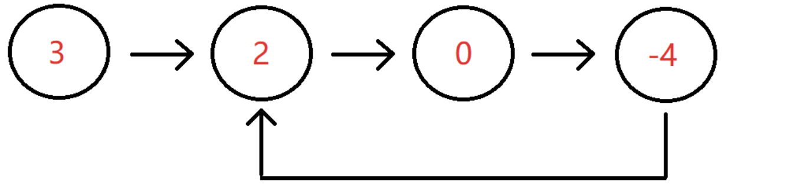

## 1. 反转链表

**题目的主要信息**：给定一个长度为`n`的链表，反转该链表，输出表头

**具体做法**：

- `step1`:先处理空链表，空链表不需要反转
- `step2`:我们可以设置两个指针，一个当前节点的指针，一个上一个节点的指针(初始为空，这里我们设计了一个dummy节点，防止了返回为空的情况)
- `step3`:遍历整个链表，每到一个节点,断开当前节点与后面节点的指针，并用临时节点保存后一个节点，然后当前节点指向上一个节点
- `step4`:再轮换当前指针与上一个指针，让它们进入下一个节点及下一个节点的前序节点

```java
public class Solution {
    public ListNode ReverseList(ListNode head) {
        if(head == null) {
            return null;
        }

        ListNode pre = null;
        ListNode cur = head;

        while(cur != null) {
            ListNode temp = cur.next;
            cur.next = pre;
            pre = cur;
            cur = temp;
        }

        return pre;
    }
}
```


<link rel="stylesheet" href="/my-blog/css/linklist-anim.css">
<div class="ll-viz" data-algorithm="reverse-list" data-values="1,2,3,4,5" data-autoplay="true" data-interval="1600"></div>



## 2. 链表内指定区间反转

**题目主要信息**：

- 将一个节点数为 size 链表 m 位置到 n 位置之间的区间反转
- 链表其他部分不变，返回头结点

**具体方法——头插法迭代法**：

- 在链表前面加一个表头(dummy)，这是很关键的，主要为了处理`m=1`也就是原先头节点被反转的情况
- 使用三个指针，一个指向`m`位置的前一个指针`pre`，一个指向我们要进行节点交换的操作对象`cur`，一个指向操作对象的下一个指针（也就是要与`cur`进行交换的指针）
- 首先遍历列表，找到`pre`这个指针
- `cur`从`m`一直到`n`这些位置，依次与其后面的指针交换位置
- 最后返回`dummy.next`也就是新表头

```java
import java.util.*;
public class Solution {
    public ListNode reverseBetween (ListNode head, int m, int n) {
        if(head == null || m == n) {
            return head;
        }

        ListNode dummy = new ListNode(0);
        dummy.next = head;
        ListNode pre = dummy;
        for(int i = 0; i < m-1; i++) {
            pre = pre.next;
        }

        ListNode cur = pre.next;
        ListNode then = cur.next;
        for(int i = 0; i < n - m; i++){
            cur.next = then.next;
            then.next = pre.next;
            pre.next = then;
            then = cur.next;
        }

        return dummy.next;
    }
}
```


<div class="ll-viz" data-algorithm="reverse-between" data-values="1,2,3,4,5" data-m="2" data-n="4" data-autoplay="false" data-interval="1700"></div>
<script src="/my-blog/js/linklist-anim.js"></script>


## 3. 链表中的节点每k个一组反转

**题目主要信息**：

- 给定一个链表，从头开始每`k`个作为一组，将每组的链表节点反转
- 组与组之间的位置关系不变
- 如果最后链表末尾剩余不足k个元素，则不翻转

**具体方法**：

- 先检查是否还有`k`个节点，如果不足`k`个节点马上返回
- 如果有`k`个节点，执行反转操作
- 执行之后将我们的检查移动到下一组中

```java
import java.util.*;

/*
 * public class ListNode {
 *   int val;
 *   ListNode next = null;
 *   public ListNode(int val) {
 *     this.val = val;
 *   }
 * }
 */

public class Solution {
    /**
     * 代码中的类名、方法名、参数名已经指定，请勿修改，直接返回方法规定的值即可
     *
     *
     * @param head ListNode类
     * @param k int整型
     * @return ListNode类
     */
    public ListNode reverseKGroup (ListNode head, int k) {
        ListNode dummy = new ListNode(0);
        dummy.next = head;
        ListNode pre = dummy;

        while(true){
            // 1. 检查后面够不够k个节点
            ListNode check = pre.next;
            int cnt = 0;
            while(check != null && cnt < k){
                check = check.next;
                cnt++;
            }

            if(cnt < k) break;

            // 2. 头插法翻转k个节点
            ListNode start = pre.next;
            ListNode then = start.next;

            for(int i = 1;i < k; i++){
                start.next = then.next;
                then.next = pre.next;
                pre.next = then;
                then = start.next;
            }

            // 3. 移动到下一组
            pre = start;
        }

        return dummy.next;
    }
}
```


<div
    class="ll-viz"
    data-algorithm="reverse-k"
    data-values="1,2,3,4,5"
    data-k="2"
    data-autoplay="false" data-interval="1700">
</div>
<script src="/my-blog/js/linklist-anim.js"></script>


## 4. 合并有序链表

**题目的主要信息**：

- 两个元素值递增的链表，单个链表的长度为`n`
- 合并这两个链表并使新链表中的节点仍然是递增排序的

**具体方法**

既然两个链表已经是排好序的，都是从小到大的顺序，那我们从两个链表里每次拿出一个节点比较，总是把较小的那一个拿出来就可以了

- 判断空链表的情况，只要有一个链表为空，那么答案一定就是另一个链表(即使另一个链表也是空的)
- 新建一个空的`dummy`，后面连接两个链表排序后的节点
- 在两个链表的节点都没有被拿出来时，取两个链表中存在的最小值放在新链表的结尾，那个被拿出节点的链表中的指针要记得后移
- 遍历到最后**肯定会有一个链表还有剩余的节点**，它们的值将大于前面所有的，直接连接在新的链表后面即可

```java
import java.util.*;

/*
 * public class ListNode {
 *   int val;
 *   ListNode next = null;
 *   public ListNode(int val) {
 *     this.val = val;
 *   }
 * }
 */

public class Solution {
    /**
     * 代码中的类名、方法名、参数名已经指定，请勿修改，直接返回方法规定的值即可
     *
     *
     * @param pHead1 ListNode类
     * @param pHead2 ListNode类
     * @return ListNode类
     */
    public ListNode Merge (ListNode pHead1, ListNode pHead2) {
        // write code here

        // 边界处理:其中一个链表为空直接返回另一个
        if(pHead1 == null) return pHead2;
        if(pHead2 == null) return pHead1;

        // 构建一个虚拟头节点：避免单独处理头节点，简化逻辑
        ListNode dummy = new ListNode(0);
        ListNode cur = dummy; // 游标指针

        while(pHead1 != null && pHead2 != null){
            if(pHead1.val < pHead2.val){
                cur.next = pHead1; //挂较小的节点
                pHead1 = pHead1.next; // 移动原链表的指针
            }
            else{
                cur.next = pHead2;
                pHead2 = pHead2.next;
            }

            cur = cur.next;
        }

        //  处理剩余节点：哪个链表还有节点，直接挂到末尾
        cur.next = pHead1 != null ? pHead1 : pHead2;
        return dummy.next;
    }
}
```


<div
    class="ll-viz"
    data-algorithm="merge-sorted"
    data-values-a="1,3,5"
    data-values-b="2,4,6"
    data-autoplay="false"
    data-interval="1500">
</div>


## 5. 合并k个已排序的链表

**题目的主要信息**：
- 给定k个排好序的升序链表
- 将这k个链表合并成一个大的升序链表，并返回这个升序链表的头

**核心思想——归并排序思想+分治思想**

这道题目看起来是`k`个链表的合并，实际上就是上一道题目的扩展情况，我们只需要将多个链表的合并转化成两两合并就可以了。

这时我们最先想到的思路一定是将这个`List`中的链表每次取出两个然后凉凉合并直到最后只剩下一个链表。但是这样是非常浪费时间的

那么如何进行分治呢？核心就是想清楚子问题是什么。我们既然知道如何对有序链表进行两两合并，那么我们的最小子问题其实就是 **两个有序链表的合并**。

- 对于这`k`个链表，就相当于上述合并阶段的`k`个子问题，需要两两合并，不断往上，最终**合并成完整的一个链表**
- 从链表数组的首和尾开始，每一次划分从中间开始划分，划分成两半
- 将这两半子问题合并好就成了两个有序链表，最后将这两个有序链表合并就完成了
- **终止条件**：划分的时候直到左右区间相等或左边大于右边
- **返回值**：每一级返回已经合并好的子问题链表
- **本级任务**：对半划分，将划分后的子问题合并成新的链表

```java
import java.util.*;

public class Solution {
    // 合并两个有序链表
    public ListNode Merge(ListNode pHead1, ListNode pHead2) {
        if (pHead1 == null) return pHead2;
        if (pHead2 == null) return pHead1;

        ListNode dummy = new ListNode(0);
        ListNode cur = dummy;

        while (pHead1 != null && pHead2 != null) {
            if (pHead1.val < pHead2.val) {
                cur.next = pHead1;
                pHead1 = pHead1.next;
            } else {
                cur.next = pHead2;
                pHead2 = pHead2.next;
            }
            cur = cur.next;
        }

        cur.next = pHead1 != null ? pHead1 : pHead2;
        return dummy.next;
    }

    // 分治
    public ListNode divideList(ArrayList<ListNode> lists, int left, int right) {
        if (left > right) return null;
        if (left == right) return lists.get(left);

        int mid = (left + right) / 2;
        return Merge(divideList(lists, left, mid), divideList(lists, mid + 1, right));
    }

    public ListNode mergeKLists(ArrayList<ListNode> lists) {
        if (lists == null || lists.size() == 0) return null;
        return divideList(lists, 0, lists.size() - 1);
    }
}
```


<div
    class="ll-viz"
    data-algorithm="merge-k-sorted"
    data-lists="1,2|1,4,5|6"
    data-autoplay="false"
    data-interval="1600">
</div>



**复杂度分析**

- 时间复杂度：$O(n \times k)$,其中`n`为所有链表的总结点数，最坏情况下每次合并都是$O(n)$，分治为二叉树型递归，每个节点都要使用一次合并，需要合并`k-1`次
- 空间复杂度:$O(log_2 k)$，最坏情况细递归$log_2 k$层，需要对应的递归栈

## 6. 判断链表是否有环

**题目主要信息**

- 给定一个链表的头节点，判断这个链表是否有环
- 环形链表如下所示：



**核心思想——双指针**

链表只有一个后继节点，所以如果这个链表是有环的，那么这个环一定在这个链表的结尾。加入不在末尾，那么那个造成环的起点节点会有两个后继节点

既然这个环只能在结尾，当没有环的时候，结尾一定会到达`NULL`，但是如果有环则永远不会出现`NULL`。那么我们怎么能发现这个环呢？一个只能单向移动的环不就是一个跑步的赛道吗，这个环既然存在，那么就说明两个速度不同的运送员一定在某一个时刻会出现追击问题

- 设置快慢两个指针，初始都指向表头
- 慢指针每次移动一个位置，快指针每次移动两个位置
  - 快指针一定要判断`fast.next`和`fast.next.next`是否为空
  - 因为它每次走两步，所以要验证两步是否`NULL`
- 如果开指针能够到达链表末尾，说明没有环
- 如果链表有环，那么这两个指针迟早相遇‘


```java
public class Solution {    public boolean hasCycle(ListNode head) {        if(head == null || head.next == null) return false;         ListNode fast = head;        ListNode slow = head;                 while(fast != null && fast.next != null){            fast = fast.next.next;            slow = slow.next;             if(fast == slow) return true;         }         return false;    }}
```


<div
    class="ll-viz"
    data-algorithm="detect-cycle"
    data-values="1,2,3,4,5"
    data-cycle-start="1"
    data-autoplay="false"
    data-interval="1500">
</div>



## 7. 链表中环的入口节点

**题目主要信息**：

- 给定一个链表，首先判断其是否有环，然后找到环的入口

**核心思路**

- 在判断是否有环问题上同上
- 在寻找入口时是与数学推导有关的。设链表头到环入口的距离为 X，入口到相遇点的距离为 Y，环的周长为 L。
    - 相遇时，慢指针走了 X + Y。
    - 快指针速度是 2 倍，走了 2(X + Y)，且比慢指针多走了 n 圈（n ≥ 1），即 2(X+Y) = X + Y + nL。
    - 化简得：X = nL - Y。
    - 这意味着：从相遇点 C 再走 X 步，刚好能回到环入口 B。
- 找入口：让一个指针从链表头 A 出发，另一个指针从相遇点 C 出发，两者都以相同速度前进，它们必然在环入口 B 相遇。

```java
public class Solution {
    public ListNode CycleNode(ListNode pHead) {
        if(pHead == null || pHead.next == null) {
            return null;
        }

        ListNode fast = pHead;
        ListNode slow = pHead;

        while(fast != null && slow != null) {
            fast = fast.next.next;
            slow = slow.next;

            if(fast == slow) {
                return slow;
            }
        }

        return null;
    }

    public ListNode EntryNodeOfLoop(ListNode pHead) {
        ListNode slow = CycleNode(pHead);

        if(slow == null){
            return null;
        }

        ListNode fast = pHead;

        while(fast!=slow) {
            fast = fast.next;
            slow = slow.next;
        }

        return slow;

    }
}
```


<div
    class="ll-viz"
    data-algorithm="cycle-entry"
    data-values="1,2,3,4,5"
    data-cycle-start="1"
    data-autoplay="false"
    data-interval="1600">
</div>



## 8. 链表中倒数最后k个结点

```java
public ListNode FindKthToTail (ListNode pHead, int k) {
    if(pHead == null){
        return null;
    }

    ListNode fast = pHead;
    for(int i = 0; i < k; i++){
        if(fast == null) return null;
        fast = fast.next;

    }

    ListNode slow = pHead;
    while(fast != null) {
        slow = slow.next;
        fast = fast.next;
    }

    return slow;
}
```

## 9. 删除链表的倒数第n个节点

```java
public ListNode removeNthFromEnd (ListNode head, int n) {
    ListNode dummy = new ListNode(0);
    dummy.next = head;

    ListNode fast = dummy;

    for(int i = 0; i <= n ; i++){
        if(fast == null) {
            return head;
        }
        fast = fast.next;
    }

    ListNode slow = dummy;

    while(fast!=null) {
        fast = fast.next;
        slow = slow.next;
    }

    slow.next = slow.next.next;

    return dummy.next;
}
```

## 10. 两个链表的第一个公共节点

```java
public class Solution {
    public ListNode FindFirstCommonNode(ListNode pHead1, ListNode pHead2) {
        if(pHead1 == null || pHead2 == null) {
            return null;
        }

        int num1 = 0;
        int num2 = 0;

        for(ListNode p1 = pHead1; p1 != null; p1 = p1.next) {
            num1++;
        }

        for(ListNode p2 = pHead2; p2 != null; p2 = p2.next) {
            num2++;
        }

        if(num1 > num2) {
            for(int i = 0; i < num1 - num2; i++){
                pHead1 = pHead1.next;
            }
        }else {
            for(int i = 0; i < num2 - num1; i++){
                pHead2 = pHead2.next;
            }
        }

        while(pHead1 != null && pHead2 != null) {
            if(pHead1 == pHead2) {
                return pHead1;
            }

            pHead1 = pHead1.next;
            pHead2 = pHead2.next;
        }
        return null;
    }
}
```


<div
    class="ll-viz"
    data-algorithm="intersection"
    data-autoplay="false"
    data-interval="1500">
</div>


## 11. 两个链表生成相加链表

```java
public class Solution {
    /**
     * 代码中的类名、方法名、参数名已经指定，请勿修改，直接返回方法规定的值即可
     *
     *
     * @param head1 ListNode类
     * @param head2 ListNode类
     * @return ListNode类
     */
    public ListNode reverse(ListNode head) {
        if(head == null) return null;

        ListNode dummy = new ListNode(0);
        dummy.next = head;
        ListNode cur = head;
        ListNode then = head.next;

        while(then != null) {
            cur.next = then.next;
            then.next = dummy.next;
            dummy.next = then;
            then = cur.next;
        }

        return dummy.next;
    }
    public ListNode addInList (ListNode head1, ListNode head2) {
        // write code here
        if(head1 == null) return head2;
        if(head2 == null) return head1;

        head1 = reverse(head1);
        head2 = reverse(head2);

        ListNode dummy = new ListNode(0);
        ListNode cur = dummy;
        int carry = 0;

        while(head1 != null || head2 != null || carry != 0){
            int val1 = (head1 == null) ? 0 : head1.val;
            int val2 = (head2 == null) ? 0 : head2.val;

            int digit = val1 + val2 + carry;
            carry = digit / 10;
            digit = digit % 10;
            cur.next = new ListNode(digit);

            cur = cur.next;

            if(head1 != null) head1 = head1.next;
            if(head2 != null) head2 = head2.next;
        }

        return reverse(dummy.next);

    }
```

## 12. 单链表的排序

```java
public class Solution {
    /**
     * 代码中的类名、方法名、参数名已经指定，请勿修改，直接返回方法规定的值即可
     *
     *
     * @param head ListNode类 the head node
     * @return ListNode类
     */
    public ListNode Merge(ListNode head1, ListNode head2) {
        if(head1 == null) return head2;
        if(head2 == null) return head1;

        ListNode dummy = new ListNode(0);
        ListNode cur = dummy;

        while(head1 != null && head2 != null) {
            if(head1.val < head2.val) {
                cur.next = head1;

                head1 = head1.next;
            }
            else {
                cur.next = head2;
                head2 = head2.next;
            }

            cur = cur.next;
        }

        if(head1 != null) cur.next = head1;
        if(head2 != null) cur.next = head2;

        return dummy.next;
    }
    public ListNode sortInList (ListNode head) {
        if(head == null || head.next == null) {
            return head;
        }

        ListNode fast = head.next;
        ListNode slow = head;

        while(fast != null && fast.next != null) {
            fast = fast.next.next;
            slow = slow.next;
        }

        ListNode mid = slow.next;
        slow.next = null;

        return Merge(sortInList(head), sortInList(mid));
    }
}
```


<div
    class="ll-viz"
    data-algorithm="sort-list"
    data-autoplay="false"
    data-interval="1550">
</div>


!!! warning
这里一定要注意：

```python
while(fast != null && fast.next != null)
```

两个顺序一定不能互换，因为可能出现fast.next本身就是`null`的情况，这时会导致程序崩溃

同时将链表拆分时一定记得断掉`slow.next`
!!!

## 13. 判断一个链表是否为回文结构

```java
public class Solution {
    /**
     * 代码中的类名、方法名、参数名已经指定，请勿修改，直接返回方法规定的值即可
     *
     *
     * @param head ListNode类 the head
     * @return bool布尔型
     */
    public ListNode reverse(ListNode head) {
        if(head == null) return head;

        ListNode dummy = new ListNode(0);
        dummy.next = head;
        ListNode cur = head;
        ListNode then = cur.next;

        while(then != null) {
            cur.next = then.next;
            then.next = dummy.next;
            dummy.next = then;
            then = cur.next;
        }

        return dummy.next;
    }
    public boolean isPail (ListNode head) {
        // write code here
        if(head == null || head.next == null) {
            return true;
        }

        ListNode fast = head.next;
        ListNode slow = head;

        while(fast != null && fast.next != null) {
            slow = slow.next;
            fast = fast.next.next;
        }

        ListNode mid = slow.next;
        slow.next = null;

        ListNode right = reverse(mid);

        while(right != null) {
            if(right.val != head.val) {
                return false;
            }

            right = right.next;
            head = head.next;
        }

        return true;
    }
}
```

## 14. 链表的奇偶重排

**题目主要信息**：

- 给定一个链表，将奇数位的节点一次连在前半部分，偶数位的节点依次连在后半部分
- 返回连接后的链表头

**核心思想——双指针**：

如下所示，第一个节点是奇数位，第二个节点是偶数，第二个节点后又是奇数位，因此可以断掉节点1和节点2之间的连接，指向节点2的后面即节点3，节点2以相同的原理指向节点4


- 判断空链表的情况，如果链表为空，不用重排
- 使用双指针`odd`和`even`分别遍历奇数节点和偶数节点，并给偶数节点加一个链表头
  - 只需要遍历一次整个链表，要及时调整`odd`和`even`指针
  - 偶数节点的头一定要保留下来，因为奇数节点后面要连接
- 上述过程，每次遍历两个节点，且`even`在后面，因此每轮循环用`even`检查后两个元素是否为`NULL`，如果不为`NULL`再进入循环进行上述连接过程
- 将偶数节点头接在奇数最后一个节点的后面再返回头部

```java
public class Solution {
    /**
     * 代码中的类名、方法名、参数名已经指定，请勿修改，直接返回方法规定的值即可
     *
     *
     * @param head ListNode类
     * @return ListNode类
     */
    public ListNode oddEvenList (ListNode head) {
        if(head == null || head.next == null) {
            return head;
        }

        ListNode odd = head;
        ListNode even = odd.next;
        ListNode evenHead = even;

        while(even != null && even.next != null) {
            odd.next = even.next;
            odd = odd.next;
            even.next = odd.next;
            even = even.next;
        }

        odd.next = evenHead;
        return head;
    }
}
```


<div
    class="ll-viz"
    data-algorithm="odd-even"
    data-autoplay="false"
    data-interval="1500">
</div>


## 15. 删除有序链表中重复的元素-I

```java
public class Solution {
    /**
     * 代码中的类名、方法名、参数名已经指定，请勿修改，直接返回方法规定的值即可
     *
     *
     * @param head ListNode类
     * @return ListNode类
     */
    public ListNode deleteDuplicates (ListNode head) {
        // write code here
        if(head == null || head.next == null) {
            return head;
        }

        ListNode slow = head;
        ListNode fast = head.next;

        while(fast != null) {
            if(slow.val == fast.val) {
                fast = fast.next;
            }else{
                slow.next = fast;
                slow = slow.next;
                fast = fast.next;
            }
        }

        slow.next = null;

        return head;
    }
}
```

## 16. 删除有序链表中重复的元素-II

**题目的主要信息**

- 在一个非降序的链表中，存在重复的节点，删除链表中重复的节点
- 重复的节点一个都不留

**核心思路**

- 这与15最核心的区别就是我们要删掉含有重复元素的所有节点，那么我们首先要设计一个`dummy`，主要是因为第一个节点也有可能被我们删除掉
- 既然要删除元素一定要保留前置指针
- 在处理的过程中，我们要做一个标记`flag`，用于记录当前处理的`start`和`then`是否相同
  - 如果相同，则置`1`，并删掉当前的`then`(也就是去掉一个重复的元素)
  - 如果不相同，这时候我们要判断`start`是否是先前有重复的元素
    - 如果`flag = 1`，则我们需要将`start`删除
    - 否则我们就直接让所有控制指针(三个)都向后移一个就可以了
- 这里最容易出错的地方就在于最后一个元素的处理问题，很有可能循环结束的时候最后一个元素还没有处理完，一定不能忘记要根据`flag`的值去判断一下最后一个元素是否也需要删掉


```java
public class Solution {
    /**
     * 代码中的类名、方法名、参数名已经指定，请勿修改，直接返回方法规定的值即可
     *
     *
     * @param head ListNode类
     * @return ListNode类
     */
    public ListNode deleteDuplicates (ListNode head) {
        // write code here
        if(head == null || head.next == null){
            return head;
        }

        ListNode dummy = new ListNode(0);
        dummy.next = head;
        ListNode pre = dummy;
        ListNode start = pre.next;
        ListNode then = start.next;

        int flag = 0;

        while(then!=null){
            if(start.val == then.val){
                start.next = then.next;
                then = then.next;
                flag = 1;
            }else{
                if(flag == 1){
                    pre.next = then;
                    start = then;
                    then = then.next;
                    flag = 0;
                }
                else{
                    pre = pre.next;
                    start = start.next;
                    then = then.next;

                }
            }
        }

        if(flag == 1){
            pre.next = then;
        }

        return dummy.next;
    }
}
```


<div
    class="ll-viz"
    data-algorithm="delete-duplicates-all"
    data-autoplay="false"
    data-interval="1550">
</div>

