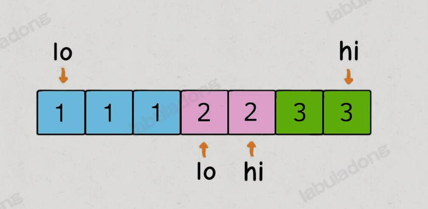

力扣上有一个很常见的题目就是`twoSum`问题，还会有衍生出来的各种求和问题。

总结来说，这类问题就是给出一个数组`nums`和一个目标`target`，让你从`nums`中选择`n`个数，使得这些数字之和为`target`

## 1. TwoSum问题

如果假设输入一个数组`nums`和一个目标`target`，需要我们返回`nums`中可以凑出`target`的两个元素的值，比如输入`nums = [1,3,5,6], target = 9`，那么算法返回两个元素`[3, 6]`。可以假设有且只有一对元素可以凑出`taget`

我们可以先对`nums`排序，然后利用双指针技巧中的左右指针技巧，从两端相向而行就可以了

[两数之和](https://leetcode.cn/problems/two-sum/description/)

```python
class Solution:
    def twoSum(self, nums: List[int], target: int) -> List[int]:
        d = {}
        for idx, num in enumerate(nums):
            need = target - num
            if need in d:
                return [d[need], idx]
            d[num] = idx
        return []
```

[两数之和 II - 输入有序数组](https://leetcode.cn/problems/two-sum-ii-input-array-is-sorted/description/)

```python
class Solution:
    def twoSum(self, numbers: List[int], target: int) -> List[int]:
        left, right = 0, len(numbers) - 1
        while left != right:
            sum = numbers[left] + numbers[right]
            if sum == target:
                return [left + 1, right + 1]
            elif sum < target:
                left += 1
            else:
                right -= 1

        return []
```

我们可以再提升一下题目的难度，把题目变得更泛化一些：`nums`中可能有多对元素之和都等于`target`，需要算法返回所有和为`target`的元素对，其中不能出现重复

例如输入是`nums = [1, 3, 1, 2, 2, 3], target = 4`,那么算法返回的结果就是`[[1, 3],[2, 2]]`(注意要求返回元素而不是索引)

对于修改后的问题，关键难点是现在可能有多个和为`target`的数对，还不能重复，比如上述例子中的`[1,3]`和`[3,1]`就算重复，只能算一次

- 基本思路肯定还是 **排序+双指针**
- 但是这样实现会造成重复的结果，比如说`nums = [1, 1, 1, 2, 2, 3, 3], target = 4`，得到的结果中`[1, 3]`一定会重复
- 出问题的地方在于`sum == target`条件的`if`分支，当给`res`加入一次结果后，`lo`和`hi`不仅应该相向而行，还应该跳过所有重复的元素



修改算法如下：

```python
while lo < hi:
    sum_val = nums[lo] + nums[hi]
    # 记录索引lo和hi最初对应的值
    left, right = nums[lo], nums[hi]
    if sum_val < target:
        lo += 1
    elif sum_val > target:
        hi -= 1
    else:
        res.append([left, right])
        # 跳过所有重复的元素
        while lo < hi and nums[lo] == left:
            lo += 1
        while lo < hi and nums[hi] == right:
            hi -= 1
```

这样就可以保证一个答案只被添加一次，重复的结果都会被跳过，可以得到正确的答案。不过，受这个思路的启发，其实前两个if分支也是可以做一点效率优化，跳过相同的元素

```python
def twoSumTargert(nums, target):
    # nums 数组必须有序
    nums.sort()
    lo, hi = 0, len(nums) - 1
    res = []
    while lo < hi:
        sum = nums[lo] + nums[hi]
        left, right = nums[lo], nums[hi]
        if sum < target:
            while lo < hi and nums[lo] == left: 
                lo += 1
        elif sum > target:
            while lo < hi and nums[hi] == right: 
                hi -= 1
        else:
            res.append([left, right])
            while lo < hi and nums[lo] == left: 
                lo += 1
            while lo < hi and nums[hi] == right: 
                hi -= 1
    return res
```

!!! warning
这里有一个十分容易被忽略的问题，就是循环内部一定要用`left`和`right`存下原始值，这样才能确保我们能跳过所有重复的值

如果直接通过将`nums[lo]与nums[lo + 1]`比较会产生最后一个`lo`停在最后一个重复元素的位置导致死循环的情况
!!!

这样，一个通用化`twoSum`函数就写出来了，请确保你理解了该算法的逻辑，我们后面解决`3Sum`和`4Sum`的时候会复用这个函数

这个函数的时间复杂度是$O(N)$，排序复杂度是$O(NlogN)$

## 2. 3Sum问题

[三数之和](https://leetcode.cn/problems/3sum/description/)

```
给你一个整数数组 nums ，判断是否存在三元组 [nums[i], nums[j], nums[k]] 满足 i != j、i != k 且 j != k ，同时还满足 nums[i] + nums[j] + nums[k] == 0 。请你返回所有和为 0 且不重复的三元组。

注意：答案中不可以包含重复的三元组。

示例 1：

输入：nums = [-1,0,1,2,-1,-4]
输出：[[-1,-1,2],[-1,0,1]]
解释：
nums[0] + nums[1] + nums[2] = (-1) + 0 + 1 = 0 。
nums[1] + nums[2] + nums[4] = 0 + 1 + (-1) = 0 。
nums[0] + nums[3] + nums[4] = (-1) + 2 + (-1) = 0 。
不同的三元组是 [-1,0,1] 和 [-1,-1,2] 。
注意，输出的顺序和三元组的顺序并不重要。
示例 2：

输入：nums = [0,1,1]
输出：[]
解释：唯一可能的三元组和不为 0 。
示例 3：

输入：nums = [0,0,0]
输出：[[0,0,0]]
解释：唯一可能的三元组和为 0 。
提示：

3 <= nums.length <= 3000
-105 <= nums[i] <= 105
```

我们先将这一类题目泛化：计算和为`target`的三元组。同上面的`twoSum`一样不允许有重复的结果

思路其实很简单，就是 **穷举**。我们想找和为`target`的三个数字，那么对于第一个数字，可能是什么？`num`中的每一个元素`nums[i]`都有可能

那么确定第一个数字之后，剩下的两个数字可以是什么？其实问题就变成了 **找到和为`target - nums[i]`的两个数字**

```python
def threeSumTarget(self, nums, target):
    nums.sort()
    n = len(nums)
    res = []
    # 穷举threeSum的第一个数
    i = 0
    while i < n:
        # 对target - nums[i]计算twoSum
         tuples = self.twoSumTarget(nums, i + 1, target - nums[i])
         # 如果存在满足条件的二元组，再加上nums[i]就是结果三元组
         for tuple in tuples:
            tuple.append(nums)
            res.append(tuple)
        # 跳过第一个数字重复的情况,否组会出现重复结果
        while i < n - 1 and nums == nums[i + 1]:
            i += 1
        i += 1
    return res
```

需要注意的是，类似`twoSum`，`3Sum`的结果也可能重复，比如输入是`nums = [1, 1, 1, 2, 3], target = 6`,可能会选出多个`[1,2,3]`

避免重复的关键点在于：**不能让第一个数重复**，至于后面的数，我们复用`twoSumTarget`的避免重复机制。所以代码总必须用一个`while`循环来保证`3Sum`的第一个元素不重复

## 3. 4Sum问题

[四数之和](https://leetcode.cn/problems/4sum/description/)

这道题目的思路本身也很简单，沿用上一道题目的思路直接通过一层一层的传递即可实现

```python
class Solution:
    def fourSum(self, nums: List[int], target: int) -> List[List[int]]:
        nums.sort()
        n = len(nums)
        res = []
        i = 0

        while i < n:
            triples = self.threeSum(nums, i + 1, target - nums[i])
            for triple in triples:
                triple.append(nums[i])
                res.append(triple)

            while i < n - 1 and nums[i] == nums[i + 1]:
                i += 1
            i += 1

        return res

    def threeSum(self, nums, idx, target):
        res = []
        n = len(nums)
        i = idx

        while i < n:
            pairs = self.twoSum(nums, i + 1, target - nums[i])
            for pair in pairs:
                pair.append(nums[i])
                res.append(pair)

            while i < n - 1 and nums[i] == nums[i + 1]:
                i += 1
            i += 1

        return res

    def twoSum(self, nums, idx, target):
        low = idx
        high = len(nums) - 1
        res = []
        while low < high:
            left, right = nums[low], nums[high]
            if nums[low] + nums[high] < target:
                while low < high and nums[low] == left:
                    low += 1
            elif nums[low] + nums[high] > target:
                while low < high and nums[high] == right:
                    high -= 1
            else:
                res.append([left, right])
                while low < high and nums[low] == left:
                    low += 1
                while low < high and nums[high] == right:
                    high -= 1

        return res
```

## 4. 100Sum问题

在`LeetCode`上，最多就是`4Sum`，但是刚才的几个`nSum`的过程实际上是遵循相同的规律的。我们可以用完全相同的方法解决更多的`nSum`问题

那么，如果求`100Sum`问题应该怎么做。我们可以观察上面这些解法，统一出一个`nSum`函数：

```python
# 注意：调用这个函数之前一定要先给nums排序
# n 填写想求的是几个数之和，start从哪个索引开始计算(一般填0)，target填想凑出的目标和
def nSumTarget(nums: List[int], n: int, start: int, target: int) -> List[List[int]]:
    sz = len(nums)
    res = []
    # 至少是 2Sum，且数组大小不应该小于n
    if n < 2 or sz < n:
        return res
    # 2Sum是base case
    if n == 2:
        # 双指针那一套操作:
        lo, hi = start, sz-1
        while lo < hi:
            sum = nums[lo] + nums[hi]
            left, right = nums[lo], nums[hi]
            if sum < target:
                while lo < hi and nums[lo] == left:
                    lo += 1
            elif sum > target:
                while lo < hi and nums[hi] == right:
                    hi -= 1
            else:
                res.append([left, right])
                while lo < hi and nums[lo] == left:
                    lo += 1
                while lo < hi and nums[hi] == right:
                    hi -= 1
        return res

    else:
        # n > 2时，递归计算 (n - 1)Sum的结果
        for i in range(start, sz):
            if i > start and nums[i] == nums[i - 1]:
                # 跳过重复元素
                continue
            subs = nSumTaret(nums, n - 1, i + 1, target - nums[i])
            for sub in subs:
                # (n - 1)Sum加上nums[i]就是nSum
                sub.append(nums[i])
                res.append(sub)

        return res
```