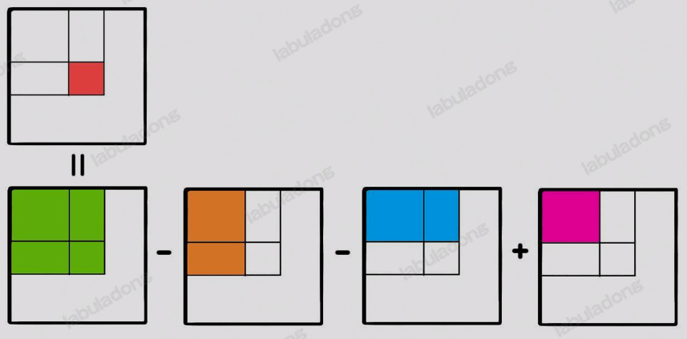

> 前缀和技巧适用于快速、频繁地计算一个索引区间内的元素之和

## 1. 一维数组中的前缀和

这是一道例题，[区域和检索-数组不可变](https://leetcode.cn/problems/range-sum-query-immutable/)，计算数组区间内元素的和，这是一道标准的前缀和问题

```
给定一个整数数组  nums，处理以下类型的多个查询:

计算索引 left 和 right （包含 left 和 right）之间的 nums 元素的 和 ，其中 left <= right
实现 NumArray 类：

NumArray(int[] nums) 使用数组 nums 初始化对象
int sumRange(int i, int j) 返回数组 nums 中索引 left 和 right 之间的元素的 总和 ，包含 left 和 right 两点（也就是 nums[left] + nums[left + 1] + ... + nums[right] )
示例 1：

输入：
["NumArray", "sumRange", "sumRange", "sumRange"]
[[[-2, 0, 3, -5, 2, -1]], [0, 2], [2, 5], [0, 5]]
输出：
[null, 1, -1, -3]

解释：
NumArray numArray = new NumArray([-2, 0, 3, -5, 2, -1]);
numArray.sumRange(0, 2); // return 1 ((-2) + 0 + 3)
numArray.sumRange(2, 5); // return -1 (3 + (-5) + 2 + (-1)) 
numArray.sumRange(0, 5); // return -3 ((-2) + 0 + 3 + (-5) + 2 + (-1))
提示：

1 <= nums.length <= 10^4
-10^5 <= nums[i] <= 10^5
0 <= i <= j < nums.length
最多调用 10^4 次 sumRange 方法
```

如果没有`sumRange`函数需要计算并返回一个索引区间之内的元素和，没学过前缀和的情况下写法为：

```java
class NumArray {
	private int[] nums;
	public NumArray(int[] nums) {
		this.nums = nums;
	}

	public int sumRange(int left, int right) {
		// 用 for 循环遍历求和
		int sum = 0;
		for (int i = left; i <= right; i++) {
			sum += nums[i];
		}
		return sum;
	}
}
```

这个解法每次调用`sumRange`函数时，都要进行一次`for`循环遍历，时间复杂度为$O(N)$,而`sumRange`的调用频率可能非常高，所以这个算法的效率很低

正确的解法是使用前缀和技巧进行优化，使得`sumRange`函数的时间复杂度是$O(1)$：

```python
class NumArray:
    # 前缀和数组
    def __init__(self, nums: List[int]):
        # 输入一个数组，构造前缀和
        # preSum[0] = 0, 便于计算累加和
        self.preSum = [0] * (len(nums) + 1)
        # 计算nums的累加和
        for i in range(1, len(self.preSum)):
            self.preSum[i] = self.preSum[i - 1] + nums[i - 1]

    # 查询闭区间
    def sumRange(self, left: int, right: int) -> int:
        return self.preSum[right + 1] - self.preSum[left]
```

这个技巧在生活中也很常用。比如班级中有若干同学，每个同学有一个期末考试成绩(满分100)，现在我们要实现一个API，输入任意一个分数段，返回有多少个同学的成绩在这个分数段内

我们可以先通过技术排序的方式计算每个分数具体有多少个同学，然后利用前缀和技巧来实现分数段查询的API：

```java
int[] scores = new int[]{...};
// 试卷满分100
int[] count = new int[100 + 1];

// 记录每个分数有几个同学
for(int score: scores) {
    count[score]++;
}

// 构造前缀和数组
for(int i = 1; i < count.length; i++) {
    count[i] = count[i] + count[i - 1]
}

// 利用count这个前缀和数组进行分数段查询
// 查询分数在[80.90]之间的同学有多少
int result = count[90] - count[79]
```

## 2. 二维矩阵中的前缀和

[二维区域和检索-矩阵不可变](https://leetcode.cn/problems/range-sum-query-2d-immutable/description/)

我们可以用一个嵌套的`for`循环去遍历这个矩阵，但是这样的话`sumRegion`的复杂度就会更高

一个任意子矩阵的元素和可以转化成它周边几个大矩阵元素和的运算



而这4个大矩阵有一个共同的特点，就是左上角都是`(0,0)`原点

那么这道题目一个很好的思路和一维数组中的前缀和是非常相似的，我们可以维护一个二维数组`preSum`,专门记录以原点为顶点的矩阵的元素之和，就可以用一次加减运算算出任意一个子矩阵的元素和

```python
class NumMatrix:

    def __init__(self, matrix: List[List[int]]):
        m = len(matrix)
        n = len(matrix[0])

        if m == 0 or n == 0:
            return
        
        self.preSum = [[0] * (n + 1) for _ in range(m + 1)]
        self.preSum[0][0] = 0
        self.preSum[0][1] = 0
        self.preSum[1][0] = 0

        for i in range(1, m + 1):
            for j in range(1, n + 1):
                self.preSum[i][j] = self.preSum[i-1][j] + self.preSum[i][j-1] - self.preSum[i - 1][j - 1] + matrix[i-1][j-1]

    def sumRegion(self, row1: int, col1: int, row2: int, col2: int) -> int:
        return self.preSum[row2 + 1][col2 + 1] - self.preSum[row2 + 1][col1] - self.preSum[row1][col2 + 1] + self.preSum[row1][col1]
```

这样， `sumRegion`的调用时间复杂度被压缩到了$O(1)$，这是典型的 **空间换时间**

## 3. 前缀和的局限性

**1. 使用前缀和技巧的前提是原数组nums不变**

如果原数组的某个元素改变了，那么`preSum`数组中该元素后面的值就会失效，需要重新花费 $O(n)$的时间复杂度计算`preSum`数组

**2. 前缀和只适用于存在逆运算的场景**

比如求和场景，直知道$x + 6 = 10$的情况下，可以推导出$x = 10 - 6 = 4$，求乘积的场景也是类似的

但是有些场景是没有逆运算的，比如 $max(x, 8) = 8$，那么我们无法推算出x的具体应该是多少

想要同时解决这两个问题，就需要更高级的数据结构，最通用的解决方案是 **线段树**