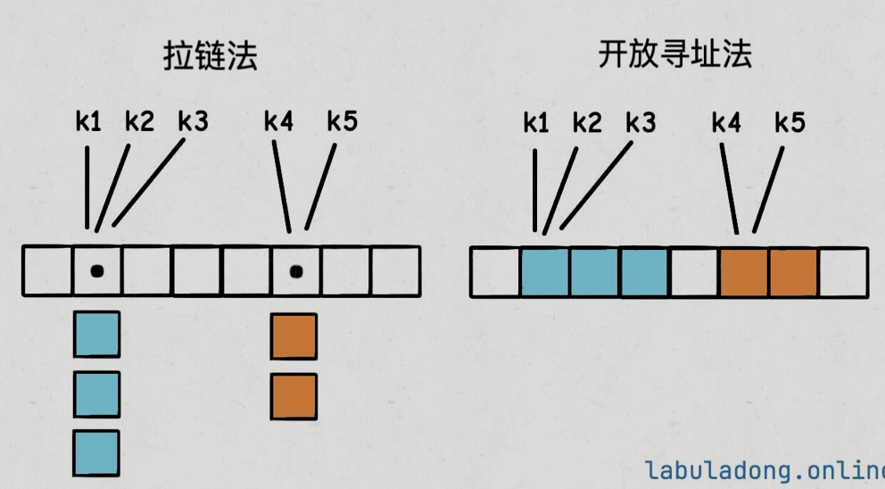

之前我们提到了哈希表的核心机制和关键概念，其中我们提到了两种解决哈希冲突的方法：

- 拉链法
- 开防汛执法(线性探查法)



这篇文章主要介绍一下拉链法的实现原理和代码

## 1.拉链法的简化实现

> `hansh`函数的作用是在$O(1)$的时间把`key`转化成数组的索引，而`key`可以是任意不可变的类型。但是这里为了方便理解，会做一些必要的简化

1. 我们实现的哈希表只支持`key`类型为`int`，`value`类型为`int`的情况。如果`key`不存在，就返回`-1`
2. 我们实现的`hash`函数就是简单地取模，即`hash(key) = key % table.length`。这样方便模拟哈希冲突的情况
3. 底层的`table`数组的大小在创建哈希表的时候就固定，不考虑负载因子和动态扩容的问题

## 2. 简化代码

```python
class KVNode:
    # 链表节点，存储key-value对
    def __init__(self, key, value):
        self.key = key
        self.value = value

class ExampleChainingHashMap:

    def __init__(self, capacity):
        # 底层table数组的每个元素是一个链表
        self.table = [None] * capacity

    def hash(self, key):
        return key % len(self.table)

    def get(self, key):
        # 查
        index = self.hash(key)

        if self.table[index] is None:
            # 链表为空，说明key不在
            return -1

        list = self.table[index]
        # 遍历链表，尝试查找目标`key`，返回对应的value
        for node in list:
            if node.key == key:
                return node.value
        
        # 链表中没有目标key
        return -1
    
    def put(self, key, value):
        # 增/改
        index = self.hash(key)

        list = self.table[index]
        if list is None:
            self.table[index] = []
            self.table[index].append(KVNode(key, value))
            return 

        list_ = self.table[index]
        for node in list_:
            if node.key == key:
                node.value = value
                return

        list_.append(KVNode(key, value))

    def remove(self, key):
        # 删
        list_ = self.table[self.hash(key)]
        if _list is None:
            return
        
        list_[:] = [node for node in list_ if node.key != key]
```

## 3. 完整的代码实现

现在我们来看一个相对比较完善的Java代码实现，主要新增了以下几个功能：

1. 使用了泛型，可以存储任意类型的`key`和`value`
2. 底层的`table`数组会根据负载因子动态扩容
3. 使用了之前[哈希表基础](source/_posts/leetcode/hashtable.md)中提到的`hash`函数，利用`key`的`hashCode()`方法和`table.length`来计算哈希值
4. 实现了`keys()`方法，可以返回哈希表中所有的`key`

为了方便，我直接用标准库的链表容器，这样就无需手动处理增删表节点的操作了。

```python
class MyChainingHashMap:
    # 拉链法适用的单链表节点，存储key-value对
    class KVNode:
        def __init__(self, key, value):
            self.key = key
            self.value = value

    # 哈希表的底层数组，每个数组元素是一个链表，链表中每个节点是KVNode存储键值对
    def __init__(self, init_capacity = 1):
        # 哈希表中存入的键值对的个数
        self.size = 0
        # 保证table的容量至少为1，因为后续有求余运算，避免出现除数为0的情况
        self.capacity = max(init_capacity, 1)
        # 初始化哈希表
        self.table = [[] for _ in range(self.capacity)]
    
    # 增/改
    # 如果键key已经存在，则将值修改为val
    def put(self, key, value):
        if key is None:
            raise ValueError("key is null")
        index = self._hash(key)
        buckert = self.table[index]
        # 如果key之前存在，则修改对应的val
        for node in bucket:
            if node.key == key:
                node.value = value
                return
        
        # 如果key不存在，则插入，size增加
        bucket.append(self.KVNode(key, value))
        self.size += 1

        # 如果元素数量超过负载因子，则进行扩容
        if self.size >= self.capacity * 2:
            self._resize(self.capacity * 2)

    # 删
    def remove(self, key):
        if key is None:
            raise ValueError("key is None")

        index = self._hash(key)
        bucket = self.bucket(index)

        for node in bucket:
            if node.key == key:
                bucket.remove(node)
                self.size -= 1

                # 缩容
                if self.size <= self.capacity / 8:
                    self._resize(max(self.capacity // 4, 1))
                return

    # 查
    # 返回 key 对应的 val,如果key不存在，则返回null
    def get(self, key):
        if key is None:
            raise ValueError("key is None")

        index = self._hash(key)
        bucket = self.table[index]
        for node in bucket:
            if node.key == key:
                return node.value
        return None

    
    # 返回所有 key
    def keys(self):
        keys = []
        for bucket in self.table:
            for node in bucket:
                keys.append(node.key)
        return keys

    # **** 其他工具函数 ****

    def size(self):
        return self.size

    # 哈希函数，将键映射到 table 的索引
    def _hash(self, key):
        return hash(key) % self.capacity

    def _resize(self, new_capacity):
        # 构造一个新的 HashMap
        new_map = MyChainingHashMap(new_capacity)
        # 穷举当前 HashMap 中的所有键值对
        for bucket in self.table:
            for node in bucket:
                # 将键值对转移到新的 HashMap 中
                new_map.put(node.key, node.value)
        # 将当前 HashMap 的底层 table 换掉
        self.table = new_map.table
        self.capacity = new_capacity
```