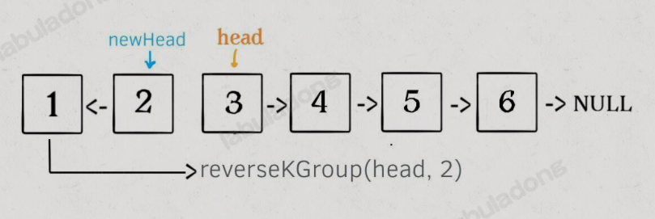
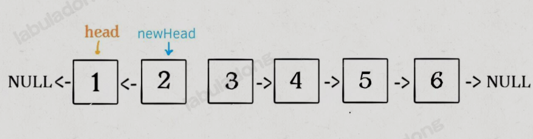
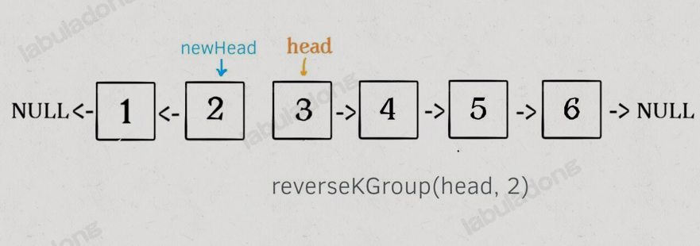
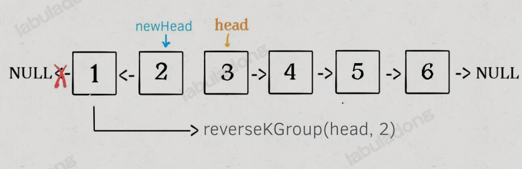

## 1. 反转整个链表

### 1.1 迭代解法

迭代解法是一个非常简单的思路，新建一个空链表，原链表顺序访问，每个节点使用 **头插法逐个插入到新链表中**，新链表就是一个反转之后的链表

方法本身不难，但是要注意一些问题：

1. 如果出现`then.next`这种操作，就要条件反射地想到，先判断`then`是否为`null`，否则容易出现空指针异常
2. 注意循环的终止条件。我们要知道循环终止时，各个指针的位置，这样才能保证返回正确的答案

```python
# 由于单链表的结构，至少要用三个指针才能完成迭代反转
# cur是当前遍历的节点，pre是cur的前驱节点，nxt是cur的后继节点
pre, cur, nxt = None, head, head.next
while cur is not None:
    # 逐个节点反转
    cur.next = pre
    pre = cur
    cur = nxt
    if nxt is not None:
        nxt = nxt.next

# 返回反转后的头节点
return pre
```

### 1.2 递归解法

**递归反转单链表的关键在于这个问题本身是存在子问题结构**

比如，现在给一个输入`1->2->3->4`，这个问题的递归子问题就是`reverse(2->3->4)->1`

这就是 **分解问题**的思路，通过递归函数的定义，把原问题分解成若干规模更小、结果相同的子问题，最后通过子问题的答案组装原问题的解

```python
class Solution:
    # 定义：输入一个单链表头节点，将该链表反转，返回新的头节点
    def reverseList(self, head):
        if head is None or head.next is None:
            return head
        last = self.reverseList(self.head.next)

        head.next.next = head
        head.next = None

        return last
```

这个算法常常来显示递归的巧妙和优美，我们下面来解释一下这段代码

大概的思路就是：**输入一个节点`head`，将以head为起点的链表反转，并返回反转之后的头节点**

比如我们要反转下面这个链表：


那么输入`reverseList(head)`后，会在这里进行递归：

```python
last = reverseList(head.next)
```

> 这里不要条件递归里面，而是要根据刚才的函数定义，来共清除这段代码会产生什么结果


这个操作的结果是


根据函数的定义，`reverseList`函数会返回反转之后的头节点，我们用变量`last`接收

接下来我们要做的就是把1接到后面就可以了，也就是

```python
head.next.next = head
head.next = None
```


!!! warning
递归操作的本身并不高效，空间复杂度非常高
!!!

## 2. 反转链表前N个节点

这次要实现的是这样一个函数

```python
# 将链表的前 n 个节点反转（n <= 链表长度）
def reverseN(head: ListNode, n: int):
```

比如说对于下图链表，执行`reverseN(head, 3)`:


#### 迭代解法

迭代解法应该比较好写，在之前实现的`reverseList`基础上稍加修改即可

```python
def reverseN(head: ListNode, n: int):
    if head is None or head.next is None:
        return head
    
    pre, cur, nxt = None, head, head.next

    while n > 0:
        cur.next = pre
        pre = cur
        cur = nxt

        if nxt is not None:
            nxt = nxt.next
        
        n -= 1
    # 此时的cur是第n+1个节点，head是反转后的尾节点
    head.next = cur
    # 此时的pre是反转后的头节点
    return pre
```

#### 递归解法

```python
# 后驱结点
successor = None

# 反转以head为起点的n个节点，返回新的头节点
def reverseN(head: ListNode, n: int):
    global successor
    if n == 1:
        # 记录第n + 1个节点
        successor = head.next
        return head
    
    # 以head.next为起点，需要反转前n - 1个节点
    last = reverseN(head.next, n - 1)
    head.next.next = head
    head.next = successor

    return last
```

**具体的区别**

1. base case变为`n == 1`，反转一个元素，就是它本身，同时要记录后驱节点，即要记录第`n + 1`个节点
2. 刚才我们直接把`head.next`设置为`null`，因为整个链表反转后原来的`head`变成了整个链表的最后一个节点，但是现在`head`节点在递归反转之后不一定是最后一个节点了，`head.next`不能直接赋值为`null`，所以要记录后驱`successor`(第`n + 1`个节点)，反转之后将`head`连接上


## 3. 反转链表的一部分

我们可以再进一步，给定一个索引区间，让你把单链表中这部分元素反转，其他部分不变，下面这道题目就是在说明这个问题

### 92. 反转链表II

```
给你单链表的头指针 head 和两个整数 left 和 right ，其中 left <= right 。请你反转从位置 left 到位置 right 的链表节点，返回 反转后的链表 。
 

示例 1：


输入：head = [1,2,3,4,5], left = 2, right = 4
输出：[1,4,3,2,5]
示例 2：

输入：head = [5], left = 1, right = 1
输出：[5]
 

提示：

链表中节点数目为 n
1 <= n <= 500
-500 <= Node.val <= 500
1 <= left <= right <= n
 

进阶： 你可以使用一趟扫描完成反转吗？
```

函数签名为：

```python
def reverseBetween(head: ListNode, m: int, n: int) -> ListNode:
```


#### 迭代解法

纯迭代的思路比较直接，可以找到第`m - 1` 个节点,然后复用之前实现的`reverseN`即可

```python
class Solution:
    def reverseBetween(self, head: ListNode, m: int, n: int) -> ListNode:
        if m == 1:
            return self.reverseN(head, n)
        # 找到第 m 个节点的前驱
        pre = head
        for i in range(1, m - 1):
            pre = pre.next
        # 从第 m 个节点开始反转
        pre.next = self.reverseN(pre.next, n - m + 1)
        return head

    def reverseN(self, head: ListNode, n: int) -> ListNode:
        if head is None or head.next is None:
            return head
        pre, cur, nxt = None, head, head.next
        while n > 0:
            cur.next = pre
            pre = cur
            cur = nxt
            if nxt is not None:
                nxt = nxt.next
            n -= 1
        # 此时的 cur 是第 n + 1 个节点，head 是反转后的尾结点
        head.next = cur 
        # 此时的 pre 是反转后的头结点
        return pre
```

> 这里有一个比较容易遗漏的：`head.next = cur`

#### 递归算法

纯递归解法，依然是找到第`m - 1`个节点，然后复用之前实现的`reverseN`函数就行了

关键是，如何通过递归的方式找到第`m - 1`个节点呢？

如果我们把`head`的索引视为`1`，那么我们是想从第`m`个元素开始反转；如果把`head.next`的索引视为1呢？那么相对于`head.next`，反转的区间应该是从第`m - 1`个元素开始的，那么对于`head.next.next`呢

这其实就是用递归的方式来进行迭代，我们可以这样写代码：

```python
class Solution:
    def __init__(self):
        # 后驱节点
        self.successor = None

    def reverseBetween(self, head, m, n):
        # base case
        if m == 1:
            return self.reverseN(head, n)
        # 前进到反转的起点出发base case
        head.next = self.reverseBetween(head.next, m - 1, n- 1)
        return head
    
    # 反转以head为起点的n个节点，返回新的头节点
    def reverseN(self, head, n):
        if n == 1:
            # 记录第n + 1个节点
            self.successor = head.next
            return head

        last = self.reverseN(head.next, n - 1)

        head.next.next = head
        head.next = self.successor
        return last
```

## 4. K个一组反转链表

### 25. K个一组反转链表

```
给你链表的头节点 head ，每 k 个节点一组进行翻转，请你返回修改后的链表。

k 是一个正整数，它的值小于或等于链表的长度。如果节点总数不是 k 的整数倍，那么请将最后剩余的节点保持原有顺序。

你不能只是单纯的改变节点内部的值，而是需要实际进行节点交换。

示例 1：


输入：head = [1,2,3,4,5], k = 2
输出：[2,1,4,3,5]
示例 2：


输入：head = [1,2,3,4,5], k = 3
输出：[3,2,1,4,5]
提示：
链表中的节点数目为 n
1 <= k <= n <= 5000
0 <= Node.val <= 1000
进阶：你可以设计一个只用 O(1) 额外内存空间的算法解决此问题吗？
```

**思路分析**

认真思考一下这个问题，会发现这个问题具有递归性质

比如我们对这个链表调用`reverseGroup(head, 2)`，即以2个节点为一组反转链表


如果我们把前两个节点反转，那么后面的那些节点怎么处理？后面的这些节点也是一条链表，而且规模(长度)比原来这条链表小，这就是规模更小、结构相同的子问题

我们可以先把原先的`head`指针移动到后面那一段链表的开头，然后继续递归调用`reverseKGroup(head, 2)`：



发现了递归性质，就可以得到大致的算法流程：

1. 先反转以`head`开头的`k`个元素，这里可以复用前面实现的`reverseN`函数



2. 将第`k + 1`元素作为`head`递归调用`reverseKGroup`



3. 将上述两个过程的结果连接起来



```python
def reverseN(self, head: Optional[ListNode], k: int):
    if head is None:
        return head

    pre, cur, nxt = None, head, head.next
    while k > 0:
        cur.next = pre
        pre = cur
        cur = nxt

        if nxt is not None:
            nxt = nxt.next

        k -= 1

    head.next = cur
    return pre

    def reverseKGroup(self, head: Optional[ListNode], k: int):
        a = b = head
        for _ in range(k):
            if b is not None:
                return head

            b = b.next

        newHead = self.reverseN(a, k)
        head.next = self.reverseKGroup(b, k)
        return newHead
```

