# 多媒体技术基础 Chapter 2：图形与图像数据表示

## 目录

1. [基本数据类型](#1-基本数据类型)
   - [1位图像](#11-1位图像)
   - [8位灰度图像](#12-8位灰度图像)
   - [24位彩色图像](#13-24位彩色图像)
   - [8位彩色图像](#14-8位彩色图像)
   - [颜色查找表](#15-颜色查找表)
   - [如何设计颜色查找表](#16-如何设计颜色查找表)
2. [流行文件格式](#2-流行文件格式)
   - [GIF格式](#21-gif图像)
   - [JPEG格式](#22-jpeg图像)
   - [BMP格式](#23-bmp图像)
   - [其他图像格式](#24-其他典型图像格式)
3. [Matlab图像编程](#3-matlab图像编程)
4. [课堂练习](#4-课堂练习)
5. [总结](#总结)
6. [参考资料](#参考资料)

---

## 1. 基本数据类型

本章介绍图像的基本数据类型，包括从简单的1位二值图像到复杂的24位彩色图像，以及颜色查找表的工作原理。

### 1.1 1位图像

#### 1.1.1 定义

1位图像（1-Bit Image），又称**二值图像**（Binary Image）或**单色图像**（Monochrome Image），是最简单的图像类型。

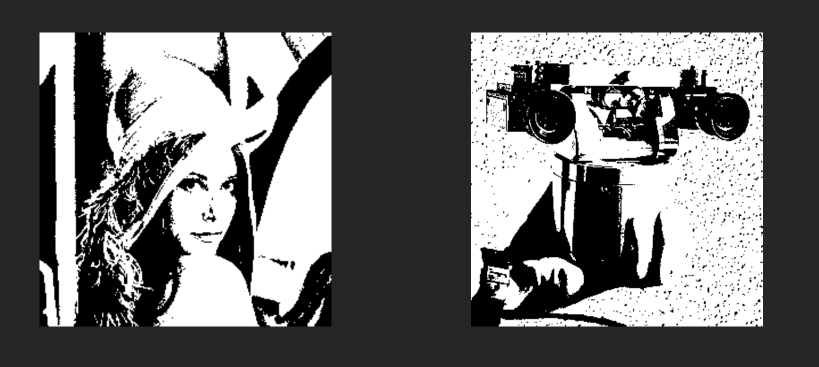

#### 1.1.2 特点

- 由**开**（on）和**关**（off）像素组成
- **每个像素(`pixel`)仅存储为单个比特**（0或1）
  - **0**：黑色
  - **1**：白色

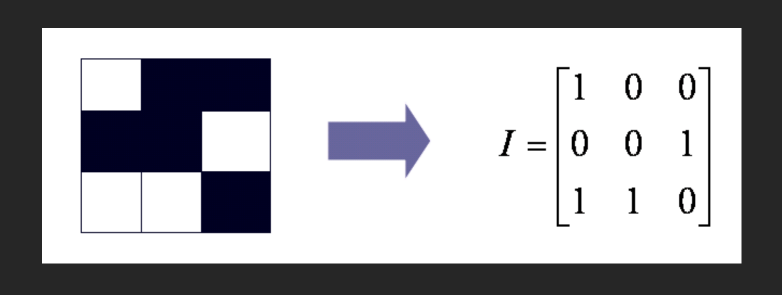

!!! example 二值图像示例

二值图像常用于：
- 简单的几何图形
- 文字文档
- Fax传真图像
- 扫描的文档

!!!

#### 1.1.3 存储空间与用途

**存储空间计算：**

对于分辨率为 640×480 的单色图像：
- 像素总数：640 × 480 = 307,200 个像素
- 存储空间：640 × 480 / 8 = **38.4 KB**

**用途：**

- 包含简单图形和文本的图像
- 需要快速处理和传输的场景
- 文档扫描和传真

---

### 1.2 8位灰度图像

#### 1.2.1 定义

8位灰度图像（8-Bit Gray-Level Image）使用一个字节（8位）来表示每个像素的灰度值。

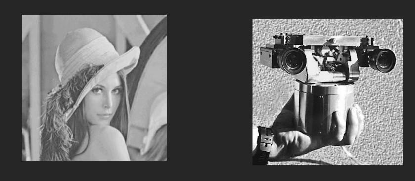

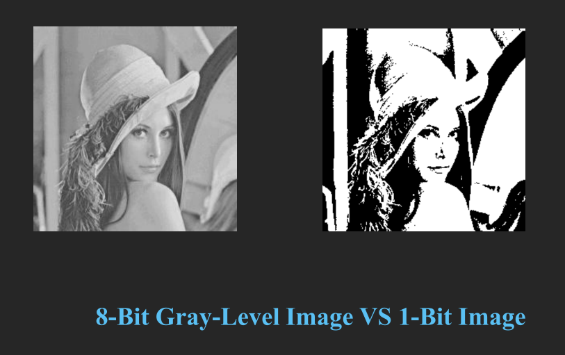

#### 1.2.2 特点

- 每个像素由**单个字节**表示
- 灰度值范围：**0到255**（共256个灰度级别）
  - 0：纯黑色
  - 255：纯白色
- 整个图像可以视为一个**二维像素值数组**，又称**位图**（Bitmap）

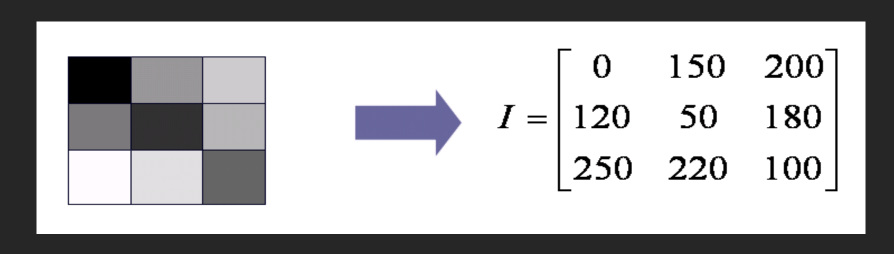

!!! tip 灰度图像与二值图像对比

| 特性 | 1位图像 | 8位灰度图像 |
|------|---------|-------------|
| 像素深度 | 1位 | 8位 |
| 灰度级别 | 2级（黑白） | 256级 |
| 存储空间 | 较小 | 较大 |
| 图像质量 | 简单粗糙 | 细腻自然 |

!!!

#### 1.2.3 位平面（Bitplane）表示

8位灰度图像可以看作由**8个1位位平面**组成：

- 每个位平面由图像的一组1位表示组成
- 所有位平面组合成一个字节，存储0~255的值
- 高位平面（Plane 7）包含图像的主要结构信息
- 低位平面（Plane 0）包含图像的细节信息

```
Bitplane 7 (最高位)
    ↓
Bitplane 0 (最低位)
```

!!! example 位平面分解

例如，像素值 180（二进制 10110100）：
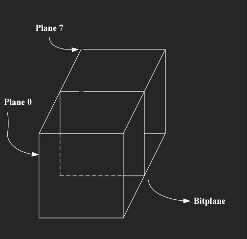
- Bitplane 7: 1
- Bitplane 6: 0
- Bitplane 5: 1
- Bitplane 4: 1
- Bitplane 3: 0
- Bitplane 2: 1
- Bitplane 1: 0
- Bitplane 0: 0

!!!

#### 1.2.4 分辨率与存储空间

**常见分辨率：**

| 分辨率 | 宽高比 | 像素总数 |
|--------|--------|----------|
| 高分辨率 | 1600×1200 | 1,920,000 |
| 低分辨率 | 640×480 | 307,200 |
| 常见比例 | 4:3 | - |

**640×480 灰度图像存储空间：**
- 640 × 480 = **307,200 字节**（约300KB）

**硬件存储：**
- 帧缓冲区（Frame Buffer）/ 显卡（Video Card）

#### 1.2.5 灰度图像打印：Dithering（抖动）

**问题：** 如何在只能打印二值（黑白）点的打印机上打印8位灰度图像？

**Dithering（抖动）基本思想：**
- 将**灰度分辨率**转换为**空间分辨率**
- 用不同密度的点模式来近似不同的灰度级别
   - 衡量指标：`DPI`(dot per inch)
- **N×N矩阵可以表示 N²+1 个灰度级别**

!!! warning 抖动算法的作用

抖动技术将**颜色的分辨率**(color resolution)转换为**空间的分辨率**(spatial resolution)，通过在图像上**生成不同密度的点来模拟灰度变化**。

!!!

**2×2 模式可表示5个灰度级别：**

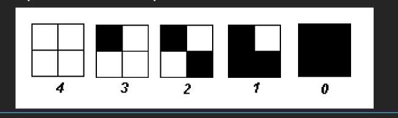


- 我们可以首先通过256/5将256个灰度级别映射为5个灰度级别。如果像素值为0，我们在打印输出的$2\times2$区域内什么都不打印；如果像素值为4，我们打印全部四个点
- 如果`indensity`大于抖动矩阵条目，则在该条目位置打印一个`on dot`：将每个像素替换为一个$2 \times 2$的矩阵
- 上述方法可以增发输出图像的尺寸：如果一个像素使用$4\times 4$模式，则$N \times N$的图像大小会变为$2N \times 2N$,使**图像变大了16倍**

**有序抖动算法：**

```c
// 有序抖动算法伪代码
BEGIN
    for x = 0 to x_max_columns
        for y = 0 to y_max_rows
            i = x mod n
            j = y mod n
            // I(x, y) 是输入, O(x, y) 是输出
            // D 是抖动矩阵
            if I(x, y) > D(i, j)
                O(x, y) = 1;  // 打印黑点
            else
                O(x, y) = 0;  // 打印白点
END
```

**标准抖动矩阵（4×4 Bayer矩阵）：**

$$
D = \begin{bmatrix}
0 & 8 & 2 & 10 \\
12 & 4 & 14 & 6 \\
3 & 11 & 1 & 9 \\
15 & 7 & 13 & 5
\end{bmatrix}
$$

!!! example 打印示例

将 240×180×8bit 图像打印到 12.8×9.6 英寸的纸上，打印机分辨率为 300×300 DPI：

- 纸张点数：(300×12.8) × (300×9.6) = 3480×2880 点
- 每个像素对应：(3480/240) × (2880/180) = 16×16 = **256个点**

!!!

#### 1.2.6 改进的抖动方法

**问题：** 原始方法会显著增大输出图像尺寸（N×N模式会使N×N图像变成4N×4N）

**改进方案：** 使用标准矩阵模式

- 存储一个整数矩阵（标准模式），值为0到255
- 将灰度图像矩阵与模式矩阵比较
- 当灰度值大于模式矩阵对应位置的值时打印黑点

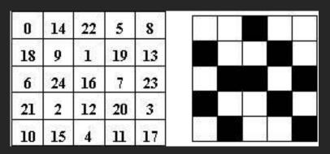
*One 25-grey level case: left is standard, the right with grey=15*

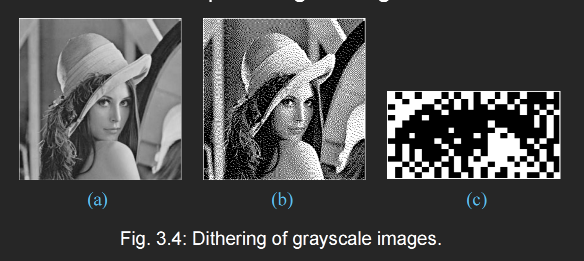
图3.4：灰度图像抖动示例
- (a): 8位灰度图像 "lenagray.bmp"
- (b): 抖动处理后的版本
- (c): 抖动版本的细节

!!! attention 注意事项

使用4×4抖动矩阵会使输出图像放大16倍！因此在实际应用中需要权衡图像质量和输出尺寸。

!!!

!!!question
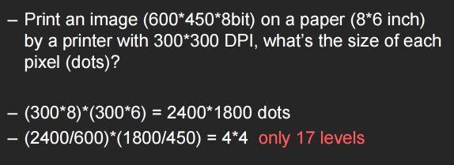
!!!

---

### 1.3 24位彩色图像

#### 1.3.1 定义

24位彩色图像（24-Bit Color Image）使用三个字节（24位）来表示每个像素的颜色值。

#### 1.3.2 特点

- 每个像素使用**三个字节**，分别表示 **R（红）、G（绿）、B（蓝）**
- 每个颜色通道的值范围：**0到255**
- 支持颜色数：256 × 256 × 256 = **16,777,216 种颜色**（约1677万色）
- 每个像素由RGB三个通道的不同灰度值描述

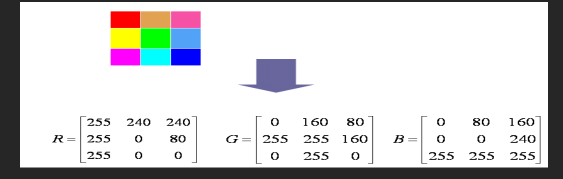

!!! tip 人眼对颜色的感知

人眼能够感知约1677万种颜色，因此24位彩色图像能够提供非常逼真的色彩还原。

!!!

#### 1.3.3 存储空间

**640×480 24位彩色图像大小：**
- 640 × 480 × 3 bytes = **921.6 KB**

#### 1.3.4 32位彩色图像

很多24位彩色图像实际存储为**32位图像**：
- 额外的一个字节用于存储**α值**（Alpha）
- α值表示透明度信息
- 用于实现半透明效果

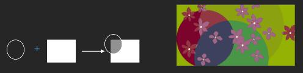

**半透明图像颜色计算公式：**

$$
\text{最终颜色} = \text{源图像颜色} \times (100\% - \text{透明度}) + \text{背景图像颜色} \times 透明度
$$

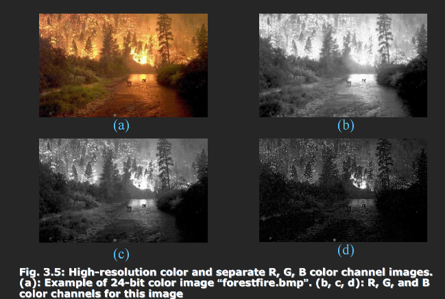

图3.5：高分辨率彩色图像和分离的R、G、B颜色通道
- (a): 24位彩色图像 "forestfire.bmp"
- (b), (c), (d): 该图像的R、G、B颜色通道


---

### 1.4 8位彩色图像

#### 1.4.1 定义

8位彩色图像（8-Bit Color Image），又称**256色图像**，使用调色板（Palette）来存储颜色。

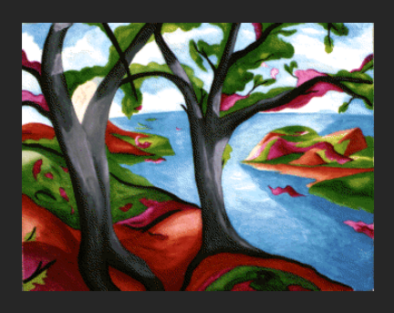
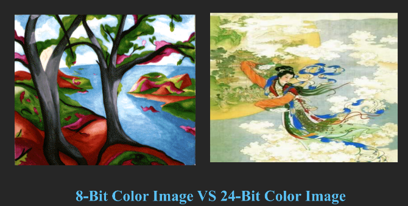

#### 1.4.2 特点

**调色板（LUT）工作原理：**
- 图像只存储一组字节（**索引值**），而非真实颜色
- 字节值作为**索引**，指向一个3字节的颜色表（调色板）
- 选择调色板中放入哪些颜色非常重要

**调色板设计方法：**
- 选择最重要的256种颜色
- 通过聚类算法从 256×256×256 种颜色中选取
- **中值切割算法**（Median-cut Algorithm）

!!! example 8位与24位彩色图像对比

| 特性 | 8位彩色图像 | 24位彩色图像 |
|------|-------------|---------------|
| 颜色数量 | 256种 | 16,777,216种 |
| 存储空间（640×480） | 300 KB | 921.6 KB |
| 颜色精度 | 较低 | 非常高 |
| 文件大小 | 较小 | 较大 |

8位彩色图像可节省大量存储空间：一个640×480的8位彩色图像只需300KB，而24位彩色图像需要921.6KB。

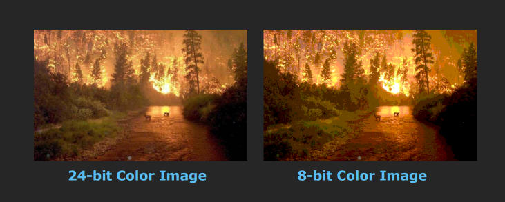
!!!

---

### 1.5 颜色查找表

#### 1.5.1 定义

颜色查找表（Color Lookup Table，LUT），也称为**调色板**（Palette）或**颜色表**，是8位彩色图像中用于存储颜色信息的表。

#### 1.5.2 工作原理

1. 图像中每个像素存储一个**索引值**（0到255）
2. 通过索引值在LUT中查找对应的RGB颜色
3. LUT表每一行包含：索引值、R值、G值、B值

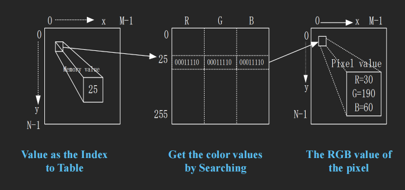

**查找过程：**
1. 像素值作为索引（如25）
2. 在LUT第25行查找颜色
3. 获取RGB值（如R=30, G=190, B=60）

#### 1.5.3 应用场景

**应用1：快速改变图像颜色**

通过修改LUT，可以快速改变整个图像的色调，而无需修改像素数据：

| 索引 | 修改前R | 修改前G | 修改前B | → | 修改后R | 修改后G | 修改后B |
|------|---------|---------|---------|---|---------|---------|---------|
| 1 | 255 | 0 | 0 | → | 0 | 255 | 0 |

例如：将红色改为绿色

**应用2：医学图像**

将灰度图像转换为彩色图像，便于医生观察：

- 灰度图像 → 修改LUT → 彩色图像
- 不同灰度值映射到不同颜色，增强对比度

!!! example 医学图像LUT示例

常见的医学图像伪彩色编码：
- **彩虹编码**：将灰度映射为彩虹色
- **热金属编码**：将灰度映射为金属热度颜色
- **冷热编码**：蓝-绿-红渐变

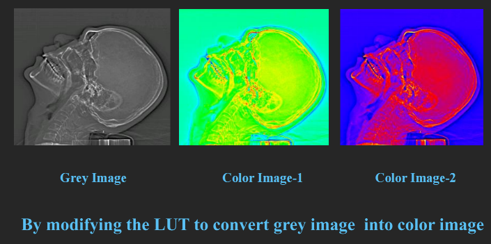
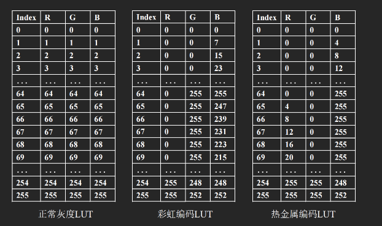

> 只需要将索引颜色的RGB参数调整一下就可以
!!!

---

### 1.6 如何设计颜色查找表

人类对R和G的敏感程度高于B

#### 1.6.1 基本思想：聚类

**问题：** 如何从16,777,216种颜色中选择最重要的256种？

**解决方案：** 聚类算法

- 分析图像的**三维RGB颜色直方图**
- 将相似的颜色聚类在一起
- 从每个聚类中选择代表性颜色

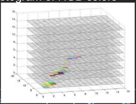

!!! warning 计算复杂度

聚类算法计算量大且速度慢，需要消耗大量计算资源。

!!!

#### 1.6.2 简单量化方法

**基本思路：**
- 人眼**对R和G的敏感度高于B**
- 分配更多位给R和G，较少位给B
- 例如：R=3位, G=3位, B=2位

**颜色级别计算：**
- R: 2³ = 8级（0, 32, 64, 96, 128, 160, 192, 224）
- G: 2³ = 8级
- B: 2² = 4级
- 总计：8 × 8 × 4 = **256种颜色**

!!! example 颜色转换示例

原始像素颜色 [30, 129, 80] 转换为调色板索引：
- R: 30 → 最近的值 32
- G: 129 → 最近的值 128
- B: 80 → 最近的值 96
- 转换结果：[32, 128, 96]

> 这里可以向下取也可以向上取，取决于我们规定的算法

!!!

#### 1.6.3 中值切割算法（Median-cut Algorithm）

**算法步骤：**

1. 收集图像中所有像素的RGB值
2. 将所有颜色视为三维颜色空间中的点
3. 递归地划分颜色空间(按照R,G,B的顺序)：
   - 找到包含最多像素的颜色通道
   - 在该通道的中位数处切割
   - 重复直到得到256个区域
4. 每个区域的中心作为调色板颜色

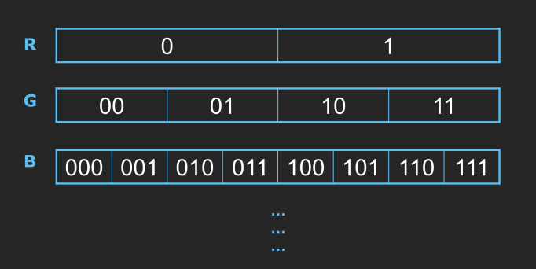

**算法图示：**
- R通道分为多段
- G通道分为多段
- B通道分为多段

!!! tip 中值切割算法的优点

1. 能够根据图像内容自适应选择颜色
2. 保持颜色分布的均匀性
3. 保留图像中最重要的颜色信息

!!!

---

## 2. 流行文件格式

### 2.1 GIF图像

#### 2.1.1 概述

GIF（Graphics Interchange Format）由**Unisys公司**和**CompuServe**于1987年发明，最初用于通过电话线传输图形图像。

#### 2.1.2 特点

**压缩算法：**
- 使用 **LZW（Lempel-Ziv-Welch）压缩算法**
- **无损压缩**，压缩率约50%
- 适合连续色调的图像

**颜色限制：**
- 仅支持**8位256色**图像
- 图像深度：1位到8位

**交错（Interlacing）：**
- 采用交错方式存储
- 可以分四遍逐步显示（先显示轮廓，再显示细节）
- 适合网络传输，用户可以快速看到图像轮廓

**动画支持：**
- GIF89a版本支持动画
- 可以在一个文件中存储多帧图像

!!! example GIF格式应用场景

1. 网站图标和按钮
2. 简单动画
3. 需要透明背景的图像
4. 需要无损压缩的图像

!!!

#### 2.1.3 文件结构分析

**GIF文件头部格式：**

| 偏移量 | 长度 | 内容 |
|--------|------|------|
| 0 | 3字节 | "GIF"（GIF签名） |
| 3 | 3字节 | "87a"或"89a"（版本号） |
| 6 | 2字节 | 逻辑屏幕宽度 |
| 8 | 2字节 | 逻辑屏幕高度 |
| 10 | 1字节 | 字段标志 |
| 11 | 1字节 | 背景颜色索引 |
| ... | ... | ... |

**字段标志位含义：**
- bit 0: 全局颜色表标志（GCTF）
- bit 1-3: 颜色分辨率
- bit 4: 全局颜色表排序标志
- bit 5-7: 全局颜色表大小：2^(1+n)

---

### 2.2 JPEG图像

#### 2.2.1 概述

JPEG（Joint Photographic Experts Group）由**ISO**组织的专家小组创建。

#### 2.2.2 特点

**压缩原理：**
- 利用人类视觉系统的某些限制
- 实现**高压缩率**
- **有损压缩**方法

**质量控制：**
- 允许用户设置所需的**质量级别**或**压缩比**
- 压缩比 = 输入文件大小 / 输出文件大小

!!! warning JPEG压缩注意事项

JPEG是有损压缩，压缩比越高，图像质量损失越大。需要根据实际应用场景在文件大小和图像质量之间做出权衡。

!!!

#### 2.2.3 压缩效果示例

| 文件 | 大小 | 压缩比 |
|------|------|--------|
| 原始图像 | ~252 KB | 1:1 |
| JPEG (中等质量) | 45.2 KB | ~5.6:1 |
| JPEG (高压缩) | 9.21 KB | ~27:1 |


---

### 2.3 BMP图像

#### 2.3.1 概述

BMP（Bitmap）由**微软公司**创建，是Windows系统的主要图像格式。

#### 2.3.2 存储形式

1. **无压缩**（最常用）
2. **RLE8**：用于256色图像
3. **RLE4**：用于16色图像

#### 2.3.3 文件结构

BMP文件由四个部分组成：

1. **文件头**（File Header）
   - 文件类型
   - 其他信息

2. **位图信息头**（Bitmap Information Header）
   - 图像长度、宽度
   - 压缩算法等

3. **调色板**（Palette）
   - 颜色LUT表
   - 24位真彩色图像无需调色板

4. **图像数据**（Image Data）
   - 真彩色图像：存储R、G、B三个分量
   - 带调色板图像：存储调色板索引

!!! example BMP文件格式分析

128×128 灰度图像的BMP文件结构：

| 偏移量 | 长度 | 内容 |
|--------|------|------|
| 0 | 2字节 | "BM" |
| 2 | 4字节 | 文件总大小 |
| 6 | 2字节 | Reserved1 |
| 8 | 2字节 | Reserved2 |
| 10 | 4字节 | 像素数据偏移量 |
| 14 | 4字节 | 信息头大小 |
| 18 | 4字节 | 图像宽度 |
| 22 | 4字节 | 图像高度 |
| 26 | 2字节 | 颜色平面数 |
| 28 | 2字节 | 每像素位数 |
| 30 | 4字节 | 压缩类型 |
| 34 | 4字节 | 图像数据大小 |
| 38 | 4字节 | X方向分辨率 |
| 42 | 4字节 | Y方向分辨率 |
| 46 | 4字节 | 颜色数量 |
| 50 | 4字节 | 重要颜色数 |
| 54 | n-40 | OS/2扩展字段 |
| 54+n | ... | 调色板数据 |
| ... | ... | 像素数据 |

!!!

---

### 2.4 其他典型图像格式

#### 2.4.1 PNG（Portable Network Graphics）

- 便携式网络图形
- 无损压缩
- 支持透明通道
- 适用于网络图像

#### 2.4.2 TIFF（Tagged Image File Format）

- 标记图像文件格式
- 支持多种压缩算法
- 适合印刷和出版
- 支持多页图像

#### 2.4.3 EXIF（Exchange Image File）

- 交换图像文件格式
- 存储数码相机元数据
- 包含拍摄参数、时间、GPS等信息

---

## 3. Matlab图像编程

### 3.1 基本操作

```matlab
% 读取图像
im = imread(filename);

% 显示图像
imshow(im);

% 保存图像
imwrite(ob, filename);
```

### 3.2 颜色通道操作

```matlab
% 获取红色通道
R = im(:,:,1);

% 获取绿色通道
G = im(:,:,2);

% 获取蓝色通道
B = im(:,:,3);

% 获取特定像素的绿色值
green_value = im(m, n, 2);
```

### 3.3 颜色转换示例

```matlab
% 调色板定义
R_levels = [16, 48, 80, 112, 144, 176, 208, 240];
G_levels = [16, 48, 80, 112, 144, 176, 208, 240];
B_levels = [32, 96, 160, 224];

% 将像素 [30, 129, 80] 转换为调色板索引
R_new = 16;    % 30最接近16
G_new = 112;   % 129最接近112
B_new = 96;    % 80最接近96

% 转换结果
new_pixel = [16, 112, 96];
```

### 3.4 相关工具箱

- **Image Acquisition Toolbox**：图像采集
- **Image Processing Toolbox**：图像处理
- **Video and Image Processing Blockset**：视频和图像处理模块集

---

## 4. 课堂练习

### 练习1：8位灰度图像量化

**问题：** 将8位灰度图像量化为2位精度，最简单的方法是什么？原始图像的哪些字节值映射到哪些量化值？

**解答：**

将256个灰度级别映射到4个级别（2位）：
- 除以 256/4 = 64
- 量化值 = floor(原始值 / 64)

| 原始灰度范围 | 量化值 |
|-------------|--------|
| 0-63 | 0 |
| 64-127 | 1 |
| 128-191 | 2 |
| 192-255 | 3 |

---

### 练习2：有序抖动矩阵大小

**问题：** 5位灰度图像（32级灰度）在1位打印机上显示，需要多大的有序抖动矩阵？

**解答：**

- 5位灰度：2⁵ = 32级
- 需要表示32个灰度级别
- 矩阵大小：N×N，其中 N²+1 ≥ 32
- N = 6（6×6 = 36 ≥ 32）

因此需要 **6×6** 的抖动矩阵。

---

### 练习3：24位颜色分配

**问题：** 24位彩色图像，人眼对R的敏感度是G的1.5倍，对G的敏感度是B的2倍。如何最优分配24位？

**解答：**

敏感度比例：R:G:B = 3:2:1

按比例分配位数：
- 总位数：12 + 8 + 4 = 24位
- R通道：12位
- G通道：8位
- B通道：4位

---

## 总结

本章主要介绍了图形和图像数据表示的基本知识：

1. **基本数据类型**：
   - 1位二值图像：最简单的图像形式，每个像素1位
   - 8位灰度图像：256级灰度，每个像素1字节
   - 24位彩色图像：约1677万色，每个像素3字节
   - 8位彩色图像：256色，使用调色板技术

2. **关键技术**：
   - Dithering（抖动）：将灰度图像转换为二值图像
   - 颜色查找表（LUT）：8位彩色图像的颜色管理
   - 中值切割算法：设计优化的调色板

3. **流行文件格式**：
   - GIF：无损压缩，256色，支持动画
   - JPEG：有损压缩，高压缩率，适合照片
   - BMP：无压缩，质量最高，文件较大
   - PNG：无损压缩，支持透明，网络图像

4. **编程基础**：
   - Matlab图像处理基本操作
   - 颜色通道的读取和操作

---

## 参考资料

- 课程教师：Jun Xiao（肖俊）
- 课程名称：Fundamentals of Multimedia
- 授课学院：College of Software and Technology
- 课件链接：slide 2 - Graphics and Image Data Representation.pdf
- C#图像处理资源：
  - www.codeproject.com - Image Processing for Dummies with C# and GDI+
  - www.codeproject.com - Image Processing Lab

