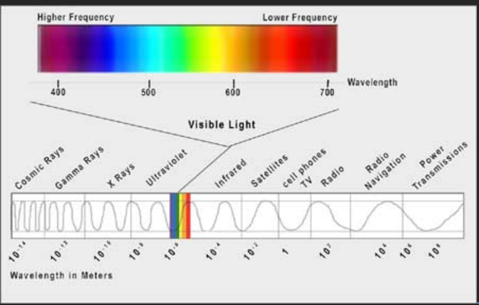
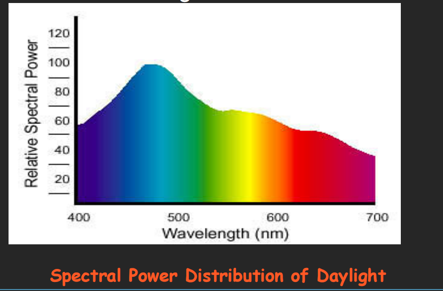
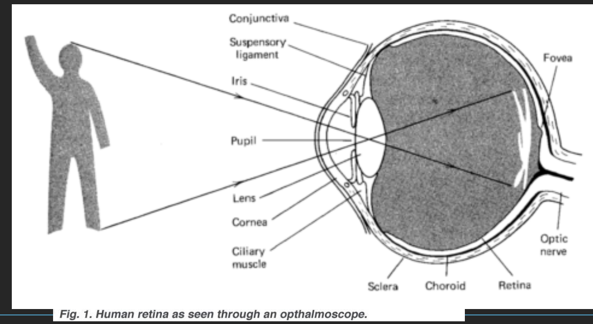
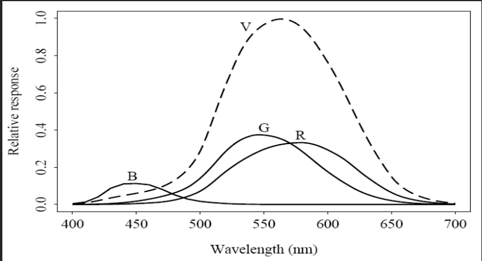
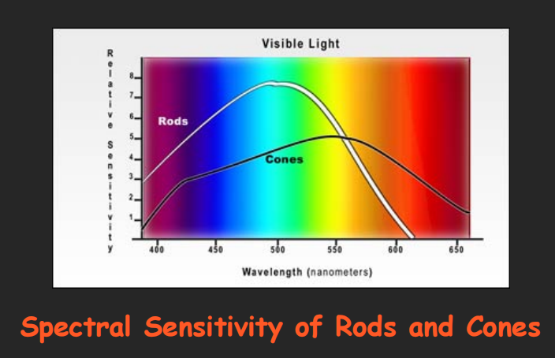
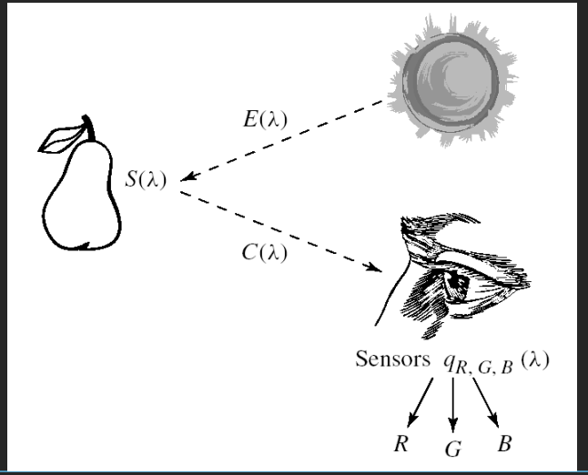

# 多媒体技术基础 Chapter 3：图像与视频中的颜色

## 目录

1. [颜色科学](#1-颜色科学)
   - [光与光谱](#11-光与光谱)
   - [Gamma校正](#12-gamma校正)
   - [颜色匹配函数](#13-颜色匹配函数)
   - [L*a*b*颜色模型](#14-lab颜色模型)
   - [其他颜色模型](#15-其他颜色模型)
2. [图像中的颜色模型](#2-图像中的颜色模型)
   - [RGB模型](#21-rgb模型)
   - [CMY模型](#22-cmy模型)
   - [CMYK模型](#23-cmyk模型)
3. [视频中的颜色模型](#3-视频中的颜色模型)
   - [YUV模型](#31-yuv模型)
   - [YIQ模型](#32-yiq模型)
   - [YCbCr模型](#33-ycbcr模型)
4. [课堂练习](#4-课堂练习)
5. [总结](#总结)
6. [参考资料](#参考资料)

---

## 1. 颜色科学

本章介绍颜色的科学原理，包括光的特性、人眼视觉系统、Gamma校正以及各种颜色模型。

### 1.1 光与光谱

#### 1.1.1 光的基本特性

- **光是一种电磁波**，其颜色由波长决定
  - 激光光(`Laser Light`)——单一波长
  - 大多数光源——多个波长的组合
  - 短波——蓝色，长波——红色
  - 可见光范围：**400-700nm**（纳米）

#### 1.1.2 光谱功率分布（SPD）

- **光谱功率分布（Spectral Power Distribution, SPD）**：每个波长间隔的**相对功率**
- 波长用符号 **λ** 表示，曲线称为 **E(λ)**
- 日光的光谱功率分布是研究颜色复现的基础

#### 1.1.3 人眼视觉系统

人眼的工作原理类似于**相机**：

- **晶状体**（Lens）将图像聚焦到**视网膜**（Retina）上
- 视网膜包含**视杆细胞**（Rods）和**视锥细胞**（Cones）

| 细胞类型 | 作用 | 敏感度 |
|---------|------|--------|
| 视杆细胞 | 光线较暗时起作用，产生灰度图像 | 对波长敏感范围广 |
| 视锥细胞 | 光线充足时起作用，产生彩色图像 | 对红(R)、绿(G)、蓝(B)最敏感 |

#### 1.1.4 视锥细胞的比例

- 视锥细胞约有**600万个**
- 红、绿、蓝三种视锥细胞的比例：**R:G:B = 40:20:1**
- 人眼对可见光中间的波长最为敏感
  - 人眼对光的敏感是**波长的函数**
  - 蓝色受体的敏感度未按比例显示，因其远小于红色或绿色曲线的数值。

#### 1.1.5 颜色感知公式

人眼中每个颜色通道的响应可表示为积分形式：

$$R = \int E(\lambda) q_R(\lambda) d\lambda$$

$$G = \int E(\lambda) q_G(\lambda) d\lambda$$

$$B = \int E(\lambda) q_B(\lambda) d\lambda$$

其中 **E(λ)** 是光源的SPD，**q_R(λ)、q_G(λ)、q_B(λ)** 是视锥细胞的敏感度函数。

#### 1.1.6 图像形成模型

图像形成的完整过程：

1. 光源发出的光具有SPD **E(λ)**
2. 照射到物体表面，物体表面具有光谱反射函数 **S(λ)**
3. 反射光经过人眼视锥细胞过滤

**颜色信号**定义为：$C(\lambda) = E(\lambda) \cdot S(\lambda)$

最终的RGB响应：

$$R = \int E(\lambda) S(\lambda) q_R(\lambda) d\lambda$$

$$G = \int E(\lambda) S(\lambda) q_G(\lambda) d\lambda$$

$$B = \int E(\lambda) S(\lambda) q_B(\lambda) d\lambda$$

#### 1.1.7 相机系统

相机系统的工作方式与人眼类似：
- 专业相机在每个像素位置产生三个信号（对应视网膜位置）
- 模拟信号转换为数字信号，若使用8位精度，则R、G、B的最大值为255，最小值为0

---

### 1.2 Gamma校正

#### 1.2.1 CRT显示器的工作原理

- CRT（阴极射线管）将RGB数值转换回模拟电压
- 驱动电子枪发射电子
- **光强与电压成正比**

#### 1.2.2 Gamma特性

CRT的输出光强与驱动电压的关系是：
$$Light \propto Voltage^\gamma$$

其中 **γ（Gamma）** 约为 **2.2**

#### 1.2.3 Gamma校正过程

为了补偿显示器的非线性特性，在传输前对信号进行Gamma校正：

$$R' = R^{1/\gamma}$$

接收端：$R = (R')^\gamma$

#### 1.2.4 实际应用中的Gamma校正公式

摄像机传递函数（SMPTE-170标准）：

$$
V_{out} = \begin{cases}
4.5 \times V_{in} & \text{if } V_{in} < 0.018 \\
1.099 \times V_{in}^{0.45} - 0.099 & \text{if } V_{in} \geq 0.018
\end{cases}
$$

#### 1.2.5 为什么使用Gamma 2.2？

- NTSC的实际Gamma值接近2.8（约1.25 × 2.2）
- 人眼对**灰度级比率**比绝对强度更敏感

---

### 1.3 颜色匹配函数

#### 1.3.1 颜色匹配实验

在心理学实验中，使用三种基本光源（R、G、B）来匹配给定颜色：

- 使用的三种原色：红色（700nm）、绿色（546.1nm）、蓝色（435.8nm）
- 实验设备称为**色度计**（Colorimeter）

#### 1.3.2 CIE RGB颜色匹配函数

将每个单波长光匹配所需的R、G、B量形成颜色匹配曲线：

$$r(\lambda), g(\lambda), b(\lambda)$$

由于r(λ)有负值，**CIE**（国际照明委员会）设计了虚构的原色，产生只有正值的三刺激值：

$$x(\lambda), y(\lambda), z(\lambda)$$

#### 1.3.3 CIE XYZ颜色空间

CIE标准颜色匹配函数：

$$X = \int E(\lambda) x(\lambda) d\lambda$$

$$Y = \int E(\lambda) y(\lambda) d\lambda$$

$$Z = \int E(\lambda) z(\lambda) d\lambda$$

其中 **y(λ)** 正好等于视敏函数V(λ)

---

### 1.4 L\*a\*b\*（CIELAB）颜色模型

#### 1.4.1 Weber定律

> "变化量越大，需要更多的变化才能感知到差异"
> - 变化相同时感知也相同（基于比率）

**50 → 100**（100%变化）
**100 → 150**（50%变化）

这导致了**对数近似**。

#### 1.4.2 CIELAB颜色空间

使用**1/3次幂定律**代替对数：

$$L^* = 116 \left(\frac{Y}{Y_n}\right)^{1/3} - 16$$

$$a^* = 500 \left[\left(\frac{X}{X_n}\right)^{1/3} - \left(\frac{Y}{Y_n}\right)^{1/3}\right]$$

$$b^* = 200 \left[\left(\frac{Y}{Y_n}\right)^{1/3} - \left(\frac{Z}{Z_n}\right)^{1/3}\right]$$

其中 $X_n, Y_n, Z_n$ 是白点的XYZ值。

---

### 1.5 其他颜色模型

| 模型 | 全称 | 描述 |
|------|------|------|
| **HSL/HSB** | Hue, Saturation, Lightness/Brightness | 色相、饱和度、亮度 |
| **HSV** | Hue, Saturation, Value | 色相、饱和度、数值 |
| **HIS** | Hue, Saturation, Intensity | 色相、饱和度、强度 |
| **HCI** | Hue, Chroma, Intensity | 色相、浓度、强度 |
| **HVC** | Hue, Value, Chroma | 色相、数值、浓度 |
| **CMY** | Cyan, Magenta, Yellow | 青、品红、黄 |

#### 人脑的颜色处理

人眼有三种对红、绿、蓝敏感的感光细胞。大脑将RGB转换为独立的亮度和颜色通道（如LHS）。

---

## 2. 图像中的颜色模型

### 2.1 RGB模型（用于CRT显示器）

- 在帧缓冲器中存储与强度成比例的整数
- 需要进行Gamma校正

### 2.2 减法颜色：CMY模型

**RGB是加色法**，**CMYK是减色法**。

RGB → CMY转换公式：

$$\begin{bmatrix} C \\ M \\ Y \end{bmatrix} = \begin{bmatrix} 1 \\ 1 \\ 1 \end{bmatrix} - \begin{bmatrix} R \\ G \\ B \end{bmatrix}$$

CMY → RGB逆转换：

$$\begin{bmatrix} R \\ G \\ B \end{bmatrix} = \begin{bmatrix} 1 \\ 1 \\ 1 \end{bmatrix} - \begin{bmatrix} C \\ M \\ Y \end{bmatrix}$$

### 2.3 CMYK模型（去色处理）

为了获得真正的黑色，添加K分量：

$$K = \min(C, M, Y)$$

$$C' = C - K$$

$$M' = M - K$$

$$Y' = Y - K$$

---

## 3. 视频中的颜色模型

### 3.1 YUV颜色模型

YUV用于PAL模拟视频，也是CCIR 601数字视频标准的基础。

#### 3.1.1 亮度与色度

- **Y（亮度）**：$Y = 0.299R + 0.587G + 0.114B$
- **U = B - Y**（蓝色色差）
- **V = R - Y**（红色色差）

当U = V = 0时，只有亮度信息（黑白图像）。

#### 3.1.2 伽马校正后的公式

$$\begin{bmatrix} Y \\ U \\ V \end{bmatrix} = \begin{bmatrix} 0.299 & 0.587 & 0.144 \\ -0.299 & -0.587 & 0.886 \\ 0.701 & -0.587 & -0.114 \end{bmatrix} \begin{bmatrix} R' \\ G' \\ B' \end{bmatrix}$$

在PAL应用中：
- U = 0.492(B' - Y')
- V = 0.877(R' - Y')

### 3.2 YIQ颜色模型

YIQ用于NTSC彩色电视广播，与黑白电视向下兼容。

#### 3.2.1 I和Q分量

- **I** = 橙蓝色调（orange-blue）
- **Q** = 紫绿色调（purple-green）

通过33°旋转获得：

$$I = 0.877(R - Y)\cos33° - 0.492(B - Y)\sin33°$$

$$Q = 0.877(R - Y)\sin33° + 0.492(B - Y)\cos33°$$

#### 3.2.2 简化形式

$$I = 0.596R - 0.275G - 0.321B$$

$$Q = 0.212R - 0.523G + 0.311B$$

#### 3.2.3 带宽分配

| 分量 | 带宽 |
|------|------|
| Y（亮度） | 4.2 MHz |
| I | 1.5 MHz |
| Q | 0.55 MHz |

人眼对Y最敏感，其次是I，最不敏感的是Q。

### 3.3 YCbCr颜色模型

YCbCr用于JPEG图像压缩和MPEG视频压缩（ITU-R BT.601-4标准）。

$$Cb = (B - Y) / 1.772 + 0.5$$

$$Cr = (R - Y) / 1.402 + 0.5$$

$$\begin{bmatrix} Y \\ Cb \\ Cr \end{bmatrix} = \begin{bmatrix} 0.299 & 0.587 & 0.114 \\ -0.168736 & -0.331264 & 0.5 \\ 0.5 & -0.418688 & -0.081312 \end{bmatrix} \begin{bmatrix} R' \\ G' \\ B' \end{bmatrix} + \begin{bmatrix} 0 \\ 0.5 \\ 0.5 \end{bmatrix}$$

---

## 4. 课堂练习

### 练习1：背景颜色与文字可读性

**问题**：制作一个美观易读的图形，背景为粉红色（Pink = (Red+White)/2）。应使用什么颜色的文字最易读？

**答案**：使用**互补色**，即从最大值中减去背景颜色：
- 背景：(R, G, B)
- 最佳文字颜色 → (1-R, 1-G, 1-B)

### 练习2：青色墨水在不同光源下的颜色

**问题**：青色墨水喷洒在白纸上
- 在日光下为什么呈现青色？
- 在蓝光下呈现什么颜色？为什么？

**答案**：
- 日光下呈现青色：青色墨水吸收红色，反射蓝色和绿色
- 蓝光下呈现蓝色：蓝光中没有红色和绿色可反射，只有蓝色被反射

---

## 总结

本章主要内容包括：

1. **颜色科学基础**：光与光谱、人眼视觉系统、Gamma校正
2. **CIE颜色系统**：XYZ颜色空间、颜色匹配函数
3. **CIELAB模型**：基于人眼感知的均匀颜色空间
4. **图像颜色模型**：RGB（加色）、CMY/CMYK（减色）
5. **视频颜色模型**：YUV、YIQ、YCbCr

理解这些颜色模型对于图像处理、视频压缩和显示技术至关重要。

---

## 参考资料

- 教材：Fundamentals of Multimedia, Li & Drew
- 授课教师：肖俊
- 邮箱：junx@cs.zju.edu.cn
