# 多媒体技术基础 Chapter 5：数字音频基础

## 目录

1. [声音数字化](#1-声音数字化)
   - [什么是声音](#11-什么是声音)
   - [数字化过程](#12-数字化过程)
   - [奈奎斯特定理](#13-奈奎斯特定理)
   - [信噪比](#14-信噪比snr)
   - [量化信噪比](#15-量化信噪比sqnr)
   - [线性与非线性量化](#16-线性与非线性量化)
   - [音频滤波](#17-音频滤波)
   - [音频质量与数据率](#18-音频质量与数据率)
   - [合成声音](#19-合成声音)
2. [MIDI技术](#2-midi技术)
   - [MIDI简介](#21-midi简介)
   - [术语](#22-术语)
   - [MIDI与MP3的区别](#23-midi与mp3的区别)
3. [音频量化与传输](#3-音频量化与传输)
   - [音频编码](#31-音频编码)
   - [脉冲编码调制](#32-脉冲编码调制pcm)
   - [差分编码](#33-差分编码)
   - [无损预测编码](#34-无损预测编码)
   - [DPCM](#35-dpcm)
   - [DM](#36-dm)
   - [ADPCM](#37-adpcm)
4. [总结](#总结)
5. [参考资料](#参考资料)

---

## 1. 声音数字化

### 1.1 什么是声音

声音是一种**波动现象**，与光类似：

- **没有空气——就没有声音**
- 声音是**压力波**，呈现连续值
- 声音具有普通波动属性和行为：
  - 反射（Reflection）
  - 散射（Refraction）
  - 衍射（Diffraction）
- 声音可以通过将**压力**转换为**电压**来测量

### 1.2 数字化过程

#### 数字化的定义

数字化意味着将信号转换为一系列数字，为了效率起见，这些数字最好是整数。

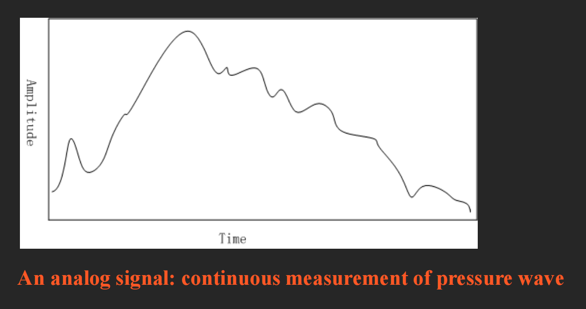
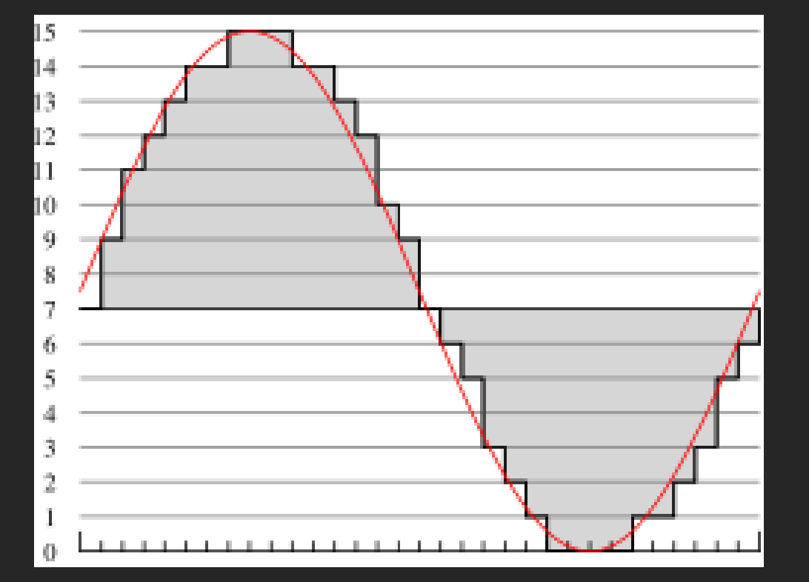

#### 模拟信号

模拟信号是压力波的**连续测量**。

`Amplitude`

#### 采样维度

- **时间维度**：以均匀间隔采样
  - 典型范围：8kHz到48kHz
  - 人耳可听范围：**20Hz到20kHz**

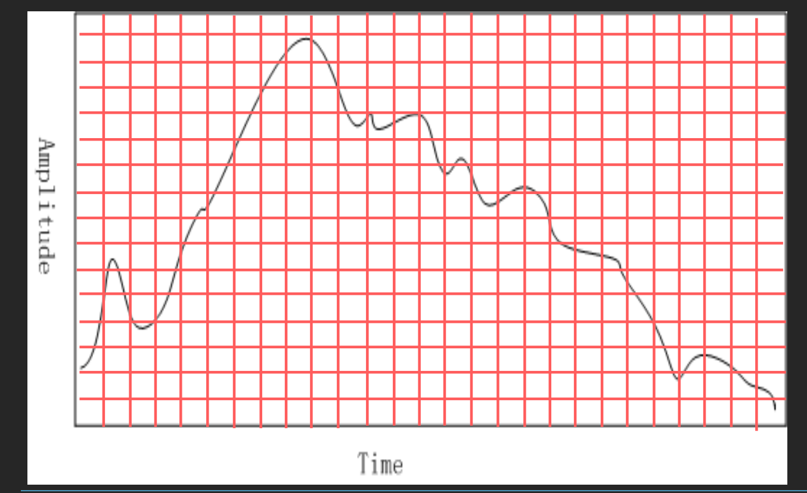

- **幅度维度**：量化
  - 均匀采样：等间隔采样
  - 非均匀采样，如μ-law规则
  - 典型均匀量化等级：
    - 8位：256级
    - 16位：65,536级

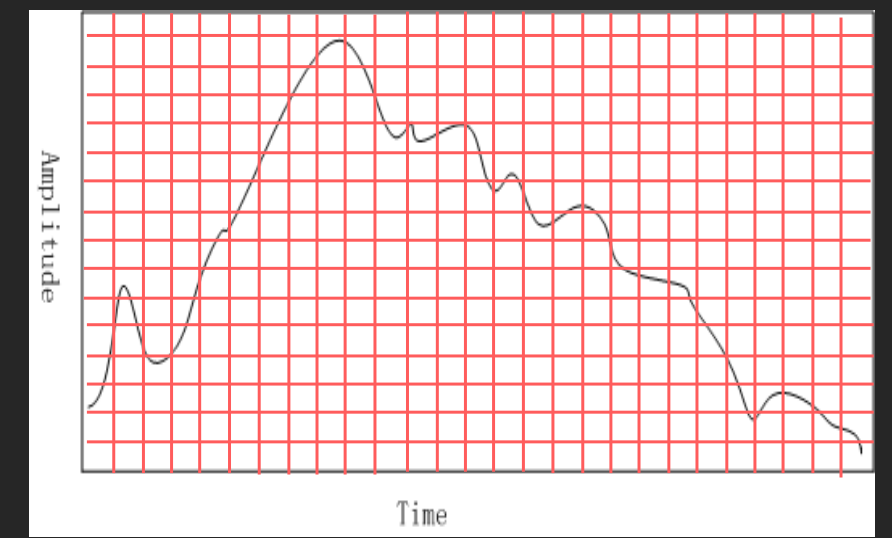

#### 数字化需要回答的问题

1. 采样率是多少？
2. 数据的量化精度如何？量化是否均匀？
3. 音频数据如何格式化？（文件格式）

### 1.3 奈奎斯特定理

#### 信号的分解

信号可以分解为正弦波的叠加。

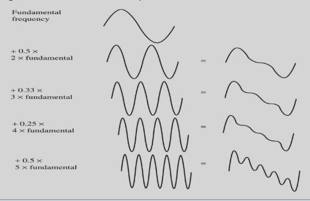

#### 奈奎斯特率

为了正确采样，采样率必须至少是信号中**最大频率的两倍**。

#### 奈奎斯特定理

对于具有频率下限f1和上限f2的限带信号，我们需要至少 **2(f2-f1)** 的采样率才能保证**无损采样**

#### 奈奎斯特频率

奈奎斯特频率是奈奎斯特率的一半。由于无法恢复高于奈奎斯特频率的频率，大多数系统都有**抗混叠滤波器**，将输入信号的频率内容限制在奈奎斯特频率或以下。

### 1.4 信噪比（SNR）

#### 定义

正确信号的功率与噪声的比率称为**信噪比（SNR）**，是衡量信号质量的指标。

#### 计算公式

SNR通常以**分贝（dB）**测量，定义为：

$$SNR = 10\log_{10}\left(\frac{V_{signal}^2}{V_{noise}^2}\right) = 20\log_{10}\left(\frac{V_{signal}}{V_{noise}}\right)$$

#### 示例

- 如果信号电压是噪声的10倍，则 SNR = 20 log(10) = **20dB**
- 功率方面：如果十把小提琴的功率是小提琴的十倍，则功率比为 **10dB**（1B）

> **注意**：功率——10倍；信号电压——20倍

#### 声音强度参考表

| 强度级别 | 分贝数 |
|---------|--------|
| 听力阈值 | 0 |
| 树叶沙沙声 | 10 |
| 非常安静的房间 | 20 |
| 普通房间 | 40 |
| 对话 | 60 |
| 繁忙街道 | 70 |
| 响亮的收音机 | 80 |
| 火车站 | 90 |
| 铆钉机 | 100 |
| 不适阈值 | 120 |
| 疼痛阈值 | 140 |
| 鼓膜损伤 | 160 |

### 1.5 量化信噪比（SQNR）

#### 量化噪声

除了原始模拟信号中可能存在的任何噪声外，量化也会引入额外的误差——**量化噪声（或量化误差）**。

- 如果电压实际在0到1之间，但我们只有8位来存储值，则有效地将连续电压值压缩为256个不同的值
- 这引入了舍入误差

#### SQNR定义(不会考)

量化误差是模拟信号实际值与最近量化间隔值之间的差异。误差最多可达间隔的一半。

对于**N位**每个样本的量化精度，SQNR可表示为：

$$SQNR = 20\log_{10}\left(\frac{V_{signal}}{V_{quan\_noise}}\right) = 20\log_{10}\left(\frac{2^{N-1}}{1}\right) = 20 \times N \times \log_{10}2 \approx 6.02N \text{ (dB)}$$

#### 峰值信噪比（PSQNR不会考）

将最大信号映射到 $2^{N-1} - 1$ ($2^{N-1}$)，将最负信号映射到 $-2^{N-1}$。

#### 动态范围(不会考)

动态范围是最大值与最小绝对值的比率：$V_{max} / V_{min}$。

- 量化间隔：$\Delta V = (2V_{max}) / 2^N$
- 最大噪声：$\Delta V / 2 = V_{max} / 2^N$

### 1.6 线性与非线性量化*

#### 线性量化

样本通常存储为**均匀量化值**。

#### 非线性量化

考虑到有限的可用位和人耳感知特性：
- 非均匀量化级更关注人耳听力最好的频率范围
- 非均匀量化利用人耳感知特性，使用**对数**函数

#### 非线性量化的步骤

1. 将模拟信号从S空间变换到理论R空间
2. 对结果值进行均匀量化

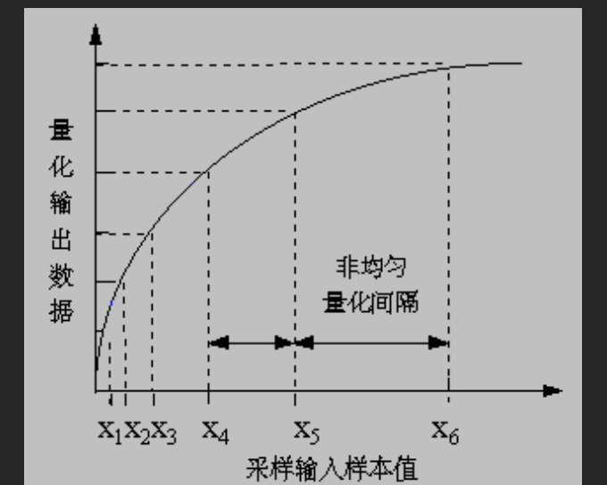

#### μ-law和A-law公式

**μ-law：**
$$sgn(s) \cdot \frac{\ln(1 + \mu|s/s_p|)}{\ln(1 + \mu)}$$

- μ = 100 或 255

**A-law：**
$$
r = \begin{cases}
sgn(s) \cdot \frac{A|s/s_p|}{1 + \ln A} & \text{if } |s/s_p| \leq \frac{1}{A} \\
sgn(s) \cdot \frac{1 + \ln(A|s/s_p|)}{1 + \ln A} & \text{if } \frac{1}{A} < |s/s_p| \leq 1
\end{cases}
$$

- A = 87.6

### 1.7 音频滤波

#### 滤波的目的

在采样和AD转换之前，通过滤波去除不需要的频率。

#### 保留的频率取决于应用

- **语音**：包含50Hz到10kHz
- **音频音乐信号**：包含20Hz到20kHz
- 其他频率由**带通滤波器**阻止（也称为限带滤波器）

### 1.8 音频质量与数据率

#### 数据率与量化位数

未压缩的数据率随量化位数增加而增加。

#### 音频质量与数据率和带宽的关系

| 质量 | 采样率(kHz) | 位/样本 | 单声道/立体声 | 数据率(kB/s) | 频率范围(kHz) |
|------|-------------|---------|--------------|-------------|--------------|
| 电话 | 8 | 8 | 单声道 | 8 | 0.2-3.4 |
| AM广播 | 11.025 | 8 | 单声道 | 11.0 | 0.1-5.5 |
| FM广播 | 22.05 | 16 | 立体声 | 88.2 | 0.02-11 |
| CD | 44.1 | 16 | 立体声 | 176.4 | 0.005-20 |
| DAT | 48 | 16 | 立体声 | 192.0 | 0.005-20 |
| DVD Audio | 192(最大) | 24(最大) | 6通道 | 1,200(最大) | 0-96(最大) |

### 1.9 合成声音

#### 两种方法

1. **FM（频率调制）**
2. **波表合成**（更准确）

#### FM频率调制

$$X(t) = A(t)\cos[\omega_c t + I(t)\cos(\omega_m t + \phi_m) + \phi_c]$$

- $A(t)$：包络，音量
- $I(t)$：通过改变调制频率产生谐波感觉
- $\phi_m$ 和 $\phi_c$：相位常数，产生时间偏移

#### 波表合成

波表合成是一种更准确的数字信号生成声音的方法，也称为**采样**。

- 存储真实乐器的实际数字采样
- 由于波表存储在声卡内存中，可以被软件操作
- 可以组合、编辑和增强声音

---

## 2. MIDI技术

### 2.1 MIDI简介

**MIDI（Musical Instruments Digital Interface）**

- 一种使音乐设备能够相互通信的**协议**
- MIDI不是音频信号，而是发送到MIDI设备以生成声音或执行某些操作的**指令序列**
- MIDI生成音乐的方法：
  - FM合成
  - 波表合成

### 2.2 术语

#### 合成器（Synthesizer）

- 声音发生器——改变音调、音量、音色
- 包含微处理器、键盘、控制面板、内存等

#### 音序器（Sequencer）

- 用于编辑音乐事件序列的硬件或软件
- 一个或多个MIDI输入（IN）和输出（OUT）

#### 通道（Channel）

- 独立的MIDI消息
- **16个通道**（与16种乐器相关联）

#### 音色（Timbre）

- 声音的质量，例如钢琴、小提琴等
- **多音色（Multi-timbral）**：同时播放多种不同的声音（如钢琴、铜管、鼓等）

### 2.3 MIDI与MP3的区别

| 特性 | MIDI | MP3 |
|------|------|-----|
| 文件大小 | 很小（约10KB） | 较大（通常超过2MB） |
| 音质 | 只能生成简单的音乐音调 | 接近CD的音质 |
| 声音再生 | 无法重现人声 | 可以重现人声 |

- 许多软件可以将MP3转换为MIDI格式（如WIDI）

---

## 3. 音频量化与传输

### 3.1 音频编码

#### 编码的定义

编码是数据的**量化和转换**。

#### 利用时间冗余

- 减少信号值的大小
- 当前信号与过去信号之间的差异可以将信号值的大小集中到小得多的范围内
- 无损压缩方法可以产生更短的比特长度

#### 音频量化输出

- **PCM**：脉冲编码调制
- **DPCM**：PCM的差分版本
- **ADPCM**：自适应DPCM

### 3.2 脉冲编码调制（PCM）

#### 基本技术

从模拟信号创建数字信号的基本技术是**采样和量化**。

#### 量化过程

1. 选择幅度中的断点（决策边界）
2. 将间隔内的任何值重新映射到代表性输出电平（重构电平）

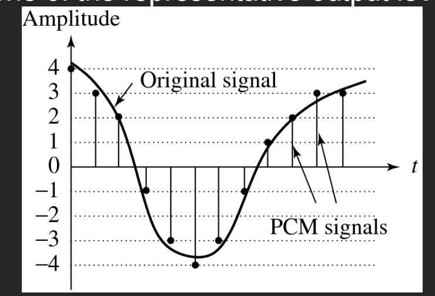

> PCM信号每个采样点会选取离它最近的整数点

#### 压缩的三个阶段

A. **变换**：将输入数据转换为更容易或更有效压缩的新表示(减小信源的熵)
B. **量化**：引入信息丢失的主要步骤——使用有限的重构电平，少于原始信号（将输入信号的符号化位数减少），这里会造成一部分**数据损失**
C. **编码**：为每个输出电平或符号分配码字（形成二进制比特流）——可以是固定长度编码或可变长度编码（如霍夫曼编码）

#### PCM在语音压缩中的应用

假设语音带宽约50Hz到10kHz，奈奎斯特率要求20kHz采样率。

| 方案 | 量化位数 | 单声道比特率 |
|------|---------|-------------|
| 均匀量化 | 12位 | 240 kbps |
| 压扩（Companding） | 8位 | 160 kbps |
| 电话标准（4kHz） | 8位 | 64 kbps |

#### 需要解决的问题

1. **滤波**：滤除高频和极低频率——使用限带滤波器
2. **平滑**：数字到模拟转换后，使用低通滤波器只保留原始最大频率以下的频率

### 3.3 差分编码

#### 原理

音频通常不存储为简单PCM，而是利用**差分**——通常是较小的数字，因此有可能使用更少的位来存储。

如果时间相关信号在时间上具有一定的一致性（时间冗余），则差分信号（从当前样本减去前一个样本）将具有更尖锐的直方图，最大值接近零。

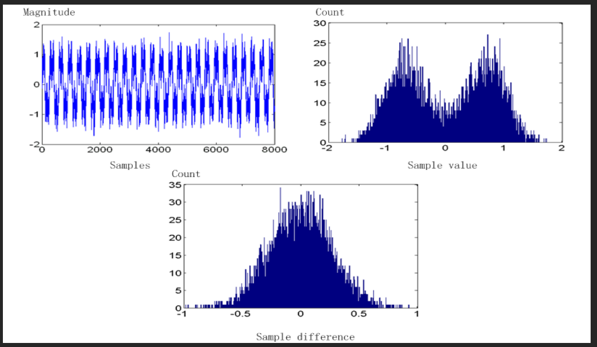

### 3.4 无损预测编码

#### 预测编码

简单地说，就是传输差异——预测下一个样本等于当前样本；不发送样本本身，而是**发送前一个与下一个之间的差异**。

$$e_n = f_n - \hat{f}_n$$

其中 $\hat{f}_n$ 是预测值。

> 之所以能够压缩，是因为声音信号往往具有时序冗余性，前后样本差距通常不大

#### 线性预测器

$$\hat{f}_n = \sum_{k=1}^{2\sim4} a_k f_{n-k}$$

#### 动态范围问题

如果样本值在0..255范围内，差分可能达到-255..255，动态范围增加了一倍。

**解决方案**：定义两个新代码SU和SD（Shift-Up和Shift-Down）。

例如：100可以传输为：SU, SU, SU, 4

!!! example
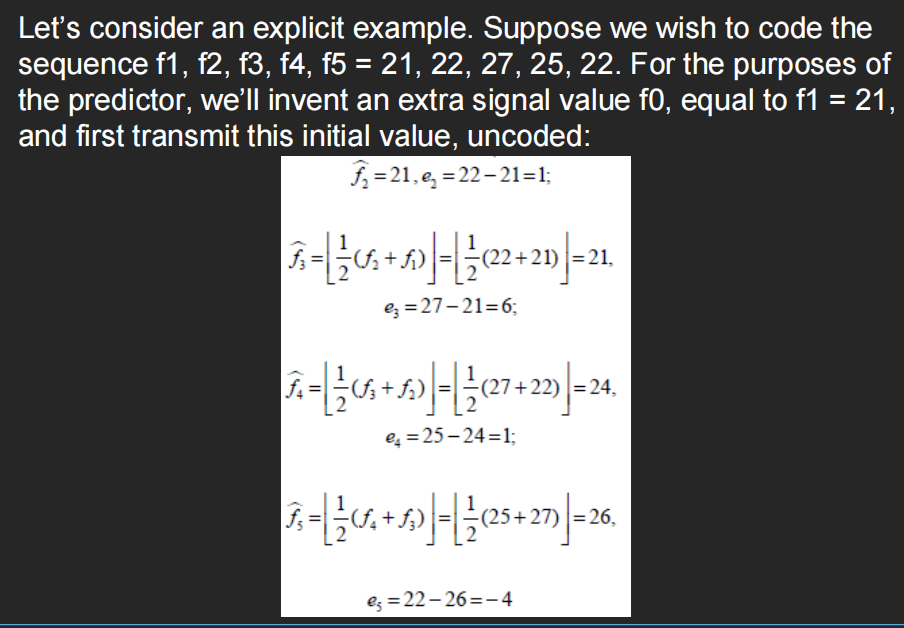
!!!

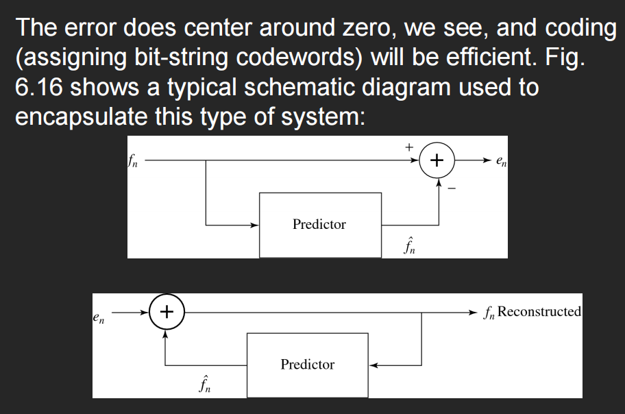

> 解码器内部都有编码器

### 3.5 DPCM

#### 定义

DPCM（差分PCM）与预测编码相同，只是包含了一个**量化器步骤**。

$$\tilde{e}_n = Q[e_n]$$

然后使用熵编码（如霍夫曼编码）为量化误差值生成码字传输。

#### 重建

$$\tilde{f}_n = \hat{f}_n + \tilde{e}_n$$

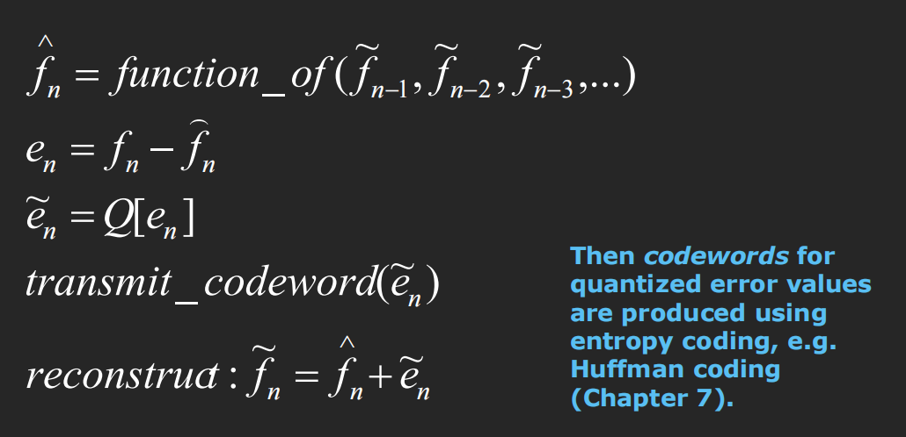
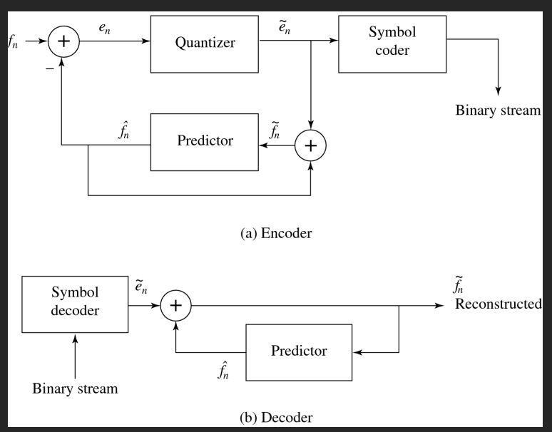
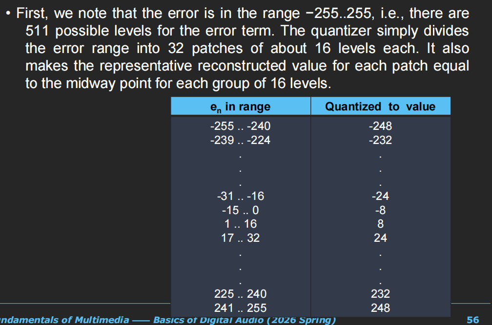
#### 示例

预测器：
$$\hat{f}_n = trunc(\tilde{f}_{n-1} + \tilde{f}_{n-2})$$

量化方案：
$$\tilde{e}_n = 16 \times trunc((255 + e_n)/16) - 256 + 8$$

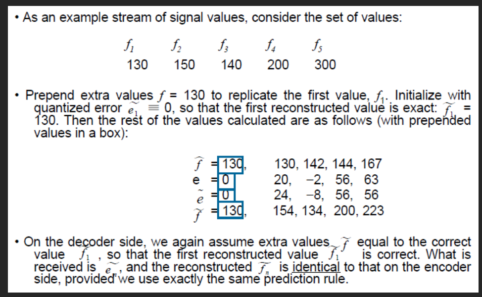

### 3.6 DM（增量调制）

#### 定义

DM是DPCM的简化版本。通常用作快速AD转换器。

#### 均匀增量调制

使用单一的量化误差值，正负均可——**1位编码器**。

$$\tilde{e}_n = \begin{cases} +k & \text{if } e_n > 0 \\ -k & \text{otherwise} \end{cases}$$

其中k是常数。

#### 适应问题

DM对快速变化的信号处理不佳。一种方法是简单地将采样率提高到奈奎斯特率的许多倍。

#### 自适应DM

如果实际信号曲线的斜率高，阶梯近似无法跟上。对于陡峭的曲线，应该自适应地改变步长k。

### 3.7 ADPCM

#### 定义

自适应DPCM，使编码器更好地适应输入。

#### 自适应量化

根据输入信号特性（正向自适应量化）或根据量化输出特性（反向自适应量化）调整量化器步长。

#### 自适应预测编码

改变预测系数：

$$\hat{f}_n = \sum_{i=1}^{M} a_i \tilde{f}_{n-i}$$

使用最小二乘法找到最佳的$a_i$值。

---

## 4. 总结

本章主要内容包括：

1. **声音数字化**：
   - 声音的本质（压力波）
   - 采样率与奈奎斯特定理
   - 量化与SQNR计算
   - 线性与非线性量化（μ-law、A-law）
   - 音频质量与数据率关系

2. **合成声音**：
   - FM频率调制
   - 波表合成

3. **MIDI技术**：
   - MIDI协议与指令序列
   - 合成器、音序器、通道、音色

4. **音频编码**：
   - PCM脉冲编码调制
   - DPCM差分PCM
   - DM增量调制
   - ADPCM自适应差分PCM

---

## 参考资料

- 教材：Fundamentals of Multimedia, Li & Drew
- 授课教师：肖俊
- 邮箱：junx@cs.zju.edu.cn
