# 多媒体技术基础 Chapter 6：无损压缩算法

## 目录

- [多媒体技术基础 Chapter 6：无损压缩算法](#多媒体技术基础-chapter-6无损压缩算法)
  - [目录](#目录)
  - [1. 信息论基础](#1-信息论基础)
    - [1.1 背景介绍](#11-背景介绍)
    - [1.2 数据压缩方案](#12-数据压缩方案)
    - [1.3 信息论基础](#13-信息论基础)
  - [2. 无损编码算法](#2-无损编码算法)
    - [2.1 游程编码 (Run-Length Coding)](#21-游程编码-run-length-coding)
    - [2.2 可变长度编码 (Variable-Length Coding)](#22-可变长度编码-variable-length-coding)
      - [2.2.1 Shannon-Fano算法](#221-shannon-fano算法)
      - [2.2.2 Huffman编码](#222-huffman编码)
      - [2.2.3 扩展Huffman编码](#223-扩展huffman编码)
      - [2.2.4 自适应Huffman编码](#224-自适应huffman编码)
    - [2.3 基于字典的编码 (Dictionary-Based Coding)](#23-基于字典的编码-dictionary-based-coding)
      - [2.3.1 LZW压缩算法](#231-lzw压缩算法)
      - [2.3.2 LZW解压算法](#232-lzw解压算法)
    - [2.4 算术编码 (Arithmetic Coding)](#24-算术编码-arithmetic-coding)
      - [算术解码算法](#算术解码算法)
  - [3. 无损图像压缩](#3-无损图像压缩)
    - [3.1 差分编码](#31-差分编码)
    - [3.2 无损JPEG](#32-无损jpeg)
  - [课堂练习](#课堂练习)
    - [练习1：熵的计算](#练习1熵的计算)
    - [练习2：Huffman编码](#练习2huffman编码)

---

## 1. 信息论基础

### 1.1 背景介绍

随着越来越多的数据以数字形式存储：
- 图书馆、博物馆、政府机构
- 需要无失真地存储

**示例：** 编码1.2亿个呼叫号码
- 每个项目需要27位数字（2^27 > 1.2亿）
- 通过压缩减少所需位数

**关键观察：** 不同数据出现的频率不同
- 为出现频率高的数据分配更少的位数
- **VLC（可变长度编码）** 的核心思想

**无损编码的定义：**
- 压缩和解压过程都不造成信息丢失

### 1.2 数据压缩方案

**压缩比定义：**

$$\text{压缩比} = \frac{B_0}{B_1}$$

- $B_0$：压缩前的位数
- $B_1$：压缩后的位数
- 压缩比必须大于1.0
- 压缩比越高，无损压缩方案越好

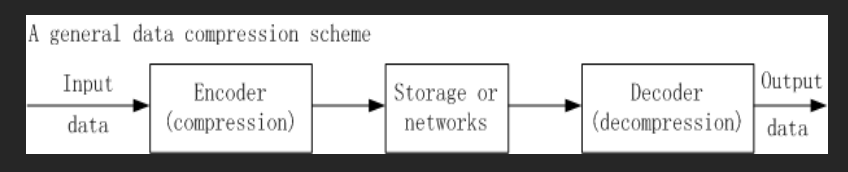

### 1.3 信息论基础

**信源熵的定义：**

设字母表 $S = \{s_1, s_2, \dots, s_n\}$，则熵为：

$$\eta = H(S) = \sum_{i=1}^{n} p_i \log_2 \frac{1}{p_i} = -\sum_{i=1}^{n} p_i \log_2 p_i$$

其中 $p_i$ 是符号 $s_i$ 出现的概率。

**自信息量：**

$$\log_2 \frac{1}{P_i}$$

表示字符中包含的信息量。

**示例：** 稿件中字母 n 出现的概率为 1/32
- 信息量为 5 位
- 字符串 nnn 需要 15 位来编码

**熵的性质：**
- 熵是系统无序度的度量
- 熵越大，无序度越高
- 物理意义：代表信源 S 中每个符号所包含的**平均信息量**。
- 
**示例：**
- 系统有4种状态，每种概率为 1/4：熵 = $4 \times \frac{1}{4} \times \log_2 4 = 2$ bits
- 一种状态概率为 1/2，其他三种概率各为 1/6：熵 = $1.795 < 2$ bits

**熵的下界性质：**

$$\eta \leq \bar{l}$$

其中 $\bar{l}$ 是编码器**生成的码字的平均长度**（以比特为单位）。


!!! example
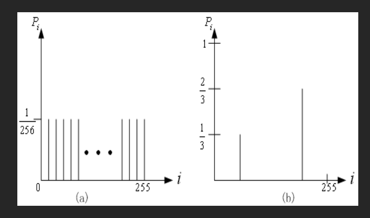
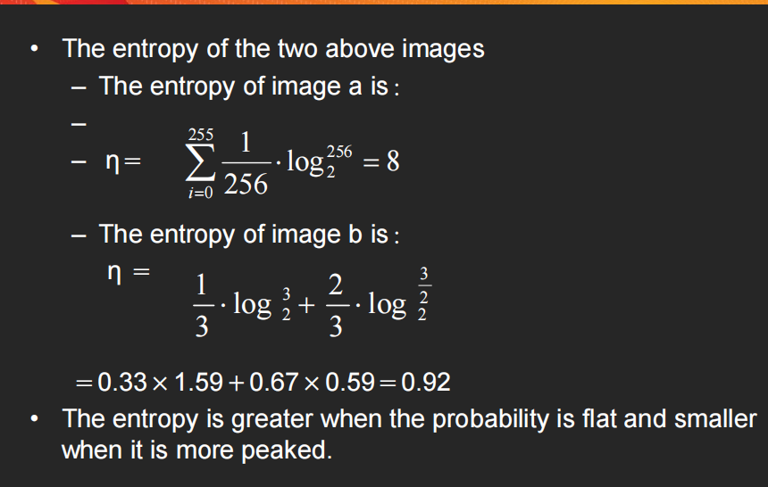
!!!

---

## 2. 无损编码算法

### 2.1 游程编码 (Run-Length Coding)

**基本思想：**
- 如果信源符号倾向于形成连续组
- 编码一个这样的**符号和组的长度**，而不是单独编码每个符号
- 二值图像特别适合使用RLC

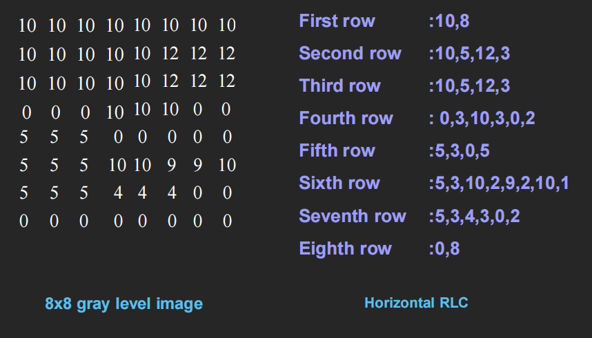

**一维RLC示例：**

输入序列：`0,0,-3,5,1,0,-2,0,0,0,0,2,-4,3,-2,0,0,0,1,0,0,-2`

> 遇到连续的0，直接写数目就可以

游程序列：`(2,-3)(0,5)(0,1)(1,-2)(4,2)(0,-4)(0,3)(0,-2)(3,1)(2,-2)`

**二维RLC示例（灰度图像）：**

```
第一行：10,10,10,10,10,10,10,10 → (10,8)
第二行：10,10,10,10,10,12,12,12 → (10,5)(12,3)
```

- 减少了需要编码的样本数量
- 实现简单

### 2.2 可变长度编码 (Variable-Length Coding)

**基本思想：**
- 熵表示信源中包含的信息内容
- VLC是最著名的熵编码方法之一

**VLC算法分类：**
- Shannon-Fano算法
- Huffman编码
- 自适应Huffman编码


#### 2.2.1 Shannon-Fano算法

**开发者：** Shannon（贝尔实验室）和 Robert Fano（MIT）

**自顶向下方式：**
1. 按符号出现频率计数**排序**
2. 递归地将符号分成**两部分**，每部分具有**大致相同的计数**
3. 直到所有部分只包含一个符号
4. 通过构建二叉树实现

**示例：** "Hello"
- H: 1, E: 1, L: 2, O: 1

熵计算：
$$0.4 \times 1.32 + 0.2 \times 2.32 + 0.2 \times 2.32 + 0.2 \times 2.32 = 1.92$$

平均比特数：10/5 = 2 bits/符号

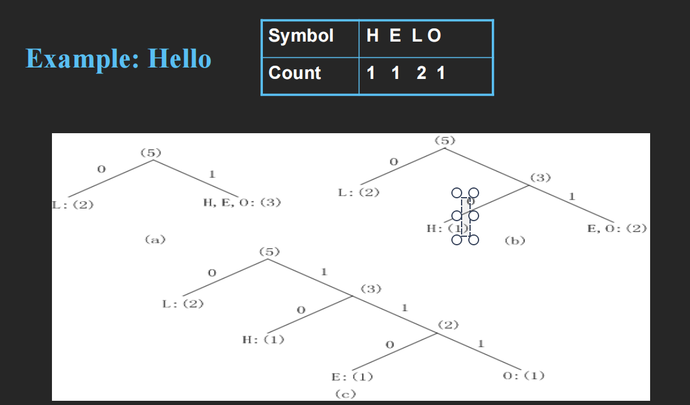
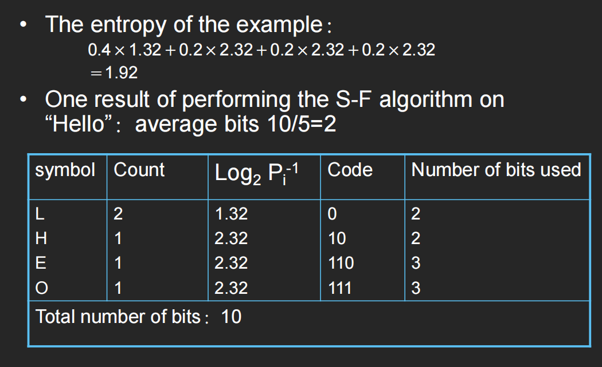

#### 2.2.2 Huffman编码

**提出者：** David A. Huffman (1952)

**应用：** fax、JPEG、MPEG

**自底向上方式：**
1. 初始化：将所有符号按频率计数排序
2. 重复直到列表只有一个符号：
   - 从列表中选取两个频率计数最低的符号
   - 形成一个以这两个符号为子节点的Huffman子树
   - 将子节点的频率计数之和分配给父节点并插入列表
   - 从列表中删除子节点
3. 根据从根到叶子的路径为每个叶子分配码字

**Huffman编码的性质：**

1. **唯一前缀属性：** 任何Huffman码都不是其他Huffman码的前缀——避免解码歧义

2. **最优性：** 对于给定的概率分布是最小冗余码
   - 两个最少出现的符号长度相同，仅最后一位不同
   - **出现频率高的符号比出现频率低的符号有更短的码字**
   - 平均码长满足：$\eta \leq \bar{l} < \eta + \frac$

!!! example
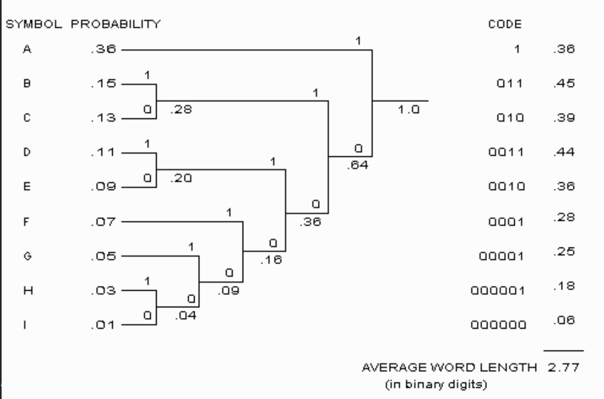
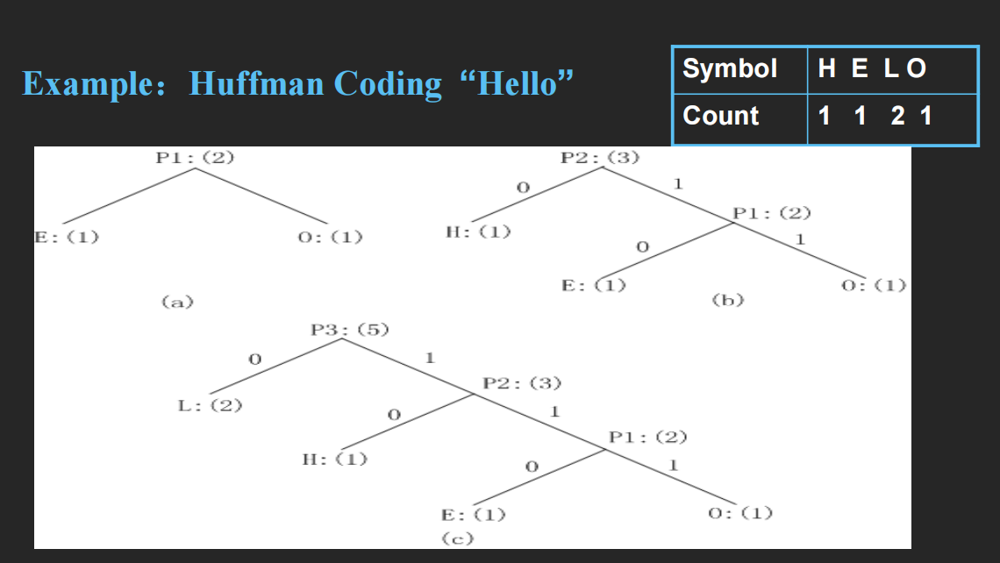
!!!

#### 2.2.3 扩展Huffman编码

**动机：** Huffman编码的码字都是整数位长，当概率很大时很浪费

**解决方案：** 将多个符号分组并分配单个码字

**扩展字母表：** 对于字母表 $S = \{s_1, s_2, \dots, s_n\}$，如果k个符号分组：
$$S^{(k)} = \{s_{i_1}s_{i_2}\dots s_{i_k}\}$$

新字母表大小：$n^k$

**平均比特数改进：**
$$\eta \leq \bar{l} < \eta + \frac{1}{k}$$

**问题：** 如果k较大（如k≥3），对于大多数实际应用中n≥1的情况，$n^k$意味着巨大的符号表——不切实际

#### 2.2.4 自适应Huffman编码

**问题：** Huffman编码需要信源的**先验统计信息**，通常不可用

**解决方案：** 自适应算法，统计信息**随数据流动**态收集和更新

**基本思想：**
- Initial_code：分配一些初始约定的码字
- Update_Tree：构建自适应Huffman树
  - 增加符号的频率计数
  - 更新树的配置
- 编码器和解码器必须使用完全相同的Initial_code和Update_Tree例程

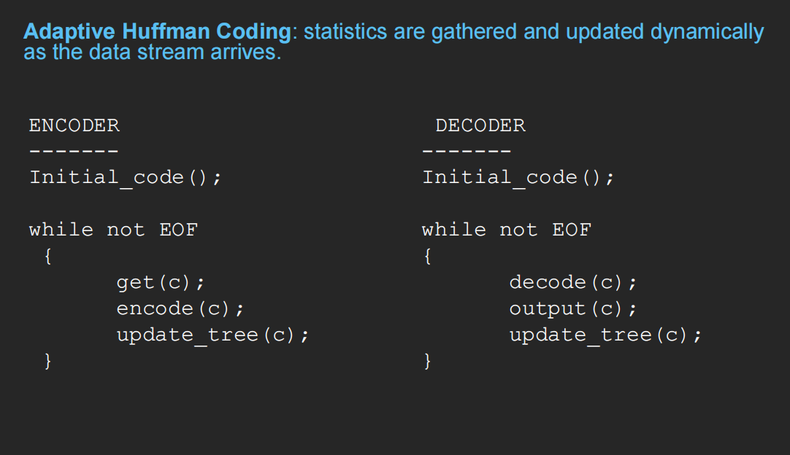

**节点交换规则：**
- 节点按从左到右、从下到上的顺序编号
- 树必须始终保持兄弟属性：所有节点按递增计数排列
- 如果兄弟属性即将被违反，执行交换程序

### 2.3 基于字典的编码 (Dictionary-Based Coding)

**历史：**
- 1977年由Ziv提出，1978年由Lempel改进
- 1984年Terry Welch改进
- **LZW算法**（Lempel-Ziv-Welch）

**应用：** UNIX compress、GIF、V.42 bis调制解调器

**LZW特点：**
- 使用固定长度的码字表示可变长度的符号/字符字符串
- 编码器和解码器在接收数据时动态构建相同的字典
- 将越来越长的重复条目放入字典

#### 2.3.1 LZW压缩算法

```c
BEGIN
s = next input character;
while not EOF
{
    c = next input character;
    if s + c exists in the dictionary
        s = s + c;
    else
    {
        output the code for s;
        add string s + c to the dictionary with a new code;
        s = c;
    }
}
output the code for s;
END
```

**示例：** 压缩字符串 "ABABBABCABABBA"

初始字典：
| Code | String |
|------|--------|
| 1 | A |
| 2 | B |
| 3 | C |

压缩过程：
| Step | s | c | Output | New Code | String |
|------|---|---|--------|----------|--------|
| 1 | A | B | 1 | 4 | AB |
| 2 | B | A | 2 | 5 | BA |
| 3 | A | B | - | - | - |
| 4 | AB | B | 4 | 6 | ABB |
| 5 | B | A | - | - | - |
| 6 | BA | B | 5 | 7 | BAB |
| 7 | B | C | 2 | 8 | BC |
| 8 | C | A | 3 | 9 | CA |
| 9 | A | B | - | - | - |
| 10 | AB | A | 4 | 10 | ABA |
| 11 | A | B | - | - | - |
| 12 | AB | B | - | - | - |
| 13 | ABB | A | 6 | 11 | ABBA |
| 14 | A | EOF | 1 | - | - |

**输出码字：** 1 2 4 5 2 3 4 6 1（9个码字代替14个字符）

**压缩比：** 14/9 = 1.56

#### 2.3.2 LZW解压算法

```c
BEGIN
s = NIL;
while not EOF
{
    k = next input code;
    entry = dictionary entry for k;
    output entry;
    if (s != NIL)
        add string s + entry[0] to dictionary with a new code;
    s = entry;
}
END
```

**修正版本（处理异常）：**

```c
if (entry == NULL)
    entry = s + s[0];
```

### 2.4 算术编码 (Arithmetic Coding)

**特点：**
- 比Huffman编码性能更好的现代编码方法
- 将整个消息作为一个单元处理
- 用[0,1)区间内的半开区间[a,b)表示消息

**基本思想：**
- 不为每个字符表示码字，而是用[0,1)内的半开区间[a,b)表示整个消息
- 区间长度等于消息的概率
- 在[a,b)内选择一个十进制数并转换为二进制形式作为编码输出
- 每个字符都会缩短区间，字符越多，区间越短
- 区间越短，表示区间所需的比特数越多

**编码示例：** 编码 "CAEE$"

符号概率分布：
| Symbol | Probability | Range |
|--------|-------------|-------|
| A | 0.2 | [0, 0.2) |
| B | 0.1 | [0.2, 0.3) |
| C | 0.2 | [0.3, 0.5) |
| D | 0.05 | [0.5, 0.55) |
| E | 0.3 | [0.55, 0.85) |
| F | 0.05 | [0.85, 0.9) |
| $ | 0.1 | [0.9, 1.0) |

编码过程：
| Symbol | Low | High | Range |
|--------|-----|------|-------|
| (start) | 0 | 1.0 | 1.0 |
| C | 0.3 | 0.5 | 0.2 |
| A | 0.30 | 0.34 | 0.04 |
| E | 0.322 | 0.334 | 0.012 |
| E | 0.3286 | 0.3322 | 0.0036 |
| $ | 0.33184 | 0.33220 | 0.00036 |


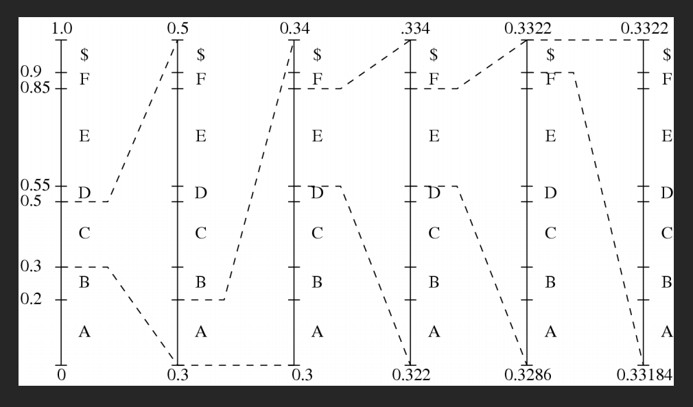
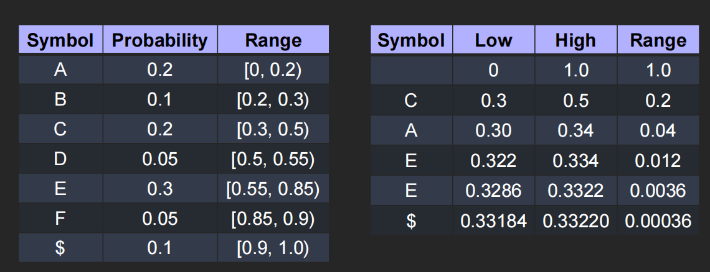

**输出：** 0.01010101

#### 算术解码算法

```c
BEGIN
get binary code and convert to decimal value = value(code);
Do
{
    find a symbol s so that Range_low(s) <= value < Range_high(s);
    output s;
    low = Range_low(s);
    high = Range_high(s);
    range = high - low;
    value = [value - low] / range;
}
Until symbol s is a terminator
END
```

---

## 3. 无损图像压缩

### 3.1 差分编码

**基本原理：**
- 利用连续符号之间存在的冗余
- 最常用的多媒体数据压缩技术之一

**差分图像定义：**

使用简单差分算子：
$$d(x,y) = I(x,y) - I(x-1,y)$$

使用离散2D拉普拉斯算子：
$$d(x,y) = 4I(x,y) - I(x,y-1) - I(x,y+1) - I(x+1,y) - I(x-1,y)$$

**优势：**
- 正常图像存在空间冗余
- 差分图像的直方图更窄，熵更小
- 使用VLC可以为差分图像分配更短的位长

### 3.2 无损JPEG

**预测方法：**
1. 形成差分预测：预测器组合最多三个相邻像素作为当前像素的预测值
2. 编码：编码器将预测值与实际像素值进行比较，并使用之前讨论的无损压缩技术（如Huffman编码）对差值进行编码

**预测器配置（7种）：**

| 预测器 | 预测公式 |
|--------|----------|
| P1 | A |
| P2 | B |
| P3 | C |
| P4 | A + B - C |
| P5 | A + (B - C) / 2 |
| P6 | B + (A - C) / 2 |
| P7 | (A + B) / 2 |

**相邻像素示意图：**

```
C | B |
---|---|
A | X |
```

X为当前像素，A、B、C为已解码的相邻像素

**无损JPEG压缩效果对比：**

| 压缩程序 | Lena | Football | F-18 | Flowers |
|---------|------|----------|------|---------|
| Lossless JPEG | 1.45 | 1.54 | 2.29 | 1.26 |
| Optimal Lossless JPEG | 1.49 | 1.67 | 2.71 | 1.33 |
| Compress (LZW) | 0.86 | 1.24 | 2.21 | 0.87 |
| Gzip (LZ77) | 1.08 | 1.36 | 3.10 | 1.05 |
| Gzip -9 | 1.08 | 1.36 | 3.13 | 1.05 |
| Pack (Huffman) | 1.02 | 1.12 | 1.19 | 1.00 |

---

## 课堂练习

### 练习1：熵的计算

**问题：** 如果一个系统有4种状态，每种状态的概率是多少时熵最大？

**解答：**
当所有状态概率相等（均为1/4）时，熵最大：
$$H = 4 \times \frac{1}{4} \times \log_2 4 = 2 \text{ bits}$$

### 练习2：Huffman编码

**问题：** 对于符号集合 {A, B, C, D}，频率分别为 {15, 7, 6, 6}，求Huffman编码。

**解答：**
1. 初始：{A:15, B:7, C:6, D:6}
2. 合并最小的两个(C:6, D:6) → CD:12
3. 合并{B:7, CD:12} → BCD:19
4. 合并{A:15, BCD:19} → ABCD:34

最终的Huffman树满足：频率高的符号（如A）获得更短的码字。

---

*本章完*
