# 多媒体技术基础 Chapter 7：有损压缩算法

## 目录

- [多媒体技术基础 Chapter 7：有损压缩算法](#多媒体技术基础-chapter-7有损压缩算法)
  - [目录](#目录)
  - [1. 引言](#1-引言)
  - [2. 失真度量](#2-失真度量)
    - [2.1 失真概念](#21-失真概念)
    - [2.2 数值失真度量](#22-数值失真度量)
      - [均方误差（MSE）](#均方误差mse)
      - [信噪比（SNR）](#信噪比snr)
      - [峰值信噪比（PSNR）](#峰值信噪比psnr)
  - [3. 率失真理论](#3-率失真理论)
    - [3.1 率失真概念](#31-率失真概念)
    - [3.2 典型R-D函数](#32-典型r-d函数)
  - [4. 量化](#4-量化)
    - [4.1 量化功能](#41-量化功能)
    - [4.2 均匀标量量化](#42-均匀标量量化)
    - [4.3 非均匀标量量化](#43-非均匀标量量化)
  - [5. 变换编码](#5-变换编码)
    - [5.1 基本思想](#51-基本思想)
    - [5.2 离散余弦变换(DCT)](#52-离散余弦变换dct)
      - [1D DCT](#1d-dct)
      - [2D DCT（JPEG标准）](#2d-dctjpeg标准)
      - [DCT基本函数（2D）](#dct基本函数2d)
      - [DCT 3D](#dct-3d)
      - [DCT的物理意义](#dct的物理意义)
      - [DCT示例](#dct示例)
      - [DCT的线性性质](#dct的线性性质)
      - [DCT相关概念](#dct相关概念)
      - [DCT与IDCT的Matlab示例](#dct与idct的matlab示例)
      - [2D DCT的分离计算](#2d-dct的分离计算)
    - [5.3 DCT与DFT比较](#53-dct与dft比较)
  - [6. 基于小波的编码](#6-基于小波的编码)
    - [6.1 小波变换简介](#61-小波变换简介)
    - [6.2 Haar变换（最简单的小波变换）](#62-haar变换最简单的小波变换)
    - [6.3 2D Haar小波变换](#63-2d-haar小波变换)
  - [课堂练习](#课堂练习)
    - [练习1：PSNR计算](#练习1psnr计算)
    - [练习2：均匀量化器SQNR](#练习2均匀量化器sqnr)
    - [练习3：Haar变换](#练习3haar变换)
    - [练习4：DCT系数含义](#练习4dct系数含义)
  - [总结](#总结)

---

## 1. 引言

**有损压缩的必要性：**

无损压缩算法无法提供足够高的压缩比，因此大多数多媒体压缩算法都是**有损的**。

**什么是有损压缩？**

- 压缩后的数据与原始数据**不相同**，而是其**近似值**
- 相比无损压缩，能实现**更高的压缩比**

> 有损压缩通过**牺牲一定的信息精度**，换取**更高的压缩效率**。

---

## 2. 失真度量

### 2.1 失真概念

**失真度量（Distortion Measure）**

- 一种数学量：指定近似值与原始值的接近程度
- 通常使用数值差值来衡量
- 对于图像数据，数值差异可能不会产生预期效果
- 需要**感知失真度量**

### 2.2 数值失真度量

最常用的数值失真度量：**MSE、SNR、PSNR**

#### 均方误差（MSE）

$$\sigma_d^2 = \frac{1}{N}\sum_{n=1}^{N}(x_n - y_n)^2$$

- $x_n$:原始的信号序列
- $y_n$：经过有损压缩之后的序列

- 平均像素差异
- 值越小，与原来的信号相似度越高

#### 信噪比（SNR）

$$SNR = 10\log_{10}\frac{\sigma_x^2}{\sigma_d^2}$$

- 相对于信号的误差大小

#### 峰值信噪比（PSNR）

$$PSNR = 10\log_{10}\frac{x_{peak}^2}{\sigma_d^2}$$

- 相对于信号峰值值的误差大小

**PSNR示例：**

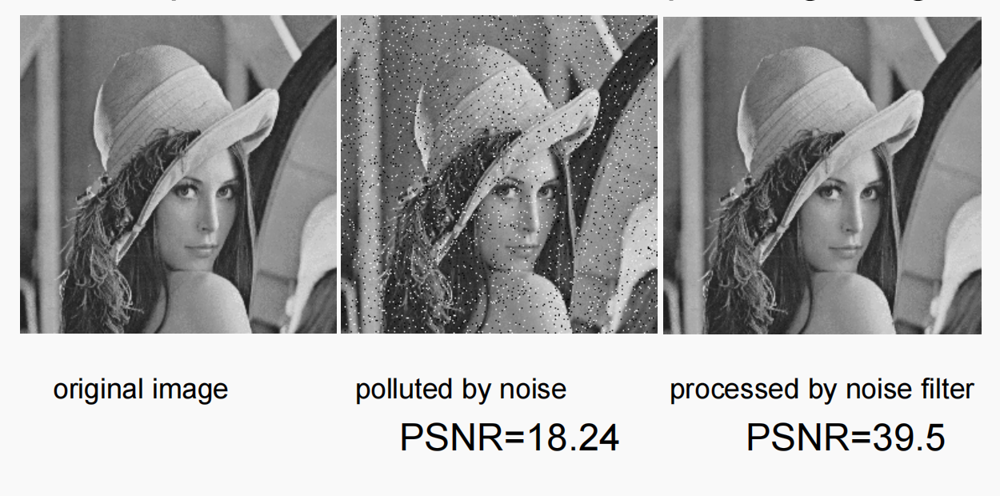

| PSNR值 | 图像质量描述 |
|--------|--------------|
| 18.24 | 噪声污染严重的图像 |
| 39.5 | 经过噪声滤波器处理的图像 |

**39.5的图像质量更好**

---

## 3. 率失真理论

### 3.1 率失真概念

**有损压缩总是涉及率与失真之间的权衡：**(`tradeoff between rate and distortion`)

- **Rate（率）**：表示每个源符号所需的平均比特数
- **R(D)**：率失真函数

**什么是R(D)？**

- R(D) 指定在失真不超过D的条件下，对源数据进行编码的**最低速率**
- 当D=0时，无损失，等于源数据的熵
- 描述编码算法性能的**基本极限**
- 可用于评估不同算法的性能

### 3.2 典型R-D函数

**典型率失真函数的特点：**

- 当D=0时，R(D)等于源数据的熵
- 当D足够大时，R(D)=0（不编码任何内容）
- 对于给定源，难以找到率失真函数的**闭合解析描述**

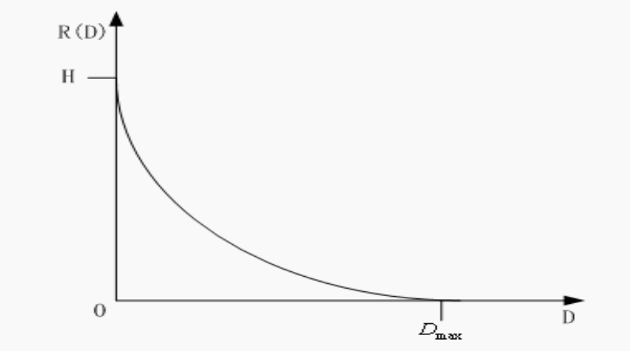

---

## 4. 量化

### 4.1 量化功能

**量化(quantization)：任何有损方案的核心**

> **绝大部分信息的损失来自于量化**

- 没有量化，几乎不会丢失信息
- 通过量化减少不同值的数量
- 是有损压缩中**"**损失"的主要来源****

**量化器类型：**

| 类型 | 描述 |
|------|------|
| 标量量化器 | 单值量化 |
| - 均匀 | 等间隔分区 |
| - 非均匀 | 非等间隔分区 |
| 矢量量化器 | 向量整体量化 |

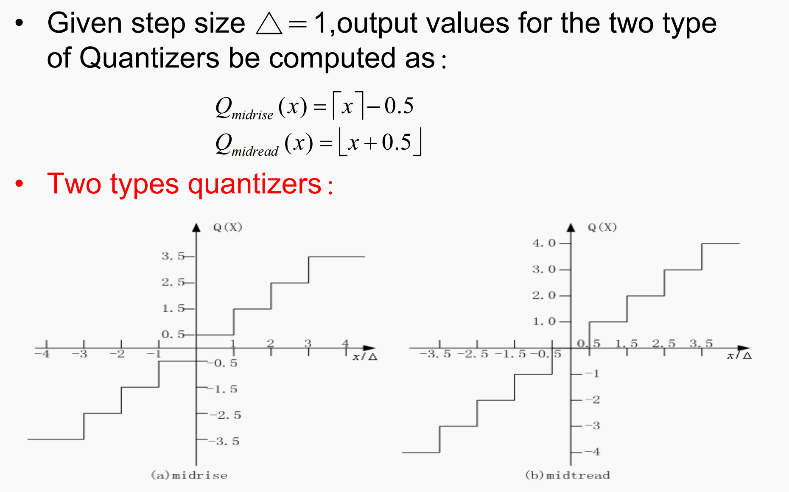

### 4.2 均匀标量量化

**均匀标量量化器特点：**

- 将输入域划分为等间隔的区间
- **决策边界**：分区间隔的端点
- **输出值**：区间的中点
- **步长**：每个间隔的长度

**两种类型的均匀标量量化器：**

| 类型 | 输出电平数 | 零的位置 |
|------|------------|----------|
| **Midrise** | 偶数 | 一个分区间隔包含零 |
| **Midtread** | 奇数 | 零是一个输出值 |

**输出值计算公式：**

$$Q_{midrise}(x) = \lceil x \rceil - 0.5$$

$$Q_{midtread}(x) = \lfloor x + 0.5 \rfloor$$

**M级量化器的性能：**

- 决策边界：$B = \{b_0, b_1, ..., b_M\}$
- 输出值集合：$Y = \{y_1, y_2, ..., y_m\}$
- 输入均匀分布：$[-X_{max}, X_{max}]$

**量化器速率：**
$$R = \log_2 M$$（编码M个事物所需的比特数）

**步长：**
$$\Delta = \frac{2X_{max}}{M}$$

**两种失真类型：**

| 类型 | 描述 |
|------|------|
| **颗粒失真（Granular distortion）** | 有界输入的量化器引起的误差 |
| **过载失真（Overload distortion）** | 输入值大于Xmax或小于-Xmax引起的误差 |

**Midrise量化器的颗粒失真：**

- 决策边界 $b_i: [(i-1)\Delta, i\Delta], i=1..M/2$
- 输出值 $y_i: i\Delta - \Delta/2, i=1..M/2$
- 误差方差：
$$\sigma_d^2 = \frac{1}{\Delta}\int_0^{\Delta}(x - \frac{\Delta}{2} - 0)^2 dx = \frac{\Delta^2}{12}$$

**量化信噪比（SQNR）：**

$$\sigma_x^2 = \frac{(2X_{max})^2}{12}$$

如果量化器为n比特，$M = 2^n$：

$$SQNR = 10\log_{10}\left(\frac{\sigma_x^2}{\sigma_d^2}\right) = 10\log_{10}M^2 = 20n \cdot \log_{10}2 = 6.02n \text{ (dB)}$$

### 4.3 非均匀标量量化

**非均匀量化的必要性：**

当输入源不是均匀分布时，均匀量化器可能效率低下。

**非均匀量化的优势：**

- 在密集分布区域增加决策级别数量 → 降低颗粒失真
- 在稀疏分布区域扩大间隔 → 保持总决策级别数量

**两种常用方法：**

| 方法 | 描述 |
|------|------|
| **Lloyd-Max量化器** | 基于最优化的方法 |
| **压扩量化器（Companded quantizer）** | 通过压缩-均匀量化-扩展 |

**压扩量化器结构：**

```
输入 → 压缩函数G → 均匀量化器 → 扩展函数G⁻¹ → 输出
```

**常用压扩器：**
- μ-law压扩器
- A-law压扩器

---

## 5. 变换编码

### 5.1 基本思想

**信息论原理：**

- **对向量进行编码比标量编码更高效**
- 需要将输入中的连续样本分组为向量

**变换编码原理：**

设 $X = \{x_1, x_2, ..., x_k\}$ 为样本向量，相邻样本之间存在**相关性**。

!!! note "结论"
如果Y是输入向量的**线性变换T的结果**，且**其分量相关性大大降低**，则Y可以比X更高效地编码。
!!!

- **本质上是在降低信号序列的熵**


> 变换T本身不压缩任何数据。
> 压缩来自于对Y分量的处理和量化(损失的来源)。

**DCT的应用：**
DCT是一种广泛使用的变换，可以对输入信号进行**去相关**处理。

**DCT公式：**

$$F(u) = \frac{C(u)}{2}\sum_{i=0}^{7} \cos\frac{(2i+1)u\pi}{16}f(i)$$

其中：
$$C(u) = \begin{cases} \frac{1}{\sqrt{2}}, & u = 0 \\ 1, & \text{otherwise} \end{cases}$$

!!! note "泛化表达"
$$F(u) = C(u)\sum_{i=0}^{N} \cos\frac{(2i+1)u\pi}{2N}f(i)$$

其中：
$$C(u) = \begin{cases} \frac{1}{\sqrt{N}}, & u = 0 \\ \frac{2}{\sqrt{N}}, & \text{otherwise} \end{cases}$$
!!!

### 5.2 离散余弦变换(DCT)

#### 1D DCT

**正变换：**

$$F(u) = \frac{C(u)}{2}\sum_{i=0}^{7} \cos\frac{(2i+1)u\pi}{16}f(i)$$

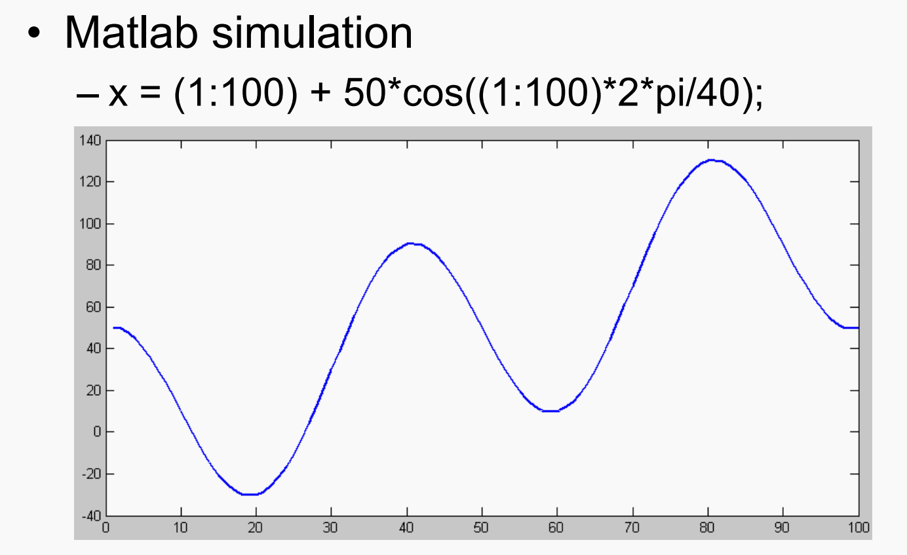
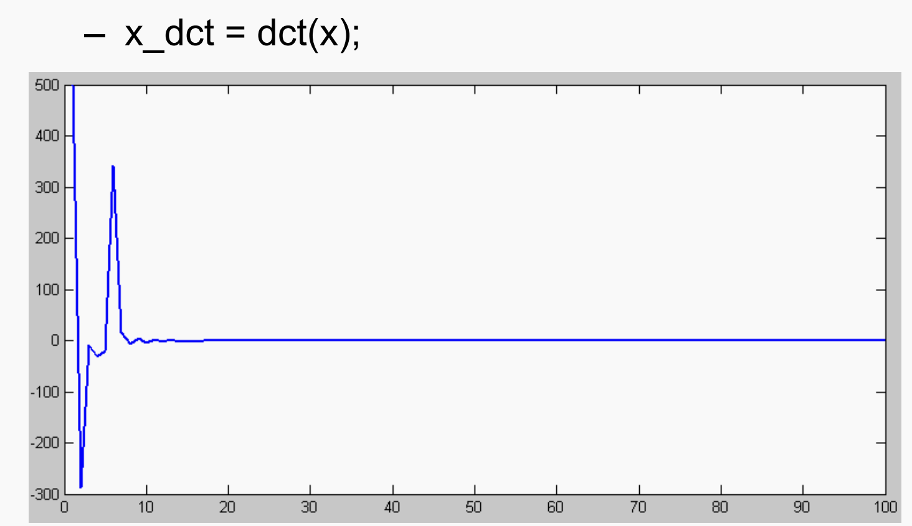
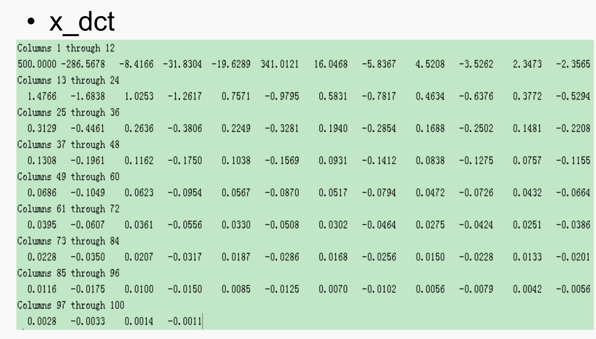
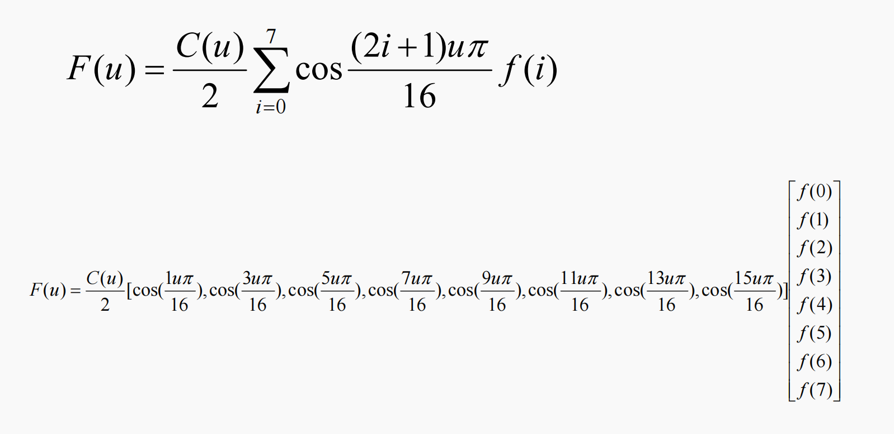

**逆变换：**

$$\tilde{f}(i) = \sum_{u=0}^{7} C(u)\cos\frac{(2i+1)u\pi}{16}F(u)$$

其中：
$$C(u) = \begin{cases} \frac{1}{\sqrt{2}}, & u = 0 \\ 1, & \text{otherwise} \end{cases}$$

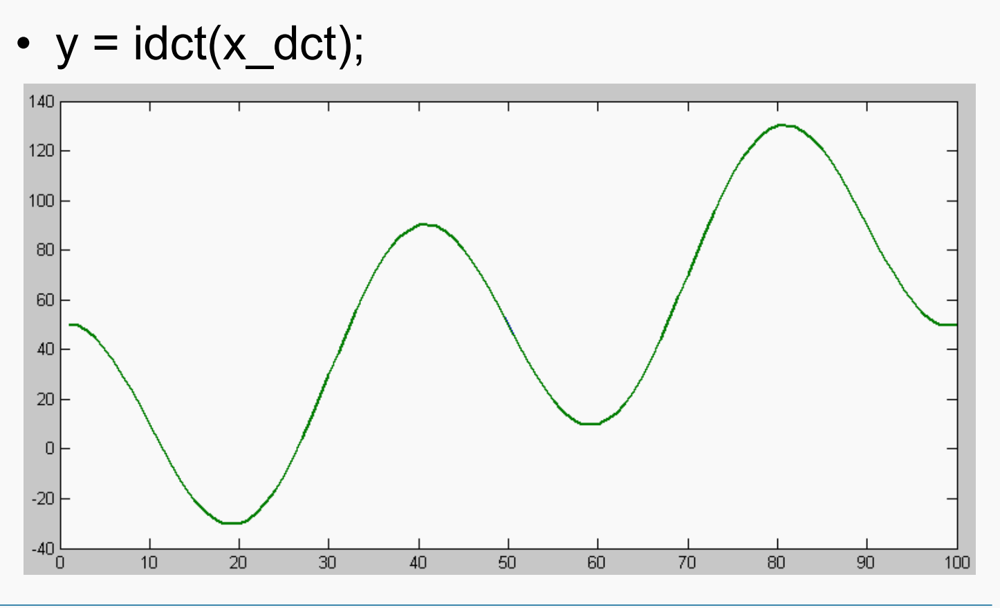
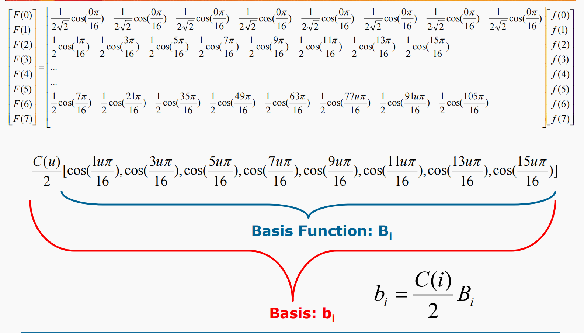

> 正反变换本身不会产生任何信号损失

#### 2D DCT（JPEG标准）

**正变换（8×8块）：**

$$F(u,v) = \frac{C(u)C(v)}{4}\sum_{i=0}^{7}\sum_{j=0}^{7} \cos\frac{(2i+1)u\pi}{16}\cos\frac{(2j+1)v\pi}{16}f(i,j)$$

**逆变换：**

$$\tilde{f}(i,j) = \sum_{u=0}^{7}\sum_{v=0}^{7} \frac{C(u)C(v)}{4}\cos\frac{(2i+1)u\pi}{16}\cos\frac{(2j+1)v\pi}{16}F(u,v)$$

#### DCT基本函数（2D）

2D DCT的**64个基函数**由水平频率u和垂直频率v定义：

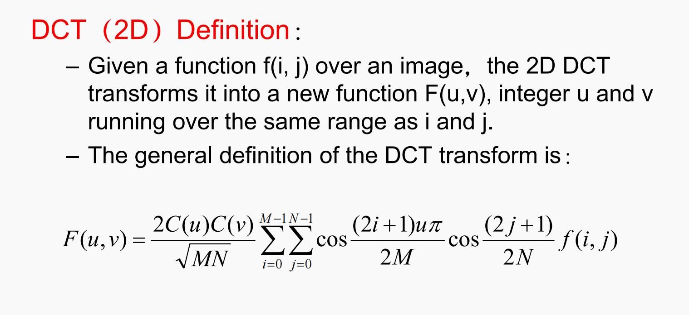
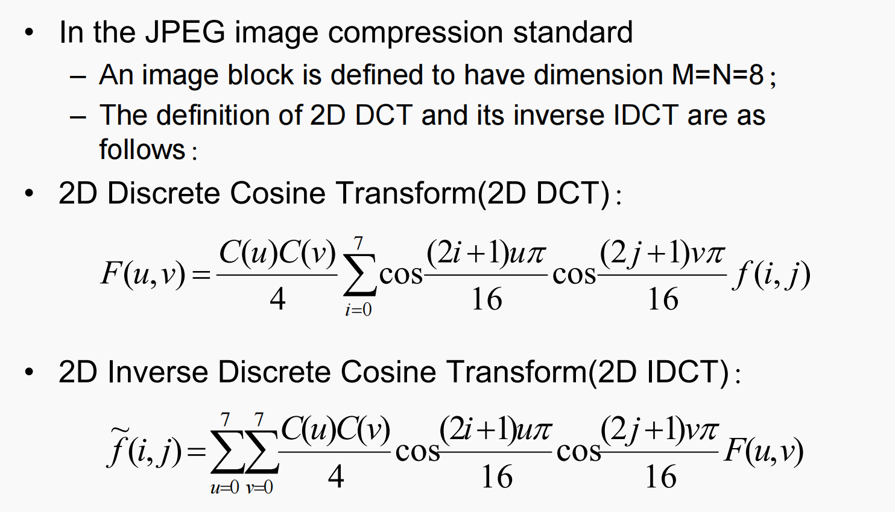
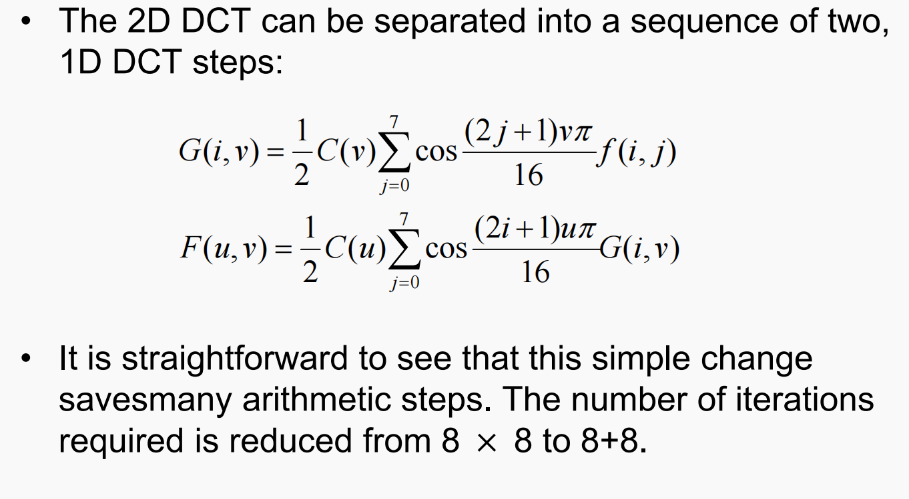
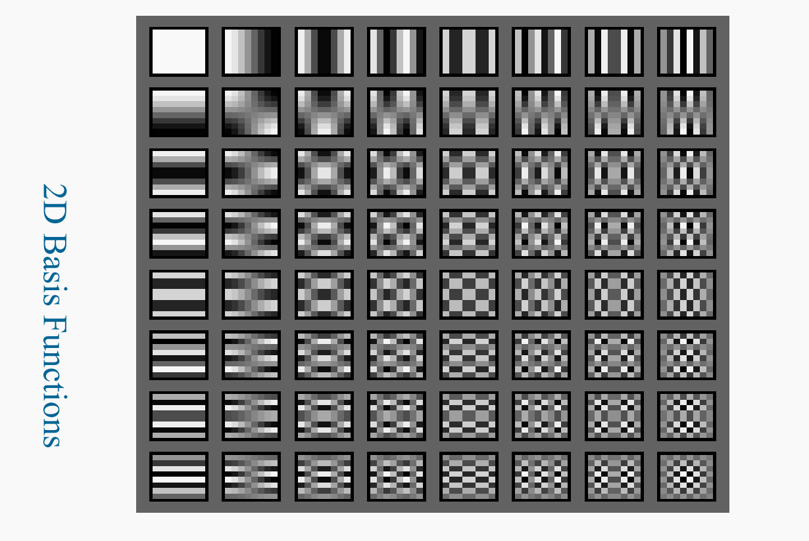


#### DCT 3D

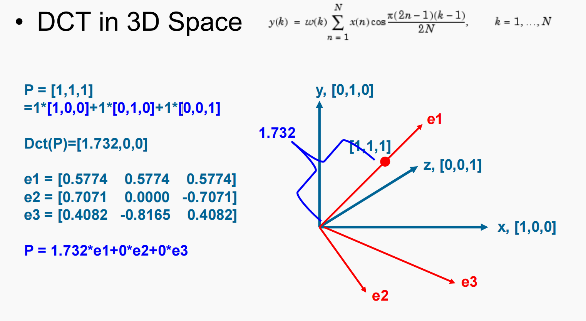

#### DCT的物理意义

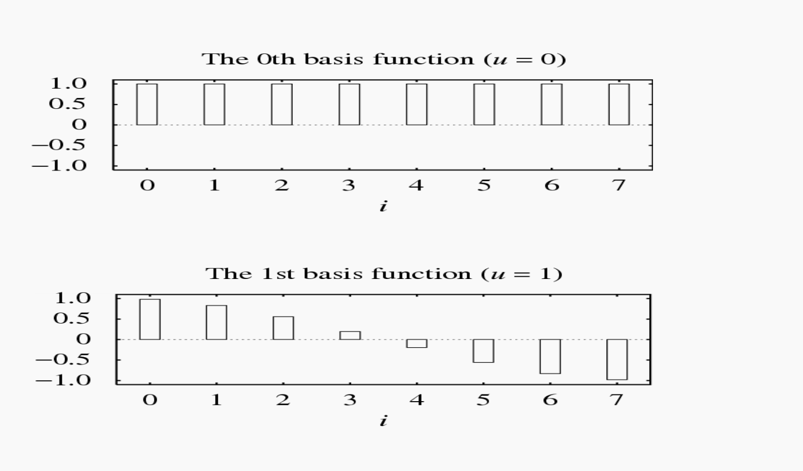
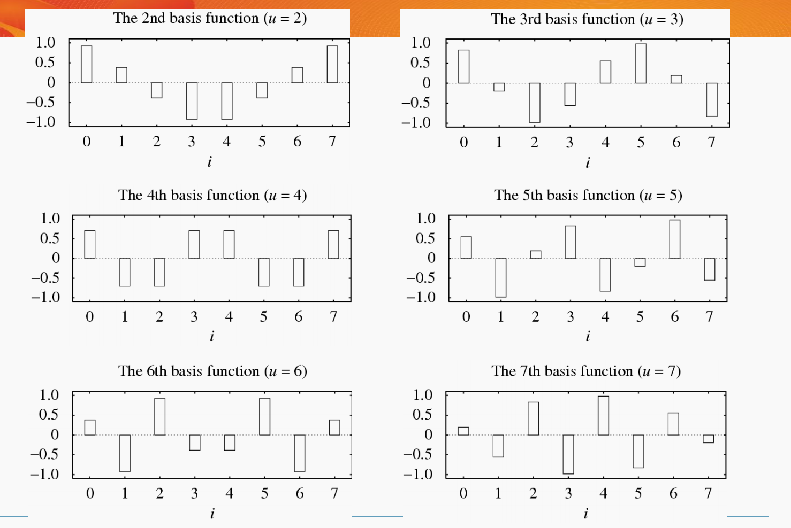

> 第一个信号对应直流信号，其他的是交流信号

**直流分量（DC）：**
- $F(0,0)$ 是DC系数，代表图像块的**平均值**

**交流分量（AC）：**
- 其他63个AC系数反映图像块在不同频率下的变化分量

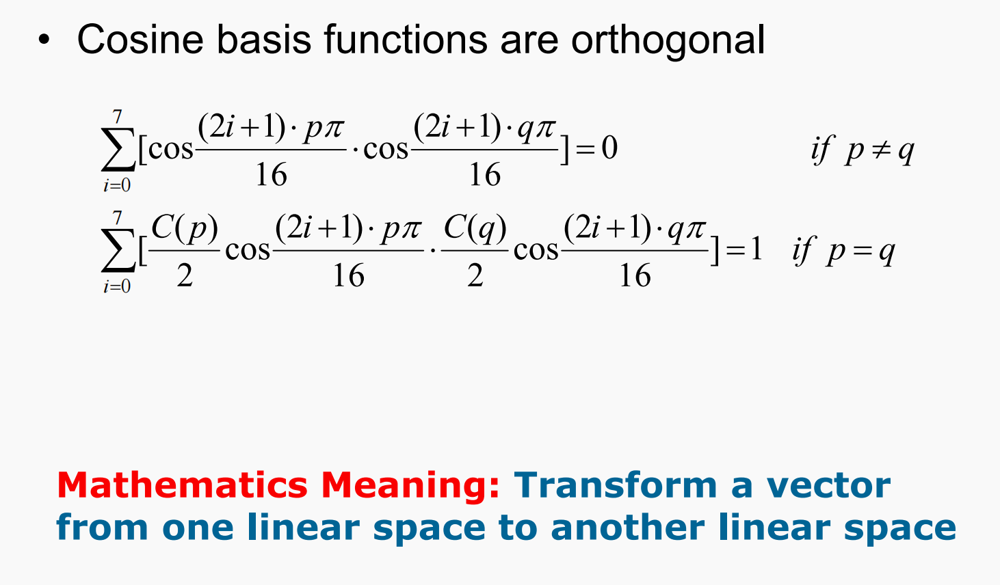

**物理意义：**
任何信号都可以通过**基信号的线性组合**来近似：

$$f(i) \approx \sum_{u} F(u) \cdot b_u(i)$$

其中 $b_u(i)$ 是第u个基函数（余弦函数）。

#### DCT示例

**示例1：常数信号**

信号 $f(i) = 100$（幅度为100的常值信号）

$$F(0) = C(0) \cdot 400 \approx 283$$
$$F(1) = F(2) = ... = F(7) = 0$$

**示例2：与基函数同频信号**

信号与第二个余弦基函数频率和相位相同，幅度为100

$$F(2) = 200$$
$$F(0) = F(1) = F(3) = ... = F(7) = 0$$

#### DCT的线性性质

DCT是**线性变换**：

$$T(\alpha p + \beta q) = \alpha T(p) + \beta T(q)$$

其中α和β是常数，p和q是任意函数、变量或常量。

#### DCT相关概念

| 概念 | 说明 |
|------|------|
| **DC（直流分量）** | 表示恒定幅度 |
| **AC（交流分量）** | 表示变化幅度 |
| **余弦变换** | 确定信号AC和DC分量幅度的过程 |
| **离散余弦变换** | 整数索引的DCT |
| **逆DCT** | 使用DC、AC和余弦函数重建信号 |

#### DCT与IDCT的Matlab示例

```matlab
% 创建信号
x = (1:100) + 50*cos((1:100)*2*pi/40);

% DCT变换
x_dct = dct(x);

% 保留前16个系数，其余置零
x_dct(16:100) = 0;

% IDCT逆变换
z = idct(x_dct);
```

**不同截断系数的效果：**

| 保留系数 | 重建质量 |
|----------|----------|
| 16个 | 较好近似 |
| 8个 | 开始失真 |
| 6个 | 明显失真 |

!!! note
- 正变换做信号的解构
- 逆变换做信号的重构
!!!

#### 2D DCT的分离计算

2D DCT可以分为两步1D DCT：

```
1. 对每一行进行1D DCT：
   G(i,v) = C(v) * sum(cos((2j+1)vπ/16) * f(i,j), j=0..7)

2. 对每一列进行1D DCT：
   F(u,v) = C(u) * sum(cos((2i+1)uπ/16) * G(i,v), i=0..7)
```

**计算效率：** 从8×8次迭代减少到8+8次迭代

### 5.3 DCT与DFT比较

**DFT（离散傅里叶变换）：**

$$F(\omega) = \sum_{x=0}^{7} f_x \cdot e^{-2\pi i \omega x / 8}$$

使用欧拉公式展开：

$$e^{ix} = \cos(x) + i\sin(x)$$

**DCT相对于DFT的优势：**

- DCT只需要DFT的**实部**（余弦部分）
- DCT通过对称复制输入信号消除了DFT的虚部
- DCT的8个输入样本对应DFT的16个样本（原始8个 + 对称复制的8个）

**对比示例（斜坡信号）：**

| 系数 | DCT | DFT |
|------|-----|-----|
| 0 | 9.90 | 28.00 |
| 1 | -6.44 | -4.00 |
| 2 | 0.00 | 9.66 |
| 3 | -0.67 | -4.00 |

> DCT在有限项近似时比DFT更精确。


---

## 6. 基于小波的编码

### 6.1 小波变换简介

**DFT和DCT的局限性：**

- 在频域中提供非常精细的分辨率
- 但**没有时间分辨率**

**小波变换的目标：**

在**时间和频率**两个维度都获得良好的分辨率。

```
时域信号 → 小波分解 → 时频联合表示
```

### 6.2 Haar变换（最简单的小波变换）

**Haar变换原理：**

1. 计算每对相邻样本的**平均值**（近似分量）
2. 计算每对相邻样本的**差值**（细节分量）

**公式：**

$$x_{n-1,i} = \frac{x_{n,2i} + x_{n,2i+1}}{2}$$

$$d_{n-1,i} = \frac{x_{n,2i} - x_{n,2i+1}}{2}$$

**示例：**

输入序列：$\{x_{n,i}\} = \{10, 13, 25, 26, 29, 21, 7, 15\}$

计算：
- $x_{n-1,0} = (10+13)/2 = 11.5$
- $d_{n-1,0} = (10-13)/2 = -1.5$
- $x_{n-1,1} = (25+26)/2 = 25.5$
- $d_{n-1,1} = (25-26)/2 = -0.5$
- ...

**变换结果：**
$$\{x_{n-1,i}, d_{n-1,i}\} = \{11.5, 25.5, 25, 11, -1.5, -0.5, 4, -4\}$$

**逆变换（重构）：**

$$x_{n,2i} = x_{n-1,i} + d_{n-1,i}$$

$$x_{n,2i+1} = x_{n-1,i} - d_{n-1,i}$$

### 6.3 2D Haar小波变换

**2D变换过程：**

1. **水平变换**：对每一行计算相邻像素对的平均值和差值
2. **垂直变换**：对每一列计算相邻像素对的平均值和差值

**变换结果分解：**

| 区域 | 内容 | 说明 |
|------|------|------|
| **LL** | 低频近似 | 水平和垂直方向的平滑版本 |
| **LH** | 垂直细节 | 水平边缘信息 |
| **HL** | 水平细节 | 垂直边缘信息 |
| **HH** | 对角细节 | 对角边缘信息 |

**多级分解：**

- 第一级：原始图像 → 4个子带
- 第二级：对LL子带继续分解
- 可递归进行多级分解

**小波变换的特点：**

- 在时间和频率上同时具有良好的分辨率
- 适合渐进传输和渐进解压
- JPEG2000标准采用小波变换

---

## 课堂练习

### 练习1：PSNR计算

给定：$x_{peak} = 255$，$\sigma_d^2 = 100$
求PSNR。

**解答：**
$$PSNR = 10\log_{10}\frac{255^2}{100} = 10\log_{10}650.25 \approx 28.13 \text{ dB}$$

### 练习2：均匀量化器SQNR

对于8位量化器（n=8），求SQNR。

**解答：**
$$SQNR = 6.02 \times 8 = 48.16 \text{ dB}$$

### 练习3：Haar变换

对序列 $\{8, 12, 20, 24\}$ 进行Haar变换。

**解答：**

$$x_{n-1,0} = (8+12)/2 = 10$$
$$d_{n-1,0} = (8-12)/2 = -2$$
$$x_{n-1,1} = (20+24)/2 = 22$$
$$d_{n-1,1} = (20-24)/2 = -2$$

结果：$\{10, 22, -2, -2\}$

### 练习4：DCT系数含义

对于信号 $f(i) = 100 + 50\cos(i\pi/4)$，分析DCT系数。

**解答：**

- DC系数 F(0)：包含信号的直流（均值）分量
- AC系数 F(u)：包含不同频率的余弦分量
- F(4) 可能包含与信号频率相关的分量

---

## 总结

| 主题 | 关键技术 | 应用 |
|------|----------|------|
| 失真度量 | MSE、SNR、PSNR | 评估压缩质量 |
| 率失真理论 | R(D)函数 | 理论极限分析 |
| 量化 | 均匀/非均匀、标量/矢量 | 有损压缩核心 |
| 变换编码 | DCT | JPEG压缩 |
| 小波编码 | Haar、DWT | JPEG2000压缩 |

**有损压缩的关键权衡：**

```
高压缩比 ←─────────────→ 高质量
   │                        │
   │    率失真权衡           │
   └────────────────────────┘
```

- 量化是信息损失的主要来源
- 变换编码通过去相关提高压缩效率
- 小波变换在时频分析上优于DCT/DFT
