## 一、图像

### 抖动算法

#### 灰度位图

- 位图不借助任何压缩算法，直接对逐个像素表示
- `n-bit`灰度代表每个像素需要n-bit编码，对应有个$2^n$级灰阶
- 特殊地，`1-bit`灰度图像也叫**二值图像**

#### 抖动算法

打印机是二元输出设备(墨头/激光头只有开或关、黑或白两种状态)，原生**只能打印二值图像**。

要让打印机打出灰阶，就需要抖动算法。

- 抖动算法：讲一个像素细分，将像素细分再填入二值图像以欺骗人眼模拟灰度

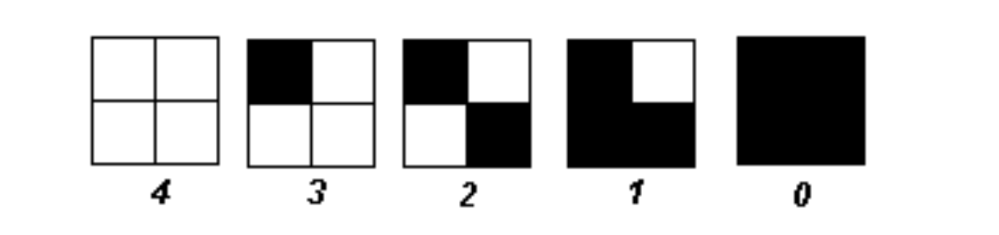

- `DPI`(Dort Per Inch):在1英寸长度内可以打多少个点。
  - DPI的高低直接决定了打印机可以打印的灰阶等级
  - 例如想要25级灰阶，则在一个像素面积内至少要打**24个点**（可以表示25个状态），否则就会**失真**

!!! example 
一张 600×450、8bit 的图像，打印到 8×6 英寸纸上，用 300×300 DPI 打印机打印时，原图的 1 个像素会对应多少个打印点（dots）？以及为什么说 only 17 levels。

- 计算整张纸可以打多少个点：$(300 \times 8) \times (300 \times 6) = 2400 \times 1800$
- 原图有多少个像素：$600 \times 450$ pixels
- 计算每个图像像素对应多少个打印点
  - 横向每个像素对应：$2400 / 600 = 4$
  - 纵向每个像素对应：$1800/450=4$
  - 所以每个图像像素对应一个$4 \times 4$的点阵
!!!

#### 抖动矩阵

如果一个像素被细分成 5×5，小格子一共有 25 个。
假设当前像素灰度对应“要打 15 个点”，那问题就变成：

是哪 15 个位置打点，视觉效果最好？

- 这里我们就需要抖动矩阵
- 抖动矩阵规定了不同灰度下哪些小方格应该被涂色/打点（也就是在你不同灰度等级下二值点的空间分布方式，以获得更符合人眼感知的灰度模拟效果）

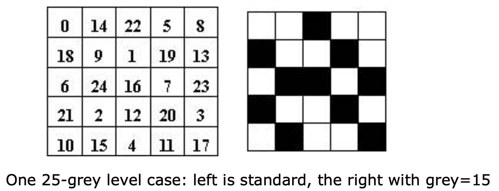

> 不同厂家对于抖动矩阵的规定不同，涂黑的小方格是标号**大于等于灰度值**的那些方格(如要得到灰度值为15的图像，那么标号大于等于15的方格会被涂黑)

### 颜色查找表

#### 8-bit彩色

不同于常见的24-bit(RGB三个通道各8-bit)真彩色，如果希望剑侠数据量，**每一个像素只用一个Byte表示**，那么

- 8不能被3整除，怎么均衡的表示RGB3个通道的值
- 怎么兼容24-bit真彩色设备

#### LUT

8-bit色彩图像中的值不直接表示颜色，而是**表示颜色查找表**(LUT)的索引。LUT完成从像素值到24-bit颜色值的映射

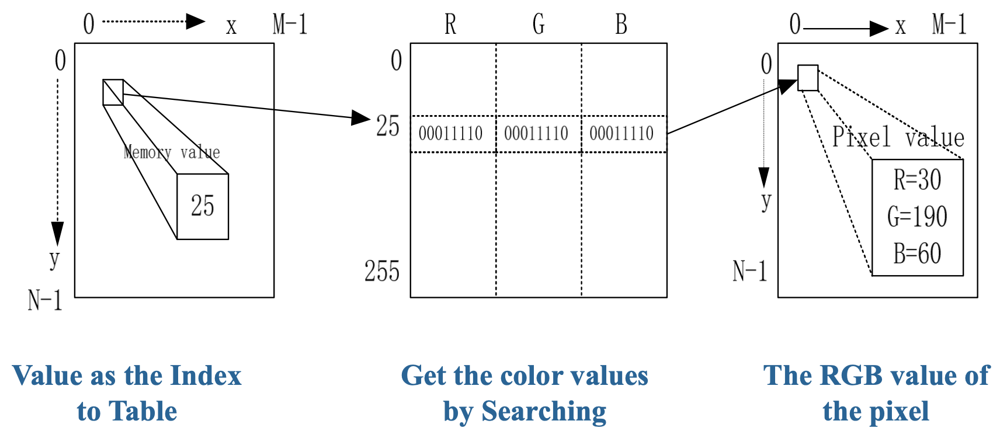

**核心思想**

- 像素值本身不是颜色，只是一个索引
- 真正颜色要去查找LUT表，映射成一个24-bit的RGB值
- 往往写在输出相关设备的驱动中

使用LUT带来一个额外的好处是，只要**替换颜色查找表**，就可以方便地得到不同颜色特征的图像

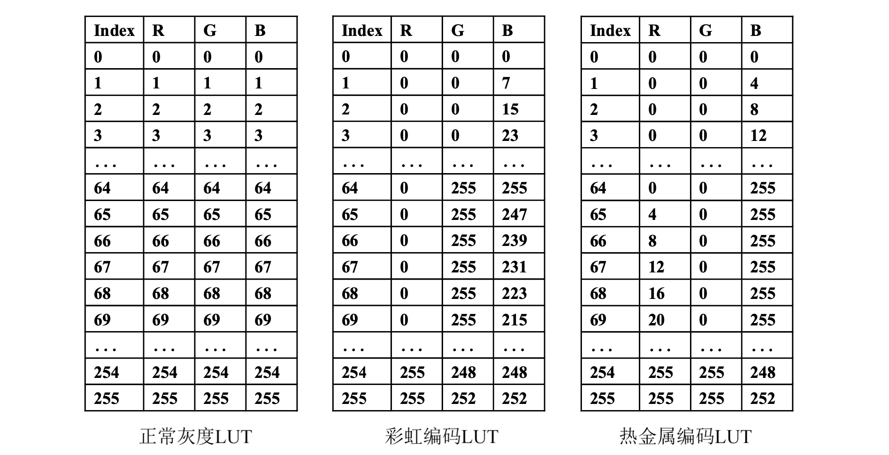

#### 聚类算法

前面8-bit位图借助LUT完成了颜色的转换，现在进一步关心 **怎么设计一个LUT**，怎么反向将真彩色信息压缩到256色更好

颜色直方图统计像素RGB的分布情况，下面是一个例子

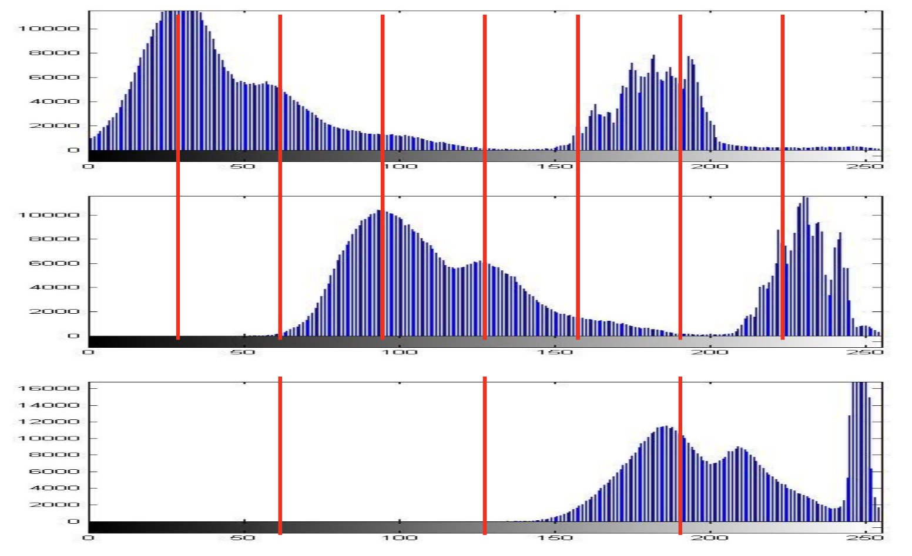

如果我们简单线性划分RGB范围作为聚类算法，很快会发现问题：**有的bucket离大量不同色彩的像素被聚类到了一起，而有的bucket一个像素都没有**、这显然是浪费的。很直观地想到，**像素分布越密集的地方**，桶的划分应该 **越稠密**。为了解决这个问题，一个常用的算法是 **Medium Cut**中值切分算法

#### Medium Cut

- 先统计**所有像素的红色分布**，找到一个值使得其**两侧的像素数量相等**，得到两个bucket
- 两个桶分别**统计绿色分布**，各自找到一个值使得其两侧像素数量相等，现在得到了4个bucket
- 四个桶分别**统计蓝色分布**，各自找到一个值，这样会出现8个桶
- 以此类推

> 先找哪个颜色无所谓，只要**颜色之间是交替统计的**，每个颜色有几个bit表示就进行上述的切分几次

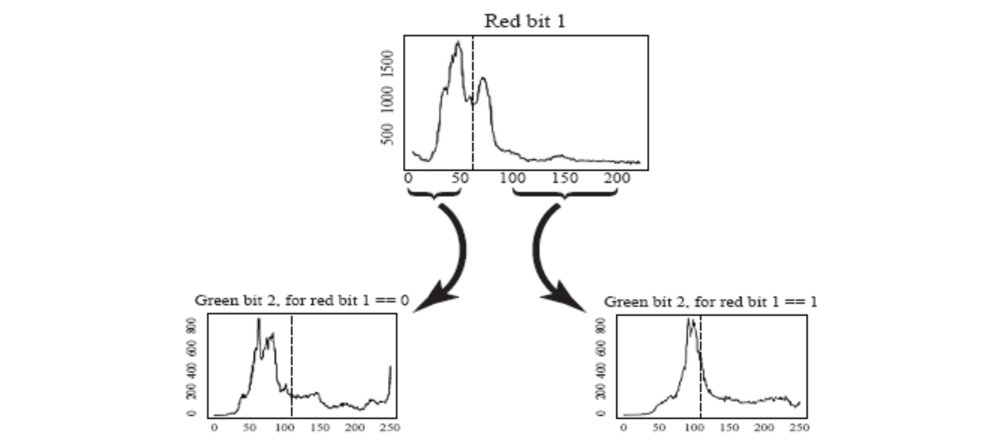
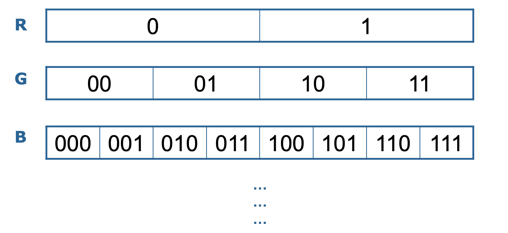

## 2. 颜色

### 2.1 显示器与Gamma

#### 1. CRT彩色显示器

**核心组件**

- **电子枪**：产生三束电子束
- **阴罩（掩磁罩）**：控制电子束打准位置
- **荧光屏**：被电子轰击后发光

**成像原理**

- 三束电子对应RGB
- 打到对应荧光点
- 通过RGB加色混合形成彩色图像

!!! warning
**电子束本身不发光，真正发光的是屏幕上的荧光材料**
!!!

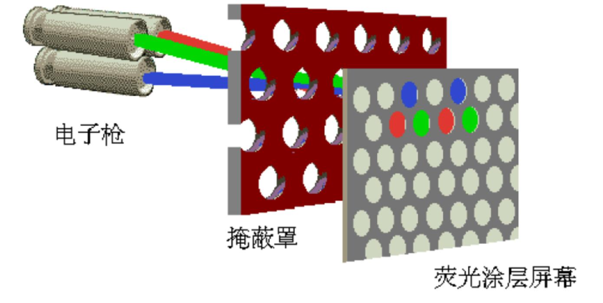

> 三束不同能量的电子(能量分别对应三原色)轰击荧光屏

#### 2. Gamma矫正

- CRT的发光强度与驱动电压不是线性关系
- 亮度与电压的某个幂次成正比：$L ∝ V^{\gamma}$
  - L:亮度(light)
  - V：驱动电压(Voltage)
  - $\gamma$:伽马值(gamma)
- 输出亮度本身不是输入值R本身，而是$R^{\gamma}$
  - 这里的R可以理解成某个归一化后的输入信号值，范围一般在0~1之间
  - 这个幂指数叫做 **Gamma**，基座$\gamma$
  - CRT的$\gamma$值大约是2.2

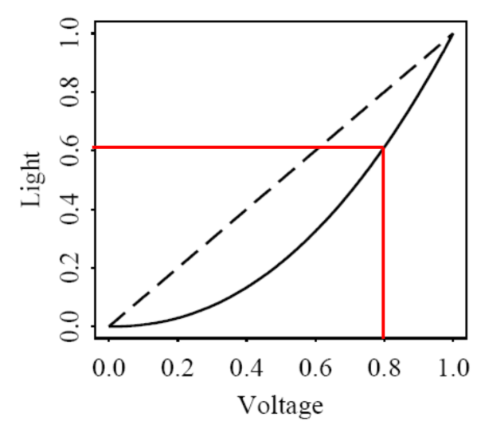

> - 虚线：理想情况下L和V的关系
> - 实线：没有进行伽马矫正

- 如果直接将亮度比例作为输出电压比例，最终显示的颜色将会失真，暗部层次丢失
  - 比如上图中输出电压为0.8（我们希望得到的亮度是0.8），而最终得到的亮度是0.6

**因此我们需要进行伽马矫正**

通常，把经过伽马矫正的信号加一个(prime)，这种矫正方法是在传输前把原信号提升到$1/\gamma$次幂

这样最终就能得到线性的输出信号：

$$
R→R′=R^{1/γ}⇒(R′)^γ→R
$$

- 基本思路
  - 先做一次$1/\gamma$次幂
  - 显示器再做一次$\gamma$次幂
  - 两者正好抵消

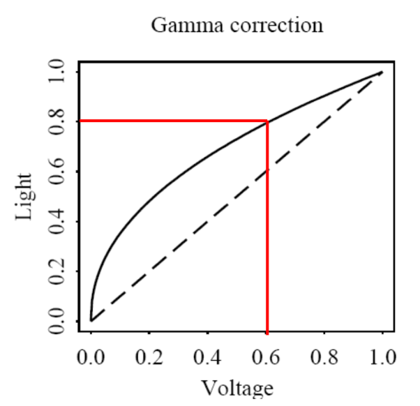
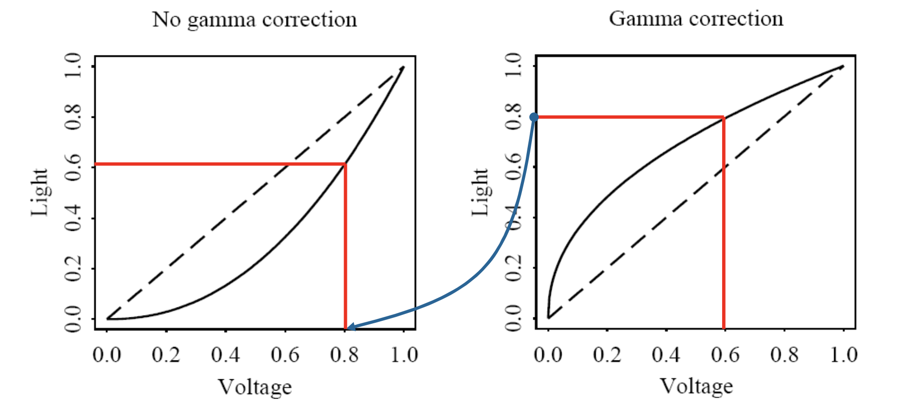

### 2.2 人眼的特点

- 对**亮度的感知**比对颜色的感知更敏感
- 对相对变化的感知比绝对变化的感知更敏感

> 这两个特点看似废话，但是它们极大影响了各种色彩空间与压缩算法的设计

### 2.3 色彩模型

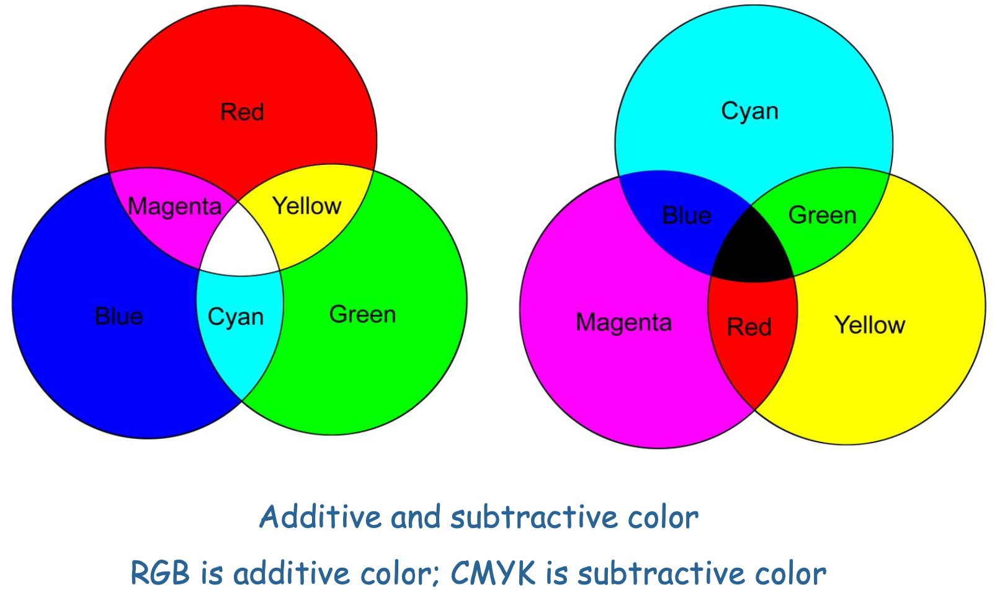

#### 1. RGN

- RGB是一种加色模型(Addictive Color)
- 三原色：Red,Green,Blue
- 原理：光的直接叠加
- 主要用于显示设备

#### 2. CMY

CMY由青(C),品红(M),黄(Y)三个分量组成，称为 **减色模型**(Substractive Color Model)

- 原理：不是光的直接相加，而是吸收光谱的叠加
  - C + M = Blue
  - M + Y = Red
  - C + Y = Green
  - C + M + Y = Black（理论上）

**CMY与RGB的关系可以写为**

$$ 
\begin{bmatrix} R\\ G\\ B \end{bmatrix} = \begin{bmatrix} 1\\ 1\\ 1 \end{bmatrix} - \begin{bmatrix} C\\ M\\ Y \end{bmatrix} 
$$ 

也就是说，CMY实际上可以看作是**RGB的补色系统**

#### 3. CMYK

由于实际印刷中，单纯把C,M,Y三种油墨混合得到的黑色，通常不够纯，往往会发灰、发脏，而且耗墨量较大，因此印刷业在CMY的基础上再增加一个：**K=Black(纯黑)**来调节灰度

#### 4. YIQ,YUV,YCbCr

YIQ、YUV、YCbCr 都是视频领域常用的色彩表示方式

共同点

- 都有Y分量，表示 **灰度/亮度信息**
- 另外两个分量表示 **颜色信息**(色度信息)

三者区别仅在于：**对颜色信息的分解方式不同**

虽然在视频处理和传输中常用这些颜色模型，但是在电子设备上显示时，最终还是要转换会RGB

视频使用这类编码有极其突出的优点：

- 在模拟信号时代，分离灰度让黑白/彩色相互兼容十分方便，黑白电视只接Y通道就可以兼容彩色频道，彩色电视只接Y通道也可以兼容黑白频道。
- 在数字信号时代，将人眼敏感的灰度与人眼不敏感的颜色分离，以便于压缩颜色信息而保留灰度，在减小数据量的同时控制视觉上的差异。

## 3. 视频

### 3.1 显示原理

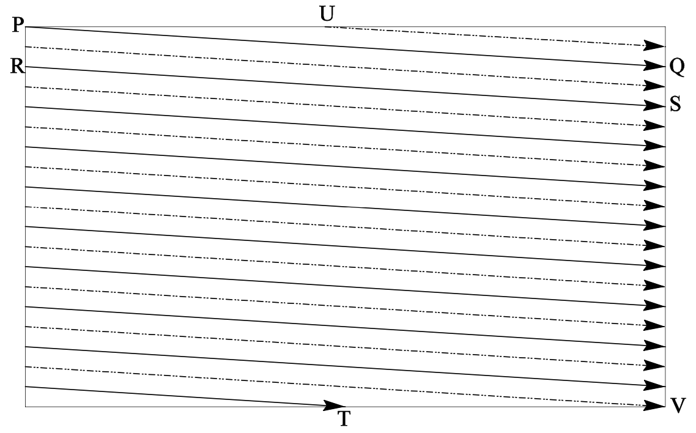

无论是CRT中电子轰击还是液晶显示器液晶反转，都是按行扫描的

- 显示器采用**按行扫描方式成像**
  - 从左上角开始逐行扫描到右下角
  - 一次完成一帧图像 
  - 扫描一行后需要进行水平回归
  - 扫完整帧后需要进行垂直回扫
- 扫描方式分为逐行扫描和隔行扫描

### 3.2 模拟制式

1. NTSC Video（正交平衡调幅）
使用地区：美国、加拿大、日本、韩国
提出时间：1953 年，美国
2. PAL Video（逐行倒相正交平衡调幅）
使用地区：德国、英国、中国
提出时间：1962 年，德国
3. SECAM Video（顺序传送彩色与存储）
使用地区：法国、俄罗斯
提出时间：1966 年，法国

| TV制式 | 帧率 fps | 扫描线数 | 总信道带宽 MHz | 亮度Y带宽 | 色度I/U带宽 | 色度Q/V带宽 |
| ------ | -------: | -------: | -------------: | --------: | ----------: | ----------: |
| NTSC   |    29.97 |      525 |            6.0 |       4.2 |         1.6 |         0.6 |
| PAL    |       25 |      625 |            8.0 |       5.5 |         1.8 |         1.8 |
| SECAM  |       25 |      625 |            8.0 |       6.0 |         2.0 |         2.0 |

### 3.3 数字制式

相比模拟制式的显著优点

- 便于计算机处理、使用
- 可以对任意位置有直接访问，便于剪辑、处理
- 方便复制、加密，于是便于传播

### 3.4 颜色下采样

> 这里很重要

前面说过单独分离灰度信息方便压缩颜色，这里是具体的做法：

- 相邻像素一般而言颜色接近，直接合并，这个过程称为下采样
- 下采样几乎是所有图像/视频压缩算法的第一步
- `JPEG`,`mpeg`都在使用420压缩
- 写题的时候注意被融合的部分是一个值而不是几个一样的值

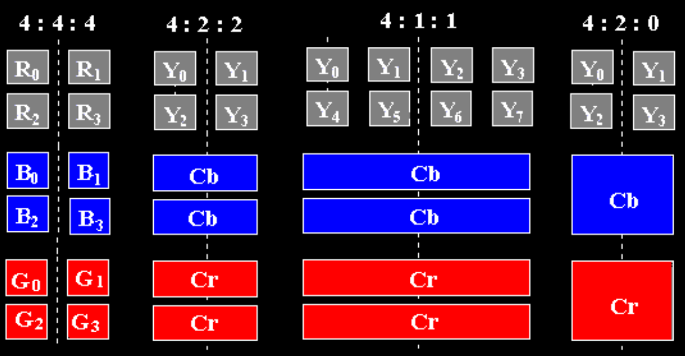

!!! warning

!!!