## 一、图像

### 抖动算法

#### 灰度位图

- 位图不借助任何压缩算法，直接对逐个像素表示
- `n-bit`灰度代表每个像素需要n-bit编码，对应有个$2^n$级灰阶
- 特殊地，`1-bit`灰度图像也叫**二值图像**

#### 抖动算法

打印机是二元输出设备(墨头/激光头只有开或关、黑或白两种状态)，原生**只能打印二值图像**。

要让打印机打出灰阶，就需要抖动算法。

- 抖动算法：讲一个像素细分，将像素细分再填入二值图像以欺骗人眼模拟灰度


- `DPI`(Dort Per Inch):在1英寸长度内可以打多少个点。
  - DPI的高低直接决定了打印机可以打印的灰阶等级
  - 例如想要25级灰阶，则在一个像素面积内至少要打**24个点**（可以表示25个状态），否则就会**失真**

!!! example 
一张 600×450、8bit 的图像，打印到 8×6 英寸纸上，用 300×300 DPI 打印机打印时，原图的 1 个像素会对应多少个打印点（dots）？以及为什么说 only 17 levels。

- 计算整张纸可以打多少个点：$(300 \times 8) \times (300 \times 6) = 2400 \times 1800$
- 原图有多少个像素：$600 \times 450$ pixels
- 计算每个图像像素对应多少个打印点
  - 横向每个像素对应：$2400 / 600 = 4$
  - 纵向每个像素对应：$1800/450=4$
  - 所以每个图像像素对应一个$4 \times 4$的点阵
!!!

#### 抖动矩阵

如果一个像素被细分成 5×5，小格子一共有 25 个。
假设当前像素灰度对应“要打 15 个点”，那问题就变成：

是哪 15 个位置打点，视觉效果最好？

- 这里我们就需要抖动矩阵
- 抖动矩阵规定了不同灰度下哪些小方格应该被涂色/打点（也就是在你不同灰度等级下二值点的空间分布方式，以获得更符合人眼感知的灰度模拟效果）


> 不同厂家对于抖动矩阵的规定不同，涂黑的小方格是标号**大于等于灰度值**的那些方格(如要得到灰度值为15的图像，那么标号大于等于15的方格会被涂黑)

### 颜色查找表

#### 8-bit彩色

不同于常见的24-bit(RGB三个通道各8-bit)真彩色，如果希望剑侠数据量，**每一个像素只用一个Byte表示**，那么

- 8不能被3整除，怎么均衡的表示RGB3个通道的值
- 怎么兼容24-bit真彩色设备

#### LUT

8-bit色彩图像中的值不直接表示颜色，而是**表示颜色查找表**(LUT)的索引。LUT完成从像素值到24-bit颜色值的映射


**核心思想**

- 像素值本身不是颜色，只是一个索引
- 真正颜色要去查找LUT表，映射成一个24-bit的RGB值
- 往往写在输出相关设备的驱动中

使用LUT带来一个额外的好处是，只要**替换颜色查找表**，就可以方便地得到不同颜色特征的图像


#### 聚类算法

前面8-bit位图借助LUT完成了颜色的转换，现在进一步关心 **怎么设计一个LUT**，怎么反向将真彩色信息压缩到256色更好

颜色直方图统计像素RGB的分布情况，下面是一个例子


如果我们简单线性划分RGB范围作为聚类算法，很快会发现问题：**有的bucket离大量不同色彩的像素被聚类到了一起，而有的bucket一个像素都没有**、这显然是浪费的。很直观地想到，**像素分布越密集的地方**，桶的划分应该 **越稠密**。为了解决这个问题，一个常用的算法是 **Medium Cut**中值切分算法

#### Medium Cut

- 先统计**所有像素的红色分布**，找到一个值使得其**两侧的像素数量相等**，得到两个bucket
- 两个桶分别**统计绿色分布**，各自找到一个值使得其两侧像素数量相等，现在得到了4个bucket
- 四个桶分别**统计蓝色分布**，各自找到一个值，这样会出现8个桶
- 以此类推

> 先找哪个颜色无所谓，只要**颜色之间是交替统计的**，每个颜色有几个bit表示就进行上述的切分几次


## 2. 颜色

### 2.1 显示器与Gamma

#### 1. CRT彩色显示器

**核心组件**

- **电子枪**：产生三束电子束
- **阴罩（掩磁罩）**：控制电子束打准位置
- **荧光屏**：被电子轰击后发光

**成像原理**

- 三束电子对应RGB
- 打到对应荧光点
- 通过RGB加色混合形成彩色图像

!!! warning
**电子束本身不发光，真正发光的是屏幕上的荧光材料**
!!!


> 三束不同能量的电子(能量分别对应三原色)轰击荧光屏

#### 2. Gamma矫正

- CRT的发光强度与驱动电压不是线性关系
- 亮度与电压的某个幂次成正比：$L ∝ V^{\gamma}$
  - L:亮度(light)
  - V：驱动电压(Voltage)
  - $\gamma$:伽马值(gamma)
- 输出亮度本身不是输入值R本身，而是$R^{\gamma}$
  - 这里的R可以理解成某个归一化后的输入信号值，范围一般在0~1之间
  - 这个幂指数叫做 **Gamma**，基座$\gamma$
  - CRT的$\gamma$值大约是2.2


> - 虚线：理想情况下L和V的关系
> - 实线：没有进行伽马矫正

- 如果直接将亮度比例作为输出电压比例，最终显示的颜色将会失真，暗部层次丢失
  - 比如上图中输出电压为0.8（我们希望得到的亮度是0.8），而最终得到的亮度是0.6

**因此我们需要进行伽马矫正**

通常，把经过伽马矫正的信号加一个(prime)，这种矫正方法是在传输前把原信号提升到$1/\gamma$次幂

这样最终就能得到线性的输出信号：

$$
R→R′=R^{1/γ}⇒(R′)^γ→R
$$

- 基本思路
  - 先做一次$1/\gamma$次幂
  - 显示器再做一次$\gamma$次幂
  - 两者正好抵消


### 2.2 人眼的特点

- 对**亮度的感知**比对颜色的感知更敏感
- 对相对变化的感知比绝对变化的感知更敏感


> 这两个特点看似废话，但是它们极大影响了各种色彩空间与压缩算法的设计

### 2.3 色彩模型


#### 1. RGN

- RGB是一种加色模型(Addictive Color)
- 三原色：Red,Green,Blue
- 原理：光的直接叠加
- 主要用于显示设备

#### 2. CMY

CMY由青(C),品红(M),黄(Y)三个分量组成，称为 **减色模型**(Substractive Color Model)

- 原理：不是光的直接相加，而是吸收光谱的叠加
  - C + M = Blue
  - M + Y = Red
  - C + Y = Green
  - C + M + Y = Black（理论上）

**CMY与RGB的关系可以写为**

$$ 
\begin{bmatrix} R\\ G\\ B \end{bmatrix} = \begin{bmatrix} 1\\ 1\\ 1 \end{bmatrix} - \begin{bmatrix} C\\ M\\ Y \end{bmatrix} 
$$ 

也就是说，CMY实际上可以看作是**RGB的补色系统**

#### 3. CMYK

由于实际印刷中，单纯把C,M,Y三种油墨混合得到的黑色，通常不够纯，往往会发灰、发脏，而且耗墨量较大，因此印刷业在CMY的基础上再增加一个：**K=Black(纯黑)**来调节灰度

#### 4. YIQ,YUV,YCbCr

YIQ、YUV、YCbCr 都是视频领域常用的色彩表示方式

共同点

- 都有Y分量，表示 **灰度/亮度信息**
- 另外两个分量表示 **颜色信息**(色度信息)

三者区别仅在于：**对颜色信息的分解方式不同**

虽然在视频处理和传输中常用这些颜色模型，但是在电子设备上显示时，最终还是要转换会RGB

视频使用这类编码有极其突出的优点：

- 在模拟信号时代，分离灰度让黑白/彩色相互兼容十分方便，黑白电视只接Y通道就可以兼容彩色频道，彩色电视只接Y通道也可以兼容黑白频道。
- 在数字信号时代，将人眼敏感的灰度与人眼不敏感的颜色分离，以便于压缩颜色信息而保留灰度，在减小数据量的同时控制视觉上的差异。

## 3. 视频

### 3.1 显示原理


无论是CRT中电子轰击还是液晶显示器液晶反转，都是按行扫描的

- 显示器采用**按行扫描方式成像**
  - 从左上角开始逐行扫描到右下角
  - 一次完成一帧图像 
  - 扫描一行后需要进行水平回归
  - 扫完整帧后需要进行垂直回扫
- 扫描方式分为逐行扫描和隔行扫描

### 3.2 模拟制式

1. NTSC Video（正交平衡调幅）
使用地区：美国、加拿大、日本、韩国
提出时间：1953 年，美国
2. PAL Video（逐行倒相正交平衡调幅）
使用地区：德国、英国、中国
提出时间：1962 年，德国
3. SECAM Video（顺序传送彩色与存储）
使用地区：法国、俄罗斯
提出时间：1966 年，法国

| TV制式 | 帧率 fps | 扫描线数 | 总信道带宽 MHz | 亮度Y带宽 | 色度I/U带宽 | 色度Q/V带宽 |
| ------ | -------: | -------: | -------------: | --------: | ----------: | ----------: |
| NTSC   |    29.97 |      525 |            6.0 |       4.2 |         1.6 |         0.6 |
| PAL    |       25 |      625 |            8.0 |       5.5 |         1.8 |         1.8 |
| SECAM  |       25 |      625 |            8.0 |       6.0 |         2.0 |         2.0 |


### 3.3 数字制式

相比模拟制式的显著优点

- 便于计算机处理、使用
- 可以对任意位置有直接访问，便于剪辑、处理
- 方便复制、加密，于是便于传播

### 3.4 颜色下采样

> 这里很重要

前面说过单独分离灰度信息方便压缩颜色，这里是具体的做法：

- 相邻像素一般而言颜色接近，直接合并，这个过程称为下采样
- 下采样几乎是所有图像/视频压缩算法的第一步
- `JPEG`,`mpeg`都在使用420压缩
- 写题的时候注意被融合的部分是一个值而不是几个一样的值


## 4. 音频

### 4.1 采样与量化

#### 采样

声音从物理上是连续的，为了能够由计算机处理，它需要通过采样离散化。采样的频率越高，还原之后越接近原声。

**奈奎斯特定理**：采样频率**至少应该是模拟信号带宽的两倍**，才能保证不丢失信息

- `Nyquist Rate`:原始信号带宽的两倍
- `Nyquist Frequency`:奈奎斯特速率的一半

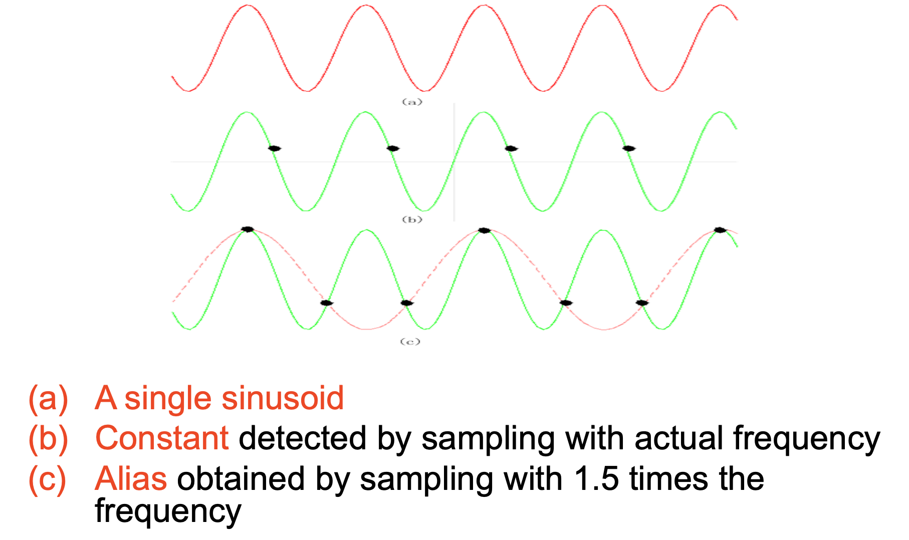

#### 量化

采样将时域离散了，但是取值仍然是连续的，这就需要量化。自然想到，类似颜色，在量化时可以**均匀地划分近似区间**，也可以**将人耳敏感的频段划分的细致一些**而将**不敏感的频段划分粗糙一些**

### 4.2 分贝

声音领域常以分贝为单位

计算响度的分贝时，分母`po`为人耳能听见的最小声音功率。分子是需要计算声音的功率，因此人耳能天剑的最小声音就是0dB

$$
N_{dB} = 10lg\frac{p_i}{p_o}
$$

在计算信噪比时，仍然以分贝为单位，但是分母为噪声的功率，分子为信号的功率。在模拟电路中可以任务额功率与电压呈平方关系，所以公式可以如下改写

$$
SNR = 10log_{10}\frac{V^2{signal}}{V^2{noise}} = 20log_{10}\frac{V_signal}{V_noise}
$$

### 4.3 音频编码

前面采样与量化将音频的时域和值域都离散了，现在进行文件的编码

#### PCM

PCM脉冲编码调制时最基础的音频编码，直接离散采样并量化即可。还原时进行反量化即可

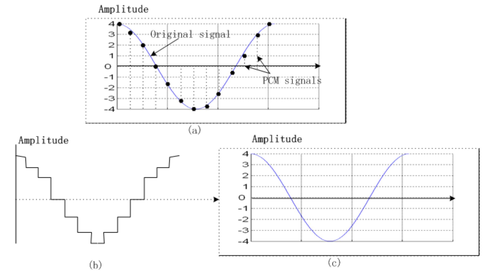

在传统电话系统中，用户的带宽是`4kHz`(采样频率是`8kHz`)，在输入时需要滤波分离出人生集中的频段

数模转换时引入无线高频的噪声，所以输出时需要 **低通滤波器**将其消除

除了对输入输出的处理之外，内部就是PCM编码

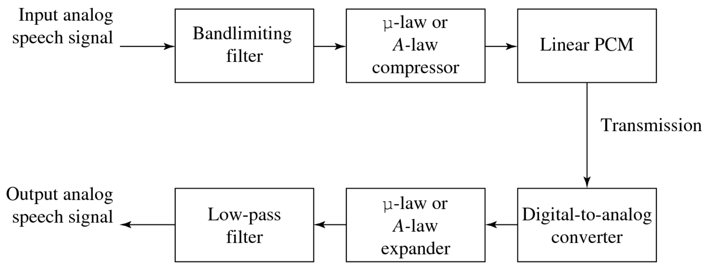

#### DPCM

PCM储存的是直接的量化值，它的**范围可以很大**，**取得的值可能很离散**，导致数据量大且难以压缩。所以我们引入了**差分编码**

- `PCM`:2,4,5,9,7
- 差分：2,2,1,4,-2
储存的值不是量化直接得到的值，而是前后的差。显然差分编码**缩小了数据分布的范围**，让值变得更集中，这对压缩非常有利。

且差分编码相对`PCM`是无损的，没有损失任何信息

下面的图可以直观看出，差分编码可以让数据分布更集中

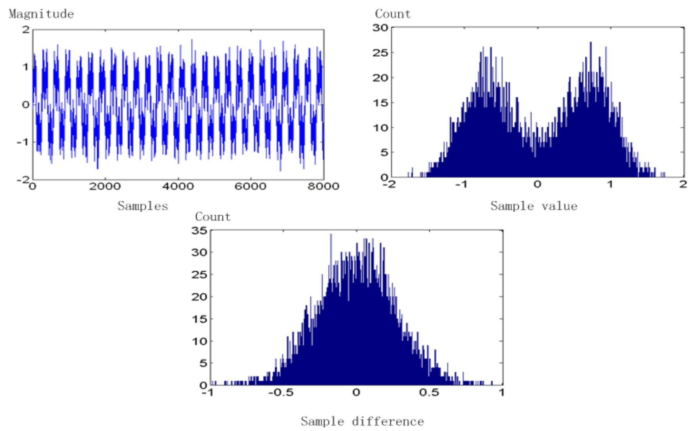

#### 预测编码

考虑下面这种情况

- `PCM`:0,2,4,6,8
- 差分：0,2,2,2,2

自然想到`PCM`的分布可能存在规律，可以猜测下一个`PCM`的值大致为10，我们约定预测编码中的值含义如下

$$
e_n = f_n - \hat{f_n}
$$

即编解码双方约定一个共同的**预测函数**，它通过前面几个值预测下一个值，我们只需要储存**预测值与真实值之间的差**(可见它也用到了差分编码的思想)

预测编码利用**音频本身的规律性**让数据分布

预测编码相对`PCM`也是无损的

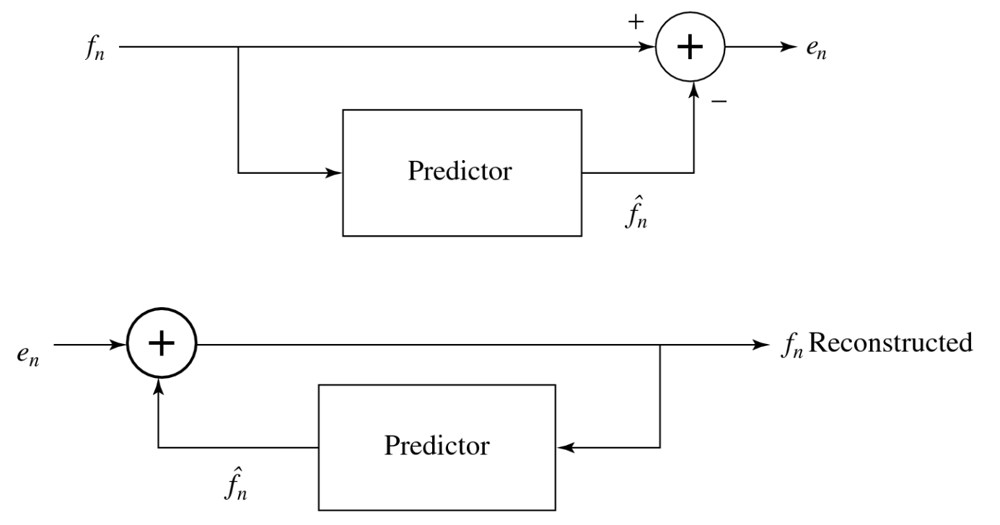

#### 再次量化

如果经过差分/预测编码，数据还是过多，我们可以再次使用 **量化**，将细粒度的原始值映射到粗粒度的新值以进一步压缩

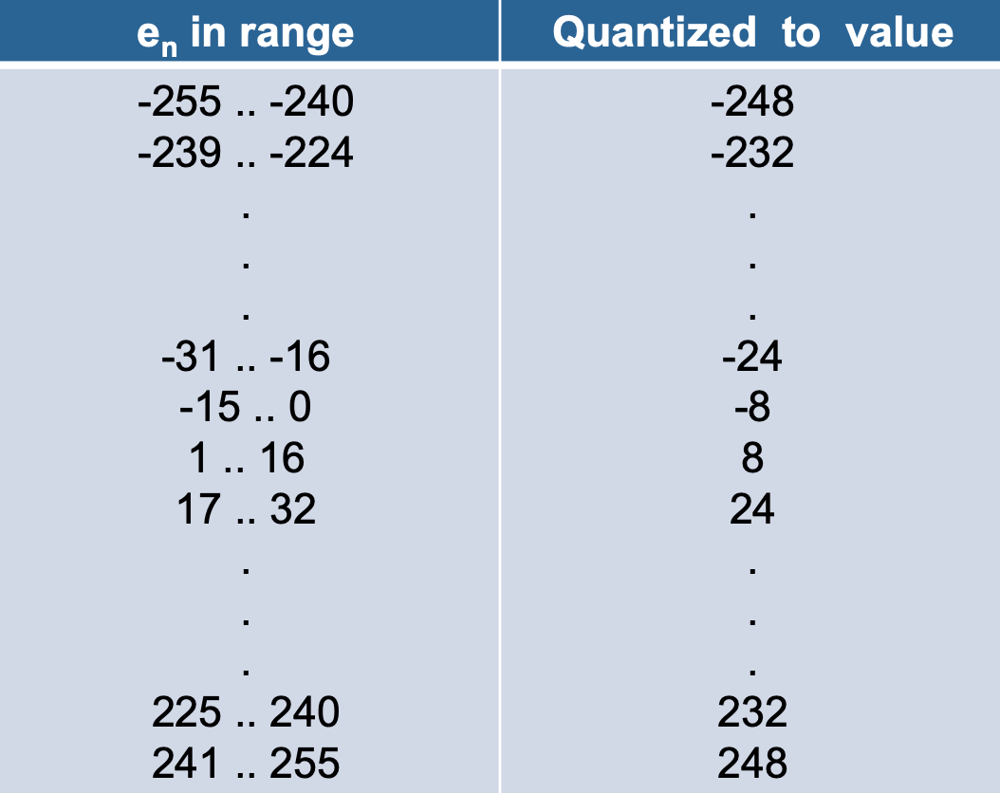

!!! warning
特别注意，预测编码要求编解码双方的预测函数相同
!!!

经过二次量化，解码端只能还原出**有损的数据**，也即只能用有损的数据放到预测函数里。这反过来要求了 **编码端也只能用经过量化的有损数据做预测，而不能使用原始数据**

## 5. 无损压缩

### 5.1 信息论

对数据中所有出现过的值做统计，得到字母表$S=s_1s_2...$

定义某个字母(或者叫信元)的信息量为$log_2(\frac{1}{p_i})$，其中$p_i = \frac{|s_i|}{|S|}$ 即该信元出现的信息论证明了，编码字母表S中的某个信元$s_i$需要的比特数不小于它的信息量

定义**某段数据的信息熵**:$H(S)=\Sigma_{i=1}^{n} p_i \times log_2(\frac{1}{p_i}) = -\sigma log_2(p_i)$

即对各个信元的信息量根据概率做**加权平均**

显然这段数据的平均码长不小于其信息熵，$L(c) \beq H(S)$，于是定义**编码的效率**$η = \frac{H(S)}{L(C)}$

### 5.2 无损压缩编码

#### Run-length Coding

游程编码，即用一个**重复次数**代替一串**连续的相同的值**

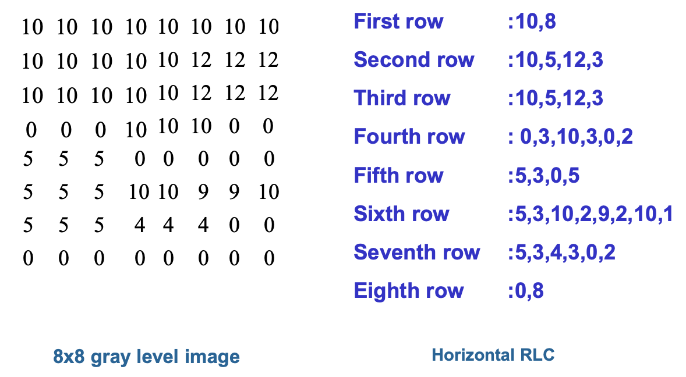
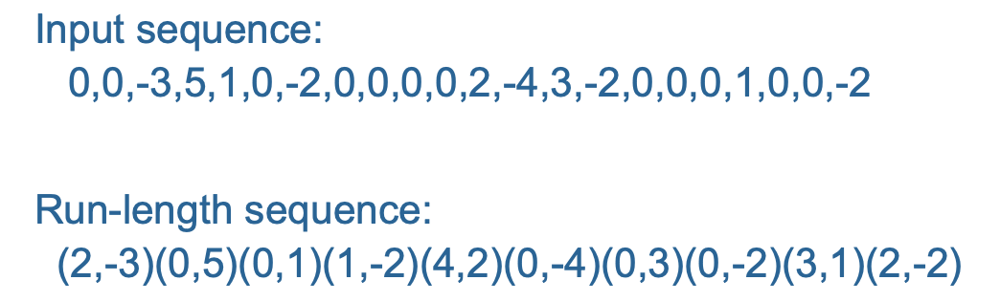

> 这里用一个二元组`(a,b)`表示游程编码的参数
> - 第一个数= 0的个数
> - 第二个数 = 接下来的非零数值

#### Huffman Code

霍夫曼编码，先统计各个信元出现的概率，放到小顶堆内。每次小顶堆pop两个节点合并成新节点，再放回堆中，直到只剩下一个节点。

霍夫曼编码保证了**出现频率越多的信元，编码的长度越短**，这就使得总长度最短

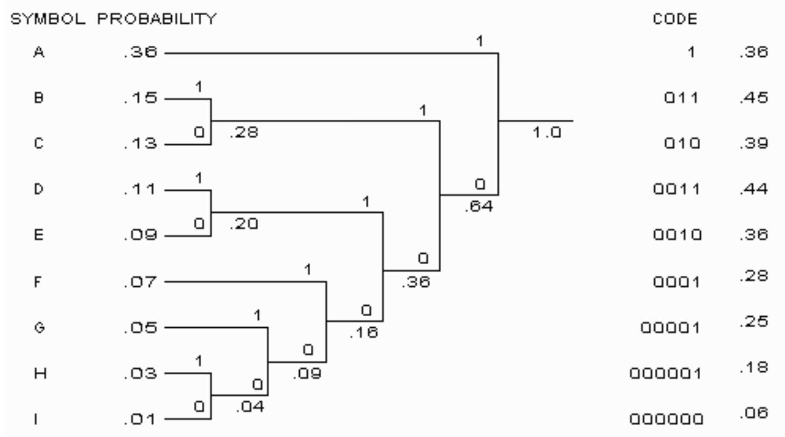

#### Directory Code

在线压缩编码，码表不能事先约定，而是应该**由此前的输入动态生成**

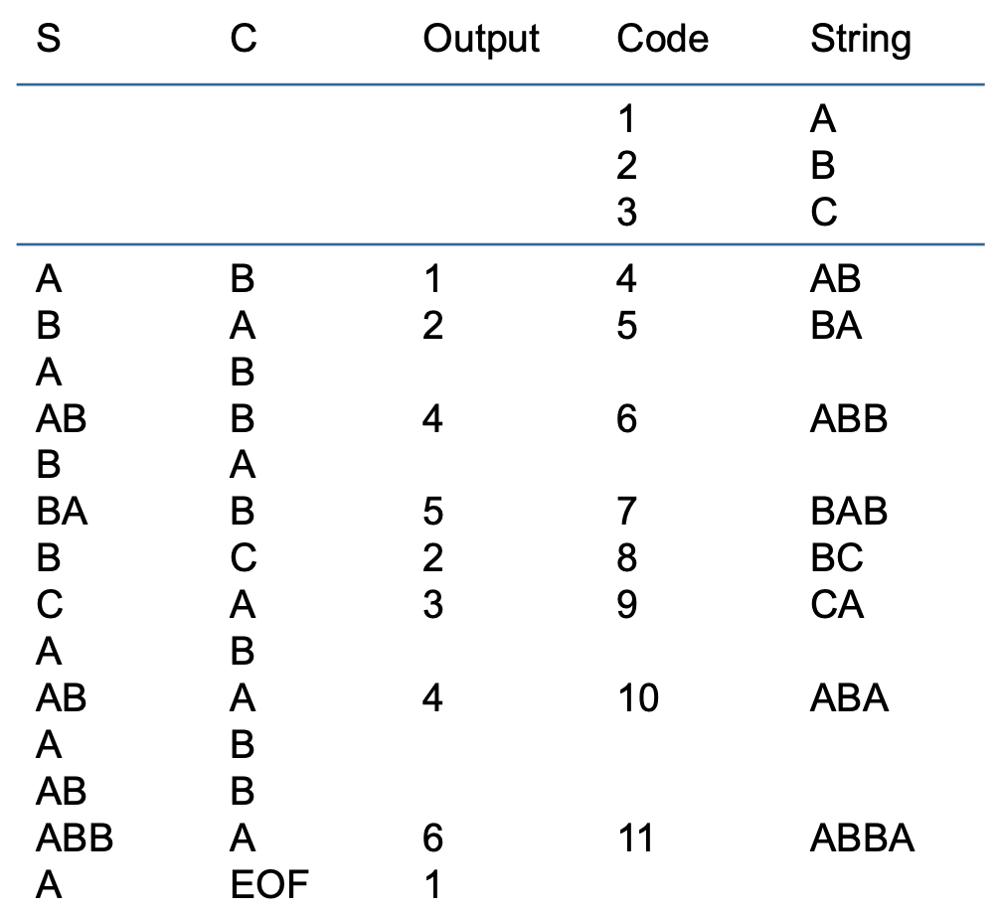

- 输入:`ABABBABCABABBA`
- 输出：`1 2 4 5 2 3 4 6 1`

#### 算数编码

首先，统计字母表与字母出现的概率，得到概率之后简将`[0:1)`区间按照概率划分给各个字母

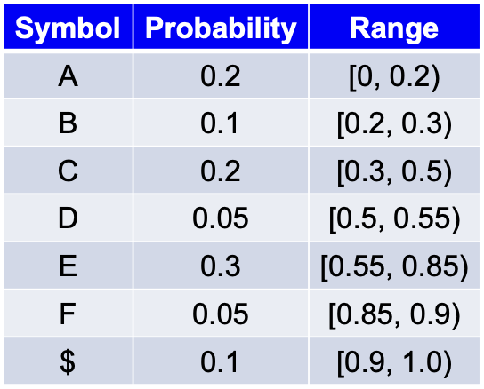

然后可以开始压缩，比如现在有一个串`CAEE`

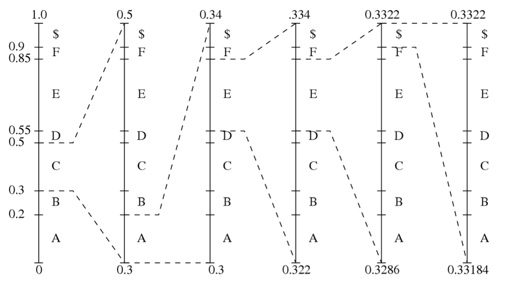

解码时需要先拿到最初的区间划分表，然后逐层范围检索知道遇到结束符即可

这是算数编码的缺点，每一个子串末尾必须有结束符，否则数学上区间可以无线细分，无法解码

## 6. 有损压缩

信息论证明了，**把数据转换成向量再压缩，效率高于直接进行压缩**。

关键在于用什么样的变换T将原始数据无损转换为向量最好

下面介绍一下两种最常见的转换。

!!! warning
转化本身都是 **无损的**，损失只来自于 **量化**
!!!

### 6.1 DCT

#### 数学原理

DCT正交预先变换先将图像函数穿换成偶函数形式，再对齐进行二维离散傅里叶变换，故DCT变换可以看成是一种简化的傅里叶变换

#### 物理意义

从矩阵入手，我们把变换矩阵的每一行单独拆开

任意长度的向量的转换方程都有相同的性质，下面以长度为8的向量为例

第一行是完全线性的，我们称其为 **原始信号的直流分量DC**

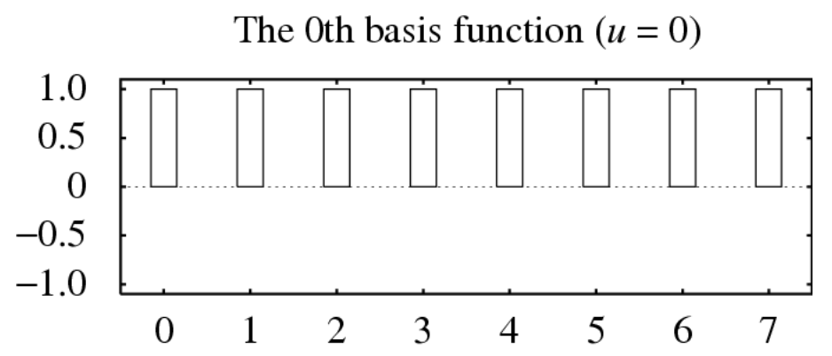

其余都是相互正交频率不同的余弦函数，我们称其为**交流分量AC**

#### 直观效果

DCT最重要的效果是让数据分布集中。对这样的一个函数(图像上均匀取了100个离散的点)

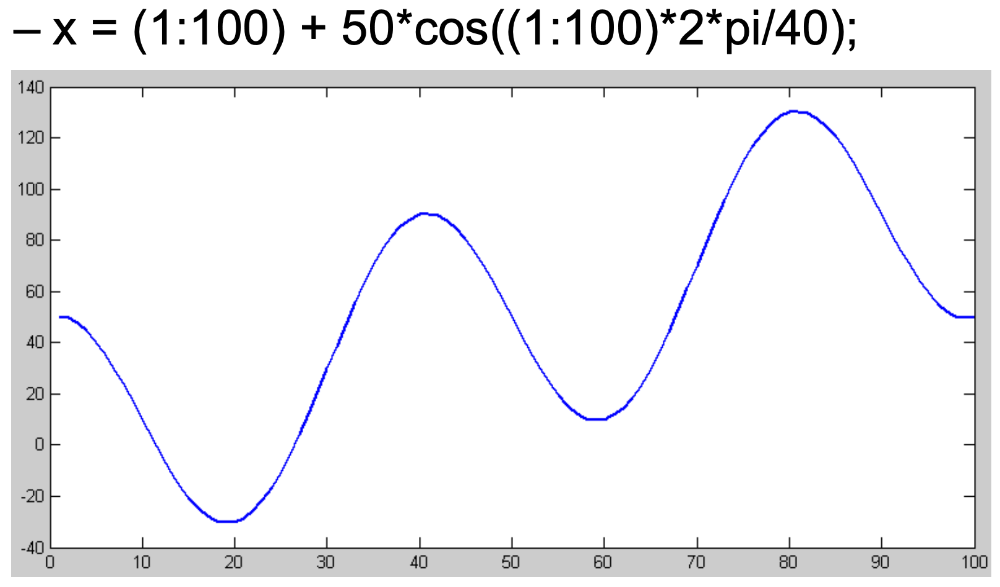

应用DCT变换之后

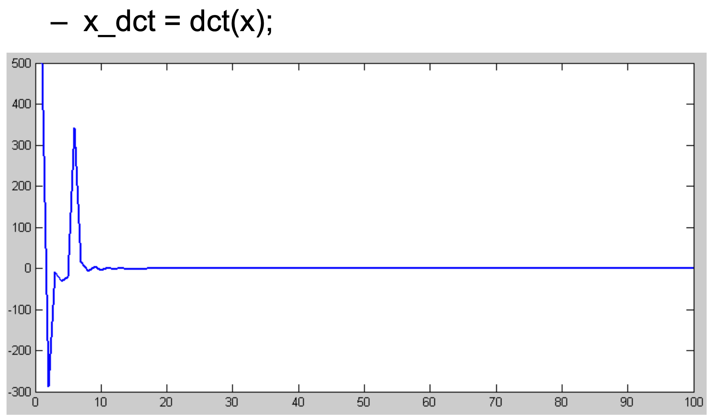

可见信息高度集中于一小部分，信息熵很低，这就非常有利于压缩。这里即使我只取最低的8个值，高位直接量化为0，逆变换得到的结果仍然非常接近原图像

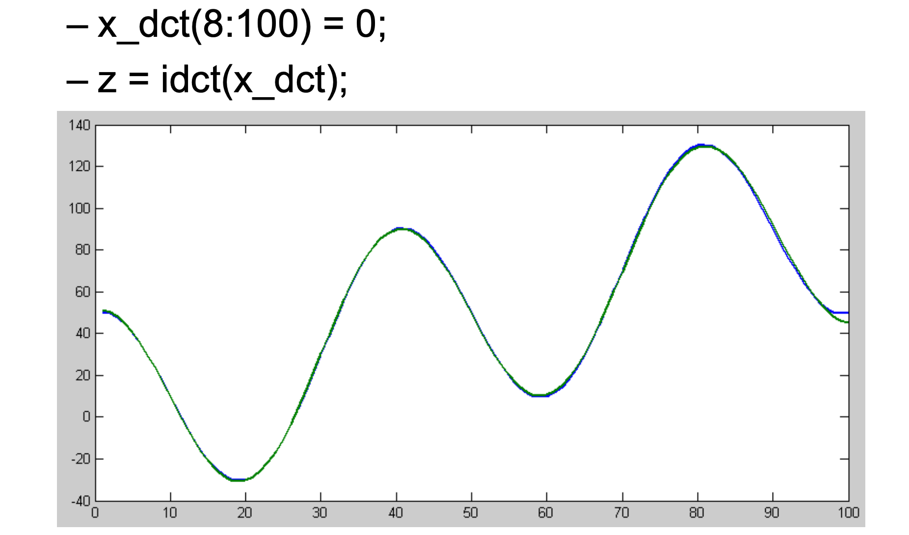

### 6.2 二维DCT图像

x,y方向的波函数叠加即可

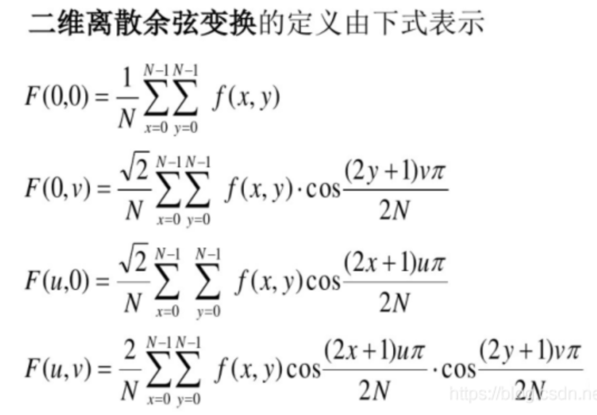
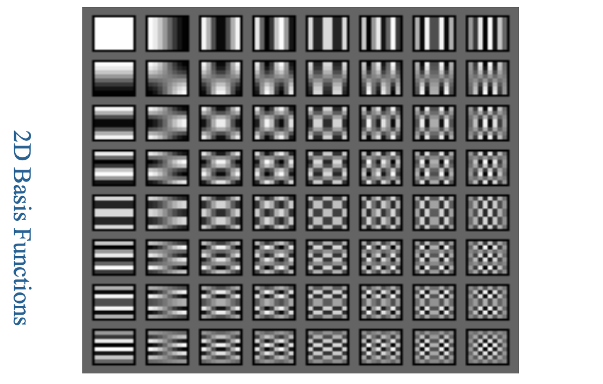

### 6.3 Wavelet-Based Coding

小波变换主要利用了**图像的低频信息往往高于高频信息量的特性**，这与DCT是相通的

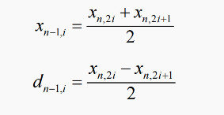

图像的高频信息很少且自然图像通常是局部平滑的，意味着作差之后像素的值往往趋于0，有损压缩就可以先对这些趋于0的像素下手

### 6.4 JPEG有损模式

#### General

几个基本事实

- 人眼对于敏感变化的敏感度大于对颜色的敏感度
- 人眼对于低频信息的敏感度大于高频信息的敏感度
- 视频中低频部分的信息量大于高频部分的信息量


于是得到JPEG有损压缩的一般步骤

1. 颜色模型的转换。从`RGB`到`YIQ/YUV`，然后`4:2:0`下采样
2. `8*8`块大小(经验结果)上做**DCT变换**
3. 量化
4. `Zigzag`遍历块
5. 对`DC`分量做 **DPCM差分编码**
6. 对`AC`分量做 **RLE游程编码**
7. 两者组合做熵编码

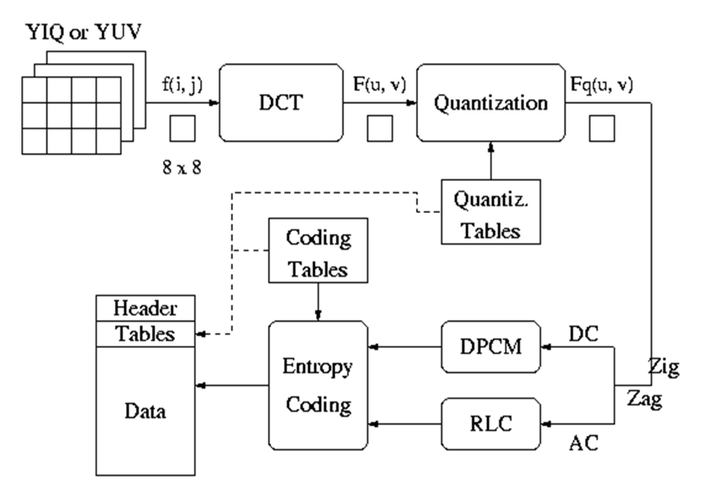

信息的损失来自于下采样和量化，编码不会出现 **信息损失**

#### 量化

具体做法：整数做法取商，对DCT后的每个系数$F(u,v)$，用量化表里对应位置的数$Q(u,v)$去除再取整

二维DCT变换后的8*8矩阵中，每个卫生纸的数据对应的被除数展示如下

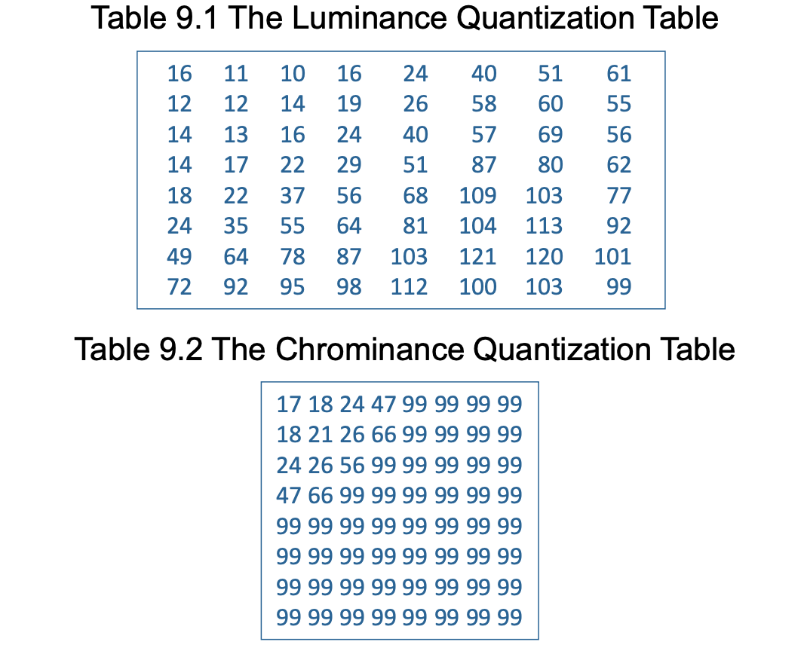

从中我们可以得到两点信息

- 低频信息保留的更多
  - DCT越靠左上角频率越低，而出鼠标中越靠左上角值越小，即量化到同一个值的范围越小，量化越精细
- 灰度信息保留的比颜色信息更精细
  - 显然上图中灰度的除数表是精心设计的，而颜色的除数表粗暴的多

#### zigzag scan

对量化的结果进行编码，注意编码的顺序是左上斜对角到右下，而不是逐行或者逐列，这是为了把高频信号放在一起，方便后续编码

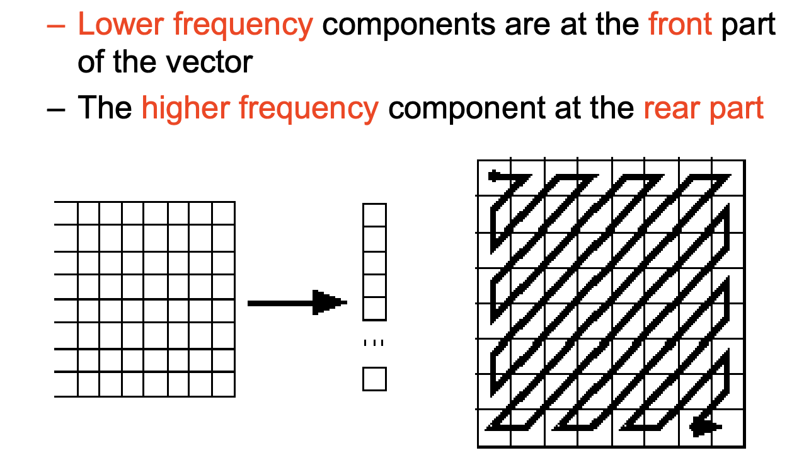

> 这里依旧是低频率在左上角，高频率在右下角

#### RLE/DPCM Coding

对AC做RLE游程编码。下图中第一行是`Zigzag Scan`得到的一维值序列，**AC不分即除第一个数以外的部分**，游程编码结果如图第二行所示

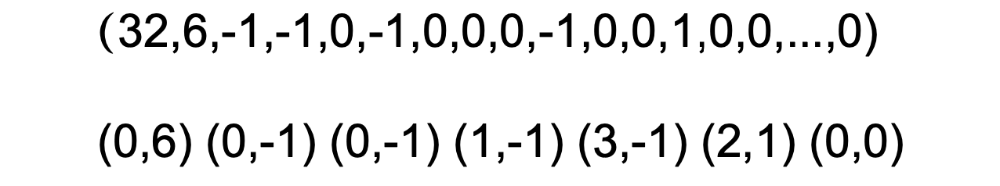

> 32是DC系数

对DC部分做DPCM差分编码，即把第一个值单独拎出来差分，这是因为直流分量往往较大。差分键个缩小值的分布氛围，便于后续编码

此时，`AC/DC`两者是分开的，在熵编码才合在一起

#### 解码

- 序列模式(Sequential Mode)：把原图中8*8的块逐行传输，逐行解码并展示。表现为图片从上往下按行加载
- 渐进式谱系选择(`progressive spectral selection`):先传每个块的直流系数，再传慢慢从低频到高频传信息。表现为图像最开始很模型，然后逐步变得清晰
- 渐进近似(`successive approximation`)：思路和渐进谱系选择时一样的，只不过这次不是先传DC，低频再传AC，高频；而是按照`bit`位从高到低传，**先传第8bit，再传7bit，再第6bit...**
  数学基础同上，DCT变换是完全线性的。IDCT的和等于和的IDCT 


  ## 7. 视频压缩

  ### 7.1 整体思路

  从空间冗余性上，视频的每一帧都是图片，前面学过的图片压缩算法都可以使用，从时间冗余性上，**每一帧回见的差往往很小**，视频压缩使用了之前提过的差分编码+预测编码的形式以提升信息的熵


  基于这样的整体思路，我们可以大致将帧分类

  - `Infra-Frame`:I帧，独立的帧，自身的信息不来源于任何其他帧
  - `Inter-Frame`:分为`P`和`B`帧，分别对应前向于双向预测算法
    - 在`H.264`中所有预测帧都有多个参考帧

### 7.2 运动补偿

考虑到**视频的运动特性**，在做差分和预测时我们并不是直接对相同位置的前后两帧计，而是加入**运动补偿**

1. 拿到需要编码的帧，将其分块(流行块大小是`8*8/16*16`)
2. 对任何一个分块，在其周围一定区间内找有没有**跟他长得像的块**(流行的搜索范围是`p = 7/15`)
3. 记录2中选定的长得最像的块与目标块的相对位置
4. 对2中选定的块做差分和预测

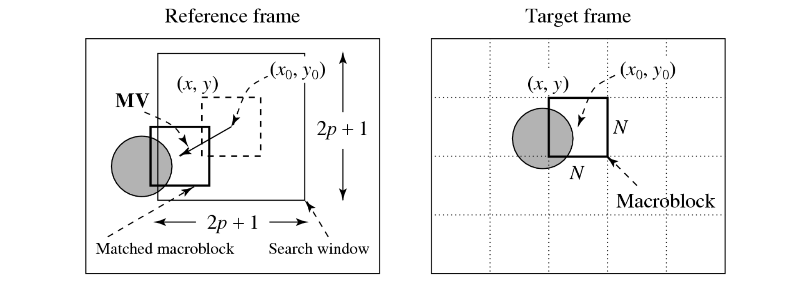

每张图像被划分为`N*N`大小的宏块

运动补偿在宏块层级上进行

- 当前图像帧被称为 **目标帧**(target frame)
- 在目标帧中的宏块与先前或未来帧(参考帧)最相似的宏块之间寻找匹配
- 从**参考宏块**到**目标宏块**的位移称为 **运动向量MV**

> 上图起始本质上是一种前向预测的情况，其中参考帧取自前一帧

运动向量搜索通常局限于一个较小的邻域：水平和垂直位移范围在`[-p,p]`之间。这形成了一个大小为`(2p+1)*(2p+1)`的搜索窗口  

### 7.3 Search for Motion Vectors

本质上是一个匹配问题

目标是找到使两个宏块之间距离最小的`(i,j)`

#### 线性搜索

将窗口中每个位置为中心点的宏块与目标真重的宏块进行逐像素比对，并利用公式计算得出**各自的平均绝对差值**

产生最小平均绝对差值的向量被指定为目标帧重该宏块的运动向量`(u,v)`

#### 对数搜索

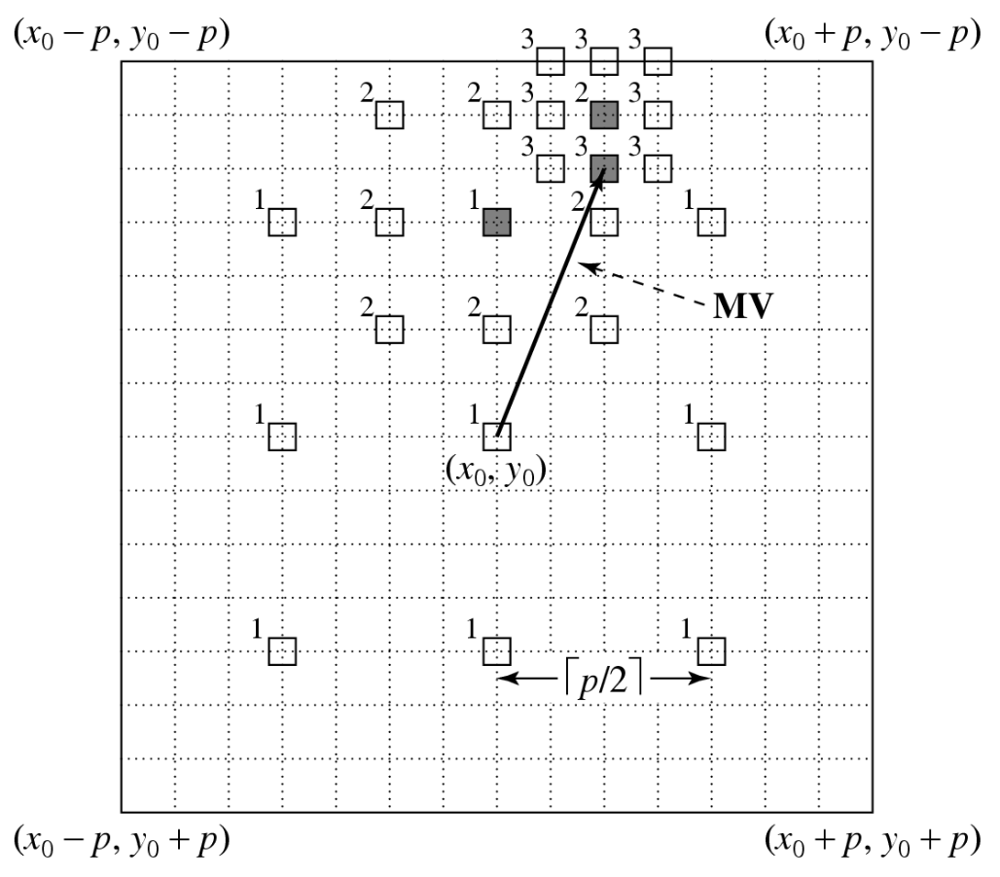

1. 在搜索区域内均匀取`N*N`个块，图中取`3*3`
2. 这些块重兆长得最像的，在它附近一定范围再取`N*N`个块
3. 每一次迭代范围缩小多少，迭代多少词可以自己定

对数搜索的结果不一定是最优解，但是我们也不必要找到最优解，只要一定程序相似能减小编码最终的信息量就可以

#### 层次化搜索

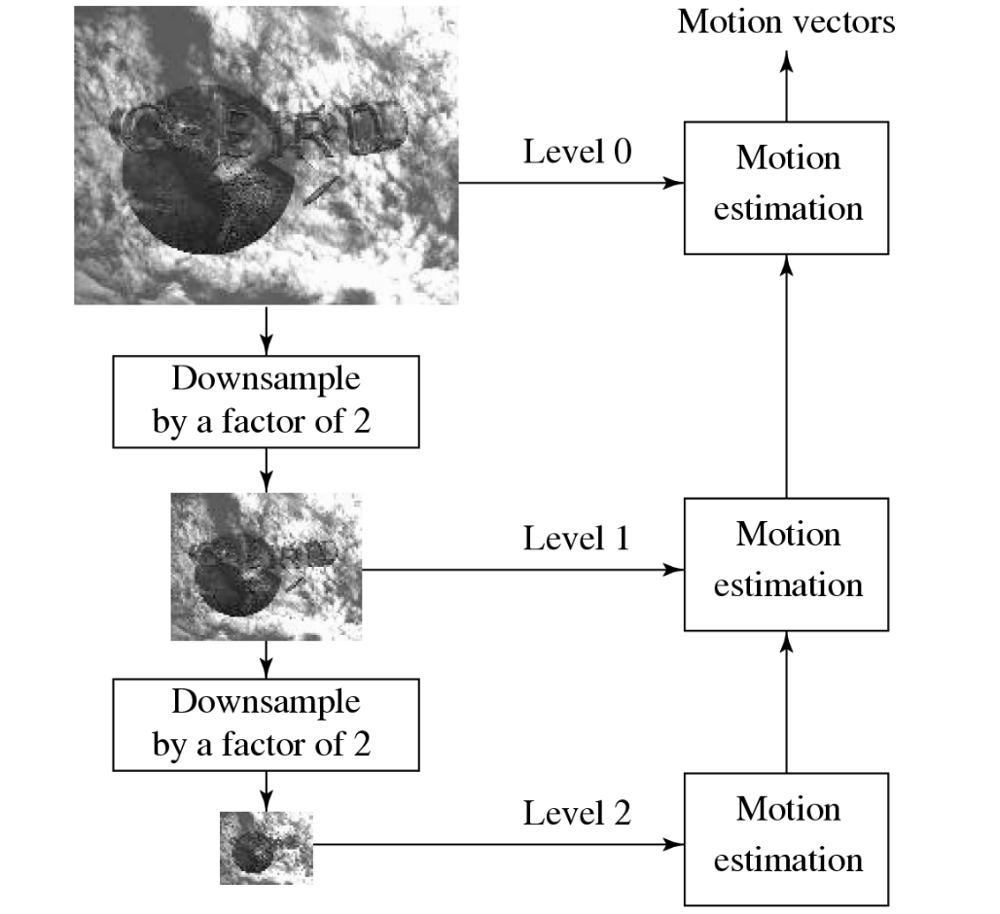

逐级压缩原图

先在低分辨率图像上做粗搜索，得到一个大致运动方向向量

再逐层回到更高分辨率图像上，把这个运动向量不断细化


### 7.4 H.261

#### 流程

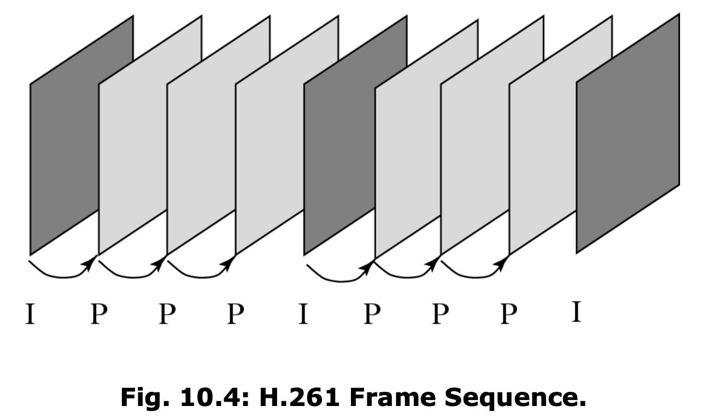

- 默认使用`4:2:0`图像压缩
- 只有前向预测，每隔一段时间必须有一个I帧**防止有损压缩导致误差积累**
- 即使是P帧，也不一定要强行做运动补偿、差分预测，找不到可以**直接存储元数据**

**I帧就是普通的图片压缩**

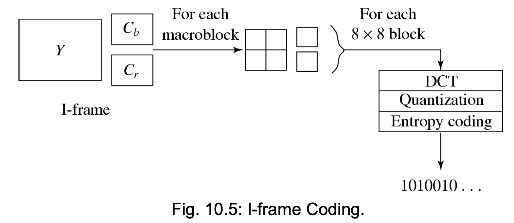

P帧中还要存储**运动向量**

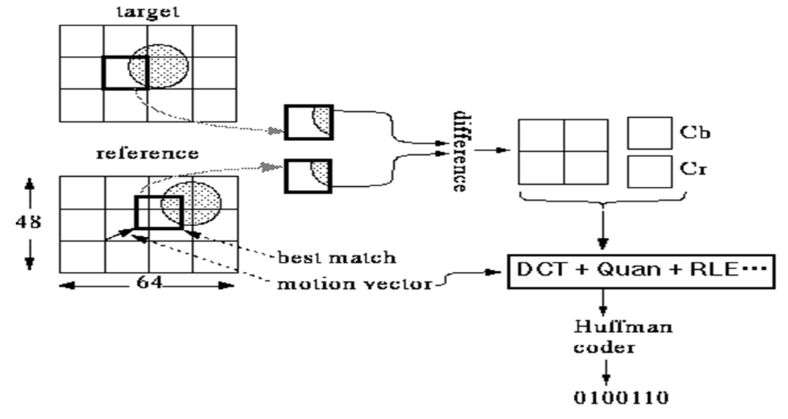

- P帧编码是对差值宏块(而非目标宏块本身)进行编码
- 有时可能无法找到理想的匹配，即预测误差超出可接受的阈值；此时将直接对该宏块进行编码（视为帧内宏块），这种情况被称为非运动补偿宏块

####  量化

`H.261`量化比较粗暴直接：对所有宏块中的DCT系数使用一个常数(步长)，该步长取值为`2-62`之间的偶数之一。在帧内模式下，DC系数始终采用步长为8的设置

$$
QDCT = round(\frac{DCT}{step_size}) = round(\frac{DCT}{8})
$$

**编码器数据流**

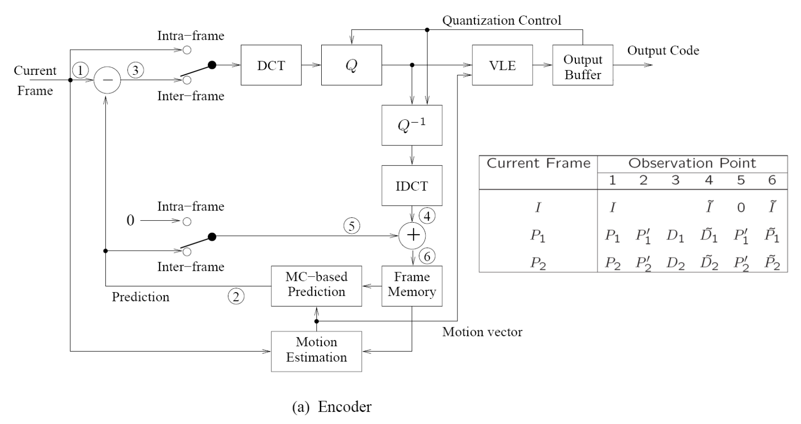

**解码器数据流**


#### 视频比特流语法

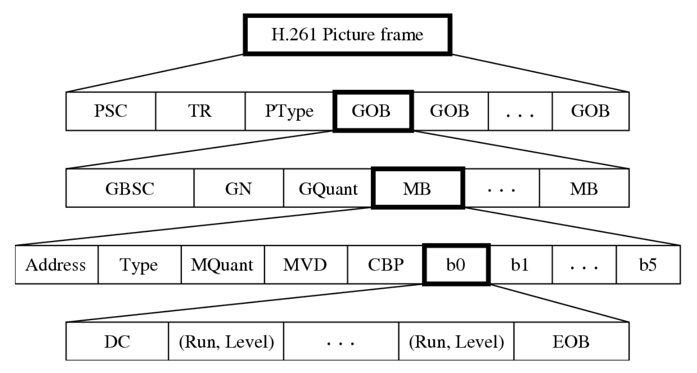

### 7.5 H.263

- 支持可变大小的GOB
- 支持以半个像素为单位找最佳匹配(需要插值)

!!! example
整数像素

```
●   ●   ●   ●
●   ●   ●   ●
●   ●   ●   ●
```

半像素支持

```
● - ● - ● - ●
|   |   |   |
● - ● - ● - ●
|   |   |   |
● - ● - ● - ●
```
!!!

- 更高级的运动预测算法(`4MV`)
  - 同一个宏块不再只用一个运动向量，而是把亮度块拆分成4个小块，每个小块有自己的运动向量
- PB模式双向编码(双向预测需要向 后向参考，这会带来延迟)

### 7.6 MPEG-1

- 双向预测
- 以半像素为单位搜索运动向量，搜索的范围更大不局限于前后I帧
- 对`inter`和`infra`用不同的量化策略
- 视频画面划分`slice`以`slice`为粒度设置参数
- 只能**逐行扫描**

#### 双向预测

双向预测的应用场景如下

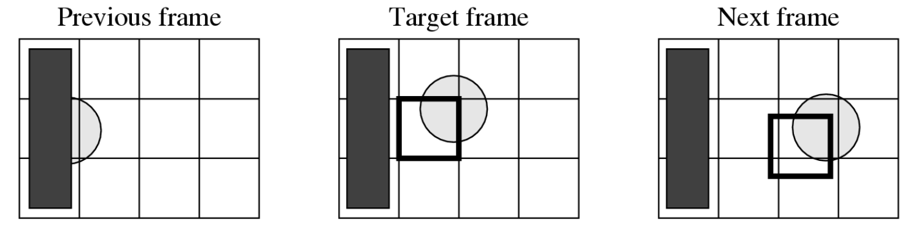

在搜索找到最佳匹配的块后，按照如下的流程进行编码

!!! warning
对16*16的原始块应用颜色`4:2:0`压缩后，Y通道得到4个`8*8`的块，`Cb,Cr`都只得到一个`8*8`的块
!!!

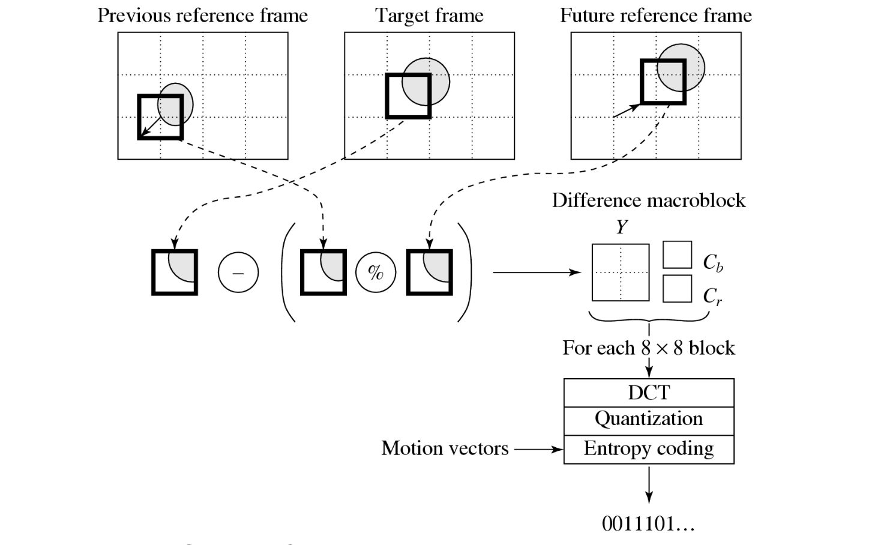

因为双向预测的存在，解码的时候必须要 **先解出I帧，再解出P帧，最后解出B帧**

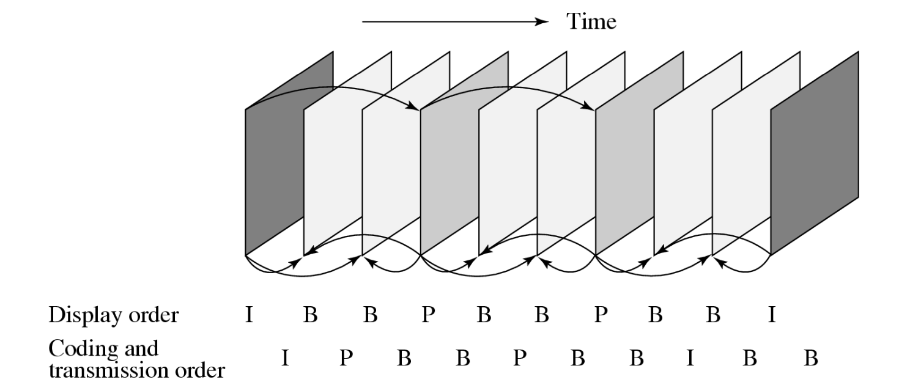

#### slice

MPEG支持将数据划分为若干`slice`，比如下图中每个块对应`16*16`像素，同种形状的块构成一个slice

**slice之间独立编码**，这使得`MPEG-1`有很强的抗干扰性，某一个小区域数据损坏至多影响其所在`slice`的范围

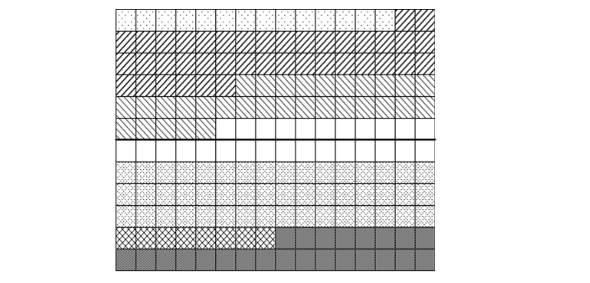

#### 编码格式

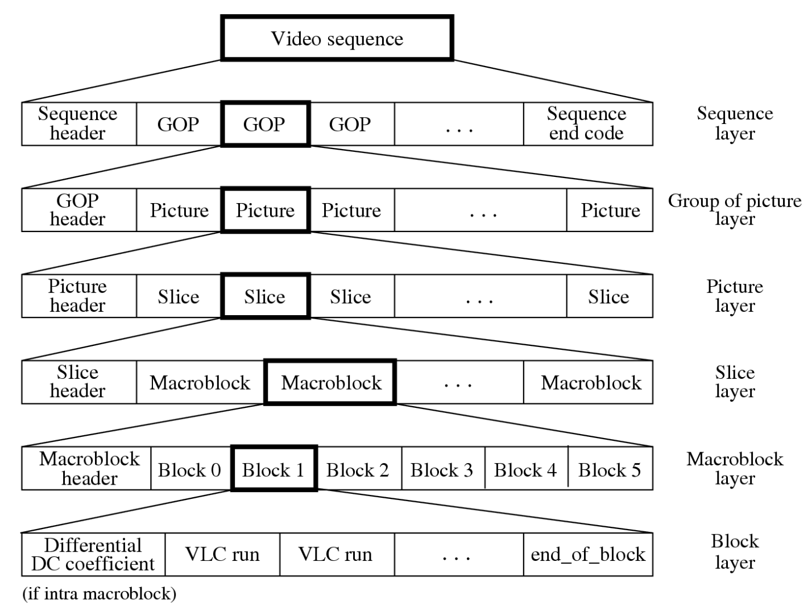
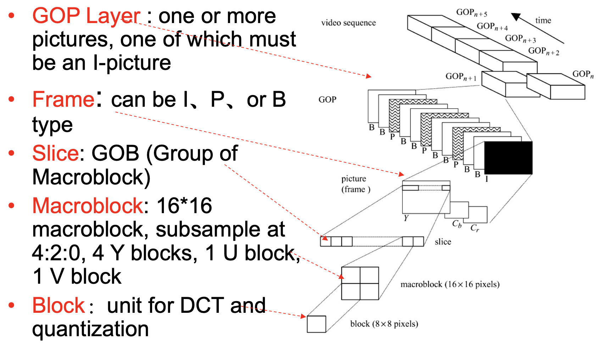

### 7.7 MPEG-2、

- 提高视频质量上限
- 支持更灵活的压缩率(多种压缩方式、多种下采样方式)
- 支持隔行扫描(奇偶数两个场相互参考，依赖关系可能非常复杂)
- 支持非线性量化
- 可伸缩编码
  - 本质上是传输方式的改进，而不是压缩的改进


#### SNR可伸缩编码

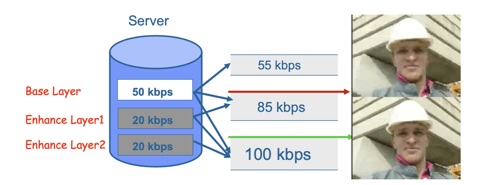

如果现在有一个清晰度非常高的视频，但是不同用户需求的质量(不同网速条件、不同设备条件)，我们就需要进行伸缩编码

如果能提供多少种清晰度就只做多少份码流太浪费，应该制作一个压缩率很高的基础层(只有一个，且必须能解码)，再把**每一次画质升级作为基础层的叠加**(增强层可以有很多，利用差分编码很容易实现叠加)

于是请求不同清晰度只要接受不同数量的提高层即可