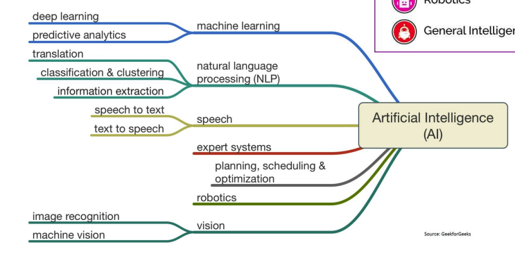
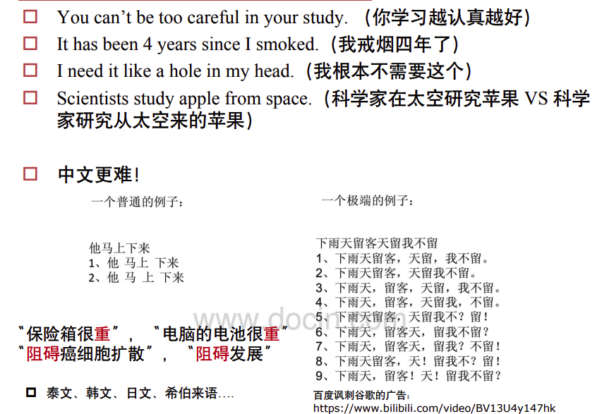
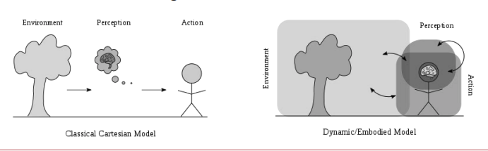

# Introduction to Natural Language Processing

## 什么是自然语言处理（NLP）？

**自然语言处理（Natural Language Processing，NLP）** 是计算机科学和人工智能领域的一个重要分支，致力于让计算机能够理解、解释和生成人类语言。

### NLP的核心目标

- **理解（Understanding）**：使机器能够理解文本的含义
- **解释（Interpretation）**：理解语言的上下文和隐含意义
- **生成（Generation）**：生成自然流畅的文本

### NLP is hard?

### Why NLP is hard?

**人类语言具有歧义性**

- **词汇(Lexical)歧义**：单词具有多种含义
- **句法(Syntactic)歧义**：句子可以有多重语法解析树(即句法结构有多重理解方式)
- **语义(Semantic)歧义**：句子具有多种意思
- **回指(Anaphoric)歧义**：指代前面提到的词组或单词，但是在不同语境下

**核心挑战**

- 知识表示与使用的复杂性：在表示、学习和使用语言、情景、世界常识以及视觉只是方面存在极大的复杂性
- 依赖背景信息：人类对语言的理解高度依赖现实**世界知识、常识以及上下文语境**

---

## NLP的应用领域

### 1. 机器翻译（Machine Translation）

- 将一种语言翻译成另一种语言
- 从规则方法统计方法发展到神经机器翻译

### 2. 信息检索（Information Retrieval）

- 搜索引擎
- 文档检索系统

### 3. 情感分析（Sentiment Analysis）

- 分析文本中的情感倾向
- 用于舆情监控、产品评价等

### 4. 问答系统（Question Answering）

- 从大量文档中提取答案
- 智能助手（如Siri、Alexa）

### 5. 文本摘要（Text Summarization）

- 自动生成文档摘要
- 抽取式 vs 生成式

### 6. 对话系统（Dialogue Systems）

- 聊天机器人
- 任务导向型对话系统

---

## NLP的层次结构

NLP涉及语言的不同层次：

### 1. 音系学（Phonology）

- 研究语言的声音系统
- 语音识别、语音合成

### 2. 形态学（Morphology）

- 词的内部结构
- 词根、词缀、词形变化

### 3. 句法（Syntax）

- 词如何组合成句子
- 句法分析、依存分析

### 4. 语义（Semantics）

- 词和句子的意义
- 词义消歧、语义角色标注

### 5. 语用学（Pragmatics）

- 语言在上下文中的使用
- 指代消解、意图识别

---

## NLP面临的挑战

### 1. 歧义性（Ambiguity）

- **词义歧义**：如"bank"（银行/河岸）
- **句法歧义**：如"I saw the man with a telescope"
- **语用歧义**：理解讽刺、反语

### 2. 上下文依赖（Context Dependence）

- 同一句话在不同情境下含义不同
- 需要世界知识和常识推理

### 3. 语言的创造性

- 新词不断涌现
- 隐喻、暗喻等修辞手法

### 4. 噪声和不规范性

- 拼写错误
- 网络用语、缩写
- 方言和口音

---

## WordNet与同义词集

### WordNet

- 普林斯顿大学开发的词汇数据库
- 按语义关系组织英语词汇
- 包含同义词集（synsets）和词义关系

### 同义词集（Synset）

- 具有相同意义的词集合
- 每个synset代表一个词义
- 词之间存在上下位关系、整体部分关系等

---

## 语料库（Corpus）

### 什么是语料库？

- 大规模文本集合
- 用于语言研究和NLP模型训练

### 常见语料库

- **Brown Corpus**：第一个百万词级语料库
- **Penn Treebank**：带句法标注的语料库
- **Wikipedia**：维基百科文本
- **Common Crawl**：网页文本集合

---

## NLP研究的发展历程

### 1. 早期：基于规则的方法（1950s-1990s）

- 语言学家手工编写规则
- 局限性：难以覆盖所有语言现象

### 2. 统计NLP时代（1990s-2010s）

- 从数据中学习统计规律
- N-gram模型、隐马尔可夫模型、条件随机场
- 需要手工设计特征

### 3. 深度学习时代（2013-至今）

- **Word2Vec**：词向量表示
- **RNN/LSTM**：序列建模
- **Attention机制**：关注重要信息
- **Transformer**：自注意力机制
- **预训练模型**：BERT、GPT系列

---

## 深度学习在NLP中的应用

### 词向量（Word Embeddings）

- 将词语映射到稠密向量空间
- 捕捉语义相似性
- 代表方法：Word2Vec、GloVe、FastText

### 序列到序列模型（Seq2Seq）

- 编码器-解码器架构
- 机器翻译、文本摘要

### Transformer架构

- 自注意力机制
- 并行计算，效率高
- BERT、GPT等模型的基础

### 大语言模型（LLM）

- 海量文本预训练
- 零样本/少样本学习
- 指令微调、人类反馈强化学习（RLHF）

---

## 课程概述：CS224N

**Stanford CS224N: Natural Language Processing with Deep Learning**

本课程涵盖：
- 词向量表示
- 神经网络基础
- RNN和语言模型
- Transformer和注意力机制
- 预训练语言模型
- 各种NLP任务的应用

---

## 参考资料

- Stanford CS224N Lecture Notes
- Jurafsky, D. & Martin, J. Speech and Language Processing
- Goldberg, Y. A Primer on Neural Network Models for Natural Language Processing
