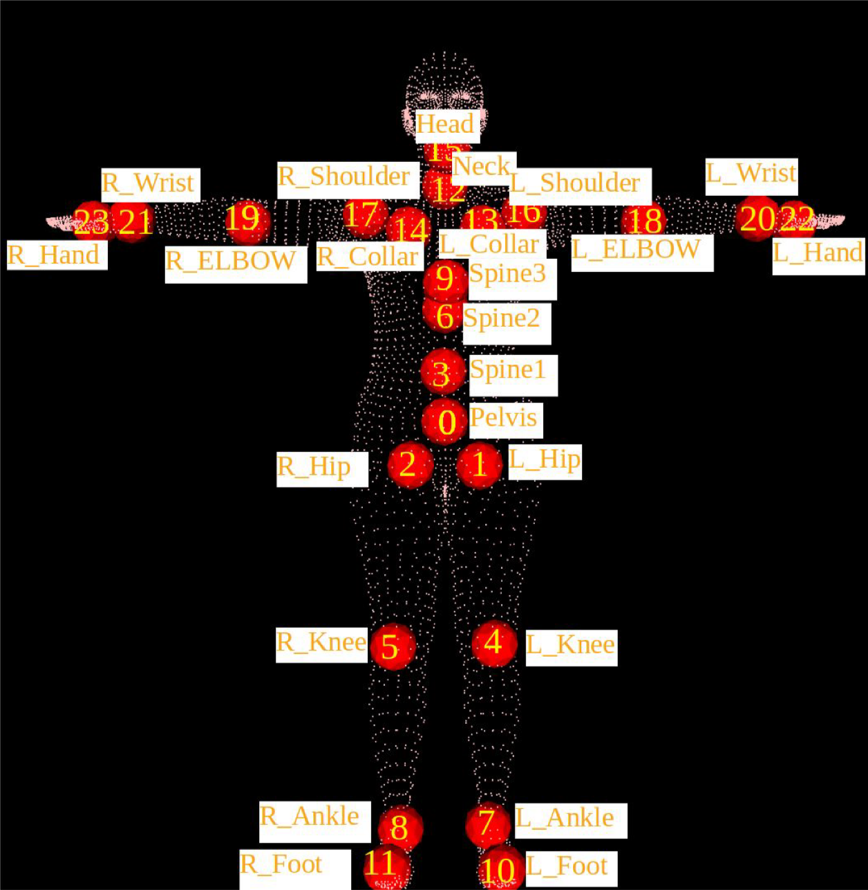

# 抽象骨骼

> 在2D和3D的人体姿态研究中，我们用**Key Points和Bones**来描述人的姿态。这一刻介绍几种常用的人体骨架定义

## 1. 什么是骨骼表示

### 1. 核心概念

- 关键点(Joint/keypoint):人体上的特定位置（肩膀、肘部、习概等）
- 骨骼(Bone):两个关键点之间的连线
- 骨架(Skeleton):所有关键点和骨骼的集合

### 2. 两种类型

| 类型     | 特点                 | 示例     |
| -------- | -------------------- | -------- |
| 树形结构 | 有明确的层级父子关系 | SMPL骨架 |
| 图结构   | 无层级，可以有环     | COCO骨架 |

---

## 2. COCO 17


### 1. COCO数据集定义的人体17个关键点（非树形结构）：


```
关键点名称及索引：
0:  nose (鼻子)
1:  left_eye (左眼)
2:  right_eye (右眼)
3:  left_ear (左耳)
4:  right_ear (右耳)
5:  left_shoulder (左肩)
6:  right_shoulder (右肩)
7:  left_elbow (左肘)
8:  right_elbow (右肘)
9:  left_wrist (左手腕)
10: right_wrist (右手腕)
11: left_hip (左髋)
12: right_hip (右髋)
13: left_knee (左膝)
14: right_knee (右膝)
15: left_ankle (左踝)
16: right_ankle (右踝)
```

### 2. 代码实现

```python
kp_names = [
    'nose',
    'left_eye',
    'right_eye',
    'left_ear',
    'right_ear',
    'left_shoulder',
    'right_shoulder',
    'left_elbow',
    'right_elbow',
    'left_wrist',
    'right_wrist',
    'left_hip',
    'right_hip',
    'left_knee',
    'right_knee',
    'left_ankle',
    'right_ankle'
]
# 索引→关键点名称
kp_idx2name = {
    i: kp_names[i] for i in range(len(kp_names))
}
# 关键点名称→索引
kp_name2idx = {
    kp_names[i]: i for i in range(len(kp_names))
}

bones_idx = [[15, 13], [13, 11], [16, 14], [14, 12], [11, 12], [5, 11], [6, 12], [5, 6], [5, 7], [6, 8], [7, 9], [8, 10], [1, 2], [0,1], [0,2], [1,3], [2,4], [3, 5], [4, 6]]
bones_names = [
    (kp_names[i], kp_names[j]) for i, j in bones_idx
]

# print what you need
print(kp_idx2name)
print(kp_name2idx)
print(bones_names)
print(bones_idx)
```

```plaintext
{0: 'nose', 1: 'left_eye', 2: 'right_eye', 3: 'left_ear', 4: 'right_ear', 5: 'left_shoulder', 6: 'right_shoulder', 7: 'left_elbow', 8: 'right_elbow', 9: 'left_wrist', 10: 'right_wrist', 11: 'left_hip', 12: 'right_hip', 13: 'left_knee', 14: 'right_knee', 15: 'left_ankle', 16: 'right_ankle'}
{'nose': 0, 'left_eye': 1, 'right_eye': 2, 'left_ear': 3, 'right_ear': 4, 'left_shoulder': 5, 'right_shoulder': 6, 'left_elbow': 7, 'right_elbow': 8, 'left_wrist': 9, 'right_wrist': 10, 'left_hip': 11, 'right_hip': 12, 'left_knee': 13, 'right_knee': 14, 'left_ankle': 15, 'right_ankle': 16}
[('left_ankle', 'left_knee'), ('left_knee', 'left_hip'), ('right_ankle', 'right_knee'), ('right_knee', 'right_hip'), ('left_hip', 'right_hip'), ('left_shoulder', 'left_hip'), ('right_shoulder', 'right_hip'), ('left_shoulder', 'right_shoulder'), ('left_shoulder', 'left_elbow'), ('right_shoulder', 'right_elbow'), ('left_elbow', 'left_wrist'), ('right_elbow', 'right_wrist'), ('left_eye', 'right_eye'), ('nose', 'left_eye'), ('nose', 'right_eye'), ('left_eye', 'left_ear'), ('right_eye', 'right_ear'), ('left_ear', 'left_shoulder'), ('right_ear', 'right_shoulder')]
[[15, 13], [13, 11], [16, 14], [14, 12], [11, 12], [5, 11], [6, 12], [5, 6], [5, 7], [6, 8], [7, 9], [8, 10], [1, 2], [0, 1], [0, 2], [1, 3], [2, 4], [3, 5], [4, 6]]
```

### 3. 特点

- 非树形结构：存在环（如髋部两点相连）
- 主要用于2D姿态估计
- 广泛使用：COCO, MPII等数据集

---

## 3. SMPL 24

### 1. SMPL 24个关键点（树形结构）：



| 索引 | 名称       | 说明           |
| ---- | ---------- | -------------- |
| 0    | Pelvis     | 骨盆（根节点） |
| 1    | L_Hip      | 左髋           |
| 2    | R_Hip      | 右髋           |
| 3    | Spine1     | 脊椎1          |
| 4    | L_Knee     | 左膝           |
| 5    | R_Knee     | 右膝           |
| 6    | Spine2     | 脊椎2          |
| 7    | L_Ankle    | 左踝           |
| 8    | R_Ankle    | 右踝           |
| 9    | Spine3     | 脊椎3          |
| 10   | L_Foot     | 左脚           |
| 11   | R_Foot     | 右脚           |
| 12   | Neck       | 颈部           |
| 13   | L_Collar   | 左锁骨         |
| 14   | R_Collar   | 右锁骨         |
| 15   | Head       | 头部           |
| 16   | L_Shoulder | 左肩           |
| 17   | R_Shoulder | 右肩           |
| 18   | L_Elbow    | 左肘           |
| 19   | R_Elbow    | 右肘           |
| 20   | L_Wrist    | 左手腕         |
| 21   | R_Wrist    | 右手腕         |
| 22   | L_Hand     | 左手           |

### 2. 代码构建

```python
joint_names = [
    'Pelvis', 
    'L_Hip', 
    'R_Hip', 
    'Spine1', 
    'L_Knee', 
    'R_Knee', 
    'Spine2', 
    'L_Ankle', 
    'R_Ankle', 
    'Spine3', 
    'L_Foot', 
    'R_Foot', 
    'Neck', 
    'L_Collar', 
    'R_Collar', 
    'Head', 
    'L_Shoulder', 
    'R_Shoulder', 
    'L_Elbow', 
    'R_Elbow', 
    'L_Wrist', 
    'R_Wrist', 
    'L_Hand', 
    'R_Hand'
]

joint_idx2name = {
    i: joint_names[i] for i in range(len(joint_names))
}
joint_name2idx = {
    joint_names[i]: i for i in range(len(joint_names))
}

bones = {
    [ 0,  1], [ 1,  4], [ 4,  7], [ 7, 10],           # left leg
    [ 0,  2], [ 2,  5], [ 5,  8], [ 8, 11],           # right leg
    [ 0,  3], [ 3,  6], [ 6,  9], [ 9, 12], [12, 15], # spine & head
    [12, 13], [13, 16], [16, 18], [18, 20], [20, 22], # left arm
    [12, 14], [14, 17], [17, 19], [19, 21], [21, 23], # right arm
}

# 运动链 
chains = [
    [0, 1, 4, 7, 10],         # 左腿：骨盆→髋→膝→踝→脚
    [0, 2, 5, 8, 11],         # 右腿
    [0, 3, 6, 9, 12, 15],    # 脊椎到头
    [12, 13, 16, 18, 20, 22], # 左手臂
    [12, 14, 17, 19, 21, 23], # 右手臂
]

# 层级关系(父节点索引)
parent = [
    -1,  # 0: Pelvis (根节点，无父节点)
    0,  # 1: L_Hip → Pelvis
    0,  # 2: R_Hip → Pelvis
    0,  # 3: Spine1 → Pelvis
    1,  # 4: L_Knee → L_Hip
    2,  # 5: R_Knee → R_Hip
    3,  # 6: Spine2 → Spine1
    4,  # 7: L_Ankle → L_Knee
    5,  # 8: R_Ankle → R_Knee
    6,  # 9: Spine3 → Spine2
    7,  # 10: L_Foot → L_Ankle
    8,  # 11: R_Foot → R_Ankle
    9,  # 12: Neck → Spine3
    12,  # 13: L_Collar → Neck
    12,  # 14: R_Collar → Neck
    12,  # 15: Head → Neck
    13,  # 16: L_Shoulder → L_Collar
    14,  # 17: R_Shoulder → R_Collar
    16,  # 18: L_Elbow → L_Shoulder
    17,  # 19: R_Elbow → R_Shoulder
    18,  # 20: L_Wrist → L_Elbow
    19,  # 21: R_Wrist → R_Elbow
    20,  # 22: L_Hand → L_Wrist
    21,  # 23: R_Hand → R_Wrist
]

# 可视化骨骼颜色

bone_colors = [
    [127, 0, 0],    # 红色 - 左腿
    [0, 127, 0],    # 绿色 - 右腿
    [0, 0, 127],    # 蓝色 - 脊椎
    [0, 127, 127],  # 青色 - 左手臂
    [127, 0, 127],  # 洋红 - 右手臂
]

# Print what you need.
print(joint_names)
print(joint_idx2name)
print(joint_name2idx)
print(chains)
print(bones)
print(parent)
print(bone_colors)
```

---

## 4. 骨骼的应用场景

| 场景       | 常用骨架  | 特点               |
| ---------- | --------- | ------------------ |
| 2D姿态估计 | COCO 17   | 简单，关节点少     |
| 3D姿态估计 | Human3.6M | 25个关节点         |
| 人体建模   | SMPL 24   | 有拓扑结构，可蒙皮 |
| 手部动作   | MANO      | 丰富的手部关节点   |
| 全身动作   | SMPL-X    | 包含手和脸         |

--- 

## 5. 关键概念：正向运动学(FK)

给定关节角度，计算末端位置：

```
父节点旋转 → 子节点旋转 → ... → 末端位置
```

这就是SMPL等参数化模型的核心原理

## 6. ez4d中的抽象骨骼

项目使用ez4d库的抽象骨骼

```python
from ez4d.kinematics.abstract_skeletons import Skeleton_SMPL24

# 创建骨架
skeleton = Skeleton_SMPL24()
print(skeleton.joint_names) # 输出关节点名称
print(skeleton.parent)
```

