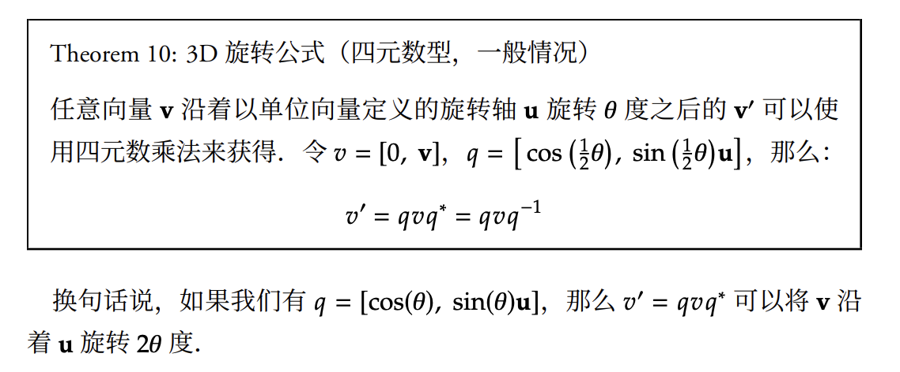

# Rotation Representation

> 旋转是人体动作(和姿态)表示中非常重要的基础。这一部分将简短介绍旋转表示和一些相关的概念

### 1. 什么是旋转

在3D空间中，描述一个物体如何旋转有不同的方法。每种方法都有其优缺点，在不同场景下使用

### 2. 欧拉角(Euler Angles)

**定义**

欧拉角用是三个**旋转角度**来描述旋转，通常按照一定顺序(如X-Y-Z)依次旋转

```python
# 绕X轴旋转30度，绕Y轴旋转45度，绕Z轴旋转60度
rotation = [30°, 45°, 60°]  # 单位是角度
```

**特点**

- 优点：直观，易于理解
- 缺点：存在万向节(Gimbal lock)锁问题：不连接
  - 万向节锁问题：使用欧拉角表示三维旋转时的固有数学缺陷：当中间轴（如俯仰 Pitch）转到 ±90° 时，会导致两个旋转轴重合，系统丢失一个旋转自由度，无法描述某些姿态或产生剧烈抖动

### 3. 轴角(Axis-Angle)

**定义**

用一个3D向量表示旋转

- 向量的方向 = 旋转轴
- 向量的长度 = 旋转角度(弧度)

**数学表达**


$$
\vec{r} = [x, y, z]
$$

- 旋转轴：$\frac{\vec{r}}{||\vec{r}||}$
- 旋转角度：$||\vec{r}||$（弧度）

**示例**

```python
  # 绕Z轴旋转90度（π/2弧度）
  axis_angle = [0, 0, np.pi/2]
```

### 4. 旋转矩阵(Rotation Matrix)


**定义**

 一个 $3 \times 3$ 的正交矩阵，满足 $R^T R = I$，且 $\det(R) = 1$

**示例**

$$
R_z(90°) = \begin{bmatrix}
0 & -1 & 0
1 & 0 & 0
0 & 0 & 1
\end{bmatrix}
$$

**特点**

- 优点：计算简单（矩阵乘法）
- 缺点：9个参数表示3个自由度，有冗余

### 5. 6D向量(6D Vector)

**为什么要6D向量**

旋转矩阵有9个参数，但是只有3个自由度，存在冗余。直接用9个数训练神经网络会有问题

**解决方法**

只保留旋转矩阵的前两列(6个数)，通过`Gram-Schmidt`正交化恢复完整的旋转矩阵

**优点**

- 避免使用三角函数（连续可导）
- 避免欧拉角的万向节锁问题
- 比4元数更直接用于神经网络


**参考论文**：[On the Continuity of Rotation Representations in Neural Networks](http://arxiv.org/abs/1812.07035)


### 6. 四元数(Quaternion)

**定义**

一个4D向量 $q = [w, x, y, z]$， 满足 $||q|| = 1$

**优点**

- 紧凑(4个数)
- 计算高效：避免使用三角函数
- 避免万向节锁
- 易于插值

**在人体动作中的应用**

SMPL等人体模型内部使用四元数存储关节旋转

**四元数与旋转的关系**



---

## 转换关系

### Envronmental Preperations

```python
# 我们会经常使用的包
import ez4d.geometry.rotation as ezrot
import torch
import numpy as np
from smplx import SMPL

# 有些内容你无需关注，它们只是用于推进教程的。
from lib.path_manager import PathManager
from ez4d.vis.wis3d import HWis3D as Wis3D
from ez4d.kinematics.abstract_skeletons import Skeleton_SMPL24

pm = PathManager() # 创建路径管理器
```


### 项目中的转化函数

> 主要来自ez4d库

### 在人体动作研究中的选择

| 场景         | 推荐表示         |
| ------------ | ---------------- |
| 神经网络训练 | 6D向量 或 四元数 |
| 存储/传输    | 四元数           |
| 可视化/调试  | 轴角 或 欧拉角   |
| SMPL模型内部 | 四元数           |

> 在本章中，我们将可视化通过数字人的朝向控制器进行旋转的效果。你可以忽略与SMPL模型相关的内容，我们会在SMPL 基础中对其进行介绍。

**加载预训练的模型**

```python
body_model = SMPL(
    model_path = pm.inputs / 'body_models' / 'smpl', 
    gender = 'neutral'
)
```

**创建一个旋转**

```python
# 创建一个旋转：绕z轴旋转90度
axis_angle = torch.tensor([[0, 0, np.pi/2]])
```

**转化函数**

如果我们已经有一种特定的旋转表达形式,我们想将其转化为其他表达形式。我们可以使用`pytorch3d`包。下面是将其他常见形式转化为轴角的例子

```python
def to_axis_angle(
    rotation: torch.Tensor,  # 输入的旋转数据:张量
    rot_format: str, # 输入旋转的格式：字符串
): 
    """Utis to transform the rotation representation"""

    # 1. 将输入的旋转表达式转换为轴角式
    # reshape函数三个参数的含义
    # -1：自动计算该维度的大小(保持元素总数不变)
    # 1: 第2维固定为1
    # 3：第3维固定为3
    if rot_format == "euler_angle":
        res = ezrot.euler_angles_to_matrix(rotation, "XYZ").reshape(-1,1,3)
    elif rot_format == "axis_angle":
        res = rotation.reshape(-1,1,3)
    elif rot_format == "rotation_matrix":
        res = ezrot.matrix_to_axis_angle(rotation).reshape(-1,1,3)
    elif rot_format == "rotation_6d":
        rotation = ezrot.rotation_6d_to_matrix(rotation)
        res = ezrot.matrix_to_axis_angle(rotation).reshape(-1, 1, 3)
    elif rot_format == "quaternion":
        res = ezrot.quaternion_to_matrix(rotation).reshape(-1, 1, 3)
    else:
        raise NotImplementedError(f"Unknown rotation format: {rot_format}")

    return res
```

