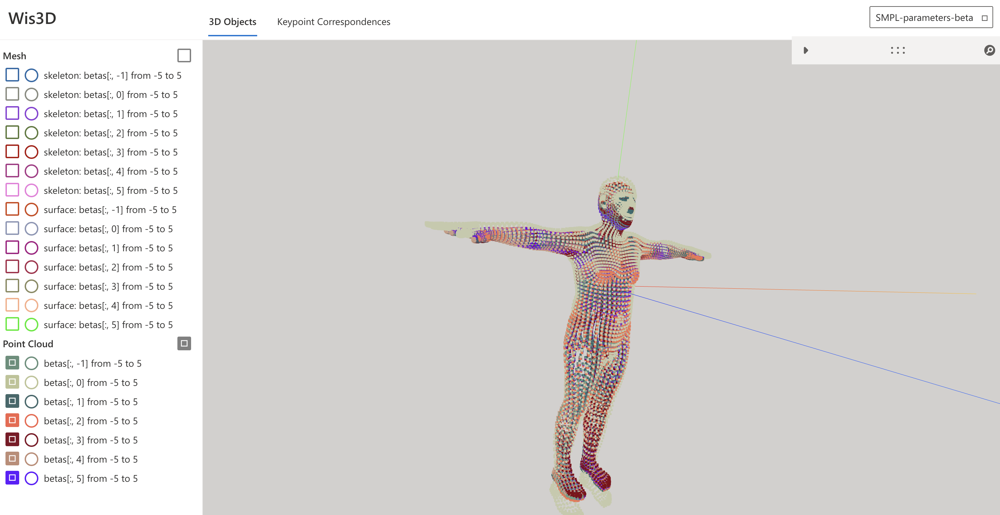
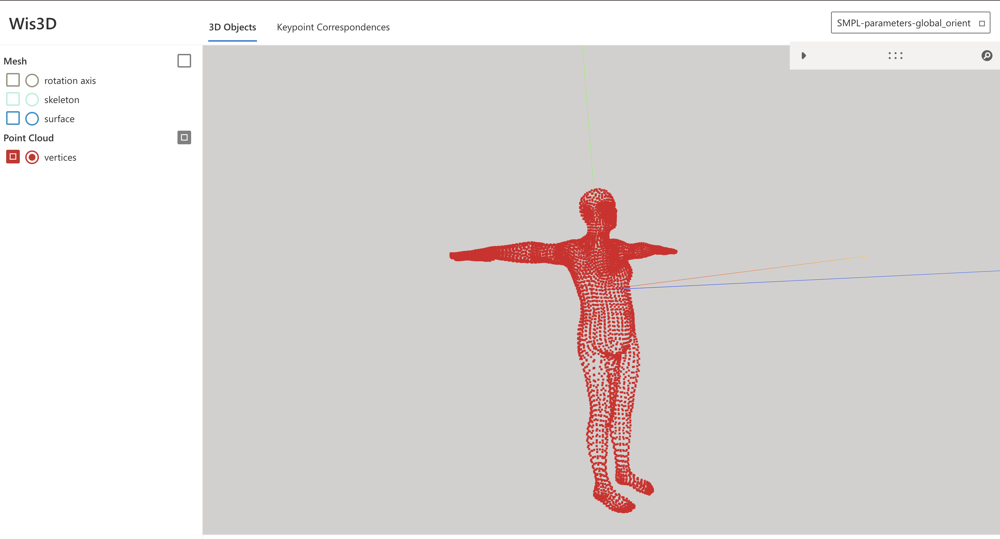

--- 
title: SMPL Basic
categories: 
    - 科研训练
    - 机器人与大模型
    - 运动数据采集
    - SMPL基础
tags:
    - SMPL
cover: https://i-blog.csdnimg.cn/blog_migrate/99a2911a3d66485b0775db5931a7505e.png
--- 

# SMPL 基础

> SMPL是一个经典的人体形状和姿态参数化的模型。这一部分将介绍SMPL模型的基本使用方法和核心参数

## 1. 什么是SMPL

SMPL(Skinned Multi-Person Linear Mode)是用于人体形状和姿态估计的经典模型

### 1. 核心能力

- 输入：
  - 人体形状参数(betas)
  - 人体姿态参数(poses)
- 输出
  - 3D人体网格(6890个顶点)
  - 关节点位置(24个关节)


### 2. 模型文件

需要下载三种性别的模型权重

- 中性模型(`SMPL_NEUTRAL.pkl`):[下载地址](https://smplify.is.tue.mpg.de/download.php)
- 男性模型(`SMPL_MALE.pkl`):[下载地址](https://smpl.is.tue.mpg.de/download.php)
- 女性模型(`SMPL_FEMALE.pkl`):[下载地址](https://smpl.is.tue.mpg.de/download.php)

### 3. 目录结构

```plaintext
data_inputs/
└── body_models/
    └── smpl/
        ├── SMPL_FEMALE.pkl
        ├── SMPL_MALE.pkl
        └── SMPL_NEUTRAL.pkl
```

---

## 2. SMPL的四个核心参数

SMPL有四个主要输入参数

| 参数          | 维度    | 含义                   |
| ------------- | ------- | ---------------------- |
| betas         | (10,)   | 形状系数，控制高矮胖瘦 |
| global_orient | (3,)    | 根关节旋转，控制朝向   |
| body_pose     | (23, 3) | 23个关节的相对旋转     |
| transl        | (3,)    | 平移，控制位置         |


---

## 3. 参数详情

### 3.1 betas - 形状参数

```python
betas = torch.zeros(B, 10) # 10个形状系数
```

**作用**：控制人体的高矮胖瘦等体型特征

- `betas[0]`:整体高度/缩放
- `betas[1]`: 躯干与四肢比例
- `betas[2]`:  胖瘦
- ...

**效果**：每一个β系数的具体值从-5到+5变化时，你会看到人体形态明显的变化

Betas 控制着模型的形状。通常我们使用默认的 10 个形状系数。

这取决于你加载的模型。你之前可能见过下面这样的内容，这意味着你正在使用一个具有 10 个形状系数的模型。

> "WARNING: You are using a SMPL model, with only 10 shape coefficients." 

```python
def learn_betas(
    selected_component: int = 0, # 选择第几个体型系数
    lower_bound: int = -5,
    upper_bound: int = 5,
):
    def make_fake_data():
        fake_data = torch.zeros(B, 10)
        fake_data[:, selected_component] = torch.linspace(lower_bound, upper_bound, B) # 选取所有B个人体样本对应的第selected_component个维度
        # linspace函数用于均匀生成B维的从lower_bound到upper_bound均匀分布的张量
        # fake_data[:, 3] 所有行的第3列（红色部分）
        # [
        #  [0, 0, 0, 🔴0🔴, 0, 0, 0, 0, 0, 0],
        #  [0, 0, 0, 🔴0🔴, 0, 0, 0, 0, 0, 0],
        #  [0, 0, 0, 🔴0🔴, 0, 0, 0, 0, 0, 0],
        #  [0, 0, 0, 🔴0🔴, 0, 0, 0, 0, 0, 0],
        #  [0, 0, 0, 🔴0🔴, 0, 0, 0, 0, 0, 0]
        # ]
        return fake_data
    fake_datas = make_fake_data()

    # 推理
    smpl_out = body_model(
        betas = fake_datas,
        global_orient = torch.zero(B, 1, 3),
        body_pose = torch.zero(B, 23, 3)
        transl = torch.zero(B, 3)
    )

    # 检查输出
    joints : torch.Tensor = smpl_out.joints    # (B, 45, 3)
    verts  : torch.Tensor = smpl_out.vertices  # (B, 6890, 3)
    faces  : np.ndarray   = body_model.faces   # (13776, 3)
```

**调用leaen_betas函数**

```python
learn_betas(0) # selected_component = 0
learn_betas(1) # selected_component = 1
learn_betas(2) # selected_component = 2
```



> 不同参数下的可视化效果


### 3.2 global_orient - 全局朝向

```python
global_orient = torch.zeros(B, 1, 3) # 轴角表示
```

**作用**：控制人体的整体朝向(根关节的整体旋转)

**表示方式**：轴角(Angle-Axis Representation)

- 向量方向 = 旋转轴
- 向量长度 = 旋转角度(弧度)

!!! warning
旋转轴起始于**根关节位置**，而非坐标原点
!!!

```python
def learn_orient():
    def make_fake_data():
        fake_orient = torch.zero(B, 1, 3)
        # linspace(start, end, steps, dtyp=None, device=None)
        # start:数列的起始值，旋转角度从0开始
        # end:数列的终止值,2*np.pi即旋转角度到2π弧度
        # steps:生成的数值个数(数列长度),50就是生成50个均匀间隔的数
        fake_orient[:50, :, 0] = torch.linspace(0, 2*np.pi, 50).reshape(50, 1) # 绕X轴旋转,并将一维的(50, )转化为二维的(50, 1)
        fake_orient[50: 100, :, 1] = torch.linspace(0, 2*np.pi, 50).reshape(50, 1) # 绕Y轴旋转
        fake_orient[100: 150, :, :] = torch.linspace(0, 2*np.pi, 50).reshape(50, 1, 1).repeat(1, 1, 3) # 绕X, Y ,Z轴旋转
        fake_orient[100:150, :, :] /= np.sqrt(3) # 保证范数是2π：绕三个轴同时序言转范数会变成sqrt(2*pi, 2*pi, 2*pi),这样旋转的角度最大值就会超过2π，为了保证一致性，我们将其除以根号3
        # 最后一个索引：0 → X轴；1 → Y轴；2 → Z轴

        return fake_orient
    fake_orient = make_fake_data()

    # 推理
    model_output = body_model(
        betas =  torch.zero(B, 10),
        global_orient = fake_orient,
        body_pose = torch.zeros(B, 23, 3),
        transl = torch.zeros(B, 3),
    )

    # Check output.
    joints : torch.Tensor = smpl_out.joints    # (B, 45, 3)
    verts  : torch.Tensor = smpl_out.vertices  # (B, 6890, 3)
    faces  : np.ndarray   = body_model.faces   # (13776, 3)

    def visualize_results():
        """ This part is to visualize the results. You are supposed to ignore this part. """
        orient_wis3d = Wis3D(
                pm.outputs / 'wis3d',
                'SMPL-parameters-global_orient',
            )

        # Prepare the rotation axis.
        axis_x   = torch.tensor([[0, 0, 0], [3, 0, 0]], dtype=torch.float32)
        axis_y   = torch.tensor([[0, 0, 0], [0, 3, 0]], dtype=torch.float32)
        axis_xyz = torch.tensor([[0, 0, 0], [1, 1, 1]], dtype=torch.float32)
        axis_all = torch.concat(
            [
                axis_x.reshape(1, 2, 3).repeat(50, 1, 1),
                axis_y.reshape(1, 2, 3).repeat(50, 1, 1),
                axis_xyz.reshape(1, 2, 3).repeat(50, 1, 1),
            ], dim = 0)
        axis_all[:, :, :] += joints[:, [0], :] # move the axis to the root joints


        orient_wis3d.add_vec_seq(
            vecs = axis_all,
            name = 'rotation axis',
        )
        orient_wis3d.add_motion_verts(
            verts  = verts,
            name   = f'vertices',
            offset = 0,
        )
        orient_wis3d.add_motion_mesh(
            verts  = verts,
            faces  = faces,
            name   = f'surface',
            offset = 0,
        )
        orient_wis3d.add_motion_skel(
            joints = joints[:, :24],
            bones  = Skeleton_SMPL24.bones,
            colors = Skeleton_SMPL24.bone_colors,
            name   = f'skeleton',
            offset = 0,
        )
    visualize_rotation()
```

**效果**



### 3.3 body_pose - 身体姿态

```python
body_pose = torch.zeros(B, 23, 3) # 23个关节的轴角
```

**作用**：控制23个关节的的相对旋转

**重要概念**：运动链(Kinematic Chain)

- 每个关节的旋转是**相对**于其父关节的
- SMPL通过 **正向运动学**计算最终关节位置

**维度注意**

- `(23, 3)`:轴角表示
- `(23, 6)`:6D旋转表示
- `(24, 3, 3)`:旋转矩阵


你需要留意这些数字组合：(23, 3)、(23, 6)、(23, 3, 3)、(69,)、(24, 3)、(24, 6)、(24, 3, 3)、(72,)。具有这些形状的张量或数组通常与身体姿态相关。

此外，姿态是以**运动链**的方式来表示的，body_pose提供了**每个关节相对于其父关节的相对旋转**，而 SMPL 模型会通过求解正向运动学问题来得到每个关节的最终位置，即最终姿态。

有时我们会将global_orient（全局朝向）和body_pose组合在一起，形成一个包含 24 个 “关节” 的pose（姿态），而global_orient通常是这个pose中的第一个元素。

虽然在 SMPL 中，关节旋转是以轴角形式表示的，但人们更倾向于使用从 3×3 旋转矩阵中提取的6D 旋转表示来进行网络训练。我们会在另一个笔记本中深入探讨这个问题。


```python
def lean_body_pose(eg_path):
    def load_eg_params(eg_path):
        eg_params = np.load(eg_path, allow_pickle=True).item()
        # item()方法将加载的文件中的字典数据转换成Python原生字典，方便直接通过键名取值（只有npy格式的文件才需要做转化，npz格式不需要）
        eg_body_pose_aa = torch.from_numpy(eg_params["body_pose_aa"])
        # 从numpy数组转换成张量，获取的三维数据为[彼批次大小，SMPL 模型的 23 个身体关节（不含根关节）， 每个关节的轴角参数(X/Y/Z轴的旋转信息)]

        body_pose_aa = body_pose_aa.reshape(1, 23, 3)
        return torch.from_numpy(eg_body_pose_aa).float()

    def make_fake_data():
        """
        基于一个参考的身体姿势(tgt_body_pose)生成B个从全0姿态到参考姿态平滑过渡的身体姿态样本
        """
        tgt_body_pose = load_eg_params(eg_path) # 加载参考姿态参数
        grad_weight = torch.linspace(0, 1, B).reshape(B, 1, 1) # 生成权重系数：从0到1均匀分布，形状调整为(B, 1, 1)
        fake_body_pose = tgt_body_pose * grad_weight
        return fake_body_pose
    
    fake_body_pose = make_fake_body_pose()

    # 推理
    smpl_out = body_model(
        betas         = torch.zeros(B, 10),    # shape coefficients
        global_orient = torch.zeros(B, 1, 3),  # axis-angle representation
        body_pose     = fake_body_pose,        # axis-angle representation
        transl        = torch.zeros(B, 3),
    )
    # Check output.
    joints : torch.Tensor = smpl_out.joints    # (B, 45, 3)
    verts  : torch.Tensor = smpl_out.vertices  # (B, 6890, 3)
    faces  : np.ndarray   = body_model.faces   # (13776, 3)

    def visualize_results():
        """ This part is to visualize the results. You are supposed to ignore this part. """
        orient_wis3d = Wis3D(
                pm.outputs / 'wis3d',
                'SMPL-parameters-body_pose',
            )

        orient_wis3d.add_motion_verts(
            verts  = verts,
            name   = f'vertices',
            offset = 0,
        )
        orient_wis3d.add_motion_mesh(
            verts  = verts,
            faces  = faces,
            name   = f'surface',
            offset = 0,
        )
        orient_wis3d.add_motion_skel(
            joints = joints[:, :24],
            bones  = Skeleton_SMPL24.bones,
            colors = Skeleton_SMPL24.bone_colors,
            name   = f'skeleton',
            offset = 0,
        )
    visualize_results()

    learn_body_pose(pm.inputs / 'examples/SMPL_ballerina.npy')
```

### 3.4 transl —— 平移

```python
transl = torch.zeros(B, 3) # 3D平移向量
```

**作用**：控制人在3D空间中的位置

**注意**：定义在静态坐标系中，与人体朝向无关

--- 

## 4. 相关代码

```python
# 环境准备
import sys # 主要用于与Python解释器本身交互
import os  # 与操作系统交互，用于处理文件、目录、进程、环境变量等系统级别操作

# 将项目根目录加入系统路径
# 将项目根目录添加到目录，以便导入lib模块
project_root = os.path.abspath(os.getcwd() + '/..')
if project not in sys.path: # sys_path是Python搜索模块的路径列表
    sys.path.insert(0, project_root)

# 导入常用的包
import torch # 深度学习框架
import numpy as np # 数值计算
import smplx as SMPL # SMPL模型库

# Things you don't need to care about.
from lib.path_manager import PathManager
from ez4d.vis.wis3d import HWis3D as Wis3D
from ez4d.kinematics.abstract_skeletons import Skeleton_SMPL24

# 导入项目内部的工具类
# PathManager: 管理路径
# Wis3D: 3D 可视化工具
# Skeleton_SMPL24: SMPL 的 24 关节点骨架定义

pm = PathManager() # 创建路径管理器，用于管理数据路径

# 尝试使用 pm，如果不存在则使用备用路径
try:
    smpl_dir = pm.inputs / 'body_models' / 'smpl'
except NameError:
    import os
    smpl_dir = os.path.abspath('../data_inputs/body_models/smpl')

body_models = {} # 字典，存储三种性别的模型
genders = ['neutral', 'man', 'woman'] # 需要加载的性别列表

# {}定义字典：用于存储无序的键值对映射，这里我们用于存储性别-模型映射
# []定义列表：存储有序的单一值序列，适合存放同类数据，通过数字索引访问

for gender in genders: # 遍历三种性别
    npm_path = str(smpl_dir) + f'/SMPL_{gender.upper()}.npz' # 构建npz文件路径
    data = np.load(npz_path, allow_pickle=True)
    # np.load() 加载npz文件
    # allow_pickle = True：允许加载Python对象
    data_struct = Srtuct() # 创建空的Struct对象
    for key in data.files(): # npz文件是由若干个key:array构成的
        setattr(data_struct, key, data[key]) # 将npz文件中的每个数组设置为Struct的属性
    body_models[gender] = SMPL( # 创建模型实例
        model_path = smpl_dir, 
        data_struct = data_struct, 
        gender = gender
    )

# 准备推理参数
B = 150 # 每次并行处理的样本数量为150
body_model : SMPL = body_models['neutral'] # 使用中性模型
mesh_temp : np.ndarray = body_model.faces # faces这个属性用于将模型中的顶点构成一个三维网格。本质上是一个顶点的索引组合，每一组三个索引对应一个三角形面片
# print(f'{mesh_temp.shape[0]} faces in the mesh template')
# 13776 faces in the mesh template
# print(f'\nprint 10 lines of the mesh template')
# for i in range(10):
#     print(f'the {i + 1}th line is {mesh_temp[i]}')
# print 10 lines of the mesh template
# the 1th line is [1 2 0]
# the 2th line is [0 2 3]
# the 3th line is [2 1 4]
# the 4th line is [4 1 5]
# the 5th line is [2 6 3]
# the 6th line is [3 6 7]
# the 7th line is [ 9 10  8]
# the 8th line is [ 8 10 11]
# the 9th line is [13 14 12]
# the 10th line is [12 14 15]

# 执行SMPL推理
smpl_out = (
    betas = torch.zeros(B, 10), #体型参数
    global_orient = torch.zeros(B, 1, 3) # 全局朝向
    pose_body = torch.zeros(B, 23, 3) # 身体姿态
    transel = torch.zeros(B, 3) # 平移
    # 参数3表示该模型的每一个旋转动作或者位置变化均为3D空间的
)

# 检查输出

joints : torch.Tensor = smpl_out.joints # 45个关节点位置(24个身体 + 21个手部/面部)
verts : torch.Tensor = smpl_out.vertices

# 骨架定义
chains = [
    [ 0,  1,  4,  7, 10    ],  # 左腿
    [ 0,  2,  5,  8, 11    ],  # 右腿
    [ 0,  3,  6,  9, 12, 15],  # 脊柱和头
    [ 9, 13, 16, 18, 20, 22],  # 左臂
    [ 9, 14, 17, 19, 21, 23],  # 右臂
]

bones = [
    [ 0,  1], [ 1,  4], [ 4,  7], [ 7, 10],            # left leg
    [ 0,  2], [ 2,  5], [ 5,  8], [ 8, 11],            # right leg
    [ 0,  3], [ 3,  6], [ 6,  9], [ 9, 12], [12, 15],  # spine & head
    [ 9, 13], [13, 16], [16, 18], [18, 20], [20, 22],  # left arm
    [ 9, 14], [14, 17], [17, 19], [19, 21], [21, 23],  # right arm
]
```

