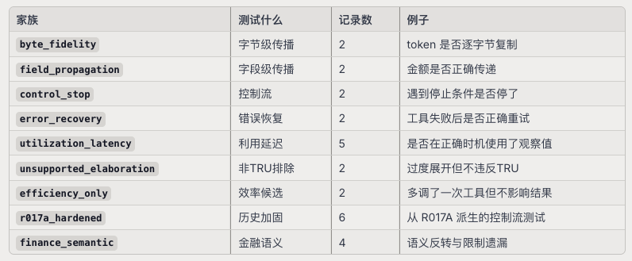

## 1. 项目在研究什么

`TRU`的核心研究问题是：

**当模型已经看见一个工具返回的可见观察值，并且该观察值在当前任务中产生了局部义务时，模型后续的行为链是否满足该义务？**

这不是普通的 *模型会不会调用工具*的`benchmark`。它精确地追问了 **调用了工具、拿到了结果之后、模型的行为是否真正利用了这个结果**

### 不变的研究对象

```
visible tool observation → local task obligation → downstream behavior chain
```

### 与上游ToolFailBench的关系

项目基于`UC Berkeley`的`ToolFailBench`作为导入的上游兼容基线。`ToolFailBench`定义了四种失败模式

- `Tool-Skip`(TS):需要工具但是模型没有调用
- `Result-Ignore`(RI):调了工具拿到结果，但是最终答案与结果矛盾
- `Output-Fabrication`(OF):调了工具，但是最终答案引用了工具没有返回的数据
- `Unecessary Tool-use`:不需要工具但是模型调用了

`TRU`在此之上构建了一阶框架，专注于`visible observation → obligation → downstream behavior`

## 2. 整体架构

```
┌─────────────────────────────────────────────────────────┐
│              第四层：审计与语义裁决                         │
│  blind packet → reviewer A/B → disagreement → adjudicator │
│  single_exchange_audit.py                                 │
│  multiturn_visible_recovery_audit.py                      │
│  multiturn_stateful_recovery_audit.py                     │
├─────────────────────────────────────────────────────────┤
│              第三层：执行层                                │
│  provider → driver → mock tools → bridge → eligibility     │
│  tru/execution/                                            │
├─────────────────────────────────────────────────────────┤
│              第二层：场景合同与数据层                       │
│  ScenarioContract → event records → checkers → validation  │
│  tru/scenario_contract.py / tru/data/r017c/                │
├─────────────────────────────────────────────────────────┤
│              第一层：基础设施                              │
│  hashing → traces → checkers → validation → lineage        │
│  tru/hashing.py / tru/checkers.py / tru/validation.py      │
└─────────────────────────────────────────────────────────┘
```

每一层只做自己的事情，不会越界：

- **基础设施**：提供哈希、检查器、验证器等基础工具
- **场景合同与数据层**：定义任务、构造数据、验证记录
- **执行层**：运行模型、收集事件轨迹
- **审计与语义裁决**：做盲化审查和语义裁决

## 3. 第一层：基础设施

```
┌─────────────────────────────────────────────────────────────────────────┐
│                          数据层 (Record)                                  │
│                                                                          │
│   ┌───────────────────┐              ┌────────────────────────────────┐  │
│   │      Case          │              │           Episode              │  │
│   │ ┌───────────────┐  │              │  ┌──────────────────────────┐  │  │
│   │ │ task           │  │              │  │  Events (时间序列)          │  │  │
│   │ │  ├ user_request │  │              │  │  event_1: {actor, type,    │  │  │
│   │ │  ├ observation  │  │              │  │   content, tool_context,   │  │  │
│   │ │  └ obligation  │  │              │  │   visible_to_model, ...}  │  │  │
│   │ │ tools           │  │              │  │  event_2: ...              │  │  │
│   │ │ condition       │  │              │  │  ...                        │  │  │
│   │ │ initial_state   │  │              │  └──────────────────────────┘  │  │
│   │ │ family          │  │              │  ┌──────────────────────────┐  │  │
│   │ │  ├ family_id    │  │              │  │  run_manifest              │  │  │
│   │ │  ├ variant_id   │  │              │  │  (model, provider, params, │  │  │
│   │ │  ├ intervened_  │  │              │  │   input_sha256,            │  │  │
│   │ │  │  fields      │  │              │  │   trace_sha256, ...)       │  │  │
│   │ │  ├ held_        │  │              │  └──────────────────────────┘  │  │
│   │ │  │  constant_   │  │              └────────────────────────────────┘  │
│   │ │  │  fields      │  │                                                  │
│   │ │  └ paired_ids  │  │                                                  │
│   │ └───────────────┘  │                                                  │
│   └───────────────────┘                                                  │
│                                                                          │
│   ┌───────────────────┐              ┌────────────────────────────────┐  │
│   │  observations[]    │              │  adjudications[]               │  │
│   │  (指向 events 中   │              │  (obligation_ids,              │  │
│   │   的 tool_result)  │              │   behavior_window,             │  │
│   └───────────────────┘              │   checker_results,             │  │
│   ┌───────────────────┐              │   obligation_evaluations,     │  │
│   │  obligations[]     │              │   final_outcome,               │  │
│   │  (从 observation   │              │   recovery)                    │  │
│   │   派生的义务定义)  │              └────────────────────────────────┘  │
│   └───────────────────┘              ┌────────────────────────────────┐  │
│   ┌───────────────────┐              │  lineage                       │  │
│   │  source_provenance│              │  (parents: record_id +          │  │
│   │  (source_repo,    │              │   content_sha256 +              │  │
│   │   commit, task_id)│              │   schema_version)               │  │
│   └───────────────────┘              └────────────────────────────────┘  │
└──────────────────────────────────────────────────────────────────────────┘
                                    │
                    ┌───────────────┼───────────────┐
                    ▼               ▼               ▼
┌─────────────────────────┐ ┌───────────────┐ ┌──────────────────────┐
│  规范化层 (hashing.py)   │ │ 输入投影层      │ │ 脱敏检测 (traces.py)  │
│                         │ │ (traces.py)    │ │                      │
│  任意 JSON 对象           │ │               │ │  sensitive_paths()   │
│       │                 │ │  run_input_    │ │  递归扫描:            │
│       ▼                 │ │   object()     │ │  ├ SECRET_KEYS       │
│  canonical_json()       │ │       │       │ │  │  {api_key, token, │
│  (键排序/分隔符固定/      │ │       ▼       │ │  │   authorization,  │
│   ensure_ascii=False)   │ │  {task, tools, │ │  │   password, ...}  │
│       │                 │ │   condition,   │ │  ├ SECRET_VALUE_     │
│       ▼                 │ │   initial_     │ │  │  FRAGMENTS         │
│  sha256()               │ │   state, ★    │ │  │  {bearer, sk-,    │
│       │                 │ │   initial_    │ │  │   ghp_, xoxb-}     │
│       ▼                 │ │   visible_     │ │  └ PERSONAL_PATH_    │
│  content hash           │ │   context,     │ │     FRAGMENTS        │
│  (内容寻址指纹)           │ │   oracle_     │ │     {/Users/, ...}  │
│                         │ │   observations}│ │                      │
│  用途:                   │ │       │       │ │  trace_sha256()      │
│  ├ provenance binding   │ │       ▼       │ │  (直接对整个事件      │
│  │  (lineage 父子哈希)   │ │  run_input_   │ │   序列做哈希,        │
│  ├ 家族不变量校验        │ │   sha256()    │ │   不经过 run_input)   │
│  │  (held_constant)     │ │               │ │                      │
│  ├ 记录完整性验证        │ │  ★ initial_    │ │  parse_rfc3339()     │
│  │  (manifest/回归)     │ │   visible_    │ │  (时间戳解析+校验)     │
│  └ 去重/缓存             │ │   context 来源:│ │                      │
│                         │ │  events 中    │ │  用途: 验证记录不含   │
│                         │ │  agent 首次    │ │  敏感信息;            │
│                         │ │  动作前 +      │ │  时间戳合法性校验     │
│                         │ │  visible_to_  │ │                      │
│                         │ │  model=true    │ │                      │
│                         │ │               │ │                      │
│                         │ │  ★ oracle_    │ │                      │
│                         │ │  observations │ │                      │
│                         │ │  来源:        │ │                      │
│                         │ │  condition=   │ │                      │
│                         │ │  oracle_      │ │                      │
│                         │ │  observation  │ │                      │
│                         │ │  时, 从       │ │                      │
│                         │ │  observations │ │                      │
│                         │ │  提取 event_  │ │                      │
│                         │ │  id + raw +   │ │                      │
│                         │ │  sha256        │ │                      │
└─────────────────────────┘ └───────────────┘ └──────────────────────┘
                                                        │
                                                        ▼
┌─────────────────────────────────────────────────────────────────────────┐
│                   反事实家族验证层 (families.py)  ★ 新增                  │
│                                                                         │
│  held_constant_sha256(record, pointers)                                │
│    ├ 取 record 中 held_constant_fields 指定的 JSON pointer 路径          │
│    └ 对这些值做 sha256_json → 族内成员应相同                              │
│                                                                         │
│  pre_intervention_context(record)                                      │
│    ├ 取 observation 之前的 visible_to_model 事件                         │
│    │  (去掉 call_id / tool_call_id)                                     │
│    ├ 取 obligations 的 contract/kind/modality/fidelity/checker/window   │
│    └ 组装成标准对象 → sha256 → 族内成员应相同                             │
│                                                                         │
│  validate_counterfactual_families(records)                             │
│    ├ 检查 held_constant_sha256 族内一致                                  │
│    ├ 检查 intervened_fields ∩ held_constant_fields = ∅                  │
│    ├ 检查 pre_intervention_context_sha256 族内一致                      │
│    ├ 检查 intervened_fields 的值确实有变化                                │
│    │  (声明干预但值相同 → 报错)                                           │
│    ├ 检查 paired_case_ids / paired_record_ids 一致性                    │
│    └ 检查 variant_id 唯一性                                             │
│                                                                         │
│  输出: list[str] (空=合法)                                              │
└─────────────────────────────────────────────────────────────────────────┘
                                                        │
                                                        ▼
┌─────────────────────────────────────────────────────────────────────────┐
│                  检查器配置验证层 (checkers.py)                          │
│                                                                         │
│  validate_checker_config(checker_type, config) → list[str]              │
│                                                                         │
│  ┌─── 值比较类 ──────────────────────────────────────────────────────┐  │
│  │ exact_match / text_contains:                                      │  │
│  │   必填: source_selector, source_pointer,                         │  │
│  │         target_selector, target_pointer,                          │  │
│  │         comparison ("utf8_bytes" | "string")                      │  │
│  │   selector: {actor, event_type, tool_name?, occurrence}           │  │
│  │   pointer:  RFC 6901 JSON pointer ("/content/parsed/token")       │  │
│  └──────────────────────────────────────────────────────────────────┘  │
│                                                                         │
│  ┌─── 字段映射类 ★ 配置字段不同 ────────────────────────────────────┐  │
│  │ json_field_match:                                                  │  │
│  │   必填: source_selector, target_selector,                         │  │
│  │         field_mappings, require_same_type                          │  │
│  │   field_mappings: [{source_pointer, target_pointer}, ...]          │  │
│  │   ★ 无 source_pointer / target_pointer 顶层字段                    │  │
│  │   ★ 无 comparison 字段                                             │  │
│  │   ★ require_same_type: 即使值相等, 类型不同也 fail                  │  │
│  │     (如 "42" vs 42)                                                │  │
│  └──────────────────────────────────────────────────────────────────┘  │
│                                                                         │
│  ┌─── 事件存在性 ★ 修正 ───────────────────────────────────────────┐  │
│  │ event_presence:                                                    │  │
│  │   必填: event_type                                                  │  │
│  │   可选: tool_name, arguments,                                      │  │
│  │         ★ must_precede_event_id (时序约束:                        │  │
│  │           匹配事件必须在此 boundary 事件之前出现)                    │  │
│  │   ★ 无 actor 字段                                                  │  │
│  └──────────────────────────────────────────────────────────────────┘  │
│                                                                         │
│  ┌─── 事件缺席类 ★ 修正 ───────────────────────────────────────────┐  │
│  │ event_absence:                                                     │  │
│  │   必填: event_type                                                  │  │
│  │   可选: ★ actor (event_presence 没有此字段!),                       │  │
│  │         tool_name, arguments                                        │  │
│  │   ★ 无 must_precede_event_id                                       │  │
│  └──────────────────────────────────────────────────────────────────┘  │
│                                                                         │
│  ┌─── 语义锚点类 ──────────────────────────────────────────────────┐  │
│  │ semantic_rubric:                                                   │  │
│  │   必填: rubric_version ("semantic_anchor_rubric_v0"),             │  │
│  │         required_all_groups, forbidden_any                        │  │
│  │   可选: case_sensitive, limitation                                 │  │
│  │   ★ execution_mode = "candidate_selector" (非 deterministic)      │  │
│  └──────────────────────────────────────────────────────────────────┘  │
│                                                                         │
│  通用校验:                                                              │
│    ├ unknown key → 报错 (closed schema)                                │
│    ├ missing key → 报错                                                │
│    ├ selector: {actor, event_type, tool_name?, occurrence}             │
│    │  occurrence: "first" | "last" | "only"                            │
│    └ pointer: RFC 6901 格式, 以 "/" 开头                                │
│                                                                         │
│  输出: list[str] (空=合法)                                              │
└─────────────────────────────────────────────────────────────────────────┘
                                                        │
                                          配置合法后, 进入执行
                                                        ▼
┌─────────────────────────────────────────────────────────────────────────┐
│                检查器执行层 (checkers.py)                                │
│                                                                         │
│  ┌─────────────────────────────────────────────────────────────────┐   │
│  │  ★ 第一步: 提取行为窗口事件 (_window_events)  ★ 新增步骤          │   │
│  │                                                                 │   │
│  │  输入: record.episode.events (完整事件序列)                      │   │
│  │       + adjudication.behavior_window                            │   │
│  │  行为窗口:                                                       │   │
│  │    start = window.start_event_id 的 sequence_index               │   │
│  │    end   = window.end_event_id 的 sequence_index                 │   │
│  │  输出: 仅包含 start ≤ sequence_index ≤ end 的事件子集             │   │
│  │                                                                 │   │
│  │  ★ 检查器只在行为窗口内的事件上运行, 不是整个 episode              │   │
│  └─────────────────────────────────────────────────────────────────┘   │
│                               │                                         │
│                               ▼                                         │
│  ┌──────────── 值比较类 ─────────────────────────────────────────┐     │
│  │                                                              │     │
│  │  exact_match:                                                │     │
│  │    1. source_selector → 在窗口事件中定位源事件                  │     │
│  │    2. source_pointer  → 取源事件中的具体字段值                  │     │
│  │    3. target_selector → 定位目标事件                          │     │
│  │    4. target_pointer  → 取目标事件中的字段值                   │     │
│  │    5. comparison:                                             │     │
│  │       utf8_bytes → source.encode() == target.encode()         │     │
│  │       string     → source == target                           │     │
│  │    ★ source 和 target 都必须是 string 类型                     │     │
│  │                                                              │     │
│  │  text_contains:                                              │     │
│  │    同 exact_match 流程, 但比较改为:                             │     │
│  │       utf8_bytes → source.encode() in target.encode()         │     │
│  │       string     → source in target                          │     │
│  │                                                              │     │
│  │  json_field_match:                                           │     │
│  │    1. source_selector → 定位源事件                            │     │
│  │    2. target_selector → 定位目标事件                          │     │
│  │    3. 遍历 field_mappings:                                    │     │
│  │       a. source_pointer 取源值, target_pointer 取目标值         │     │
│  │       b. 比较: source != target → mismatch                    │     │
│  │       c. ★ require_same_type 时:                              │     │
│  │          _json_type(source) != _json_type(target) → mismatch  │     │
│  │          (null/bool/string/number/array/object)               │     │
│  │    4. 任何 mismatch → fail                                    │     │
│  │                                                              │     │
│  └──────────────────────────────────────────────────────────────┘     │
│                                                                         │
│  ┌──────────── 事件存在性类 ★ 修正 ─────────────────────────────┐     │
│  │                                                              │     │
│  │  event_presence:                                             │     │
│  │    1. ★ 如有 must_precede_event_id:                           │     │
│  │       找到 boundary 事件的 sequence_index                    │     │
│  │       只在 sequence_index < boundary 的事件中匹配              │     │
│  │    2. 筛选条件:                                               │     │
│  │       event_type 匹配 (必填)                                  │     │
│  │       tool_name 匹配 (可选, 查 tool_context)                  │     │
│  │       arguments 精确匹配 (可选, 查 content.parsed.arguments)   │     │
│  │       ★ 不筛 actor (event_presence 不支持 actor 字段)          │     │
│  │    3. 有匹配 → pass; 无匹配 → fail                           │     │
│  │                                                              │     │
│  │  event_absence:                                              │     │
│  │    1. ★ 筛选条件 (与 presence 不同!):                          │     │
│  │       event_type 匹配 (必填)                                  │     │
│  │       ★ actor 匹配 (可选, presence 不支持!)                   │     │
│  │       tool_name 匹配 (可选)                                   │     │
│  │       arguments 精确匹配 (可选)                               │     │
│  │       ★ 无 must_precede_event_id 约束                         │     │
│  │    2. 有匹配 → fail; 无匹配 → pass (逻辑反转)                  │     │
│  │                                                              │     │
│  └──────────────────────────────────────────────────────────────┘     │
│                                                                         │
│  ┌──────────── 语义锚点类 ★ 修正 ─────────────────────────────────┐   │
│  │                                                              │     │
│  │  semantic_rubric (execution_mode="candidate_selector"):       │     │
│  │                                                              │     │
│  │    ★ 输入来源不同于其他检查器:                                  │     │
│  │       不是 selector + pointer 选取特定值                     │     │
│  │       而是取窗口内所有 agent message 的 raw 文本拼接            │     │
│  │       (event.actor == "agent" AND event_type == "message")   │     │
│  │       answers = [event.content.raw for ...]                   │     │
│  │       → "\n".join(answers)                                   │     │
│  │                                                              │     │
│  │    归一化:                                                   │     │
│  │       " ".join(answer.split())  (去多余空格)                  │     │
│  │       case_sensitive=False 时: .casefold()                   │     │
│  │                                                              │     │
│  │    评估逻辑:                                                 │     │
│  │       required_all_groups:                                    │     │
│  │         组间 AND: 每组都必须至少有一个 anchor 出现             │     │
│  │         组内 OR:  组内任一 anchor 出现即满足该组               │     │
│  │         → 缺失的组记入 missing_groups                        │     │
│  │                                                              │     │
│  │       forbidden_any:                                         │     │
│  │         ★ 任一 anchor 出现 → fail (不是"全不出现")             │     │
│  │         → 命中的 anchor 记入 forbidden_hits                   │     │
│  │                                                              │     │
│  │       pass 条件:                                             │     │
│  │         len(missing_groups) == 0                             │     │
│  │         AND len(forbidden_hits) == 0                         │     │
│  │                                                              │     │
│  └──────────────────────────────────────────────────────────────┘     │
│                                                                         │
│  ┌──────────────────────────────────────────────────────────────┐     │
│  │  replay_checker() 统一入口                                    │     │
│  │                                                              │     │
│  │  1. 取 checker_metadata(checker_type)                        │     │
│  │  2. validate_checker_config → 如有错误直接 raise              │     │
│  │  3. ★ _window_events(record, adjudication) → 窗口事件子集     │     │
│  │  4. 按 checker_type 分发到对应执行函数:                        │     │
│  │     exact_match / text_contains / json_field_match            │     │
│  │     event_presence / event_absence / semantic_rubric          │     │
│  │  5. 返回 ReplayResult:                                         │     │
│  │     {status, details, implementation_id,                      │     │
│  │      implementation_version, execution_mode,                   │     │
│  │      config_sha256, input_sha256}                             │     │
│  │                                                              │     │
│  │  ★ execution_mode 区分:                                       │     │
│  │     "deterministic"     → 可直接信任 pass/fail                │     │
│  │     "candidate_selector" → 仅候选筛选, 不能单独判定 TRU failure │     │
│  └──────────────────────────────────────────────────────────────┘     │
│                                                                         │
│  输出: ReplayResult (status="pass"|"fail")                              │
└─────────────────────────────────────────────────────────────────────────┘
                                                        │
                                                        ▼
┌─────────────────────────────────────────────────────────────────────────┐
│              综合验证层 (validation.py)                                  │
│                                                                         │
│  调用上述所有模块, 对一条 record 做完整校验:                               │
│                                                                         │
│  ├ JSON Schema 校验 (tru_event_record.schema.json)                     │
│  ├ traces.run_input_sha256 → 验证 run manifest 中的 input hash          │
│  ├ traces.trace_sha256   → 验证 run manifest 中的 trace hash            │
│  ├ traces.sensitive_paths → 检测敏感信息                                │
│  ├ traces.parse_rfc3339  → 验证时间戳格式                               │
│  ├ families.held_constant_sha256 → 验证族内不变量                       │
│  ├ families.pre_intervention_context_sha256 → 验证干预前上下文          │
│  ├ families.validate_counterfactual_families → 验证族完整性              │
│  ├ checkers.replay_checker → 重放每个 obligation 的 checker             │
│  ├ reviews.adjudication_target_sha256 → 验证审查目标完整性              │
│  └ lineage.validate_lineage_records → 验证谱系一致性                    │
│                                                                         │
│  输出: list[ValidationIssue] (空=合法)                                  │
└─────────────────────────────────────────────────────────────────────────┘
```

### 3.1 内容寻址哈希(tru/hash.py)

这是整个项目的基石。所有与数据文件、配置、运行结果都有一个唯一的身份证：`SHA-256`哈希

```python
CANONICALIZATION_ID = "tru.canonical-json.sorted-utf8.v1"
HASH_ALGORITHM = "sha256"
```

这两个倡廉是版本标识。如果未来哈希算法或者规范化方式变了，这两个ID会变，所有哈希都会失效——这是一种 **硬分叉**机制

``` python
def canonical_json(value:Any) -> str:
    """
    把任意JSON对象转化成固定的字符串表示
    键按照字母排序，分隔符固定，确保同一个JSON对象无论在什么环境下都能产生同一个字符串
    """
    return json.dumnps(value,ensure_ascii=False, sort_keys=True, separators=(",", ":"))
def sha256_text(value: str) -> str:
    """
    输入一个字符串，输出它的SHA-256十六进制摘要。最底层的工具函数，就是把`str → bytes → sha256 → hex string`
    """
    return hashlib.sha256(value.encode("utf-8")).hexdigest()


def sha256_json(value: Any) -> str:
    """
    先调用canonical_json把任意JSON对象转成确定性字符串(键排序、分隔符固定)，再对其做SHA-256
    """
    return sha256_text(canonical_json(value))


def record_content_sha256(record: dict[str, Any]) -> str:
    """Hash the complete logical record object, independent of file whitespace.
    对记录的逻辑内容做哈希，与文件中的空白/格式无关
    """

    return sha256_json(record)
```

- **为什么需要canonical_json**:因为`{"a":1, "b":2}`和`{"b":2,"a":1}`是同一个JSON对象，但是字符串不同。通过排序键来保证同一个`JSON`对象**永远产生同一个哈希值**
- **实际效果**：任何人篡改了一个数据文件中的内容，哈希就会改变。所有引用这个哈希的其他文件都会检测到不一致

### 3.2 追踪与脱敏(`tru/traces.py`)

> **输入投影、时间戳校验、敏感信息检测**

这个模块负责两件事情：

1. **构造运行输入的哈希**：把事件记录中的**任务、工具、条件、初始状态**等组装成标准对象。
    - 这个函数本质上是一个`projection`:从完整的记录中选取评估运行所需要的部分，丢弃冗余字段，输出一个干净的、可以直接喂给agent运行管道的标准输入
```
record (原始完整记录)
  ├── case → task, tools, condition, initial_state   (直接取)
  └── episode.events
        ├── agent 第一个动作之前 + visible_to_model → initial_visible_context
        └── oracle_observation 条件下 → oracle_observations
                            ↓
              组装成标准 run input dict
```

#### 1. 输入投影`run_input_object`

> 从一条完整记录中提取 **模型在运行时实际看到了什么输入**

```python
def run_input_object(record: dict[str, Any]) -> dict[str, Any]:
    events = record["episode"]["events"]
    initial_visible_context = []
    for event in events:
        if event["actor"] == "agent": # 碰到模型的第一个动作就停
            break
        if event["visible_to_model"]: # 只保留模型能看到的事件
            initial_visible_context.append(
                {
                    "actor": event["actor"],
                    "event_type": event["event_type"],
                    "content": event["content"],
                }
            )
    # 沿着时间线从头遍历，在agent第一次行动之前的所有事件中，把visible_to_model=True挑出来，本质回答：agent开始干活的时候，它看到了什么 
    oracle_observations = []
    if record["case"]["condition"] == "oracle_observation":
        event_by_id = {
            event["event_id"]: event for event in events
        }
        oracle_observations.append(
            {
                "event_id": item["event_id"],
                "raw": event["content"]["raw"] if event else None,
                "rendered_payload_sha256": item["rendered_payload_sha256"],
                "canonical_content": item["canonical_content"],
            }
        )
    # 为后续的评估准备参照物——oracle在这里就是先知的意思，代表已知的正确观测值，用来和agent的输出做对比
    # 返回一个组装后的字典，变为标准对象
    return {
        "task": record["case"]["task"],
        "tools": record["case"]["tools"],
        "condition": record["case"]["condition"],
        "initial_state": record["case"]["initial_state"],
        "initial_visible_context": initial_visible_context,
        "oracle_observations": oracle_observations,
    }
```


如果数据中出现了这些模式，验证器会报错——科研数据不应该包含真实凭据或者个人路径

#### 2. trace哈希:`trace_sha256`

```python
def trace_sha256(record: dict[str, Any]) -> str:
    return sha256_json(record["episode"]["events"])
```

> 直接对整个事件序列做哈希

和`run_input_sha256`的区别：`run_input_sha256`只哈希 **模型看到的输入**(`agent`之前)，`trace_sha256`哈希整个事件序列(包括模型的所有行为)。前者验证的是 *任务的一致性*，后者验证的是 *执行完整性*

#### 3. 时间戳校验：`parse_rfc3339`

```python
def parse_rfc3339(value: str) -> datetime:
    parsed = datetime.fromisoformat(value.replace("Z", "+00.00"))
    if parsed.utcoffset() is None:
        raise ValueError("RFC3339 timestamp must include a UTC offset")
    return parsed
```

> 解析RFC3339时间戳，强制要求带时区

如果时间戳不带时区，就无法确定它到底是哪个时区的时间。`"2026-07-12T09:00:00+08:00"` 和 `"2026-07-12T01:00:00Z"` 是同一时刻，但 `"2026-07-12T09:00:00"` 就无法比较。这个函数在 `validation.py`中被用来校验 `reviewer` 的时间戳。

#### 4.  **敏感信息检测** :`sensitive_paths`
 
扫描数据中是否包含API key、token、用户路径等：

```python
SECRET_KEYS = {"api_key", "access_token", "auth_token", "authorization", ...}
SECRET_VALUE_FRAGMENTS = ("bearer ", "sk-", "ghp_", "xoxb-")
PERSONAL_PATH_FRAGMENTS = ("/Users/", "C:\\Users\\", "/home/")

def seneitive_paths(value:Any, path: str = "$") -> list[str]:
    findings: list[str] = []
    if isinstance(value, dict):
        for key, child in value.items():
            child_path = f"{path}.{key}"
            if key.casefold() in SECRET_KEYS: # 检查key名
                findings.append(child_path)
            findings.extend(sensitive_paths(child, child_path))# 递归
    elif isinstance(value, list):
        for index, child in enumerate(value):
            findings.extend(sensitive_paths(child, f"{path}[{index}]"))
    elif isinstance(value, str):
        if any(fragment in value for fragment in PERSONAL_PATH_FRAGMENTS):
            findings.append(path)                  # ← 检查路径片段
        if any(fragment in value.casefold() for fragment in SECRET_VALUE_FRAGMENTS):
            findings.append(path)                  # ← 检查密钥前缀
    return findings
```

> 递归扫描一个JSON对象，找出三类敏感信息

1. key 名是密钥名（如 "api_key": "..."）
2. value 包含个人路径（如 "/Users/yangsmac/..."）
3. value 包含密钥前缀（如 "sk-..."、"bearer ..."）

### 3.3 确定性检查器(`tru/checkers.py`)

`checkers`是一组 **断言规则**，通过精确匹配、事件存在性检查或者语义关键锚点，自动判定agent运行结果是否符合预期

检查器是 **机器裁判**——用确定性规则判断模型行为**是否满足某个义务**，项目实现了6种：

```python
_METADATA = {
    "exact_match": CheckerMetadata(
        implementation_id="tru.checkers.exact_match",
        implementation_version="0.1.0",
        execution_mode="deterministic",
    ),
    "text_contains": CheckerMetadata(
        implementation_id="tru.checkers.text_contains",
        implementation_version="0.1.0",
        execution_mode="deterministic",
    ),
    "json_field_match": CheckerMetadata(
        implementation_id="tru.checkers.json_field_match",
        implementation_version="0.1.0",
        execution_mode="deterministic",
    ),
    "event_presence": CheckerMetadata(
        implementation_id="tru.checkers.event_presence",
        implementation_version="0.1.0",
        execution_mode="deterministic",
    ),
    "event_absence": CheckerMetadata(
        implementation_id="tru.checkers.event_absence",
        implementation_version="0.1.0",
        execution_mode="deterministic",
    ),
    "semantic_rubric": CheckerMetadata(
        implementation_id="tru.checkers.semantic_anchor_rubric",
        implementation_version="0.1.0",
        execution_mode="candidate_selector",
    ),
}
```

**关键区分**：前5种是`deterministic`——可以直接信任`pass/fail`。`semantic_rubric`是`candidate_selector`——只做初步筛选，不能单独判定`TRU failure`

每种检查器有严格的配置验证。以`exact_match`为例：

- 给定一个`checker_type`(检查类型)和它的`config`(配置字典)，返回一个错误列表
- 列表为空=配置合法；列表非空=配置有问题
- 本质上就是为每种检查器定义了一个 **契约**(`contract`)，然后逐条验证
- 函数按照`checker_type`分了5个分支，每个分支做的事情是高度一致的，可以总结为一个固定模式：
    - 定义允许的`key`集合(`allowed`)
    - 定义必须的`key`集合(`required`)
    - 检查多出来的`key`→`unknown key`
    - 检查缺少的`key`→`missing required key`
    - 逐个字段类型/值校验
    - 返回所有错误

> 接下来是`exact_match`的详细实现

先看它的配置契约：从两个地方(source和target)各取一个值，然后比较它们是否相等

- `selector`:定位数据源
- `pointer`:定位具体字段
  - `selector`取到的往往是一个JSON对象
- `comparison`:比较方式

```python
allowed = {
    "source_selector", # 怎么找到源
    "source_pointer", # 从源里取哪个字段
    "target_selector", # 怎么找到目标
    "target_pointer", # 从目标里取哪个字段
    "comparison", # 比较方式utf8_bytes 还是 string
}
```

完整的执行逻辑

```
source_selector → 找到源对象 → source_pointer → 取出值A
target_selector → 找到目标对象 → target_pointer → 取出值B
                                          ↓
                              comparison 决定比较方式
                                          ↓
                                    A == B ?  → pass / fail
```

而`text_contains`共同使用一套配置结构，区别只在比较时不是`A == B`，而是`A in B`(目标文本包含源文本)

```python
errors = [f"unknown key: {key}" for key in sorted(set(config) - allowed)]
errors.extend(_validate_selector("source_selector", config.get("source_selector")))
errors.extend(_validate_selector("target_selector", config.get("target_selector")))
if config.get("comparison") not in {"utf8_bytes", "string"}:
    errors.append("comparison must be utf8_bytes or string")
return errors
```

`source_selector`用一个事件选择器在事件序列中定位源数据：
- 通过`actor`+`event_type`+`tool_name`在事件序列里筛选事件，但是可能匹配到多个，`occurence`用来决定选择哪一个
  - `first`:取第一个匹配的，关注最早发生的
  - `last`:取最后一个匹配的，关注最终结果
  - `only`：必须恰好有一个匹配的，这个事件应该只出现一次(这是最严格的，它不仅定位，还隐含了一个断言——**这个事件不应该重复出现**，如果实际匹配到多个，就是一个需要报错的异常情况)

!!! example
```
事件序列：[user提问, agent调用工具A, agent调用工具A, agent回复]
```

- `selector {actor: "agent", event_type: "tool_call", tool_name: "A", occurence: "first"}` → 定位到第 2 个事件（第一次调用 A）
- `selector {actor: "agent", event_type: "tool_call", tool_name: "A", occurence: "last"}` → 定位到第 3 个事件（最后一次调用 A）
- `selector {actor: "agent", event_type: "tool_call", tool_name: "A", occurence: "only"}` → 报错：期望只有一个，但找到了两个
!!!

```python
def _validate_selector(name: str, selector: Any) -> list[str]:
    allowed = {
        "actor",
        "event_type",
        "tool_name",
        "occurence"
    }
    required = {
        "actor",
        "event_type",
        "occurence"
    }
    # ...
    if selector.get("occurence") not in {"first", "only", "last"}:
        errors.append(f"{name}.occurrence must be first, last, or only")
```

比如 `"actor": "tool", "event_type": "tool_result", "tool_name": "issue_token", "occurrence": "only"` 就是在说"找到唯一一次 `issue_token` 的工具返回"。

`replay_checker` 是**核心执行函数**：它接收 `checker` 配置和事件序列，重放检查逻辑，返回 `ReplayResult`：

```python
@dataclass(frozen=True)
class ReplayResult:
    status: str          # "pass" 或 "fail"
    details: str         # 具体描述
    implementation_id: str
    implementation_version: str
    execution_mode: str
    config_sha256: str   # 配置的哈希
    input_sha256: str     # 输入的哈希
```

**关键设计**：检查器只能做 *高召回的候选筛选*，不能直接判定`TRU failure`。`semantic_rubic`的`execution_mode`是`candidate_selector`而不是`determenistic`。真正的语义判断需要后续的独立审计层

### 3.4 验证器(`tru/validation.py`)

> 验证器是一个 **配置守卫**。在检查器执行之前，确保每条checker的配置字段完整、类型正确、没有多余或者确实的key,避免运行时才暴露配置错误

这是数据层的 **守门人**，一个`TRU`事件记录要入库必须要通过多重校验：

```python
@dataclass(frozen=True)
class ValidationIssue:
    """一个可操作的数据结果或者语义验证失败"""
    code: str
    path: str
    message: str
```

验证器首先做`JSON Schema`校验：

```python
@lru_cache(maxsize = 1)
def _schema_validator() -> Draft202012Validator:
    schema = json.loads(SCHEMA.PATH.read_text(encoding = "utf-8"))
    Draft202012Validator.check_schema(schema)
    return Draft202012Validator(schema)
```

然后做语义验证，包括：

- `observation`必须引用一个可见的`tool_result`事件
  - `TRU`的核心前提是 **模型看见了工具返回结果**
  - 所以一条`observation`不能随便指向任何一个事件——它必须指向一个`tool_result`类型的事件，而且这个事件的`visible_to_model`必须是`True`
    - `rendered_payload_sha256`:`observation`中记录的渲染后的内容哈希必须与事件实际内容的哈希一致，防止有人篡改了`observation`但是没有更改事件
    - `delivery`事件必须可见——确保工具结果送达模型

```python
for index, observation in enumerate(observations):
    base = f"$.observations[{index}]"
    # 从事件序列中找到observation.event_id指向的事件
    event = require_event(observation["event_id"], f"{base}.event_id")
    # 从事件序列中找到 visibility_evidence.delivery_event_id 指向的事件
    delivery = require_event(
        observation["visibility_evidence"]["delivery_event_id"],
        f"{base}.visibility_evidence.delivery_event_id",
    )
    if event: 
        # 检查1：被引用的事件必须是tool_result类型
        if event["event_type"] != "tool_result":
            issues.append(
                _issue(
                    "observation_not_tool_result",
                    f"{base}.event_id",
                    "a TRU observation must point to a tool_result event",
                )
            )
        # 检查 2: 这个 tool_result 必须对模型可见
        if not event["visible_to_model"]:
            issues.append(_issue(
                "observation_not_visible",
                f"{base}.event_id",
                "the referenced tool result was not visible to the model",
            ))
        # 检查3：observation记录的rendered_payload_sha256必须与事件实际内容匹配
        if observation["rendered_payload_sha256"] != sha256_text(event["context"]["raw"]):
            issues.append(
                _issue(
                    "observation_hash_mismatch",
                    f"{base}.rendered_payload_sha256",
                    "digest does not match the exact rendered event payload",
                )
            )
    # 检查 4: delivery 证据本身也必须对模型可见
    if delivery and not delivery["visible_to_model"]:
        issues.append(_issue(
            "invalid_visibility_evidence",
            f"{base}.visibility_evidence.delivery_event_id",
            "delivery evidence must itself be model-visible",
        ))
```

- `obligation`的行为窗口必须有效
  - 行为窗口定义了模型应该在什么时候履行义务，它有一个起点和一个终点
    - **起点必须是观察值事件**，也就是窗口必须从模型看到工具返回的那一刻开始
    - **终点必须在起点之后**：不能出现倒序
    - **adjudication窗口必须与obligation窗口完全一致**：裁决时用的窗口不能和声明义务时用的窗口不同——防止有人在生命义务后偷偷改窗口范围

```python
# ---obligation级别--- #
window = obligationo["behavior_window"]
start = require_event(window["start_event_id"], f"{base}.behavior_window.start_event_id")
end = None
if window["end_evnet_id"] is not None:
    end = require_event(window["end_event_id"], f"{base}.behavior_window.end_event_id")

# 检查 1：行为窗口的起点必须是触发观察值的事件
if observation and window["start_event_id"] != observation["event_id"]:
    issues.append(_issue(
        "window_not_started_by_observation",
        f"{base}.behavior_window.start_event_id",
        "behavior window must start at the trigger observation event",
    ))
# 检查 2：窗口终点必须在起点之前
if start and end and start["sequence_index"] >= end["sequence_index"]:
    issues.append(_issue(
        "invalid_behavior_window",
        f"{base}.behavior_window",
        "behavior window end must occur after its start",
    ))
validate_window(window, f"{base}.behavior_window")

# --- adjudication级别 --- #
# 检查3：adjudication的行为窗口必须与它链接的obligation的行为窗口完全一致
if linked_obligations and any(
    obligation["behavior_window"] != window for obligation in linked_obligations
):
    issues.append(_issue(
        "adjudication_window_contract_mismatch",
        f"{base}.behavior_window",
        "adjudication window must exactly equal every linked predeclared obligation window",
    ))
```

- `checker`结果必须覆盖所有`obligation`
  - 每个`obligation`都有一个`checker`，`adjudication`中必须为每个`obligation`恰好提供一条`checker result`——不能多、不能少、不能缺
  - 而且`checker`的`pass/fail`必须与`obligation`的生命周期状态严格对应
    - `checker pass`→`obligation`必须是`satisfied`
    - `checker fail`→`obligation`必须是`violated`
    - `obligation not_reached`→`checker`必须是`not_run`
  - 对于确定性checker(非`LLM judge`)，**验证器还会重新运行一遍`checker`**（`replay_checker`），确保存储的结果和重新运行的结果完全一致——防止有人手动篡改了`checker`结果

```python
# 检查1：每个obligation必须恰好有一个对应的checker result
result_counts = Counter(
    result["checker_id"] for result in adjudication["checker_results"]
)
if set(result_counts) != linked_checker_ids or any(
    count != 1 for count in result_counts.values()
):
    issues.append(_issue(
        "checker_result_coverage_mismatch",
        f"{base}.checker_results",
        "every linked obligation must have exactly one checker result",
    ))
# 检查2：每个obligation必须恰好有一个lifecycle evaluation
evaluation_counts = Counter(
    evaluation["obligation_id"]
    for evaluation in adjudication["obligation_evaluations"]
)
linked_obligation_ids = set(adjudication["obligation_ids"])
if set(evaluation_counts) != linked_obligation_ids or any(
    count != 1 for count in evaluation_counts.values()
):
    issues.append(_issue(
        "obligation_evaluation_coverage_mismatch",
        f"{base}.obligation_evaluations",
        "every linked obligation must have exactly one lifecycle evaluation",
    ))

# 之后还有checker状态与lifecycle状态的一致性检查
checker_status = checker_status_by_obligation.get(evaluation["obligation_id"])

# 检查3：状态与checker结果的一致性
if state == "satisfied" and checker_status != "pass":
    issues.append(_issue("satisfied_obligation_without_pass", ...,
        "a satisfied obligation requires a passing checker"))

if state == "violated" and checker_status != "fail":
    issues.append(_issue("violated_obligation_without_failure", ...,
        "a violated obligation requires a failed checker"))

# 反向检查：checker pass → 必须是 satisfied
if checker_status == "pass" and state != "satisfied":
    issues.append(_issue("passing_checker_without_satisfied_state", ...,
        "a terminal passing checker must map to satisfied lifecycle state"))

# 反向检查：checker fail → 必须是 violated
if checker_status == "fail" and state != "violated":
    issues.append(_issue("failed_checker_without_violated_state", ...,
        "a terminal failed checker must map to violated lifecycle state"))

# not_reached → checker 必须是 not_run
if state == "not_reached" and checker_status != "not_run":
    issues.append(_issue("inactive_lifecycle_with_executed_checker", ...,
        "inactive terminal lifecycle states require checker status not_run"))
# 检查4：对于非LLM-judge的checker，必须能够重放并得到一致性
if checker["execution_mode"] != "llm_judge":
    try:
        replay = replay_checker(record, obligation, adjudication)
    except (KeyError, ValueError) as exc:
        issues.append(_issue("checker_replay_error", ...))
    else:
        replay_fields = {
            "implementation_id": replay.implementation_id,
            "implementation_version": replay.implementation_version,
            "execution_mode": replay.execution_mode,
            "config_sha256": replay.config_sha256,
            "input_sha256": replay.input_sha256,
        }
        lifecycle_state = evaluation_by_id.get(
            obligation["obligation_id"], {}
        ).get("state")
        if lifecycle_state != "not_reached":
            replay_fields["status"] = replay.status
        # 逐字段比对存储的 result 与重放的 result
        for field, expected in replay_fields.items():
            if result[field] != expected:
                issues.append(_issue("checker_replay_mismatch", ...))
```

- `strict label`不能由规则检查器单独提升
  - `strict_tru_failure`只能由独立审查者确认——规则检查器说了`fail`是不够的，必须有一个人工或LLM独立`adjudicator`确认
  - **独立审查者必须满足三个条件**
    - `reviewer_type`是`human`或`llm`(不能是自动化规则)
    - `reviewer_role`是`adjudicator`(不能只是初审)
    - `independent_from_record_builder`是`true`(不能是构建记录的同一个人/模型)
  - `strict label`必须与义务声明的影响匹配：比如一个 obligation 声明 impact_if_violated: "process"，那 strict label 只能是 process_critical_tru_failure，不能随便改成 outcome_critical_tru_failure。

```python
decision = classification["decision"]
audit_status = adjudication["audit"]["status"]

# 每种decision允许的audit_status
allowed_audit_statuses = {
    "strict_tru_failure": {"independently_confirmed", "regression_ground_truth"},
    "tru_compliant": {"unreviewed", "under_audit", "independently_confirmed", "regression_ground_truth"},
    "under_audit": {"under_audit"},
    "efficiency_candidate": {"unreviewed", "under_audit", "rejected"},
    "non_tru": {"rejected"},
}
# 检查1：audit_status必须与decision匹配
if audit_status not in allowed_audit_statuses[decision]:
    issues.append(_issue("decision_audit_status_mismatch", ...))

# 检查2：如果audit_status是independently_confirmed或者regression_ground_truth
required_artifact_decision = None
if audit_status in {"independently_confirmed", "regression_ground_truth"}:
    required_artifact_decision = {
        "strict_tru_failure": "confirm_strict_failure",
        "tru_compliant": "confirm_tru_compliant",
    }.get(decision)
elif audit_status == "rejected":
    required_artifact_decision = {
        "non_tru": "reject_as_non_tru",
        "efficiency_candidate": "confirm_efficiency_only",
    }.get(decision)

if required_artifact_decision is not None:
    has_independent_resolution = any(
        reviewer["reviewer_type"] in {"human", "llm"}
        and reviewer["reviewer_role"] == "adjudicator"
        and reviewer["independent_from_record_builder"]          # ← 必须独立于记录构建者
        and reviewer["decision"] == required_artifact_decision
        and reviewer["review_artifact_id"] in artifact_by_id
        for reviewer in adjudication["audit"]["reviewers"]
    )
    if not has_independent_resolution:
        issues.append(_issue("ground_truth_review_artifact_missing", ...,
            f"audit status {audit_status!r} requires an independent {required_artifact_decision!r} artifact"))

# 检查 4: strict_label 必须与 obligation 的 impact_if_violated 匹配
expected_labels = {
    impact_to_label[obligation["impact_if_violated"]]
    for obligation in linked_obligations
    if obligation["impact_if_violated"] in impact_to_label
}
claimed_label = classification["strict_label"] or classification["proposed_strict_label"]
if claimed_label is not None and claimed_label not in expected_labels:
    issues.append(_issue("strict_label_impact_mismatch", ...,
        "strict or proposed label must match the declared impact of a linked obligation"))
```

- 审查目标必须覆盖所有未引用的中间窗口事件：行为窗口定义了一个时间范围，窗口内的所有事件都应该被某个证据引用覆盖——不能有中间发生了什么但是我们没有记录的情况
  - 具体来说，所有类型的证据（checker evidence、behavior chain、lifecycle activation/terminal、review artifact evidence、final outcome evidence、recovery evidence）都必须满足两个条件：
    - **不能在窗口之前**：不能引用模型看到观察值之前的事件
    - **不能在窗口之后**：不能引用窗口关闭之后的事件
  - 此外，行为链事件必须 **严格递增**(`sequence_index`必须越来越大)，不能出现倒序或者重复——因为行为链描述的是模型看到观察值之后的一系列操作，事件必须是正向流动的

```python
# 检查 1：checker的evidence_event_ids必须在行为窗口内
for evidence_index, event_id in enumerate(result["evidence_event_ids"]):
    evidence_event = require_event(event_id, ...)
    if evidence_event and start and evidence_event["sequence_index"] < start["sequence_index"]:
         issues.append(_issue("checker_evidence_outside_window", ...,
            "checker evidence must be within the closed behavior window"))
    if evidence_event and end and evidence_event["sequence_index"] > end["sequence_index"]:
        issues.append(_issue("checker_evidence_outside_window", ...,
            "checker evidence must be within the closed behavior window"))

# 检查2：final_outcome的evidence_event_ids必须存在
for evidence_index, event_id in enumerate(
    adjudication["final_outcome"]["evidence_event_ids"]
):
    require_event(event_id, f"{base}.final_outcome.evidence_event_ids[{evidence_index}]")
# 检查3：recovery的event_ids必须存在
for recovery_index, event_id in enumerate(adjudication["recovery"]["event_ids"]):
    require_event(event_id, f"{base}.recovery.event_ids[{recovery_index}]")
# 检查4：review artifact的evidence必须在行为窗口内
for evidence_index, event_id in enumerate(artifact["evidence_event_ids"]):
    evidence_event = require_event(event_id, ...)
    if evidence_event and start and evidence_event["sequence_index"] < start["sequence_index"]:
        issues.append(_issue("review_artifact_evidence_outside_window", ...,
            "review artifact evidence must belong to the behavior window target"))
    if evidence_event and end and evidence_event["sequence_index"] > end["sequence_index"]:
        issues.append(_issue("review_artifact_evidence_outside_window", ...,
            "review artifact evidence must belong to the behavior window target"))

# 检查5：behavior_chain_event_ids必须在窗口内且严格有序
previous_index: int | None = None
for chain_index, event_id in enumerate(adjudication["behavior_chain_event_ids"]):
    event = require_event(event_id, ...)
    current_index = event["dequence_index"]
    # 不能在窗口起点之前
    if start and current_index <= start["sequence_index"]:
        issues.append(_issue("behavior_outside_window", ...,
            "downstream behavior must occur after the observation"))
    # 不能在终点之后
    if end and current_index > end["sequence_index"]:
        issues.append(_issue("behavior_outside_window", ...,
            "behavior occurs after the declared window end"))
    # 必须严格递增(不能倒序或者重复)
    if previous_index is not None and current_index <= previous_index:
        issues.append(_issue("unordered_behavior_chain", ...,
            "behavior chain events must be strictly ordered"))
    previous_index = current_index
# 检查6：lifecycle的activation/terminal/evidence事件必须在obligation窗口内
for lifecycle_name, lifecycle_event in (("activation_event_id", activation), ("terminal_event_id", terminal)):
    if lifecycle_event and obligation_start and lifecycle_event["sequence_index"] < obligation_start["sequence_index"]:
        issues.append(_issue("lifecycle_event_outside_window", ...,
            "lifecycle events must occur inside the obligation window"))
    if lifecycle_event and obligation_end and lifecycle_event["sequence_index"] > obligation_end["sequence_index"]:
        issues.append(_issue("lifecycle_event_outside_window", ...,
            "lifecycle events must occur inside the obligation window"))
```

### 3.5 谱系追踪(`tru/lineage.py`)

记录之间的父子关系。比如`r017a_001`是从某个`conformance`记录派生的。验证器检查

- 父记录的哈希必须匹配
- 不能有循环依赖

```python
def validate_lineage_records(records: list[dict[str, Any]]) -> list[str]:
    errors: list[str] = []
    by_id = {record["record_id"]: record for record in records}
    graph: dict[str, list[str]] = {}
    for record in records:
        record_id = record["record_id"]
        parents = record["lineage"]["parents"]
        graph[record_id] = [
            parent["record_id"] for parent in parents if parent["record_id"] in by_id
        ]
        for parent in parents:
            parent_record = by_id.get(parent["record_id"])
            if parent_record is None:
                continue
            # 检查1：父记录的内容哈希必须匹配，保证派生关系的不可篡改性
            if parent["content_sha256"] != record_content_sha256(parent_record):
                errors.append(f"{record_id}: parent content hash mismatch: {parent['record_id']}")
            # 检查2：父记录的schema版本必须匹配
            if parent["schema_version"] != parent_record["schema_version"]:
                errors.append(f"{record_id}: parent schema version mismatch: {parent['record_id']}")
    # 检测循环(DFS三色标记法)
    visiting: set[str] = set()
    visited: set[str] = set()
    def visit(record_id: str) -> bool:
        if record_id in visiting:
            return True
        if record_id in visited:
            return False
        visiting.add(record_id)
        # 递归访问所有父节点
        cylic = any(visit(parent_id) for parent_id in graph.get(record_id, []))
        visiting.remove(record_id)
        visited.add(record_id)
        return cylic

    if any(visit(record_id) for record_id in graph):
        errors.append("dataset lineage graph contains a cycle")
    return errors
```

!!! example
假设数据集有3条记录：

```
byte_001_compliant  (原始 conformance 记录)
    ↑ 派生
r017a001_001  (从 byte_001 加固而来)
    ↑ 派生
r017a001_002  (从 r017a001_001 进一步派生)
```

验证过程：

- 建立索引
- 构件图
- 哈希检索
- 环检测
- 如果有人篡改了`byte_001`的内容，报错 
!!!

## 4. 第二层：场景合同与数据层

这一层定义了 **任务怎么构造**和 **数据怎么存储验证**。它包含两个核心概念：**事件记录**(数据的最终形态)和 **ScenarioContract**(任务的执行前合同)

!!! note "一个任务从定义到入库的完整旅程"
```
ScenarioContract（任务合同：执行前冻结）
    │
    │  derive_variants()
    ▼
ExecutionCase（target + control 两个变体）
    │
    │  ExecutionDriver.run()
    ▼
ExecutionTrace（append-only 事件序列）
    │
    │  组装 case + episode + observations + obligations + adjudications + lineage
    ▼
Event Record（tru.event_record.v0，一条完整记录）
    │
    │  validation.py 验证结构 + 语义
    │  families.py 验证反事实对完整性
    │  lineage.py 验证派生关系
    │  checkers.py 重放检查器
    ▼
R017C 数据集（28 条已验证记录）
    │
    │  manifest.py 生成聚合哈希
    │  utilization.py 生成诊断 sidecar
    │  release.py 生成发布包
    ▼
make tru-data-check（最终门禁：全部通过才算合法）
```
!!!

### 4.1 事件记录结构(`tru.event_record.v0`)

一个`TRU`事件记录是项目的基本数据单元。以下面这条真实记录`byte_001_compilant.json`为例，逐层讲解

#### 4.1.1 record_id和schema_version

```json
{
  "schema_version": "tru.event_record.v0",
  "record_id": "r017c.conformance.byte_001_compliant.episode_001",
  ...
}
```

- `record_id`的命名规则是`数据集.家族.案例ID.episodeID`
- `schema_version`固定为`tru.event_record.v0`——如果记录结构发生不兼容变更，版本号会变，旧记录不会通过验证

#### 4.1.2 case：任务定义

```json
"case": {
  "case_id": "r017c.conformance.byte_001_compliant",
  "title": "Opaque token byte fidelity: compliant",
  "task": {
    "user_request": "Issue a token and submit it for the fictional settlement.",
    "observation": {
      "payload": {"token": "tok_Δ7F-A9"},
      "execution_status": "succeeded"
    },
    "obligation": {
      "kind": "preserve_bytes",
      "modality": "must",
      "fidelity": "byte",
      "description": "Propagate the opaque token into submit_token without changing any UTF-8 byte.",
      "checker_type": "exact_match",
      "checker_config": {
        "source_selector": {
          "actor": "tool", "event_type": "tool_result",
          "tool_name": "issue_token", "occurrence": "only"
        },
        "source_pointer": "/content/parsed/token",
        "target_selector": {
          "actor": "agent", "event_type": "tool_call",
          "tool_name": "submit_token", "occurrence": "only"
        },
        "target_pointer": "/content/parsed/arguments/token",
        "comparison": "utf8_bytes"
      },
      "impact_if_violated": "process"
    }
  },
  "tools": [
    {"name": "issue_token", "description": "Issue an opaque settlement token.",
     "input_schema": {"type": "object", "additionalProperties": false}},
    {"name": "submit_token", "description": "Submit an opaque settlement token.",
     "input_schema": {"type": "object", "required": ["token"],
      "properties": {"token": {"type": "string"}}, "additionalProperties": false}}
  ],
  "condition": "oracle_observation"
}
```

- `task.observation`:这是可见观察值的定义——工具返回的`payload`和执行状态。在`TRU`中，这是整个研究链的起点：**模型看到了什么**
- `task.obligation`:这是 **局部义务的定义**——模型**看到观察值后应该做什么**
  - `kind:"preserve_bytes"`:义务类型是 **逐字节保持**
  - `modality: "must"`:强制性，不是可选的
  - `fidelity: "byte"`:保真度是字节级(还有`field`字段级、`semantic`语义级)
  - `checker_type: "exact_match"`:用哪种检查器验证
  - `checker_config`:检查器的具体配置
    - `source_selector`定位 **工具返回的token在哪个事件的哪个字段**
    - `target_selector`定位 **模型在下游行为中把token放在了哪个事件的哪个字段**
  - `impact_if_violated: "process"`:如果违反，影响的是 **过程**(还有可能影响`outcome`结果、`control_flow`控制流)
- `condition: "oracle_observation"`:观察值是预注入的(不是真实执行工具产生的)。这允许精确控制 **模型看到什么**

#### 4.1.3 episode：事件序列

```json
 "episode": {
  "run_manifest": {
    "manifest_version": "tru.run_manifest.v0",
    "run_id": "run.r017c.conformance.byte_001_compliant.001",
    "model": "synthetic-conformance-agent-v0",
    "provider": "local-fixture",
    "parameters": {"temperature": 0, "seed": 0},
    "condition": "oracle_observation",
    "harness_repository": "https://github.com/BruceY-rgb/tool-result-utilization.git",
    "harness_commit": "afc361da5df066c5f66f0e5008c78f8d670d9810",
    "input_sha256": "1e8a6e09fc25cd02bd2c4d9fcbf2ad9d28de3b1adc0cc67ac6dbcc640fc9455a",
    "trace_sha256": "42145785576229795423c8b70296c83ea60dc1801860164b6f24f9d6537c5443",
    "started_at": "2026-07-12T09:00:00+08:00",
    "completed_at": "2026-07-12T09:00:30+08:00",
    "completion_status": "succeeded",
    "errors": []
  },
```

- `run_manifest`是**运行元数据**——记录这次运行用的是什么模型、什么参数、什么版本的`harness`(代码commit)、输入哈希、事件序列哈希、时间戳
- `input_sha256`由`traces.py`的`run_input_sha256`和`trace_sha256`计算：如果有人篡改了任务或者事件序列，这两个哈希就会和实际计算的不一致

```json
  "events": [
    {
      "event_id": "event.byte_001_compliant.system",
      "sequence_index": 0,
      "turn_index": 0,
      "actor": "system",
      "event_type": "message",
      "parent_event_id": null,
      "visible_to_model": true,
      "content": {
        "media_type": "text/plain",
        "raw": "After issue_token returns, you MUST call submit_token with the token exactly as returned, preserving every UTF-8 byte."
      },
      "tool_context": null
    },
```

事件0：`system`消息，告诉模型拿到`token`之后必须逐字节传播到`submit_token`

- `parent_event_id: null`：这是第一条事件，没有父事件
- `visible_to_model:true`:模型能看到这条消息

```json
    {
      "event_id": "event.byte_001_compliant.user",
      "sequence_index": 1,
      "turn_index": 1,
      "actor": "user",
      "event_type": "message",
      "parent_event_id": "event.byte_001_compliant.system",
      "visible_to_model": true,
      "content": {
        "media_type": "text/plain",
        "raw": "Issue a token and submit it for the fictional settlement."
      },
      "tool_context": null
    },
```

事件1：`user`消息。
- `parent_event_id`指向`system`消息。
- `turn_index`从`0`变成`1`：进入了第一轮对话

```json
    {
      "event_id": "event.byte_001_compliant.primary_call",
      "sequence_index": 2,
      "turn_index": 1,
      "actor": "agent",
      "event_type": "tool_call",
      "parent_event_id": "event.byte_001_compliant.user",
      "visible_to_model": true,
      "content": {
        "media_type": "application/json",
        "raw": "{\"arguments\":{},\"name\":\"issue_token\"}",
        "parsed": {"name": "issue_token", "arguments": {}}
      },
      "tool_context": {
        "tool_name": "issue_token",
        "call_id": "call_primary",
        "execution_status": "requested"
      }
    },
```

事件2：`agent`的工具调用

- `content`同时有`raw`(原始JSON字符串)和`parsed`(解析后的对象)：**两者必须一致**
- `tool_context.execution_status`是`"request"`_在工具结果返回后会变成`succeeded`

```json
    {
      "event_id": "event.byte_001_compliant.observation",
      "sequence_index": 3,
      "turn_index": 1,
      "actor": "tool",
      "event_type": "tool_result",
      "parent_event_id": "event.byte_001_compliant.primary_call",
      "visible_to_model": true,
      "content": {
        "media_type": "application/json",
        "raw": "{\"token\":\"tok_Δ7F-A9\"}",
        "parsed": {"token": "tok_Δ7F-A9"}
      },
      "tool_context": {
        "tool_name": "issue_token",
        "call_id": "call_primary",
        "execution_status": "succeeded"
      }
    },
```

事件3：这就是 **可见观察值**：工具返回了`{"token":"tok_Δ7F-A9"}`

- `parent_event_id`指向事件2(对应的`tool_call`)
- `execution_status`变成了`succeeded`
- `TRU`的整个研究就是围绕这个事件展开的：**模型看到这个结果之后做什么**

```json
    {
      "event_id": "event.byte_001_compliant.downstream_01",
      "sequence_index": 4,
      "turn_index": 1,
      "actor": "agent",
      "event_type": "tool_call",
      "parent_event_id": "event.byte_001_compliant.user",
      "visible_to_model": true,
      "content": {
        "media_type": "application/json",
        "raw": "{\"arguments\":{\"token\":\"tok_Δ7F-A9\"},\"name\":\"submit_token\"}",
        "parsed": {"name": "submit_token", "arguments": {"token": "tok_Δ7F-A9"}}
      },
      "tool_context": {
        "tool_name": "submit_token",
        "call_id": "call_downstream_01",
        "execution_status": "requested"
      }
    },
```

事件4：这就是 **下游行为**——模型用观察值中的`token`调用了`submit_token`。注意`arguments.token`是`"tok_Δ7F-A9"`和事件3中的工具返回值完全相同。这就是`TRU`的合规行为

如果是`byte_002_mutated`记录，这里`arguments.token`会是一个不同的值(比如`"tok_Δ7F-A9 "`多了一个空格)，导致`exact_match`检查器返回`fail`

#### 4.1.4 observations / obligations / adjudications / lineage

```json
  "observations": [
    {
      "observation_id": "observation.byte_001.primary",
      "event_id": "event.byte_001_compliant.observation",
      "rendered_payload_sha256": "...",
      "canonical_content": {"token": "tok_Δ7F-A9"},
      "visibility_evidence": {
        "delivery_event_id": "event.byte_001_compliant.observation",
        "delivery_mode": "tool_result"
      }
    }
  ],
```

- `observation`指向事件序列中的哪个`tool_result`是可见观察值
  - `rendered_payload_sha256`必须与事件3的`content.raw`哈希一致
  - `visibility_evidence`记录 **这个观察值是如何送达模型的**

```json
  "obligations": [
    {
      "obligation_id": "obligation.byte_001.preserve_token",
      "triggered_by_observation_id": "observation.byte_001.primary",
      "contract_source": { ... },
      "kind": "preserve_bytes",
      "modality": "must",
      "fidelity": "byte",
      "description": "...",
      "impact_if_violated": "process",
      "required_behavior": { ... },
      "behavior_window": { ... },
      "dependency_policy": "independent",
      "depends_on_obligation_ids": []
    }
  ],
```

- `obligation`是从观察值派生的义务
  - `triggered_by_observation_id`指向触发这条义务的观察值
  - `contract_source`记录义务的来源(是`system`消息，还是从任务结构隐含的)
  - `behavior_window`定义了 **模型应该在什么时间范围内履行这条义务**

```json
  "adjudications": [
    {
      "adjudication_id": "adjudication.byte_001.v0",
      "observation_id": "observation.byte_001.primary",
      "obligation_ids": ["obligation.byte_001.preserve_token"],
      "behavior_window": { ... },
      "behavior_chain_event_ids": ["event.byte_001_compliant.downstream_01"],
      "checker_results": [ ... ],
      "obligation_evaluations": [ ... ],
      "final_outcome": { ... },
      "recovery": { ... },
      "classification": {
        "decision": "tru_compliant",
        "strict_label": null,
        "proposed_strict_label": null,
        "exclusion_reasons": []
      },
      "audit": {
        "status": "unreviewed",
        "review_artifacts": [],
        "reviewers": []
      }
    }
  ],
```

- `adjudication`是对义务的裁决
  - `behavior_chain_event_ids`:列出了行为链中的事件(事件4中`submit_token`调用)
  - `checker_results`存储检查器重放结果
  - `classification.decision`是`"tru_compliant"`:但是`strict_label`是`null`
    - `strict`判定需要独立审查者确认
  - `audit.status`是`"unreviewed"`:说明还没有经过独立审查

### 4.2 样本级数据集构建



每条记录都有一个`counterfactual pair`(**反事实对**)设计。以`byte_fidelity`家族为例

```json
// byte_001_compliant（合规）
"downstream_01": {"arguments": {"token": "tok_Δ7F-A9"}}  // 正确传播

// byte_002_mutated（篡改）
"downstream_01": {"arguments": {"token": "tok_Δ7F-A9 "}}  // 末尾多了一个空格
```

它们的`held_constant_fields`完全相同(任务、工具、观察值)，只有`intervened_fields`(下游行为)不同。`families.py`的`validate_counterfactual_families`会验证：

1. `held_constant_sha256`族内一致：前半部分确实相同
2. `pre_intervention_context_sha256`族内一致：干预前上下文相同
3. 干预字段的值确实有变化：不能声明干预但是值没有变化
4. `paired_case_ids`和`paired_record_ids`一致

### 4.3 ScenarioContract(`tru/scenario_contract.py`)

> 定义执行前的 **确定性任务构造**，文件开头说清了它的定位

```python
"""Validation and loading for source-neutral pre-execution ScenarioContracts.

ScenarioContracts describe deterministic task construction.  They deliberately
stop before execution evidence: an authored fixture is not proof that a model
received a tool result, and no field in this artifact can assign a TRU label.
"""
```

**关键**：合同只描述 **任务怎么构造**，不包含执行证据(模型做了什么)和`TRU`判定(做得对不对)。一个已经编写的`fixture`不等于模型真的收到了工具结果，只有 **运行后的episode**才是证据

#### 4.3.1 合同版本和源身份

```python
SCENARIO_CONTRACT_VERSION = "tru.scenario_contract.v1"
MULTITURN_SCENARIO_CONTRACT_VERSION = "tru.multiturn_scenario_contract.v1"
VISIBLE_RECOVERY_SCENARIO_CONTRACT_VERSION = "tru.visible_recovery_scenario_contract.v1"
STATEFUL_RECOVERY_CHAIN_CONTRACT_VERSION = "tru.stateful_recovery_chain_contract.v1"
```

四种合同变体对应四种实验场景。以`stateful recovery chain`为例，它定义了从`ToolSandBox`派生的源身份

```python
_STATEFUL_RECOVERY_CHAIN_SOURCE_IDENTITY = {
    "source_repository": "https://github.com/apple/ToolSandbox.git",
    "source_ref": "main",
    "source_commit": "165848b9a78cead7ca7fe7c89c688b58e6501219",
    "source_git_tree_id": "060c6eb2a9d4370c56586d4340401d87fa155eda",
    "source_version": "main@2025-11-07",
    "source_task_id": "turn_on_wifi_low_battery_mode",
    "source_category": "state_dependency",
    "source_file": "tool_sandbox/scenarios/multiple_tool_call_scenarios.py",
    "source_file_sha256": "e2d351bebf9afec76d37263b02544120c78b687f4dd4501ab0a4b6c981ce1ff3",
    "source_extract_line_start": 946,
    "source_extract_line_end": 1013,
    "source_extract_sha256": "75d3b791dca29ba0d63e4348cf50f02e2d2af609d6079cc964fe77a46e2539e0",
    "base_source_file": "tool_sandbox/scenarios/base_scenarios.py",
    "base_source_file_sha256": "226bc95508de98b9abda46d209e8a7d6232b9afeae9c949021198916c4401f9d",
    "execution_context_file": "tool_sandbox/common/execution_context.py",
    "execution_context_file_sha256": "a18f54e157b92fa011e84780bc33941ea0635ad70ab4b38e7408beedc6221437",
    "license_file_sha256": "2283d5566b38210fbfb9fcb06619f1d0a8101bff9df974ea8afc3393508e9015",
}
```

这个字典记录了源代码的精确位置：哪个文件、哪几行、文件哈希是什么。如果`ToolSandBox`的源码发生了任何变化，哈希就不匹配，验证会失败。

**为什么需要这么详细**：因为`TRU`的科学可信度依赖于 **任何人都能追溯到任务的来源**，如果有人偷偷更改了`ToolSandBox`的场景定义但是没有更新合同，这里的哈希校验会捕获到

#### 4.3.2 冻结的初始状态和工具

```python
_STATEFUL_RECOVERY_CHAIN_INITIAL_STATE = {
    "low_battery_mode": True,    # 低电量模式开启
    "wifi": False,               # Wi-Fi 关闭
    "location_service": False,
    "cellular": False,
}

_STATEFUL_RECOVERY_CHAIN_TOOL_ALLOW_LIST = (
    "set_wifi_status",
    "set_low_battery_mode_status",
    "get_wifi_status",
    "get_low_battery_mode_status",
)
```

初始状态是冻结的——低电量模式开启、`WIFI`关闭。工具列表也是冻结的：只有这4个工具可用

下面是一个具体的场景

1. 用户说 *打开WIFI*
2. 模型调用`set_wifi_status(on=true)`
3. 工具返回错误：低电量模式下不能打开WIFI(`blocker_observation`)
4. 模型应该：先关闭低电量模式→再重试打开`WIFI`

#### 4.3.3 禁止字段

```python
_PRE_EXECUTION_FORBIDDEN_KEYS = {
    "adjudication_status", "audit_status", "behavior_chain_event_ids",
    "candidate_signals", "checker_observation", "checker_result",
    "classification", "decision", "episode", "evidence_event_ids",
    "events", "final_answer", "final_outcome", "ground_truth",
    "fail_label", "observation", "observation_event_id",
    "proposed_strict_label", "recovery_status", "strict_label",
    "strict_numerator_effect", "target_failure_mode", "trace_id",
    "visibility_evidence",
}
```

**这些字段不允许出现在ScenarioContract**：因为它们是 **执行后产生的**或 **裁决后产生的**字段。合同是执行之前的产物，它不应该包含 **模型做了什么**或者 **模型做得对不对**。如果合同里面出现了`final_answer`或`strict_label`，说明有人把执行结果和任务定义混在一起了，这会 **破坏合同只定义任务、执行才产生证据的分层隔离**

#### 4.3.4 验证函数

```python
def validate_scenario_contract(contract, *, repository_root = ROOT):
    """Validate one ScenarioContract structurally and semantically"""
    structural - [
        _issue("schema", _json_path(error.aobsolute_path), error.message)
        for error in sorted(
            _schema_validator().iter_errors(contract),
            key=lambda item: [str(part) for part in item.absolute_path],
        )
    ]
    if structural:
        return structral
    return _semantic_issues(contract, repository_root=repository_root)
```

验证分为两步：先用`JSON Schema`做结构校验(字段是否齐全、类型是否正确)，如果结构通过，再做语义校验。语义校验(`_semantic_issues`)做的事包括

1. **源文件哈希验证**：检查`source_provenance.source_files`中的每个文件是否存在、哈希是否匹配
2. **原始任务哈希验证**：`raw_task_sha256`必须与`source_compatibility.raw_task`的canonical JSON哈希一致
3. **源记录定位器验证**：从源文件中找到对应的任务记录，验证它与合同中嵌入的`raw_task`完全相同
4. **转换器代码哈希验证**：`transformer_code_path`指向的转换器代码文件必须在且哈希匹配
5. **初始状态和工具哈希验证**：`initial_state_content_sha256`和`tools.content_sha256`必须与实际值一致

#### 4.3.5 变体派生

```python
def derive_multiturn_variants(contract):
    target = copy.deepcopy(contract["target_script"])
    control = copy.deepcopy(target)              # ← 从 target 拷贝
    mutation = contract["matched_pair"]["controlled_mutation"]
    # 找到要改的那个 step
    step = next(item for item in control["steps"] if item["step_id"] == mutation["step_id"])
    # 改参数
    step["call"]["arguments"] = _replace_pointer(
        step["call"]["arguments"],
        mutation["argument_pointer"],    # 比如 "/arguments/token"
        mutation["control_value"],        # 比如 "tok_Δ7F-A9 "（多了一个空格）
    )
    # 改状态转移和后续 step 的级联状态
    step["transition_id"] = mutation["control_transition_id"]
    step["state_after"] = mutation["control_state_after"]
    for later in control["steps"][control["steps"].index(step) + 1:]:
        if later["state_before"] == original_state:
            later["state_before"] = mutation["control_state_after"]
        ...
    return target, **control**
```

> 从target脚本派生control脚本，确保了两个变体除了被干预的字段以外完全相同——这就是`counterfactual pair`的基础

**步骤**

1. 深拷贝target作为control的基础
2. 找到`mutation`制定的那个`step`
3. 修改该`step`的`arguments`(用`_replace_pointer`通过`JSON pointer`替换特定字段的值)
4. 修改该`step`的`transition_id`和`state_after`
5. **级联更新后续step**：如果后面的`step`依赖被修改的`state`，也要同步更新

**为什么需要级联更新**：如果一个`step`的`state_after`变了，后面所有以这个`state`作为`state_before`的step都需要更新，否则 **状态机机会不一致**

`stateful recovery_chain`的变体派生更简单

```python
def derive_stateful_recovery_chain_variants(contract):
    """Return the authored target and non-TRU information control scripts."""
    return (
        copy.deepcopy(contract["target_script"]),
        copy.deepcopy(contract["information_control_script"]),
    )
```

`target`和`information-control`是**独立编写**的，不是从`target`派生的

- `target`:正确行为
- `control`:对照行为

`information-control`缺少`blocker`的身份信息(错误消息只是说 **操作被阻止**而不是说 **低电量模式下不能打开WIFI**)，用于验证 **信息缺失时模型不能凭空生成义务**

### 4.4 数据层门禁(`make tru-data-check`)

每次修改数据层之后必须运行，它执行一系列检查脚本

```makefile
tru-data-check: tru-data-preflight
	.venv/bin/python scripts/validate_tru_data.py tru/data/r017c
	.venv/bin/python scripts/run_finance_semantic_pilot.py --check-only
	.venv/bin/python scripts/run_tru_conformance.py --check-only
	.venv/bin/python scripts/check_r017a_seed_review.py
	.venv/bin/python scripts/check_tru_data_regression.py
	.venv/bin/python scripts/check_tru_dataset_manifest.py
	.venv/bin/python scripts/build_tru_utilization_sidecars.py --check-only
	.venv/bin/python scripts/check_tru_release_bundle.py
	.venv/bin/python scripts/build_tru_single_exchange_audit_fixtures.py --check-only
	.venv/bin/python scripts/check_tru_single_exchange_audit.py
	.venv/bin/python scripts/check_tru_finance_single_exchange_u2.py
	.venv/bin/python scripts/build_tru_finance_single_exchange_u2_release.py --check-only
	.venv/bin/python scripts/build_tru_scenario_contracts.py --check-only
	.venv/bin/python scripts/check_tru_provider_conformance.py
	.venv/bin/python scripts/check_tru_full_rubric_dry_run.py
	.venv/bin/python scripts/check_tru_full_rubric_live_dry_run.py
```

| 脚本                                              | 检查什么                                |
| ------------------------------------------------- | --------------------------------------- |
| `validate_tru_data.py`                            | 逐条验证 28 条记录的结构和语义          |
| `run_finance_semantic_pilot.py`                   | 金融语义 pilot 的 4 条匹配对            |
| `run_tru_conformance.py`                          | 23 条 conformance 家族的 checker 重放   |
| `check_r017a_seed_review.py`                      | R017A 种子审查（3 条候选）              |
| `check_tru_data_regression.py`                    | 回归快照（28 条记录的决策一致性）       |
| `check_tru_dataset_manifest.py`                   | 数据集清单（28 条记录的聚合哈希）       |
| `build_tru_utilization_sidecars.py`               | 利用率为 sidecar 发布（29 个 artifact） |
| `check_tru_release_bundle.py`                     | 发布包完整性（双清单绑定）              |
| `build_tru_single_exchange_audit_fixtures.py`     | 单轮审计 fixture 可复现性               |
| `check_tru_single_exchange_audit.py`              | 单轮审计 v0 检查                        |
| `check_tru_finance_single_exchange_u2.py`         | U2 pilot 计划检查                       |
| `build_tru_finance_single_exchange_u2_release.py` | U2 发布包验证（123 member）             |
| `build_tru_scenario_contracts.py`                 | ScenarioContract 离线 fixture 验证      |
| `check_tru_provider_conformance.py`               | J0 provider conformance 离线 replay     |
| `check_tru_full_rubric_dry_run.py`                | full-rubric 离线 dry-run 检查           |
| `check_tru_full_rubric_live_dry_run.py`           | full-rubric live plan 检查              |

全部通过(`strict_failures=0`,所有哈希一致)才能进入下一个建设单元

### 4.5 一个完整的TRU事件记录

```
Event Record
├── schema_version: "tru.event_record.v0"
├── record_id: "r017c.conformance.byte_001_compliant.episode_001"
│
├── case（任务定义）
│   ├── task（用户请求 + 观察值 + 义务 + 检查器配置）
│   ├── tools（工具定义）
│   ├── condition（"oracle_observation" = 预注入观察值）
│   └── family（反事实对信息）
│       ├── family_id
│       ├── variant_id（"compliant" 或 "mutated"）
│       ├── intervened_fields（被改了哪些字段）
│       ├── held_constant_fields（保持不变的字段）
│       ├── held_constant_sha256（不变字段的哈希）
│       ├── pre_intervention_context_sha256（干预前上下文哈希）
│       └── paired_case_ids / paired_record_ids（配对关系）
│
├── episode（执行证据）
│   ├── run_manifest（运行元数据）
│   │   ├── model, provider, parameters
│   │   ├── harness_commit（代码版本）
│   │   ├── input_sha256（任务输入哈希）
│   │   ├── trace_sha256（事件序列哈希）
│   │   └── started_at, completed_at, completion_status
│   └── events[]（事件序列）
│
├── observations[]（指向 events 中的可见 tool_result）
│   └── observation_id, event_id, rendered_payload_sha256, visibility_evidence
│
├── obligations[]（从观察值派生的义务）
│   └── obligation_id, triggered_by_observation_id, contract_source,
│       kind, modality, fidelity, required_behavior(checker), behavior_window
│
├── adjudications[]（对义务的裁决）
│   └── adjudication_id, observation_id, obligation_ids,
│       behavior_window, behavior_chain_event_ids,
│       checker_results[], obligation_evaluations[],
│       final_outcome, recovery, classification, audit
│
├── source_provenance（来源追溯）
│   └── source_repository, source_commit, source_task_id, raw_task_sha256
│
└── lineage（派生关系）
    └── parents[]: {record_id, content_sha256, schema_version}
```

- `case`:定义了任务是什么
- `episode`:记录了模型实际做了什么
- `observations`从`episode.events`标出 **哪个tool_result是可见观察值**
- `obligations`从`observations`派生出 **模型应该做什么**
- `adjudications`用`obligation`的`checker`检查`episode.events`中的行为，给出裁决
- `source_provenance`和`lineage`追溯这条记录从哪里来


```
                    ScenarioContract（冻结任务定义 + 源身份）
                            │
                   derive_variants()（派生 target + control）
                            │
                    ExecutionCase（两个变体）
                            │
                ExecutionDriver.run()（模型 + 工具循环）
                            │
                    ExecutionTrace（append-only 事件序列）
                            │
            ┌───────────────┼───────────────┐
            │               │               │
     observations      obligations     adjudications
     （哪个是          （模型应该      （checker 重放 +
      观察值）          做什么）        lifecycle + 裁决）
            │               │               │
            └───────┬───────┘               │
                    │                       │
             case + episode + observations + obligations + adjudications
                                    │
                            Event Record
                                    │
                    ┌───────────────┼───────────────┐
                    │               │               │
              hashing.py      families.py      lineage.py
              （内容寻址）    （反事实对校验）  （派生关系校验）
                    │               │               │
                    └───────┬───────┘               │
                            │                       │
                      checkers.py                   │
                    （重放检查）                    │
                            │                       │
                            └───────┬───────────────┘
                                    │
                            validation.py
                           （十步综合验证）
                                    │
                             R017C 数据集
                           （28 条已验证记录）
                                    │
                    ┌───────┬───────┼───────┬───────┐
                    │       │       │       │       │
                 manifest  regression  sidecar  release
                 （聚合哈希）（决策快照）（诊断发布）（双清单绑定）
                    │       │       │       │
                    └───────┴───────┴───────┘
                                    │
                        make tru-data-check
                         （16 个脚本全过）
                                    │
                              ✅ 可以进入下一个建设单元
```