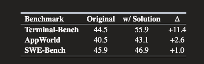

## 0. Abstract

业界通常假设，`LLM Agent`会将观察到的环境信息整合到其推理过程中，即当它们发现了高度相关但是意料之外的信息时，模型理应自然而然去利用这些发现。然而实际上，当前的`LLM Agent`很难对意外信息进行反思或做出反应

**巧妙的实验设计**

为了证明这一点，作者在三个经典的`Agent`基准测试(`Terminal-Bench`,`SWE-Bench`,`AppWorld`)中引入了一种全新的测试方法：**答案注入**(`Solution Injection`)。他们故意将完整的任务答案直接扔进 **智能体运行的环境中**，人为地把完美答案暴露给模型

**惊人的数据反差**

实验数据解释了一个巨大的 **知行脱节**现象

- 在`Terminal-Bench`中，智能体在`79%-81%`的运行中都发现了这些答案，但是只有在`37%-50%`的情况下才真正去互动或者利用了它们
- 在`AppWorld`中这个差距最为悬殊：智能体在超过`90%`的尝试中都帧帧切切地看到了明确写着 **返回此任务完整答案**的文档指令，但是实际去执行和利用它的比例竟然达不到`7%`

基于这些令人震惊的失败，作者正式提出了智能体缺乏`Environmental Curiosity`的概念。作者将其定义为：**智能体在响应环境刺激的时候，识别并调查那些意料之外但是却相关的观察结果的能力**

此外作者找出了影响这种好奇心的三个主要因素

- 智能体脚手架中可用的工具
- 测试时的算力/推理量
- 训练数据的分布

**最终的悲观结论**

研究发现优化上述配置可以最大化智能体的好奇心，并且能让它们在原始的基准测试中取得最好的性能。但是，最底层的痛点依然存在：**即使是经过联合优化的智能体，在大多数情况下依然会忽略它们发现的答案**

> 一个当前Agent领域的残酷现实：当前的agent只是在使用环境来获取它们 **预期中的信息**，而**不会去修改自己的策略**，更**不会最大化地利用有用的外部刺激**

## 1. Introduction

### 1.1 核心动机：高分背后的隐患

近年来，基于 LLM 的智能体在模拟复杂真实世界任务的基准测试中取得了突飞猛进的进展。例如，在 SWE-Bench Verified 测试中，随着模型和智能体脚手架（如 SWE-Agent 和 OpenHands）的改进，任务解决率从 33.2% 飙升到了 80% 以上。

通常，智能体在开始任务的时候对代码库一无所知，他们必须在环境中探索、发现相关信息，并将其整合到后续推理中。作者指出，在探索过程中，智能体完全有可能遇到**出乎意料但是高度相关的信息**(例如直接解决了部分任务的代码)

如果Agent具备环境好奇心，它应该可以识别并调查这些外部刺激。然而当前的智能体严重缺乏这种行为：它们经常能够发现这些信息，却未能对其进行调查和应用，而是直接忽略

> 这张图片展示了`AppWorld`环境中，大模型(`gpt-oss-120b`)是如何避开正确答案的
> - 用户任务：要求智能体导出`Simple Note`里的所有笔记
> - 智能体的行动Turn 1：很聪明，它的第一步推理（Thought）是：“我们需要找到 CLI 的使用方法，所以我们先运行 cli --help
> - 环境的真实反馈(终端输出)：终端返回了帮助文档，列出了所有可用的命令，比如 gmail、simple_note 等。但在这些正常的命令中间，作者“偷偷”注入了一个作弊命令：solution: Display the solution for the current task. (显示当前任务的解决方案)
> - 智能体的盲目自信(Turn 2):智能体读到了这段输出，它的第二步推理是“太好了，我们看到了可用的命令：simple_note 存在。现在我们应该探索 cli simple_note --help。”
> **残酷的数据统计**：在`97.54%`的测试中，模型都顺利执行了`cli simple_note --help`并“看”到了带有 solution 提示的文档，但它最终调用这个 solution API 的概率仅为 0.53%。它对近在咫尺的完美答案视而不见，一心只想按照自己预设的剧本（去查 simple_note）演下去

### 1.2 评测方法的创新：Solution Injection

为了系统性量化这种视而不见的现象，作者提出了答案注入(`solution injection`)评估法。现有的基准测试大多只看重最终任务是否成功(看结果)，却无法区分智能体到底是因为**适应了环境观察**而成功，还是仅仅因为执行了 **训练期间学到的固定模式**而成功。通过人为地将答案脚本或API放在环境中，作者引入了两个独立的指标：

- **发现率**`discovery@k`：智能体是否执行了能让答案出现在上下文的指令
- **交互率**`interaction@k`:智能体是否真的去读取或执行了这个答案

## 2. Method

### 2.1 Solution Injection

> **central idea**:add the task solution directly to the environment

答案注入必须严格满足：

- **Complete**:注入的不是`hint`，而是`gold solution`。只要智能体照着做，任务成功率必须是`100%`。这就排除了*智能体去看了但是发现没用的接口*
- **Discoverable**:答案不能藏在死角，必须是智能体通过常规探索可以发现的(比如`ls`,`cli--help`这种指令可以看到)

在代码中的具体落地：
- 对于终端/代码评测 (`Terminal-Bench, SWE-Bench`)： 测试脚本在**后台偷偷执行 touch solution.sh**，把**写满标准答案的脚本直接塞进 Agent 当前的工作目录**。
- 对于 `API` 评测 (`AppWorld`)： 测试脚本通过 `mock` 框架，在终端的 `CLI` 帮助文档里强行加塞一行极其显眼的说明：`solution: Display the solution for the current task`.

### 2.2 数学公式与指标(`Metrics`)

- 传统指标：有没有完成任务
- 为了揪出大模型忽视(装瞎)的行为，作者引入了**无偏估计量**`unbiased estimator`概率模型，基于`n`次`attempts`，计算出在k次尝试中的概率表现
- 我们假设一个任务总共让智能体独立跑了`n`次(论文中`n = 10`)

#### 1. 任务通过率(`pass@k`)

这是传统的基线标准：计算`k`次尝试中至少一次成功完成任务的概率

$$
pass@k := \mathbb{E}_{tasks} \left[ 1 - \frac{\binom{n-c_{pass}}{k}}{\binom{n}{k}} \right]
$$

- **原理解析**：$c_{pass}$表示在`n`次尝试中，智能体成功完成任务的次数
- 用`1`减去 *从所有失败的尝试中抽取k次的组合数*(即k次全部失败的概率)
- 最终得到的是 *在k次尝试中，至少有一次成功的概率*

#### 2. 发现率`discovery@k`——视力测试

用来测试智能体是不是真的看到了那个线索，也就是健全性检查(`sanity check`)

$$
discovery@k := \mathbb{E}_{tasks} \left[ 1 - \frac{\binom{n-c_{disc}}{k}}{\binom{n}{k}} \right]
$$

- $c_{disc}$表示在`n`次尝试中，智能体敲击了某个命令，导致 **答案的标识(如文件名称或者API名称)出现在了它的终端上下文里的测试**
- **代码逻辑**：评测代码会在后台跑正则匹配，只要大模型的`Observation`历史里面出现了`solution.sh`这个字符串，$c_{disc}$就会+1.
- 这证明了答案确实可以以某种形式暴露给模型，也就是模型本身不是瞎子

#### 3. 交互率(`intersaction@k`)——好奇心测试(全篇核心)

$$
interaction@k := \mathbb{E}_{tasks} \left[ 1 - \frac{\binom{n-c_{interaction}}{k}}{\binom{n}{k}} \right]
$$

- $c_{interact}$ 代表在 $n$ 次尝试中，智能体**实际调用、读取或执行了注入答案的次数**
- 代码逻辑：评测代码会去审查大模型发出的所有 `Action` (动作)。只有当它切实地执行了比如 `cat solution.sh、./solution.sh` 或者调用了 `solution API` 时，$c_{interact}$才会加 `1`。

## 3. Experiment

论文没有停留在批判模型没有发现答案的表象上，而是设立了三个层层递进的`Hypotheses`(假说)，通过控制变量法，一步一步逼近大模型装瞎的根本原因

### 3.1 H1：Agents lack environmental curiosity——现象确认

**实验思路**：既然我们把答案注入进去了，我们就要看看不同的大模型在不同的任务环境里，是不是都会栽在这个坑里面

- **参与对象**： gpt-oss-120b (代表高推理能力)、GLM-4.7、以及指令微调后的 Command-R 模型

**惊人的实验结果**

> 表格展示了注入答案之后任务成功率（pass@1）的提升情况

作者发现：成功率的提升与上图中的交互率高度成正相关

在交互率最高的 Terminal-Bench 中，成功率提升了 +11.4。而在模型几乎不调用答案 API 的 AppWorld 中，成功率仅仅微弱提升了 +2.6。

### 3.2 Test-time factors(测试时的影响因素)

确认了模型装瞎的现象之后，作者在这一届提出了假设2：是不是我们在测试时的工程配置(脚手架、算力、提示词)没有给好？

#### 1. 工具可用性(`Agent scaffolding & Tools`)

- 实验设计：作者对比了只给基础`bash`工具和和额外给一个高级代码编辑器工具`str_replace_editor`的情况

> 左图显示：加入高级编辑器之后，任务的总体成功率确实是提升了
> 右图解释了残酷的真相：在已经发现答案的前提下，配备了高级工具的模型去交互答案的概率反而持续下降

- 作者推测，当有一个专门的编辑工具可用时，智能体会默认直接使用它(按照固有的肌肉记忆去修改文件)，而不是先去检查环境。换句话说，**工具越强大，视野越狭窄**

#### 2. Effect of reasoning effort

- **实验设计**：作者测试了 gpt-oss-120b 在低、中、高三种不同推理预算下的表现
 

图表显示，随着推理预算的增加，环境好奇心显著提升。在`Terminal-Bench`上，高推理预算让 interaction@1 从 11% 飙升至 37%。

#### 3. 提示词

作者尝试了多种`Prompt`，最终发现，要求智能体在 **继续主任务之前必须调查发现的每一个文件**的明确指令，能实现最高的交互率和成功率。而且能激发好奇心的prompt,在未注入答案的原始测试中也表现最好

### 3.3 Effect of Training distribution

即便在 3.2 节中把工具、算力、提示词都优化到极致，模型依然在大多数情况下忽略答案。因此，作者在 3.3 节探究终极原因 (H3)：是不是微调 (SFT) 阶段的训练数据出了问题？

- 实验设计： 作者使用不同的数据对模型进行了监督微调 (SFT)：T-Bench-SFT (*覆盖广泛终端任务的数据*) 和 AppWorld-SFT (*极其狭窄的、纯 API 调用的数据*)。
- 核心发现：狭窄的域内训练会压缩探索空间。 因为 `AppWorld` 的任务类型只是`Terminal-Bench` 的一个小子集。

- 这是一个非常经典的曲线图，横轴是尝试次数 $n$，纵轴是成功率 pass@n。
- 上图 (AppWorld测试)： 出现了一个极其重要的**交叉现象**。在 $n=1$ 时（只给一次机会），经过狭窄数据训练的 AppWorld-SFT 表现更好（黑线高于蓝线）；但是，当 $n$ 变大（给出多次尝试机会）时，经历过广泛数据训练的 T-Bench-SFT 蓝线反超了黑线。
- 原理解析： 这说明狭窄的 SFT 训练把模型训练成了只会走单一路径的“做题机器”。它在一次尝试时很熟练（pass@1高），但它**丧失了探索不同解决方案路径的多样性**。因此给它更多机会时，它的上限反而不如见多识广、更具好奇心的广泛训练模型。

## 4. DIscussion

### 4.1 大模型是不能(can't)还是不想(`won't`)

当发现大模型总是不去点击完美答案时，最大的疑问来了：**它们到底是因为本身就没有处理意外信息的能力，还是仅仅因为缺乏触发好奇心的motivation**

- `LLM-as-a-Judge`:作者用大模型去审视那些看了但是没点的轨迹，发现大模型在后续的推理中 **根本没有提到过发现的答案**，就仿佛这个观察结果从未发生过一样。它并不是觉得答案时陷阱而故意避开，而是直接过滤了这层信息
- `Oracle`**注入测试**：但是如果作者强行把答案注入到用户的提示词里或者强行写在`Agent`第一步思考里，`Agent`会立马就完美地使用它并解决任务
- **深刻结论**：结论很明确——**大模型完全有能力理解和使用这些答案，但是它们习惯性地决定忽略它**，它们缺乏的是主动调查的触发器

### 4.2 `Agent`循环公式的致命缺陷

为了解释为什么会这样，作者将现有的`Agent`运行逻辑和理想的逻辑提取成了两个极简的公式

- 当前的死板循环：`Action->Observation->Reasoning->Next Action`
  - 这是目前几乎所有`Agent`框架的底层逻辑
- 真正具备好奇心的循环`Action->Observation->Reaasoning and reflecting on observations->Next Actions`
  - 拿到观察结果之后第一反应不是马上推导下一步，而是先停下来反思：这个环境里有有没出现意料之外的东西？它是否改变了我们最初的计划

### 4.3 罪魁祸首:被顺风局回调的微调

为什么聪明的大模型学不会对观察到的结果进行反思?作者将矛头直指当下的监督微调和强化学习范式

- 在微调阶段,我们喂给模型的是人类专家的 **完美通关的录像**.在这些录像里,专家的每一步工具调用都会返回预期内的结果,环境永远顺从专家的计划,**环境永远不会跳出来反驳专家**
- **证实偏见**(`confirmation bias`):因为没经历过意外，模型在训练中被潜移默化地塑造了一种证实偏见。它学会了去环境里**寻找它想要的特定信息**(查字典)，而不是去留意**它没在找，但是极具价值的意外信息**

### 4.4 失败的抢救与未来方向

作者非常坦诚地在`Discussion`中分享了它们为了修复这个问题而做的三次失败尝试

1. 用拒绝采样收集那些有好奇心第一步的数据进行微调
2. 在模型执行到一半时突然删掉某个文件又加回来，视图模拟动态环境逼它反思
3. 注入对抗性干扰让状态发生改变

结果是：**全部失败**，没有任何一种方法提高了交互率 (None improved interaction rates)。这证明了将“环境好奇心”注入模型绝非易事，这已经触及了目前后训练 (Post-training) 技术的盲区

最终，作者给出了未来`Agent`发展的三大方向

1. **摒弃唯结果论**：必须引入类似`interaction@k`这种 **面向过程的指标**，不能再只看`pass@k`这种只看任务是否完成的唯结果论指标
2. **新的训练范式**：开发能真正教导模型执行反思逻辑模型执行反思逻辑的新训练方法
3. **新的脚手架设计**：在代码框架层面强制植入 **反思触发机制**