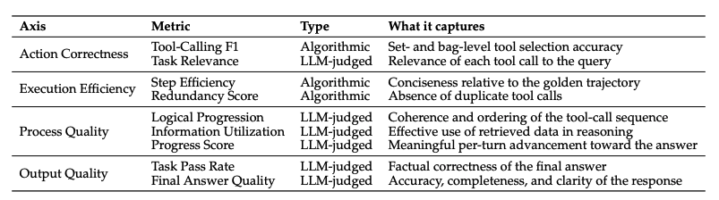
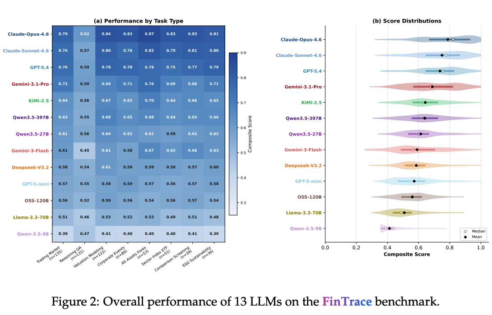
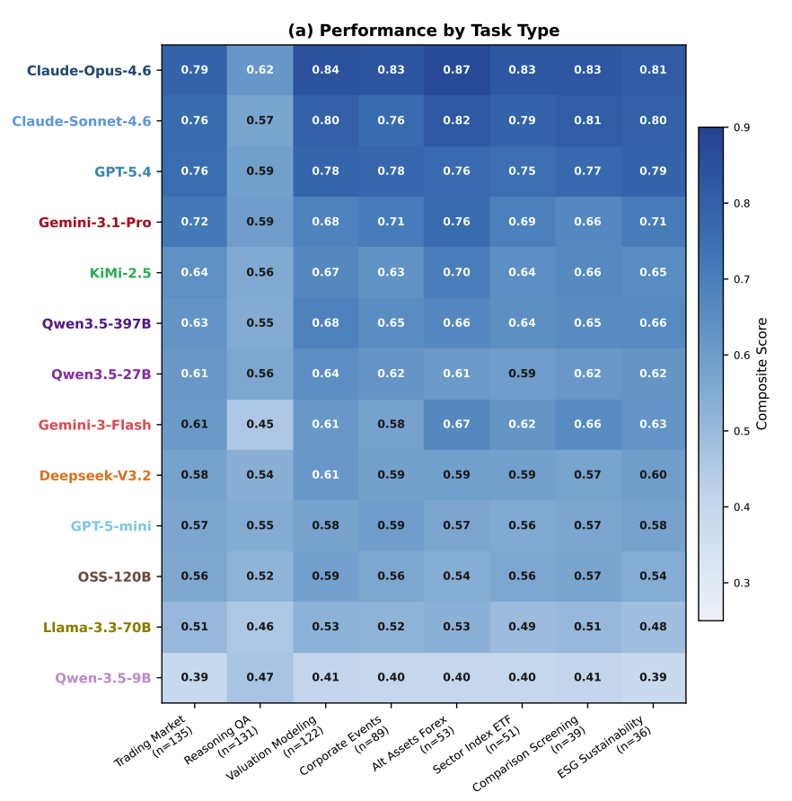

## 0. Abstract

研究表明，`LLM`的工具调用能力使其能够与外部环境交互，从而处理长周期的金融任务。尽管现有的基准测试已经开始评估金融领域的工具能力，但是它们通常只关注有限的场景

更重要的是，现有评估主要依赖于`call-level`的指标，这种方式无法有效捕捉模型在整个`trajectory-level`(轨迹级别)的推理质量

作者推出了`Fintrace`基准测试，采用一套基于`rubic-based`的评估协议，能够对LLM的工具调用行为进行细粒度评估

该评估协议包含9个具体指标，分为四个核心维度

- 动作正确性`action correctness`
- 执行效率`execution efficiency`
- 过程质量`process quality`
- 输出质量`output quality`

**核心发现：模型的能力鸿沟**

- 作者对13个主流LLM进行了评估，发现前沿模型(`frontier models`)在 **工具选择**方面已经能够达到很强的水平
- 然而，所有模型在`information utilization`和`final answer quality`上都表现挣扎
- 这一现象暴露了一个关键的鸿沟：模型虽然能够调用正确的工具，但是在*基于工具输出的结果*进行有效推理方面仍然存在严重不足

## 1. Introduction

### 1.1 研究背景与挑战：金融领域的严苛要求

- `LLM`代理化趋势：大型语言模型正在从被动的文本生成器，快速进化为能够调用外部工具来完成复杂多步工作流的自主代理
- **工具调用的高要求**：要让`agent`工作流取得成功，工具调用不仅需要准确，还必须在逻辑上连贯且高效，因为任何错误的调用(如顺序错误、冗余或者不相关)都会产生连锁反应，从而破坏整个任务
- **金融领域的特殊性**：金融应用对术语的精准性、信息的时效性、跨市场的监管合规性以及特殊领域的推理有着极为严苛的要求，这构成了巨大的压力测试
- **长周期任务的易错性**：实际的金融服务请求通常需要编排多种`API`并执行长周期的多步调用过程，在这一过程中，任何微小的失败都会被显著放大。因此，必须弄清楚`LLM`为何会失败，才能在现实的高风险金融服务中部署可信赖的模型

### 1.2 现有研究的局限性

金融场景下工具调用表现现存方法有三个主要缺陷：

- **数据脱离真实场景**：大多数数据集通过 **逆向合成**构建(即根据预设的工具序列生成用户的查询)，这导致生成的请求过于明确和以工具为导向。而真实的金融从业者查询往往是隐式、不充分且以目标为导向的
- **评估粒度过粗**(仅限于调用级别)：现有的评估大多是调用级别(`Call-Level`)的，它们只评估孤立的工具调用，而忽略了整个多步轨迹(`Trajectory`)的质量。这种方式无法捕捉`LLM`是否遵循了连贯的推理过程、是否有效利用了中间证据，或者是否产生了不必要的步骤
- **缺乏轨迹级别的训练资源**：现有基准主要强调任务级别的评估和事后诊断。然而，在长周期的金融场景中，错误往往出现在轨迹级别，这凸显了对轨迹级别训练资源的需求，以便让LLM能够从中间步骤的失败中学习，从而提高其规划和执行能力

### 1.3 The Solutions

为了弥补上述空白，作者提出了一下三项核心创新：

- **提出FinTrace基准测试**：该基准用于全面评估`LLM`在真实金融工具使用中的表现。它包含800个由专家注释的示例，涵盖34个不同的金融场景和多个难度级别。与现有方法不同，它直接从真实的金融查询出发。

- **引入多维度的评估协议**：作者设计了一个包含九个指标的量规（Rubric），沿着四个互补的轴线（动作正确性、执行效率、过程质量和最终输出质量）来评估模型的完整工具使用轨迹
- **构建`FinTraining`偏好数据集**：为了提升`LLM`的工具调用能力，作者构建了首个包含8196个真实金融工具使用轨迹的偏好数据集，专门用于支持监督微调(`SFT`)和强化学习后训练

## 2. FinTrace Construction

这一部分描述了如何构建`FinTrace`，详述评估查询的筛选整理、经专家核验的标准基准轨迹生成流程，以及我们多维度评分细则评估方案的设计思路

### 2.1 Evaluation Query Set and Golden Label Construction

为了能够真实、全面地评估`LLM`在金融长周期任务中的工具调用能力，研究团队设计了一个非常严谨的多阶段构建流程

#### 1. `Task Curation`(任务搜集)

为了更好地反映真实世界金融工具使用的多样性和复杂性，研究团队从三个互补的数据源精心挑选了任务问题

- **开源基准数据集**：引入了`Finance Agent Bench`,`FinCoT`,`FinSearchComp`和`OpenFinArena`等四个成熟的数据集。这为**多跳推理、时效性信息检索、财务预测**等核心金融`Agent`能力提供了广泛且结构化的覆盖
- **真实专家级问题**：由于现有的开源基准可能无法完全捕捉从业者在实际工作中的提问方式，团队还从讨论金融代理的公开学术论文、社交媒体铁子和博客文章中收集了用户查询。这些问题通常是隐式的、未充分说明的，且以目标为导向
- **针对性补充问题**：为了弥补现有数据与可用工具池之间的覆盖差距，团队专门为那些未被充分利用的工具设计了额外的任务查询。这确保了最终的评估不会偏向于少数特定的工具子集

#### 2. Evaluation Query Set Selection 评估问题集筛选

拥有了一万条初始查询之后，团队需要筛选出一个高质量、难度分布合理的子集用于最终的评测

- **初始轨迹生成**：团队使用三种前沿大模型`GPT-5.4`、`Claude-Opus-4.6` 和 `Gemini-3.1-Pro`）为所有 `15,095` 个问题生成了工具调用轨迹
- **难度打分机制**：基于四个标准计算难度得分
  - **轨迹结果**(成功记0分，失败记+1分)
  - **轨迹长度**(根据轮次记+0/+1/+2/+3分)
  - **工具多样性**：每个独特工具记+1分
  - **查询复杂度**：基于多部分结构、查询长度和计算相关关键词的存在来判定
- **分层抽样**：根据得分，使用第`33`和`66`百分位数作为全局断点，将任务划分为`Easy`,`Medium`,`Hard`三个层级
- **正负样本比例**：在每个难度层级中，团队抽取了`55%`轨迹成功的查询和`45%`轨迹失败的查询。这确保了评估及不仅包含当前模型擅长的任务，也捕捉了模型仍在挣扎的难题。最终精炼得到了`800`个查询构成的评估集

#### 3. Golden Label Trajectory Construction

选出`800`个核心查询后，最后一步是为它们打造专家级的标准答案(`Golden Labels`)作为后续评估的绝对参考

- **重新生成候选**：为了获得极高质量的黄金轨迹，团队扩大了生成池为这800个问题重新生成候选轨迹。此举提高了每个问题至少产生一条高质量轨迹的概率
- **LLM裁判初筛**：应用`LLM-as-Judge`的提示词，为每个问题初步挑选出最佳候选轨迹
- **专家交叉验证**：四位金融领域专家独立评估了其中`100`个随机样本，结果显示人类与模型裁判的评估具有极高的一致性(`Cohen's kappa` $\kappa=0.89$)
- **人机协作微调**(`Human in the loop`):基于上述的高一致性验证，这800条由模型选出的候选轨迹被提交给专家进行全面审查。当专家发现某些轨迹中存在问题时，他们会提供纠正反馈，语言模型随后会根据这些反馈修改轨迹
- **最终定稿**：通过这种迭代的人机协作过程，团队最终获得了`800`条高质量的黄金标签轨迹，它们将作为后续指标评估的参考标准

### 2.2 Rubric Evaluation Protocal

> 量规评估协议的核心内容

现有的金融工具调用基准通常依赖于单一的端到端指标(例如工具调用成功率)来评估`LLM`的性能。然而，这种评估方式忽略了关键的中间步骤例如模型是否选择了正确的工具、调用顺序是否符合逻辑、是否避免了冗余调用，以及是否有效地利用了返回的信息

为了解决何意局限性，`FinTrace`引入了一个多维度的量规评估协议，该协议包含了9个具体指标，并被组织在四个互补的评估维度上：

#### 1. `Action Correctness`操作正确性

- **工具调用**(`Tool-Calling F1`):一种算法指标，用于衡量集合级别`Set-Level`和`Bag-Level`的工具选择准确性
- **任务相关性**(`Task Relevance`):一种`LLM`担任裁判的指标，用于评估每次**工具调用与用户查询的相关性**

#### 2. `Execution Efficiency`

- **步骤效率**`Step Efficiency`:一种算法指标，用于衡量模型生成的轨迹相对于`Golden Trajectory`的简洁程度
- **冗余分数**`Redundancy Score`:一种算法指标，用于衡量是否存在重复的工具调用

#### 3. `Process Quality`过程质量

> 这是核心

- **逻辑递进**`Logical Progression`:一种由`LLM`担任裁判的指标，评估工具调用序列的连贯性和顺序合理性
- **信息利用**`Information Utilization`：一种由`LLM`担任裁判的指标，评估模型在**推理过程中**是否**有效使用了检索到的数据**
- **进度分数**`Progress Score`:一种由`LLM`担任裁判的指标，衡量每轮交互是否朝着最终答案取得了有意义的实质性进展

#### 4. `Output Quality`输出质量

- **任务通过率**`Task Pass Rate`:一种由LLM担任裁判的指标，用于评估最终答案在事实上的正确性
- **最终答案质量**`Final Answer Quality`:一种由`LLM`担任裁判的指标，全面评估回答的准确性、完整性和清晰度

### 2.3 Experiment Setup

说明了研究团队为了评估大语言模型在金融长周期任务重的工具调用能力，所选择的模型组合以及构建的底层测试环境

#### 1. 评估的模型

为了全面分析模型家族和参数规模对工具调用轨迹质量的影响，研究团队共选取了13款大语言模型进行基准测试，涵盖了商业闭源模型和开源模型

- **专有模型**`Proprietary Models`:主要通过`API`调用，包括，包括 GPT 家族（如 GPT-5.4）、Claude 家族（如 Claude-Opus-4.6）、Gemini-3 家族（如 Gemini-3.1-Pro）、Kimi-2.5 和 DeepSeek-V3.2
- **开源模型** (`Open-source Models`)：可在本地部署，包括 Qwen3 家族（如 Qwen3.5-397B、Qwen3.5-27B、Qwen-3.5-9B）和 LLaMA-3 系列（如 Llama-3.3-70B）
- **规模覆盖**：选取的模型涵盖了多种参数规模，以便**分析模型规模的扩大对轨迹质量的具体影响**
- **公平性保证**：为了确保评估的公正性，所有参与测试的模型都使用了完全一致的`prompt`

#### 2. TestBed

- **核心数据源**：平台基于在业界广泛使用的金融数据提供商`Financial Modeling Prep`构建了统一的工具调用接口
- **丰富的工具池**：`FMP`平台共提供了`247`个金融工具端点，功能涵盖了公司简介查询、三大财务报表（利润表、资产负债表、现金流量表）获取、历史价格序列分析、财务比率计算以及盈利信息等
- **标准化交互协议**：所有的模型都统一通过**模型上下文协议**(`MCP`)与这些金融端点进行交互。MCP 的引入标准化了工具调用的流程，确保了所有被评估模型在工具访问权限和交互方式上保持绝对一致。

## 3. Evaluation Results

### 3.1 Main Results

- **前沿模型领先，但没有“全能王**：Claude-Opus-4.6 以 0.788 的总分位居榜首，紧随其后的是 Claude-Sonnet-4.6（0.750）和 GPT-5.4（0.737）。然而，没有一个模型能在所有指标上占据绝对优势。例如，GPT-5.4 的任务通过率（Pass Rate）最高，但其在逻辑推进（Logical Progression）上落后于两款 Claude 模型。
- **工具调用没问题，但“过程与输出质量”成为主要瓶颈**：大多数模型都能获得较高的低冗余度得分（≥0.90）和不错的工具调用F1分数，这说明*它们知道该选什么工具*。但是，模型在**过程质量和输出质量上的得分大幅下降**，即便是最强的 Claude-Opus-4.6 在满分5分的情况下，最致命弱点：LLM 虽终答案质量也只有 3.34 分。这暴露了一个**虽然能选对工具，但很难在金融任务中有效地利用检索到的数据进行多步、高强度的数值推理**。
- **小模型出现了“退化”的工具调用行为**：排名靠后的小模型（如 Qwen-3.5-9B 和 Llama-3.3-70B）在执行效率上几乎拿了满分，但**工具调用F1和逻辑推进得分却极低**。这说明它们在“摆烂”——**为了显得效率高，它们倾向于极少调用工具或者直接调用错误的工具**，导致任务彻底失败

### 3.2 Detailed Analysis

图二包含两部分：

- 按照任务类型划分的表现热力图
- 分数分布的小提琴图

#### 1. Figure 2(a) Performance by Task Type

这个热力图展示了13个模型在8类不同金融任务重的得分情况。颜色越深(深蓝)代表得分越高，颜色越浅(浅蓝/白)代表得分越低

- **Reasoning QA**是所有模型的普遍瓶颈：从图中可以清晰看到，所有模型在该列的颜色最浅，因为这类任务通常需要对检索到的金融数据进行多跳推理，这超出了目前`LLM`的能力边界
- **头部模型更稳定，中端模型偏科严重**：排名前三的模型在各类任务上的颜色分布比较均匀，而中端模型（如 Gemini-3-Flash）在不同任务间的得分差距很大（如 0.67 与 0.45 的落差），说明它们无法均匀覆盖多样化的金融场景

#### 2. Figure 2(b) - Score Distributions 

小提琴图展示了模型在各个查询上得分的分布形态，中间的白点是中位数，黑点是平均值。它告诉我们平均值高不代表每一次都靠谱
