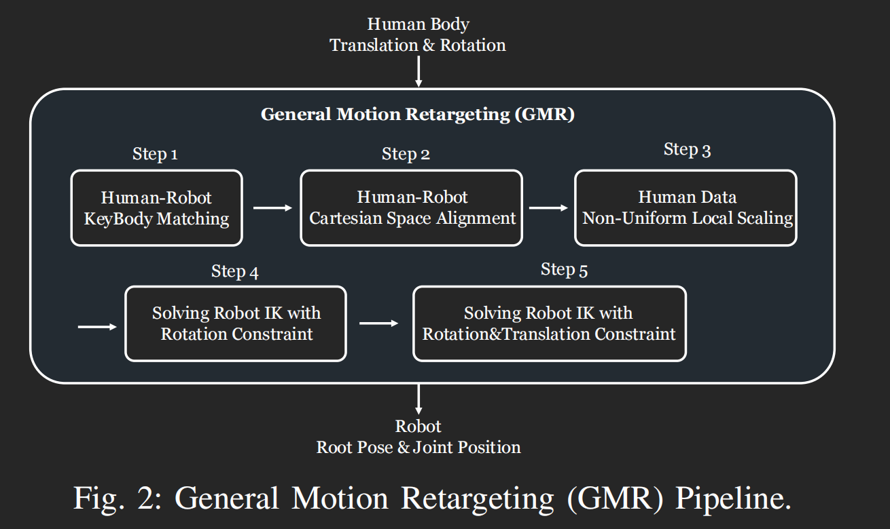

**论文信息**

| 项目       | 内容                                                                         |
| ---------- | ---------------------------------------------------------------------------- |
| **标题**   | Retargeting Matters: General Motion Retargeting for Humanoid Motion Tracking |
| **作者**   | João Pedro Araújo, Yanjie Ze, Pei Xu, Jiajun Wu, C. Karen Liu                |
| **机构**   | Stanford University                                                          |
| **GitHub** | https://github.com/YanjieZe/GMR                                              |
| **原文**   |[论文链接](https://arxiv.org/pdf/2510.02252)|

---

**章节结构**

1. Abstract（摘要）
2. I. Introduction（引言）
3. II. Related Work（相关工作）
4. III. Evaluation Method（评估方法）
5. IV. General Motion Retargeting（GMR方法）⭐
6. V. Evaluation Results（实验结果）
7. VI. Conclusion（结论）
8. References（参考文献）


---

## 1. 摘要

- 原有的人形机器人运动跟踪策略：构建遥控操作管道和分层控制器
- 但是这个策略的一个根本性的挑战是:人类和人形机器人之间的形态差异(`embodiment gap`)
- 当前的方法
  - 将人类运动数据`retargeting`到人形机器人本体
  - 使用强化学习
  - 模仿参考轨迹
- 方法的问题：重定向过成会引入`artifacts`也就是伪影(**这是本文要解决的核心问题**)，比如脚步滑动、自我穿透和物理上不可行的运动会留在参考轨迹中
  - 这种方法的本质是：**用强化学习纠正或掩盖问题而不是解决根本问题**
- 论文的核心假设：不依赖奖励工程，重定向质量是至关重要的。
- 本文的评估对象：当抑制过渡奖励(`excessive reward tuning`)调整时，重定向质量如何影响策略性能
- 论文核心贡献
  - `GMR`:`general motion regarding`
  - 为了解决现有重定向方法(`PHC`,`ProtoMotions`)的缺陷
- 论文使用的`RL`训练框架:`BeyondMimic`
- 实验发现：通过对`LAFAN1`数据集分析发现 **伪影会显著降低鲁棒性**

!!! note "如何理解Retargeting"
就是通过数据将人类的运动映射到机器人上
!!!

## 2. 引言

- 开发真正泛化到真是世界环境的人形机器人策略的关键是**来自真实世界的数据**
- 人类和人形机器人之间形态差异的具体方面
  - `bone length`
  - `joint range of motion`
  - `kinematic structure`
  - `body shape`
  - `mass distribution`:质量分布
- 克服形态差异才能使三维人类运动数据充分用于人形机器人学习
- 克服的方法就是 **运动学重定向**(`kinematic retargeting`)
- 当前的方法
  - 模仿参考运动进行强化学习
  - `zero-shot`，0样本迁移(直接从机器人上)，不在每一个实体上进行微调
- 问题：忽略了重定向过程中产生的`artifacts`
- 过去的方法想要将带有严重伪影的重定向数据迁移到真实数据需要**大量试错、奖励塑造和参数调整**(trial-and-error, reward shaping, and parameter tuning)
- 论文假设：通过足够的**奖励工程和领域随机化**，重定向导致的伪影大部分可以被缓解或者消除
- 如果没有这些工程化的努力。重定向结果的质量起着重要作用
- **论文的核心目标**：验证假设
- 实验设置：纯运动跟踪(无物体交互)
- 伪影的主要来源：**缩放**`scaling`
  - `PHC`和`Proto`的缩放方法是有问题de
- `GMR`的核心创新：非均匀局部缩放(`non-uniform local scaling procedure`)和两阶段优化(`two-stage optimization`)
- `BeyondMimic`=公平的评估框架，训练和评估跟踪给定参考运动的强化学习策略，可以
  - **隔离重定向方法的影响**
  - 不依赖奖励调整
- `LAFAN1`数据集：动作捕捉数据
  - 排除复杂接触(排除脚步以外与外物有接触的动作)、
- 比较成功的标准：完成整个参考运动且不摔倒
- 还可以获知：策略是在学习我们期望他们完成的动作还是在学习一个可能更容易或更难跟踪的变体
- 核心发现：重定向方法的选择严重影响人形机器人的性能
- 大多数运动可以跟踪
- 某些运动因为伪影而失败
- 三种关键伪影
  - 脚部穿透(`foot penetration`)
  - 自我交叉(`self-intersection`)
  - 速度突变(`abrupt velocity spikes`)
- 参考运动的起始帧会极大影响策略是否能够开始跟踪它

!!! tip "一些概念的理解"
- 奖励工程：通过奖励机制告诉机器人什么动作的实现是好的
  - 机器人没摔倒+5分，脚不滑+10分
- 领域随机化：训练时故意制造各种困难环境，让他在各种情况下都能适应
  - 房展训练故意加入各种随机干扰
  - 随机改变地面摩擦力、随机添加噪声、随机改变光照
  - 核心目的：让机器人在真实世界里遇到没有见过的环境也不慌
- 伪影：重定向数据中那些不自然的地方
  - 脚部滑动：脚应该在地面上摩擦移动，但伪影中脚会"滑冰"
  - 地面穿透：脚应该站在地面上，但伪影中脚会"穿过"地面
  - 自我穿透/交叉：自己的身体穿透了自己
!!!

## 3. Related Work

### 1. 运动重定向的两大类方法

|方法|特点|
|-|-|
|经典方法|基于优化+启发式约束|
|数据驱动方法|深度学习+需要成对数据/标签|


### 2. 机器人领域的挑战

- 真实机器人上**难以获取训练数据**
- 过去只关注简单的手臂/上半身运动

### 3. 现有重定向方法的缺陷

- 朴素方法：直接复制关节→浮空、脚滑、穿透
- `PHC`:忽略脚的接触状态、计算慢、无法实时
- `ProtoMotions`:使用全局统一缩放→比例不对

### 4. 论文的主要改进方向

- **全身运动**：解决只关注上半身的问题
- **无需预收集数据**
  - 直接把人类的动作捕捉数据(`LAFAN1`等数据集)拿来用
  - 不需要专门为某个机器人先收集一堆数据
  - 更加通用，任何机器人都能用
- **非均匀局部缩放**：解决比例问题

## 4. Evaluation Method

### 1. 三个研究问题

1. 重定向方法是否影响策略性能
2. 哪些伪影会影响学习
3. 不同方法的视觉保真度如何(`preserve the look of the source motion`)

### 2. 四种对比方法

|方法|类型|
|-|-|
|PHC|开源基线|
|ProtoMotions|开源基线|
|GMR|本文提出|
|Unitree|闭源上限|

### 3. 评估环境

|环境|评估次数|说明|
|-|-|-|
|`sim`|100次|无领域随机化|
|`sim-dr`|4096次|有领域随机化|

### 4. 评估指标

- **成功率**：完成整个运动且不摔倒
- **跟踪误差**
  - 全局位置误差(`E_g-mpbpe`)
    - `Global Mean Per-Body Position Error`
    - **机器人整体**在全局坐标系中的位置与参考运动的差距
  - 相对位置误差(`E-mpbpe`)
    - `Mean Per-Body Part Position Error`
    - 机器人身体各部位相对于**自身重心**的位置与参考运动的差距
  - 关节角度误差(`E_mpjpe`)：
    - `Mean Per-Joint Position Error`
    - 机器人每个关节的角度与**参考运动**中关节角度的差距

## 5. General Motion Retargeting(GMR)

> 这是论文的核心部分，一共包含五个步骤


### 1. 整体流程描述



### 2. Step 1-关键身体部位匹配(Human-Robot KeyBody Matching)

- 从`source human skeleton`和`target humanoid skeleton`的身体列表开始，用户首先定义**人类和机器人关键身体部位之间的映射**——`M`


```json
// 关键身体部位映射举例
{
    "ik_match_table1": {
        "pelvis": ["Hips", 0, 10, [0, 0, 0], [0.5, 0.5, 0.5, 0.5]],
        "left_hip_yaw_link": ["LeftUpleg", 0, 10, ...],
        "left_ankle_yaw_link": ["LeftFootMod", 50, 10, ...]
    }
}

// 格式说明: "机器人部位": ["人类部位", 位置权重，旋转权重，位置偏移，旋转偏移]
// 就是SMPL模型中的四个重要参数
```

### Step 2-静止姿态对齐(Human-Robot Cartesian Space Alignment)

- 人类-机器人笛卡尔空间静止姿态对齐。我们偏移人类身体的方向，使其与机器人在静止姿态时的方向相匹配
- 解决人机方向不一致的问题，让人类的姿态方向与机器人的静止姿态对齐


# 使用四元数处理旋转，先旋转后平移
def offset_human_data(self, human_data, pos_offsets, rot_offsets):
    # 遍历人体数据中的每个部位(如头部、手臂、腿部等)
    for body_name in human_data.keys():
        # 提取当前部位的原始位置(pos)和旋转四元数quat
        pos, quat = human_data[body_name]
        # 步骤一：更新旋转姿态
        # R.from_quat(quat):将原始旋转四元数转为旋转矩阵
        # * rot_offsets[body_name]：将旋转矩阵乘以旋转偏移量(实现旋转叠加)
        updated_quat = (R.from_quat(quat)*rot_offsets[body_name]).as_quat()

        # 步骤二：计算位置偏移(考虑旋转后的坐标系)
        # R.from_quat(quat):用更新后的旋转创建旋转矩阵
        # .apply(pos_offsets[body_name]):将位置偏移量转换到旋转后的全局坐标系
        global_pos_offset = R.from_quat(updated_quat).apply(pos_offsets[body_name])

        # 步骤三：更新位置和旋转(核心赋值)
        offset_human_data[body_name][0] = pos + global_pos_offset # 位置 = 原始位置 + 全局位置偏移
        offset_human_data[body_name][1] = updated_quat # 旋转 = 更新后的四元数

    # 返回偏移后的人体数据
    return offset_human_data


**重要说明**

- **依赖库**：代码中的`R`是`scipy.spatial.transform.Rotation`的简写，需要提前导入

```python
from scipy.spatial.transform import Rotation as R
```

- 输入数据格式
  - `human_data`:字典：键为人体身体部位名称(`head`/`left_arm`),值为元组`(pos, quat)`
    - `pos`:3维数组/列表(x,y,z),表示**部位的原始位置**
    - `quat`:4维数组/列表(x, y, z, w),表示**部位的原始旋转四元数**(scipy默认格式)
  - `pos_offsets`:字典，键与`human_data`一致，值为3维数组/列表(x, y, z)，表示该 **位置的偏移**
  - `rot_offsets`:字典，键与`human_data`一致，值为`scipy.spacial.transsform.Rotation`对象，表示该部位的旋转偏移矩阵

### 3. Step 3-非均匀局部缩放(Human Data Non-uniform Local Scaling)

- 论文发现其他重定向方法中的大多数伪影都是在缩放`source motion`的过程中引入的
- **核心发现**：缩放是伪影的主要来源
- 论文中实现的缩放程序
  - 基于人类骨骼的高度计算通用的 **缩放因子**
  - 这个通用因子的作用是 **调整为每个关键身体部位定义的自定义局部缩放因子**
  - 每个身体部位有独立的缩放因子，这其实就是 **非均匀**的含义
  - 这种自定义缩放因子可以让我们能够考虑 **下半身和上半身之间的缩放差异**

**核心公式**

$$
p_{target} = s_b · \frac{h}{h_{ref}} · ({p_{source} - p_{ref}}) + s_b · \frac{h}{h_{ref}}· p_{ref}
$$

当身体部位为根部时可以将公式简化为

$$
p_{target} = s_b · \frac{h}{h_{ref}}· p_{ref}
$$

**符号说明**

- $p_{target}$:目标位置(机器人)
- $p_{source}$:源位置(人类)
- $p_{ref}$:参考位置(静止姿态)，标准站立姿势下各个部位的位置
- $h$:实际身高
- $h_{ref}$:参考身高=标准人形的身高，比如1.8米
  - 这是一个**固定的参考值**，用来归一化处理
- $s_b$:身体部位b的缩放因子

```python
# 输入：人类运动数据
# 输出：缩放后的运动数据
def scale_human_data(self, human_data, human_root_name, human_scale_table):
    # 获取根部位(身体重心)的原始位置和旋转
    root_pos, root_quat = human_data[human_root_name]

    # 缩放根部的位置(旋转不缩放)
    scaled_root_pos = human_scale_table[human_root_name] * root_pos

    # 处理其他部位：先根据局部坐标系再缩放
    for body_name in human_data.keys():
        # 跳过无缩放系数，根部位的部位
        if body_name not in human_scale_table:
            continue
        if body_name == human_root_name:
            continue
        
        # 局部坐标 = 全局坐标-根部坐标  → 缩放 → 暂存
        human_data_local[body_name] = (
            human_data[body_name][0] - root_pos
        ) * human_scale_table[body_name]

    # 构建缩放后的全局坐标数据
    # 先初始化根部位的缩放后数据
    human_data_global = {human_root_name: (scaled_root_pos, root_quat)}
    # 其他部位:局部缩放后坐标+缩放后的根部位坐标 = 全局坐标
    for body_name in human_data_local.keys():
        human_data_global[bosy_name] = (
            human_data_local[body_name] + scaled_root_pos * human_data[body_name][1] # 旋转保持不变
        )
    
```

!!! tip 
- 论文中提到的根部我们认为是 **骨盆/髋部**，这是人体运动的中心
- 在机器人中，根部就是`plevis`(盆骨)
!!!

**流程理解**

```
输入：人的运动数据（手在1.5m位置，骨盆在1.0m）

Step 1: 骨盆位置 × 0.9 = 0.9m 直接缩放

Step 2: 手相对于骨盆 = 1.5 - 1.0 = 0.5m（局部坐标）

Step 3: 0.5 × 0.75(手臂缩放) = 0.375m

Step 4: 手的新位置 = 0.375 + 0.9 = 1.275m

输出：机器人的运动数据
```

**缩放因子配置**

```json
"human_scale_table": {
    "Hips": 0.9,
    "Spine2": 0.9,
    "LeftUpLeg": 0.9,
    "RightUpLeg": 0.9,
    "LeftLeg": 0.9,
    "RightLeg": 0.9,
    "LeftFootMod": 0.9,
    "RightFootMod": 0.9,
    "LeftArm": 0.75,
    "RightArm": 0.75,
    "LeftForeArm": 0.75,
    "RightForeArm": 0.75
}
```

> 不同位置这个因子数值大小不同，这就是非均匀局部缩放的具体含义

### 4. 逆运动学(IK)求解

- 给定机器人关节随时间变化的目标位置$p_{target} = J_f(\beta_r, \theta_h)$，我们将重定向问题表述为一个优化问题
  - $p_{target}$:机器人关节的目标位置
  - $J_f$:前向运动学函数
  - $\beta_r$:机器人身体参数(肢体长度)
  - $\theta_h$:人类关节角度
- 重定向问题通过最小化期望位置与机器人实际达到位置之间的误差来求解
  - 约束 1：关节限位(joint limits)
  - 约束 2：自碰撞避免(self collision avoidance)

**IK优化问题公式**

$$
min_{\theta_r}\Sigma_i||p_i^{target}-p_i(\theta_r)||^2
$$

$$ 
s.t. \theta_{min} \le \theta_r \le \theta_{max}
$$

📐 **推导过程**