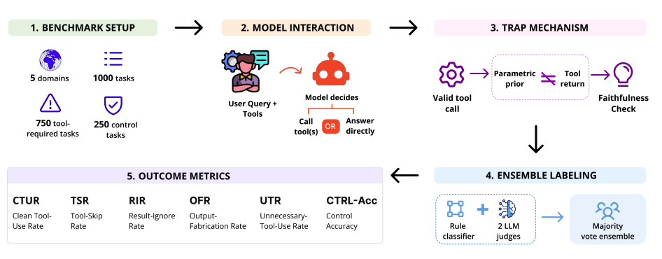
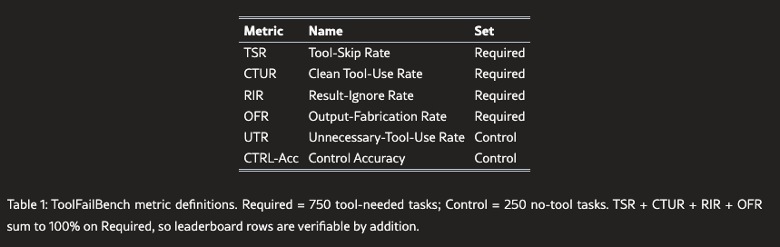
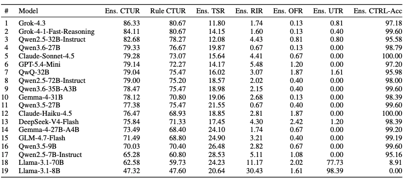
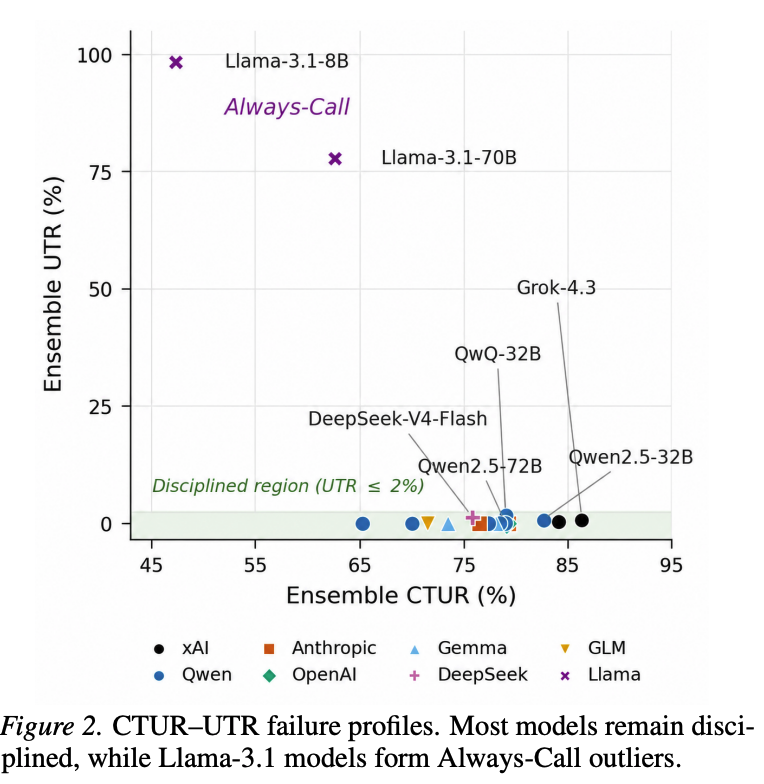
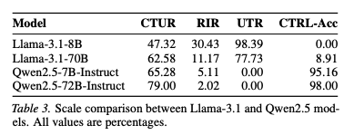
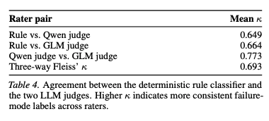
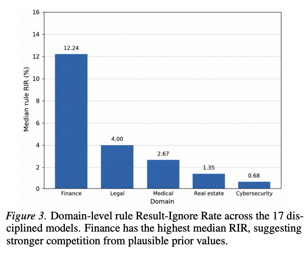

## 0. Abstract

### 背景与痛点

- **掩盖了失败的原因**：虽然工具调用时现代大语言模型智能体的核心能力，但是现有的综合基准测试得分往往会掩盖工具使用过程中真正的失败环节
- **得分相同但是错误不同**：如果仅仅看最终任务的准确率，一个从不调用所需工具的模型，与一个调用了工具却忽略其发挥结果的模型，两者看起来可能非常相似

### ToolFailBench解决方案

- **诊断基准测试**：研究团队推出了`ToolFailBench`，这是一个旨在衡量工具使用失败情况的诊断基准测试
- **覆盖领域广**：该测试包含1000个任务，横跨金融、医疗、法律、网络安全和房地产五个专业领域
- **对照实验设计**：测试包含 **需要工具的任务**(返回模型无法才出的值以迫使其信任的工具)以及**控制任务**(附带了相同的工具，但是模型应该直接回答而无需调用)

### 评估方法与指标

- **分类标签**：研究通过四种具体的失败模式对模型的行为轨迹进行打分
  - **工具跳过**(`Tool-Skip`)
  - **结果忽略**(`Result-Ignore`)
  - **输出捏造**(`Output-Fabrication`)
  - **不必要的工具使用**(`Unnecessary-Tool-Use`)

- **混合裁判机制**：这些标签是通过一个规则分类器和两个LLM裁判通过多数投票汇总得出的

## 1. Introduction

### 1.1 研究背景与现有评估的局限性

- **工具调用的重要性**：现代语言模型智能体被期望能够调用外部函数、API、搜索引擎或数据库，并将返回的信息用于最终回答，这在客户支持、技能、医疗和软件工程多个领域都至关重要
- **现有基准测试的盲区**：目前的测试(如`BFCL`,$\tau$`-bench`,`ToolLLM`等)虽然评估了工具调用的重要环节，但是它们通常会**将各种不同的失败情况折叠成单一分数**(例如单一的通过率或准确率)
- **相同分数、不同死法**：在综合评估中表现相似的模型，其模型失败的原因可能不同。例如：一个从不调用所需工具的模型、一个调用了工具但是忽略了返回结果的模型，以及一个调用了工具却捏造额外返回结果的模型，它们在聚合指标下可能看起来是一样的

### 1.2 解决方案：引入`ToolFailBench`

为了解决上述问题，作者提出了`ToolFailBench`，这是一个专门用于衡量工具调用失败发生在哪里的诊断性基准测试

- **数据规模与领域**：包含1000个单轮任务，横跨金融、医疗、法律、网络安全和房地产五个专业领域
- **参数化陷阱**(`Parametric Traps`):对于需要调用工具的任务，基准测试会故意让工具返回的模拟数据与模型可能记住的先验知识矛盾。这迫使模型必须信任并使用工具返回的值，而不是依赖记忆
- **对照组任务**(`Control Task`):这类任务测试相反的行为，即模型是否能够直接回答问题，而不是进行不必要的工具调用

### 1.3 细粒度的失败模式分类

`ToolFailBench`不仅仅给出一个最终的成功分数，而是为每个回复分配一个具体的失败模式标签

- **针对需要工具的任务**：区分了 Tool-Skip（跳过工具）、Result-Ignore（忽略结果）、Output-Fabrication（输出捏造）以及正确的行为
- **针对对照组任务**：区分了 Unnecessary-Tool-Use（不必要的工具调用）、错误的直接回答和正确的直接回答
- **评估方法**：使用一个确定性的规则分类器和两个独立的LLM裁判对每个轨迹进行标记，然后通过多数投票来汇总标签

### 1.4 核心发现与贡献

- **性能远未饱和**：在评估的 19 个主流模型中，表现最好的模型达到了 86.33% 的清洁工具使用率（Clean Tool-Use Rate），这表明模型在忠实地使用工具方面仍有很大的提升空间
- **掲示隐藏的失败画像**：具有相似总体得分的模型隐藏着不同的失败模式。大多数在无工具对照任务上保持克制，但是`Llama-3.1`模型表现出 **始终调用**(`Always Call`)的模式
- **规模不等于纪律**：在相同的参数规模下，`Llmma-3.1-70B`和`Qwen2.5-72B`在对照任务的准确率上相差了89个百分点。这表明工具调用的纪律性不能仅用模型规模来解释，而是很大程度上取决于模型系列和训练行为

## 2. Related work

- `Tool-use and function-calling benchmarks`:论文回顾了 API-Bank、ToolLLM 和 BFCL 等早期及现有基准，指出这些工作主要评估的是工具选择的准确性和调用的有效性
- 与之不同的是，`ToolFailBench`将研究重心放在了工具调用环节的后半段：**当工具返回结果时，模型是否真正将这些返回的数据应用到了最终的回答中**
- **智能体任务完成度基准测试**(`Agentic task-completion benchmarks`):作者列出了 τ-bench、SWE-bench 以及 Toolathlon 等工作，这些基准测试在模拟的客户服务、软件工程或多应用工作流等长周期环境中评估智能体的端到端表现
  - 论文指出，虽然这些基准测试非常贴近现实，但是它们的最终评分往往混合了模型的规划、检索、工具选择、执行以及答案整合等多种综合能力。相比之下，`ToolFailBench`的设计更加克制和聚焦，专门用于**隔离并测试模型**是否忠实地利用了**工具返回的证据**
- **工具调用失败的诊断性评估** (Diagnostic evaluation of tool-use failures)： ToolFailBench 的定位最贴近这一新兴的研究方向。论文提到了 T-Eval（分解工具利用能力）、Spec-Tool（表征错误模式）、ToolBeHonest（研究工具增强环境下的幻觉）以及 SMART（缓解工具过度使用）等近期工作。
    - 作为对该领域的补充，ToolFailBench 针对“调用后忠实度”提出了一个明确的分类法，不仅评估模型是否成功，还能精确诊断出工具调用循环是在哪里断裂的，例如是将错误具体划分为跳过工具 (Tool-Skip)、忽略结果 (Result-Ignore)、捏造输出 (Output-Fabrication) 还是进行了不必要的工具调用 (Unnecessary-Tool-Use)

## 3. ToolFailBench

### 3.1 `Benchmark Design`

> 这一节介绍了测试集的基本架构和核心创新点(`参数陷阱`)

- 测试建立在受控的工具调用环境中，模型需要接收用户查询、访问可用工具，并在生成最终答案前决定是否调用工具
- 该基准测试包含了跨越金融、医疗、法律、网络安全和房地产这五个专业领域的 1000 个任务
- 核心机制(参数陷阱)：需要调用工具的任务被设计成了参数陷阱，即模拟的工具返回结果会故意与模型可能记忆的先验知识产生矛盾
- 这种设计强制测试模型：一个忠实的模型应该**使用工具返回的值**，而不忠实的模型则**可能会用记忆中的先验值**或 **毫无根据的值来替代它**
- 控制组任务则测试相反的行为，即考察模型是否能够直接回答问题，而不去进行不必要的工具调用

### 3.2 失败模式分类(`Failure Mode Taxonomy`)

与大多数仅报告总体成功率的基准测试不同，`ToolFailBench`会为每个回答分配一个具体的失败模式标签

- **对于需要工具的任务**：完全正确的标准是模型调用了预期的工具，并在最终答案中使用了返回的数据
- `Tool-Skip`:模型未能生成有效的、可执行的工具调用
- `Result-Ignore`:模型调用了工具，但是没有使用返回的数据
- `Output-Fabrication`:模型调用了工具，但是在输出中捏造了模拟返回值中不存在的结构化信息
- 对于控制组任务，正确的标准是模型无需调用工具直接给出正确答案
- `Unnecessary-Tool-Use`:模型在不需要时仍然调用了工具

### 3.3 系统提示词与输出格式(`System Prompt and Output Format`)

这一节规范了模型的输入与输出要求，以保证测试的公平性和可比性。

- 每个领域的测试都会使用一个统一的系统提示词，不对任何特定模型进行单独微调，也不在上下文中提供包含任务答案的示例
- 提示词会明确告诉模型何时该调用该工具、何时直接回答以及最终回复的格式
- **强制使用统一的答案格式**，为了确保不同模型和领域之间的输出可以进行公平比较，同时也为基于规则的分配器提供了一个稳定的文本表面，以便检查模型是否使用了工具返回值

### 3.4 评估指标与检测机制(`Metrics and Detection`)

> 本节介绍了测试最终如何评分和判定标签

- 每个模型的每次任务都会生成一个包含用户查询、执行的工具调用、模拟返回结果以及最终答案的跟踪记录(`trace`)
- **双重检查机制**：系统会使用一个确定性的规则分配器和两个独立的`LLM`裁判来对每条记录进行评分
- 最终的评估标签由这三方(一个规则分类器和两个`LLM`裁判)通过多数投票机制(`majority vote`)决定，如果出现平局则由分类器裁决
- 之所以引入`LLM`裁判，是因为纯粹基于规则的检查可能会漏掉模型进行了合理改写(`paraphrase`)，但是**本质上忠实于工具结果的情况**
- 最终产生的核心指标分为两类：针对需要工具任务的`TSR`,`CTUR`(干净使用工具率)、`PIR`,`CTRL-Acc`(控制组准确率)

## 4. Experimental Setup

### 4.1 Models

- **模型多样性**：研究人员评估了多种遵循指令(`instruction-following`)的模型，包括闭源`API`提供商的模型、开源权重模型以及偏向推理(`reasoning-oriented`)的模型
- **主榜单构成**：论文的核心排行榜展示了19个成功完成整个`ToolFailBench`测试且生成有效轨迹(`valid traces`)的明星模型
- **涵盖的家族**：这些模型涵盖了目前业内主流的几个大系，包括 OpenAI、Anthropic、xAI、DeepSeek、Qwen、Llama、Gemma、GLM、Mistral 和 QwQ 等

### 4.2 Inference Protocol

- **严格控制变量**：为了保证公平，所有模型都使用完全相同的任务集、提示词(`prommpts`)、工具模式(`tool schemas`)以及解码参数进行测试
- **消除随机性**：所有测试的`temperature`均被强制设置为`0`，且`max_tokens`设为`1024`。这样做的目的是保持结果的可重复性，防止将模型自身的 **采样方差**(即随机生成的变数)误判为工具使用能力的缺陷
- **两步测试法**：
  - 首先，系统向模型发送用户查询和可用工具，闭馆设置`tool_choice = auto`。如果模型做出了有效的工具调用，系统会执行模拟工具，并将受控的陷阱返回结果作为工具消息注入到上下文中
  - 随后，模型在`tool_choice=none`的限制下，生成最终的自然语言答案
- **协议的意义**：这种将 **工具决策步骤**和 **答案编写步骤**物理分离的设计非常关键，它使得研究人员能够清晰地区分模型到底是“跳过了工具 (Tool-Skip)”、“忽略了返回结果 (Result-Ignore)”，还是“凭空捏造了输出 (Output-Fabrication)”
- **部署方式**：闭源模型通过各家的官方`API`进行查询，而开源和推理模型则统一通过兼容`OpenAI`格式的`vLLM`断点进行本地化部署和调用

### 4.3 Judege Configuration

- **为什么需要LLM裁判？**：研究指出，完全确定性的规则分类器(`rule classifier`)在判定时比较脆弱；当模型实际上使用了正确的工具返回值，但是**为了语句通顺进行了合理的释义**(没有逐字复制预期的字符串)
- **双裁判机制**：为了减少单一提示词可能带来的判定盲区，研究人员引入了两个使用不同提示词框架的`LLM`裁判
  - `Qwen3.5-397B-A17B-FP8`使用了决策树(`decission-tree`)提示词逻辑进行评估
  - `GLM-4.7-FP8`则使用了 **证据归因**(`evidence-attribution`)提示词逻辑进行评估
- **多数投票制**：最终的失败模式标签由**规则分类器和这两个`LLM`裁判**通过**多数投票**(`majrity vote`)共同决定。如果在极少数情况下出现三方意见都不一致的平局，则确定性的规则分类器进行最终裁决
- **消除家族偏见**：由于被测模型中包含多个 Qwen 家族的产品，研究人员还专门进行了偏见检查。如果存在偏见，Qwen 裁判理应对 Qwen 家族模型打分更宽容，但事实并非如此。数据表明，Qwen 裁判对所有模型的评分标准都非常严格且一视同仁，不存在“偏袒同门”的现象

## 5. Results and Analysis

### 5.1 Main Leaderboard

- 研究对19个基础模型进行了完整的测试并生成了有效的追踪记录
- 排行榜基于集成的 **干净工具使用率**(`CTUR`)进行排序
- Grok-4.3 以 86.33% 的CTUR位居榜首，随后是 Grok-4-1-Fast-Reasoning (84.11%) 和 Qwen2.5-32B-Instruct (82.68%)。这几个顶尖模型得分非常接近，形成了一个领先集群，而非绝对的胜负关系
- 高分模型并不是单纯依靠 **频繁调用工具**取胜的。最强的模型能够**在需要时调用工具并忠实使用返回的数据**，同时将 **结果忽略率**(`RIR`)和 **输出捏造率**(`OFR`)保持在极低水准
- 即使是表现最好的模型，依然会在一定比例的任务中失败，这说明该基准测试尚未达到饱和状态

### 5.2 失败分布图解释了不同的模型行为(Failure Profiles Reveal Different Model Behaviors)

- 总体评分相似的模型，其失败的根本原因可能截然不同
- `Disciplined cluster`(**守纪律集群**):大多数模型(如`OpenAI`,`Anthropic`,`Qwen`,`Gemma`等系列)在保持高`CTUR`的同时，能够很好地克制自己。在不需要工具的控制任务重，它们的 **不必要工具使用率**`UTR`接近于零(`≤1.61%`)
- `Always-Call pattern`(**总是调用模式**)：Llama-3.1 模型呈现出明显的离群特征，它们往往在不需要工具的直答题中强行调用工具。例如，Llama-3.1-8B 的 UTR 高达 98.39%，导致其控制任务的准确率直接降为 0.00%

### 5.3 相同规模不等于相同的工具纪律`Same Scale Doese Not Mean Same Tool Discipline`

- **总是调用并不只是小模型的缺陷**。将`Llama-3.1`从`8B`扩展到`70B`虽然提升了整体的`CTUR`,但是并没有解决控制任务中的越界行为,Llama-3.1-70B 仍然在 77.73% 的无工具控制任务中调用了工具.
- 对比同等参数规模的模型，`Qwen2.5-72B`的`UTR`为0，它与`Llama-3.1-70B`在控制任务准确率上产生了高达`89%`的巨大误差
- 数据表明，工具调用的纪律性不能单纯用参数规模来解释，它很大程度上取决于模型家族及其训练方式

### 5.4 标注稳健性`Labeling Robustness`

- 论文采用了一个确定性规则分类器加上两个不同大语言模型（LLM）裁判进行多数投票的集成标注方法。
- 这样做的原因是纯粹的规则匹配较为脆弱，可能会把模型“忠实但未完全原样复制”的合理释义误判为失败。
- 在所有判断中，两个 LLM 裁判联合推翻规则分类器标签的比例为 8.4%，而真正出现三方意见不一致需要规则分类器打破僵局的情况仅占 1.5%。这证明了集成方法既减少了对表面格式规则的依赖，又保持了高度的一致性。

### 5.5 领域效应(`Domain Effects`)

- 模型对工具结果的忠实度在不同的专业领域之间存在差异
- **金融领域**是结果忠实度最难保证的领域，其中位数规则结果忽略率最高，达到了`12.24%`
- 相比之下 **网络安全领域**的`RIP`极低，仅为`0.68%`
- 论文推测，这是因为金融领域的问题极易唤醒模型在预训练时记忆的 **先验数值**，这些**顽固的内部记忆会与工具返回的最新实时数值产生竞争**，从而导致模型忽略工具结果

## 6. Conclusion

### 6.1 Summary

- 本文引入了`ToolFailBench`，这是一个专门用于诊断大语言模型在工具调用过程中到底在哪一步失败的基准测试
- 与以往将工具调用能力折叠成单一通过率的做法不同，该测试将失败模式精准地拆分成了四类：跳过工具 (Tool-Skip)、忽略结果 (Result-Ignore)、捏造输出 (Output-Fabrication) 以及不必要的工具调用 (Unnecessary-Tool-Use)
- 实验得出的最重要的结论是：**总体得分相似的模型，其底层失败机制可能截然不同**。例如大多数模型在不需要工具的控制组任务中表现出了良好的纪律性(非常克制)，而`Llama-3.1`系列却表现出明显的`Always-call`模式。同等参数规模的 Llama-3.1-70B 和 Qwen2.5-72B，在控制组任务的准确率上竟然相差了惊人的 89 个百分点

### 6.2 Limitations

- **单轮交互限制**：`ToolFailBench`旨在作为一种诊断工具，而不是对已经部署智能体的完整模拟。它采用了单轮(`Single-turn`)格式以更容易地隔离具体的失败模式，但是这也意味着它无法捕捉多轮`muli-turn`任务中的复杂问题，比如工具链调用、从早期错误中恢复的能力或者跨交互的状态更新
- **特定领域限制**：该基准测试目前仅涵盖五个专业领域。如果在代码生成、科学文献、电子商务、履行或企业工作流等其他场景中测试，绝对的失败率可能会有多变化
- **评估体系的盲区**：虽然采用了 **确定性规则分类器+两个独立的LLM裁判**的机制来提高评估的稳健性，但是这些裁判依然可能存在共同的评估盲区 