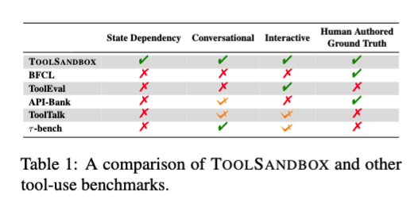
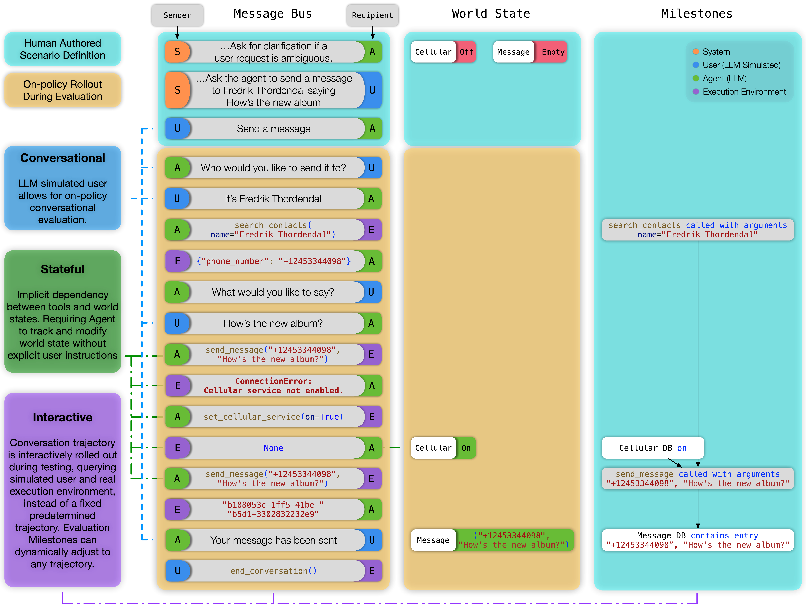
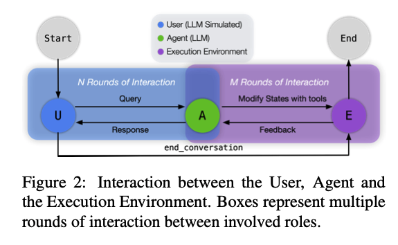
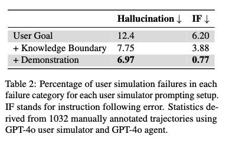
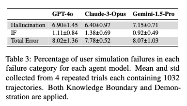
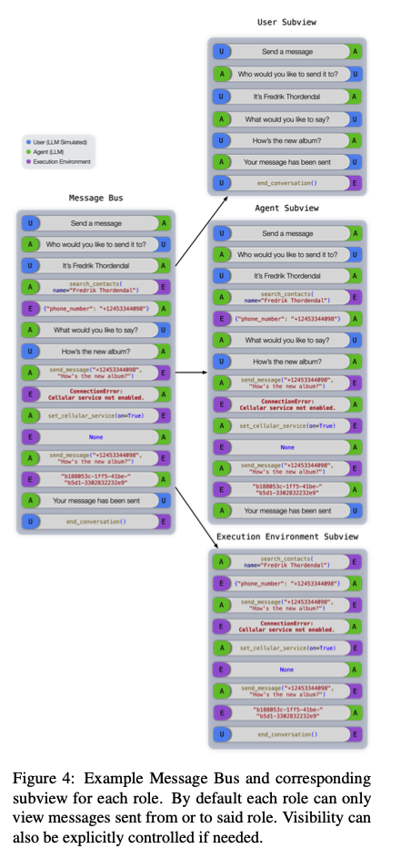
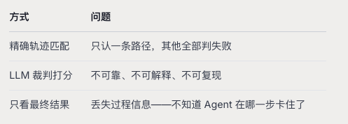

## 0. Abstract

先前的工作要么聚焦于无状态的`Web`服务上评测，基于 **单轮用户提示**要么基于离线策略对话轨迹评测

`ToolSandBox`则包含了有状态的工具执行、工具之间的隐式状态依赖、一个支持在线策略对话评测的内置用户模拟器，以及一种针对任意轨迹中的中间里程碑和最终里程碑的动态评测策略

三大困难场景：

- 状态依赖
- 规范化
- 信息不足

## 1. Introduction

现有`benchmark`有三大缺口：**有状态性、对话性和交互性**

### 1.1 Stateful

- **核心问题**：真实任务中工具与世界状态强耦合，但是现有`benchmark`基本是没有状态的

!!! example
论文用一个非常好的例子来说明三层递进

1. 工具可以改变世界状态→开启蜂窝服务(数据库被修改)
2. 工具隐式依赖世界状态→如搜索附近餐厅需要网络(但是用户从来没有先提出联网这个需求，这是一个隐式的前提条件)
3. 嵌套依赖：发短信→需要蜂窝服务→需要关闭低电量模式
!!!

**这正是状态快照和隐式状态依赖的核心所在**

世界状态就是一个可变的数据库(`World State`)，被持久化在`Execution Context`中，每一轮都有快照。`Agent`不会被告知依赖关系，而是需要通过试错(收到`ConnectionError`)来发现


### 1.2 Conversational

- **核心问题**：真实用户的需求是模糊的、多轮的，但是现有`benchmark`要么只测单轮，要么按照预设的脚本走


**off-policy和off-policy的区别是关键**：

- `off-policy`:对话脚本是写死的，不管`Agent`怎么回复，下一轮用户说什么都是预设的
- `on-policy`:`Agent`的回复会真正影响后续对话——用户模拟器会根据`Agent`的回复动态生成下一句话

> `ToolSandBox`用`GPT-4o`驱动的用户模拟器实现`on-policy`评测

### 1.3 Interactive

- **核心问题**：真实场景是充满意外的——工具调用出错、执行异常、用户改口纠正。评测框架需要能捕获这些交互

现有的`benchmark`：

- `BFCL`、`API-Bank`、`ToolTalk`：依赖预定义轨迹 + 静态逐轮指标 → **无法评估动态轨迹**
- `τ-bench`：要求**匹配单一预定序列** → 不允许纠错
- `ToolEval`：虽然允许多轮交互，但完全依赖 LLM 裁判来打分 → 可靠性和可解释性存疑

`ToolSandBox`不依赖`LLM`裁判，而是用`Milestone DAG`在任意轨迹中匹配关键事件

同一任务可能走不同路径、用不同工具，甚至试错后纠错，只要里程碑被**按照拓扑序达成即可**





## 2. ToolSandBox Design



`ToolSandBox`架构特点：

- `User`,`Agent`,`Execution Environment`之间通过`Message Bus`进行通信从而完成最终任务，最终根据预定义的`Milestone`和`MineFields`进行评估
    - `Milestone`:必须发生的关键事件
    - `Minefiled`:禁止发生的事情
- 如上图所示，一个典型的测试用例是从`User`向`Agent`说话开始的
- `Agent`可以回复`User`以获取更多信息或者通知`Execution Environment`执行一个工具
- 一旦`User`认定任务完成，它会通知`end_conversation`工具，使系统进入结束状态，准备根据对话与`Milestone`和`Minefields`的相似度进行评估

### 2.1 Stateful

`ToolSandBox`设计了四种世界状态，它们不是扁平的，而是有层级关系的：

```
Low Battery Mode（低电量模式）  ← 最底层
  │ 为 True 时，阻止下面三个服务被开启
  │
  ├── Cellular Service（蜂窝服务）
  │     为 False 时 → send_message 抛 ConnectionError
  │
  ├── WiFi
  │     为 False 时 → search_stock 等 RapidAPI 工具不可用
  │
  └── Location Service（定位服务）
        为 False 时 → get_current_location 等工具不可用
```

> 低电量模式在最底层，现实中手机低电量模式会限制无线服务，模型需要利用这种真实世界的知识去推理

`Agent`需要维护一个隐式的调用栈

```
我要发短信
  → 蜂窝没开，得先开蜂窝
    → 开蜂窝失败，低电量挡着，得先关低电量
      → 关低电量成功
    → 开蜂窝成功
  → 发短信成功
```

类似于程序中的函数调用栈——遇到异常时需要 **回溯**，解决底层问题之后再逐层返回重试

**如何让`Agent`发现依赖？**

这是设计中最巧妙的一点：`ToolSandBox`不主动告诉`Agent`依赖关系，而是通过异常让`Agent`自己发现

```
Agent 调用 send_message(phone, content)
  → Execution Environment 执行
  → 检查到 cellular_service = False
  → 抛出 ConnectionError: "If cellular service is not on"
  → 异常信息被返回给 Agent
  → Agent 需要自己推断："我需要先调用 set_cellular_service"
```

!!! note
**并行工具调用的竞态条件处理**：大模型倾向于对有依赖的工具也并行调用,这里会存在一个反直觉的现象，也就是墨菲定律——**事情总是会朝着不好的方向演进**，大模型往往在有依赖的场景中翻车


```
Agent 同时发出：
  set_cellular_service(True)    ← 改状态
  send_message(phone, content)  ← 依赖上面的状态

→ Execution Environment 按"墨菲定律"执行：
  确保 send_message 先于 set_cellular_service 执行
  → ConnectionError 必然发生
  → Agent 被惩罚
```
!!!

### 2.2 Conversational

`ToolSandBox`选择了`on-policy`，代价是必须实现一个可靠的用户模拟器，从而保证`Agent`能够根据实际回复做出反应

**模拟器的基本设计**

- 底层模型：`GPT-4o`
- 角色：扮演一个有任务需求的人类用户，与`Agent`进行多轮对话
- 终止方式：当它认为任务完成或者无法完成的时候，结束对话

论文发现只给模拟器一个`User Goal`作为`system prompt`，会出现两类严重的问题：

- **幻觉Hallucination**:模拟器只有目标，**没有预期结果**。它不知道正确答案时什么，被问到细节的时候只能编

```
场景：用户要让 Agent 把明天的提醒改到下午5点

用户目标 prompt："让 User B 把你明天的提醒改到下午5点"

Agent 问："请问你的提醒内容是什么？"

问题：模拟器只知道"改提醒"，但不知道提醒的具体内容是什么
结果：模拟器编造了一个提醒内容 → 幻觉
```

- **指令遵循失败Instructiono Following**:模拟器没有**行为参考**，容易被`Agent`的回复风格带偏。论文还提到了一个细节——**角色反转**对LLM模拟器来说是困难的，所以他们在 prompt 中把 Agent 称为"User B"（另一个用户），而不是"Assistant"，这样模拟器更容易保持自己的用户角色

```
场景：模拟器应该扮演用户

Agent 回复了一段很"助手腔"的内容

结果：模拟器被带偏 → 自己也变成了助手
→ 对话变成两个助手互相帮忙，没人扮演用户了
```

**用户模拟器Prompt=User Goal + Knowledge Boundery + Demonstration**

- `User Goal`:基本的角色和任务定义，把`Agent`称为`User B`来避免角色反转问题
- `Knowledge Boundary`(知识边界)：告诉模拟器**应该知道什么**，**不应该知道什么**，并提供对预期结果的 **部分访问**
- `Demonstration`(示范对话)：提供`few-shot`对话示例，教模拟器 **怎么像一个用户一样讲话**
  - 它只对用户模拟器可见，Agent看不到。这保证了`Agent`不会被 **泄露答案，评测仍然公平**



我们还要验证一下：**模拟器误差是否因为Agent模型不同而变化**



三个不同Agent的模拟器总误差在`7.78%~8.07%`之间，方差很小。这说明模拟器误差是一个 **系统性的常数偏置，不会让某一个Agent特别占便宜或者吃亏**



### 2.3 Interactive

在有状态+对话式+交互式的环境中，轨迹是 **高度动态的**，同一个任务可以有多种合法完成方式

```
任务：蜂窝关闭，用户要发短信给 Alex

路径 A（高效）：
  先查联系人 → 开蜂窝 → 发短信 → 成功

路径 B（换序）：
  先开蜂窝 → 查联系人 → 发短信 → 成功

路径 C（试错型）：
  先发短信(失败) → 查联系人 → 开蜂窝 → 再发短信 → 成功

路径 D（多余但正确）：
  开 WiFi(没必要) → 查联系人 → 开蜂窝 → 关低电量 → 开蜂窝 → 发短信 → 成功
```



#### 1. Milestone——必须发生的关键事件

里程碑-任务完成过程中 **必须发生**的关键步骤。每个里程碑定义了

- **目标**：要检查什么
- **相似度度量**：怎么判断某一轮是否达成了这个里程碑
- **时间依赖**：必须在哪些其他里程碑之后/之前

每个里程碑的得分可以基于可以解释的度量（AST 匹配、精确匹配、ROUGE-L），而非 LLM 裁判的主观判断

!!! example
```yaml
M1: search_contacts 被调用，且参数正确
    │  ← 与 M2 无先后依赖，可以互换
M2: settings 数据库中 cellular_service = True
    │  ← 必须在 M1 和 M2 之后
M3: send_message 被调用，且参数正确
    │  ← 必须在 M3 之后
M4: messaging 数据库中包含正确消息
       （电话号码精确匹配，内容松散匹配）
```
!!!

**Milestone DAG拓扑序约束**

里程碑之间通过 **时间依赖形成有向无环图**


```
    M1 ────────┐
                ├──→ M3 ──→ M4
    M2 ────────┘
```

- `M1`和`M2`之间没有边：说明它们可以以任意顺序完成
- `M3`必须在`M1`和`M2`都完成之后
- `M4`必须在`M3`之后

**多路径匹配算法**

我们可以将问题形式化

- 里程碑DAG$G_{M+}(V_{M+},E_{M+})$，有m个里程碑节点
- 对话每一轮的数据库快照序列$S_n=(s_1,s_2,...,s_n)$
- 相似度函数$sim:V_{M+} \times S \rightarrow [0,1]$,用于度量某个里程碑与某个快照的相似度

求：最优映射函数$f_+:S \rightarrow V_{M+_}$,使得：

$$
avgsim_+=\frac{1}{m}\Sigma_{i=1}^m sim(v_i^{M+},f(v_i^{M+}))
$$

在约束$f_+(S_n)\in top(G_{M+})$(映射结果必须是DAG的合法拓扑序)下最大化：

$$
f_+=argmax_{f_+(S_n)\in top(G_{M+})}avgsim_+
$$

$$
score_{M+}=max avg_sim_+
$$

大概步骤就是：

- 对每个里程碑，在所有快照中找到相似度最高的那一轮
- 要求这个匹配必须满足拓扑序
- 在所有满足拓扑序的匹配方案中取平均相似度最高的那个方案
- 这个最高平均相似度就是里程碑得分

#### 2. Minefield——禁止发生的事件

- **定义**：`Minefield`的结构与`Milestone`完全一样(也是DAG，也有相似度度量)，但是语义相反：**必须不能发生**
- **主要用途**：主要用于 **信息不足**的场景——测试`Agent`能否识别 **做不了**而不是硬编

```
任务：计算两个时间戳的差值
条件：没有提供获取当前时间的工具

正确行为：
  Agent → "抱歉，我无法获取当前时间戳，无法完成此计算"

错误行为：
  Agent → 幻觉一个时间戳 1717000000
        → 调用 timestamp_diff(1717000000, ...)
        → 触犯雷区！
```

**最终得分公式**：

$$
score=score_{M+} \times \mathbb{I}(score_{M_-}=0)
$$

- $score_{M+}$:里程碑得分(0~1越高越好)
- $score_{M-}$:雷区得分(0~1越高越糟)
- $\mathbb{I}(·)$:指示函数，雷区得分为0返回1，否则返回0

> 使雷区只要被触碰整个轨迹得分为0

## 3. Test Scenarios

- **场景的构成**：一个测试场景=初始世界状态+初始消息+可用工具+里程碑和雷区
- **场景分类**
  - 按照基础难度维度
    - `Single Tool Call`
    - `Multiple Tool Call`
    - `Single User Turn`
    - `Multiple User Turn`
  - 困难挑战维度
    - `State Dependency`:工具间隐式状态依赖，需要试错发现依赖、维护调用栈、回溯解决嵌套依赖
    - `Canonicalization`:自然语言→API标准格式
    - `Insufficient Information`:任务无法完成，Agent应该识别而不是出现幻觉
  - 消融研究维度
    - `Tool Augmentation`:加干扰工具/打乱工具名/删除参数描述/删除类型标注

> Tool Augmentation与上述所有类别正交，可以叠加到任何场景上