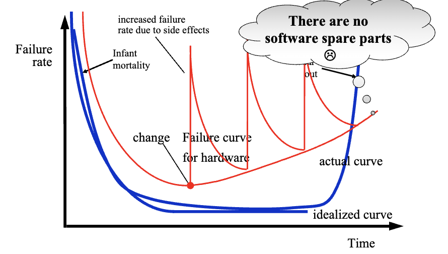
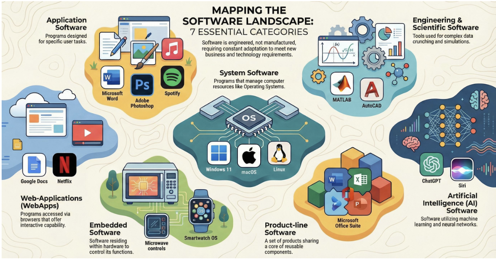
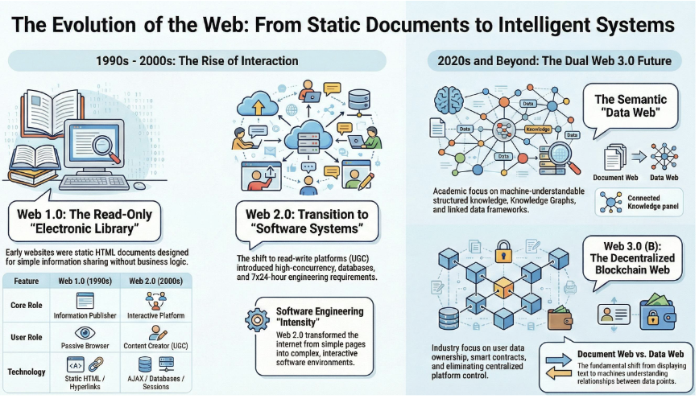

# Ch.1 The Nature of Software

## 1.1 软件的本质

### 软件的演化历史

**早期（史前时代）**
- 软件 = "将一系列指令组合在一起，让计算机做有用的事情"

**1950年代末：高级语言与程序员职业化**

> User ←→ Programmer ←→ Computer

- 计算机变得更便宜、更普及
- 高级语言被发明

**1960年代初：大型系统与"软件危机"**

- 很少有大型软件项目由专家团队成功完成

!!! example "案例：IBM 360操作系统"

- 开发时间：1963年至1966年
- 工作量：5000人年
- 最多1000人投入开发
- 源程序近100万行
- 每个新版本都修正约1000个程序错误

项目负责人F. P. Brooks在其经典著作《人月神话》(The Mythical Man-Month)中总结了这一教训。
!!!

### 软件的定义

软件是一组包含以下内容的配置：

1. **程序 instructions** - 执行时提供所需功能和性能的指令
2. **数据结构 data strucutures** - 使程序能够充分操作信息
3. **文档** - 描述程序的操作和使用

软件是**开发(developed)或工程化(engineered)**的，而不是像传统制造业那样制造出来的。

### 软件的特点

**软件不会磨损，但会老化！**

- 失败率因变更的副作用而增加
- 没有软件备件
- 虽然行业正在向基于组件的组装发展，但大多数软件仍然是定制构建的

### 遗留软件（Legacy Software）为什么必须改变？

1. 软件必须适应新的计算环境或技术
2. 软件必须增强以实现新的业务需求
3. 软件必须扩展以与其他更现代的系统或数据库互操作
4. 软件必须重新架构以在网络环境中保持可行

---

## 1.2 软件性质的演变

### Web应用（WebApps）

现代Web应用不仅仅是带有几张图片的超文本文件：

- 使用XML和Java等工具提供交互计算能力
- 可以为终端用户提供独立功能，或与企业数据库和业务应用集成
- Web 3.0语义网技术已演变为复杂的企业和消费者应用
- 内容的审美仍然是Web应用质量的重要决定因素

### 移动应用（Mobile Applications）

- 驻留在手机或平板电脑等移动平台上
- 用户界面同时考虑设备特性和位置属性
- 通常提供对基于Web的资源和本地设备处理/存储功能的访问
- 移动Web应用允许移动设备通过浏览器访问基于Web的内容
- 移动应用可以直接访问设备硬件

### 云计算（Cloud Computing）

- **SaaS**（软件即服务）
- **PaaS**（平台即服务）
- **IaaS**（基础设施即服务）

特点：
- 提供分布式数据存储和处理资源
- 计算资源位于云外部，可以访问云内的各种资源
- 需要开发包含前端和后端服务的架构
- 前端服务包括客户端设备和应用软件
- 后端服务包括服务器、数据存储和服务器驻留应用
- 云架构可以分段以限制对私有数据的访问

### 产品线软件（Product Line Software）

- 是一组共享共同功能集并满足特定市场需求的软件密集型系统
- 使用相同的应用和数据架构开发
- 使用共同的可重用组件核心
- 共享一组资产：需求、架构、设计模式、可重用组件、测试用例等
- 通过利用产品线中所有产品的共性来开发许多产品

### 软件1.0/2.0/3.0

| 类型 | 描述 |
|------|------|
| **Software 1.0** | 计算机代码，程序员编写固定功能的程序 |
| **Software 2.0** | 神经网络权重，如AlexNet（2012）用于图像识别 |
| **Software 3.0** | LLM提示词，如GPT模型（2019），通过自然语言编程 |

**Andrej Karpathy** 提出的概念：
- 2025年提出 **vibe coding**（氛围编程）
- 通过自然语言提示与AI生成代码
- 强调开发者进入"创意flow"状态

---

## 阅读材料

- Brooks F P. 人月神话[M]. 汪颖, 译. 北京: 清华大学出版社, 2002.
- Andrej Karpathy, Software 2.0
- Andrej Karpathy, Software in the Age of AI
