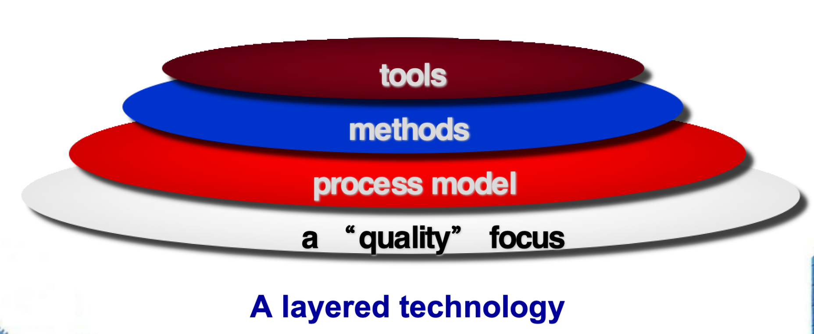

# Ch.2 Software Engineering

## 2.1 软件工程的定义

### IEEE 定义

> **软件工程**是：
> 1. 将系统的(`systematic`)、规范的(`disciplined`)、可量化的(`quantifable`)方法应用于软件的开发、运行和维护；即工程在软件中的应用
> 2. 对上述方法的研究

### 软件工程的三层技术

| 层次 | 描述 |
|------|------|
| **计算机辅助软件工程 (CASE)** | 提供构建软件的技术方法 |
| **软件工程** | 帮助创建高质量产品的路线图 |
| **系统工程** | 关注更大系统中的软件集成 |

!!! note "核心思想"
    软件工程是一种**分层的技术**(A layered technology)，底层是质量保证基础。
!!!

---

## 2.2 软件过程

### 通用过程框架 (Common Process Framework)

**框架活动 (Framework Activities)**

- 通信 (Communication) — 客户协作和需求收集
- 规划 (Planning) — 建立工程工作计划
- 建模 (Modeling) — 创建模型帮助理解需求和设计
- 构建 (Construction) — 代码生成和测试
- 部署 (Deployment) — 软件交付客户评估

**伞活动 (Umbrella Activities)**

- 项目管理
- 专门的技术审查
- 质量保证
- 配置管理
- 可复用性管理
- 工作成果产出
- 风险分析
- 正式技术评审

### 过程适应性 (Process Adaptation)

在实施软件过程时，需要考虑以下方面：

1. 活动、动作和任务的**整体流程**及**相互依赖关系**
2. 每个框架活动中动作和任务的定义程度
3. 工作产品的识别和需求程度
4. 质量保证活动的应用方式
5. 项目跟踪和控制活动的方式
6. 过程描述的详细程度和严谨程度
7. 客户和其他利益相关者的参与程度
8. 软件团队的自主程度
9. 团队组织和角色的规定程度

---

## 2.3 软件工程实践

### 实践的本质(`Essence of Practice`)

软件工程的四个基本步骤：

1. **理解问题** — 通过沟通和分析
2. **规划解决方案** — 建模和软件设计
3. **执行计划** — 代码生成
4. **检查结果** — 测试和质量保证

### 一般原则 (General Principles)

| 原则 | 含义 |
|------|------|
| **提供价值** | 以用户思维思考 |
| **KISS** | Keep It Simple, Stupid! — 大道至简 |
| **保持愿景** | 不忘初心 |
| **换位思考** | 你所生产的，他人会消费 |
| **面向未来** | 考虑长期可维护性 |
| **计划复用** | 提前考虑代码和组件的可复用性 |
| **思考** | 凡事多思 |

---

## 2.4 软件开发误区 (Myths)

### 管理误区 (Management Myths)

!!! warning "误区1：标准流程书"
    **Myth**: 我们有一本包含所有标准和程序的书，这能为团队提供所需的一切。
    **Reality**: 每个人都关心吗？标准是否真正被执行？
!!!

!!! warning "误区2：增加人手"
    **Myth**: 如果进度落后，我们可以增加更多程序员来赶上进度。
    **Reality**: 1 + 1 << 2
    > Brooks定律："向滞后的软件项目增加人手只会让它更加滞后。"
!!!

!!! warning "误区3：外包"
    **Myth**: 如果我们将项目外包给第三方，可以放松让他们去构建。
    **Reality**: 如果你无法管理自己的人员，外包时必然也会遇到困难。
!!!

### 客户误区 (Customer Myths)

!!! warning "误区4：需求晚点再补"
    **Myth**: 只需要一个总体目标就可以开始写程序，细节可以以后再补。
    **Reality**: 这是导致项目失败的主要原因之一。
!!!

!!! example "案例：年轻工程师的故事"

    20世纪60年代末，一位年轻工程师被选中为一个自动化制造应用"写"一个计算机程序。他只参加过计算机编程研讨会，只会汇编语言和Fortran，对软件工程和项目进度跟踪一无所知。

    - 第一周：他说"75%完成了"
    - 第二周：他说"遇到一些小问题"
    - 之后：他一直保持"90%完成"状态，直到项目结束一个月后才完成
!!!

!!! warning "误区5：需求变更"
    **Myth**: 项目需求会不断变化，但变更很容易适应，因为软件是灵活的。
    **Reality**: 变更的影响：

    | 阶段 | 成本倍数 |
    |------|----------|
    | 需求定义 | 1x |
    | 开发阶段 | 1.5-6x |
    | 发布后 | 60-100x |
!!!

### 从业者误区 (Practitioner’s Myths)

!!! warning "误区6：写完程序就完事了"
    **Myth**: 程序写完并能运行，我们的工作就完成了。
    **Reality**: 软件开发完成后，60-80%的工作量才刚开始。
!!!

!!! example "游船管理系统案例"

    初始需求：统计租船次数和平均租船时间

    第一次变更：输出最长租用时间

    第二次变更：将报告分上午和下午输出

    第三次变更：当通信线路出问题能删除不完整的租船信息

    > 需求像滚雪球一样越滚越大...

!!!

!!! warning "误区7：程序就是一切"
    **Myth**: 成功的项目唯一交付的工作产品就是可运行的程序。
    **Reality**: 可运行程序只是软件配置的一部分，还包括文档等。
!!!

!!! warning "误区8：文档无用论"
    **Myth**: 软件工程会产生大量不必要的文档，会减慢我们的速度。
    **Reality**: 软件工程不是关于创建文档，而是关于创建质量。更好的质量减少返工，更快的交付时间。
!!!

!!! note "结论"
    正式技术评审是一种质量过滤器。
    维护人员的工作至关重要！
!!!
---

## 阅读材料

- Brooks F P. 人月神话[M]. 汪颖，译. 北京：清华大学出版社，2002.
